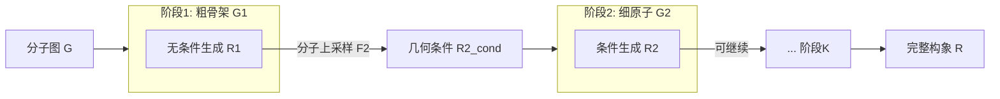

# Hierarchical Multi-Scale Molecular Conformer Generation

**会议**: ICLR 2026  
**OpenReview**: [https://openreview.net/forum?id=uYlNjHC7ag](https://openreview.net/forum?id=uYlNjHC7ag)  
**代码**: [https://github.com/Taserita/MSGEN-Full](https://github.com/Taserita/MSGEN-Full)  
**领域**: 计算生物 / 分子构象生成 / 扩散生成模型  
**关键词**: 分子构象生成, 多尺度层次生成, 几何引导, 分子上采样, 扩散模型, 即插即用框架  

## 一句话总结
MSGEN 把分子构象生成拆成"粗骨架→细原子"的多阶段层次过程，用前一阶段生成的关键子结构位置作为几何引导，并配上一套尊重化学连接性的"分子上采样"来弥合尺度差，从而以即插即用的方式让 GeoDiff / ET-Flow / EBD 等多种生成模型产出更稳定、更化学合理的构象。

## 研究背景与动机
**领域现状**：分子构象生成（从 2D 分子图预测 3D 几何）是药物发现和材料设计的基础任务，近年扩散模型（GeoDiff）、torsion 扩散（TorsionDiff）、流匹配（ET-Flow）等深度生成模型已能产出多样且较准确的构象。

**现有痛点**：现有方法大多只在**单一尺度**上工作——要么直接对原子坐标去噪、要么只建模扭转角等局部几何，忽略了分子天然的层次组织结构。即便是引入结构先验的工作，也各有缺陷：SubgDiff 在子图内去噪保住局部连通性，却破坏全局一致性；Fragment 级方法（EBD 等）虽然保留粗粒度特征并尝试 coarse-to-fine，但**对所有片段一视同仁**，无视它们在功能重要性和构象柔性上的差异。

**核心矛盾**：分子并不是均匀的原子云——刚性环系、重原子骨架（scaffold）是定义整体几何分布的"锚点"，柔性侧链的空间排布往往**条件于**这些关键子结构的位置。可现有生成器没有显式约束这些关键子结构，导致生成的构象"局部合法、全局失真"。作者用一个前置实验（Table 1）直接验证了这点：把重原子骨架的真值位置作为几何引导，COV-R 从 64% 飙到 99.58%、MAT-R 从 1.14 降到 0.50，远胜局部 / 片段引导。

**本文目标**：把这种"关键子结构位置"的几何引导变成生成可用的归纳偏置——但难点是推理时只有分子图、拿不到真值引导。

**核心 idea**：**层次多尺度生成**——定义一个从粗到细的嵌套子图序列 $G_1 \subset G_2 \subset \cdots \subset G_K = G$，每个细尺度阶段以上一个粗尺度阶段**自己生成**的结构作为几何引导，并用**分子上采样**把粗尺度坐标对齐成细尺度可用的条件输入，逐级把骨架的空间约束传播下去。

## 方法详解

### 整体框架
MSGEN 是一个套在已有生成模型外面的**即插即用多阶段框架**。给定分子图，先生成最粗的关键子结构（如重原子骨架）坐标，再把它通过分子上采样转成下一阶段的几何条件，逐级细化直到补全所有原子（如氢原子）。每个阶段都是一个独立的（扩散 / 流匹配）生成模型，阶段之间靠"上一阶段输出 → 上采样 → 当前阶段条件"串联。主实验用 2 阶段（重原子骨架 + 氢原子），还可扩展到 3 阶段（Murcko 骨架核心环系 + 重原子 + 氢）。

### 关键设计

**1. 多尺度层次条件生成：用前一阶段输出当几何引导。** 框架把构象分布分解为 $p_{\theta_1}(R^1|G^1)$（首阶段无条件）和后续的 $p_{\theta_k}(R^k|G^k, R^{k-1})$。每个阶段都用独立的前向加噪过程 $q_k(R^k_t|R^k_0)=\mathcal{N}(R^k_t;\sqrt{\bar\alpha^k_t}R^k,(1-\bar\alpha^k_t)I)$，因此可为不同尺度量身构造训练分布。反向去噪时，首阶段直接生成粗结构 $R^1$；后续阶段的均值网络额外吃一个由上一级坐标导出的几何条件 $R^k_{cond}=F_k(R^{k-1},G^{k-1},G^k)$，即 $p_{\theta_k}(R^k_{t-1}|G^k,R^k_t,R^k_{cond})$。采样时逐级用上一阶段**采样得到**的 $\hat R^{k-1}$ 计算条件，从而把粗尺度骨架的空间安排一路传递到细尺度。这套设计与具体生成器解耦——DDPM、score matching、flow matching 都能套。

**2. 分子上采样：尊重化学连接性的锚点式坐标补全。** 直接拿粗尺度 $R^{k-1}$ 当条件会有尺度不匹配（粗结构只有 $m$ 个原子，细结构有 $n$ 个），而视觉里的插值 / 转置卷积又不适合连续的 3D 分子。作者改为沿化学图做补全：先对分子图做**拓扑排序**（Algorithm 1），从粗 / 细原子的边界原子出发得到一个上采样顺序 $O$，保证补全时每个原子都有已定位的邻居、且无环。然后按序为每个细原子分配坐标（Algorithm 2）：把已定位邻居的均值当锚点，再加一个受控随机扰动
$$R_{cond}[i]=\frac{1}{|N(i)\cap P|}\sum_{j\in N(i)\cap P}R_j + \tau\cdot d_i,\quad d_i\sim\mathcal{N}(0,I),$$
其中 $\tau$ 控制采样半径、$d_i$ 在保持结构连续性的同时引入空间多样性，定位后把该原子加入已定位集合 $P$。消融显示这种基于连接性的锚点采样明显优于"随机高斯"和"全放质心"两种朴素替代。

**3. 条件增强：在训练时模拟推理的粗尺度噪声以消除分布漂移。** 训练时用真值 $R^{k-1}_0$ 构造条件，但推理时只能用采样近似 $\hat R^{k-1}$，二者偏差会在多阶段间逐级累积。为此作者在训练阶段对真值粗结构注入受控噪声：选一个小步 $s$，按扩散前向 schedule 扰动 $R_s=\sqrt{\bar\alpha^{k-1}_s}R^{k-1}_0+\sqrt{1-\bar\alpha^{k-1}_s}\,\varepsilon$，再过上采样 $R^k_{cond}=F_k(R_s,G^{k-1},G^k)$，让细尺度模型学会在"粗结构的受控变体"上做条件。为避免对每个 $s$ 单独重训，作者借鉴 cascaded diffusion 的做法，在一组 $T_s$ 上对随机 $s$ 做摊销训练。

**4. 解耦的层次 ELBO 训练目标。** 作者证明了框架在条件增强下的证据下界（Proposition 1），其关键结论是 ELBO **可按阶段解耦**，于是每个阶段可独立地用标准去噪损失训练：$L(\theta_k)=\mathbb{E}_{t,R^k_0,\varepsilon}[\|\varepsilon-\varepsilon_{\theta_k}(R^k_t,G^k,R^k_{cond},t)\|]$，首阶段退化为无条件去噪损失。这让多阶段框架训练既有理论支撑又工程上简单——每个阶段就是一个普通生成模型，只是多吃一路几何条件。

## 实验关键数据

### 主实验表格
GEOM-Drugs 几何评测（δ=1.25Å），MSGEN 一致提升骨干模型：

| 模型 | COV-R Mean↑ | MAT-R Mean↓ | COV-P Mean↑ | MAT-P Mean↓ |
|------|------|------|------|------|
| RDKit | 45.74 | 1.5376 | 54.79 | 1.3341 |
| ConfGF | 62.15 | 1.1629 | 23.42 | 1.7219 |
| GeoDiff | 87.86 | 0.8686 | 60.17 | 1.1871 |
| **GeoDiff+MSGEN** | **90.41** | **0.8424** | **66.26** | **1.1217** |

化学性质 MAE（QM9 子集，eV）：GeoDiff 的平均能量 $\bar E$ 误差 0.2597→**0.1795**、HOMO-LUMO 平均 gap $\triangle\epsilon$ 0.3091→**0.2035**，全部下降。

### 消融实验表格
跨骨干 + 多阶段（GEOM-Drugs）：

| 骨干 | 变体 | COV-R Mean↑ | MAT-R Mean↓ |
|------|------|------|------|
| GeoDiff | baseline | 87.86 | 0.8686 |
| GeoDiff | +MSGEN(2-stage) | 90.41 | 0.8424 |
| GeoDiff | +MSGEN(3-stage) | **91.05** | **0.8410** |
| ET-Flow | baseline | 74.47 | 0.5514 |
| ET-Flow | +MSGEN(2-stage) | 80.50 | 0.4579 |
| ET-Flow | +MSGEN(3-stage) | **81.91** | **0.4363** |
| EBD | baseline | 92.10 | 0.8292 |
| EBD | +MSGEN(2-stage) | 91.92 | 0.8257 |

逐阶段层次消融（粗层原子质量）：From scratch COV-R 87.86 → After Stage 1 89.17 → After Stage 2 90.41，逐级提升。

### 关键发现
- **即插即用且普适**：在 GeoDiff（DDPM）、ConfGF（score matching）、ET-Flow（flow matching）、EBD（blurring diffusion）四类不同生成范式上都带来提升，ET-Flow 上 MAT-R 降幅最大（0.55→0.44）。
- **更多化学先验=更好**：3 阶段（加 Murcko 骨架）稳定优于 2 阶段，说明结构分解越贴近化学层次，收益越大。
- **域泛化强**：Drugs 训练、QM9 直接测（δ=0.5Å），GeoDiff+MSGEN COV-R 74.94→83.73，反超多个在 QM9 上训练的基线。
- **更省步数**：同等总扩散步数下，2 阶段 MSGEN+GeoDiff 在多数指标更优且平均生成时间更短，扩散步利用更高效。
- **三个组件各有贡献**：分子上采样优于随机 / 质心采样；去掉条件增强 MAT 指标变差。

## 亮点与洞察
- **把"分子的层次组织"显式写进生成过程**：不是再发明一个新生成器，而是揭示"关键子结构位置是定义全局分布的锚点"，并用前置实验（骨架真值引导把 COV-R 推到 99.58%）给出了强有力的动机证据，逻辑链条干净。
- **分子上采样是巧思**：在非欧的分子图上做"上采样"，用拓扑排序+锚点均值+受控噪声解决跨尺度坐标补全，比照搬视觉插值更尊重化学连接性。
- **理论与工程兼顾**：层次 ELBO 证明了按阶段解耦的合法性，让多阶段训练退化成"每阶段一个普通去噪损失"，落地成本低。
- **框架而非模型**：与底层生成范式解耦，对 DDPM / score / flow / blurring 全适用，可扩展阶段数注入领域先验，实用价值高。

## 局限与展望
- **阶段划分依赖化学先验**：粗 / 细子图（重原子 vs 氢、Murcko 骨架）靠人工化学知识切分，缺少自动学习层次的机制；对非药物类、缺乏明确 scaffold 的分子可能不易划分。
- **误差跨阶段传播**：虽有条件增强缓解，但首阶段若生成失败，后续阶段会受其错误锚点拖累，论文也提到需做失败案例分析（附录）。
- **多阶段=多模型**：每个阶段一个独立生成器，训练 / 存储成本随阶段数增长；3 阶段虽更好但代价更高。
- **评测仍限标准小分子基准**：GEOM-QM9 / Drugs 是有机小分子，作者展望扩展到蛋白质、聚合物等天然层次更强的体系，但尚未实证。

## 相关工作与启发
- **层次扩散**：视觉里的 cascaded diffusion（粗到细多阶段）是直接思想来源，本文摊销训练也借鉴了 Ho et al. 2022 的做法；分子侧 EBD（blurring diffusion 从片段恢复全原子）是最接近的前作，但它对所有片段一视同仁、缺多尺度感知。
- **分子构象生成**：GeoDiff（坐标去噪）、TorsionDiff（扭转角）、MCF（图到点的函数扩散）、ET-Flow（流匹配）构成被增强的骨干生态；SubgDiff（子图去噪）代表局部引导路线。
- **等变深度学习**：SO(3) 等变 / 不变网络（EGNN、TFN 等）是各阶段去噪网络的基础，保证几何对称性。
- **启发**："把领域固有的层次结构显式编码进生成的多阶段条件链"是一个可迁移的范式——凡是数据有粗到细的天然组织（蛋白质二级 / 三级结构、点云、场景图），都可考虑"前一尺度自生成结果当后一尺度引导 + 尊重拓扑的上采样"这套思路。

## 评分
- **新颖性**: ⭐⭐⭐⭐ 把分子层次组织显式建模为"自生成的多尺度几何引导链"，并配套分子上采样与解耦 ELBO，视角新且自洽；个别组件（cascaded diffusion、条件增强）借鉴已有思想。
- **实验充分度**: ⭐⭐⭐⭐ 跨 4 类生成范式、2/3 阶段、几何+化学性质+域泛化+效率多维评测，消融覆盖三大组件；但仍限于 GEOM 小分子基准，蛋白 / 聚合物只是展望。
- **写作质量**: ⭐⭐⭐⭐ 动机用前置实验量化支撑、方法层层递进、图表清晰；算法伪代码与 ELBO 命题完整。
- **价值**: ⭐⭐⭐⭐ 即插即用、与生成器解耦、可注入领域先验，对药物发现 / 材料设计的构象生成有直接实用意义。

<!-- RELATED:START -->

## 相关论文

- [\[ICML 2025\] Efficient Molecular Conformer Generation with SO(3)-Averaged Flow Matching and Reflow](../../ICML2025/computational_biology/efficient_molecular_conformer_generation_with_so3-averaged_flow_matching_and_ref.md)
- [\[ICLR 2026\] h-MINT: Modeling Pocket-Ligand Binding with Hierarchical Molecular Interaction Network](h-mint_modeling_pocket-ligand_binding_with_hierarchical_molecular_interaction_ne.md)
- [\[ICLR 2026\] FACET: A Fragment-Aware Conformer Ensemble Transformer](facet_a_fragment-aware_conformer_ensemble_transformer.md)
- [\[ICLR 2026\] FragFM: Hierarchical Framework for Efficient Molecule Generation via Fragment-Level Discrete Flow Matching](fragfm_hierarchical_framework_for_efficient_molecule_generation_via_fragment-lev.md)
- [\[ICML 2025\] SToFM: a Multi-scale Foundation Model for Spatial Transcriptomics](../../ICML2025/computational_biology/stofm_a_multi-scale_foundation_model_for_spatial_transcriptomics.md)

<!-- RELATED:END -->
