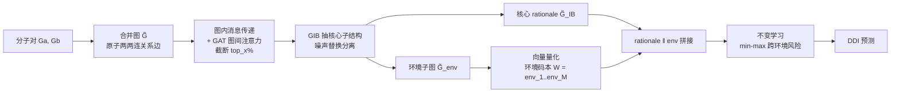

# I2Mole: Interaction-aware Invariant Molecular Learning for Generalizable Drug-Drug Interaction Prediction

**会议**: ICLR 2026  
**OpenReview**: [https://openreview.net/forum?id=IqwF00TCmf](https://openreview.net/forum?id=IqwF00TCmf)  
**代码**: [https://anonymous.4open.science/r/I2Mol-C616](https://anonymous.4open.science/r/I2Mol-C616)  
**领域**: 计算生物 / 分子关系学习 / 图信息瓶颈 / 不变学习  
**关键词**: 药物相互作用 (DDI), 分子关系学习, 图信息瓶颈 (GIB), 不变学习, 向量量化, OOD 泛化  

## 一句话总结
I2Mole 把一对药物分子拼成一张「合并图」，先用注意力建模原子间的跨分子相互作用，再用改进的图信息瓶颈抽出决定性核心子结构（rationale），并用向量量化把训练集环境聚成一本「环境码本」当作可控噪声源做不变学习，从而在归纳和跨域分布偏移下都能稳健预测药物相互作用。

## 研究背景与动机

**领域现状**：药物相互作用（DDI）预测是计算药学的关键任务——两种药物联用可能产生协同或不良反应。主流做法把分子建成图、用 GNN 抽取「核心子结构 / rationale」来提升可解释性与泛化能力，代表工作如 CGIB、MoleOOD。

**现有痛点**：作者指出两个被忽视的硬伤。其一是**分子相互作用建模不足**——现有方法擅长刻画单个分子的关键子结构，但当两药联用时，起决定作用的子结构会发生显著迁移。比如普萘洛尔（β-阻滞）和维拉帕米（钙通道阻滞）单独看各有各的药效基团，联用时两者的药效基团相互作用反而会过度抑制心脏传导，引发心动过缓——只看单分子根本捕捉不到这种跨分子的"化学反应"。其二是**泛化能力欠缺**——真实场景里训练/测试分子常来自不同分布（OOD），而朴素的噪声注入有三个坑：仿真噪声不能真实反映化学空间的环境向量、无差别注入会破坏语义信息阻碍收敛、噪声方差太小又会让噪声效果消失。

**核心矛盾**：要么忠实建模跨分子相互作用却没法泛化，要么为了泛化注入随机噪声却破坏了化学语义。

**本文目标**：在同一个框架里既显式建模原子级的跨分子相互作用，又用「来自真实化学空间」的环境表示做不变学习。

**核心 idea**：**合并图 + 改进 GIB + 环境码本**——把分子对拼成合并图、用注意力筛选真正重要的原子间关系边、用 GIB 抽核心子结构、再把抽出的"非核心环境子图"用 VQ 离散化成有限个环境类别，让环境本身既是噪声源又保留化学语义。

## 方法详解

### 整体框架
I2Mole 分四步：先把两个分子的原子两两连边构造**合并图**，在图内做带全局特征的消息传递、在图间用 GAT 算关系边权重并截断保留 top_x%；再用**图信息瓶颈（GIB）**从合并图里抽出核心子结构 $\tilde{G}_{IB}$（rationale），同时把被"噪声替换"出来的节点收集成环境子图 $\tilde{G}_{env}$；接着对环境子图做**向量量化**建一本环境码本，把无穷的环境空间聚成 M 个离散环境；最后把 rationale 与各环境向量拼接做**不变学习**，最小化跨环境的最大风险。

### 关键设计

**1. 合并图与跨分子相互作用建模：把"两个分子"变成"一张能对话的图"。** 自发的分子相互作用往往发生在特定结构（如 -OH、=O、N）上，所以作者把两药 $G_a,G_b$ 的原子两两连上加权关系边构成合并图 $\tilde{G}=\{R,E,V,U\}$。图内消息传递时键特征 $e_{ij}$ 会同时聚合两端原子特征和全局特征 $u$；图间则用 GAT 计算每条关系边的注意力权重 $r_{ij}=\text{LeakyReLU}(\text{FC}(Wv'_{ai},Wv'_{bj}))$。关键在于不是所有原子对都重要——作者对 $r_{ij}$ 做**全局排序只保留 top_x%**，$r'_{ij}=r_{ij}$ 当 $r_{ij}\ge X$ 否则置 0，对极少发生的原子对用迭代截断限制其消息传递。这样既聚焦真正强的跨分子相互作用，又适度降低了合并图的复杂度，更新后的原子特征 $v''_{ai}=(1-\sum_j\alpha_{ij})v'_{ai}+\sum_j\alpha_{ij}v'_{bj}$ 把对方分子的信息按重要性融了进来。

**2. 基于 GIB 的核心子结构提取：用信息瓶颈把 rationale 和噪声切开。** 在合并图上优化 $\tilde{GIB}=\arg\min_{\tilde{G}_{sub}} -I(Y;\tilde{G}_{sub})+\beta I(\tilde{G};\tilde{G}_{sub})$，前一项靠交叉熵预测损失 $L_{pre}$ 拉满与标签的互信息，后一项靠**噪声注入**压缩与原图的互信息。具体做法很巧：给每个节点学一个被噪声替换的概率 $p_i=\text{Sigmoid}(\text{FC}(h_i))$，并把与之相连的关系边概率 $p_k/N$ 加进去（体现跨分子关系对节点重要性的贡献），再用 $z_i=\lambda_i h_i+(1-\lambda_i)\epsilon$ 决定保留信息还是替成噪声，$\lambda_i\sim\text{Bernoulli}(p_i)$ 用 concrete relaxation 松弛成可导。被替换出来的 $h^r_i=(1-\lambda_i)h_i$ 正好就是"非核心子结构"，留作下一步的环境素材——一举两得，既压缩了核心子结构又顺手攒出了环境。

**3. 环境码本与不变学习：让噪声来自真实化学空间而非随机数。** 直接对所有可能环境做 min-max 不现实（训练数据有限），作者引入 VQ 建一本可训练的环境码本 $W=\{env_1,\dots,env_M\}$，对环境子图表示 $\tilde{s}_{env}$ 做最近邻查找映射到最近的码字 $env_m$，码本更新损失 $L_{vq}=\|\text{sg}[\tilde{s}_{env}]-env_m\|^2_2+\delta\|\tilde{s}_{env}-\text{sg}[env_m]\|^2_2$（停梯度 + commitment 项，$\delta{=}0.25$）。$L_{vq}$ 收敛后码本就把无限环境空间聚成了 M 个离散环境。不变学习时把 rationale $\tilde{s}_{IB}$ 与每个环境向量拼接喂进分类头，按各环境权重 $\phi_i$ 加权求和交叉熵 $L_{inv}=-\sum_i\phi_i\sum\sum Y\log\Phi(f_{env}(\tilde{s}_{IB}\|env_i))$。这本码本既当可控噪声源优化互信息，又因为来自真实数据而保留了化学语义，避开了随机噪声的三大坑。

整体训练目标 $L_{total}=L_{inv}+L_{pre}+\beta L_{MI}+\gamma L_{vq}$。

## 实验关键数据

数据集为三个常用 DDI 事件预测基准 ZhangDDI、ChChMiner、DeepDDI；对比 8 个 SOTA（DeepDDI、SSI-DDI、CGIB、CMRL、MDF-SA-DDI、DSN-DDI、IE-HGNN、IGIB-ISE）；指标 ACC / AUROC / F1，重复 8 次取均值。

### 主实验（直推 transductive 设置，AUROC %）

| 方法 | ZhangDDI | ChChMiner | DeepDDI |
|------|----------|-----------|---------|
| CGIB | 94.43 | 98.38† | 98.08† |
| CMRL | 94.08 | 98.37 | 98.03 |
| IGIB-ISE | 94.71† | 98.24 | 98.02 |
| **I2Mole (Ours)** | **95.12** | **98.84** | **99.04** |

（†=最强基线）大规模 DeepDDI 上 AUROC 比次优提升 0.98%，中小数据集约 0.45%——数据集越大、药物越多样、DDI 关系越复杂，I2Mole 优势越明显。

### 泛化测试（归纳 inductive + 跨域）

| 设置 | 数据集 | 最强基线 AUROC | Ours AUROC |
|------|--------|---------------|------------|
| Type1（已知×未知药） | DeepDDI | 85.41† | **85.62** |
| Type2（未知×未知药） | ChChMiner | 69.94† | **70.02** |
| 域泛化（ZhangDDI→DeepDDI） | DeepDDI | 68.67† | **68.72** |

所有模型在面对未见药物时性能都下降，但 I2Mole 对未见药物对的敏感度最低；跨域迁移（训练于小数据 ZhangDDI、测于分布迥异的大数据集）也一致领先。

### 消融实验（ZhangDDI）

| 变体 | ACC | AUROC | F1 |
|------|-----|-------|-----|
| w/o VQ（去环境码本） | 74.52 | 83.61 | 74.01 |
| w/o ∆（去跨分子相互作用） | 84.51 | 87.21 | 80.21 |
| w/o GIB（去信息瓶颈） | 84.72 | 87.21 | 81.07 |
| **Ours** | **88.64** | **95.12** | **85.87** |

去掉 VQ 环境码本掉点最狠（AUROC 直接掉 11.5%），说明环境码本是泛化能力的核心来源；跨分子相互作用和 GIB 各自也贡献约 8% AUROC。

### 关键发现
- **环境码本边界清晰**：10 个环境嵌入在 t-SNE 上有明显分界，分子子结构嵌入紧紧围绕对应环境向量——更新码本本质上等价于对分子嵌入做聚类，环境嵌入即聚类中心。
- **环境码编码真实局部环境**：不同环境码的原子组成差异显著（如 Category 7 以碳为主，Category 5/6 氮氧重要），接近真实数据分布，印证了"环境来自真实化学空间"的设计动机。
- **敏感性**：$\beta{=}1\text{E-}4$ 时最佳（过大如 0.1 会崩到 56% ACC），$\gamma$ 在 2E-5~1E-3 区间都较稳健。

## 亮点与洞察
- **"合并图"把分子对建模从拼接表示升级为可对话的统一图**，让 GIB 和注意力能直接作用在跨分子原子关系上，抓住"联用才出现的关键子结构迁移"这个 DDI 的本质难点。
- **环境子图是 GIB 噪声替换的副产品**——被压缩掉的非核心节点恰好就是环境素材，设计上一石二鸟，没有额外引入独立的环境提取模块。
- **用 VQ 把"环境"做成离散码本**是全文最妙的一笔：既解决了 min-max 不变学习训练数据不足的问题，又让噪声源来自真实数据、保留化学语义，干净利落地绕过了随机噪声注入的三大缺陷。

## 局限与展望
- 评测只覆盖三个 DDI 分类数据集（事件分类），未验证回归型分子对任务（如溶质-溶剂的 Gibbs 自由能），作者在引言提到该场景但实验未铺开。
- 环境码本类别数 M、top_x% 截断比例等都是预设超参，码本类别数如何随数据规模自适应、截断比例对不同分子尺度的鲁棒性缺少系统讨论。
- 跨分子原子两两连边的复杂度随原子数平方增长，虽用 top_x% 截断缓解，但对超大分子或长肽链的可扩展性仍待考察（复杂度分析放在附录）。
- rationale 的可解释性主要靠 t-SNE 与原子组成定性展示，缺少与专家标注药效基团的定量对齐验证。

## 相关工作与启发
- **图信息瓶颈系**：CGIB、IGIB-ISE 等把 GIB 用于分子子结构提取，I2Mole 把 GIB 从单分子扩展到合并图，并改造了噪声注入项。
- **不变/OOD 学习系**：MoleOOD、IRM 类工作引入环境变量做不变学习，本文的创新是用 VQ 环境码本把"环境"实例化为来自真实化学空间的离散表示。
- **向量量化**：借鉴 VQ-VAE 的码本机制，但用途从重建表示换成了"环境聚类 + 可控噪声源"，是 VQ 在分子关系学习中的一个新用法。
- **启发**：把"需要泛化的扰动"从随机采样换成"从数据里学到的离散原型"，这一思路对其他需要 OOD 泛化的关系预测任务（蛋白-蛋白、催化剂-底物）都有迁移价值。

## 评分
- **新颖性**: ⭐⭐⭐⭐ — 合并图 + 改进 GIB + VQ 环境码本三件套的组合是新的，尤其"环境码本当可控噪声源且保留化学语义"切中随机噪声注入的痛点；不过各组件（GIB、VQ、不变学习）均为已有技术的迁移组合。
- **实验充分度**: ⭐⭐⭐⭐ — 直推/归纳（Type1/2）/域泛化/scaffold-size 切分多设置覆盖，8 基线 + 完整消融 + 敏感性 + 码本可视化，证据链扎实；但只限三个 DDI 分类数据集，未验证回归任务与更大分子。
- **写作质量**: ⭐⭐⭐ — 动机用普萘洛尔-维拉帕米的真实药理案例讲得很清楚，公式完整；但部分英文表述生硬（如 "exhibits the excited predictive performance"），图表标准差偶有数值突兀。
- **价值**: ⭐⭐⭐⭐ — DDI 预测有明确临床价值，跨分子相互作用建模 + 真实环境码本的设计对计算药学和更广义分子关系学习都有实用与方法论意义。

<!-- RELATED:START -->

## 相关论文

- [\[NeurIPS 2025\] GFlowNets for Learning Better Drug-Drug Interaction Representations](../../NeurIPS2025/computational_biology/gflownets_for_learning_better_drug-drug_interaction_representations.md)
- [\[ICLR 2026\] h-MINT: Modeling Pocket-Ligand Binding with Hierarchical Molecular Interaction Network](h-mint_modeling_pocket-ligand_binding_with_hierarchical_molecular_interaction_ne.md)
- [\[ICML 2026\] Learning the Interaction Prior for Protein-Protein Interaction Prediction: A Model-Agnostic Approach](../../ICML2026/computational_biology/learning_the_interaction_prior_for_protein-protein_interaction_prediction_a_mode.md)
- [\[ICLR 2026\] KGOT: Unified Knowledge Graph and Optimal Transport Pseudo-Labeling for Molecule-Protein Interaction Prediction](kgot_unified_knowledge_graph_and_optimal_transport_pseudo-labeling_for_molecule-.md)
- [\[ICLR 2026\] Quantifying Cross-Attention Interaction in Transformers for Interpreting TCR-pMHC Binding](quantifying_cross-attention_interaction_in_transformers_for_interpreting_tcr-pmh.md)

<!-- RELATED:END -->
