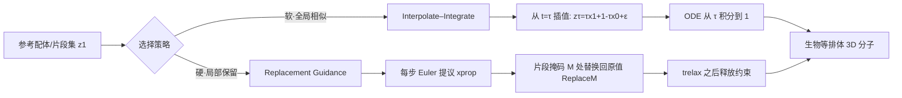

# Interpolation-Based Conditioning of Flow Matching Models for Bioisosteric Ligand Design

**会议**: ICLR 2026  
**OpenReview**: [https://openreview.net/forum?id=b1HJLCzYN5](https://openreview.net/forum?id=b1HJLCzYN5)  
**代码**: [https://github.com/oxpig/cond-semla](https://github.com/oxpig/cond-semla)  
**领域**: 计算生物学 / 3D 分子生成 / 药物设计  
**关键词**: flow matching, 训练无关条件生成, 生物等排体设计, 药效团, SemlaFlow  

## 一句话总结
在预训练的 E(3)-等变 flow matching 分子生成模型上，提出两种**完全无需重训、只在推理时介入**的条件化策略——Interpolate–Integrate（软全局相似）和 Replacement Guidance（硬局部锚定），实现以参考配体/片段集为条件的生物等排体 3D 分子设计。

## 研究背景与动机
- **领域现状**：快速的无条件 3D 生成模型（如 SemlaFlow）已能高质量、大规模采样合法分子；但要把它们用到具体药物设计任务上，通常得为每个新约束**重新训练**一个条件模型。
- **现有痛点**：基于配体的药物设计（LBDD）核心是在不知道蛋白结构时，保留参考配体的关键结合决定因素（形状、药效团），同时优化合成可及性等性质。现有条件生成器各有硬伤——REINVENT 不是 3D 原生、要事后生成构象；SQUID/ShapeMol 只能按整体形状条件化、抓不到细粒度药效团；SOTA 的 ShEPhERD 虽然能联合形状/静电势/药效团条件化，但**每加一个条件通道就得重训**，且多片段场景还要手工构造聚合的 ESP 与交互谱。
- **核心矛盾**：重训带来的高成本与灵活性需求之间的冲突——既想复用强大的预训练基座保持高采样速度，又想对生成做精细、按需的引导。
- **本文目标**：在不动模型权重的前提下，提供模块化、细粒度的推理时控制，生成"不必保留原始片段原子、但保留其关键形状与药效团交互"的生物等排体分子。
- **核心 idea**：**把条件化转化为对 ODE 采样轨迹的两种几何操作**——要么从概率路径中段重启再积分（软），要么在每步 Euler 更新后把片段区域硬性替换回原值（硬）。

## 方法详解

### 整体框架
方法建立在 SemlaFlow（一个联合生成坐标 + 离散化学的 E(3)-等变 flow matching 模型）之上。SemlaFlow 用条件流匹配（CFM）训练一个预测干净数据 $\tilde{z}_1=\mathbb{E}[z_1\mid t,z_t]$ 的网络，坐标走 OT-like 线性路径、原子/键类型走离散 CTMC 路径，用 100 步对数间隔 Euler 求解器采样。两种条件化策略都不碰训练，只改采样器的运行方式：一种从轨迹中间插值后重启（全局软约束），一种在轨迹中持续硬锚定片段（局部硬约束），二者互补。

### 关键设计

**1. Interpolate–Integrate：从路径中段重启的种子引导重采样。** 这是软性、全局的条件化。不像普通生成从纯噪声 $t=0$ 起步，它选一个中间时刻 $\tau\in[0,1]$，先沿 SemlaFlow 的概率路径把种子分子 $z_1$ 朝噪声方向插值得到 $z_\tau$——坐标取 $x_\tau=\tau x_1+(1-\tau)x_0+\varepsilon$（$\varepsilon\sim\mathcal{N}(0,\sigma_\tau^2 I)$ 为可选额外抖动），原子/键类型按 $\mathrm{Cat}(\tau\delta_{a_1}+(1-\tau)\tfrac{1}{|A|}\mathbf{1}_A)$ 这样在 one-hot 真值与均匀分布间线性混合——然后从 $(t,z_t)=(\tau,z_\tau)$ 把 ODE 正向积分到 $t=1$。$\tau$ 是个直观的"保守度"旋钮：$\tau\to1$ 几乎只做小幅编辑、高度保真种子；$\tau\to0$ 退化为无条件生成、改写更激进。可选的噪声注入让几何去相关但不彻底丢掉种子。这是作者所述首个面向 flow matching 确定性 ODE 轨迹的 interpolate-integrate 方案，因其全局软约束、不绑定具体局部原子，特别适合"整体像但允许全局改写"的相似性控制。

**2. Replacement Guidance：带松弛策略的硬性片段锚定。** 这是硬性、局部的条件化，用于多片段生物等排体合并——目标分子不必含确切的片段原子，但要严格保住它们的空间与化学身份。引入一个片段掩码 $M\in\{0,1\}^N$，每步 ODE 积分时先做正常 Euler 提议 $x^{\text{prop}}_{t+\Delta t}=x_t+\frac{\Delta t}{1-t}(\tilde{x}_1-x_t)$，紧接着把掩码区域**整体替换回未扰动的原始片段值** $x_{t+\Delta t}=\mathrm{Replace}_M(x^{\text{prop}}_{t+\Delta t};x^{\text{frag}})$，原子、键类型同理替换（键用 $M\otimes M$ 掩码）。如此得到一个"投影流"：片段被精确保住，而互补区域 $\bar{M}$ 自由演化去合成 linker 或局部替换。约束强度由用户控制——从某个松弛时刻 $t_{\text{relax}}$ 起停止替换（约定最后一步永远自由），或更一般地指定一个松弛步集合 $T_{\text{free}}$（默认只松弛最后一步 $\{t_K\}$）。替换算子与可控松弛策略正是把通用预训练流"改装"成生物等排体合并器的两个新部件。

**3. 严格的推理时介入与零额外开销。** 两种方法都完全在推理阶段操作，且保留 SemlaFlow 原始的 100 步 Euler 调度不变：Interpolate–Integrate 只在积分前做一次 $O(N)$ 的种子插值；Replacement Guidance 每步只加一个轻量的 $O(N)$ 掩码张量更新，相对一次模型前向几乎可忽略。因此两者的推理效率与无条件基线相当——这正是"无需重训"路线相比 ShEPhERD（每加一个条件通道都要重训 + 手工建网格）的核心优势。

## 实验关键数据

在三个药物相关任务上验证：天然产物配体跳跃、生物等排体片段合并、药效团合并。评估指标含 PoseBusters 合法性、合成可及性 SA 分（越低越好）、3D 相似度（ESP/药效团）、AutoDock Vina 对接分。

### 主实验表格

天然产物配体跳跃（NP1，SA<4.5 过滤后）：

| 方法 | Valid ↑ | SA ↓ | Valid(SA<4.5) ↑ | ESP sim ↑ | Pharma sim ↑ |
|------|---------|------|-----------------|-----------|--------------|
| MolSnapper | 26.2% | 6.43 | 0.32% | 0.51 | 0.16 |
| ShEPhERD | 57.3% | 4.75 | 24.7% | 0.63 | 0.34 |
| Interpolate–Integrate | 71.5% | 4.67 | 35.6% | **0.81** | 0.49 |
| Replacement Guidance | 60.5% | **3.74** | **50.2%** | **0.81** | **0.52** |

EV-D68 3C 蛋白酶生物等排体合并（ShEPhERD profile 设置）：

| 方法 | Valid ↑ | SA ↓ | Valid(SA<4) ↑ | Pharma sim ↑ | Vina top10 ↓ |
|------|---------|------|---------------|--------------|--------------|
| DiffSBDD | 43.1% | 6.91 | 0% | — | — |
| ShEPhERD | 33.8% | 4.45 | 10.8% | **0.27** | −6.16 |
| Interpolate–Integrate | 39.5% | 4.96 | 8.7% | 0.18 | −4.84 |
| Replacement Guidance | 31.9% | **3.47** | **23.5%** | 0.22 | **−6.62** |

SARS-CoV-2 Mpro 药效团合并：Replacement Guidance 取得 SA 3.61、Vina top10 −7.63；ProLIF 指纹分析显示两种方法都能**完整复现** 81 个条件片段中观察到的全部交互类型。

### 消融实验表格

| 验证项 | 设置 | 结果 |
|--------|------|------|
| Replacement vs. Inpainting | DiffLinker 集（≥3 个不连通片段） | 干净硬替换 Valid 58.6% vs. 全噪声 inpainting 32.0% |
| Interpolate–Integrate 修复不连通种子 | 改变插值时刻 τ | τ 越小（注噪越多），Valid 从 65.3% 升到 84.4% |

### 关键发现
- 两种策略各有所长：Replacement Guidance 在所有目标上都给出最优 SA 分，适合"硬"约束的片段合并；Interpolate–Integrate 偏保守编辑、ESP/药效团相似度最高，适合高保真保留交互模式。
- 在生物等排体合并上，Replacement Guidance 与 SOTA 的 ShEPhERD 竞争力相当——药效团相似度略低（0.22 vs. 0.27），但合成可及性更优（3.47 vs. 4.45）、Vina 分相当甚至更好（−6.62 vs. −6.16）。
- **速度优势巨大**：单卡 RTX 6000 上一批 10 个分子，Interpolate–Integrate 仅需 2.85 s、Replacement Guidance 3.9 s；ShEPhERD 在 V100 上需 3–4 分钟。

## 亮点与洞察
- **把"重训条件模型"问题重构成"改采样器轨迹"问题**：用插值重启（软）和投影替换（硬）两个纯几何操作覆盖了从全局相似到局部硬约束的连续谱，思路干净且可解释。
- **训练无关 + 模块化**：不动任何权重，因此天然适配蛋白结构未知的纯配体场景，也方便随基座模型升级而升级。
- **自动多片段条件化**：相比 ShEPhERD 需手工构造聚合 ESP/交互谱，本文的 random atom seeding 能自动从原始片段集合采样药效团，逼近手工精修 profile 的性能，降低专家成本。
- **可控松弛策略**很巧妙：通过 $t_{\text{relax}}$ / $T_{\text{free}}$ 在"严格保片段"与"自由合成 linker"之间连续调节，把生物等排体合并的本质（保交互、弃原子）落实到采样步上。

## 局限与展望
- 批处理目前仅支持同一批内相同输入种子，限制了大规模异构条件的并行吞吐。
- 高通量评估管线本身有近似性（如对单一刚性受体对接），药效团相似度仍略逊于专门重训的 ShEPhERD。
- 与已知 binder 相比仍有差距（Mpro 上 Vina −7.63 vs. 已知 binder −9.95），生成分子是"有竞争力的起点"而非终点。
- 性能依赖底层 SemlaFlow 的生成质量与 OT 路径假设；松弛时刻、$\tau$ 等超参需按任务调，缺乏自动选择机制。

## 相关工作与启发
- **无条件 3D 生成基座**：EDM 奠基，SemlaFlow（本文基座）在 GEOM-Drugs 上 87% 成功率且最快。
- **训练时联合条件模型**：SQUID/ShapeMol（按形状）、ShEPhERD（形状+ESP+药效团，但要重训+手工网格）。
- **推理时条件化与编辑**：扩散 inpainting（RePaint）、DiffSBDD、PILOT、MolSnapper（投影药效团点）、FLOWR（等变流匹配做口袋条件）；片段合并/连接的 DiffLinker、LinkerNet、TurboHopp（一致性模型加速）。
- **启发**：在生成模型部署成本越来越高的当下，"训练无关的推理时引导"是把单一强基座撬动到多任务的高性价比路线，本文给 flow matching 提供了一个干净的几何化范式，可推广到其他等变 ODE 生成场景。

## 评分
- **新颖性**: ⭐⭐⭐⭐ 首个面向 flow matching 确定性 ODE 的 interpolate-integrate 条件化方案，加上可控松弛的硬替换，组合新颖、动机清晰。
- **实验充分度**: ⭐⭐⭐⭐ 三个真实药物任务 + 多基线对比 + 两组关键消融，指标全面（合法性/SA/3D 相似/对接/交互复现）。
- **写作质量**: ⭐⭐⭐⭐ 方法形式化清晰，软/硬两条线对照分明，trade-off 讲得透。
- **价值**: ⭐⭐⭐⭐ 无需重训即可复用 SOTA 基座做生物等排体设计，速度比 ShEPhERD 快两个数量级，实用价值高。

<!-- RELATED:START -->

## 相关论文

- [\[ICLR 2026\] Riemannian Variational Flow Matching for Material and Protein Design](riemannian_variational_flow_matching_for_material_and_protein_design.md)
- [\[ICML 2025\] Flexibility-conditioned Protein Structure Design with Flow Matching](../../ICML2025/computational_biology/flexibility-conditioned_protein_structure_design_with_flow_matching.md)
- [\[ICLR 2026\] Multi-Marginal Flow Matching with Adversarially Learnt Interpolants](multi-marginal_flow_matching_with_adversarially_learnt_interpolants.md)
- [\[ICLR 2026\] scDFM: Distributional Flow Matching for Robust Single-Cell Perturbation Prediction](scdfm_distributional_flow_matching_model_for_robust_single-cell_perturbation_pre.md)
- [\[ICLR 2026\] La-Proteina: Atomistic Protein Generation via Partially Latent Flow Matching](la-proteina_atomistic_protein_generation_via_partially_latent_flow_matching.md)

<!-- RELATED:END -->
