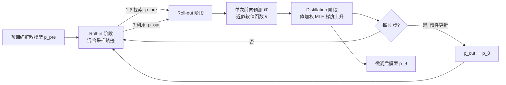

# Iterative Distillation for Reward-Guided Fine-Tuning of Diffusion Models in Biomolecular Design

**会议**: ICLR 2026  
**OpenReview**: [https://openreview.net/forum?id=NFffW9tBmC](https://openreview.net/forum?id=NFffW9tBmC)  
**代码**: [https://divelab.github.io/VIDD/](https://divelab.github.io/VIDD/)  
**领域**: 计算生物学 / 扩散模型微调 / 强化学习  
**关键词**: 扩散模型, 奖励引导微调, 策略蒸馏, 不可微奖励, 蛋白质设计, 分子生成, 软最优策略  

## 一句话总结
VIDD 把"用奖励微调扩散模型"重新表述为**离线策略蒸馏**：用软最优策略当 teacher，通过最小化前向 KL（值加权 MLE）把它蒸馏进 student 模型，从而在蛋白质、DNA、小分子等存在**不可微奖励**的生物分子设计任务上获得比 PPO 类 RL 方法更稳定、更高效的奖励优化。

## 研究背景与动机
**领域现状**：扩散模型已是蛋白质、小分子、调控 DNA 等生物分子设计的主力生成器，但实际应用往往不满足于"生成像训练分布的样本"，而要优化具体的下游奖励——结合亲和力、二级结构匹配、对接分数等。

**现有痛点**：计算机视觉里常用的做法是直接对可微奖励反向传播梯度，但生物分子设计的奖励大多**天然不可微**：DSSP 二级结构匹配靠查表、AlphaFold3 结合亲和力预测、AutoDock Vina 对接分数都是基于物理模拟或科学知识的硬规则，梯度无从谈起。退而求其次用 PPO/DDPO 这类策略梯度方法，又会遇到三个老毛病——训练不稳定、样本效率低、模式坍塌。

**核心矛盾**：作者指出 PPO 类方法的两个根本性质是病灶来源。其一是**on-policy**：训练轨迹由当前微调策略自己生成，探索被锁死在已访问区域附近，容易陷入次优局部最优。其二是它本质上在最小化**反向 KL**（mode-seeking），天生倾向于坍塌到单一模式。

**本文目标**：提出一个能稳定优化**任意（可能不可微）奖励**的扩散模型微调框架，同时避免 on-policy 的探索受限和反向 KL 的模式坍塌。

**核心 idea**（**离线策略蒸馏 + 前向 KL**）：把问题看作"把一个奖励引导的软最优 teacher 策略蒸馏进 student 扩散模型"。teacher 用预训练策略乘以值加权项构造，蒸馏目标是 teacher 与 student 之间的前向 KL，等价于 RL 里的**值加权极大似然（value-weighted MLE）**——这个目标天生支持离线采样（roll-in 分布可以任意），并用前向而非反向 KL，从根上换掉了 PPO 的两个病根。

## 方法详解

### 整体框架
VIDD（Value-guided Iterative Distillation for Diffusion models）把微调拆成三个交替进行的阶段：**roll-in**（用探索性的离线轨迹定义损失计算的数据分布）、**roll-out**（沿 roll-out 策略采样并算出每步的软值，作为蒸馏权重）、**distillation**（在 roll-in 分布上最小化 teacher 与 student 的 KL）。三阶段循环 $S$ 轮，teacher（roll-out 策略）每 $K$ 步才"惰性"刷新一次，让 teacher 和 student 像 RL 的策略改进定理那样逐步对齐、共同爬升。

### 关键设计

**1. 软最优 teacher 策略：把奖励"折"进预训练去噪核**。VIDD 要蒸馏的 teacher 不是凭空设计的，而是熵正则 MDP 框架下自然涌现的软最优策略——它把预训练去噪核 $p^{\text{pre}}_{t-1}$ 乘上一个值加权因子：$p^\star_{t-1}(\cdot|x_t) = p^{\text{pre}}_{t-1}(\cdot|x_t)\cdot\frac{\exp(v_{t-1}(\cdot)/\alpha)}{\exp(v_t(x_t)/\alpha)}$，其中软值函数 $v_{t-1}(\cdot) := \alpha\log \mathbb{E}_{x_0\sim p^{\text{pre}}}[\exp(r(x_0)/\alpha)\,|\,x_{t-1}=\cdot]$ 度量"从当前噪声状态出发，按预训练策略走下去能拿到多高的奖励"。这个构造的妙处在于：按 $\{p^\star_t\}$ 采样得到的终态边缘分布恰好逼近目标分布 $\exp(r(\cdot)/\alpha)p^{\text{pre}}(\cdot)$，也就是奖励最大化问题的理论最优解。换句话说，teacher 天然就是"既高奖励又贴近自然分布"的折中，蒸馏它就等于在逼近最优。

**2. 离线 roll-in：探索与利用的混合采样**。因为蒸馏目标 $\arg\min_\theta\sum_t\mathbb{E}_{x_t\sim u_t}[\text{KL}(p^\star_{t-1}\|p^\theta_{t-1})]$ 里的 roll-in 分布 $u_t$ 可以任意（off-policy），VIDD 得以自由设计训练数据的来源。它采用混合策略：以概率 $1-\beta_s$ 从预训练策略 $p^{\text{pre}}_t$ 采样以保证对设计空间的**广覆盖探索**，以概率 $\beta_s$ 从周期性更新的 roll-out 策略 $p^{\text{out}}_t$ 采样以**利用**student 已学到的高奖励区域。这正是 on-policy 的 PPO 做不到的——后者必须用当前策略采样才能保证梯度无偏，探索被死死绑在策略附近。

**3. 单次前向近似软值函数**。软值函数 (3) 是一个条件期望，严格估计要靠 Monte Carlo 采样或额外训练值网络，代价高昂。VIDD 用一个极简近似：$\hat v_{t-1}(\bar x_{t-1}) := r(\hat x_0(\bar x_{t-1};\theta^{\text{out}}))$——直接拿扩散模型一步预测出的去噪结果 $\hat x_0$ 喂进奖励函数。这相当于把期望换成后验均值，只需一次去噪网络前向传播，既不用 Monte Carlo 多次采样，也不用单独训值网络。这个"posterior mean 近似"在 DPS、test-time guidance 等工作里已被隐式验证有效，VIDD 把它从推理期搬到了微调期。

**4. 值加权 MLE + 惰性目标更新**。把上面三件拼起来，最终的参数更新式 (7) 是 $\theta_{s+1}\leftarrow\theta_s+\gamma\nabla_\theta\sum_i\sum_t\frac{\exp(\hat v_{t-1}(\bar x^{[i]}_{t-1})/\alpha)}{\exp(\hat v_t(x^{[i]}_t)/\alpha)}\log p^\theta_{t-1}(\bar x^{[i]}_{t-1}|x^{(i)}_t)$——一个标准的**值加权极大似然**目标：用软值比当权重，对 student 去噪核做加权对数似然上升。由于经验样本和近似值函数都有噪声，单步无法把 teacher 蒸干净，所以 roll-out 策略（即 teacher）每 $K$ 步才用最新 student 参数刷新一次（"lazy update"）。这个惰性更新是 off-policy 设定下稳定性的关键：它防止 teacher 剧烈跳变，又让 student 持续朝更高奖励渐进改进，类比 RL 里 target network 的作用。

**与策略梯度的本质区别**：作者用 Theorem 1 证明 PPO 的目标 $J(\theta)$ 等价于最小化轨迹分布间的**反向 KL** $\text{KL}(p^\theta_{0:T}\|p^\star_{0:T})$，而 VIDD 的目标更接近**前向 KL**。反向 KL 的 mode-seeking 特性正是模式坍塌的根源，避开它就换来了更稳的优化曲面。

## 实验关键数据

### 主实验表格（蛋白质 / DNA / 分子综合，报告 50% 分位数 ± 95% CI）

| 方法 | Protein β-sheet%↑ | pLDDT↑ | DNA Pred-Activity↑ | ATAC-Acc↑ | Molecule Docking↑ | NLL↓ |
|------|------|------|------|------|------|------|
| Pre-trained | 0.05 | 0.37 | 0.14 | 0.000 | 7.2 | 971 |
| Best-of-N (N=32) | 0.26 | 0.38 | 1.30 | 0.000 | 10.2 | 951 |
| DRAKES（DNA 专用） | - | - | 6.44 | 0.825 | - | - |
| Standard Fine-tuning | 0.48 | 0.30 | 1.17 | 0.094 | 7.8 | 908 |
| DDPP | 0.63 | 0.36 | 5.33 | 0.305 | 7.9 | 981 |
| DDPO（PPO 类） | 0.81 | 0.55 | 7.38 | 0.086 | 8.5 | 929 |
| **VIDD** | **0.83** | **0.82** | **8.28** | **0.820** | 9.4 | **741** |

在 DNA Pred-Activity 上 VIDD（8.28）甚至超过了能直接反向传播可微奖励的专用方法 DRAKES（6.44）；在抗过优化的正交指标 ATAC-Acc 上 VIDD（0.820）远超 DDPO（0.086），说明它不是单纯刷奖励模型而损害真实活性。

### 蛋白质结合设计（PD-L1 / IFNAR2，ipTM 结合亲和力）

| 方法 | PD-L1 ipTM↑ | PD-L1 Reward↑ | IFNAR2 ipTM↑ | IFNAR2 Reward↑ |
|------|------|------|------|------|
| Pre-trained | 0.147 | 0.085 | 0.118 | 0.061 |
| Best-of-N (N=128) | 0.266 | 0.265 | 0.246 | 0.223 |
| DDPP | 0.189 | 0.207 | 0.138 | 0.124 |
| DDPO | 0.788 | 0.877 | 0.240 | 0.314 |
| **VIDD** | **0.818** | **0.908** | **0.509** | **0.512** |

IFNAR2 是更难的靶点，DDPO 的 ipTM 只能到 0.240，而 VIDD 翻倍到 0.509，体现离线探索在困难奖励地形上的优势。

### 关键发现
- **稳定且全面领先**：在蛋白质、DNA、小分子三类、多个奖励上 VIDD 都是微调方法里的最优，且 NLL（自然性，越低越好）也最优，说明高奖励没有以牺牲样本自然性为代价。
- **抗过优化**：ATAC-Acc 这类与训练奖励正交的指标上依旧强，DDPO 在该指标几乎为 0，暴露其过拟合奖励模型的倾向。
- **优于可微基线**：DNA 任务上即便对手能用梯度（DRAKES），离线蒸馏的 VIDD 仍胜出。
- 消融（Appendix E.4）覆盖 roll-in 混合比例 $\beta$、惰性更新间隔 $K$、正则系数 $\alpha$ 等关键超参的影响。

## 亮点与洞察
- **把奖励微调重铸成"策略蒸馏"是观念上的换轨**：teacher（软最优策略）= 预训练核 × 值加权项，蒸馏它天然兼顾高奖励与自然性，避免了显式设计 reward shaping。
- **off-policy + 前向 KL 一石二鸟**：前者解开了 on-policy 对探索的束缚，后者从理论上（Theorem 1）规避了反向 KL 的模式坍塌，两个改动都直指 PPO 的根本病灶。
- **单次前向近似软值**把推理期 guidance 的经验迁到微调期，省掉了独立值网络，工程上非常轻量。
- **统一处理不可微奖励**：DSSP、AlphaFold ipTM、Vina docking 这些查表/模拟型奖励无需可微，方法即插即用，对真实科学场景友好。

## 局限与展望
- **奖励近似的偏差**：用 $r(\hat x_0)$ 的单步去噪预测来近似软值，在去噪早期（$t$ 大、$\hat x_0$ 很糙）可能偏差较大，作者未深入分析这对收敛的影响。
- **超参敏感性**：虽比 PPO 稳，但 $\alpha$、$\beta_s$、$K$ 三个关键超参仍需调，论文把扫描放在附录，正文缺乏对鲁棒区间的总结。
- **多样性下降**：在强奖励优化（如 IFNAR2）下 VIDD 的 Diversity 从 0.90 降到 0.52，奖励-多样性的权衡依然存在。
- **生物安全风险**：作者自己在结论中点明，加速蛋白/药物设计的同时也可能被滥用于有害生物分子生成，呼吁配套安全机制。
- **展望**：与 test-time guidance 正交互补，两者结合有望进一步提升；推广到更大规模蛋白结构扩散、多目标奖励也是自然方向。

## 相关工作与启发
- **可微奖励反向传播**（Clark et al. 2023; Prabhudesai et al. 2023; DRAKES）：CV 里的 SOTA，但要求奖励可微，生物场景多数失效——这正是 VIDD 的切入点。
- **RL 微调扩散**（DPOK/DDPO/DDPP）：PPO 类方法可处理不可微奖励，但 on-policy + 反向 KL 导致不稳定与坍塌，是 VIDD 的主要对照与超越对象。
- **推理期 guidance / Best-of-N / SMC**（Wu et al. 2023; Li et al. 2024; Kim et al. 2025）：可被解释为对软最优策略的近似采样，但推理代价高且不改进底座模型；VIDD 把同样的软值思想搬进训练期，且与之互补可叠加。
- **值加权 MLE / AWR**（Peters et al. 2010; Peng et al. 2019）：VIDD 蒸馏目标的 RL 渊源，作者把这套可扩展、稳定的离线 RL 思路成功移植到扩散模型微调。
- **启发**：当一个生成式对齐问题遇到 on-policy 不稳 + 反向 KL 坍塌时，"换成离线蒸馏一个解析可写的软最优 teacher + 前向 KL"是一条可复用的稳定化路径，可能迁移到语言模型对齐、可控生成等场景。

## 评分
- **新颖性**: ⭐⭐⭐⭐ 把奖励微调统一重铸为软最优策略的离线蒸馏，off-policy + 前向 KL 的组合切中 PPO 痛点，理论（Theorem 1）与算法都有清晰贡献，虽各组件（软值、值加权 MLE）有渊源但整合成框架是新的。
- **实验充分度**: ⭐⭐⭐⭐ 覆盖蛋白序列/结合、DNA、小分子三大类多任务多指标，含抗过优化的正交指标与可微基线对比，消融在附录较完整；正文对鲁棒性区间总结略弱。
- **写作质量**: ⭐⭐⭐⭐ 动机—方法—理论—实验逻辑清晰，三阶段 + 算法伪代码 + 与 PG 的对比讲得透；公式密度高，部分近似的误差分析略浅。
- **价值**: ⭐⭐⭐⭐ 直击生物分子设计中不可微奖励这一真实刚需，方法轻量即插即用、在多任务上稳定领先，对蛋白/药物设计有实际推动力。

<!-- RELATED:START -->

## 相关论文

- [\[ICLR 2026\] Fine-Tuning Diffusion Models via Intermediate Distribution Shaping](fine-tuning_diffusion_models_via_intermediate_distribution_shaping.md)
- [\[ICLR 2026\] Thompson Sampling via Fine-Tuning of LLMs](thompson_sampling_via_fine-tuning_of_llms.md)
- [\[NeurIPS 2025\] Iterative Foundation Model Fine-Tuning on Multiple Rewards](../../NeurIPS2025/computational_biology/iterative_foundation_model_fine-tuning_on_multiple_rewards.md)
- [\[ICLR 2026\] Antibody: Strengthening Defense Against Harmful Fine-Tuning for Large Language Models via Attenuating Harmful Gradient Influence](antibody_strengthening_defense_against_harmful_fine-tuning_for_large_language_mo.md)
- [\[ICML 2026\] Constrained Flow Optimization via Sequential Fine-Tuning for Molecular Design](../../ICML2026/computational_biology/constrained_flow_optimization_via_sequential_fine_tuning_for_molecular_design.md)

<!-- RELATED:END -->
