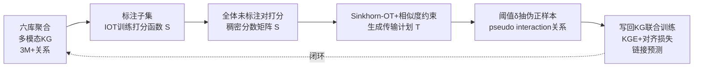

# KGOT: Unified Knowledge Graph and Optimal Transport Pseudo-Labeling for Molecule-Protein Interaction Prediction

**会议**: ICLR 2026  
**OpenReview**: [https://openreview.net/forum?id=UoYdZQIZWj](https://openreview.net/forum?id=UoYdZQIZWj)  
**代码**: 待确认（论文提及匿名仓库）  
**领域**: 计算生物学 / 药物发现  
**关键词**: 分子-蛋白质相互作用、最优传输、伪标签、知识图谱、虚拟筛选、半监督学习  

## 一句话总结
KGOT 把"给未标注分子-蛋白质对打伪标签"建模成最优传输（OT）匹配问题，再把生成的传输计划作为一条新关系写回大规模生物知识图谱联合训练，用 OT + KG 闭环缓解 MPI 任务标签稀缺，在虚拟筛选和链接预测上全面超越 docking 和 DrugCLIP。

## 研究背景与动机
- **领域现状**：分子-蛋白质相互作用（MPI）预测是药物发现与分子功能注释的核心任务。借助 Uni-Mol、ESM 等自监督预训练编码器，分子/蛋白质表示学习已相当成熟，但下游 MPI 预测仍受限于两点。
- **现有痛点①——标签太稀**：每条新的分子-蛋白质相互作用都要靠昂贵缓慢的实验（高通量筛选、docking 模拟）验证，现有数据集（如 PrimeKG、TDC）规模小、偏向特定蛋白家族、注释不一致，深度模型难以学到能泛化的相互作用模式。
- **现有痛点②——模态太窄**：多数方法只用分子结构 + 蛋白序列两种模态，忽略了基因变异、代谢通路、功能注释等同样影响结合的生物学上下文。大型生物知识图谱（如 PrimeKG）虽聚合了异质实体，但本身几乎没有直接的分子-蛋白质边，不是为 MPI 量身定做的。
- **核心矛盾**：知识图谱能提供丰富的多模态上下文，伪标签能补充稀缺的监督信号——但已有工作要么把 KG 当成辅助特征只在观测边上训练，要么用启发式伪标签，二者割裂、且伪标签缺乏全局一致性约束。
- **本文目标**：构建一个统一框架，既整合多模态生物数据，又用有原则的方式生成全局一致的高质量伪标签，并让二者互相增强。
- **核心 idea**：**【把伪标签当成分布匹配】** 不再逐对独立判断，而是用最优传输在分子分布和蛋白质分布之间做全局匹配生成伪标签；**【OT↔KG 闭环】** 把 OT 传输计划当作一条 `pseudo interaction` 新关系写回知识图谱，再联合训练 KG 嵌入与检索模型，让打分学习、伪标签生成、图谱训练三者形成闭环。

## 方法详解

### 整体框架
KGOT 是一条四阶段闭环管线：先聚合六个公开数据库构建含 300 万+ 关系的多模态生物 KG；在仅有的分子-蛋白质标注子集上用逆最优传输（IOT）训练打分函数；对全部未标注对打分得到稠密分数矩阵，用带相似度约束的 Sinkhorn-OT 生成伪标签；最后把伪标签作为新关系写回 KG，与原始边联合做链接预测。

### 关键设计

**1. 逆最优传输训练打分函数：把对比学习升级成传输计划对齐。** 打分函数定义为 $S(x,y)=W(f(x)\oplus g(y))$，其中 $f,g$ 是 Uni-Mol 预训练编码器、$\oplus$ 为拼接、$W$ 可训练。训练时对一个 batch 的 $N$ 对样本构造 ground-truth 代价矩阵 $C_{gt}(i,j)=0$（正对 $j=i$）或 $1$（负对），用 Sinkhorn-Knopp 解出理论最优传输矩阵 $T_{gt}$；再由预测分数得到 $C_{pred}(i,j)=1-S(x_i,y_j)$ 对应的 $T_{pred}$，最小化二者的 KL 散度 $L_{score}=\mathrm{KL}(T_{pred}\Vert T_{gt})$。作者指出 InfoNCE 对比学习其实是该框架的一个特例，而显式对齐传输计划能更好地建模全局匹配结构，让真实对得分高、假对得分低。

**2. 带分子相似度约束的 OT 伪标签生成：让伪标签既匹配分数又尊重化学相似性。** 在全图 $M$ 个分子、$N$ 个蛋白质上，以 $C_{ij}=1-S_{ij}$ 为代价、均匀分布 $r_i=1/M$、$c_j=1/N$ 为边际，求传输计划 $T$。关键创新是引入一条额外约束：用预训练编码器算分子两两余弦相似度 $\mathrm{Sim}_{i,k}$，要求伪标签诱导的相似度 $\mathrm{Sim}^T_{i,k}=\sum_j T_{i,j}T_{k,j}$ 尽量贴近 $\mathrm{Sim}_{i,k}$，把目标改写为 $\min_T \sum_{i,j}T_{i,j}C_{i,j}+\lambda\sum_{i,k}(\mathrm{Sim}_{i,k}-\mathrm{Sim}^T_{i,k})^2$（取 $\lambda=0.1$）。这条约束让相似分子获得相似的蛋白质伪标签，注入化学先验、抑制噪声。

**3. Sinkhorn 迭代 + 梯度修正交替求解：在熵正则 OT 里塞进非标准的相似度项。** 标准熵正则 OT $\min_T \sum T_{i,j}C_{i,j}+\epsilon\sum T_{i,j}\log T_{i,j}$（取 $\epsilon=0.01$）可用闭式 Sinkhorn 迭代解，但相似度二次项破坏了闭式结构。作者用交替优化：先跑若干步 Sinkhorn（$u\leftarrow r/(Kv)$、$v\leftarrow c/(K^\top u)$、$T=\mathrm{diag}(u)K\mathrm{diag}(v)$）逼近边际约束，再按相似度项梯度 $\nabla T_{i,j}=2\lambda\sum_k(\mathrm{Sim}_{i,k}-\mathrm{Sim}^T_{i,k})T_{k,j}$ 做一步 $T\leftarrow T-\eta\nabla T$ 修正，最后投影回可行集（非负 + 重新归一化满足边际）。收敛后对传输质量阈值化 $P_\delta=\{(x_i,y_j)\mid T_{ij}\ge\delta\}$（$\delta=0.5$）抽取高置信伪正样本，$\delta$ 控制精度-覆盖率权衡。

**4. OT↔KG 统一链接预测框架：把伪标签当成图谱里的一种关系。** 把抽出的伪标签矩阵 $T$ 编码成知识图谱中一条全新关系 `pseudo interaction`，与所有真实观测边一起喂给 KG 嵌入模型。优化采用多目标损失：KG 三元组的图嵌入损失 + 让预测交互分数对齐伪标签矩阵的对齐项，使模型在结构化知识与数据驱动信号之间取得平衡。该设计与具体 KGE 架构无关——PairRE、RotatE、MuRE、TorusE、ComplEx-FF 都能即插即用，体现了方法的模型无关性。此外为防数据泄漏，链接预测留出一批不相交的分子-蛋白质边做评测且不参与伪标签生成与训练；虚拟筛选还额外按骨架相似度、序列同一性过滤。

## 实验关键数据

### 主实验：虚拟筛选（zero-shot）

DUD-E 基准（102 个蛋白靶点，22,886 个活性对）：

| 模型 | AUROC (%) | BEDROC (%) | EF@0.5% | EF@1% | EF@2% |
|---|---|---|---|---|---|
| Glide-SP (docking) | 76.70 | 40.70 | 19.39 | 16.18 | 7.23 |
| Vina (docking) | 71.60 | – | 9.13 | 7.32 | 4.44 |
| Planet | 71.60 | – | 10.23 | 8.83 | 5.40 |
| DrugCLIP | 80.93 | 50.52 | 38.07 | 31.89 | 10.66 |
| **KGOT** | **83.45 ± 0.42** | **51.20 ± 0.35** | **39.10 ± 0.50** | **33.00 ± 0.47** | **11.20 ± 0.30** |

LIT-PCBA 基准（更难，15 靶点、7,844 活性 vs 407,381 非活性）：

| 模型 | AUROC (%) | BEDROC (%) | EF@0.5% | EF@1% | EF@5% |
|---|---|---|---|---|---|
| Gnina | 60.93 | 5.40 | – | 4.63 | – |
| BigBind | 60.80 | – | – | 3.82 | – |
| DrugCLIP | 57.17 | 6.23 | 8.56 | 5.51 | 2.27 |
| **KGOT** | **62.45 ± 0.38** | **6.52 ± 0.22** | **9.12 ± 0.40** | **5.90 ± 0.28** | **2.50 ± 0.15** |

### 链接预测：伪标签增强（Hits@K，留出 60,000 条真实边）

| 方法 | Hits@1 | Hits@3 | Hits@5 |
|---|---|---|---|
| RotatE | 48.5% | 61.6% | 66.6% |
| RotatE + KGOT | 52.0% | 63.9% | 68.0% |
| TorusE | 49.4% | 64.2% | 70.0% |
| TorusE + KGOT | 53.4% | 65.2% | **74.9%** |
| ComplEx-FF | 30.8% | 40.2% | 44.4% |
| ComplEx-FF + KGOT | **43.6%** | 54.3% | 58.6% |

### 消融实验
论文（受篇幅限制详见 Appendix E）报告三类消融，趋势一致指向方法各组件均有正贡献：

| 消融维度 | 结论 |
|---|---|
| OT loss vs InfoNCE | OT 损失优于标准 InfoNCE 对比损失 |
| 伪标签策略 | OT + 相似度约束伪标签取得最佳 Hits@5 |
| 多源知识整合 | 逐步加入 GO、蛋白家族、通路关系，各自带来 Hits@1 增量提升 |

### 关键发现
- 早期识别指标（BEDROC、EF）提升尤为显著，说明 OT 引导的伪标签更擅长把活性分子排到顶部——这正是虚拟筛选最关心的。
- 伪标签增强对所有五种 KGE 架构都有效（ComplEx-FF 的 Hits@1 从 30.8% 飙到 43.6%），验证"模型无关"主张。
- 即便 LIT-PCBA 绝对值更低（数据更难），增益依然稳定，说明 OT + KG 范式泛化良好。

## 亮点与洞察
- **把语义统一了**：用一个 OT 视角同时解释了打分函数训练（逆 OT，InfoNCE 是特例）和伪标签生成（前向 OT），两端共用 Sinkhorn 工具链，理论上自洽优雅。
- **伪标签即关系**：把传输计划写回 KG 当成 `pseudo interaction` 新关系，是个轻巧而巧妙的接口——任何现成 KGE 模型都能白嫖伪标签收益，无需改架构。
- **相似度约束注入化学先验**：用 $\mathrm{Sim}^T_{i,k}=\sum_j T_{i,j}T_{k,j}$ 把"相似分子应有相似结合谱"写进 OT 目标，是对纯分数驱动伪标签的有效正则。
- **泄漏控制扎实**：Tanimoto/Murcko 骨架过滤 + MMseqs2 序列同一性 + Pfam family-out，zero-shot 评测可信度高于很多只做随机划分的工作。

## 局限与展望
- **OT 求解可扩展性**：全图 $M\times N$ 传输矩阵 + 相似度项的交替梯度修正，在百万级分子/蛋白质规模上的内存与时间开销论文未充分压力测试，实际部署可能需要分块或低秩近似。
- **均匀边际假设**：源/汇分布都取均匀，强制"均衡覆盖"，但真实生物中分子和蛋白质的相互作用度数高度长尾，均匀边际可能与先验不符（作者在 Appendix E 讨论了替代方案但主实验未用）。
- **伪标签置信度单一**：仅用硬阈值 $\delta=0.5$ 抽取伪正样本，未利用传输质量的连续置信度做加权训练，可能浪费软标签信息。
- **缺端到端联合训练**：四阶段是顺序管线而非真正端到端，打分函数与 KG 训练分离，闭环是靠重跑而非梯度直接打通。
- **多目标损失细节藏在附录**：正文对 KG 训练的多目标损失只给定性描述，复现需依赖 Appendix F。

## 相关工作与启发
- **DrugCLIP**：本文最强基线，用对比学习做分子-蛋白质跨模态检索；KGOT 通过 OT 伪标签 + KG 上下文在其基础上再提升约 2.5% AUROC，启发是"对比检索 + 全局 OT 匹配"可叠加。
- **逆最优传输（Shi et al. 2023）**：本文打分函数训练直接借鉴，把对比学习纳入 IOT 框架的视角值得迁移到其他检索任务。
- **PrimeKG 等生物 KG**：提供了多模态实体但缺直接 MPI 边；KGOT 的做法——用伪标签"填补"图谱缺失边——是一种通用的图谱补全思路，可推广到其他数据稀缺的生物任务。
- **半监督 + Sinkhorn 伪标签（如 SwAV/Self-labelling）**：KGOT 把视觉自监督里的 OT 聚类伪标签思想搬到了生物分子检索，并加了化学相似度约束，体现了跨领域方法迁移的价值。

## 评分
- **新颖性**: ⭐⭐⭐⭐ — OT 同时统一打分训练（逆 OT）与伪标签生成（前向 OT）、并把传输计划当成 KG 新关系闭环训练，组合方式新颖；单个组件（Sinkhorn、KGE、对比检索）非首创但缝合得自洽。
- **实验充分度**: ⭐⭐⭐⭐ — 两个虚拟筛选基准 + 链接预测 + 五种 KGE + 多类消融 + 扎实泄漏控制，覆盖面好；但 OT 求解的规模化开销和均匀边际假设缺乏压力测试，部分细节压在附录。
- **写作质量**: ⭐⭐⭐⭐ — 动机清晰、"What is new in KGOT"开门见山，公式与算法伪代码完整；多目标损失正文偏简略。
- **价值**: ⭐⭐⭐⭐ — 给标签稀缺的 MPI 任务提供了可落地、模型无关的范式，对药物发现虚拟筛选有直接实用价值，且"伪标签即图谱关系"的思路可迁移到其他数据稀缺的计算生物学问题。

<!-- RELATED:START -->

## 相关论文

- [\[ICLR 2026\] Optimal Transport Unlocks End-to-End Learning for Single-Molecule Localization](optimal_transport_unlocks_end-to-end_learning_for_single-molecule_localization.md)
- [\[ICLR 2026\] Fast and Interpretable Protein Substructure Alignment via Optimal Transport](fast_and_interpretable_protein_substructure_alignment_via_optimal_transport.md)
- [\[ICLR 2026\] WFR-FM: Simulation-Free Dynamic Unbalanced Optimal Transport](wfr-fm_simulation-free_dynamic_unbalanced_optimal_transport.md)
- [\[ICLR 2026\] I2Mole: Interaction-aware Invariant Molecular Learning for Generalizable Drug-Drug Interaction Prediction](i2mole_interaction-aware_invariant_molecular_learning_for_generalizable_property.md)
- [\[ICML 2026\] Learning the Interaction Prior for Protein-Protein Interaction Prediction: A Model-Agnostic Approach](../../ICML2026/computational_biology/learning_the_interaction_prior_for_protein-protein_interaction_prediction_a_mode.md)

<!-- RELATED:END -->
