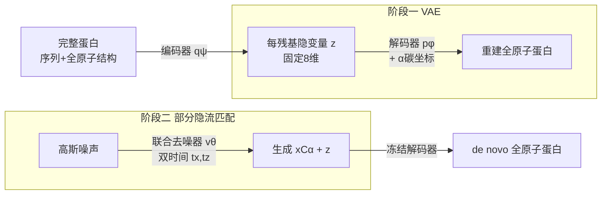

# La-Proteina: Atomistic Protein Generation via Partially Latent Flow Matching

**会议**: ICLR 2026  
**OpenReview**: [https://openreview.net/forum?id=RDerF20JYT](https://openreview.net/forum?id=RDerF20JYT)  
**代码**: [https://research.nvidia.com/labs/genair/la-proteina/](https://research.nvidia.com/labs/genair/la-proteina/)  
**领域**: 计算生物学 / 蛋白质生成  
**关键词**: 全原子蛋白质设计, 部分隐变量, 流匹配, 序列-结构联合生成, motif scaffolding  

## 一句话总结
La-Proteina 用「α-碳坐标显式建模 + 其余原子细节与序列压进每残基固定维隐变量」的部分隐变量表示，把全原子蛋白质的混合离散-连续、变维难题转成纯连续定维问题，再用流匹配联合生成序列与全原子结构，在全原子可共设计性、多样性、结构合理性上达到 SOTA，并能扩展到 800 残基的长蛋白。

## 研究背景与动机
**领域现状**：de novo 蛋白质设计要捕捉序列与结构的关系，但主流方法把两者解耦——要么先生成序列再折叠，要么先设计骨架再反推序列。能直接联合建模序列与全原子结构的方法很少。

**现有痛点**：全原子联合生成天然困难，原因有三：（1）要同时处理离散序列（20 种残基）与连续坐标；（2）侧链的原子数随氨基酸类型变化，导致**维度依赖序列**；（3）显式建模所有原子的网络内存开销大，难以扩展到长蛋白（如 P(all-atom) 生成单个 500 残基样本需 >140GB 显存）。

**核心矛盾**：直接在数据空间建模（data-space）精度与可扩展性都吃力；走全隐变量路线（fully-latent）概念优雅但实测性能往往不及。两条路都没把「高质量骨架生成框架」与「全原子细节建模」结合好。

**本文目标**：在沿用成熟骨架生成框架的同时，干净地解决全原子建模的额外难题，做到高质量、可扩展、且支持原子级 motif scaffolding 这类结构条件设计任务。

**核心 idea**：**部分隐变量表示（partially latent）**——显式保留 α-碳坐标作为全局骨架，把序列 + 所有非 α-碳原子坐标压进**每残基固定 8 维的连续隐变量** $z$，于是主生成组件面对的是「定维、纯连续」空间，可直接套用高效流匹配；离散/变维的复杂度全部交给 VAE 的编码器/解码器处理。

## 方法详解

### 整体框架
La-Proteina 分两阶段训练。第一阶段训练一个 VAE：编码器把完整蛋白（$x_{C\alpha}, x_{\neg C\alpha}, s$）映射到每残基定维隐变量 $z$，解码器在给定 $z$ 和 α-碳坐标 $x_{C\alpha}$ 下重建序列与全原子结构。第二阶段冻结 VAE，训练一个流匹配去噪器在「α-碳坐标 + 隐变量」的部分隐空间上联合生成 $(x_{C\alpha}, z)$。生成时先采样流模型得到 $(x_{C\alpha}, z)$，再过解码器还原成完整全原子蛋白。三个网络（编码器 ~130M、解码器 ~130M、去噪器 ~160M）共享同一套带 pair-biased attention 的 transformer 骨架。

### 关键设计

**1. 部分隐变量分解：把混合模态难题甩给 VAE。** 模型学习隐变量分布 $p_{\theta,\phi}(x_{C\alpha}, x_{\neg C\alpha}, s, z)=p_\theta(x_{C\alpha}, z)\,p_\phi(x_{\neg C\alpha}, s\mid x_{C\alpha}, z)$。第一项 $p_\theta(x_{C\alpha}, z)$ 定义在连续、每残基、定维空间上，正是流匹配负责的部分；第二项是 VAE 解码器，负责把隐变量映回「序列 + 非 α-碳原子」。关键之处在于：一旦同时条件于 α-碳坐标和表达力强的隐变量 $z$，解码分布就能用简单的因子化形式近似——序列 $p_\phi(s\mid x_{C\alpha}, z)$ 取因子化类别分布，非 α-碳坐标 $p_\phi(x_{\neg C\alpha}\mid x_{C\alpha}, z)$ 取单位方差因子化高斯。为应对侧链原子数随残基类型变化，解码器统一输出 Atom37 表示的 $[L,37,3]$ 张量，再按（训练时用真值、推理时用解码）序列选取相应原子子集监督。VAE 以 β-weighted ELBO 训练（$\beta=10^{-4}$，标准各向同性高斯先验），重建项退化为序列交叉熵 + 结构 L2 损失。**为什么不把 α-碳也塞进隐空间**：消融显示那样性能显著变差——保留显式骨架才能复用高性能骨架建模框架，这是它远超既有全隐变量方法的关键。

**2. 双时间部分隐流匹配：让骨架和细节走不同节奏。** 去噪器 $v_\theta(x_{C\alpha}^{t_x}, z^{t_z}, t_x, t_z)$ 用**两个独立插值时间** $t_x, t_z$ 而非单一耦合时间 $t$，CFM 目标为
$$\min_\theta \mathbb{E}\big[\,\|v_\theta^x - (x_{C\alpha}-x_{C\alpha}^0)\|^2 + \|v_\theta^z - (z-z^0)\|^2\,\big].$$
独立时间的意义在于推理时可以给 α-碳坐标和隐变量用**不同的离散化/积分调度**——这是拿到强性能的要害；若强行用单一耦合时间逼迫两个模态同步，结果明显更差。时间采样分布也按此设计：$p_{t_x}=0.02\,\text{Unif}(0,1)+0.98\,\text{Beta}(1.9,1)$、$p_{t_z}=0.02\,\text{Unif}(0,1)+0.98\,\text{Beta}(1,1.5)$，让满足 $t_x>t_z$（骨架比细节生成得更快）的时间对被更频繁采样，呼应「骨架用更快调度优于细节」的经验观察。

**3. 随机采样器 + 独立调度生成。** 因用的是高斯流，可直接从 $v_\theta$ 估出中间密度的 score $\zeta$，进而用随机采样器。生成即从 $(t_x,t_z)=(0,0)$ 模拟到 $(1,1)$ 的一对 SDE：
$$dx_{C\alpha}^{t_x}=v_\theta^x\,dt_x+\beta_x(t_x)\zeta_x\,dt_x+\sqrt{2\beta_x(t_x)}\,\eta_x\,dW_{t_x},$$
$z$ 同理。其中 $\beta_x,\beta_z$ 调节 Langevin 项强度，噪声缩放 $\eta_x,\eta_z\le 1$ 控制注入噪声幅度（蛋白质设计里普遍用降噪/降温换取更高可设计性、牺牲多样性）。用 Euler-Maruyama 模拟，并让 α-碳以比隐变量更快的速率生成，经验上优于其他离散化选择。

**4. 省略三角更新层换取可扩展性。** 主模型刻意去掉 AlphaFold 里计算/显存昂贵的 triangular multiplicative update 层，仅靠高效 transformer 就拿到高性能，从而能扩到长蛋白和大数据（最多 ~46M 结构-序列对、长度至 896 残基）。三角层可选地加回（带 `tri` 后缀的变体）以进一步提升 pair 表示和可共设计性，但会牺牲多样性和可扩展性。隐变量在这里只是叠在 α-碳坐标上的「额外通道」，不增加内部序列表示长度，因此内存可控。

## 实验关键数据

### 主实验表格（无条件全原子生成，长度 100–500）

| 方法 | 全原子可共设计性(%) ↑ | α-碳可共设计性(%) ↑ | 多样性(簇数) ↑ | 可设计性(%) ↑ |
|---|---|---|---|---|
| P(all-atom) | 36.7 | 37.9 | 148/165 | 57.9 |
| Protpardelle-1c | 35.8 | 44.8 | 138/61 | 62.0 |
| APM | 19.0 | 32.2 | 64/59 | 61.8 |
| PLAID | 11.0 | 19.2 | 38/27 | 37.6 |
| ProteinGenerator | 9.8 | 17.8 | 28/24 | 54.2 |
| Protpardelle | 8.8 | 35.2 | 37/21 | 56.2 |
| **La-Proteina (0.1,0.1)** | **68.4** | 72.2 | 216/301 | 93.8 |
| **La-Proteina tri (0.1,0.1)** | **75.0** | **78.2** | 199/247 | 94.6 |

两个变体在全原子可共设计性、可设计性、多样性上全面碾压基线，novelty 仍具竞争力；`tri` 变体可共设计性更高但多样性下降。

### 消融实验表格（核心设计有效性）

| 消融项 | 设置 | 结论 |
|---|---|---|
| α-碳是否进隐空间 | 显式保留 α-碳 vs. 把 α-碳也编码进 $z$ | 全隐变量化显著变差，验证「部分隐」优于「全隐」 |
| 插值时间耦合 | 双时间 $(t_x,t_z)$ vs. 单一耦合时间 $t$ | 单一时间强制两模态同步，性能明显下降 |
| 离散化调度 | α-碳比 $z$ 更快 vs. 其他速率组合 | 骨架快于细节的调度给出最优（共）可设计性 |
| 噪声缩放 $\eta$ | 不同 $(\eta_x,\eta_z)$ 取值 | 越小可共设计性越高但多样性越低，呈可调权衡 |

### 关键发现
- **长蛋白扩展**：在 ~46M 样本数据上训练后，La-Proteina 在 300–800 残基的（共）可设计性与多样性上均最佳；500 残基以上所有全原子基线**集体崩溃**（产不出可共设计样本），而 P(all-atom) 因显存爆炸（单样本 >140GB）受限于 500 残基。骨架设计上还超过此前 SOTA 的 Proteina。
- **生物物理质量**：MolProbity 指标（MP score、clash score、Ramachandran 角异常、共价键异常）全面优于基线，生成结构最接近真实蛋白；侧链二面角分布（如 TRP 的 χ1）能准确恢复主要 rotamer 状态及其频率，基线常缺模态或落到不合理角区。
- **原子级 motif scaffolding**：26 个任务上，La-Proteina 解出 21–25 个（视 all-atom/tip-atom、indexed/unindexed 而定），远超 Protpardelle（仅 4/26），并在 21/26 任务上超过 Protpardelle-1c；同时支持更难的 unindexed（motif 序列索引未知）设置。
- **消融**：把 α-碳也放进隐空间会显著变差；用单一耦合时间 $t$ 取代双时间会变差；α-碳比隐变量更快的离散化调度优于其他选择。

## 亮点与洞察
- **「部分隐」是关键定位**：既不全显式（扩展性差）也不全隐变量（性能差），而是把显式骨架的成熟优势与隐变量对混合模态的吸收能力组合起来——这正是它超越既有全隐框架的根因。
- **维度统一的巧思**：固定 8 维隐变量 + Atom37 统一输出，把「序列依赖的侧链变维」彻底从主生成器里剔除，让纯连续流匹配得以直接套用。
- **双时间解耦**很有启发：不同模态用不同采样调度，是一个简单却显著的性能杠杆，对多模态联合生成普遍有借鉴意义。
- **可扩展性来自做减法**：去掉三角层而非堆算力，反而换来 800 残基这种基线无法触及的工作区间。

## 局限与展望
- **两阶段训练**：VAE 与流模型分开训、流阶段冻结 VAE，隐空间质量上限受第一阶段制约，端到端联合优化是潜在方向。
- **降噪采样的代价**：$\eta\le 1$ 提升可共设计性但牺牲多样性，二者的权衡仍需手调（不同 $\eta_x,\eta_z$ 给出不同折中）。
- **三角层的取舍**：要更高可共设计性就得加回三角层、牺牲扩展性与多样性，尚无两全方案。
- **任务范围**：本文聚焦无条件单体生成与 motif scaffolding；蛋白-蛋白相互作用、binder 设计等留给并行/后续工作。

## 相关工作与启发
- **骨架生成谱系**：RFDiffusion、Chroma 早期专注骨架；后续分化出 SO(3) 流形扩散与欧氏流匹配（FrameFlow、Proteina 等）。La-Proteina 直接站在 Proteina（Geffner et al., 2025）的 transformer 架构上。
- **全原子/共设计**：data-space 路线（P(all-atom)、APM、Protpardelle）与 latent 路线（PLAID、McPartlon 等）是两大阵营，La-Proteina 的「部分隐」是对两者的折中与超越。
- **潜空间生成范式**：思路上承接 Stable Diffusion / LSGM「先 VAE 压缩再在隐空间跑扩散/流匹配」，但创新在于「只压一部分模态、保留骨架显式」。

## 评分
- **新颖性**: ⭐⭐⭐⭐⭐ —— 「部分隐变量 + 双时间流匹配」是对全原子蛋白质生成表示问题的清晰且原创的重构，定位精准。
- **实验充分度**: ⭐⭐⭐⭐⭐ —— 无条件生成、800 残基扩展、生物物理验证、26 项 motif scaffolding、系统消融，覆盖全面且对比强。
- **写作质量**: ⭐⭐⭐⭐ —— 动机与设计动机阐述清楚、图示到位；公式与采样细节较密，部分依赖附录。
- **价值**: ⭐⭐⭐⭐⭐ —— 在全原子可共设计性、长蛋白、原子级 scaffolding 多个维度刷新 SOTA，且代码/项目页公开，对蛋白质设计领域有直接推动力。

<!-- RELATED:START -->

## 相关论文

- [\[ICLR 2026\] Riemannian Variational Flow Matching for Material and Protein Design](riemannian_variational_flow_matching_for_material_and_protein_design.md)
- [\[ICML 2026\] LineageFlow: Flow Matching for High-Fidelity Family-Aware Protein Sequence Generation](../../ICML2026/computational_biology/lineageflow_flow_matching_for_high-fidelity_family-aware_protein_sequence_genera.md)
- [\[ICLR 2026\] FragFM: Hierarchical Framework for Efficient Molecule Generation via Fragment-Level Discrete Flow Matching](fragfm_hierarchical_framework_for_efficient_molecule_generation_via_fragment-lev.md)
- [\[ICLR 2026\] Flow Autoencoders are Effective Protein Tokenizers](flow_autoencoders_are_effective_protein_tokenizers.md)
- [\[ICLR 2026\] Multi-Marginal Flow Matching with Adversarially Learnt Interpolants](multi-marginal_flow_matching_with_adversarially_learnt_interpolants.md)

<!-- RELATED:END -->
