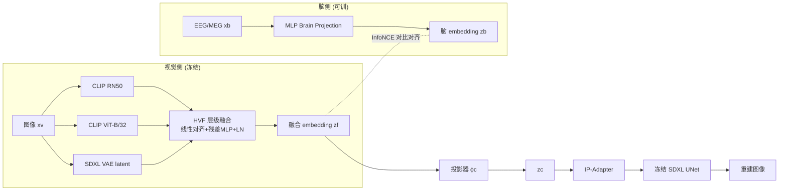

# Learning Brain Representation with Hierarchical Visual Embeddings

**会议**: ICLR 2026  
**OpenReview**: [https://openreview.net/forum?id=IEq71qS8B7](https://openreview.net/forum?id=IEq71qS8B7)  
**代码**: 待确认  
**领域**: 神经科学 / 脑视觉解码 / 跨模态对齐  
**关键词**: 脑信号解码, EEG/MEG, 层级视觉表征, 对比学习, Fusion Prior, 扩散重建  

## 一句话总结
用多个具有不同归纳偏置的预训练视觉编码器（CLIP 语义 + VAE 像素）拼出"层级视觉表征"作为对齐目标，再配一个在大规模图像上预训练好的 Fusion Prior 把融合特征稳定地映射到扩散条件，从而让 EEG/MEG 脑信号同时对齐到高层语义和低层像素，兼顾零样本检索精度与重建保真度。

## 研究背景与动机
- **领域现状**：从脑信号（fMRI/EEG/MEG）解码视觉内容是神经科学与 AI 的交叉热点。fMRI 空间分辨率高但时间分辨率低，适合重建；EEG/MEG 时间分辨率毫秒级、数据规模大，适合检索。主流做法是用对比学习把脑信号对齐到某个强视觉先验（CLIP 语义 embedding 或 VAE 像素 latent），把这个共享空间当成解码目标。
- **现有痛点**：绝大多数方法只对齐**单一**视觉特征——要么对齐高层语义（CLIP），要么对齐低层像素（VAE）。对齐 CLIP 能保住"是什么物体"，却丢掉颜色、纹理、布局等低层细节；这既限制了重建保真度，也让人无法判断脑信号到底编码了多少视觉信息。即便近期工作引入 Blur Prior（UBP）或加深度信息（CognitionCapturer）来改进，仍然停在高层语义层面。
- **核心矛盾**：脑信号的时间动态结构 vs. 视觉表征的层级组织结构之间存在**结构鸿沟**，直接把脑信号硬怼到单一视觉特征上无法捕捉两者共享的多尺度表征。
- **本文目标**：构建一个能同时覆盖"像素细节→高层语义"的层级视觉表征作为对齐目标，并解决"融合特征直接喂扩散模型会输出不稳定"的问题，在检索精度和重建保真度之间取得平衡。
- **核心 idea**：**【层级融合】** 用 K 个不同归纳偏置的预训练编码器拼出多尺度视觉 token，对比学习对齐脑信号；**【Fusion Prior】** 先在大规模图像上把融合特征预训练成一个稳定的、无文本的扩散条件映射，再让脑 embedding 去匹配这个冻结的先验，避免表征漂移。

## 方法详解

### 整体框架
方法叫 **Hierarchical Visual Fusion (HVF) + Fusion Prior**，分两条流水线：检索流水线把脑 embedding $z_b$ 用对称 InfoNCE 对齐到融合视觉 embedding $z_f$，评估时在融合空间做最近邻检索；重建流水线先在大规模图像上预训练一个"融合先验"（HVF + 投影器 + IP-Adapter），冻结后只更新脑端，把 $z_b$ 投到 $z_c$ 注入冻结的 SDXL UNet 生成图像。整个过程视觉编码器和 UNet 全程冻结，只训脑侧。

### 关键设计

**1. 层级视觉融合 HVF：让"像素+语义"在一个 token 里共存。** 作者用 $K{=}3$ 个预训练编码器分别抓不同尺度的视觉信息：高层语义用多个 CLIP（ViT 取 [CLS]、ResNet 取 pooled projection 这个全局 token），低层细节用 SDXL VAE encoder——它输出 $[H/8, W/8, 4]$ 的 latent，拉平成长度 $HW/16$ 的向量，保留了局部结构和像素细节。每个编码器先用一个学习到的线性映射 $W_v^{(k)}\in\mathbb{R}^{d_k\times d}$ 对齐到共享维度 $d{=}1024$：$\bar{z}_v=\sum_{k=1}^{K}z_v^{(k)}W_v^{(k)}$，再过一个 post-norm 残差 MLP 融合 $z_f=\text{LayerNorm}(\bar{z}_v+\phi_v(\bar{z}_v))$。这一步的关键洞察是：CLIP 这类语义编码器天生捕捉不了局部细粒度信息，光叠语义编码器（RN50+B32）收益很小，**真正把检索精度顶上去的是补进来的 VAE 像素 latent**——这也直接构成了本文的核心科学发现。

**2. 对称 InfoNCE 把脑信号拽进融合空间。** 脑端用一个 MLP Brain Projection (MBP)：先把预处理后的脑信号展平成 $x_b'\in\mathbb{R}^{C\cdot T}$，用线性投影 $W_b\in\mathbb{R}^{CT\times d}$ 对齐到视觉宽度，再复用和视觉侧同款的残差结构 $z_b=\text{LayerNorm}(\bar{z}_b+\phi_b(\bar{z}_b))$，保证脑 embedding 和 $z_f$ 维度兼容。对齐用 CLIP 式 InfoNCE：两侧 L2 归一化后算余弦相似度 logits $s_{ij}=\hat{z}_b^{(i)\top}\hat{z}_f^{(j)}/\tau$（温度 $\tau$ 初始 0.07 可学），损失是行方向和列方向交叉熵的对称平均。对称这一点很重要——它同时拉近"脑→图"和"图→脑"两个方向的匹配对，提升的跨被试泛化在实验里体现得最明显。

**3. Fusion Prior：先把融合特征"驯化"成稳定的扩散条件，再让脑去匹配。** 作者发现直接把融合表征喂给扩散模型重建会输出不稳定，根因是**缺一个稳定的条件先验**——脑驱动的特征还没落到生成模型期望的分布上，导致引导噪声乱跳。解法是分两阶段：先在大规模图像（ImageNet-1k，约 130 万张）上预训练 Fusion Prior——把 $z_f$ 过投影器得到 $z_c=z_f+\phi_c(z_f)$（$\phi_c$ 隐层 4096），用 IP-Adapter 的解耦交叉注意力把 $z_c$ 注入冻结 SDXL UNet，最小化标准扩散噪声预测损失 $L_{prior}=\|\epsilon-\delta(x_t,t,z_c)\|_2^2$，且**文本提示留空**，逼模型学一个无文本的"融合特征→扩散条件"映射。预训练完冻结 HVF/投影器/IP-Adapter/UNet，只用同一个 InfoNCE 损失更新脑编码器（MBP），让 $z_b$ 落进这个稳定的预训练融合空间。这种"先锚定一个分布再让脑去对齐"的设计，避免了脑端训练时的表征漂移，是重建能稳住的核心。

## 实验关键数据

### 主实验表格

200-way 零样本检索 Top-1/Top-5 准确率（%），THINGS-EEG / THINGS-MEG：

| 方法 | EEG 内被试 T1/T5 | EEG 跨被试 T1/T5 | MEG 内被试 T1/T5 | MEG 跨被试 T1/T5 |
|---|---|---|---|---|
| NICE | 16.1/43.6 | 6.2/21.4 | 12.8/36.0 | – |
| MB2C / ATM | 28.5/60.4 | 11.8/33.7 | – | – |
| CC-All | 35.6/80.2 | – | – | – |
| UBP（最强 baseline） | 50.9/79.7 | 12.4/33.4 | 26.7/55.2 | 2.2/10.4 |
| **Ours** | **75.7/94.6** | **20.0/44.1** | **33.7/60.5** | **5.4/15.2** |

重建质量（EEG，越高越好除 SwAV 越低越好）：

| 方法 | PixCorr↑ | AlexNet(5)↑ | Inception↑ | CLIP↑ | SwAV↓ |
|---|---|---|---|---|---|
| C.C.(All) | 0.150 | 0.623 | 0.669 | 0.715 | 0.590 |
| **Ours (EEG avg)** | **0.195** | **0.905** | **0.756** | **0.808** | **0.554** |
| ATM (subj-8) | 0.160 | 0.866 | 0.734 | 0.786 | 0.582 |
| **Ours (subj-8)** | **0.227** | **0.924** | **0.796** | **0.826** | **0.531** |

### 消融实验表格

EEG 检索的视觉编码器组合消融（Top-1/Top-5，内被试 / 跨被试）：

| 配置 | 内被试 T1/T5 | 跨被试 T1/T5 |
|---|---|---|
| B32（单语义） | 52.2/83.3 | 13.3/33.9 |
| RN50（单语义） | 48.1/80.4 | 12.7/31.7 |
| VAE（单像素） | 44.3/75.2 | 10.2/23.9 |
| RN50+B32（双语义） | 56.9/86.1 | 14.4/36.8 |
| B32+VAE（语义+像素） | 73.6/94.3 | 19.1/41.2 |
| **RN50+B32+VAE（全）** | **75.7/94.6** | **20.0/44.1** |

重建的 Fusion Prior 组合消融：H14+B32+VAE 的 PixCorr 最高（0.195），纯 H14+VAE 反而最差（0.173），说明语义编码器仍是重建语义一致性的骨架。

### 关键发现
- **VAE 像素 latent 是检索精度的关键**：双语义叠加（RN50+B32）只从 52.2 提到 56.9，但加进 VAE 后（B32+VAE）直接跳到 73.6，证明脑信号确实同时编码了低层视觉细节，纯语义或纯像素都无法还原完整的脑-视觉结构。
- **跨被试增益最大**：相比 UBP，跨被试设定下的提升幅度最显著，说明融合表征带来了更强的跨参与者泛化。
- **即插即用**：在固定融合训练框架下换不同脑编码器骨干（ShallowNet/DeepNet/EEGNet）都成立，方法对脑端骨干不敏感。

## 亮点与洞察
- 把"脑信号到底编码了多少视觉信息"这个神经科学问题，转化成一个可量化的工程发现：**在语义编码器上加 VAE 像素 latent 能一致提升解码性能，而纯语义/纯像素都不行**——这是一个有说服力的科学结论，而不只是刷点。
- Fusion Prior 的"先在大图上预训练成稳定扩散条件、再让脑去匹配"的两阶段设计，干净地把"脑信号噪声"和"扩散生成稳定性"解耦，是重建能稳住的关键工程洞察。
- 整套方案 text-free、plug-and-play、视觉侧和 UNet 全冻结只训脑侧，工程上很轻（检索阶段单卡 25 epoch）。

## 局限与展望
- Fusion Prior 预训练成本不低（ImageNet-1k 上 100k 步、双卡约 15 小时/配置），换扩散骨干或视觉编码器组合都要重训先验。
- 编码器组合靠人工试（RN50/B32/VAE/H14 各种排列组合消融），缺一个自动选择/加权层级特征的机制。
- 仍局限于 THINGS-EEG/MEG 这类受控刺激数据集，跨被试 MEG 绝对精度仍很低（Top-1 仅 5.4%），离真实开放场景的脑解码还有距离。
- VAE latent 拉平成长向量保留了局部结构，但这种 flatten 方式是否最优、是否丢了空间排布信息，文中未深究。

## 相关工作与启发
- **脑视觉解码**：NICE、ATM（Adaptive Thinking Mapper）、MB2C、UBP（Uncertainty-aware Blur Prior）、CognitionCapturer——本文相对它们的差异是从"对齐单一视觉特征"升级到"对齐层级融合特征"。
- **跨模态对比学习**：CLIP/ALIGN 式 InfoNCE 双编码器是对齐脑-视觉的标准范式，但已知存在 modality gap 和对噪声配对敏感的问题，本文用 Fusion Prior 缓解分布不一致。
- **扩散适配器**：IP-Adapter（解耦交叉注意力注入图像 prompt）、ControlNet、T2I-Adapter——本文复用 IP-Adapter 作为把融合 token 注入冻结 SDXL 的轻量桥梁。
- **启发**：当一个模态（脑信号）信息含量不确定时，与其纠结对齐哪个单一目标，不如用多个互补归纳偏置的编码器拼一个层级目标，并先把目标空间"预训练稳定"再让弱模态去对齐——这个思路可迁移到其它低 SNR 信号（生理信号、传感器）的跨模态解码。

## 评分
- **新颖性**: ⭐⭐⭐⭐ — 层级融合（语义+像素）作为脑解码对齐目标 + Fusion Prior 两阶段稳定扩散条件的组合是新的，且回答了一个真实的神经科学问题。
- **实验充分度**: ⭐⭐⭐⭐ — EEG/MEG 双数据集、内/跨被试、检索+重建双任务、编码器组合与脑骨干都有系统消融，结论扎实；但仅限 THINGS 系数据集。
- **写作质量**: ⭐⭐⭐⭐ — 动机清晰、方法公式完整、消融逻辑自洽，图表组织良好。
- **价值**: ⭐⭐⭐⭐ — 检索精度大幅刷新 SOTA（EEG 内被试 50.9→75.7），且提供了可复用的 plug-and-play 脑-视觉接口与一个有意义的科学发现。

<!-- RELATED:START -->

## 相关论文

- [\[ICLR 2026\] MindPilot: Closed-loop Visual Stimulation Optimization for Brain Modulation with EEG-guided Diffusion](mindpilot_closed-loop_visual_stimulation_optimization_for_brain_modulation_with_.md)
- [\[ICLR 2026\] TRIBE: Trimodal Brain Encoder for Whole-Brain fMRI Response Prediction](tribe_trimodal_brain_encoder_for_whole-brain_fmri_response_prediction.md)
- [\[NeurIPS 2025\] Generative Distribution Embeddings: Lifting Autoencoders to the Space of Distributions for Multiscale Representation Learning](../../NeurIPS2025/computational_biology/generative_distribution_embeddings_lifting_autoencoders_to_the_space_of_distribu.md)
- [\[ICLR 2026\] PETRI: Learning Unified Cell Embeddings from Unpaired Modalities via Early-Fusion Joint Reconstruction](petri_learning_unified_cell_embeddings_from_unpaired_modalities_via_early-fusion.md)
- [\[ICLR 2026\] TetraGT: Tetrahedral Geometry-Driven Explicit Token Interactions with Graph Transformer for Molecular Representation Learning](tetragt_tetrahedral_geometry-driven_explicit_token_interactions_with_graph_trans.md)

<!-- RELATED:END -->
