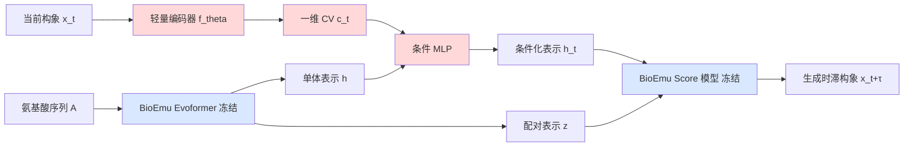

# Learning Collective Variables from BioEmu with Time-Lagged Generation

**会议**: ICLR 2026  
**OpenReview**: [https://openreview.net/forum?id=1PYj4fMeLe](https://openreview.net/forum?id=1PYj4fMeLe)  
**代码**: 待确认  
**领域**: 计算生物学 / 分子动力学 / 增强采样  
**关键词**: 集体变量(CV), 增强采样, BioEmu, 时滞生成, 蛋白质折叠, 扩散模型  

## 一句话总结
把冻结的蛋白质生成基础模型 BioEmu 改造成「时滞生成器」——给它当前构象 $x_t$，逼它生成 $\tau$ 时间后的构象 $x_{t+\tau}$，从而让一个轻量编码器自动学到只编码慢自由度的一维集体变量(CV)，可直接喂给 OPES、Steered MD 等增强采样方法。

## 研究背景与动机

**领域现状**：分子动力学(MD)以飞秒($10^{-15}$ s)为步长积分,但蛋白质折叠这类稀有事件发生在微秒到毫秒尺度,中间隔着上亿个积分步,朴素 MD 根本观测不到。增强采样(metadynamics、REMD、OPES 等)靠对系统施加偏置力来加速跨越能垒,而这些偏置力都建立在一个低维描述符——集体变量(CV)——之上。CV 编码得好不好,直接决定增强采样能不能驱动出真实的折叠/解折叠转变。

**现有痛点**：传统 CV 靠领域专家手工挑(比如 Alanine Dipeptide 选某几个骨架二面角),既容易漏掉真正的慢模式,又只能用在小体系上。机器学习 CV(MLCV)虽然兴起——监督式(DeepLDA、DeepTDA)需要预先定义折叠态标签和 RMSD 阈值;自监督式(DeepTICA、TAE、VDE)靠时滞数据编码动力学信息——但它们绝大多数只在 alanine dipeptide 这种玩具体系上验证过,**既缺乏向真实蛋白质规模扩展的能力,也没有一个统一的、横向可比的系统性 benchmark**。

**核心矛盾**：自监督 MLCV 的训练范式(如 VDE 用自编码器从 $x_t$ 重建 $x_{t+\tau}$)本身需要表达力强、可扩展的解码器,而从头训练这样一个蛋白质级别的生成式解码器代价高昂;同时大体系上「CV 能否真正区分折叠/解折叠态」这个最基本的标准,现有方法常常做不到。

**本文目标**：(1) 提出一个简单、轻量、可扩展的框架,从分子基础模型的潜在表示里抽取 CV;(2) 在比 alanine dipeptide 大得多的快速折叠蛋白上,为 MLCV 建立一个系统的、面对面对比的新 benchmark(自由能差估计 + 转变路径采样两大下游任务)。

**核心 idea**：**复用基础模型(Re-purpose a foundation model)** + **时滞生成约束(Time-lagged generation)**——不从头训练解码器,而是借用已经会生成蛋白质构象系综的 BioEmu 作为冻结解码器,只训练一个轻量编码器;并把生成目标从「重建当前态」改成「预测时滞态 $x_{t+\tau}$」,迫使 CV 只保留 $x_t$ 与 $x_{t+\tau}$ 共享的慢信息,丢弃当前态里那些快速随机涨落。

## 方法详解

### 整体框架
方法称为 **BIOEMU-CV**。核心是在一个**冻结**的蛋白质生成基础模型 BioEmu 之上,挂一个可训练的轻量编码器 $f_\theta$:编码器把当前构象 $x_t$ 压成一维 CV $c_t = f_\theta(x_t)$,再通过一个小 MLP 把 $c_t$ 融进 BioEmu 的单体表示(single representation),作为条件;然后让 BioEmu 的 score 网络在这个条件下去生成**时滞**构象 $x_{t+\tau}$(而非当前的 $x_t$)。整个训练只更新编码器和条件 MLP,BioEmu 主干始终不动。

### 关键设计

**1. 复用冻结基础模型作 CV 解码器:借力 BioEmu 的生成能力。** BioEmu 是一个序列条件的去噪扩散模型 $g_\phi(x|A)$,能在全原子分辨率下从蛋白质的平衡分布 $p(x|A)$ 采样多个构象(区别于 AlphaFold 这种只给单一低能构象的结构预测模型)。它内部用 Evoformer 从氨基酸 token 产出单体表示 $h$ 和配对表示 $z$,再由 score 模型生成 Cα 坐标与残基朝向。作者的洞察是:既然文生图扩散模型可以靠轻量 adapter(ControlNet、T2I-Adapter 那一脉)外挂条件编码器来提取条件表示,那么 MLCV 同样可以被看成「驱动分子生成的条件」。于是不再为 CV 学习从头训一个解码器,而是直接把 BioEmu 当成现成的、已经懂蛋白质物理的冻结解码器,**编码器只需学会输出一个能正确引导 BioEmu 的低维条件**,大幅降低训练成本并天然继承了 BioEmu 对蛋白质构象空间的先验。

**2. 时滞生成约束:用「预测未来」逼 CV 只装慢自由度。** 这是方法的灵魂。条件通路搭好后,作者不让模型重建当前态,而是编码当前构象 $x_t$ 的 CV、却要求 score 模型生成时滞后的构象 $x_{t+\tau}$。直觉上,$c_t$ 必须压缩 $x_t$ 与 $x_{t+\tau}$ 之间**共享**的那部分信息——也就是变化缓慢的慢自由度——而当前态里那些只存在于 $x_t$、在 $\tau$ 之后已经被随机抹掉的快速涨落,对预测未来毫无帮助,自然会被丢弃。这一动机与 VDE 一脉相承,但作者改用可扩展的扩散模型架构当解码器,而且不再需要 VDE 那个额外的自相关损失(auto-correlation loss),训练更简洁。

**3. 轻量条件注入 + 去噪 score-matching 目标。** 为了保持适配器轻量并不破坏 score 模型的维度,作者用一个小 MLP 把编码器输出 $c_t$ 与单体表示 $h$ 融合成条件化表示 $h_t = \mathrm{MLP}(h, c_t)$,配对表示 $z$ 保持不变,两者一起送进 score 模型。冻结 BioEmu 参数 $\phi$,只用去噪 score-matching 目标更新编码器和条件 MLP:

$$
\mathcal{L}(x_t, x_{t+\tau}, A) = \mathbb{E}_{s\sim U[0,1]}\Big[\lambda_s \big\| \nabla \log p_{s|0}\big(x^{(s)}_{t+\tau}\,\big|\,x^{(0)}_{t+\tau}, x_t, A\big) - g_\phi(s, h_t, z) \big\|^2 \Big]
$$

其中 $s$ 是扩散时间,$p_{s|0}$ 是 $x^{(s)}_{t+\tau}$ 在给定 $x^{(0)}_{t+\tau}, x_t, A$ 下的密度,$\lambda_s$ 是时间加权,$g_\phi$ 即 BioEmu 的 score 网络。这个目标把「重建时滞构象」的压力全部转嫁到 CV $c_t$ 身上,迫使它编码出适合增强采样的慢自由度表示。

**4. 一维 CV + 三准则约束。** 作者把 CV 维度固定为 1(便于可视化与施偏),并明确 CV 需满足增强采样的三条标准:(i) 低维;(ii) 捕获系统的慢自由度;(iii) 能区分蛋白质的折叠态与解折叠态。训练完成后,所有 MLCV 都在完整 DESRES 轨迹上归一化到 $[-1,1]$,并约定折叠态对应正值,以保证跨方法的公平对比与可视化一致性。

## 实验关键数据

评测在三个比 alanine dipeptide 大得多的快速折叠蛋白(显式水溶剂)上进行:**Chignolin、Trp-cage、BBA**(取自 Lindorff-Larsen 等的 DESRES 长轨迹)。基线为自监督 MLCV:DeepTICA、TAE、VDE,统一用 mlcolvar 包在相同数据和时滞下从头训练,输入都用旋转/平移不变的 Cα 两两距离,CV 维度都固定为 1。

### 主实验表格

**任务一:自由能差估计(1 µs OPES,显式水)** —— 越接近参考 $\Delta F_{ref}$、PMF MAE 越小越好。

| 蛋白 | 方法 | $\Delta F_{ref}$ | $\Delta F$ | $\|\Delta F_{ref}-\Delta F\|$ ↓ | PMF MAE ↓ |
|------|------|------|------|------|------|
| Chignolin | DeepTICA | -3.73 | -2.02±3.65 | 1.71 | 2.64±3.80 |
| Chignolin | TAE | -3.79 | -1.26±3.69 | 2.53 | 3.15±2.81 |
| Chignolin | VDE | -17.24 | 0.24±5.00 | N/A | 4.09±3.20 |
| Chignolin | **BIOEMU-CV** | -3.71 | -3.19±3.97 | **0.52** | 3.07±2.53 |
| Trp-cage | DeepTICA | 3.70 | 6.53±7.31 | 2.73 | 8.94±7.43 |
| Trp-cage | **BIOEMU-CV** | 4.15 | 5.97±3.01 | **1.82** | **6.86±4.38** |
| BBA | DeepTICA | 2.76 | 13.95±13.28 | 11.19 | 10.51±5.85 |
| BBA | **BIOEMU-CV** | 2.77 | 9.99±5.43 | **7.22** | **8.34±7.46** |

(TAE/VDE 在 Trp-cage、BBA 上多处标 N/A——要么折叠/解折叠态判别失败,要么符号与参考相反。)

**任务二:转变路径采样(16 次 Steered MD,显式水)** —— RMSD 与转变态能 $E_{TS}$ 越低、目标命中率 THP 越高越好。

| 蛋白 | 方法 | RMSD(Å)↓ | THP(%)↑ | $E_{TS}$(kJ/mol)↓ |
|------|------|------|------|------|
| Chignolin | DeepTICA | 2.45±0.86 | 37.5 | -81102.41±521.27 |
| Chignolin | TAE | 1.95±0.72 | 43.8 | -81914.87±114.30 |
| Chignolin | VDE | 2.08±0.56 | 43.8 | -82026.62±77.63 |
| Chignolin | **BIOEMU-CV** | **1.20±0.33** | **100.0** | **-82055.15±98.48** |
| Trp-cage | DeepTICA | **2.37±0.47** | 31.2 | -63611.88±57.49 |
| Trp-cage | **BIOEMU-CV** | 2.31±0.52 | 31.2 | **-63787.51±31.23** |
| BBA | DeepTICA | 2.67±0.37 | 18.8 | -130418.50±477.68 |
| BBA | **BIOEMU-CV** | **2.05±0.24** | **93.8** | **-131315.59±116.23** |

BIOEMU-CV 在转变路径采样上几乎全面领先:Chignolin 目标命中率 100%、BBA 93.8%,而 TAE/VDE 在大蛋白上 THP 跌到 0 甚至直接 N/A。

### 消融实验表格

去掉时滞条件(改成生成当前态 $x_t$)或解冻 BioEmu(Table 8):

| 时滞 | 冻结 | $\|\Delta F_{ref}-\Delta F\|$↓ | PMF MAE↓ | RMSD↓ | THP↑ | $E_{TS}$↓ |
|------|------|------|------|------|------|------|
| ✓ | ✓ | 0.52 | 3.07±2.53 | 1.20±0.33 | **100.0** | -82055±98 |
| ✗ | ✓ | 2.10 | 1.41±1.56 | 1.57±0.36 | 81.3 | -82085±63 |
| ✓ | ✗ | 1.22 | 3.53±3.73 | 1.62±0.31 | **100.0** | -82076±98 |

完整设计(时滞✓+冻结✓)在自由能差和 SMD 命中率上综合最优:去掉时滞条件后自由能差误差从 0.52 飙到 2.10、THP 掉到 81.3%;解冻 BioEmu 既无明显收益又增加训练代价。

### 关键发现
- **可扩展性是分水岭**:VDE 在大蛋白(Trp-cage、BBA)上彻底失效——折叠态与解折叠态的 CV 值几乎重合(Table 3),无法区分态;BIOEMU-CV 在三个蛋白上都给出清晰分离的折叠(正)/解折叠(负)态。
- **物理可解释性**:敏感性分析(Fig 5)显示 BIOEMU-CV 一致地把高敏感度赋予真正区分折叠态的长程接触(如 Chignolin 的 TYR1-TYR10、ASP3-TRP8 氢键),而 DeepTICA/VDE 常关注区分力弱的距离。
- **与已知描述符吻合**:在 Chignolin 上,BIOEMU-CV 与 committor 函数的 Pearson 相关达 0.748(DeepTICA 仅 0.682);二级结构分析中 BIOEMU-CV 能给 α-helix/β-sheet 赋予不同 CV 值,TAE/VDE 做不到。

## 亮点与洞察
- **"复用基础模型作冻结解码器"这一招迁移得很漂亮**:把文生图领域 ControlNet/adapter 的「外挂轻量条件编码器」思路搬到分子动力学,既省去从头训练蛋白质级解码器的巨大成本,又让 CV 学习直接站在 BioEmu 学到的蛋白质物理先验肩膀上。
- **时滞生成是一个优雅的"信息瓶颈"**:用「预测未来构象」这个自监督代理任务,天然把慢/快自由度分离,且比 VDE 省掉了自相关损失,目标更干净。
- **真正的贡献之一是 benchmark**:本文第一次在显式水、真实快速折叠蛋白上,把多个 MLCV 放在统一数据/时滞/输入特征下,用自由能估计 + 转变路径采样两个下游任务面对面横评,填补了 MLCV 长期"只在 alanine dipeptide 上自说自话"的空白。

## 局限与展望
- **CV 维度固定为 1**:作者为了可视化和施偏简便只用一维 CV,但真实大蛋白的慢自由度往往需要多维 CV 才能刻画,扩到高维 CV 的效果未验证。
- **仍依赖时滞轨迹数据训练**:虽然解码器是预训练的,但编码器训练仍需要带时滞标注的 MD 轨迹(DESRES),对没有长轨迹数据的新蛋白如何冷启动是开放问题。
- **受 BioEmu 能力上限约束**:整个框架以 BioEmu 为冻结底座,BioEmu 覆盖不到的蛋白/构象空间,CV 质量也会受限;且仅验证了三个快速折叠蛋白,向更大、折叠更复杂的体系泛化仍待考察。
- **自由能差在大蛋白上误差仍偏大**:BBA 的 $\|\Delta F_{ref}-\Delta F\|$ 仍达 7.22 kJ/mol,绝对精度离定量预测还有距离。

## 相关工作与启发
- **自监督 MLCV 谱系**:DeepTICA(时滞独立成分分析作损失)、TAE(时滞自编码器重建 $x_{t+\tau}$)、VDE(变分动力学编码器)——本文是这一谱系的"扩散模型版+基础模型版",直接继承 VDE 的时滞重建动机但换了更强的解码器。
- **冻结生成模型 + 轻量条件编码器**:ControlNet、T2I-Adapter 等文生图工作是方法论的直接灵感来源,本文证明该范式可跨域迁移到分子科学。
- **分子基础模型**:BioEmu 作为能采样平衡构象系综的扩散模型,是本文的关键使能者;启发是——一旦有了强大的生成式分子基础模型,许多传统需要从头训练的下游表示学习任务(不止 CV)都可以改写成"在冻结模型上挂轻量适配器"。
- **增强采样**:OPES、Steered MD、metadynamics 等是 CV 的最终消费场景,本文把"CV 学习"与"增强采样下游评测"紧密绑定,提醒后来者评价 CV 不能只看重建/分类指标,要看它能否真正驱动增强采样产生正确的热力学/动力学量。

## 评分
- **新颖性**: ⭐⭐⭐⭐ 「冻结基础模型 + 时滞生成」组合在 MLCV 领域是新颖且自然的迁移,虽然单个组件(ControlNet 式 adapter、VDE 式时滞)各有出处,但合到分子 CV 学习上并配套大蛋白 benchmark 是清晰的增量贡献。
- **实验充分度**: ⭐⭐⭐⭐ 三个真实蛋白 × 两大下游任务 × 多基线 × 显式水溶剂,外加敏感性/committor/二级结构/消融多角度分析,作为 MLCV 工作相当扎实;扣分在蛋白数量(仅 3 个)和 CV 维度(仅 1 维)受限。
- **写作质量**: ⭐⭐⭐⭐ 动机—方法—评测逻辑顺畅,图表把"为什么基线失败"讲得很清楚,N/A 标注与排除标准交代明确。
- **价值**: ⭐⭐⭐⭐ 既给出一个实用、易扩展的 CV 学习框架,又贡献了一个填补空白的 fast-folding 蛋白 MLCV benchmark,对增强采样与计算生物学社区都有实际参考价值。

<!-- RELATED:START -->

## 相关论文

- [\[ICLR 2026\] Enhancing Diffusion-Based Sampling with Molecular Collective Variables](enhancing_diffusion-based_sampling_with_molecular_collective_variables.md)
- [\[ICLR 2026\] Ultra-Fast Language Generation via Discrete Diffusion Divergence Instruct](ultra-fast_language_generation_via_discrete_diffusion_divergence_instruct.md)
- [\[ICLR 2026\] DCFold: Efficient Protein Structure Generation with Single Forward Pass](dcfold_efficient_protein_structure_generation_with_single_forward_pass.md)
- [\[ICLR 2026\] DriftLite: Lightweight Drift Control for Inference-Time Scaling of Diffusion Models](driftlite_lightweight_drift_control_for_inference-time_scaling_of_diffusion_mode.md)
- [\[ICLR 2026\] Hierarchical Multi-Scale Molecular Conformer Generation](hierarchical_multi-scale_molecular_conformer_generation.md)

<!-- RELATED:END -->
