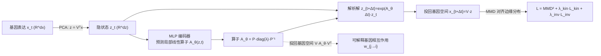

# Learning Explicit Single-Cell Dynamics Using ODE Representations

**会议**: ICLR 2026  
**OpenReview**: [https://openreview.net/forum?id=DzSNH5APPl](https://openreview.net/forum?id=DzSNH5APPl)  
**代码**: [github.com/czi-ai/cell-mnn](https://github.com/czi-ai/cell-mnn)  
**领域**: 计算生物学 / 单细胞动力学  
**关键词**: 单细胞轨迹推断, 细胞分化, ODE 表示, 局部线性化, 基因调控网络, 机制神经网络  

## 一句话总结
本文提出 Cell-MNN——一个编码器-解码器架构，把单细胞分化动力学表示为「随状态条件化的局部线性 ODE」，从而**抛弃昂贵的最优传输（OT）预处理与多阶段训练**，端到端单阶段就能在单细胞插值基准上拿到 SOTA 平均成绩，并顺带产出可对照 TRRUST 数据库验证的可解释基因调控相互作用。

## 研究背景与动机
- **领域现状**：细胞从干细胞到组织细胞的分化是癌症、神经退行等疾病的核心机制。单细胞测序数据以超过摩尔定律的速度增长，使「从快照数据重建细胞轨迹」成为机器学习的热门战场。难点在于：测量会破坏细胞，因此每个细胞只有轨迹上的**单点快照观测**，没有连续轨迹标签。
- **现有痛点**：当前 SOTA（OT-MFM、DeepRUOT、OT-CFM 等）几乎都依赖**最优传输预处理**来人工构造速度标签——Sinkhorn 算法随样本数 $n$ 二次方增长，在大数据集上成为内存/时间瓶颈（动辄 OOM）。这些方法还往往需要**多阶段训练 + 多个网络**，难以跨数据集做 amortized 联合训练。
- **核心矛盾**：擅长预测（插值精度高）的方法不学**显式基因相互作用**；而专门做基因调控网络（GRN）发现的方法又在插值基准上跑不过 SOTA。两条路线割裂。
- **本文目标**：设计一个可扩展、单阶段、端到端的机制模型，既能准确预测细胞演化，又能直接读出可解释的基因相互作用。
- **核心 idea**：**【局部线性化 ODE 表示】**——不去硬学全局非线性速度场，而是让网络像 hypernetwork 一样，在每个「操作点」预测一个**条件化的局部线性算子 $A_\theta(z,t)$**，用 $\dot z = A_\theta z$ 近似当地动力学。线性 ODE 有解析解（矩阵指数），既省去数值求解器，又因为算子可逆向投影回基因空间而天然可解释。

## 方法详解

### 整体框架
Cell-MNN 是一个 encoder-decoder：先用标准 PCA 把高维基因表达 $x\in\mathbb{R}^{d_x}$ 压到低维隐空间 $z=V_{\text{PCA}}^\top x$（$d_z\ll d_x$）；编码器 MLP 在当前状态 $(z,t)$ 下预测一个局部线性算子 $A_\theta(z,t)$；解码器对线性 ODE $\dot z = A_\theta z$ 取矩阵指数解析求解得到未来状态，再投回基因空间。整个模型除 PCA 外完全端到端、单阶段训练，损失用 MMD 对齐预测边缘分布与经验边缘分布。

### 关键设计

**1. 局部线性化 ODE：把全局 ODE 发现拆成可解的局部子问题。** 隐空间真实动力学 $\dot z = f(z,t)$ 通常高度非线性，直接搜索全局显式形式会因基函数组合空间随 $d_z$ 爆炸而不可行。本文的关键观察是：只要 $f(0,t)=0$，就能把右端重参数化为 $f(z,t)=A(z,t)\,z$，于是在每个操作点 $(z^{(i)},t^{(i)})$ 用一个线性算子做局部近似 $\dot z \approx A_\theta(z^{(i)},t^{(i)})\,z$。注意算子本身是线性的，但它作为当前状态与时间的函数是**非线性**的——这让 MLP 扮演 hypernetwork 角色，输出一个「白盒」局部线性函数 $g_\theta(z,t\mid z^{(i)},t^{(i)})=A_\theta z$，而非 Neural ODE 那样的全局黑盒速度场。与只学单一全局算子的神经算子不同，Cell-MNN 为每个操作点预测**状态条件化**的算子，因此天然支持跨任意多状态、多数据集的 amortization。

**2. 解析解码 + 特征分解参数化：线性 ODE 直接出闭式解，省掉数值求解器。** 固定操作点的算子后，系统 $\dot z = A_\theta z$ 是线性时不变 ODE，有闭式解 $z(t^{(i)}+\Delta t)=\exp(A_\theta\Delta t)\,z^{(i)}$，再投回基因空间 $x_{t+\Delta t}=V_{\text{PCA}}z(t+\Delta t)$。为方便计算矩阵指数并做更细粒度控制，MLP 直接预测特征分解形式 $A_\theta=P_\theta\,\text{diag}(\lambda_\theta)\,P_\theta^{-1}$；为保证 $P_\theta$ 可逆，加正则项 $L_{\text{inv}}(\theta)=1/(\det(P_\theta)+\epsilon)$，并可通过固定某些特征值（如置零）注入归纳偏置。复杂度上，在 $T$ 个时间点求解为 $O(Td_z^2)$ 时间、$O(d_z^2)$ 空间，形成完整算子的一次性 $P_\theta^{-1}$ 成本为 $O(d_z^3)$——相比 OT 的 $O(d_z n^2)$（$n$ 为样本数，通常 $n\gg d_z$），在大数据集上优势显著。

**3. 基于 MMD 的单阶段分布匹配损失：无需 OT 速度标签直接拟合边缘分布。** 因为快照数据没有逐细胞轨迹标签，本文不构造速度标签，而是用最大平均差异（MMD）直接把模型诱导的边缘分布 $q_t^\theta$ 与经验边缘 $p_t$ 对齐，所有差异在隐空间经 pullback 核 $k_x(x,x')=k_z(V^\top x, V^\top x')$ 计算。损失带未来折扣因子 $\gamma$：$L_{\text{MMD}^2}(\theta)=\mathbb{E}_t\big[\sum_{t'=t}^{t_K}\gamma^{t'}\text{MMD}^2(q_{t'}^\theta,p_{t'};k_x)\big]$。同时按 Benamou–Brenier 思想加动能正则 $L_{\text{kin}}(\theta)=\mathbb{E}\|A_\theta(z_t,t)z_t\|^2$，软约束轨迹靠近最优传输流以改善泛化。最终 $L_{\text{total}}=L_{\text{MMD}^2}+\lambda_{\text{kin}}L_{\text{kin}}+\lambda_{\text{inv}}L_{\text{inv}}$，全程单阶段优化。

**4. 显式基因相互作用读出：把隐空间算子投回基因空间得可解释 GRN。** 由于 PCA 投影是线性的，把局部线性动力学投回基因空间得 $\frac{d}{dt}x=V_{\text{PCA}}A_\theta V_{\text{PCA}}^\top x$，于是定义基因 $j$ 对基因 $i$ 的相互作用权重 $w_{j\to i}(x,t):=\big(V_{\text{PCA}}A_\theta V_{\text{PCA}}^\top\big)_{i,j}\cdot x_j$，即基因 $j$ 表达对 $x_i$ 时间导数的贡献。这让模型**完全可解释**——可直接 inspect 学到的有向、带符号（激活/抑制）、随时间变化的基因相互作用，并对照 TRRUST 文献数据库定量验证，而这些解释是「拟合动力学的副产品」，不需额外训练阶段。

## 实验关键数据

### 主实验表格（单细胞插值，5 维 PCA，EMD/W1 越低越好）

| 方法 | Cite | EB | Multi | 平均 ↓ |
|------|------|----|----|------|
| I-CFM | 0.965 | 0.872 | 1.085 | 0.974 |
| OT-CFM | 0.882 | 0.790 | 0.937 | 0.870 |
| DeepRUOT* | 0.845 | 0.776 | 0.919 | 0.846 |
| OT-Interpolate* | 0.821 | 0.749 | 0.830 | 0.800 |
| OT-MFM | **0.724** | 0.713 | 0.890 | 0.776 |
| **Cell-MNN (ours)** | 0.791 | **0.690** | **0.742** | **0.741** |

Cell-MNN 在 EB、Multi 上最优，Cite 第二，**平均成绩 SOTA**，且是唯一在全部三个数据集上都打败 OT-Interpolate 基线的方法（后者隐含是所有 OT-based 方法的"真值上界"）。

### 消融/扩展实验表格

| 实验 | 关键结果 |
|------|----------|
| 可扩展性（数据膨胀到 25 万细胞，MMD↓） | OT-CFM / DeepRUOT 直接 **OOM**；Cell-MNN 在 Cite/EB/Multi 全部最优（如 Multi 0.0252 vs Batch-OT-CFM 0.0302） |
| Amortized 联合训练（Cite+Multi 共训） | Cell-MNN 超过 OT-CFM 与 I-CFM，且接近"各自单独训练"的成绩 |
| GRN 发现（TRRUST，F1%） | JUN 71% / FOS 71% / POU5F1 67%，多数源基因上超过 SCODE 与 OT-CFM(J) |

### 关键发现
- **抛掉 OT 才换来可扩展性**：膨胀数据集上 OT-based 方法集体 OOM，而 Cell-MNN 因无 OT 预处理稳健扩展，是其相对竞品最硬的优势。
- **端到端单阶段是 amortization 的前提**：正因为没有多阶段/数据集专属正则，Cell-MNN 能跨数据集联合训练且不掉点，展示了通向单细胞"基础模型"的潜力。
- **可解释性可定量验证**：学到的算子在 UMAP 上按时间/细胞类型（如 EN-1）聚类，预测的激活/抑制符号在 TRRUST 上 F1 显著高于随机猜测。

## 亮点与洞察
- **「局部线性 + hypernetwork」是优雅的核心招式**：用状态条件化的线性算子替代全局黑盒速度场，一举同时解决了「解析可解、可解释、可 amortize」三件事，思路借鉴自阿波罗导航滤波、肌肉骨骼控制、火箭着陆等控制理论中的局部线性化传统。
- **可解释性几乎零成本**：基因相互作用是线性算子投回输入空间的直接产物，不像多数 GRN 方法那样要单独建模或牺牲预测性能。
- **OT-Interpolate 这个新基线很有洞察力**：作者指出任何用 OT 速度标签训练的方法都隐式把 OT-Interpolate 当真值，能稳定超过它本身就是强信号。

## 局限与展望
- **隐空间维度的立方复杂度**：形成完整算子需 $O(d_z^3)$，高维隐空间会吃力，作者建议对 $A_\theta$ 施加稀疏假设缓解（本文只用 5/50/100 维 PCA）。
- **局部线性的有效半径有限**：若把系统演化太远，可能离开线性 ODE 准确的邻域，需重新前向更新算子（实验中未遇到，但理论上是隐患）。
- **跨数据集基因集不同**：amortized 实验中不同数据集基因集不一致，迁移学习受限，作者只能在共享 PCA 子空间合并，真正的跨基因集迁移仍是开放问题。
- **可解释性仍是相关性而非因果**：学到的权重是拟合动力学的副产物，作为因果调控解释/扰动设计依据还需更强验证。

## 相关工作与启发
- **单细胞插值**：从早期 RNN（Hashimoto 2016）到 Neural ODE 路线（TrajectoryNet/Tong 等），再到 OT 预处理 + flow matching（OT-CFM、OT-MFM、DeepRUOT）。Cell-MNN 同属"无模拟"但**不用 OT 且学显式动力学**，区别于同样免 OT 的 Action Matching（后者不学显式形式）。
- **机制神经网络（MNN）**：本文是 Pervez 等 MNN 在单细胞快照、隐空间 + 输入空间可解释场景下的适配版；区别于需要完整轨迹的 SINDy、ODEFormer。
- **GRN 发现**：相比静态 GRN（SCODE、PerturbODE、tree-based、信息论方法）与依赖 RNA-velocity/多组学的时变 GRN（Dynamo、SCENIC+、Dictys），Cell-MNN 直接在标准 scRNA-seq UMI 计数上产出随上下文变化的有符号相互作用。
- **启发**：把"控制理论的局部线性化"引入生成式动力学建模，是一条值得迁移到其他快照/分布匹配问题（如细胞扰动响应、发育轨迹）的通用范式。

## 评分
- **新颖性**: ⭐⭐⭐⭐ 局部线性化 ODE + hypernetwork 算子的组合在单细胞动力学里是清新且自洽的设计，把可扩展、单阶段、可解释三者统一。
- **实验充分度**: ⭐⭐⭐⭐ 三个真实数据集、插值/扩展/amortization/GRN 四类实验齐全，含 OOM 对照与 TRRUST 定量验证；但数据集数量与基因集异质性下的迁移仍偏初步。
- **写作质量**: ⭐⭐⭐⭐ 动机—方法—实验逻辑清晰，公式与图示（hypernetwork 视角、操作点 UMAP）有效，OT-Interpolate 基线的引入体现思考深度。
- **价值**: ⭐⭐⭐⭐ 对大规模单细胞建模与"可解释 + 可扩展"基础模型方向有实际推动力，开源代码进一步增强可复现性与影响力。

<!-- RELATED:START -->

## 相关论文

- [\[AAAI 2026\] Gene Incremental Learning for Single-Cell Transcriptomics](../../AAAI2026/computational_biology/gene_incremental_learning_for_single-cell_transcriptomics.md)
- [\[ICLR 2026\] TetraGT: Tetrahedral Geometry-Driven Explicit Token Interactions with Graph Transformer for Molecular Representation Learning](tetragt_tetrahedral_geometry-driven_explicit_token_interactions_with_graph_trans.md)
- [\[ICLR 2026\] scDFM: Distributional Flow Matching for Robust Single-Cell Perturbation Prediction](scdfm_distributional_flow_matching_model_for_robust_single-cell_perturbation_pre.md)
- [\[ICLR 2026\] Learning Residue Level Protein Dynamics with Multiscale Gaussians](learning_residue_level_protein_dynamics_with_multiscale_gaussians.md)
- [\[ICLR 2026\] Clustering by Denoising: Latent Plug-and-Play Diffusion for Single-Cell Embeddings](clustering_by_denoising_latent_plug-and-play_diffusion_for_single-cell_embedding.md)

<!-- RELATED:END -->
