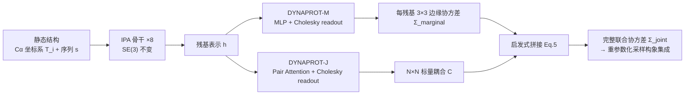

# Learning Residue Level Protein Dynamics with Multiscale Gaussians

**会议**: ICLR 2026  
**OpenReview**: [https://openreview.net/forum?id=uKn9PdREBA](https://openreview.net/forum?id=uKn9PdREBA)  
**代码**: 待确认  
**领域**: 计算生物学 / 蛋白质动力学预测  
**关键词**: 蛋白质动力学, 多元高斯, RMSF, SE(3) 不变, 协方差预测, 构象集成生成  

## 一句话总结
DYNAPROT 把蛋白质动力学建模成「对静态结构上 Cα 坐标的多元高斯分布」，用一个轻量 SE(3) 不变网络从单个静态结构直接预测每残基 3×3 边缘协方差和残基对 N×N 标量耦合，再用一个启发式拼出完整 3N×3N 联合协方差，从而以小三个数量级的参数量实现快速且可解释的柔性预测与构象集成采样。

## 研究背景与动机
**领域现状**：理解蛋白质的动态构象波动（而非单一静态结构）才是揭示其生物功能的关键——酶的催化、别构信号传导、GPCR 状态切换都依赖构象涨落。分子动力学（MD）模拟是黄金标准，但模拟单个蛋白 100 ns 需要数天到数周，无法做蛋白质组级别的规模化预测。

**现有痛点**：深度学习路线分两类。一类是**隐式集成生成器**（AlphaFlow、BioEMU、MSA subsampling），把 AlphaFold2 改造成流匹配/扩散模型来采样构象，但都需要大规模 PDB 预训练、推理时要做多次随机前向才能产生构象多样性，又慢又重；很多场景其实并不需要完整构象集合，紧凑可解释的动力学描述子就够了。另一类是**显式动力学预测器**：FlexPert3D 只预测标量 RMSF（每残基一个波动幅度），丢掉了方向性和残基间耦合；Normal Mode Analysis（NMA）是经典物理方法，不从数据学习、只看输入结构算低频简正模，对输入结构质量敏感、难以刻画局部各向异性和构象异质性。

**核心矛盾**：表达力与效率不可兼得——要么用昂贵采样换丰富动力学信息（MD、AlphaFlow），要么用便宜计算换贫瘠的标量描述子（RMSF、NMA）。

**本文目标**：设计一个落在「表达力 × 效率」帕累托前沿上的模型，既能刻画丰富的动力学行为（各向异性、残基耦合、乃至完整联合协方差），又不付出采样或模拟的代价。

**核心 idea**：**[高斯视角统一动力学]** 把动力学统一看成结构坐标上的多元高斯 $X\sim\mathcal{N}(\mu,\Sigma_{\text{joint}})$，其二阶矩 $\Sigma_{\text{joint}}$ 理论上编码了所有动力学信息（主成分、距离方差、全局柔性）。直接学 $3N\times 3N$ 联合协方差不可行，于是**[分尺度建模]** 只显式学两个可处理的尺度——每残基 3×3 边缘各向异性 + 残基对 N×N 标量耦合，再**[启发式拼联合]** 把二者组合还原出近似完整联合协方差用于快速采样。

## 方法详解

### 整体框架
DYNAPROT 由两个共享骨干、仅 readout 不同的子模型构成：DYNAPROT-M 预测每残基的 3×3 边缘高斯，DYNAPROT-J 预测残基对的 N×N 标量耦合。输入是蛋白的局部 Cα 残基坐标系 $\{T_i=(R_i,t_i)\}\in SE(3)$ 加序列嵌入，共享骨干是 8 层来自 AlphaFold2 结构模块的 Invariant Point Attention（IPA），保证对全局 SE(3) 变换不变，输出每残基表示 $h\in\mathbb{R}^{N\times D}$。两个 readout 的输出再经第 3.4 节的启发式拼成完整联合协方差，用于构象集成采样。

### 关键设计

**1. 高斯分层表征：把动力学拆成可学的两个尺度。** 论文把 N 个残基的 Cα 坐标看成随机变量 $X\in\mathbb{R}^{3N}$，整体服从 $\mathcal{N}(\mu,\Sigma_{\text{joint}})$，其中 $\mu$ 取输入结构（通常是最小能量构象）作为集合均值，因此问题归结为预测协方差。沿对角块取出单残基的 3×3 边缘 $\Sigma^{(i)}_{\text{marginal}}$（各向异性「高斯椭球」，其迹的平方根 $\text{RMSF}_i=\sqrt{\text{Tr}(\Sigma^{(i)}_{\text{marginal}})}$ 自然退化为标量柔性）；把每个 3×3 块用 MeanPooling 投影成标量得到残基对耦合矩阵 $C\in\mathbb{R}^{N\times N}$。这样形成 4 级动力学层级（标量 RMSF → 3×3 边缘 → N×N 标量耦合 → 完整 3N×3N），DYNAPROT 显式学第 2、3 级，既保留局部可解释性又保留全局协同，绕开了直接学完整联合的不可处理性。

**2. Cholesky 参数化保证协方差半正定。** 协方差矩阵必须对称正定（SPD），直接预测 9 个或对称化 6 个元素都无法保证正定。论文利用「任意 SPD 矩阵可由其 Cholesky 分解唯一确定」，让模型预测下三角矩阵 $L_i$ 的 6 个元素、对角线用 Softplus 强制为正，再还原 $\Sigma^{(i)}_{\text{marginal}}=L_iL_i^\top$，从构造上确保 SPD。边缘模块用一个简单 MLP readout 这样做；成对模块则先把每对残基嵌入拼接 $[h_i\|h_j]$ 投影后过 AlphaFold 式 Evoformer 三角注意力块（建模高阶几何依赖），输出标量填进大下三角矩阵 $L$ 再 $C=LL^\top$，同样保证整个耦合矩阵 SPD。

**3. SPD 流形上的 log-Frobenius 损失。** SPD 矩阵位于非欧的黎曼流形上，标准欧氏距离（MSE/Frobenius）忽略曲率会导致梯度不稳定。论文改用 log-Euclidean 距离 $L_{\text{LogFrob}}=\|\log(\Sigma_{\text{pred}})-\log(\Sigma_{\text{true}})\|_F^2$，其中 $\log(\Sigma)=Q\log(\Lambda)Q^\top$ 通过矩阵对数把 SPD 矩阵映到切空间，使欧氏度量在「局部欧几里得」的切空间上才成立（消融显示这比 Bures-Wasserstein 更稳定，比朴素 MSE 显著更好）。

**4. 启发式重建联合协方差实现快速采样。** 给定预测的边缘 $\{\Sigma^{(i)}_{\text{marginal}}=L_iL_i^\top\}$ 和标量耦合 $C$，论文借用单变量恒等式 $\text{Cov}(i,j)=\text{Corr}(i,j)\cdot\sigma_i\sigma_j$ 把它推广到多变量，定义残基对交叉协方差块 $\Sigma^{(i,j)}_{\text{joint}}=L_i\tilde{C}_{ij}L_j^\top$（$L_i$ 充当矩阵平方根、$\tilde C$ 是标准化后的相关矩阵），用 Kronecker 积写成 $\Sigma_{\text{joint}}=L_{\text{marginal}}(\tilde C\otimes I_3)L_{\text{marginal}}^\top$，并证明该重建结果仍是 SPD（Proposition 3.1）。有了联合协方差和均值，就能用多元重参数化技巧 $x=\mu+L\epsilon,\ \epsilon\sim\mathcal{N}(0,I)$ 极快地采样构象集成——把昂贵的扩散/流匹配多次前向，换成一次矩阵分解加采样。

## 实验关键数据

数据来自 ATLAS 分子动力学数据集（1390 个按 ECOD 结构多样性筛选的蛋白，每个含 3 条 100 ns 重复轨迹），仅用约 1000 个 MD 蛋白训练、**无 PDB 大规模预训练**。两套划分：主划分对齐 AlphaFlow（1265/39/82），与 FlexPert3D 比较时用其拓扑划分（1112/139/139）。

### 主实验：残基柔性 RMSF（FlexPert 测试划分，Pearson r，中位/75 分位）

| 方法 | RMSF r (↑) | 参数量 |
|------|-----------|--------|
| **DYNAPROT-M** | **0.865 / 0.930** | 955 K |
| FlexPert-3D | 0.830 / 0.899 | 1.2 B |
| NMA (ANM) | 0.697 / 0.784 | – |

DYNAPROT-M 在解决更难的任务（预测各向异性而非标量）时，仍以**小三个数量级**的参数量（955K vs 1.2B）取得更高的 RMSF 相关性。

### 各向异性边缘预测（ATLAS 测试划分，长度 271 蛋白运行时，25 分位/中位，↓ 更好）

| 方法 | RMWD Var | Sym. KL Var | 参数量 | 时间 |
|------|----------|-------------|--------|------|
| **DYNAPROT-M** | 0.84 / 1.18 | 0.53 / 0.91 | 955 K | ∼0.02 s |
| AFMD+T | 0.87 / 1.10 | 0.37 / 0.60 | 95 M | ∼7000 s |
| NMA (ANM) | 1.14 / 1.45 | 3.03 / 4.56 | – | ∼5.37 s |

DYNAPROT-M 显著优于 NMA，与 AlphaFlow+Templates 相当，但快约 **35 万倍**、小约 100 倍。

### 构象集成生成（ATLAS，Cα 集成评测）

| 指标 | AFMD+T | DYNAPROT | NMA |
|------|--------|----------|-----|
| Pairwise RMSD (gt=2.89) | 2.18 | 2.17 | 0.91 |
| Per-target RMSF r (↑) | 0.92 | 0.86 | 0.76 |
| MD PCA W2 (↓) | 1.25 | 1.74 | 1.86 |
| Joint PCA W2 (↓) | 1.58 | 2.39 | 2.45 |
| 参数量 (↓) | 95 M | 2.86 M | – |
| 采样时间 (↓) | ∼10,000 s | ∼0.14 s | ∼5.69 s |

### 关键发现
- **柔性与对target相关性接近 AlphaFlow，速度快约 7 万倍**：DYNAPROT 在 pairwise RMSD、per-target RMSF 相关上与 AFMD+T 相当，仅在分布相似度（PCA W2）和瞬态接触等观测量上略逊。
- **残基耦合优于 NMA**：DYNAPROT-J 在短到中程耦合（峰值 r=0.71）显著强于 NMA（r=0.59），正是耦合最强的区间。
- **零样本隐蔽口袋发现**：对腺苷酸琥珀酸合成酶（apo 1ADE / holo 1CIB），DYNAPROT-M 在 apo 上预测的最大方差残基恰好包围结合口袋，且椭球方向与口袋开放运动一致，展示了边缘各向异性的功能洞察潜力。

## 亮点与洞察
- **统一的高斯视角**把零散的动力学描述子（RMSF、各向异性、耦合、联合协方差）组织成一个可解释的四级层级，理论清晰。
- **「训练边缘+耦合、却能拼出联合」是最巧的一步**：模型从未显式训练完整 3N×3N 联合，但通过 Cholesky 因子作矩阵平方根 + 相关矩阵 Kronecker 积的启发式即可重建并保证 SPD，把昂贵的生成式采样换成一次解析采样。
- **极致参数效率**：955K~2.86M 参数对阵 95M~1.2B，且无需 PDB 预训练，仅 ~1000 MD 蛋白即可训练，说明显式预测动力学描述子是规模化的可行替代路线。
- 各向异性方向性带来 RMSF 之外的功能信号（隐蔽口袋方向），是标量方法做不到的。

## 局限与展望
- **粗粒度到 Cα 骨架**：仅建模 Cα，忽略侧链柔性，对涉及侧链重排的别构/催化机制刻画不足。
- **高斯近似的天花板**：单一多元高斯无法表达多峰构象分布（如明显的 apo↔holo 双态切换），在分布覆盖（PCA W2）和瞬态/弱接触恢复上落后于真正的集成生成器。
- **联合协方差是启发式而非精确**：Eq.5 重建是近似，对长程强耦合或非高斯相关结构可能失真。
- **隐蔽口袋只是个案**：仅单个酶的定性展示，缺乏系统性基准验证。
- 未来可向混合高斯/分层生成、引入侧链与全原子、把动力学预测嵌入下游药物设计闭环。

## 相关工作与启发
- **隐式集成生成器**：AlphaFlow（流匹配重用 AF2）、BioEMU（PDB+AFDB 预训练、200ms MD 微调的扩散）、MSA subsampling——丰富但慢且需大规模预训练。
- **显式动力学预测器**：FlexPert3D（标量 RMSF）、Dyna-1（NMR 化学位移缺失作隐变量预测 µs–ms 运动）、NMA/ANM（物理简正模，不学习）——DYNAPROT 是首个显式学习边缘+成对高斯、并以数据驱动方式预测完整 3N×3N 协方差的模型。
- **启发**：当下游只需「二阶统计量」而非完整样本时，直接回归协方差结构 + 解析采样可能远比生成式采样更划算；SPD 流形上的 Cholesky 参数化 + log-Euclidean 损失是处理协方差预测的通用范式，可迁移到其他不确定性/各向异性回归任务。

## 评分
- **新颖性**: ⭐⭐⭐⭐ 用统一高斯视角把蛋白动力学拆成可学的多尺度协方差、并首次以数据驱动方式重建完整联合协方差，视角与做法都新颖。
- **实验充分度**: ⭐⭐⭐⭐ 覆盖 RMSF、各向异性、残基耦合、集成生成四类任务，对照 FlexPert3D/AlphaFlow/NMA 并报告参数量与运行时，含消融与隐蔽口袋案例；多峰分布与系统性功能验证略缺。
- **写作质量**: ⭐⭐⭐⭐ 数学推导（SPD、Cholesky、Kronecker 重建、SPD 闭包命题）清晰，图表层次分明，帕累托前沿的动机贯穿全文。
- **价值**: ⭐⭐⭐⭐ 以三个数量级更小的模型逼近昂贵集成生成器的柔性精度，为蛋白质组级动力学预测提供了可规模化、可解释的实用替代方案。

<!-- RELATED:START -->

## 相关论文

- [\[ICLR 2026\] Learning Explicit Single-Cell Dynamics Using ODE Representations](learning_explicit_single-cell_dynamics_using_ode_representations.md)
- [\[ICLR 2026\] ProTDyn: A Foundation Protein Language Model for Thermodynamics and Dynamics Generation](protdyn_a_foundation_protein_language_model_for_thermodynamics_and_dynamics_gene.md)
- [\[ICLR 2026\] Scalable Spatio-Temporal SE(3) Diffusion for Long-Horizon Protein Dynamics](scalable_spatio-temporal_se3_diffusion_for_long-horizon_protein_dynamics.md)
- [\[NeurIPS 2025\] Towards Multiscale Graph-based Protein Learning with Geometric Secondary Structural Motifs](../../NeurIPS2025/computational_biology/towards_multiscale_graph-based_protein_learning_with_geometric_secondary_structu.md)
- [\[ICML 2026\] Protein Autoregressive Modeling via Multiscale Structure Generation](../../ICML2026/computational_biology/protein_autoregressive_modeling_via_multiscale_structure_generation.md)

<!-- RELATED:END -->
