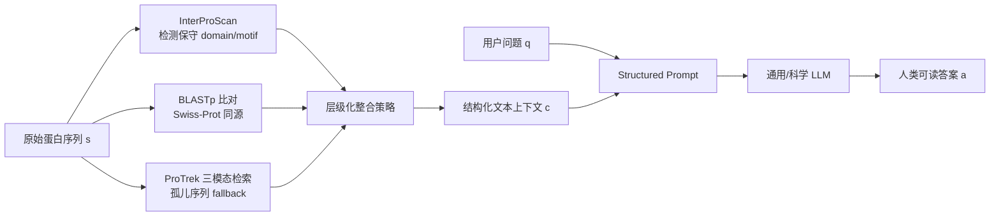

# Lost in Tokenization: Context as the Key to Unlocking Biomolecular Understanding in Scientific LLMs

**会议**: ICLR 2026  
**OpenReview**: [https://openreview.net/forum?id=RDAhLHEHDm](https://openreview.net/forum?id=RDAhLHEHDm)  
**代码**: 待确认  
**领域**: 计算生物学 / 科学大模型  
**关键词**: Scientific LLM, 生物分子理解, Tokenization, 上下文驱动, 蛋白质功能预测, 生物信息学工具  

## 一句话总结
本文系统验证了一个反直觉结论：与其逼科学大模型（Sci-LLM）去直接"读懂"原始生物分子序列，不如用 BLAST/Pfam/GO 等成熟生物信息学工具把序列预处理成高层、人类可读的文本上下文喂给模型——"只给上下文"在蛋白质 QA 上大幅超越"只给序列"，而且**把原始序列和上下文一起喂反而会拖累性能**，说明现有 Sci-LLM 的真正价值是"知识推理引擎"而非"序列解码器"。

## 研究背景与动机
- **领域现状**：科学大模型（Intern-S1、Evolla、NatureLM 等）想把 DNA/RNA/蛋白质的"生命语言"接入 LLM，主流有两条路线——把序列当语言（sequence-as-language，扩词表直接 tokenize 氨基酸/核苷酸）和把序列当模态（sequence-as-modality，用 ESM/Evo 这类编码器出 embedding 再对齐到 LLM）。
- **现有痛点**：作者把这两条路统称为 **tokenization 困境（tokenization dilemma）**的两只角。第一只角是**弱表征**——把序列拆成单个氨基酸/核苷酸的原子 token，破坏了 motif、domain、调控元件这些真正承载生物意义的层级结构，模型被迫从一堆"字母"里重学生物学"单词"，低效且难泛化。第二只角是**语义错配**——专用编码器的隐空间由生物物理和进化规律支配，LLM 的隐空间由人类语言塑造，对齐模块要跨越这道鸿沟，对齐不完美就会注入歧义甚至误解。
- **核心矛盾**：两条路线都默认 LLM 应该亲自去解读底层序列语法，但这恰恰是 LLM 最不擅长、且当前能力最弱的环节；与此同时，几十年生物学智慧已经沉淀在 BLAST、Pfam、Gene Ontology 等专家工具里，却被绕过。
- **本文目标**：通过系统的实证对比（sequence-only / context-only / sequence+context 三种输入），回答"Sci-LLM 的成功到底来自对原始序列的真实理解，还是来自对结构化知识的推理"。
- **核心 idea**：**【范式重构】** 用生物信息学工具把原始序列转成信息密集、且与 LLM 语言空间原生对齐的文本上下文，**主动丢弃原始序列**，把任务从"低层序列解读"彻底改写成"高层知识综合与推理"，从而一次性绕开 tokenization 困境的两只角。

## 方法详解

### 整体框架
作者先用统一记号刻画三种范式：任务是学一个函数 $f: \mathcal{S} \times \mathcal{Q} \to \mathcal{A}$，把序列 $s$ 和问题 $q$ 映射到答案 $a = M(s,q;\theta)$。sequence-as-language 把输入拼成 $X_{input}=[T_{text}(q); T_{seq}(s)]$（扩展词表直接 tokenize 序列）；sequence-as-modality 用专用编码器 $E_{bio}$ 加对齐模块 $A_{align}$ 得到 $X_{input}=[T_{text}(q); E_{aligned\_seq}]$。本文提出的 **context-driven** 范式则定义一个工具函数 $C:\mathcal{S}\to\mathcal{T}_{context}$，把序列转成结构化文本上下文 $c=C(s)$，输入里**刻意省掉原始序列** $X_{input}=[T_{text}(q); T_{text}(c)]$，并以 $P(a|s,q)\approx P(a|c,q)$ 近似答案分布。整套对比不需要任何训练，是一个即插即用的 prompt 级方案。

### 关键设计

**1. 多源工具链生成功能画像：把序列"翻译"成专家注释。** 上下文生成的核心是一条三段式生物信息学流水线，分工互补地榨取序列里的功能信号。InterProScan 基于序列的内在特征识别保守 domain 和 motif，这是一种 *ab initio* 的特征级分析，靠的是知识库里的结构特征而非这条序列自己的注释记录；BLASTp 则去 Swiss-Prot 里检索近缘同源物，把同源蛋白的注释借过来；当遇到既无同源命中也无 domain 命中的"孤儿序列"时，用三模态检索模型 ProTrek 作为兜底，生成一段基础语义描述。三者的输出按一个经验驱动的层级策略整合成最终上下文，保证不同新颖程度的序列都能拿到尽量丰富的文本信息。

**2. 结构化 Prompt 把异构注释组织成可推理文本。** 整合后的上下文不是简单拼接，而是塞进一个固定模板的角色化 prompt——让模型扮演"资深系统生物学家"，把内容分成"保守 domain（来自 Pfam）""功能注释（来自 BLASTp 同源的 GO terms）""兜底语义分析（来自 ProTrek，仅在前两者都缺失时启用）"三个层级块，再接用户问题。这种组织方式让 LLM 处理它最擅长的东西：信息密集、原生对齐自然语言的结构化文本，从而把角色从"序列解码器"转成"知识综合器"。

**3. 双轴防泄漏设计：保证评测的公平性。** 由于上下文来自数据库，最大风险是直接把答案抄进上下文造成 label leakage，作者沿两条互补的轴显式规避。其一是**内在分析而非身份查询**——InterProScan 检测的是查询序列内在的 domain/motif，依据的是领域知识库里的结构特征，所以即使是全新蛋白也能识别出"这是个激酶 domain"，而不是去查这条蛋白自己的标签。其二是**基于同源的推断而非直接注释匹配**——用 BLASTp 时只读**同源序列**的 GO 注释，绝不读查询蛋白自己的记录，这正是标准生物信息学实践：靠类比已知同源物来预测未知序列的功能，而非检索预先标好的答案。

## 实验关键数据

### 主实验表格
基准聚焦蛋白质生物学三大方面：分子功能（Func.）、代谢通路（Path.）、亚细胞定位（Sub. Loc.），用通用 LLM 当裁判打分（LLM-Score）。对比三种输入配置（Seq-only / Seq+Context / Context-only）：

| 模型 | Seq | Ctx | Func. | Path. | Sub. Loc. | All |
|------|-----|-----|-------|-------|-----------|-----|
| Intern-S1 | ✓ | | 20.57 | 26.56 | 69.75 | 43.33 |
| Intern-S1 | ✓ | ✓ | 74.18 | 98.85 | 93.00 | 84.03 |
| Intern-S1 | | ✓ | 76.22 | 97.60 | 95.60 | **86.15** |
| Evolla | ✓ | | 40.23 | 72.71 | 79.76 | 59.93 |
| Evolla | ✓ | ✓ | 57.46 | 84.69 | 83.05 | 70.53 |
| Evolla | | ✓ | 65.77 | 83.33 | 81.88 | **74.02** |
| NatureLM | ✓ | | 3.58 | 5.52 | 10.45 | 6.82 |
| NatureLM | | ✓ | 44.77 | 51.35 | 32.51 | **39.50** |
| Deepseek-v3 | ✓ | | 10.98 | 24.54 | 74.72 | 40.77 |
| Deepseek-v3 | | ✓ | 75.79 | 93.96 | 93.65 | 84.99 |
| Gemini2.5 Pro | | ✓ | 79.17 | 98.65 | 94.56 | **87.19** |
| GPT-5 | | ✓ | 77.25 | 85.73 | 73.05 | 75.76 |
| Qwen3-235B | | ✓ | 75.63 | 92.19 | 94.28 | 84.99 |

**核心现象**：Context-Only 对每个模型都是最优或近最优；NatureLM 仅给序列时几乎全崩（All=6.82），给上下文后飙到 39.50。最反直觉的是 **Seq+Context 普遍劣于 Context-Only**（Evolla 74.02→70.53，Intern-S1 86.15→84.03），证明原始序列不只是冗余、而是主动有害的"信息噪声"。

### 消融 / 深入分析

| 分析维度 | 关键结论 |
|----------|----------|
| 表征质量（t-SNE + ARI，对 MMseqs2 50% 同源簇）| NatureLM 0.492、Intern-S1 0.690、Evolla 0.809，**上下文文本表征 0.958**，近乎完美的功能分离 |
| 语义错配（Evolla 逐层）| SaProt 编码器 ARI 0.945 → Q-Former 对齐 0.916 → LLM 末层 0.809，退化发生在**对齐阶段**而非编码阶段 |
| 时间泛化（1995–2024 每年 ~100 蛋白）| 本文方法仅轻微下滑；Evolla 在近十年蛋白上急剧崩塌；Intern-S1 全程低平 |
| 效率（单条/批处理）| 单条比 Evolla 约便宜 23×、快 1.3×；批处理约便宜 30×、**快 154×**（CPU 跑工具 + API） |
| 湿实验验证（全新未发表序列）| Rhodopsin 100%、PETase 97.3% 准确率；Evolla 在 PETase 上灾难性失败 |

### 关键发现
- **上下文是主角、序列是噪声**：哪怕带专用 tokenization 的 Sci-LLM，叠加原始序列也会掉分，"lost in tokenization"被实证。
- **困境两只角被解剖清楚**：弱表征（ARI 对比）和语义错配（Evolla 逐层 ARI 退化）各有可视化证据。
- **双重鲁棒性**：对序列新颖性鲁棒、对时间漂移鲁棒，说明在稳定的高层知识上推理比硬解原始序列更可靠。

## 亮点与洞察
- **方法极简但结论震撼**：不训练、不改架构，纯靠输入范式切换就把蛋白 QA 从 40 分级别拉到 85+ 分级别，且揭示"序列有害"这一对整个领域有冲击力的观察。
- **把"困境"做成可量化的解剖**：用 ARI + 逐层 t-SNE 把"弱表征"和"语义错配"两只角分别落到具体数字上，论证链条干净。
- **效率账算得很实在**：基于 AWS 按需定价做单条/批处理两套成本-时间分析，批处理 154× 提速对高通量科研是真痛点解法。
- **重新定位 Sci-LLM**：主张把 Sci-LLM 当"专家知识上的推理引擎"而非"序列解码器"，为"混合式科学 AI agent"（LLM + 工具）指了方向。

## 局限与展望
- **依赖知识库覆盖度**：上下文质量绑定 BLAST/Pfam/GO 等工具的命中率，对真正的孤儿序列、缺同源信息的新蛋白，上下文会变稀疏，本文方法也随年份轻微下滑（虽远好于对比方法）。
- **任务局限于蛋白 QA**：实验集中在蛋白质功能/通路/定位三类问题，对 DNA/RNA/小分子等其他生物分子、以及需要从头设计而非"理解"的生成任务，结论是否成立尚待验证。
- **"序列无用"是当下结论而非终点**：作者的主张是现有 tokenization 范式下序列是噪声，并不否定未来更好的序列表征可能有价值；如何让序列信息真正与上下文互补，是开放问题。
- **裁判用 LLM-Score**：评测靠通用 LLM 当裁判，可能引入裁判偏好；湿实验验证缓解了部分担忧但样本量较小（数十条）。

## 相关工作与启发
- **生物序列基础模型**：ProtBERT、ESM 系列、DNABERT/Nucleotide Transformer/DNABERT-2 等在表征学习上很强，但 embedding 是"黑箱"，难映射到 motif/domain/pathway 等人类可解释单元——这正是本文绕开它们、改用文本上下文的动机。
- **科学大模型**：Galactica、NatureLM、Intern-S1 等把通用 LLM 能力扩到科学领域；Evolla、BioReason 走 sequence-as-modality 路线，是本文主要对比对象。
- **工具增强 / agent 路线**：GeneAgent、ChemCrow 让 LLM 调外部工具，本文与之精神一致，但更进一步地证明"在很多理解任务上，干脆只给工具产出的上下文、丢掉原始序列"反而最优，为混合科学 agent 的设计提供了强 baseline 与实证依据。

## 评分
- **新颖性**: ⭐⭐⭐⭐ — 方法本身（调工具生成上下文）并不复杂，但"序列是噪声、context-only 最优、Seq+Context 反而掉分"这组反直觉结论对 Sci-LLM 领域有真正的认知冲击，属于"重新框定问题"型贡献。
- **实验充分度**: ⭐⭐⭐⭐ — 覆盖专用 Sci-LLM + 通用大模型、三种输入配置、表征/对齐/时间/效率/湿实验五类分析，论证链条完整；扣分在任务局限蛋白 QA、裁判用 LLM、湿实验样本偏小。
- **写作质量**: ⭐⭐⭐⭐ — "tokenization 困境两只角"的叙事框架清晰，图表（ARI 对比、trade-off landscape）支撑有力，逻辑层层递进。
- **价值**: ⭐⭐⭐⭐ — 给出一个低成本、高性能、可立即落地的强 baseline，并为"LLM 当推理引擎 + 工具当感知器"的混合科学 AI 范式提供了有说服力的方向性证据。

<!-- RELATED:START -->

## 相关论文

- [\[ICLR 2026\] VenusX: Unlocking Fine-Grained Functional Understanding of Proteins](venusx_unlocking_fine-grained_functional_understanding_of_proteins.md)
- [\[ICLR 2026\] CellDuality: Unlocking Biological Reasoning in LLMs with Self-Supervised RLVR](cellduality_unlocking_biological_reasoning_in_llms_with_self-supervised_rlvr.md)
- [\[AAAI 2026\] MergeDNA: Context-aware Genome Modeling with Dynamic Tokenization through Token Merging](../../AAAI2026/computational_biology/mergedna_context-aware_genome_modeling_with_dynamic_tokenization_through_token_m.md)
- [\[ICLR 2026\] Thompson Sampling via Fine-Tuning of LLMs](thompson_sampling_via_fine-tuning_of_llms.md)
- [\[ICLR 2026\] Towards Understanding the Shape of Representations in Protein Language Models](towards_understanding_the_shape_of_representations_in_protein_language_models.md)

<!-- RELATED:END -->
