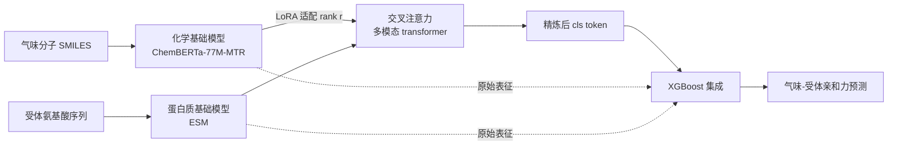

# Low rank adaptation of chemical foundation models generate effective odorant representations

**会议**: ICLR 2026  
**OpenReview**: [https://openreview.net/forum?id=BUUfUcIcfE](https://openreview.net/forum?id=BUUfUcIcfE)  
**代码**: 待确认  
**领域**: 计算生物学 / 嗅觉表征学习  
**关键词**: 嗅觉, 化学基础模型, LoRA 微调, 气味-受体亲和力, 交叉注意力, 表征对齐  

## 一句话总结
本文先用大规模 benchmark 证明现成化学基础模型生成的气味分子表征并不比手工理化描述符更强（因为信息高度冗余重叠），再提出 LORAX——用 LoRA 对化学基础模型做嗅觉任务微调 + 交叉注意力 + XGBoost 集成，造出与神经表征更对齐、泛化更好的气味分子表征。

## 研究背景与动机
**领域现状**：如何「表征气味分子」是嗅觉研究的核心难题——结构相似的气味分子可能在受体层和感知层引发截然不同的神经响应（structure-odor relationship 高度非线性）。早期靠手工挑选的理化描述符（分子量、环数等），近年转向数据驱动：要么用 GNN 等监督模型直接学表征，要么用自监督的化学基础模型（在海量无标注分子上预训练）生成固定特征。后者在嗅觉这种小数据场景下尤其有吸引力，毕竟潜在气味分子有数十亿之多。

**现有痛点**：化学基础模型在分子性质预测等领域很成功，但**从未被系统地用于气味-受体亲和力预测**，也没人横向 benchmark 过它们到底比手工描述符强多少。大家默认「基础模型表征更丰富」，但这个假设在嗅觉任务上从未被验证。

**核心矛盾**：本文做了 15 种表征 × 3 种特征法的系统 benchmark，发现一个反直觉结论——**现成化学基础模型表征并不优于手工理化描述符**。用正交 Procrustes 和 CCA 距离分析发现，这些表征彼此高度重叠、信息冗余，自监督预训练本身并没有学到对「气味-受体结合」有用的新特征。问题不在于基础模型没用，而在于**纯特征法（不微调）无法激活它们的潜力**。

**本文目标**：造出一种气味专属、与神经响应对齐、泛化能力强的分子表征，而不是直接拿预训练 embedding 当固定特征。

**核心 idea**：**[微调 > 特征法]** 用 LoRA 对化学基础模型做参数高效微调，把通用化学表征「拨」向嗅觉任务，在过拟合（纯监督）与欠拟合（纯特征法）之间找到甜点。

## 方法详解

### 整体框架
LORAX（LoRA-based Odorant-Receptor Affinity prediction with CROSS-attention）是一个多模态 transformer：蛋白质基础模型（ESM）编码受体、化学基础模型（ChemBERTa-77M-MTR）编码气味分子，两者经交叉注意力融合，并用 LoRA 在训练中持续更新化学侧表征；最后接一个 XGBoost 集成做最终预测。训练分两阶段——先训 transformer（含 LoRA 参数）精炼 `<cls>` token，再冻结 transformer，把 `<cls>` token 与原始基础模型 embedding 一起喂给 XGBoost 集成在测试集上出预测。

### 关键设计

**1. 先做诊断 benchmark，证明「纯特征法救不了基础模型」：** 在动手造新模型前，作者用三种纯特征法（Molecule-only 岭回归、Molecule+Protein 岭回归、ProSmith 多模态 transformer+XGBoost）系统对比 15 种表征——5 个 transformer 基础模型、3 个 GNN 基础模型、8 个理化描述符、1 个随机基线。结论很硬：只有分子信息时 $R^2$ 极低且方差大（必须引入受体信息），而在 ProSmith 这种最强设定下，做完单因素 ANOVA + Bonferroni 校正的 Tukey 检验后发现，**除三个最差表征外其余表征统计上等价**——化学基础模型并没有比手工描述符强。这一步把「为什么需要微调」论证得无可辩驳，是全文立论的地基。

**2. 用 Procrustes/CCA 距离揭示「冗余」根因：** 为解释基础模型为何失效，作者把 Carey 数据集的气味分子嵌入各表征空间，两两计算正交 Procrustes 距离和 CCA 距离。结果显示绝大多数表征在距离矩阵左上角挤成一个「小距离块」——彼此高度对齐。例如 RDKitDescriptors2D 与 MordredDescriptors 的 Procrustes 距离仅 0.61、在 ProSmith 里表现几乎一致；ChemBERTa-77M-MTR（在 7700 万 SMILES 上训练去预测 RDKit 描述符）则与 RDKitDescriptors2D 高度相似。**信息内容大量重叠 → 表征同质化冗余**，这正是它们性能趋同的本质原因，也直接动机化了「需要微调来打破冗余」。

**3. LoRA 微调 + 交叉注意力把表征「拨向嗅觉」：** LORAX 的核心是用低秩适配矩阵（秩 $r$）在训练中更新化学基础模型，而非冻结它。相比从头监督训练（易过拟合）和纯特征法（受限于初始表征而欠拟合），LoRA 的低秩假设提供了一个「甜点」：既保留预训练带来的化学先验，又能选择性地为嗅觉任务注入新特征。交叉注意力块让气味分子表征与受体表征充分交互，把精炼信息压进 `<cls>` token。值得注意的是，作者发现**只微调化学侧（LORAX (C)）反而略优于同时微调蛋白质+化学侧（LORAX (P+C)）**，尽管后者多了约 200 万参数——说明 ESM 给出的受体表征已足够好，收益主要来自被改进的化学表征。

**4. XGBoost 三路集成兼顾性能与可解释性：** 集成里每个 XGBoost 用一组不同输入特征——(1) transformer 的 `<cls>` token、(2) 拼接的原始化学+蛋白质表征、(3) 二者拼接。各 XGBoost 的加权和给出最终预测，而**权重本身就是诊断工具**：作者发现 ProSmith 把高权重压在「只用原始表征」的那路 XGBoost 上（即它的 transformer 学出的 `<cls>` token 基本被忽略），而 LORAX 给「不含 `<cls>` token」那几路的权重更低、其 transformer 单独的验证 $R^2$ 也更高。这一对比定量证明了 **LORAX 真的从基础模型里抽出了更多任务相关信息**，而不只是换了套架构。

## 实验关键数据

### 主实验：M2OR 大数据集对比（5 折交叉验证）

| 模型 | AUROC | AveP | Precision | Recall | F-score | MCC |
|---|---|---|---|---|---|---|
| MolOR (Weighted) | 76.12±1.53 | 0.626 | 0.507 | 0.727 | 0.595 | 0.467 |
| Hladiš et al. | n/a | 0.780 | 0.689 | 0.698 | 0.693 | 0.605 |
| ProSmith | **90.47±0.98** | 0.584 | **0.764** | 0.671 | 0.712 | 0.641 |
| LORAX (P+C) | 82.43 | 0.776 | 0.729 | 0.727 | 0.727 | 0.650 |
| **LORAX (C)** | 83.24 | **0.778** | 0.710 | **0.754** | **0.730** | **0.651** |

在类别极度不平衡的 M2OR 上，MCC/F-score 比 AUROC 更可信：LORAX (C) 在这两项均居首，显著优于 MolOR（p<0.003），也优于 ProSmith（p=0.067）。ProSmith 的高 AUROC 在类别不平衡下意义有限。

### 泛化实验：Carey 数据集两种 split（R² 越高越好）

| 场景 | 方法 | avg | std |
|---|---|---|---|
| 未见气味分子 | ProSmith | -0.402 | 1.064 |
| 未见气味分子 | **LORAX** | **0.045** | **0.614** |
| 未见气味分子 | Naïve | -1.016 | 1.954 |
| 未见受体 | ProSmith | 0.088 | 0.169 |
| 未见受体 | LORAX | 0.060 | 0.067 |

LORAX 在「未见气味分子」上明显优于 ProSmith（p=0.069），且是唯一稳定超过 Naïve 基线的；ProSmith 在此场景甚至打不过 Naïve。未见受体场景两者持平。

### 关键发现
- 在标准 Carey 设定下 LORAX 与 ProSmith 几乎同分（0.712 vs 0.703，p=0.264），**性能优势主要体现在泛化与大数据集**，而非简单的同分布预测。
- CCA 距离分析显示：微调后的 LORAX 表征比原始 ChemBERTa **更远离理化描述符、更靠近所有图方法（GNN/ECFP），且更对齐神经响应表征**——证明 LoRA 确实造出了一个全新、嗅觉专属的气味空间。

## 亮点与洞察
- **「先证伪、再立论」的研究范式**：不是上来就秀新模型，而是先用严谨统计 benchmark 把「现成基础模型够用」这个隐含假设证伪，再顺理成章引出微调方案，论证链条极其扎实。
- **把集成权重当诊断仪**：用 XGBoost 各路权重和 transformer 单独验证分数，定量分离「架构贡献」和「表征贡献」，比单看最终分数信息量大得多。
- **神经表征对齐作为「微调有效」的机理证据**：不止报告分数提升，还用 CCA 距离证明微调让分子空间向真实神经响应空间靠拢，给「为什么更好」提供了可解释的机理解释。
- **负结果也是贡献**：P+C 双微调反而更差，干净地说明「受体侧表征已饱和，瓶颈在化学侧」，对后续工作很有指导价值。

## 局限与展望
- 多数提升**统计显著性偏弱**（泛化 p=0.069、vs ProSmith p=0.067），样本/split 有限，结论稳健性有待更大规模验证。
- 主分析只用了 ChemBERTa-77M-MTR 一个化学基础模型（附录补了 Uni-Mol2），更大更新的化学基础模型 + LoRA 可能进一步提升，作者也将其列为未来方向。
- 任务聚焦气味-受体结合，尚未延伸到下游的**气味感知（percept）预测**——而这才是嗅觉研究更核心的问题，作者推测 LoRA 微调同样能带来增益但未验证。
- LORAX 模块化设计（可换蛋白质/化学基础模型）是优点，但也意味着结论可能依赖具体模型组合，跨模型的普适性还需系统 benchmark。

## 相关工作与启发
- **嗅觉表征谱系**：从手工理化描述符（Haddad、Boyle、Gabler）→ 监督 GNN（Achebouche、Hladiš）→ 化学/蛋白质基础模型特征法（Shin、Taleb）。本文首次把化学基础模型系统用于气味-受体结合，并首次把 LoRA 引入嗅觉。
- **方法借鉴**：架构与训练范式借鉴 ProSmith（Kroll 2024）的多模态 transformer + XGBoost；LoRA 来自 Hu et al. 2021；表征距离分析用 Williams et al. 2022 的 Procrustes/CCA 框架。
- **启发**：本文是「LoRA 跨领域迁移」的一个干净案例——在一个数据稀缺、信息冗余的科学子领域，与其追更大模型，不如用参数高效微调把通用基础模型「拨准」。这种「benchmark 证伪 + 轻量微调」的套路可迁移到其他小数据科学任务（蛋白质、材料、单细胞等）。

## 评分
- **新颖性**: ⭐⭐⭐⭐ 首次系统 benchmark 化学基础模型于嗅觉、首次把 LoRA 引入气味-受体预测；方法本身是已有组件（LoRA+交叉注意力+XGBoost）的组合，但应用场景和发现是新的。
- **实验充分度**: ⭐⭐⭐⭐ 15 种表征 × 多数据集 × 多场景的 benchmark 很扎实，统计检验规范；扣分在多数关键提升显著性偏弱、主模型只用一个化学基础模型。
- **写作质量**: ⭐⭐⭐⭐⭐ 「先证伪再立论」结构清晰，用表征距离和集成权重把机理讲透，负结果也交代得干净利落。
- **价值**: ⭐⭐⭐⭐ 对嗅觉/计算神经科学社区有直接价值——既纠正了「基础模型够用」的误区，又给出可复用的微调框架；对更广的科学小数据建模也有方法论启发。

<!-- RELATED:START -->

## 相关论文

- [\[ICML 2026\] iLoRA: Bayesian Low-Rank Adaptation with Latent Interaction Graphs for Microbiome Diagnosis](../../ICML2026/computational_biology/ilora_bayesian_low-rank_adaptation_with_latent_interaction_graphs_for_microbiome.md)
- [\[ICLR 2026\] A Foundation Model with Multi-Variate Parallel Attention to Generate Neuronal Activity](a_foundation_model_with_multi-variate_parallel_attention_to_generate_neuronal_ac.md)
- [\[ICLR 2026\] Towards Understanding the Shape of Representations in Protein Language Models](towards_understanding_the_shape_of_representations_in_protein_language_models.md)
- [\[ICLR 2026\] Flow Autoencoders are Effective Protein Tokenizers](flow_autoencoders_are_effective_protein_tokenizers.md)
- [\[ICLR 2026\] Riemannian High-Order Pooling for Brain Foundation Models](riemannian_high-order_pooling_for_brain_foundation_models.md)

<!-- RELATED:END -->
