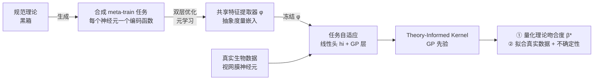

# Meta-Learning Theory-Informed Inductive Biases using Deep Kernel Gaussian Processes

**会议**: ICLR 2026  
**OpenReview**: [https://openreview.net/forum?id=7dvYWzOiEu](https://openreview.net/forum?id=7dvYWzOiEu)  
**代码**: 待确认  
**领域**: 计算神经科学 / 贝叶斯机器学习 / 元学习  
**关键词**: 规范理论 (Normative Theory), 高斯过程, 深度核, 元学习, 高效编码, 贝叶斯模型比较, 不确定性量化  

## 一句话总结
用贝叶斯元学习把"黑箱"规范理论（如视网膜的高效编码）自动蒸馏成一个深度核高斯过程先验（Theory-Informed Kernel），既能作为归纳偏置提升对真实神经数据的拟合，又能用精确边际似然严格量化"理论与数据的吻合程度"。

## 研究背景与动机
- **领域现状**: 神经科学里的规范理论（normative / task-driven，如高效编码）是解释生物系统结构的强大自上而下工具——它假设生物在进化压力下优化某个效用泛函 $\theta^* = \arg\max_\theta U(P(r|x,\theta), P_x(x))$，并已成功预测视网膜、初级视皮层乃至高级感觉区的神经活动。
- **现有痛点**: 这套范式有两个长期卡点。① **无法定量仲裁竞争理论**：贝叶斯模型选择（BMC）原则上能做，但前提是先手工把理论写成一个概率模型，且产生的边际似然在高维神经数据上几乎不可计算；② **理论知识难以系统性注入数据拟合**：把"好理论"和"嘈杂真实数据"结合的现有做法要么靠专家手工约束感受野（启发式、系统特定），要么只能用于理想化的简单模型。
- **核心矛盾**: 自上而下的理论解释力强但难落地为可计算的概率先验；自下而上的数据拟合灵活但缺乏理论结构。两者之间缺一座可扩展、自动化的桥梁。
- **本文目标**: 提出一个通用框架，只要理论能生成输入/输出预测，就能自动把它转成可处理的概率模型，同时服务于"拟合数据"和"验证理论"两个目标。
- **核心idea**: **【Theory-Informed Kernel】** 在理论生成的合成数据上元学习一个高斯过程的深度核——元学习出的特征提取器构成一个抽象度量嵌入，其中几何距离对"所有与该理论一致的函数类"都有意义；冻结后再用任务自适应模块把这个先验适配到真实生物数据，从而把理论结构编码进 GP 先验（即归纳偏置）。

## 方法详解

### 整体框架
框架分三步（Fig. 1）：① 用规范理论生成合成数据集（每个"任务"是理论预测的一个编码函数）；② 在合成数据上元学习一个 **Theory-Informed Kernel (TIK)**；③ 把得到的 GP 先验适配/应用到真实数据，既做预测又做理论验证。核（kernel）由两类解耦模块组成——跨任务共享的元学习特征提取器 $\phi$，以及对每个任务单独重拟合的任务自适应模块（线性头 $h_i$ + GP 层）。

### 关键设计

**1. Theory-Informed Kernel：解耦的"共享嵌入 + 任务自适应头"结构，定点题在于把理论装进可处理的核里**。核被拆成三层：一个高容量、跨任务共享的元学习特征提取器 $\phi$，把原始输入（图像）映射到度量嵌入 $z$；一个逐任务的线性头 $h_i$，对嵌入做任务特定调整；以及一个逐任务的 RBF GP 层 $K_{\mathrm{RBF}}(z,z';\theta_{gp})=\sigma_f\exp(-\|z-z'\|^2/2\ell^2)$。最终每个任务 $i$ 的核为 $K_{\mathrm{TIK},i}(x,x')=\sigma_{f,i}\exp\!\left(-\|h_i(\phi(x))-h_i(\phi(x'))\|^2/2\ell_i^2\right)$。这里 $\phi$ 承载从理论里学到的、对整类理论一致函数都成立的几何结构（"什么样的输入该被拉近/推远"），而 $h_i$ 提供灵活度：一方面缓解不同任务结构不一致带来的负迁移，另一方面把纯合成数据上学到的结构适配到真实生物测量的特异性，弥合 sim-to-real 鸿沟。

**2. 双层元学习：内层拟合任务头、外层更新共享嵌入，用边际似然作为统一目标**。训练采用 bi-level 优化。内层（inner loop）固定 $\phi$，对每个任务用其 support 数据最大化 GP 边际似然 $P(y|x,\theta)=\int P(y|f)\,p(f|x,\theta)\,df$，拟合任务特定的线性头 $h_i$ 和 GP 超参 $\theta_{gp,i}$：$\theta^*_{h_i,gp_i}\leftarrow\arg\max P_{\theta_{meta},h_i,gp_i}(\mathcal{D}_{train,i})$；外层（outer loop）则基于"已适配模型在 query 数据上的对数似然"更新共享特征提取器：$\theta^*_{meta}\leftarrow\arg\max\,\mathbb{E}_{i\le N_\mathcal{T}}[P_{\theta^*_{h_i,gp_i},\theta_{meta}}(\mathcal{D}_{val,i}|\mathcal{D}_{train,i})]$。训练完毕 $\phi$ 被冻结，面对任何 meta-test 任务都只需重新适配 $h_i$ 和 $\theta_{gp,i}$。关键巧思在于全程用 GP 边际似然作内外层目标，让"奥卡姆剃刀"自动生效：数据少时先验提供结构，数据多时 GP 的非参数容量自动扩张、边际似然不再奖励 $h_i$ 里的额外结构，从而自动放松理论约束。

**3. 用理论生成合成 meta-train 集：把规范理论"采样"成一组回归任务**。以视网膜高效编码为例，作者改造 Ocko 等人的卷积自编码器高效编码模型（在自然图像上、以"重构精度最大化 + 瓶颈活动最小化"为目标训练）。从优化后的瓶颈层提取每个神经元的感受野 $f_i$（对其激活拟合 LN 模型），单个合成任务即"预测某瓶颈神经元的线性化编码响应" $y_{i,k}=f_i^T x_k$。这一线性化恰好隔离出群体高效编码在单神经元层面涌现的中心-环绕感受野。经标准数据增强后得到约 490 个源自高效编码理论的合成 meta-train 任务，作为 $\phi$ 学习理论结构的素材。

**4. 用插值核做"理论保真度"的精确贝叶斯模型比较**。生物系统往往只部分遵守理论，简单的二选一（TIK vs RBF）太粗糙。作者构造插值核 $K_\beta(x,x')=\beta K_{\mathrm{TIK}}(x,x')+(1-\beta)K_{\mathrm{RBF}}(x,x')$，其中 $\beta\in[0,1]$ 控制理论结构的占比。冻结两个核的所有参数后，通过网格搜索找 $\beta^*=\arg\max_\beta P(Y|X,\beta)$。由于 GP 的边际似然可精确计算，$\beta^*$ 直接量化了"数据在多大程度上支持理论结构、超过通用 null 核所能捕捉的部分"——也即神经元被推断出的"最优性程度"。这把长期只能停留在口号的贝叶斯模型比较，变成了在高维神经数据上可规模化执行的操作。

## 实验关键数据

数据：86 个小鼠视网膜神经节细胞（RGC）对自然图像的 ex vivo 钙成像响应，每个神经元视为一个回归任务（1452 张 36×32 图像 → 标量响应）。

### 主实验（预测精度，Fig. 3a）

| 模型 | 低数据 N≤8 | 中等 N (≤64) | 大 N（全集） |
|------|-----------|--------------|--------------|
| LN（线性-非线性） | 暂列最佳 | 一般 | 较弱 |
| RBF GP | — | 与 CNN 相当 | 较弱 |
| Systems-ID CNN（专用 baseline） | — | 竞争性 | 一般 |
| **Theory-Informed Kernel（本文）** | 略逊 LN | 领先 | **最高（Pearson 相关）** |

- 指标为预测响应与实测响应的 Pearson 相关（86 神经元均值，5 seed 标准误）。除极低数据区（N≤8 学不动线性头）外，TIK 在大范围 N 上优于所有 baseline，且兼具小 N 数据效率与大 N 最高精度。

### 消融实验

| 消融设置 | 结果 |
|----------|------|
| 随机化 $\phi$ | 性能显著下降 |
| 去掉元学习 $\phi$ | 性能显著下降 |
| 去掉理论 meta-train 集 / 改用通用任务 | 提升幅度明显变小 |

- 结论：TIK 显著优于"随机/移除 $\phi$"及"通用任务元学习"，证明 $\phi$ 确实编码了高效编码理论的知识，而非仅靠任务自适应参数或泛化元学习获益。

### 关键发现
- **不确定性量化（Fig. 3b,c）**: 在 N=1400 条件下，RBF GP 的认知不确定性在数据附近坍缩（feature collapse 病理），而 TIK 异方差地保留了合理置信区间；NLPD（越低越好）整体优于 RBF，避免了深度核 GP 的过自信通病。
- **可解释表征（Fig. 4）**: 从 $h_i$ 反推的"原型图像" $P_i$ 在合成数据上高度还原真实感受野；在真实数据上，NLPD 最好的 25 个神经元的 $P_i$ 形似生物感受野，最差的则无结构——失败时能看出原因。还观测到教科书式的"贝叶斯奥卡姆效应"：N 增大后 $P_i$ 与真值的相关不再单调上升。
- **理论保真度（Fig. 5）**: 推断的最优性 $\beta^*$ 与合成数据真值相关达 **0.88**；对 86 个真实 RGC，大多数得分很高，与"高效编码理论普遍适用"的共识一致。

## 亮点与洞察
- **把"理论"当成数据生成器**：不要求手写理论的概率模型，只要理论能产生输入/输出预测就能用，绕开了规范理论落地最难的一步。
- **边际似然一石二鸟**：同一个 GP 边际似然，既是元学习的训练目标，又是验证理论的模型比较准则，还自动实现"数据多则放松先验"的奥卡姆调节。
- **可解释 + 会"知道自己不知道"**：原型图像让深度核 GP 的"黑箱嵌入"变得可视化，且 UQ 校准良好，具备下游科学决策价值。
- **跨域可迁移**：虽以视网膜高效编码为例，但框架对任何"有可生成预测的自上而下理论"的系统都适用。

## 局限与展望
- **依赖理论可采样**：框架要求规范理论能生成输入/输出对（这里靠把高效编码自编码器线性化为感受野），对无法采样或线性化困难的理论适用性待验证。
- **单一系统、单一理论的演示**：实验只在一只小鼠视网膜、一种高效编码理论上验证，跨物种/跨脑区/多竞争理论的规模化仍待检验。
- **特征坍缩仍需谨慎**：虽通过架构设计缓解了深度核 GP 的 feature collapse，但论文也承认这是该类方法的固有风险点。
- **合成-真实差距**：$h_i$ 弥合 sim-to-real，但合成 meta-train 集的构造（增强、聚类去重等）含较多工程选择，其敏感性主要放在附录。

## 相关工作与启发
- **方法谱系**: 自适应深度核元学习（Patacchiola 2020；Chen 2023）、深度核 GP（Wilson 2016）、贝叶斯深度学习中"归纳偏置-泛化"的关系（Wilson & Izmailov 2020），以及特征坍缩问题（Ober 2021）。
- **神经科学侧**: 高效编码理论（Barlow 1961；Atick 1992；Olshausen & Field 1996），task-driven 建模（Yamins 2014；Kell 2018），以及 Młynarski 2021 把规范理论概率化的早期尝试（本文将其从理想模型推广到真实数据）。
- **启发**: 「让理论当老师、用元学习把理论蒸馏成先验、再用边际似然同时拟合与检验」这一范式，可推广到物理、化学等任何有强自上而下理论的科学领域，作为 scientific ML 中"领域知识注入"的一条通用路径。

## 评分
- **新颖性**: ⭐⭐⭐⭐⭐ 把"规范理论→可处理概率先验"的转换自动化，并用同一边际似然兼顾拟合与验证，是真正的范式级桥接，跨神经科学与贝叶斯 ML 双向贡献。
- **实验充分度**: ⭐⭐⭐⭐ 在真实 RGC 数据上系统对比多 baseline，含精度/UQ/可解释性/理论保真度四类证据与充分消融；不足是仅单系统单理论演示。
- **写作质量**: ⭐⭐⭐⭐ 动机清晰、公式与图示配合到位，把跨学科概念讲得连贯；部分关键工程细节下放附录，主文略需对照才能完全复现。
- **价值**: ⭐⭐⭐⭐⭐ 为神经科学提供了可规模化的理论验证工具，也给深度核领域贡献了一个有说服力的"领域知识核设计"真实案例，外溢价值大。

<!-- RELATED:START -->

## 相关论文

- [\[ICML 2026\] Transformed Latent Variable Multi-Output Gaussian Processes](../../ICML2026/computational_biology/transformed_latent_variable_multi-output_gaussian_processes.md)
- [\[ICLR 2026\] PSDNorm: Temporal Normalization for Deep Learning in Sleep Staging](psdnorm_temporal_normalization_for_deep_learning_in_sleep_staging.md)
- [\[ICLR 2026\] SAIR: Enabling Deep Learning for Protein-Ligand Interactions with a Synthetic Structural Dataset](sair_enabling_deep_learning_for_protein-ligand_interactions_with_a_synthetic_str.md)
- [\[ICLR 2026\] PatchDNA: A Flexible and Biologically-Informed Alternative to Tokenization for DNA](patchdna_a_flexible_and_biologically-informed_alternative_to_tokenization_for_dn.md)
- [\[ICLR 2026\] GAGA: Gaussianity-Aware Gaussian Approximation for Efficient 3D Molecular Generation](gaga_gaussianity-aware_gaussian_approximation_for_efficient_3d_molecular_generat.md)

<!-- RELATED:END -->
