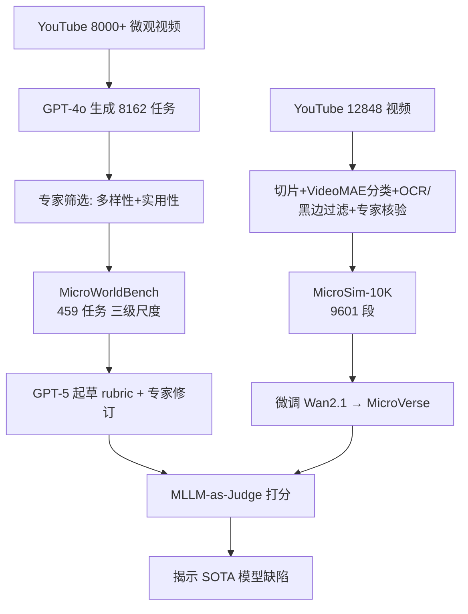

# MicroVerse: A Preliminary Exploration Toward a Micro-World Simulation

**会议**: ICLR 2026  
**OpenReview**: [https://openreview.net/forum?id=7pQv7qitFV](https://openreview.net/forum?id=7pQv7qitFV)  
**代码**: [https://github.com/FreedomIntelligence/MicroVerse](https://github.com/FreedomIntelligence/MicroVerse)  
**领域**: 视频生成 / 微观世界模拟 / 生物医学  
**关键词**: 微观世界模拟, 视频生成, Rubric 评测基准, 生物医学, 世界模型  

## 一句话总结
本文首次提出"微观世界模拟"（Micro-World Simulation）概念，构建了细粒度 rubric 评测基准 MicroWorldBench、专家核验数据集 MicroSim-10K，并基于 Wan2.1 微调出面向微观尺度的视频生成模型 MicroVerse，揭示并初步弥合了当前 SOTA 视频模型在微观生物机制模拟上"看似正确、实则违背物理/生物规律"的缺口。

## 研究背景与动机
**领域现状**：世界模型与视频生成近年在宏观尺度（自然场景、人体活动、机器人操作）上取得巨大成功，能从原始视频中习得物理常识，被视为"真实世界模拟器"的雏形。

**现有痛点**：这些进展几乎没有迁移到**微观尺度**。论文用 Sora、Veo3 生成 DNA 转录、肺泡血流、细胞分裂等动画，结果视觉上"看起来对"，却普遍违背物理与生物规律——血细胞形状错误、分子尺度比例失真、机制时序混乱。根因是模型训练语料全是人类尺度视频，**缺乏微观物理与生物医学知识的 grounding**。

**核心矛盾**：微观模拟对药物发现、器官芯片、疾病机制研究、教育可视化等价值巨大，但现有视频模型既缺微观数据、又缺能识别"科学保真度"的评测手段——通用评分规则只看视觉连贯性，无法捕捉机制级别的对错。

**本文目标**：把"微观尺度的生物机制模拟"作为视频生成的新任务系统化，提供一套完整的概念证明（proof of concept）：明确目标 + 专用基准 + 训练数据 + 定制模型。

**核心 idea**：
- **Rubric 化评测**：用专家撰写、带极性与权重的细粒度评分点替代通用打分，让评测聚焦"科学保真度"而非表面视觉。
- **领域数据驱动**：从 YouTube 海量微观视频中经多级过滤 + 专家核验构建首个微观模拟数据集，再微调视频生成模型注入领域知识。

## 方法详解

### 整体框架
工作由两条主线组成：(1) **MicroWorldBench**——459 个专家筛选的微观任务，每个配一套 rubric 评分点，用 MLLM 当裁判打分，暴露现有模型缺陷；(2) **MicroVerse**——基于专家核验的 MicroSim-10K（9,601 段视频）微调 Wan2.1，得到面向微观尺度的生成模型。

### 关键设计

**1. 三级生物尺度任务体系：把微观世界结构化采样**  
生物系统天然分层（社会→身体→器官→组织→细胞→细胞器→蛋白→基因）。考虑数据可得性与实用价值，本文选取三个最具代表性、可处理的层级作为原则性采样：**器官级**（心脏收缩、血管形变，连接微观行为与宏观生理，直通临床诊断与手术规划）、**细胞级**（细胞迁移、增殖、免疫应答，是生物医学核心）、**亚细胞级**（融合、凋亡、信号级联，机制最复杂、视觉最微妙，对保真度要求最高）。最终基准含 238 个器官级、189 个细胞级、32 个亚细胞级任务，比例与采集视频的层级分布一致。

**2. 带极性与权重的 Rubric 评分机制：让评测瞄准科学保真**  
这是全文最核心的评测设计。每个任务由 GPT-5 起草一组细粒度评分点 $P = \{(a_i, d_i, s_i, w_i)\}_{i=1}^N$，其中 $a_i$ 是评测维度，$d_i$ 是评分点描述，$s_i \in \{+1, -1\}$ 表示该点是加分项还是扣分项，$w_i \in (0,1]$ 是重要性权重（$w_i=1.0$ 核心科学要求、$0.5$ 关键次要、$0.2$ 辅助呈现）。任务原始分为 $S = \sum_{i=1}^N s_i \cdot w_i$，再归一化为
$$S_{\text{norm}} = \frac{S}{\sum_{i=1}^N w_i^{+}} \times 100$$
分母为所有正向评分点的最大可得分，保证满分 100，且防止零碎的正向小分抵消严重的科学错误（例如"血细胞呈双凹形 +1、血管壁光滑 +1、葡萄糖被错画成晶体 −0.5"最终只拿 60%）。专家随后对草稿做删改、调权、补充三类修订，多专家结果经讨论与多数表决聚合。

**3. 多级过滤 + 专家核验的数据管线：把噪声视频提纯成训练集**  
MicroSim-10K 从 12,848 段 YouTube 视频出发，逐级提纯：用 OpenCLIP 在相邻帧相似度低于 0.85 处切片得 67,853 段；训练 VideoMAE 分类器（准确率 >92%）剔除非微观片段，留 33,535 段；用 OpenCV 检测黑边、EasyOCR 检测字幕过滤干扰语义的片段，留 12,194 段；最后专家剔除无意义或物理不一致片段，得 9,601 段。每段用 GPT-4o（均匀采样 8 帧 + 视频标题描述以抑制幻觉）生成约 150 词的细粒度 caption 并经专家核验，保证语义对齐。数据集 59.1% 器官级、22.4% 细胞级、18.5% 亚细胞级，与真实显微视频的 FVD 仅 123.9，分布贴近真实。

**4. 领域数据微调注入生物 grounding：小模型也能提科学保真**  
MicroVerse 直接基于 Wan2.1-T2V-1.3B 在 MicroSim-10K 上微调，不靠堆参数而靠领域数据补足"微观物理与生物知识"。结果证明：1.3B 的 MicroVerse 在科学保真度维度（43.0）超过 14B 的同系基座（42.7），相比原始 1.3B 基座（40.3）提升 +2.7，验证了"领域数据 > 单纯扩参"这一核心论点。

## 实验关键数据

### 主实验表格（MicroWorldBench 各尺度总分）

| 模型 | 平均 ↑ | 器官级 ↑ | 细胞级 ↑ | 亚细胞级 ↑ |
|------|--------|----------|----------|------------|
| HunyuanVideo | 23.2 | 23.1 | 23.8 | 19.4 |
| CogVideoX-5B | 43.5 | 39.9 | 47.0 | 38.6 |
| Wan2.1-T2V-1.3B | 49.4 | 45.9 | 51.7 | 52.4 |
| Wan2.2-TI2V-5B | 51.6 | 46.6 | 53.9 | 49.5 |
| Wan2.1-T2V-14B | 54.8 | 55.7 | 54.4 | 52.8 |
| Wan2.2-T2V-A14B | 53.8 | 56.3 | 52.0 | 53.3 |
| **MicroVerse-1.3B (本文)** | 50.2 | 47.6 | 51.7 | **53.3** |
| Sora | 50.7 | 55.9 | 46.1 | 55.0 |
| Veo3 | **77.2** | **77.5** | **76.9** | **78.2** |

### 维度拆解表格（科学保真 vs 视觉质量 vs 指令遵循）

| 模型 | 平均 ↑ | 科学保真 ↑ | 视觉质量 ↑ | 指令遵循 ↑ |
|------|--------|------------|------------|------------|
| HunyuanVideo | 23.2 | 15.6 | 48.2 | 23.4 |
| Wan2.1-T2V-1.3B | 49.4 | 40.3 | 71.8 | 50.1 |
| Wan2.2-T2V-A14B | 53.8 | 37.8 | 92.8 | 55.4 |
| **MicroVerse-1.3B (本文)** | 50.2 | **43.0** | 68.5 | 49.3 |
| Sora | 50.7 | 35.3 | 96.4 | 37.9 |
| Veo3 | 77.2 | 65.7 | 97.0 | 77.0 |

### 关键发现
- **视觉质量 ≠ 科学保真**：几乎所有模型视觉质量都很高（80–97），但科学保真度严重落后（多数开源模型仅 15–43），印证"看起来对、实则违规"的核心论断。
- **尺度越微观越难**：Sora、Veo3、Wan2.2 等顶级模型在细胞级、亚细胞级上均明显逊于器官级，源于更高的物理/生物一致性要求与微观训练数据的稀缺。
- **扩参救不了科学保真**：Wan 系列从 1.3B 扩到 14B，主要涨视觉质量，科学保真度几乎不增——证明问题的核心是知识 grounding 而非模型容量。
- **小模型靠数据反超**：MicroVerse-1.3B 在科学保真度上超过 14B 基座，MicroSim-10K 与真实显微视频 FVD 仅 123.9。

## 亮点与洞察
- **新任务定义清晰**：第一次把"微观世界模拟"作为独立研究问题提出，并给齐"目标—基准—数据—模型"四件套，是一篇扎实的 position + proof-of-concept。
- **Rubric 评测抓住要害**：带极性/权重 + 归一化分母只取正向最大分的设计，巧妙避免"零碎加分掩盖严重科学错误"，把评测从"好看"扭向"正确"。
- **数据管线可复用**：YouTube → 切片 → 分类器 → OCR/黑边 → 专家核验的五级漏斗，给"从公开视频造领域数据集"提供了可借鉴范式，并保留观看量/点赞等元数据体现教育传播价值。
- **诚实的结论**：明确指出 MicroVerse 总分仍不及 Veo3，但在最关键的科学保真维度上以 1.3B 小身板逼近甚至局部超越大模型，论证主张克制可信。

## 局限与展望
- **绝对性能仍低**：MicroVerse-1.3B 平均分 50.2，科学保真度 43.0，离 Veo3（65.7）差距明显，距离真正"可用于药物发现/临床"的保真度还远，作者自定位为 preliminary exploration。
- **亚细胞级样本稀缺**：基准里亚细胞任务仅 32 个、数据里 18.5%，最难、最有科学价值的层级反而覆盖最薄。
- **评测依赖 MLLM 裁判**：rubric 由 GPT-5 起草、GPT-5 当 Judge，存在自评偏置与判分可靠性问题，专家修订只能部分缓解。
- **教育/可视化为主**：当前定位偏教育与科普可视化，要落到真实生物物理仿真（如分子动力学级别精度）还需引入显式物理约束或科学先验。

## 相关工作与启发
- **世界模型 / 视频即模拟器**：延续 LeCun 的世界模型设想与 Sora 等"视频模型即真实世界模拟器"思路，但把战场从宏观推向微观，揭示了现有范式的知识盲区。
- **视频生成评测**：相较 VBench 等通用评测只看视觉连贯与提示遵循，本文的 rubric 范式给"科学/专业领域视频生成"评测立了新标杆，可迁移到工程仿真、化学反应等需要领域正确性的场景。
- **领域数据微调**：再次印证"数据 > 参数"在专业领域的有效性，1.3B 模型靠 9,601 段专家核验数据即可在科学保真度上反超 14B 基座，对资源受限的垂直领域很有启发。

## 评分
- **新颖性**: ⭐⭐⭐⭐⭐ 首次定义微观世界模拟任务，concept + benchmark + dataset + model 一体化，方向开创性强。
- **实验充分度**: ⭐⭐⭐⭐ 覆盖开源/商业共 8+ 模型、三级尺度、三维度拆解 + FVD 分布对比，但消融（数据规模/各过滤阶段贡献）偏少。
- **写作质量**: ⭐⭐⭐⭐ 动机—缺陷—对策逻辑清晰，图表完整；个别句子有笔误，结论诚实克制。
- **价值**: ⭐⭐⭐⭐⭐ 打开"视频生成 × 微观生物医学"新赛道，数据集与 rubric 评测对教育、药物发现、疾病建模社区有长期价值。

<!-- RELATED:START -->

## 相关论文

- [\[ICLR 2026\] VCWorld: A Biological World Model for Virtual Cell Simulation](vcworld_a_biological_world_model_for_virtual_cell_simulation.md)
- [\[ICLR 2026\] Multifidelity Simulation-based Inference for Computationally Expensive Simulators](multifidelity_simulation-based_inference_for_computationally_expensive_simulator.md)
- [\[ICLR 2026\] WFR-FM: Simulation-Free Dynamic Unbalanced Optimal Transport](wfr-fm_simulation-free_dynamic_unbalanced_optimal_transport.md)
- [\[ICLR 2026\] Musculoskeletal simulation of limb movement biomechanics in Drosophila melanogaster](musculoskeletal_simulation_of_limb_movement_biomechanics_in_drosophila_melanogas.md)
- [\[ICLR 2026\] BioMD: All-atom Generative Model for Biomolecular Dynamics Simulation](biomd_all-atom_generative_model_for_biomolecular_dynamics_simulation.md)

<!-- RELATED:END -->
