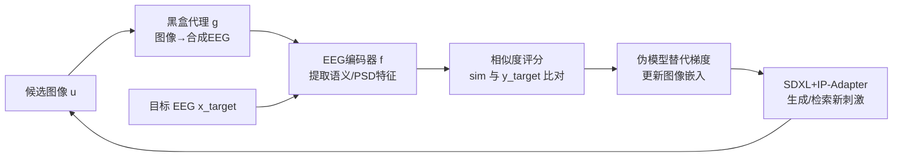

# MindPilot: Closed-loop Visual Stimulation Optimization for Brain Modulation with EEG-guided Diffusion

**会议**: ICLR 2026  
**OpenReview**: [https://openreview.net/forum?id=7jdmXx869Q](https://openreview.net/forum?id=7jdmXx869Q)  
**代码**: [https://github.com/ncclab-sustech/MindPilot](https://github.com/ncclab-sustech/MindPilot)  
**领域**: 计算神经科学 / 脑机接口 / EEG-guided 生成  
**关键词**: EEG, 闭环脑调控, 黑盒优化, 扩散模型, 视觉刺激设计  

## 一句话总结
MindPilot 把人脑当成一个不可微的黑盒函数，用非侵入式 EEG 信号作为优化反馈、配合一个"伪模型 (pseudo-model)"提供替代梯度，闭环迭代地生成/检索能把大脑神经状态推向指定目标的自然图像，首次在语义与频谱两类神经目标上验证了"用图像反向调控大脑"的可行性。

## 研究背景与动机
**领域现状**：绝大多数脑机接口 (BCI) 研究做的是"解码"——把神经信号翻译成行为或意图；而反方向的"编码调控"——用精心设计的刺激去主动驾驶大脑活动——在视觉域几乎是空白。已有的闭环视觉神经调控工作要么是侵入式的（小规模皮层电极、只盯低层神经元放电），要么只能用闪烁光栅这种低层刺激，无法生成语义丰富、能调动高级脑区表征的自然图像。

**现有痛点**：把图像设计成可靠驱动神经响应的工具，面临三重困难——(1) 主观状态缺乏明确的量化指标；(2) 真实 EEG 反馈又噪声大又不稳定；(3) 大脑本身是**不可微**的，无法像优化神经网络那样直接反传梯度。文本条件扩散模型虽然给可控生成带来了空前灵活性，但它们是为语言提示优化的，与"以神经反馈为目标"这件事正交。

**核心矛盾**：可控生成需要可微的、有明确奖励的优化信号，而大脑既给不出梯度、也给不出干净的标量奖励。

**本文目标**：建立一个通用、连续、高保真的闭环框架，直接用非侵入 EEG 驱动自然图像合成，把大脑潜在状态稳定地推向指定目标。

**核心 idea**：**【黑盒+伪模型】** 把大脑（或其 EEG 读出）看作黑盒前向过程 $x=g(u)$，用一个"伪模型"在 CLIP 隐空间里提供替代梯度，从而在不要求显式奖励和真梯度的前提下，对语义相似度、EEG 频谱等多种神经目标做**无梯度迭代优化**。

## 方法详解

### 整体框架
MindPilot 把"用图像调控大脑"形式化为一个黑盒优化问题：给定图像 $u$，大脑产生 EEG 响应 $x=g(u)\in\mathbb{R}^{C\times T}$，再经特征编码器 $f$ 提取神经特征；目标是找到使响应特征与目标特征余弦相似度最大的图像 $u^\*=\arg\max_u \mathrm{sim}(f(g(u)), y_{\text{target}})$。整个系统在每轮迭代里循环四步：黑盒建模（图像→合成 EEG）、特征提取（EEG→语义/频谱特征）、引导生成（在隐空间更新图像嵌入）、更新刺激（选高分图像回灌生成器），如此闭环收敛。

### 关键设计
**1. 黑盒代理模型：用神经网络替身大脑，让大规模闭环实验成为可能。** 真实实时采 EEG 又贵又不现实，MindPilot 训练一个图像→EEG 的代理 $g$ 来当大脑替身：拿预训练视觉骨干（AlexNet/ResNet50/CORnet-S 到 ViT/CLIP/DINO 等九种），把分类层换成 $C\times T$ 的回归头，在 THINGS-EEG2 上以 MSE 拟合真实 17 通道×250 时间点的 EEG。关键观察是即便简单 CNN 也能达到有竞争力的预测精度（AlexNet 的 Pearson $R$ 反而最高），说明框架不绑定特定骨干，是"任意 image-to-EEG 预测器都能即插即用"的闭环配方。

**2. 闭环评分更新（直接奖励 + 扩散传播）：把稀疏的 top-k 反馈摊给整个图库。** 从均匀先验出发，每张图维护一个分数 $S_t(u)$。先做**直接奖励**——只对相似度最高的 top-k 图像用指数滑动平均更新分数 $S'_t(u_i)=(1-\alpha)S_t(u_i)+\alpha\,\mathrm{sim}(f(g(u_i)),y_{\text{target}})$；再做**传播更新**——按 CLIP 嵌入相似度把 top-k 的奖励"扩散"给数据库里相似的图像 $S_{t+1}(u_j)=(1-\beta)S'_t(u_j)+\frac{\beta}{|I_{best}|}\sum_{i\in I_{best}}S'_t(u_i)\frac{\exp(s(u_i,u_j))}{\sum_l \exp(s(u_i,u_l))}$。最后用 softmax 把分数转成下一轮的采样概率 $P_{t+1}$。这套机制让"和多个高分图都像"的图像获得更强的分数提升，大幅提高了样本效率。

**3. 黑盒引导扩散（伪模型替代梯度）：绕开不可微大脑，用 GP 代理算梯度。** 既然没法在黑盒编码模型上直接求梯度，MindPilot 用一个高斯过程 (GP) 代理在 CLIP 隐空间预测奖励梯度，构造**伪目标嵌入** $\hat z^\*=z_K-\eta\nabla\hat f(z_K;Z_n)$，其中 $\hat f(z_K;Z_n)=k(z_K,Z_n)^T(K(Z_n,Z_n)+\lambda I)^{-1}y$ 是 GP 对历史样本及其奖励的闭式预测，奖励定义为 $y_i=\mathrm{sim}(f(g(u_i)),y_{\text{target}})\times\gamma$。再用 SDXL-Lightning + IP-Adapter 把这个伪目标作为引导去生成新图，从而把"无梯度黑盒优化"接进扩散去噪管线。

**4. 交互式搜索 + 启发式进化：从冷启动到连续生成的双阶段策略。** 面对未知目标图像，先用受交互检索启发的"轮盘赌"相似度加权采样（Algorithm 1），从随机候选出发逐步把采样分布收紧到逼近目标的刺激上；当固定图库不够用时，切到启发式进化生成（Algorithm 2）——对图像嵌入做交叉和"变异"再从图像空间采样新图，并保留各维度原始 CLIP 特征的相对序，确保变异后的图像在语义上仍然连贯、可被人类理解。

## 实验关键数据

### 主实验表格（EEG 语义驱动生成 vs 专用解码器，Subject-01）

| 方法 | 类型 | SSIM↑ | AlexNet(2)↑ | Inception↑ | CLIP↑ | SwAV↓ |
|------|------|-------|-------------|-----------|-------|-------|
| ATM-S（上界，直接解码 GT EEG） | EEG-to-image | 0.32 | 0.80 | 0.72 | 0.76 | 0.58 |
| CongCapturer | EEG-to-image | 0.33 | 0.73 | 0.65 | 0.68 | 0.59 |
| Chance-level | 调控基线 | 0.28 | 0.49 | 0.50 | 0.48 | 0.69 |
| **MindPilot (Ours)** | 调控 | **0.35** | 0.70 | 0.58 | 0.67 | 0.60 |

注：ATM-S/CongCapturer 是"看着 GT EEG 直接重建图像"的理论上界，而 MindPilot 必须在看不到 GT 的情况下迭代搜索；即便如此，它在 SSIM 上反超上界、在 CLIP 二选一上 0.67 逼近 ATM-S 的 0.76。

### 消融实验表格（语义闭环迭代相似度，10 被试均值）

| 阶段 | 语义相似度 SS | 强度相似度 IS |
|------|-------------|-------------|
| Random（初始） | 0.6012 | 0.9354 |
| Step-1 | 0.7370 | 0.9680 |
| Step-Best | 0.8451 | 0.9946 |
| **平均提升** | **+10.91%** | **+2.65%** |

### 关键发现
- **收敛性 & 对齐性**：相似度分数随迭代稳定上升、显著超过随机采样；EEG 嵌入与 CLIP 表征跨被试显著相关（$R=0.23, P<0.01$），证明 CLIP 相似度是有效的神经对齐代理。
- **频谱目标也能调控**：除语义特征外，对 EEG 功率谱密度 (PSD) 目标优化同样在 10 被试上显著提升相似度，且在刺激后 0–500 ms 早期窗口神经对齐最明显——说明框架能超越"检索"去主动设计匹配频谱目标的刺激。
- **真人闭环验证**：10 名被试的实时实验里，模型导出的相似度与人类主观评分强相关；在目标更明确的**情绪调控**任务上，伪模型奖励与人评相关 $R=0.714$，群体情绪从 0.45→0.60 被显著正向调控；而细粒度"心理匹配"任务表现中等，作者把它定性为非侵入 EEG 在 sim-to-real 语义鸿沟下的现实基线。

## 亮点与洞察
- **问题翻转得漂亮**：把成熟的"EEG 解码"反过来做成"EEG 编码调控"，并干净地形式化成黑盒优化，是个有想象力的新问题设定。
- **三个"不可能"被工程化绕开**：无量化指标→用相似度评分；EEG 噪声→用代理模型+EMA 平滑；大脑不可微→用 GP 伪模型造替代梯度。每一招都对准一个具体痛点。
- **即插即用的通用性**：黑盒代理不绑骨干、目标可换（语义/频谱/甚至主观情绪评分），让同一框架覆盖检索、生成、情绪调控多任务。
- **诚实的失败分析**：作者没有回避心理匹配任务的中等表现，反而把它解释成非侵入 EEG 的物理上限，并用情绪调控任务的强效果对比，论证"只要神经目标可定义，闭环就稳健"。

## 局限与展望
- **代理模型预测力有限**：表 1 里最好的 Pearson $R$ 也只有 ~16%（虽然时间分辨分析在 ~100ms 能到 0.6），整体窗口的弱相关意味着代理与真脑仍有不小 gap，闭环效果受此天花板约束。
- **sim-to-real 鸿沟**：细粒度语义匹配在真人上只达到中等水平，非侵入 EEG 的信噪比限制了高保真语义调控。
- **超参未充分搜索**：$\alpha=\beta=0.1$ 等是经验设定，作者自承未做彻底搜索，调参空间还可能带来增益。
- **被试规模小**：真人实验仅 10 人，泛化性与个体差异需更大样本验证。
- **展望**：双向脑机接口、神经信号引导的生成建模、认知增强与神经康复都是其指向的应用方向。

## 相关工作与启发
- **闭环视觉神经调控**：Ponce et al. 2019、Walker et al. 2019、Bashivan et al. 2019 的侵入式活动最大化刺激合成；Luo et al. 2024b 的 VEP Booster 用闪烁刺激调控 EEG——MindPilot 把这条线从侵入/低层推进到非侵入/语义级自然图像。
- **脑条件可控生成**：fMRI 条件图像生成（Scotti et al. 2024 等）已较成熟，但 EEG 条件生成此前几乎只做解码重建（ATM-S、CongCapturer），从未接入闭环优化——这正是本文补的空白。
- **黑盒引导扩散**：借鉴了 Fan et al. 2023、Black et al. 2024 在药物发现/高质量生成中的黑盒引导思路，把 GP 替代梯度迁移到 EEG 引导场景。
- **启发**：当优化目标是一个噪声大、不可微的真实系统（不止大脑，也包括人类偏好、物理实验）时，"代理模型 + 伪梯度 + 相似度评分摊分"这套无梯度闭环范式很值得复用。

## 评分
- **新颖性**: ⭐⭐⭐⭐⭐ 首个非侵入 EEG 引导自然图像闭环调控框架，问题设定与黑盒+伪模型方案都很新。
- **实验充分度**: ⭐⭐⭐⭐ 仿真+9 种代理+真人三层验证，覆盖语义/频谱/情绪三类目标；但代理预测力弱、真人仅 10 人、细粒度匹配偏弱。
- **写作质量**: ⭐⭐⭐⭐ 问题动机讲得清楚，框架图与公式到位，对局限诚实；个别记号（伪模型/GP 部分）需结合附录才好读。
- **价值**: ⭐⭐⭐⭐⭐ 为双向脑机接口、神经引导生成开了一条可落地的新路，应用想象空间大。

<!-- RELATED:START -->

## 相关论文

- [\[ICLR 2026\] Learning Brain Representation with Hierarchical Visual Embeddings](learning_brain_representation_with_hierarchical_visual_embeddings.md)
- [\[ICLR 2026\] NC-Bench and NCfold: A Benchmark and Closed-Loop Framework for RNA Non-Canonical Base-Pair Prediction](nc-bench_and_ncfold_a_benchmark_and_closed-loop_framework_for_rna_non-canonical_.md)
- [\[ICLR 2026\] Uncovering Semantic Selectivity of Latent Groups in Higher Visual Cortex with Mutual Information-Guided Diffusion](uncovering_semantic_selectivity_of_latent_groups_in_higher_visual_cortex_with_mu.md)
- [\[ICLR 2026\] Model-Guided Microstimulation Steers Primate Visual Behavior](model-guided_microstimulation_steers_primate_visual_behavior.md)
- [\[ICLR 2026\] The Human Brain as a Dynamic Mixture of Expert Models in Video Understanding](the_human_brain_as_a_dynamic_mixture_of_expert_models_in_video_understanding.md)

<!-- RELATED:END -->
