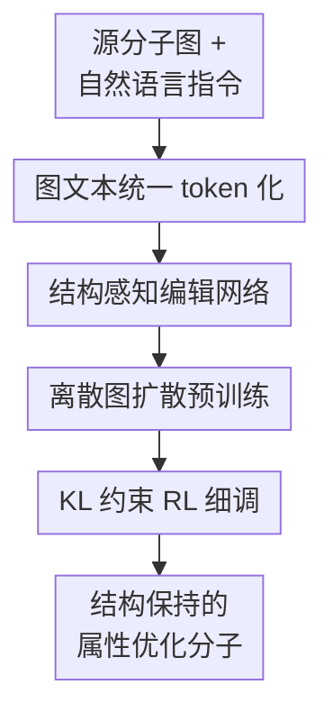

# MolEditRL: Structure-Preserving Molecular Editing via Discrete Diffusion and Reinforcement Learning

**会议**: ICLR 2026  
**OpenReview**: [https://openreview.net/forum?id=40QphlZ9fY](https://openreview.net/forum?id=40QphlZ9fY)  
**代码**: 待确认  
**领域**: 计算生物 / 分子编辑  
**关键词**: 分子编辑, 离散图扩散, 强化学习, 药物设计, 结构保持

## 一句话总结
MolEditRL 把分子编辑直接放在离散分子图上做：先用图文本条件扩散学会从源分子和自然语言指令重构目标分子，再用带结构约束的强化学习细调属性优化，在更少参数下同时提高编辑成功率、结构相似度和化学分布质量。

## 研究背景与动机
**领域现状**：药物发现里的分子优化不总是从零生成一个新分子，更多时候是从已有 lead compound 出发，局部调整结构来提高某个性质，例如提升 QED、降低合成难度 SA、改变 LogP 或调节某个靶点活性。这样的任务被称为分子编辑：输入源分子 $G_{src}$ 和一条自然语言指令 $S$，输出满足指令且仍和源分子相似的目标分子 $G_{tgt}$。

**现有痛点**：已有方法大致分为规则编辑、连续潜空间优化、SMILES/SELFIES 序列生成和语言模型指令调优。规则方法解释性强，但覆盖范围受手工模板限制；连续潜空间方法能搜索，但压缩后的 latent 往往丢掉局部拓扑细节；序列模型和 LLM 方法可扩展、能读自然语言，却把分子变成字符串，结构上相近的分子可能在 SMILES 上差得很远，几个 token 的变化也可能造成不可控的键断裂、骨架漂移或无效分子。

**核心矛盾**：分子编辑要求同时满足两个目标：一方面要让目标属性真的朝指令方向变化，另一方面又不能把原分子的核心 scaffold 改坏。纯文本生成通常能追属性但难保结构，纯图模型能看拓扑但又很难把自然语言指令和不可微的离散编辑过程结合起来；强化学习可以用属性 oracle 追目标，却容易在化学空间里做过度探索，牺牲分布真实性和结构相似性。

**本文目标**：作者希望构建一个面向分子编辑的统一框架，既能理解自然语言属性修改指令，又能在分子图层面显式建模原子和键；既能从大规模配对数据中学习结构保持的编辑先验，又能在新属性或复杂属性组合上用 oracle 奖励继续优化；最终评价不只看有效性 Validity，还要同时看属性成功率、Tanimoto/MCS/GED 结构约束和 FCD 分布质量。

**切入角度**：MolEditRL 的观察是，分子编辑天然像“从被遮住的目标图逐步去噪”：源分子和指令给出条件，目标分子图则可以在离散原子/键空间中逐步恢复。离散扩散适合学习这种图结构先验；而 RL 适合在扩散模型已经会生成合理分子的基础上，用 RDKit/TDC 等 oracle 把属性对齐推得更准。

**核心 idea**：用结构感知的离散图扩散作为分子编辑先验，再用 KL 约束的强化学习在图去噪轨迹上做属性奖励优化，从而把“精确改属性”和“保留分子结构”绑定在同一个训练流程里。

## 方法详解

### 整体框架
MolEditRL 的输入包括三部分：自然语言编辑指令 $S$、源分子图 $G_{src}$，以及训练时的目标分子图 $G_{tgt}$。模型先把文本 token、源分子原子、目标分子原子串接成一个统一序列，并在 Transformer 注意力里注入源图和目标图的键连接偏置；训练分两阶段进行，第一阶段用离散扩散从被 mask 的目标图恢复真实目标图，第二阶段把反向去噪轨迹看作 MDP，用属性奖励和 KL 正则做编辑感知 fine-tuning。

更具体地说，模型不是把分子写成 SMILES 再做文本翻译，而是预测原子类型分布和键类型分布。扩散预训练让模型学会“哪些局部图修改像真实编辑”，RL 细调则把最终生成分子的属性成功与否反馈到去噪过程里。这样一来，属性优化不是游离于结构之外的后处理，而是被嵌入到每一步图恢复策略中。

### 关键设计
**1. 图文本统一 token 化：让指令、源图和目标图在同一个注意力空间里对齐**

MolEditRL 首先把分子表示为带属性的图 $G=(V,E)$，其中节点是原子、边是化学键；自然语言指令是 token 序列 $S=[s_1,\dots,s_n]$。给定源分子 $G_{src}$ 和目标分子 $G_{tgt}$，模型构造统一输入

$$
h_0=[h_1,\dots,h_n,h^{src}_{n+1},\dots,h^{src}_{n+k},h^{tgt}_{n+k+1},\dots,h^{tgt}_{n+k+m}]\in \mathbb{R}^{(n+k+m)\times d_h}.
$$

这个设计针对的是“文本意图”和“分子拓扑”难以对齐的问题。LLM 式方法通常只在字符串层面看到分子，源分子中某个官能团和指令中的“降低合成复杂度”之间没有显式图约束；MolEditRL 则让文本 token、源图原子和待预测目标图原子共享 Transformer 编码空间，使模型可以在同一层注意力中同时看见语义要求和图结构上下文。

**2. 结构感知注意力：把键连接作为注意力偏置注入 Transformer**

如果只是把图节点序列化，模型仍可能把分子当成普通 token 串处理。MolEditRL 因此在注意力分数中加入结构偏置 $b^l_{i,j}$：

$$
\hat A^l_{i,j}=\frac{1}{\sqrt{d_k}}(h_i^lW_Q)(h_j^lW_K)^\top+b^l_{i,j}.
$$

偏置项会在源分子 token 之间注入源图邻接/键类型，在目标分子 token 的第一层注入目标图邻接信息，并在后续层传播上一层的目标图注意力。直观上，这相当于告诉 Transformer：哪些原子本来通过什么键相连，哪些目标节点之间应当保留拓扑相关性。最后模型分别输出原子类型概率 $\hat p(V_{tgt})$ 和键类型概率 $\hat p(E_{tgt})$，并对边预测做对称化 $(e_{i,j}+e_{j,i})/2$，避免方向不一致破坏无向化学键。

这个设计最关键的作用不只是提高表示能力，而是在 RL 细调时防止模型被奖励牵着走得太远。附录消融显示，去掉结构感知偏置后 fine-tuning 的结构约束准确率和 FCD 明显变差；说明图连接偏置在“属性奖励”和“结构保持”之间充当了锚点。

**3. 离散图扩散预训练：把目标分子编辑建模为逐步去 mask 的图恢复**

扩散预训练阶段从真实目标分子 $G^0_{tgt}$ 出发，前向过程逐步 mask 原子和键，mask 概率为 $\beta(t)=(T-t+1)^{-1}$，直到得到接近全 mask 的 $G^T_{tgt}$。反向过程训练模型在源分子 $G_{src}$ 和指令 $S$ 条件下逐步恢复目标图：

$$
p_\theta(G^{0:T-1}_{tgt}\mid G^T_{tgt},G_{src},S)=\prod_{t=1}^{T}p_\theta(G^{t-1}_{tgt}\mid G^t_{tgt},G_{src},S).
$$

训练损失主要是目标原子、目标边和指令 token 的交叉熵。这里把指令 token 也放进 loss，并不是因为指令被扩散破坏了，而是为了让网络在恢复分子时保持语义对齐：模型不能只学“这个源分子常变成什么”，还要学“这条指令要求朝哪个属性方向变”。

推理时，模型从全 mask 的目标图开始，采用 $x_0$-parameterization：每一步先预测干净目标图 $\hat G^0_{tgt}$，再根据扩散后验采样下一步 $G^{t-1}_{tgt}$。这种机制比一次性生成更适合分子编辑，因为局部原子/键的恢复可以不断参考源图和指令，降低结构突然漂移的概率。

**4. 编辑感知 RL：用属性奖励优化最终分子，同时用 KL 留在扩散先验附近**

扩散预训练学到的是“像训练数据里的结构保持编辑”，但具体属性优化还需要 oracle。MolEditRL 把离散去噪轨迹改写成 MDP：状态 $s_t=(S,G_{src},G^{T-t}_{tgt})$，动作 $a_t=G^{T-t-1}_{tgt}$，策略 $\pi_\theta(a_t\mid s_t)$ 输出下一步原子/键分布。奖励只在终点给出：如果生成分子满足目标编辑，奖励为 1；如果化学有效但没完全满足指令，奖励为 0.2；无效分子为 0。

为了避免 RL 只追奖励而破坏分子结构，目标函数加入当前策略和预训练扩散模型 $p_{pre}$ 之间的 KL 正则：

$$
\mathcal{L}(\theta)=-\mathbb{E}[r(G^0_{tgt},S,G_{src})]+\beta\sum_{t=1}^{T}\mathbb{E}\left[D_{KL}\left(p_\theta(G^0_{tgt}\mid G^t_{tgt},S,G_{src})\Vert p_{pre}(G^0_{tgt}\mid G^t_{tgt},S,G_{src})\right)\right].
$$

论文默认 $\beta=0.1$。这里的 KL 不是普通正则项那么简单，它把 RL 更新限制在“预训练模型认为合理的结构保持编辑”附近，让属性 oracle 负责推动方向，让扩散先验负责守住化学现实性和 scaffold 相似性。作者还用 batch 内奖励标准化得到优势 $\hat A=(r-\mathrm{mean}(r))/(\mathrm{std}(r)+10^{-6})$，并借助 $x_0$-parameterization 把高方差的逐步 REINFORCE 近似成 reward-weighted cross entropy，从而减少中间噪声图无法解释奖励带来的训练不稳定。

### 一个完整示例
假设输入源分子是一条 SMILES 表示的候选药物分子，指令是“Make this molecule easier to synthesize”，也就是降低 SA 分数。MolEditRL 首先把这条英文指令、源分子原子序列和一个全 mask 的目标图拼成统一序列；结构感知注意力会让模型持续看到源分子里哪些原子通过单键、双键或芳香键相连。

在扩散反向过程的早期，目标图大部分位置仍是 mask，模型先恢复与源分子 scaffold 对齐的主骨架；中间阶段，它会在局部官能团处尝试替换或删减更难合成的片段；最后阶段，模型补齐具体原子类型和键类型，并输出一个有效分子。若最终分子有效且 SA 下降，同时 Tanimoto、MCS 或 GED 仍满足结构约束，RL 奖励为 1；如果分子有效但 SA 没降到位，只给 0.2；如果 RDKit 判定无效，则奖励为 0。KL 项会把这次更新拉回预训练扩散先验附近，避免模型为了降低 SA 直接大幅改写骨架。

这个例子能说明 MolEditRL 和传统 RL 生成器的区别：传统方法可能从头探索许多候选分子，再用 oracle 过滤；MolEditRL 则一直围绕源分子做条件去噪，搜索空间更窄，oracle 信号也更集中在“如何局部编辑”而不是“如何发明一个分子”。

### 损失函数 / 训练策略
预训练目标包含目标原子交叉熵、目标边交叉熵和指令 token 交叉熵。RL 细调阶段使用 RDKit 和 TDC 计算属性奖励，默认把完全成功、部分成功、无效输出分别记为 $1,0.2,0$。训练采用 RoBERTa-base 初始化，12 层、12 个 attention head、hidden size 768；tokenizer 扩展到 51,933 个 token，扩散步数为 2000，评测时使用 top-k sampling，$k=15$。

优化上，预训练使用 AdamW，学习率 $5\times 10^{-5}$，weight decay 为 0.01，warm-up 10,000 steps，FP16 和 DDP 训练；MolEdit-Instruct 上预训练约 100 小时。RL fine-tuning 用属性 oracle 进行任务特定优化，论文报告标准 400-step fine-tuning 协议下大部分提升在约 6,400 次 oracle query 内完成；推理时不需要 oracle 调用，默认约 40 个去噪更新，对应 step/stride 为 50。

## 实验关键数据

### 主实验
论文构建了 MolEdit-Instruct 数据集，包含 300 万分子编辑样本、967K unique molecules，覆盖 10 类化学属性和 20 个单属性增减任务，也包含多属性组合任务。评价指标包括 Validity、带结构阈值的整体准确率 Accall、有效分子上的 Accvalid、Tanimoto similarity、MCS、GED 和 Fréchet ChemNet Distance (FCD)。下面选取论文 Table 1 中最能体现差异的代表任务。

| 任务 | 指标 | MolEditRL | 最强对比方法 | 观察 |
|------|------|-----------|--------------|------|
| GSK3β↑ | Accall(TS≥0.65) | 0.342 | DrugAssist 0.236 | MolEditRL 在保留结构的同时更能提升目标活性 |
| GSK3β↑ | FCD↓ | 7.99 | DrugAssist 9.42 | 分布更接近真实分子 |
| SA↓ | Accall(TS≥0.65) | 0.628 | DrugAssist 0.537 | 降低合成难度时仍保 scaffold |
| SA↓ | FCD↓ | 7.10 | Gellm3o_M 8.85 | 生成分布质量最好 |
| QED↑ + SA↓ | Accall(TS≥0.65) | 0.632 | DrugAssist 0.532 | 多目标下仍明显领先 |
| Haccept↓ + LogP↑ | Accall(TS≥0.65) | 0.316 | DrugAssist 0.372 | 该任务上 DrugAssist 的 TS 指标更高，但 MolEditRL 在 MCS/GED 与 FCD 上更稳 |

总体结论是，SELFIES/SMILES 模型可以保持较高 validity，甚至 BioT5 和 MolGen 接近 1.0，但在结构约束准确率上经常接近 0；DrugAssist 这类 LLM 微调方法能生成有效分子，却容易在属性优化和 scaffold preservation 之间失衡。MolEditRL 的优势主要体现在 Accall/Accvalid 与 FCD 同时提升，而不是单独刷 validity。

### 消融实验
| 配置 | 关键指标 | 说明 |
|------|---------|------|
| Pretrain w/o Structure Bias, LogP↑ | Validity 0.744 / Accall(TS≥0.65) 0.176 / FCD 13.714 | 没有结构感知偏置时，预训练阶段结构编辑能力弱 |
| Pretrain w/ Structure Bias, LogP↑ | Validity 0.758 / Accall 0.316 / FCD 11.896 | 注入图连接先验后，结构约束准确率明显提高 |
| Finetune w/o Structure Bias, LogP↑ | Validity 0.890 / Accall 0.212 / FCD 12.486 | RL 能提高 validity，但缺少图约束时结构和分布仍差 |
| Finetune w/ Structure Bias, LogP↑ | Validity 0.976 / Accall 0.462 / FCD 7.812 | 结构感知注意力在 RL 阶段贡献最大 |
| KL β=0.0, LogP↑ | Validity 0.986 / Accall 0.278 / FCD 9.142 | 无 KL 时过度追奖励，结构相似准确率不足 |
| KL β=0.1, LogP↑ | Validity 0.976 / Accall 0.462 / FCD 7.812 | 默认设置取得最佳权衡 |
| Top-k=15, SA↓ | Validity 0.988 / Accall(TS≥0.65) 0.608 / FCD 6.735 | 采样多样性和可靠性较平衡 |

### 关键发现
- MolEditRL 的主要收益来自“扩散先验 + RL 奖励 + 结构偏置”三者同时存在。只做预训练已经能保结构，但属性优化不够强；只做 RL 容易漂移；结构感知偏置在 fine-tuning 阶段尤其关键。
- 在未见属性 BBBP、HIA、hERG 上，MolEditRL 仍能通过 property-specific oracle fine-tuning 适配新目标。例如 hERG↓ 的 Accall(TS≥0.65) 为 0.474，FCD 为 6.0764，优于 DrugAssist 和 GeLLM 系列，说明它不是简单记住训练属性。
- 在 C-MuMOInstruct 上，MolEditRL 只有约 125M 参数，却能和 7B+ 的 GeLLM4O-C 模型竞争；10 个任务里 validity 在 8 个任务上最高，总准确率在 7 个任务上更强，显示图结构归纳偏置比单纯扩大 LLM 参数更适合这类任务。
- 多属性任务越复杂，所有模型准确率都会下降，但 MolEditRL 在 3-property 场景平均 Accall 仍达到 0.363，超过第二名 DrugAssist 的 0.165，说明它对多约束组合更稳。
- 复杂局部编辑实验中，MolEditRL 在“去除 CO2H”“添加 amide fragment”“移除 aromatic ring”等指令上功能团编辑成功率达到 0.744-0.872，明显高于 Reinvent4，表明自然语言不只是属性标签，也能承载局部化学操作。

## 亮点与洞察
- 这篇论文最有价值的地方是把 molecular editing 从字符串翻译拉回离散图空间。分子任务的结构约束不是装饰性信息，直接进入注意力偏置后，RL 优化才不容易把 scaffold 改坏。
- 用 KL-regularized RL fine-tuning 扩散模型是一个很实用的组合。扩散负责“像真实编辑”，RL 负责“朝目标属性走”，KL 负责“别走出化学现实区间”，三者的角色清楚且消融支持充分。
- 数据集 MolEdit-Instruct 本身也有贡献。3M 编辑对、10 个属性、单属性和多属性指令，让模型可以学习从自然语言到结构编辑的多样映射；这比只在少数属性上做 de novo optimization 更接近药物先导优化场景。
- 论文对评价维度比较清醒，没有只报 Validity 或单一 property score，而是同时用 TS、MCS、GED 和 FCD 检查结构保持与分布质量。这对分子编辑尤其重要，因为“生成有效分子”远不等于“成功编辑原分子”。
- 可迁移的思路是：在任何“离散结构 + 自然语言控制 + oracle 奖励”的任务中，都可以考虑先学结构保持扩散先验，再用 KL 约束 RL 追任务目标，例如蛋白序列局部编辑、RNA 结构优化或材料晶体结构调整。

## 局限与展望
- 当前实验主要覆盖小到中等规模的 drug-like molecules。作者认为框架可扩展到蛋白或复杂天然产物，但这些结构更大、约束更复杂，是否只需 minor adaptations 还需要实验证明。
- RL 细调依赖 RDKit、TDC 或任务特定 property predictor。对于罕见属性、预测器不可靠的属性，或者需要昂贵湿实验反馈的目标，奖励质量会直接限制模型上限。
- 当用户给出逻辑矛盾的指令，例如同时要求互相排斥的性质提升，模型没有显式的可行性诊断机制，可能只能生成折中但不可解释的结果。
- 虽然论文报告 oracle query efficiency，但每个任务仍需要 fine-tuning，标准设置下单任务约 12 小时。面向交互式药物设计时，如何在多轮指令中复用已有策略、减少每个新目标的细调成本，是下一步重点。
- 结构保持阈值仍是手工设定，例如 TS≥0.65、MCS≥0.6、GED≤4。不同药物项目对 scaffold preservation 的定义可能不同，未来可以把这些约束做成用户可控或任务自适应的 reward。

## 相关工作与启发
- **vs DrugAssist**: DrugAssist 用 LLM/SMILES 路线做分子优化，强在自然语言交互和有效分子生成，但结构相似和分布质量受字符串表示限制。MolEditRL 直接在图上预测原子和键，牺牲了一部分通用语言模型规模优势，换来更强的 scaffold preservation。
- **vs BioT5 / MolGen**: 这类方法使用 SELFIES 或生物化学文本模型，Validity 很高，但在结构约束准确率上表现弱。本文说明 100% 有效的表示并不自动带来可控编辑，关键是让模型理解“源分子哪些结构应保留”。
- **vs REINVENT4 / GCPN / MolDQN**: 传统 RL 分子优化更多是 de novo generation 或弱约束优化，容易依赖大量 oracle 探索。MolEditRL 从预训练扩散先验出发，搜索空间围绕源分子局部展开，因此在 5,000 oracle query 的 HIA↑ 任务上 Accall(TS≥0.65) 达到 0.466，而 GCPN/MolDQN 几乎无法成功。
- **vs DDPO / GDPO 式扩散 RL**: DDPO 逐步优化中间去噪状态，但分子图中间态往往化学意义弱，训练不稳定；GDPO 更稳定但通常需要任务特定模型。MolEditRL 借助 $x_0$-parameterization 和 KL 正则，把最终分子奖励更稳定地回传到去噪轨迹，同时保持多任务可扩展性。
- **对后续工作的启发**: 分子编辑可以进一步走向“多轮对话式局部编辑”：第一轮保留 scaffold 改 SA，第二轮微调 LogP，第三轮约束某个 functional group 不动。MolEditRL 的图扩散 + RL 框架为这种交互式闭环提供了一个不错的起点。

## 评分
- 新颖性: ⭐⭐⭐⭐☆ 把离散图扩散、结构感知注意力和 KL 约束 RL 组合到自然语言分子编辑里，整体设计针对性强，但各组件有相关前作基础。
- 实验充分度: ⭐⭐⭐⭐⭐ 主实验、未见属性、C-MuMOInstruct、多属性、KL/stride/top-k/结构偏置/oracle 噪声和效率消融都比较完整。
- 写作质量: ⭐⭐⭐⭐☆ 方法主线清楚，公式和附录充分；但部分表格很长，主文里对部分实现细节如 stride 表述略容易让读者混淆。
- 价值: ⭐⭐⭐⭐⭐ 对药物分子 lead optimization 很有实用价值，也给离散结构编辑中的 reward-guided diffusion 提供了可迁移范式。

<!-- RELATED:START -->

## 相关论文

- [\[ICLR 2026\] Discrete Compositional Generation via General Soft Operators and Robust Reinforcement Learning](discrete_compositional_generation_via_general_soft_operators_and_robust_reinforc.md)
- [\[ICLR 2026\] Learning Flexible Forward Trajectories for Masked Molecular Diffusion](learning_flexible_forward_trajectories_for_masked_molecular_diffusion.md)
- [\[ICLR 2026\] Controllable Sequence Editing for Biological and Clinical Trajectories](controllable_sequence_editing_for_biological_and_clinical_trajectories.md)
- [\[ICLR 2026\] Ultra-Fast Language Generation via Discrete Diffusion Divergence Instruct](ultra-fast_language_generation_via_discrete_diffusion_divergence_instruct.md)
- [\[ICLR 2026\] ProteinAE: Protein Diffusion Autoencoders for Structure Encoding](proteinae_protein_diffusion_autoencoders_for_structure_encoding.md)

<!-- RELATED:END -->
