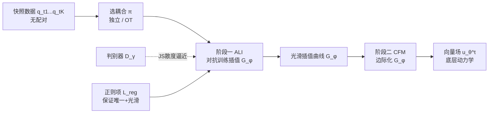

# Multi-Marginal Flow Matching with Adversarially Learnt Interpolants

**会议**: ICLR 2026  
**OpenReview**: [https://openreview.net/forum?id=AJls43yje7](https://openreview.net/forum?id=AJls43yje7)  
**代码**: [github.com/mmacosha/adversarially-learned-interpolants](https://github.com/mmacosha/adversarially-learned-interpolants)  
**领域**: 计算生物学 / 轨迹推断 / 流匹配生成模型  
**关键词**: 多边际流匹配, 对抗学习插值, GAN, 单细胞轨迹推断, 空间转录组, 细胞追踪  

## 一句话总结
用 GAN 式对抗损失学习「神经插值曲线」，让插值曲线在中间时刻的边际分布逼近观测快照分布（而非逐点穿过样本），再用流匹配把这些光滑插值边际化为向量场，从而在缺少真实轨迹、只有离散时间快照的科学数据上推断连续动力学。

## 研究背景与动机

**领域现状**：很多科学问题（单细胞 RNA 测序、空间转录组、疾病演化）只能在若干离散时间点采到数据快照，且不同时刻的样本是**无配对**的——无法知道 $t_i$ 的某个细胞对应 $t_{i+1}$ 的哪个细胞。要从这些快照里恢复底层连续动力学（即 ODE $dx_t = v_t(x_t)\,dt$ 的向量场 $v_t$），需要把流匹配（Flow Matching）推广到**多边际**设定：要求学到的动力学不仅把 $q_0$ 推到 $q_1$，还要在所有中间时刻满足 $p_{t_i} = q_{t_i}$。

**现有痛点**：多边际流匹配的核心是选「插值曲线」$G(x_0,x_1,t)$。已有方法各有缺陷——(1) **逐对线性/分段插值**（OT-CFM，Tong et al. 2024）在每段 $[t_i,t_{i+1}]$ 各自线性，拼接处不光滑，导致 CFM 目标梯度方差大、向量场积分发散；(2) **三次样条插值**（MMFM，Rohbeck et al. 2025）虽光滑但要求曲线**逐点穿过**中间样本，且在高维下扩展性差；(3) **度量流匹配 MFM**（Kapuśniak et al. 2024）学一个度量再求测地线，但时间无关度量无法刻画「几何随时间变化」的动力学，时间相关度量又退化成分段插值。

**核心矛盾**：所有现有方法都把中间边际当作**逐点约束**——强迫插值曲线穿过具体样本点。这在数据有噪声、或样本本就是分布的随机采样时是错误的归纳偏置：它把噪声样本当成必经路径，既不光滑又过拟合。

**本文目标**：构造一族**光滑、唯一**的插值曲线，让它们在中间时刻的**分布**逼近观测边际 $q_{t_i}$，而不强求穿过任何特定样本，从而对噪声鲁棒、可扩展到大 $K$（上千个边际）与高维。

**核心 idea（对抗式分布匹配插值）**：把「插值曲线在 $t_i$ 的 pushforward 分布要等于 $q_{t_i}$」这个约束 $(G_\phi(\cdot,\cdot,t_i))_\#\pi = q_{t_i}$，用一个 GAN 的判别器来近似强制——判别器区分「真实快照样本 $x_{t_i}\sim q_{t_i}$」和「插值生成的点 $G_\phi(x_0,x_1,t_i)$」，生成器（插值网络）则骗过判别器。这等价于最小化两者间的 JS 散度，是一种**分布匹配**而非逐点匹配。

## 方法详解

### 整体框架
ALI-CFM 是两阶段流水线：**第一阶段 ALI** 用对抗损失 + 正则项训练一族神经插值曲线 $G_\phi$，使其中间边际匹配观测快照；**第二阶段 CFM** 固定 $G_\phi$，用标准条件流匹配把这些光滑插值边际化，回归出向量场 $u_\theta^t$。前缀 I-/OT- 表示端边际间用独立耦合还是（minibatch）最优传输耦合 $\pi$。

### 关键设计

**1. 对抗学习插值（ALI）：把边际约束变成 GAN min-max**。插值曲线参数化为线性基 + 神经修正项 $G_\phi(x_0,x_1,t) = (1-t)x_0 + tx_1 + t(1-t)f_\phi(x_0,x_1,t)$，其中 $t(1-t)$ 因子保证端点 $t=0,1$ 自动满足边际约束，只在中间需要学。要让中间边际匹配 $q_{t_i}$，引入判别器 $D_\gamma(x_t,t)$ 区分真实快照与插值点，对每个 $t_i$ 优化 $\min_{G_\phi}\max_{D_\gamma} \mathbb{E}_{(x_0,x_1)\sim\pi}[\log(1-D_\gamma(G_\phi(x_0,x_1,t_i),t_i))] + \mathbb{E}_{q_{t_i}}[\log D_\gamma(x_{t_i},t_i)]$。在最优判别器假设下这等价于最小化 $q_{t_i}$ 与 $(G_\phi(\cdot,\cdot,t_i))_\#\pi$ 间的 JS 散度。妙处在于：GAN 通常的「噪声输入」这里由端点对 $(x_0,x_1)\sim\pi$ 充当，时间 $t_i$ 作为条件——插值曲线本身就是 conditional generator。这是与所有现有方法的根本区别：**分布匹配而非逐点穿过**，因而天然抗噪。

**2. 三种正则项保证插值唯一且光滑**。单纯 min-max 解不唯一，可能产生任意弯曲的插值。论文提出三种正则，前两种有可证唯一性：(a) **线性参考正则** $L_{\text{reg}} = \mathbb{E}_\pi\|G_\phi(x_0,x_1,t_i) - \ell(x_0,x_1,t)\|^2$，惩罚偏离端点连线 $\ell=(1-t)x_0+tx_1$，定理 2.1 证明在边际约束下满足 $q_t$-a.c. 时解唯一；(b) **分段线性参考正则**（式 11），当中间边际支撑集与端边际差异大时，回归到经 Markov 链 OT 耦合的分段线性参考（式 12），并在 $t\in[0,1]$ 上连续平均，定理 2.2 给出唯一性，适合小 $K$；(c) **二阶导数范数正则** $L_{\text{reg}} = \mathbb{E}_\pi\int_0^1\|\partial^2 G_\phi/\partial t^2\|_2^2\,dt$，直接惩罚曲率（类比三次样条思想），二阶导用有限差分 $[G(t+h)+G(t-h)-2G(t)]/h^2$ 近似、3 个蒙特卡洛 $t$ 样本估积分即可。总目标 $L_{\text{ALI}} = \mathbb{E}_i[L_{\text{GAN}}(G_\phi,D_\gamma;t_i) + \lambda L_{\text{reg}}(G_\phi;t_i)]$。

**3. 边际化为向量场（ALI-CFM）**。插值训好后固定 $\phi$，用条件流匹配回归向量场：目标速度由插值对时间求导给出，$\frac{d}{dt}G_\phi = x_1 - x_0 + t(1-t)\frac{d}{dt}f_\phi + (1-2t)f_\phi$（autograd 自动微分，开销小），CFM 损失 $\|u_\theta^t(G_\phi(x_0,x_1,t)) - \frac{d}{dt}G_\phi(x_0,x_1,t)\|^2$。由于 ALI 插值光滑，这一步的回归目标梯度方差远小于分段线性插值，因而向量场积分稳定不发散——这正是 OT-CFM 在长序列上失败、而 OT-ALI-CFM 成功的根因。

## 实验关键数据

### 主实验表格

5D PCA scRNA-seq 轨迹推断（EMD，越小越好，留一中间边际，5 次平均）：

| 方法 | Cite | EB | Multi |
|------|------|------|------|
| I-CFM | 1.236 | 1.156 | 1.150 |
| OT-CFM | 1.142 | 0.809 | 0.975 |
| OT-MFM | **0.793** | **0.711** | 0.890 |
| OT-MMFM (样条) | 1.099 | 3.530 | 1.807 |
| **OT-ALI-CFM (本文)** | 0.910 | 0.742 | **0.925** |

空间转录组（ST）肿瘤坐标推断（平均 EMD，留一切片）：

| 方法 | EMD (↓) |
|------|---------|
| OT-CFM | 109.76±9.98 |
| OT-MMFM | 109.17±9.82 |
| OT-MFM | 183.88±53.92 |
| **OT-ALI-CFM** | **98.91±2.03** |

### 消融实验表格

不同应用场景下方法对比（定性/定量）：

| 任务 | 难点 | 关键结论 |
|------|------|----------|
| 合成 knot（§4.1，K=1200 边际） | 几何随时间变化 | 唯一能准确捕捉时变几何的方法；分段线性/样条/LAND 均不光滑 |
| 细胞追踪（§4.2，U373 细胞 115 帧） | 噪声大、回路路径、细胞形变 | ALI 给出光滑映射；OT-CFM 向量场发散无法训练；时间无关 OT-MFM 学不到时变动力学 |
| 高维 scRNA-seq（§4.3，50D/100D） | 高维 | 与 SOTA 持平，略逊 OT-MFM（分布匹配在逐点指标上吃亏） |

### 关键发现
- **在噪声多、边际数极多（数百到数千）的任务上独一档**：合成 knot 和细胞追踪上，没有其他 FM 方法能达到可比性能，OT-CFM 甚至因不光滑而积分发散无法训练。
- **单细胞高维任务上持平 SOTA 但不超越**：作者坦言对抗训练做的是**分布匹配**，在逐点 EMD 上会输给「过拟合到给定样本」的 OT-MFM——这是分布匹配范式的固有取舍，而非缺陷。
- **GAN 在多模态数据上意外稳定**：ST 数据高度多模态（不同切片模式不一致），通常 GAN 难训，但式(11) 正则 + Markov 链 OT 耦合让训练稳定并取得最低 EMD。

## 亮点与洞察
- **范式转换**：从「插值必须穿过样本点」（逐点）转向「插值分布要匹配快照分布」（分布匹配），这是对噪声科学数据更正确的归纳偏置——快照本就是分布采样，不该被当成必经路径。
- **GAN 与流匹配的优雅嫁接**：端点对 $(x_0,x_1)\sim\pi$ 充当 GAN 的「噪声」、时间 $t_i$ 充当条件，把抽象的「边际匹配约束」转成可优化的对抗目标，且最优判别器下有 JS 散度的理论解释。
- **理论 + 工程双保障**：两个正则项各配一条唯一性定理（定理 2.1/2.2），既解决了 GAN 解不唯一的根本问题，又实测稳定了训练。
- **光滑性是关键杠杆**：光滑插值直接降低了下游 CFM 回归目标的梯度方差，这才是它在长序列上不发散、超越分段方法的机理。

## 局限与展望
- **逐点指标上的劣势**：分布匹配本质上不会过拟合到具体样本，因此在以逐点 EMD 衡量、且数据干净的高维单细胞任务上略逊于 OT-MFM，难以全面超越。
- **GAN 训练的固有脆弱性**：尽管正则缓解了，对抗训练对多模态分布仍敏感，超参（$\lambda$、判别器结构）需要调；论文也指出可借鉴 WGAN 等替代目标进一步稳定。
- **耦合依赖**：方法依赖端边际间的 OT 耦合质量，minibatch OT 在极高维下的近似误差可能传导到插值。
- **展望**：丰富的 GAN 优化文献（替代散度、谱归一化等）尚未充分引入；二阶导正则的有限差分近似精度也有提升空间。

## 相关工作与启发
- **流匹配基石**：CFM（Lipman et al. 2023；Tong et al. 2024）、Stochastic Interpolants（Albergo et al. 2025）、Rectified Flow（Liu et al. 2023）——本文沿用 CFM 的「插值→边际向量场」框架，创新在插值的学法。
- **多边际方法**：MFM 度量流匹配（Kapuśniak et al. 2024）、Neklyudov et al. 2024 的神经插值、MMFM 三次样条（Rohbeck et al. 2025；Lee et al. 2025）——都是逐点穿过，本文用分布匹配区别开。
- **GAN**：Goodfellow et al. 2014 的 min-max 与 JS 散度等价性是理论支点；多模态稳定性问题呼应 WGAN（Arjovsky et al. 2017）。
- **启发**：把生成模型里「分布匹配」的思想注入轨迹推断，对任何「只有快照、样本无配对、且有噪声」的科学时序问题（疾病演化、发育生物学）都有借鉴意义；对抗目标作为「软约束」替代硬性逐点约束，是处理噪声观测的通用思路。

## 评分
- **新颖性**: ⭐⭐⭐⭐ 首次用对抗式分布匹配学多边际插值，跳出「逐点穿过」范式，且配两条唯一性定理，概念上确实新。
- **实验充分度**: ⭐⭐⭐⭐ 覆盖合成、细胞追踪、scRNA-seq、空间转录组四类任务，含多维度与正则消融；ST 肿瘤坐标推断是新任务。略减分于高维单细胞未能超越 SOTA。
- **写作质量**: ⭐⭐⭐⭐ 动机—方法—理论—实验脉络清晰，图 1/2 直观点出分布匹配 vs 逐点的区别，理论与算法伪代码齐备。
- **价值**: ⭐⭐⭐⭐ 为噪声多、边际数多的科学时序动力学推断提供了实用且鲁棒的工具，对计算生物学（单细胞、空间转录组）落地价值高。

<!-- RELATED:START -->

## 相关论文

- [\[ICLR 2026\] Riemannian Variational Flow Matching for Material and Protein Design](riemannian_variational_flow_matching_for_material_and_protein_design.md)
- [\[ICLR 2026\] Interpolation-Based Conditioning of Flow Matching Models for Bioisosteric Ligand Design](interpolation-based_conditioning_of_flow_matching_models_for_bioisosteric_ligand.md)
- [\[ICLR 2026\] La-Proteina: Atomistic Protein Generation via Partially Latent Flow Matching](la-proteina_atomistic_protein_generation_via_partially_latent_flow_matching.md)
- [\[ICLR 2026\] scDFM: Distributional Flow Matching for Robust Single-Cell Perturbation Prediction](scdfm_distributional_flow_matching_model_for_robust_single-cell_perturbation_pre.md)
- [\[ICLR 2026\] FragFM: Hierarchical Framework for Efficient Molecule Generation via Fragment-Level Discrete Flow Matching](fragfm_hierarchical_framework_for_efficient_molecule_generation_via_fragment-lev.md)

<!-- RELATED:END -->
