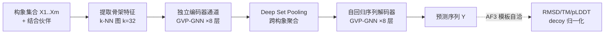

# Multi-state Protein Sequence Design with DynamicMPNN

**会议**: ICLR 2026  
**OpenReview**: [https://openreview.net/forum?id=4ptHfbHG3D](https://openreview.net/forum?id=4ptHfbHG3D)  
**代码**: 待确认  
**领域**: 计算生物学 / 蛋白质设计（逆折叠）  
**关键词**: 多构象设计, 逆折叠, ProteinMPNN, 几何深度学习, GVP-GNN, AlphaFold3, 多态蛋白  

## 一句话总结
DynamicMPNN 是首个"显式"多态逆折叠模型，直接学习一条序列对多个构象的联合条件分布 $p(Y|X_1,\dots,X_m)$，在多态蛋白基准上把 ProteinMPNN 的序列恢复率提高 12%、decoy-归一化 RMSD 自洽性提高 31%。

## 研究背景与动机

**领域现状**：结构生物学长期被"一序列、一结构、一功能"范式主导，PDB 里堆满了静态晶体结构，催生了 AlphaFold（结构预测）和 ProteinMPNN（逆折叠）这类高精度模型。ProteinMPNN 因推理便宜、实验成功率稳健，已成为应用蛋白设计的事实标准。

**现有痛点**：但很多关键生物过程——酶催化、膜转运、变构、信号开关——依赖能在多个构象间切换的蛋白（transporter 开/闭、hinge 域运动、metamorphic 变构折叠）。现有多态设计方法全是 **post-hoc 聚合**：先对每个单构象独立跑逆折叠，再把 logits 做平均（ProteinMPNN-MSD）或几何平均概率（Multi-state ESM-IF）、或扩散步上平均（ProteinGenerator）。这类方法实验成功率惨淡——ProteinGenerator 多态任务的 in silico 成功率仅 0.05%，而单态任务有 2–10%。

**核心矛盾**：logit 平均会偏向"对单一构象高度偏置、平均后仍高"的序列，而不是"对两个构象都中等满足"的序列——后者才是真正的多态解。换句话说，**先单态再聚合**这条路从根上就和多态目标错位。再叠加多构象数据稀缺、基准薄弱、折叠模型预测替代态能力差，导致 ML 多态设计长期落后于单态。

**本文目标**：把"聚合"换成"联合学习"——训一个直接吃整个构象集合、输出同时满足所有结构约束序列的模型；同时配套造出 ML-ready 多构象数据集和一个基于 AlphaFold3 的多态自洽性基准。

**核心 idea**：**[显式联合建模]** 用一个多态 GNN 编码器把 $m$ 个构象编码进共享隐空间、pool 成单一表征，再自回归解码出序列，让序列分布天然同时受多个结构约束，而非事后拼凑。

## 方法详解

### 整体框架
DynamicMPNN 的逆折叠流程分三段：先把蛋白每个功能态（连同其结合伙伴）独立编码进一个共享的 SE(3)-等变隐空间，再把待设计链在各构象上的 embedding 跨构象 pool 成单一表征，最后自回归地解码出一条同时兼容所有构象的氨基酸序列。评估端则用 template-based AlphaFold3 反向验证：把目标结构作为模板喂给 AF3，看设计序列能否复现该构象。

### 关键设计

**1. 联合条件分布建模：从"聚合"到"共同求解"**　这是全文立论的根基。单态逆折叠建模 $p(Y|X)$，而 DynamicMPNN 直接学习联合条件分布并用自回归分解：

$$p(Y|X_1,\dots,X_m)=\prod_{i=1}^{n} p(y_i \mid y_{i-1},\dots,y_1; X_1,\dots,X_m)$$

每一步预测残基 $y_i$ 时都同时看到完整构象集合 $\{X_1,\dots,X_m\}$ 编码后的共享表征，而不是先分别算再平均。这正面回避了 logit 平均偏向单构象的问题——模型被迫找"对所有态都中等满足"的序列。架构上沿用 RNA 逆折叠的 gRNAde 框架，编码器/解码器各 8 层 SE(3)-等变 GVP（Geometric Vector Perceptron）层，scalar 与 vector 特征沿独立通道做 O(3)-等变消息传递：$m_i,\vec m_i=\sum_{j\in N_i}\mathrm{MSG}((s_i,\vec v_i),(s_j,\vec v_j),e_{ij})$，再 $s_i',\vec v_i'=\mathrm{UPD}((s_i,\vec v_i),(m_i,\vec m_i))$，靠二面角这种反射敏感输入特征使整体 SO(3)-等变。

**2. 跨构象 pooling 与 DSS 变体：可控的表达力–效率权衡**　两个构象编码完如何融合决定了表达力。基础版 **DynamicMPNN** 用 Deep Set pooling——对构象顺序不变、不增参数、只更新节点特征，简单高效。进阶版 **DynamicMPNN + DSS** 在每层后用 Deep Symmetric Set 模块做 scatter/gather：把所有设计链的节点 embedding 平均、过 GVP、再残差加回各通道，允许更丰富的构象间交互、同时更新节点和边特征，代价是算力上升。实验上 DSS 带来的提升往往边际，作者因此把 Deep Set 作为默认，体现了"先把简单方案做对"的取向。

**3. 异质序列处理：榨干 PDB 的构象多样性**　真正多构象的 NMR 数据只覆盖 21% CATH 超家族，远不够训模型。作者转而利用 PDB 里序列冗余——把 ≥80%（PDB80）或 ≥95%（CoDNaS）相似度的链聚成簇当作同一蛋白的不同构象，拿到 46k 量级簇、覆盖 75% 超家族。但同簇链序列并不完全相同，对齐会引入 gap token，X-ray 结构又常有未解析残基，导致集合长度/缺失/gap 各异。处理协议是：簇内成员先做序列对齐再特征化、配对复合物独立编码、**gap 位置 mask 掉不参与消息传递**、pooling 时把 gap-node embedding 置零后再堆叠聚合。训练时还对与 ground truth 相似度 >70% 的链 mask 掉序列信息防泄漏。这套"异质集合"处理是把数据稀缺问题转化成数据工程问题的核心。

**4. Template-based AF3 多态自洽基准与 decoy 归一化**　评估比建模更棘手：折叠模型通常只预测一个主导态。作者借 Roney & Ovchinnikov 的思路，给 AF3 喂目标构象作模板，把"预测"变成"兼容性评估"——对每条设计序列跑 2 次 AF3（每个态各作一次模板），测 $\mathrm{AF3_{template}}(Y,X_k)=\mathrm{RMSD}(\mathrm{AF3}(Y,X_k),X_k)$。为剥离模板自身带来的偏置，引入 **decoy 归一化**：用结构差异极大（TM-score < 0.4）的 decoy 当模板跑同一序列，比值 $\mathrm{RMSD_{decoy}}=\mathrm{AF3_{template}}(Y,X_k)/\mathrm{AF3_{template}}(Y,D)$ 越小说明序列越是"特异地"折成目标态而非对任意骨架都兼容。再配 pLDDT 置信度，以及用 BioEmu 这类构象系综生成模型做正交评估，构成一套较完整的多态成功率度量。

## 实验关键数据

数据集：CoDNaS（46,033 簇）+ PDB80（46,924 簇），过滤掉与测试/验证 TM-score>0.4 或序列相似度>30% 的簇防泄漏，最终训练集 44,243 对构象。基准 96 个生物相关的 metamorphic/hinge/transporter 蛋白（取 inter-state RMSD 最高者作测试集）。

### 主实验：序列恢复（Table 3）

| 模型变体 | 序列恢复率 (%) ↑ |
|---|---|
| Combined Pretraining + Multi Finetuning | **42.7 (8.8)** |
| Single Pretraining + Multi Finetuning | 42.1 (8.3) |
| Combined Training | 41.0 (8.5) |
| **ProteinMPNN MSD（基线）** | 38.0 (11.0) |
| Single chain 2-state | 37.4 (9.0) |
| Single Training（仅单态） | 27.1 (9.4) |

最佳变体比 ProteinMPNN-MSD 高约 12%（42.7 vs 38.0）。

### 自洽性与消融（Table 1，n=96）

| 模型变体 | RMSD (Å) ↓ | TM-score ↑ | Decoy-Norm RMSD ↓ |
|---|---|---|---|
| Combined Training | **2.35** | 0.870 | 0.124 |
| Combined Training + DSS | 2.56 | 0.862 | 0.131 |
| Sampled Pair Training | 2.29 | 0.872 | 0.125 |
| Single Training（仅单态） | 8.16 | 0.652 | 0.348 |

Combined vs Single 的 decoy-归一化 RMSD 从 0.348 降到 0.124（相对降幅约 31%），是论文标题数字的来源；TM-score 自洽提升约 8%。BioEmu 正交评估（Table 5）也一致：Combined 的 TM-score 0.623 vs Single 0.394，TMS0.7 成功率 37.5% vs 17.7%。

### 关键发现
- **多态数据是关键**：Single Training（只喂单态对）几乎全面崩盘（RMSD 8.16、恢复率 27.1%），证明显式多态信号、而非更大模型，才是性能来源。
- **简单 pooling 够用**：DSS 在多数指标上不如朴素 Deep Set，验证了"昂贵的构象间交互收益边际"。
- **联合训练 > 后处理聚合**：在与 ProteinMPNN-MSD 的可比子集（n=61，Table 4）上，Combined 的 decoy-norm RMSD 0.129 vs 0.187，全面胜出。

## 亮点与洞察
- **范式转变讲得透**：把"post-hoc 聚合天生偏向单构象"这一根因点破，并用联合条件分布正面解决，立论干净。
- **数据工程巧**：用 PDB 序列冗余（80%/95% 相似度聚簇）把稀缺的多构象数据扩到 46k 量级，异质序列 gap-mask 处理让"近似同源"也能用，是真正落地的关键。
- **基准本身是贡献**：template-based AF3 + decoy 归一化把"折叠模型只预测主导态"这个评估难题绕开，提供了多态设计急需的可量化自洽指标。
- **架构迁移得当**：从 RNA 逆折叠的 gRNAde 借多态 GNN，复用成熟 GVP-GNN，工程风险低。

## 局限与展望
- **主要在两态**：架构支持任意构象数，但训练/评估几乎都聚焦 2-state；k=3/5 仅在单链 setting 下小规模消融，多链 k>2 留作未来工作。
- **缺湿实验**：全靠 AF3/BioEmu 的 in silico 自洽性，未做实际表达折叠的实验验证——而多态设计的真正考验恰恰在湿实验成功率。
- **评估依赖折叠模型**：AF3 模板法本身受 AF3 对替代态预测能力的限制，decoy 归一化只是缓解而非根除偏置。
- **连续构象未覆盖**：内在无序蛋白（IDP）等连续构象景观被显式排除，方法仅适用于有限离散态的球状多态蛋白。

## 相关工作与启发
- **逆折叠基线**：ProteinMPNN、ESM-IF——单态逆折叠的标杆，本文的直接对比对象。
- **多态聚合方法**：ProteinMPNN-MSD（logit 平均）、Multi-state ESM-IF（概率几何平均）、ProteinGenerator（扩散步聚合）——本文要超越的 post-hoc 范式。
- **架构源头**：gRNAde（RNA 多态逆折叠）提供多态 GNN 骨架；GVP-GNN 提供等变消息传递。
- **评估工具**：AlphaFold3（模板机制）、BioEmu（构象系综生成）、Roney & Ovchinnikov 的 decoy 自洽思想。
- **启发**：当目标本质是"多约束联合满足"时，与其训单约束模型再聚合，不如把多约束直接写进条件分布——这一思路对多目标分子设计、多视角生成等任务普适。

## 评分
- **新颖性**: ⭐⭐⭐⭐ 首个显式多态逆折叠模型，把"聚合 → 联合建模"的范式转变讲清并落地，配套数据集与基准都是实打实的增量。
- **实验充分度**: ⭐⭐⭐ 消融充分、多评估器交叉验证，但全为 in silico，缺湿实验，且 k>2 与多链组合覆盖不全。
- **写作质量**: ⭐⭐⭐⭐ 动机与根因分析清晰，方法与评估部分逻辑严密，图表组织得当。
- **价值**: ⭐⭐⭐⭐ 多态蛋白设计是 bio-switch/biosensor/酶工程的核心瓶颈，方法 + 数据 + 基准三件套对社区有实际推动价值。

<!-- RELATED:START -->

## 相关论文

- [\[ICLR 2026\] Property-Driven Protein Inverse Folding with Multi-Objective Preference Alignment](property-driven_protein_inverse_folding_with_multi-objective_preference_alignmen.md)
- [\[ICLR 2026\] FlexRibbon: Joint Sequence and Structure Pretraining for Protein Modeling](flexribbon_joint_sequence_and_structure_pretraining_for_protein_modeling.md)
- [\[ICLR 2026\] PRISM: Enhancing Protein Inverse Folding through Fine-Grained Retrieval on Structure-Sequence Multimodal Representations](prism_enhancing_protein_inverse_folding_through_fine-_grained_retrieval_on_struc.md)
- [\[ICLR 2026\] Riemannian Variational Flow Matching for Material and Protein Design](riemannian_variational_flow_matching_for_material_and_protein_design.md)
- [\[ICLR 2026\] MarS-FM: Generative Modeling of Molecular Dynamics via Markov State Models](mars-fm_generative_modeling_of_molecular_dynamics_via_markov_state_models.md)

<!-- RELATED:END -->
