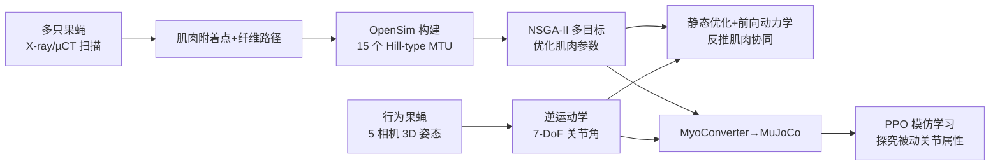

# Musculoskeletal simulation of limb movement biomechanics in Drosophila melanogaster

**会议**: ICLR 2026  
**OpenReview**: [https://openreview.net/forum?id=6lEjX1getx](https://openreview.net/forum?id=6lEjX1getx)  
**代码**: 待确认  
**领域**: 计算生物学 / 神经科学 / 运动控制  
**关键词**: Drosophila, 肌骨模型, Hill-type 肌肉, OpenSim, MuJoCo, 模仿学习, 肌肉协同  

## 一句话总结
首次为果蝇腿构建解剖学+生理学精确的 3D 肌骨模型（OpenSim + MuJoCo 双引擎），用 Hill-type 肌肉桥接运动神经元活动与关节运动，从真实行为数据反推肌肉协同，并证明被动关节属性（刚度/阻尼）能加速肌肉驱动控制的学习。

## 研究背景与动机
**领域现状**：果蝇 *Drosophila melanogaster* 的中枢神经系统、肌肉组织和外骨骼都已有接近完整的重建（connectome、micro-CT 等），是研究"神经-生物力学-行为"如何协同产生运动的理想模式生物——神经系统紧凑、可遗传操作、腿部自由度丰富。

**现有痛点**：尽管解剖数据齐备，**果蝇腿肌肉仍缺乏解剖学和物理学上扎实的模型**。已有的全身仿真（NeuroMechFly、Vaxenburg 等）依赖抽象的"位置/力矩控制器"驱动关节，把肌肉组织和被动生物力学整个抽象掉了，既无法刻画肌肉冗余与内在柔顺性，也无法回答"神经网络如何协调肌肉产生鲁棒行为"。

**核心矛盾**：运动神经元活动与关节运动之间缺了一座"桥"——只靠连接组或神经记录，无法预测某个行为下的肌肉活动模式，因为果蝇腿肌（约 19 块肌肉、69 个运动神经元、含跨关节的双关节肌）解剖与功能都太复杂。

**本文目标**：建立首个生物学细节充分的果蝇腿肌骨模型，把解剖、生理、行为数据统一进一个框架，能从真实运动学反推肌肉协同，并作为具身智能体的物理约束接口。

**核心 idea**：**用 Hill-type 肌肉模型替换抽象关节控制器**——从高分辨 X-ray 扫描提取肌肉附着点和纤维走向构建肌腱单元，用多目标优化校准未知参数，再结合 3D 姿态估计实现"肌肉驱动的行为回放"，最后在 MuJoCo 里训模仿学习策略探究被动属性对控制的影响。

## 方法详解

### 整体框架
管线分三段：左侧从多只果蝇的解剖数据（X-ray/µCT 扫描）确定肌肉附着点与纤维路径，在 OpenSim 中构建 15 个肌腱单元（MTU）的 Hill-type 肌肉模型并优化参数；右侧从自由行为果蝇的 3D 姿态估计获取真实关节运动学；中间二者结合，先在 OpenSim 用静态优化-前向动力学反推肌肉活动，再用 MyoConverter 转到 MuJoCo 训练模仿学习策略。

### 关键设计

**1. 从解剖影像构建 Hill-type 肌肉模型：让仿真长出"真肌肉"。** 作者用两个公开数据集加一个自采的同步辐射 µCT 数据集，针对 thorax–coxa、coxa–trochanter、femur–tibia 三个关节标注肌纤维，跨数据集交叉验证附着点。每条前腿建模 15 个 MTU（thorax 7、coxa 6、femur 2），覆盖 19 个肌群中的 12 个；每个肌群用 1–2 个 Hill-type MTU 表示，含收缩元件（CE）、并联弹性元件（PE）和串联弹性元件（SE，假设刚性肌腱）。总肌腱长度 $l_{mt}=l_m\cos(\alpha)+l_t$，其中 $l_m$ 为纤维长、$\alpha$ 为羽状角、$l_t$ 为肌腱长。最大等长力由生理横截面积（PCSA）估计，按 $28\,\text{mN/mm}^2$ 的比张力缩放（介于果蝇跳跃肌 $37$ 和间接飞行肌 $9$ 之间）。

**2. 多目标优化校准未知参数：用两种行为防过拟合。** 由于实验数据有限，初始解剖参数未必符合生物现实，作者用 OpenSim 做闭环优化：对优化器提出的每组候选参数，先用静态优化（SO）从参考关节角反推肌肉激活，再用前向动力学（FD）模拟关节轨迹，用 **NSGA-II** 找出使运动学最贴近实验数据的参数集。关键技巧是**同时拟合触角梳理和行走两种行为**、只保留两者都表现好的解来避免过拟合；每个关节（1 或 3 DoF）独立优化，一个 3-DoF 关节约 8 小时。优化后用肌肉力臂验证生物合理性——模型正确复现了屈肌/伸肌力臂符号相反，且预测的关节主导肌与已知功能一致。

**3. 模仿学习 + 物理约束动作空间：让策略只学控制、不学物理。** 把优化好的 OpenSim 模型经 MyoConverter 转成 MuJoCo 格式，用 dm_control 搭建跟踪任务，PPO 训练 MLP 策略（2 层 512 单元 + 256，ReLU），训 $15\times10^6$ 步、控制频率 500 Hz、物理引擎 10 kHz。86 维观测含 4 个腿部 landmark 的 3D 坐标（12-D）、7 DoF 关节角与角速度（14-D）、15 块肌肉的激活/力/长度/速度（60-D），输出 15 维 $[0,1]$ 肌肉兴奋（即运动神经元活动）。奖励同时在笛卡尔、关节角、关节速度空间鼓励精确跟踪：
$$r_t=\frac{1}{3}\left[\exp(-w_p d^{xpos}_t)+\exp(-w_p d^{qpos}_t)+\exp(-w_v d^{qvel}_t)\right]$$
其中 $w_p=5,\ w_v=3$，奖励裁剪到 $[0,1]$。关键洞察是：肌骨模型把策略动作限制在"只能产生物理上合理的运动"的空间里，消除了灾难性动作，**策略无需先学一个物理世界模型再学控制，只需学控制本身**，从而高效且利于缩小 sim-to-real gap。

**4. 用 NMF 从仿真肌肉活动反推协同基元。** 对 SO 估出的肌肉活动做非负矩阵分解（NMF），发现**仅 3 个肌肉基元就解释了超 90% 的方差**，第一个基元单独占 80% 以上，各基元有明显非重叠的时间动态，由此能预测可供实验验证的行为相关肌肉协同分组。

## 实验关键数据

### 主实验：肌肉协同与参数优化

| 项目 | 结果 |
|------|------|
| 建模 MTU | 15 个/前腿（thorax 7 + coxa 6 + femur 2），覆盖 12/19 肌群 |
| 优化算法 | NSGA-II，200 个体 × 40 代，3-DoF 关节约 8h，全腿约 20h |
| 优化目标 | 行走 + 触角梳理两种行为联合，RMSE（按关节运动范围归一）+ Pearson $R^2$ |
| 肌肉协同 | NMF 仅 3 个基元解释 >90% 方差，第 1 基元 >80% |
| 协同结构 | Sar/Sa 任务不变；coxal 屈肌→协同2、伸肌→协同3（仅梳理时特化）|

### 消融：被动关节属性对模仿学习的影响
四种 MuJoCo 配置（armature 始终保留），PPO 训 1500 万步，比较早期（2.5–3M 步）与后期（14.5–15M 步）平均奖励：

| 配置 | 学习速度/最终性能 |
|------|------|
| 仅 armature（惯性）| 最慢、最低 |
| armature + damping | 中等 |
| armature + stiffness | 中等 |
| **armature + damping + stiffness** | **最快、最高**（早期优势持续到训练末期）|

统计检验用双侧 Mann-Whitney U + Holm-Bonferroni 校正。

### 关键发现
- **肌肉协调高度依赖行为**：果蝇可能用同一套肌肉、通过激活不同的任务特定协同来灵活复用——梳理时 trochanter 屈/伸肌节律性重叠激活，行走时却反相。
- **刚度+阻尼组合学习最快**：被动力学稳定运动、减少持续纠错，让策略专注于产生协调的肌肉模式而非纠正不稳定；尽管最终运动学各配置肉眼难分，但学习效率显著不同。

## 亮点与洞察
- **首个解剖+生理双精确的果蝇腿肌骨模型**，双引擎（OpenSim 做生物力学分析、MuJoCo 做学习）互补，填补了"运动神经元活动↔关节运动"之间的桥梁。
- **从解剖影像到功能仿真的端到端自动化管线**：提取解剖特征→估计生理参数→多目标优化未知参数，可迁移到其他物种。
- **物理约束动作空间的训练哲学**很有启发：肌骨模型天然剔除非物理动作，策略不必隐式学物理，直击 sim-to-real 痛点。
- **3 个基元解释 >90% 方差**呼应运动控制中"肌肉协同降维"的经典假说，且给出可实验验证的预测。

## 局限与展望
- **未建模 tibia 肌肉**（X-ray 仅部分捕获 tibia）和 trochanter 肌肉（功能未明），覆盖 12/19 肌群，并非全肌群。
- **训练昂贵**：7-DoF 全腿模仿学习约 96 小时，全腿参数优化约 20 小时（顺序执行）。
- **仿真悬空免接触**：为速度和稳定性省略了身体-环境接触，未涉及真实落地动力学。
- **仅前腿、两种行为**：协同结论基于行走和触角梳理，泛化到其他腿/行为待验证。
- **未真正闭环神经**：尚未接入 connectome 神经回路，仍是从运动学反推肌肉而非从神经驱动肌肉。
- 展望：接入 DEP-RL 等状态相关探索提升高维肌肉动作空间的样本效率；用于驱动具身智能体生成自然柔顺的运动，乃至控制仿生机器人。

## 相关工作与启发
- **NeuroMechFly / Vaxenburg 等果蝇全身模型**：本文直接扩展 NeuroMechFly，把抽象关节控制器换成解剖学肌肉，是对该谱系"生物保真度"的关键补强。
- **OpenSim / MyoSuite / MuJoCo / dm_control**：复用人类与多物种（啮齿、灵长、马、鸵鸟、蠕虫）肌骨仿真平台生态，证明这套工具能下沉到昆虫尺度。
- **肌肉协同理论（Bizzi & Cheung、Ting & McKay）**：用 NMF 在果蝇上验证"少数协同组合出多样运动"的降维假说。
- **运动模仿学习（DeepMimic 系 Peng 等、La Barbera 等）**：把图形学/运动控制的模仿学习范式迁移到肌肉驱动的昆虫，启发"物理约束动作空间"的训练思路。

## 评分
- **新颖性**: ⭐⭐⭐⭐⭐ 首个解剖+生理精确的果蝇腿肌骨模型，双引擎、端到端管线，填补该领域空白。
- **实验充分度**: ⭐⭐⭐⭐ 含参数优化、力臂验证、NMF 协同分析、被动属性消融（多 seed + 统计检验），但局限于前腿与两种行为。
- **写作质量**: ⭐⭐⭐⭐ 管线图清晰、动机层层递进、方法与生物学背景交代充分。
- **价值**: ⭐⭐⭐⭐⭐ 横跨神经科学、机器人、机器学习的物理接地运动控制基座，可迁移到其他物种与具身智能体。

<!-- RELATED:START -->

## 相关论文

- [\[ICLR 2026\] MicroVerse: A Preliminary Exploration Toward a Micro-World Simulation](microverse_a_preliminary_exploration_toward_a_micro-world_simulation.md)
- [\[ICLR 2026\] Multifidelity Simulation-based Inference for Computationally Expensive Simulators](multifidelity_simulation-based_inference_for_computationally_expensive_simulator.md)
- [\[ICLR 2026\] WFR-FM: Simulation-Free Dynamic Unbalanced Optimal Transport](wfr-fm_simulation-free_dynamic_unbalanced_optimal_transport.md)
- [\[ICLR 2026\] VCWorld: A Biological World Model for Virtual Cell Simulation](vcworld_a_biological_world_model_for_virtual_cell_simulation.md)
- [\[ICLR 2026\] BioMD: All-atom Generative Model for Biomolecular Dynamics Simulation](biomd_all-atom_generative_model_for_biomolecular_dynamics_simulation.md)

<!-- RELATED:END -->
