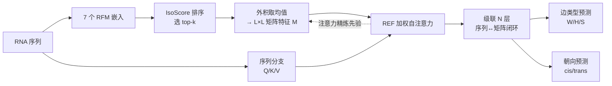

# NC-Bench and NCfold: A Benchmark and Closed-Loop Framework for RNA Non-Canonical Base-Pair Prediction

**会议**: ICLR 2026  
**OpenReview**: [https://openreview.net/forum?id=G9UhQEZHjY](https://openreview.net/forum?id=G9UhQEZHjY)  
**代码**: [https://github.com/heqin-zhu/NCBench](https://github.com/heqin-zhu/NCBench)  
**领域**: 计算生物学 / RNA 结构预测  
**关键词**: 非经典碱基对, RNA 二级结构, 基准数据集, RNA 基础模型, 注意力先验  

## 一句话总结
本文构建了首个面向 RNA 非经典（NC）碱基对预测的标准化基准 NC-Bench（925 条序列、6708 条 NC 标注），并提出双分支闭环框架 NCfold，通过 IsoScore 筛选 RNA 基础模型嵌入、以代表性嵌入融合（REF）注入注意力作为结构先验，在 NC 边类型与朝向预测上显著超越传统机器学习与 RFM 基线。

## 研究背景与动机
**领域现状**：RNA 二级结构是其折叠与功能的基础，碱基配对模式主导着这一切。除了经典的 Watson-Crick（A-U、G-C）和摆动（G-U）配对，自然 RNA 中还广泛存在非经典（NC）碱基对——例如 Hoogsteen 边的配对及其 cis/trans 朝向，它们在核酶、核糖开关、长非编码 RNA 的三级互作与结构稳定中扮演关键角色，绝非可忽略的"例外"。

**现有痛点**：热力学模型（RNAstructure）、比对类方法（TurboFold II、PFold）以及深度学习方法（MXfold、UFold、BPfold）几乎都只为经典碱基对设计，对配对朝向、边类型这些几何细节零覆盖或覆盖极少。更根本的问题是**根本没有一个标准化的 NC 基准**：NC 标注必须依赖高分辨率 3D 结构，而这类结构极其稀缺；NC 配对在各类型间分布高度不均衡；衡量其几何与功能复杂性的生物学指标也缺失。

**核心矛盾**：NC 碱基对在生物学上极其重要，但样本极度稀疏且高度不平衡，纯靠序列自注意力很难学到可靠的配对模式——**数据稀缺与建模需求之间的矛盾**是核心障碍。

**本文目标**：建立首个 NC 碱基对预测的统一评测基准，并设计一个能在数据稀缺条件下有效预测 NC 边类型与朝向的框架。

**核心 idea**：**[基准]** 从 PDB 系统性策划 925 条含 NC 配对的 RNA 序列，定义细粒度的边/朝向分类任务，并引入 IsoScore 评估 RFM 嵌入质量；**[框架]** 用 RFM 嵌入作为结构先验来补偿标注稀缺，通过代表性嵌入融合与 REF 加权自注意力，让序列特征与结构先验在闭环中相互精炼。

## 方法详解

### 整体框架
NCfold 是一个**闭环双分支序列-矩阵框架**。它先用 IsoScore 从 7 个 RNA 基础模型（RFM）中挑出 top-k 个最具信息量的嵌入，把每个嵌入经"外积取均值"转成 L×L 的碱基对交互矩阵，作为结构先验；随后这些先验通过 REF 加权自注意力注入 Transformer，与序列分支的注意力计算耦合，并在级联的多层中被注意力分数反向更新，形成"先验引导注意力、注意力精炼先验"的闭环。最终以多任务方式同时输出每核苷酸的边类型与碱基对朝向。

### 关键设计

**1. IsoScore 驱动的代表性嵌入融合（REF）：只取最有信息量的先验。** 不同 RFM 学到的嵌入空间几何差异巨大——有的高度各向异性，有的把语义信息过度压缩，盲目拼接所有嵌入只会引入噪声和语义不一致。作者借鉴 IsoScore 来量化嵌入的各向同性与信息密度，按分数对 RNA-FM、RNAErnie、structRFM 等 7 个模型排序，只选 top-k 个最具代表性的嵌入。每个被选中的嵌入 $E^{(r)} \in \mathbb{R}^{L\times D}$ 经外积取均值转为成对交互矩阵 $M^{(r)} = \mathrm{mean}(E^{(r)} \otimes E^{(r)\top}; -1, -2)$，再沿首维堆叠成统一表示 $M = \mathrm{stack}(\{M^{(r)}\}_{r=1}^{k}) \in \mathbb{R}^{k\times L\times L}$。这一步把"选哪些模型"从拍脑袋变成由几何指标驱动，思路上类似 MoE 的专家选择，RFM 主干全程冻结以保证效率。

**2. REF 加权自注意力：把结构先验直接焊进注意力图。** NC 配对太稀疏，纯数据驱动的注意力难以捕捉配对多样性，于是把 REF 矩阵作为偏置直接加到注意力分数上。REF 矩阵 $M$ 先经卷积 $\mathrm{CONV}$ 强化局部结构信号，再叠加到原始注意力打分上：
$$
\text{REF-weighted Self-Attention}(X) = \mathrm{softmax}\!\left(\frac{QK^\top + \mathrm{CONV}(M)}{\sqrt{d}}\right) V.
$$
其精髓在于：注意力既依赖序列上下文、又被生物物理上合理的结构先验引导，从而把模型的注意力推向更可信的配对位置，同时保留序列特征自适应微调的空间。

**3. 双分支闭环：序列与矩阵逐层相互强化。** 框架让序列表示和矩阵表示在级联 Transformer 块间双向流动。第 $i$ 块中序列分支先经层归一化与线性投影得到 $Q_i, K_i, V_i$；矩阵分支把上一块的注意力权重 $M_i$（首块为堆叠的 REF）经残差卷积处理后融入当前注意力：$M_{i+1} = \mathrm{softmax}\big((Q_iK_i^\top + \mathrm{CONV}(M_i))/\sqrt{d}\big)$，$X_{\mathrm{MSA},i} = M_{i+1}V_i$，再经残差、LN 与 FFN 更新序列特征。这样经 $N$ 层后，**序列级上下文与碱基间交互在每一层都互为输入、彼此精炼**，闭环地缓解数据稀疏，强化局部与全局结构依赖。

**4. 多任务预测头与类加权损失：对抗极端不平衡。** 序列通路用全连接层投影出边 logits $\hat{Y}_{\text{edge}} \in \mathbb{R}^{B\times L\times 4}$，矩阵通路用 1×1 卷积把交互矩阵映射为朝向 logits $\hat{Y}_{\text{orient}} \in \mathbb{R}^{B\times L\times L\times 3}$，联合优化交叉熵：$\mathcal{L} = \lambda_{\text{edge}}\,\mathrm{CE}(\hat{Y}_{\text{edge}}, Y_{\text{edge}}) + \lambda_{\text{orient}}\,\mathrm{CE}(\hat{Y}_{\text{orient}}, Y_{\text{orient}})$。针对 NC 类型的极端不均衡，作者对边任务用 $[1,5,20,20]$（Ne/W/H/S）、朝向任务用 $[1,20,20]$（Np/trans/cis）的类权重，并配合标签平滑（$\varepsilon=0.05$），有效抬升稀有类的学习信号。

## 实验关键数据

### 主实验表格
NC-Bench 4 折交叉验证，对比 7 个传统 ML 方法与 7 个 RFM。F1 与 MCC 在不平衡场景下更具参考价值（节选）：

| 模型 | 边-MCC | 边-F1 | 朝向-MCC | 朝向-F1 |
|------|--------|-------|----------|---------|
| Random Forest | -0.020 | 0.168 | 0.002 | 0.372 |
| Gradient Boosting | 0.042 | 0.258 | 0.002 | 0.365 |
| MLP | 0.000 | 0.218 | 0.163 | 0.402 |
| RNA-FM（冻结+线性） | 0.000 | 0.218 | 0.000 | 0.355 |
| structRFM | 0.000 | 0.218 | 0.005 | 0.357 |
| **NCfold (top-1)** | 0.211 | 0.341 | 0.285 | 0.482 |
| **NCfold (top-2)** | **0.245** | **0.365** | **0.312** | **0.486** |
| NCfold (top-3) | 0.219 | 0.336 | 0.265 | 0.466 |

所有冻结 RFM 在边子任务上 MCC=0、F1=0.218，因为简单线性头全预测成"无边"（负类），彻底无法识别正样本；NCfold (top-2) 在两个任务上均显著领先。

### 消融实验表格
验证 RFM 结构先验的价值（NCfold-base：不加 RFM 嵌入；NCfold-BPE：换成 BPfold 的碱基对能量先验）：

| 模型 | 边-MCC | 边-F1 | 朝向-MCC | 朝向-F1 |
|------|--------|-------|----------|---------|
| NCfold-base | 0.084 | 0.251 | 0.217 | 0.419 |
| NCfold-BPE | 0.211 | 0.335 | 0.326 | 0.464 |
| **NCfold** | **0.245** | **0.365** | 0.312 | **0.486** |

去掉 RFM 先验性能全面下滑；换成 BPfold 能量先验有提升但仍逊于 RFM 嵌入，证明 REF 引入的 RFM 结构先验是性能提升的主要来源。

### 关键发现
- **零样本对比**：MXfold2、SPOT-RNA、UFold、BPfold 等经典二级结构方法只能预测"配对/不配对"状态，对 NC 配对召回率近乎为零（高精度、零召回）；NCfold 取得最高 F1=0.440（P=0.489、R=0.431），凸显 NC 专用基准与方法的必要性。
- **超参敏感性**：Transformer 层数取 4 或 6、batch size=4 时表现最佳，较小 batch 有助于捕捉细粒度模式。
- **数据分布**：6708 条 NC 标注中 WH 最多（26.94%），HH 最稀（3.40%）；朝向上 trans 占 58.96%、cis 占 41.04%，印证 NC 互作的强不平衡性。

## 亮点与洞察
- **首个 NC 基准填补真空**：把过去散落、无法横向比较的 NC 预测任务标准化为带细粒度边/朝向标签、4 折交叉验证、5 项指标的统一评测，对推动该子方向意义重大。
- **IsoScore 选嵌入的工程巧思**：用各向同性指标量化"哪个 RFM 的嵌入值得用"，避免了盲目拼接多模型嵌入引入噪声，是把表示质量评估嵌入到模型设计中的好范例。
- **闭环双分支让先验"活"起来**：结构先验不是静态注入，而是随注意力逐层被反向更新，序列与结构互为输入，这种闭环设计有效缓解了稀疏监督。
- **冻结 RFM 的失败暴露问题本质**：所有 RFM 直接接线性头全军覆没，说明 NC 预测难点不在表示本身，而在如何把表示转成结构先验并对抗极端不平衡。

## 局限与展望
- **数据规模仍有限**：925 条序列虽是同类最大，但相比经典碱基对资源仍偏小，需持续用新实验结构扩充。
- **监督范式受限**：当前为全监督，作者展望引入半监督/生成式方法以利用海量无标注 RNA。
- **假阳性伪结**：可视化显示 NCfold 倾向预测较多假阳性伪结（pseudoknot），需后处理与朝向图阈值调整缓解。
- **可扩展性待验证**：闭环双分支设计能否迁移到三级结构建模、RNA-蛋白互作、RNA 设计等任务尚待探索。

## 相关工作与启发
- **经典二级结构预测**：热力学（RNAstructure）、比对（TurboFold II、PFold）、深度学习（MXfold、UFold、SPOT-RNA、BPfold）——均聚焦经典配对，是本文零样本对比与动机的来源。
- **RNA 基础模型（RFM）**：RNA-FM、RNAErnie、SpliceBERT、UTR-LM、AIDO.RNA、RiNALMo、structRFM 提供丰富上下文表示，本文创新地把它们当作结构先验而非直接分类器。
- **几何分类标准**：Leontis-Westhof 方案（W/H/S 三边 × cis/trans）是 NC-Bench 任务定义的理论基石。
- **方法学借鉴**：MoE 的专家选择思想启发 REF 的 top-k 嵌入筛选；IsoScore 来自表示各向同性研究。
- **启发**：在稀缺标注的科学任务中，"用大模型嵌入做结构先验 + 指标驱动地筛选先验 + 闭环精炼"是一条值得推广的范式。

## 评分
- **新颖性**: ⭐⭐⭐⭐ 首个 NC 碱基对基准 + IsoScore 选嵌入 + REF 加权闭环注意力，组合新颖且切中真实痛点。
- **实验充分度**: ⭐⭐⭐⭐ 覆盖 14 个基线、4 折交叉验证、消融、零样本、超参分析与可视化，较为完整；唯数据规模偏小、缺独立外部测试集。
- **写作质量**: ⭐⭐⭐⭐ 动机清晰、公式与图示规范，方法与基准两条线表述连贯。
- **价值**: ⭐⭐⭐⭐ 填补 NC 预测评测空白，数据与代码开源，对 RNA 结构建模社区有明确推动作用。

<!-- RELATED:START -->

## 相关论文

- [\[ICLR 2026\] MindPilot: Closed-loop Visual Stimulation Optimization for Brain Modulation with EEG-guided Diffusion](mindpilot_closed-loop_visual_stimulation_optimization_for_brain_modulation_with_.md)
- [\[ICLR 2026\] Protein Structure Tokenization via Geometric Byte Pair Encoding](protein_structure_tokenization_via_geometric_byte_pair_encoding.md)
- [\[ICML 2026\] TadA-Bench: A Million-Variant Benchmark for Future-Round Discovery Toward Agentic Protein Engineering](../../ICML2026/computational_biology/tada-bench_a_million-variant_benchmark_for_future-round_discovery_toward_agentic.md)
- [\[CVPR 2026\] TRIDENT: A Trimodal Cascade Generative Framework for Drug and RNA-Conditioned Cellular Morphology Synthesis](../../CVPR2026/computational_biology/trident_a_trimodal_cascade_generative_framework_for_drug_and_rna-conditioned_cel.md)
- [\[ICLR 2026\] HeurekaBench: A Benchmarking Framework for AI Co-scientist](heurekabench_a_benchmarking_framework_for_ai_co-scientist.md)

<!-- RELATED:END -->
