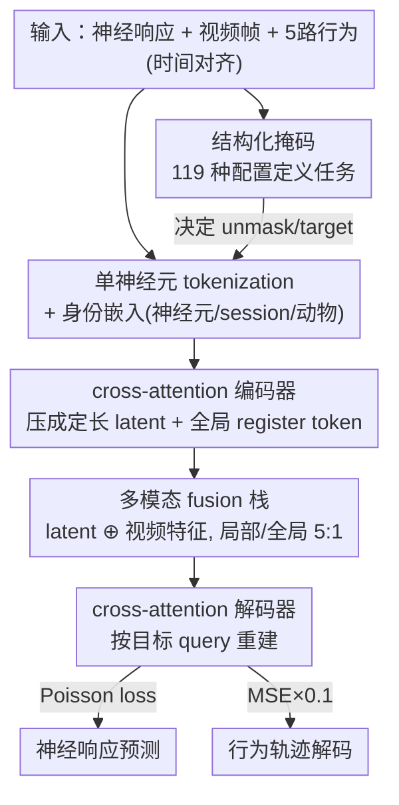

# OmniMouse: Scaling properties of multi-modal, multi-task Brain Models on 150B Neural Tokens

**会议**: ICLR 2026  
**OpenReview**: [https://openreview.net/forum?id=mEw4lhAn0F](https://openreview.net/forum?id=mEw4lhAn0F)  
**代码**: https://github.com/enigma-brain/omnimouse  
**领域**: 计算神经科学 / 脑活动建模 / 多模态多任务  
**关键词**: 脑基础模型, 单神经元 tokenization, 多任务掩码, 缩放定律, 小鼠视觉皮层

## 一句话总结
OmniMouse 用单神经元 token + 灵活掩码的统一架构，在 73 只小鼠视觉皮层、超 1500 亿神经元 token 上联合做神经预测/预报、行为解码与刺激编码，刷新了 SOTA；并发现一个反直觉的缩放结论——脑活动建模目前是**数据受限**而非参数受限，加数据持续有用，加模型规模很快饱和。

## 研究背景与动机

**领域现状**：在语言和视觉里，"扩数据 + 扩参数"已经被验证为通往基础模型的主路，缩放定律（Kaplan、Chinchilla）能稳定预测性能随规模的提升。神经科学社区近年也开始尝试给 EEG / fMRI / MEG / 单神经元活动造"基础模型"。

**现有痛点**：但已有的脑活动模型大多被限制死在某一个口子上——要么只处理单一模态（只看神经元历史，或只看刺激），要么只支持单一任务，要么没法跨 session/跨动物扩展，要么干脆把视觉刺激或行为信息丢掉。比如 NDT 系（response-to-response）不带视觉刺激，digital twin 系带刺激却不灵活，POYO+ 做行为解码却不预测响应。没有一个模型能把"神经活动 + 视频刺激 + 行为"在一个架构里统一起来。

**核心矛盾**：和互联网级语料相比，神经数据**小、碎、不够多样**——单个 session 神经元数量不固定、不同 session 看的刺激不同、采样率各异。这让"缩放定律到底适不适用于单神经元数据"成了一个没有共识的问题：有人（Jiang et al. 2025、Ye et al. 2025）认为收益被数据异质性卡住，有人（Antonello et al. 2023）认为不会饱和。要回答这个问题，必须先有一个能吃下大规模异质数据、又能公平横评多任务的统一模型。

**本文目标**：(1) 造一个能在测试时灵活组合"神经预报 / 子群体预测 / 刺激编码 / 行为解码"的多模态多任务架构；(2) 在迄今最大的单神经元数据集之一上系统刻画缩放行为，回答数据 vs 模型谁是瓶颈。

**切入角度**：作者押注**单神经元 token + 灵活掩码**这条路——把每个神经元的每段活动当成独立 token（沿用 POYO+ / POCO 的 tokenization），这样神经元数量任意、可逐神经元逐时刻掩码，任务就退化成"掩谁、重建谁"的不同配置，一个模型天然支持任意任务组合。

**核心 idea**：用"统一 tokenization + 结构化掩码"把多模态多任务脑建模收成一个可缩放的架构，再借它做严谨的缩放实验，发现脑建模的缩放故事和 LLM **相反**——数据才是当前瓶颈。

## 方法详解

### 整体框架

OmniMouse 的输入是一段时间对齐的多模态数据：神经响应（钙成像提取的 spike）、视频刺激帧、五路行为变量（跑速 + 四个瞳孔变量），外加一个**掩码配置**，规定每个模态哪些样本被编码（unmask 当作上下文）、哪些被掩掉当作重建目标。整条管线分四步走：先把三个模态各自 token 化，按掩码配置移除被掩 token 并为目标构造 query；再用 cross-attention 编码器把变长的神经+行为 token 压成定长 latent；接着把 latent 和视频特征拼在一起过多模态 fusion transformer 栈做跨模态长程交互；最后用 cross-attention 解码器从融合表征里重建目标神经响应和行为轨迹。"任务"完全由掩码配置定义——训练时用了 119 种结构化掩码配置覆盖各种上下文组合，所以同一个模型在测试时能灵活切到任意任务。

### 关键设计

**1. 单神经元 tokenization 配身份嵌入：让任意数量神经元、逐神经元掩码成为可能**

最棘手的问题是不同 session 的神经元数量不一样、且要支持"只给一部分神经元、预测另一部分"。OmniMouse 不把整群神经元一次性线性投影（NDT 的做法），而是逐神经元逐时间段地切 token：对 session $i$ 的 $P_i$ 个神经元的钙轨迹做带步长的 1D 卷积 $f_{conv}: \mathbb{R}^{P_i \times S_R} \to \mathbb{R}^{P_i \times T \times D_{model}}$，每个神经元得到 $T = \lfloor (S-w_R)/s_R \rfloor + 1$ 个 token。每个 token 再叠加可学的**身份嵌入**——神经元 ID、session ID、动物 ID 三者经各自嵌入表（固定维度 $D_{embed}=128$）线性投影后相加：$ID = W_u E_u(N_i) + W_s E_s(i) + W_a E_a(i)$，最终 $Z_R = \text{Flatten}(X_R + ID)$。这样每个 token 自带"我是谁的、哪只鼠的、哪次记录的"信息，掩码就退化成简单地从序列里删 token、再用目标 token 的身份嵌入当 query 去重建。把身份嵌入维度固定为 128 是刻意的：让逐神经元参数量和模型主干维度解耦，否则模型一放大、每神经元参数也跟着炸。

**2. 双轴结构化掩码：把"任务"统一成掩谁重建谁**

OmniMouse 把所有任务都表达成同一种语言——掩码。对神经响应，它定义了一个所有配置共享的预测目标（3072 个随机神经元的最后 1 秒、30 个样本），然后沿两条轴变化可见上下文：**population context**（同时刻另一批非目标神经元的活动）和 **causal context**（所有神经元的历史活动）。两轴还能叠（只给一部分神经元的历史），逼模型同时沿群体维和时间维插值。对视频，定义一段可见帧区间，目标前的帧支持预报、同时刻帧支持刺激编码。对行为，要么整段给当上下文、要么整段掩掉当解码目标。训练时铺了 119 种这样的配置，于是"预报""子群体预测""刺激编码""行为解码"以及它们的任意组合，本质都是同一个模型在不同掩码下跑，测试时即插即用。还有个细节：causal context 和目标之间留 5 个样本的 buffer gap，防止上采样把未来信息泄进来。

**3. 局部滑窗注意力 + 全局 register token 的多模态融合：长序列下既高效又不丢全局**

神经 token 一多，序列极长，全注意力扛不住；但脑建模又需要跨模态、长程的时间交互。OmniMouse 在三处都用局部滑窗注意力——给每个 query 和 token 按其模态分配一个局部时间窗，窗口不重叠的 token 对之间屏蔽注意力。编码器用 cross-attention 把变长输入压成 $M \times N$ 个定长 latent（$M$ 个唯一 query 重复在 $N$ 个均匀时间戳上），为避免大群体造成信息瓶颈，$M$ 取得比前作略大。为了不丢全局信息、避免 attention sink，再追加 $G$ 个**全局 register token**，它们注意整条 key 序列。融合栈里则按 **5:1** 的比例交错"局部滑窗层"和"全局无掩码层"——大部分层省算力做局部，每隔几层来一次全连接做跨模态长程交互。所有 transformer 层都用基于 token 时间戳的 1D-RoPE 编码相对时序，让模型在模态内和模态间都能感知"谁先谁后"。

**4. 双目标加权训练 + warmup-stable-decay 取密集 checkpoint：一次训练铺满缩放曲线**

模型同时预测神经响应（Poisson loss，跨神经元平均）和行为轨迹（MSE），后者乘 0.1 把量纲压到和 Poisson 同档，避免一个目标主导。训练采用 warmup 后接长段恒定学习率（至少 250k 步、每 20k 存一次 checkpoint）的 warmup-stable 策略，这一段同时干两件事：训到收敛，又顺带产出一串横跨不同算力预算的中间 checkpoint。要画缩放曲线时，从每个 checkpoint 继续训 10k 步、用 inverse-square-root 学习率退火到近零，得到一个干净的评估点。这样不用为每个算力预算从头训一个模型，就能把缩放曲线的算力轴铺得很密——这是它能做系统缩放分析的工程基础。

### 损失函数 / 训练策略
神经编码用 Poisson loss（跨神经元平均），行为解码用 MSE 且降权 0.1。缩放实验里在完整 323 session 或嵌套子集（8/16/32/64 session，大集包含小集）上端到端训练；学习率走 warmup → 长段恒定 → 末段 inverse-sqrt 退火。

## 实验关键数据

### 主实验

七只评估鼠（来自 SENSORIUM 2022/2023 公开集），统一用 single-trial correlation（预测与真值的 Pearson 相关）当唯一指标，目标都是最后 1 秒 3072 个神经元的活动。基线在 data-matched（同 8 session 数据）和 full（323 session）两档对比。

| 任务 | MtM | Latent(Schmidt) | CEBRA | POYO+ | OmniMouse-5M(8sess) | OmniMouse-80M(323) |
|------|-----|-----|-----|-----|-----|-----|
| Forecasting | 0.12 | — | — | — | 0.18 | **0.25** |
| Fcst+刺激 | — | 0.18 | — | — | 0.25 | **0.34** |
| Population(n=256) | 0.07 | — | — | — | 0.25 | **0.29** |
| Pop+刺激 | — | 0.16 | — | — | 0.27 | **0.37** |
| 行为解码 Avg | — | — | 0.53 | 0.55 | 0.59 | **0.77** |
| 行为 Running | — | — | 0.51 | 0.47 | 0.44 | **0.75** |

即便在 data-matched 条件下（5M 模型只用 8 session，和基线同数据），OmniMouse 也在几乎所有任务上赢过专用基线（唯一例外是 running speed 解码），说明架构本身的优势独立于数据规模红利。

| Benchmark | 赛道 | 竞赛冠军 | OmniMouse-80M |
|------|------|------|------|
| Sensorium 2022 | Main | 0.33 | **0.37** |
| Sensorium 2022 | Bonus | 0.45 | 0.45 |
| Sensorium 2023 | Main | 0.29 | **0.33** |
| Sensorium 2023 | Bonus | 0.22 | **0.30** |

### 消融 / 缩放分析

| 缩放轴 | 现象 | 含义 |
|------|------|------|
| 模型规模(1M→300M, 323 session) | 神经预测任务到 ~80M 后基本停涨，loss 饱和甚至过拟 | 当前**不是**参数/算力受限 |
| 数据规模(8→323 session) | 所有任务随 session 数稳定提升，大模型从加数据中获益更多 | 当前是**数据受限** |
| 行为解码 | 随算力平滑提升、最大规模才略见饱和，且尚未完全收敛 | 缩放动态最像经典缩放定律 |
| 含视频的任务 | 80M 模型过 100 session 仍在涨 | 仍数据受限，可能受刺激多样性不足限制 |

### 关键发现
- **核心反转**：语言/视觉里大数据让"扩参数"成为主驱动力，但在小鼠视觉皮层这个相对简单的系统里，纵有 1500 亿 token，模型仍是数据受限——扩模型很快饱和，扩数据持续有用。
- **行为解码缩放最健康**：在最大规模都还没饱和、没完全收敛，提示更大容量 + 更长训练还能继续涨。
- **稀疏采样已够强**：8 只鼠 6 万神经元就能训出高精度模型，作者归因于神经编码的冗余性；再加数据收益变缓，恰似语言模型里"小提升可能触发相变"的前夜。
- 作者据此提出大胆猜想：更丰富的神经数据或许会像 LLM 的涌现一样，解锁脑模型质变的新能力。

## 亮点与洞察
- **把"任务"彻底化约成"掩码配置"**：119 种结构化掩码让一个模型在测试时自由组合预报/群体预测/刺激编码/行为解码，这个"掩谁重建谁"的统一语言是整篇优雅的根。
- **身份嵌入维度固定 + 投影解耦**：把逐神经元参数和主干维度解耦，是它能在 300 万神经元上扩模型而不被每神经元参数拖垮的关键工程取舍——可迁移到任何"实体数量随数据增长"的建模场景。
- **warmup-stable-decay 取密集 checkpoint**：用一次训练 + 多点退火铺满缩放曲线的算力轴，省掉为每个预算从头训的成本，是做缩放研究极实用的 trick。
- 最让人"啊哈"的是结论本身：它用最大规模的实验给出了一个和主流 AI 缩放叙事相反的答案，把"脑建模该投数据还是投算力"这个开放问题往"投数据"一侧推了一大步。

## 局限与展望
- **参数随神经元数线性增长**：因为学逐神经元嵌入，神经元一多训练就贵，可能反过来限制向更大数据集扩展。
- **可解释性差**：大 transformer 难解释、易过参数化，能从中抽出的生物学洞见有限。
- **行为数据局限**：只覆盖自发活动，能否迁移到更复杂的行为未知。
- **刺激多样性可能不足**：含视频的任务在大数据下仍未饱和，作者怀疑是视觉刺激不够多样所致——数据集的"质"也许和"量"一样卡脖子。
- 展望：扩到刺激解码、电生理/跨物种/音频等更多数据类型，并更精细地研究多模态多任务的训练动力学来优化掩码配方。

## 相关工作与启发
- **vs NDT / MtM (response-to-response)**：他们只用神经历史预测神经、不带视觉刺激；OmniMouse 把刺激和行为也统一进来，且支持任意上下文掩码组合，在 forecasting/population 上全面领先（如 Forecasting 0.12→0.25）。
- **vs POYO+ / POCO**：本文沿用它们的单神经元 tokenization，但 POYO+ 只做行为解码、POCO 神经元量级小（<9 万，多为斑马鱼）；OmniMouse 扩到 300 万神经元并把神经预测和行为解码合进一个模型。
- **vs NEDS (Zhang 2025)**：NEDS 多任务但约 3 万神经元、不含视觉刺激；OmniMouse 数据规模和模态覆盖都大一个量级。
- **vs Schmidt et al. 2025 (latent brain state)**：同样条件于神经+视频，但 OmniMouse 还能跨视频边界训练、灵活组合上下文，在刺激相关任务上更强。
- **vs 缩放定律工作 (Kaplan / Chinchilla / Jiang / Ye)**：本文站在数据受限一侧，用迄今最大规模实验给单神经元缩放问题提供了更强证据。

## 评分
- 新颖性: ⭐⭐⭐⭐⭐ 统一掩码架构 + 反直觉缩放结论，都是该领域的实质推进。
- 实验充分度: ⭐⭐⭐⭐⭐ 模型/数据双轴缩放 + 六任务横评 + Sensorium 双届夺冠，覆盖极广。
- 写作质量: ⭐⭐⭐⭐ 架构和掩码讲得清楚，缩放结论叙事有力，部分超参细节压在附录。
- 价值: ⭐⭐⭐⭐⭐ 为"脑基础模型该投数据还是投算力"给出方向性答案，且开源代码与数据。

<!-- RELATED:START -->

## 相关论文

- [\[ICLR 2026\] PoinnCARE: Hyperbolic Multi-Modal Learning for Enzyme Classification](poinncare_hyperbolic_multi-modal_learning_for_enzyme_classification.md)
- [\[ICLR 2026\] Coupled Transformer Autoencoder for Disentangling Multi-Region Neural Latent Dynamics](coupled_transformer_autoencoder_for_disentangling_multi-region_neural_latent_dyn.md)
- [\[ICLR 2026\] Riemannian High-Order Pooling for Brain Foundation Models](riemannian_high-order_pooling_for_brain_foundation_models.md)
- [\[ICLR 2026\] Hierarchical Multi-Scale Molecular Conformer Generation](hierarchical_multi-scale_molecular_conformer_generation.md)
- [\[ICLR 2026\] DriftLite: Lightweight Drift Control for Inference-Time Scaling of Diffusion Models](driftlite_lightweight_drift_control_for_inference-time_scaling_of_diffusion_mode.md)

<!-- RELATED:END -->
