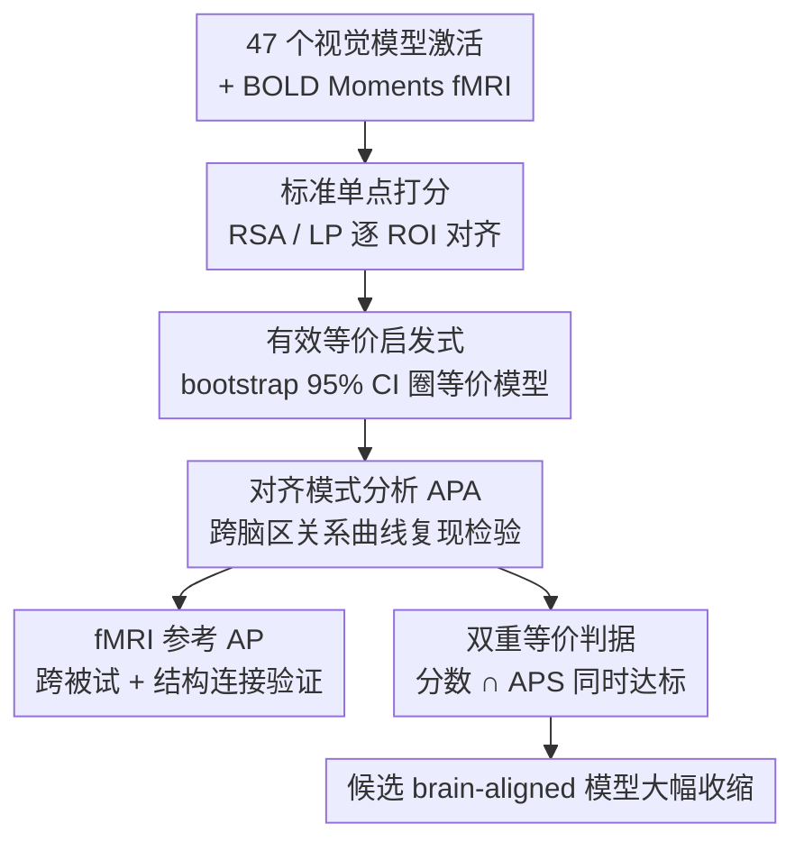

# Only Brains Align with Brains: Cross-Region Alignment Patterns Expose Limits of Normative Models

**会议**: ICLR 2026  
**OpenReview**: [https://openreview.net/forum?id=cMGJcHHI7d](https://openreview.net/forum?id=cMGJcHHI7d)  
**代码**: https://github.com/bethgelab/alignment-pattern-analysis  
**领域**: 计算神经科学 / NeuroAI / 模型-脑对齐  
**关键词**: 脑对齐基准, 视觉皮层, fMRI, 表征相似性, 判别力

## 一句话总结
作者指出现有"模型-脑对齐"基准只做单点（ROI-层）打分、判别力极低（一大堆架构迥异的视觉模型分数难分伯仲），于是提出**对齐模式分析（APA）**——把每个脑区相对所有其他脑区的对齐关系画成一条"指纹"曲线，要求模型不仅在单个 ROI 上分数高、还要复现这条跨脑区关系曲线，结果发现连排名最高的 V-JEPA 2 等模型都对不上，从而揭示出"高对齐分 ≠ 真正像脑"。

## 研究背景与动机
**领域现状**：过去十年神经科学和计算机视觉社区流行用"对齐基准"来比较人工与生物视觉系统。做法是把一堆视觉模型（ResNet、CLIP、视频 Transformer……）的中间层激活拿去和视觉皮层 fMRI 比对，用 RSA（表征相似性）或 LP（线性可预测性）等指标打分排名，再看"训练数据/目标/架构"等因素如何影响排名，借此推断哪些约束是"生物相关"的。Brain-Score、Algonauts 等都是这一范式的代表。

**现有痛点**：这些排名的可信度建立在一个隐含假设上——对齐分数的差异真的反映了"像脑程度"的差异。但最近一批工作发现：(1) 不同对齐指标给出互相矛盾的排名，说明它们各测各的；(2) 架构、训练目标、模态都差异巨大的模型，却能拿到几乎一样的对齐分，说明现有指标**判别力不足**，分不清"更像脑"和"没那么像脑"；(3) 这些推断几乎都是相关性证据，很少做因果检验。

**核心矛盾**：根子在于现有对齐是**单点（pointwise）比较**——只问"模型某层和某个 ROI 像不像"，这是一个高度欠定（underdetermined）的约束。一个模型可以是某脑区很好的**预测工具**（能线性预测出它的响应），却完全不具备该脑区背后的**计算机制**。单点分数无法把"好用的工具"和"真像脑的计算模型"区分开。

**本文目标**：给"模型算不算 brain-aligned"提供一个更严的、可量化的判据，专门用来在那些单点分数难分伯仲的模型之间做区分。

**切入角度**：作者继承 Feather 等人提出的 NeuroAI 图灵测试思想（一个模型若像脑达到"一个脑像另一个脑"的程度就算通过），但把它从"单点分数"升级为"**关系结构**"。直觉是：每个脑区相对其他所有脑区有一套稳定且特异的功能关系（比如 V1 不应该能很好地线性预测高级视觉区，因为特征沿视觉层级越来越复杂）。这套关系跨被试稳定、能当参考。

**核心 idea**：把"单个 ROI 相对全部其他 ROI 的对齐分数向量"定义为该脑区的**对齐模式（alignment pattern, AP）**，要求模型不仅在目标 ROI 上分数达标、还要**复现这条跨脑区曲线**才算真正对齐——这是一个"二阶结构一致性"检验。

## 方法详解

### 整体框架
方法围绕 BOLD Moments 视频 fMRI 数据集（10 名被试观看 1000+ 段 3 秒视频）展开，针对 Glasser HCP-MMP 图谱划分的早期视觉区（V1/V2/V3）、背侧流/MT+、腹侧流等 ROI 做分析。整条流程分三段：先用**标准基准管线**给 47 个预训练视觉模型打对齐分并验证"判别力缺失"，再用**有效等价启发式**把那些和最优模型分数无显著差异的模型圈出来，最后用 **APA** 这一关系判据把这些"看似等价"的模型重新拉开差距。核心转变在于：从"模型某层 vs 单个 ROI 的一个分数"，升级为"模型某层相对全部 ROI 的一条分数曲线 vs 脑区自身的一条参考曲线"。

### 关键设计

**1. 对齐模式 AP：把"一个分数"升级成"一条跨脑区关系曲线"**

针对单点对齐欠定、判别力不足这个痛点，作者不再用单个标量表示对齐，而是把一个预测特征空间 $\phi_p$（可以是某被试某 ROI 的脑活动，也可以是模型某层激活）对全部 $N$ 个目标脑区 $\Psi_t=[\psi_t^1,\dots,\psi_t^N]$ 的对齐分数串成一个向量：

$$\alpha(\phi_p,\Psi_t)=[M(\phi_p,\psi_t^1),\,M(\phi_p,\psi_t^2),\,\dots,\,M(\phi_p,\psi_t^N)]$$

其中 $M$ 是任意对齐度量（RSA 或 LP）。当 $\phi_p$ 取自脑活动时得到 **fMRI 派生 AP**（公式 2，跨被试对计算），取自模型某层 $\phi_m^l$ 时得到**模型派生 AP**（公式 3）。这条曲线刻画的是"某脑区/某层和整个视觉皮层的关系侧写"，比单点分数携带的结构信息多得多——两个模型可能在 V1 上分数相同，但它们对 V2、V4、MT 等区域的相对高低完全可以不一样。AP 不依赖某种特定度量，因此和挑选度量的工作（如 IACT）正交、可叠加。

**2. fMRI 参考 AP 与结构连接验证：先证明这条曲线是脑区的稳定"指纹"**

要拿 AP 当参考，前提是它本身得跨被试稳定、跨脑区可区分。作者用"留一被试"方式估计参考：对每个 ROI，用其余被试两两组合算出参考 AP，再看单个被试的 AP 和它的相关程度，称为**对齐模式相似度（APS）**——即两条 AP 之间的 Pearson 相关 $\rho(\alpha_r(\phi_p,\Psi_t),\alpha_l(\phi_m,\Psi_t))$（公式 5）。结果显示这些曲线在同一 ROI 内跨被试高度一致、跨 ROI 彼此区分。为进一步证明它不是 fMRI 噪声的产物，作者又拿一个**完全独立的模态**——1065 人弥散加权成像得到的白质结构连接矩阵 $C=(c_{r,t})$——构造结构连接派生 AP（公式 4，因自相似无定义而排除对角元），发现两者高度相似（尤其早期视觉区 V1/V2/V3/V3B/V7/IPS1 显著高于零假设）。这就把 AP 锚定到了真实的脑区解剖关系上，使其有资格作为"模型该复现的目标"。

**3. 有效等价启发式：先把"看似一样好"的模型客观圈出来**

要论证"APA 比单点更有判别力"，得先有一个客观标准说明"这些模型在单点上确实分不开"。作者对每个模型用 bootstrap——对 10 个被试索引有放回重采样 $I^*=(i_1^*,\dots,i_{10}^*)$，算出均值对齐分的自助分布，进而得到 95% 置信区间。若某模型的经验均值落在排名第一模型的 95% CI 之内，就判定它与最优模型**有效等价**。在多数 ROI 上都能找到一批这样的等价模型（V-JEPA 2、两种 backbone 的 CLIP、VGG-Transformer 等架构/数据/目标都不同却挤在一起），从量化层面坐实了"标准基准判别力缺失"。

**4. APA 双重等价判据：用关系曲线把"等价模型"重新拉开**

最后把上面的等价启发式同时作用在两个维度上：一个模型要算"真正对齐到某 ROI"，必须既在**对齐分数**上、又在 **APS**（和 fMRI 参考 AP 的相似度）上都落进最优模型的 95% CI（即图 4b 中纵向与横向阴影带的交集）。关键发现是 (i) 所有模型的 APS 都达不到脑-脑 APS 水平（即关系版图灵测试无一通过）；(ii) 单点分数最高的模型往往不是 APS 最高的——尤其 V-JEPA 家族单点排名很高、APS 却普遍很低。施加这条交集判据后，多数 ROI 的候选模型数量急剧收缩，V-JEPA 在大部分 ROI 被直接排除。这正是 APA 相对单点的"二阶结构一致性"附加值：它把单点对齐的欠定性暴露出来了。

### 损失函数 / 训练策略
本文不训练新模型，是评测/方法论工作。模型侧：对 47 个预训练模型，每个取最多 15 个 block 的最后一层激活，图像模型逐帧、视频模型/VGGT 整段 3 秒并对时间平均，再用稀疏随机投影（按 Johnson-Lindenstrauss 引理，$\epsilon=0.1$）降到 5919 维。对齐侧：RSA 用 RDM（1 − Pearson 距离）的 Pearson 相关；LP 用岭回归（RidgeCV，5 折，$\alpha$ 从 $10^{-9}$ 到 $10^{9}$ 共 19 个候选）在测试集报 $R^2$。每个"模型×ROI"组合先在训练集上跨被试平均选最优层，再在测试集报分。

## 实验关键数据

### 主实验
在 BOLD Moments 上评测 47 个 SOTA 视觉模型（Taskonomy 26 个、监督/自监督图像模型、CLIP、监督/无监督视频模型、VGGT）对人类视觉皮层的对齐：

| 设置 | 现象 | 含义 |
|------|------|------|
| RSA / LP 单点排名 | V-JEPA 2 家族总体最高，CLIP-RN50/ViT、VGG-Transformer 紧随其后 | 架构/数据/目标迥异的模型却挤在最前列 |
| 有效等价（95% CI） | 多数 ROI 都能找到一批与最优模型等价的模型 | 标准基准**判别力缺失** |
| 对照 NeuroAI 图灵测试参考 | 最优模型在 LP 上达到甚至超过脑-脑对齐 | LP 在几乎所有 ROI 上**已饱和**（故主分析转用 RSA） |

### 消融 / 关系分析

| 分析 | 关键指标 | 说明 |
|------|---------|------|
| fMRI AP 跨被试一致性 | APS 同 ROI 高、跨 ROI 可分 | AP 是脑区稳定"指纹" |
| AP vs 结构连接 | V1/V2/V3/V3B/V7/IPS1 显著高于 null（FDR 校正） | AP 锚定到独立解剖证据 |
| 单点等价模型的 AP | 等价模型的 AP 明显发散 | 关系判据能把它们拉开 |
| 加 APS 双重判据 | 候选模型数大幅收缩，V-JEPA 多被排除 | APA 的二阶附加判别力 |

### 关键发现
- **单点高分 ≠ APS 高**：单点最像脑的模型常常不是关系上最像脑的，V-JEPA 是最典型的反例——它擅长预测但跨脑区关系侧写对不上。
- **所有模型都没通过关系版图灵测试**：没有任何模型的 APS 达到脑-脑 APS 水平，说明当前模型离"真正的计算机制相似"还有距离。
- **归一化参考的选择很关键**：本文按 Feather 等人用"被试间一致性下界"归一，虽提升判别力（尤其 LP），但作者自己质疑：在大量方差未被解释的低对齐区，多检测出的差异是否真有意义，或许"聚合参考脑的上界"是更合理的目标。

## 亮点与洞察
- **从"单点"到"关系"的范式升级**：核心洞察是脑区的身份藏在它与其他脑区的关系结构里，而非单个分数。把对齐升级成"一条曲线 vs 一条参考曲线"，一下子暴露了单点对齐的欠定性，且这个思路与具体度量无关、可直接套在任意基准上。
- **用独立模态交叉验证概念**：拿 1065 人弥散成像的结构连接来佐证 fMRI AP，把一个纯功能性的统计量锚定到解剖证据上，大大增强了"AP 是真指纹而非噪声"的可信度。
- **把"工具 vs 模型"讲清楚了**："V1 的好模型不该能线性预测高级视觉区"这个直觉，被 APA 操作化成可量化判据——可借鉴到任何"预测能力强但机制是否相似存疑"的评测场景（如脑机接口、其他模态的表征对齐）。
- **连到反协变（contravariance）原理**：APA 被解读为在任务难度之外、独立地施加额外约束来收缩可行解空间，呼应了"约束越多越逼近脑式实现"的理论视角。

## 局限与展望
- 数据只来自单个 BOLD Moments 视频 fMRI 数据集与一套 ROI 划分，结论能否推广到其他数据集/图谱/刺激范式未验证。
- 归一化参考的选择本身存疑（下界 vs 上界），作者承认在低对齐区多检测出的差异未必有科学意义——APA 的判别力部分依赖这个未定的归一选择。
- APA 是相关性结构判据，仍非因果检验；通过 APA 也只是"必要条件"加强版，不直接等于机制相似。作者明确呼吁结合严格因果实验。
- 没有提出"如何训练出能复现 AP 的模型"，只提供了诊断工具；下一步自然是把 APS 当训练/选择目标。

## 相关工作与启发
- **vs NeuroAI 图灵测试 (Feather et al., 2025)**：图灵测试比的是模型-脑 vs 脑-脑的**单点分数**；APA 把它扩展成比**关系模式（AP）**，是其"关系版"延伸。
- **vs Brain Hierarchy Score (Nonaka et al., 2021)**：后者评估整个模型 vs 整条视觉流的层级对应；APA 聚焦单个模型层 vs 单个 ROI 的跨脑区对齐侧写，粒度更细且互补。
- **vs IACT (Thobani et al., 2025)**：IACT 用于挑选/评估合适的对齐度量本身；APA 与度量无关、可用任意度量执行，二者正交可叠加。
- **vs Conwell et al. (2024) / 聚合多度量 (Wu et al., 2025)**：他们指出 LP/RSA 太灵活、判别力差并尝试更严或聚合度量；本文给出的是"二阶结构一致性"这一新维度的判别力，而非换一个更严的单点度量。

## 评分
- 新颖性: ⭐⭐⭐⭐⭐ 把脑对齐从单点升级为跨脑区关系模式，概念上干净且可量化，是真正的新判据。
- 实验充分度: ⭐⭐⭐⭐ 47 模型 + RSA/LP + 结构连接交叉验证扎实，但限于单一数据集与 ROI 划分。
- 写作质量: ⭐⭐⭐⭐⭐ 动机层层推进、概念区分（工具 vs 模型）讲得透彻，公式与图配合清楚。
- 价值: ⭐⭐⭐⭐⭐ 直指 NeuroAI 基准的方法论软肋，对整个模型-脑对齐社区有校正作用。

<!-- RELATED:START -->

## 相关论文

- [\[ICLR 2026\] Pretraining with Re-parametrized Self-Attention: Unlocking Generalization in SNN-Based Neural Decoding Across Time, Brains, and Tasks](pretraining_with_re-parametrized_self-attention_unlocking_generalizationin_snn-b.md)
- [\[ICLR 2026\] Diffusion Alignment as Variational Expectation-Maximization](diffusion_alignment_as_variational_expectation-maximization.md)
- [\[ACL 2025\] Align-Pro: Align Protein Representations Through Multi-Modal Learning](../../ACL2025/computational_biology/align-pro_align_protein_representations_through_multi-modal_learning.md)
- [\[ICLR 2026\] Fast and Interpretable Protein Substructure Alignment via Optimal Transport](fast_and_interpretable_protein_substructure_alignment_via_optimal_transport.md)
- [\[ICLR 2026\] Quantifying Cross-Attention Interaction in Transformers for Interpreting TCR-pMHC Binding](quantifying_cross-attention_interaction_in_transformers_for_interpreting_tcr-pmh.md)

<!-- RELATED:END -->
