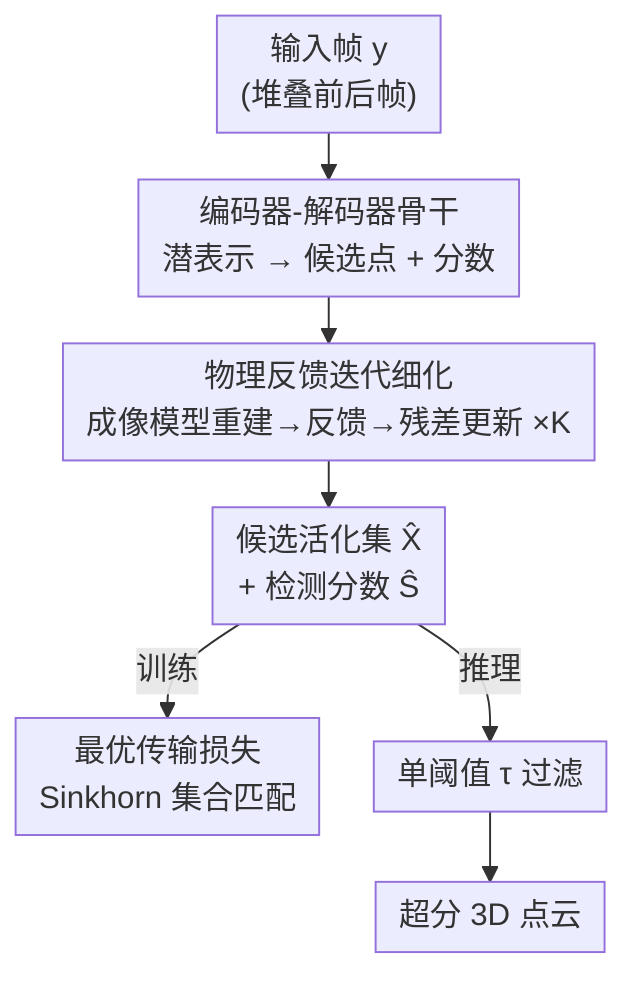

# Optimal Transport Unlocks End-to-End Learning for Single-Molecule Localization

**会议**: ICLR 2026  
**OpenReview**: [https://openreview.net/forum?id=V1i58pZmp3](https://openreview.net/forum?id=V1i58pZmp3)  
**代码**: https://github.com/RSLLES/SHOT  
**领域**: 计算生物 / 超分辨显微 / 最优传输  
**关键词**: 单分子定位显微、最优传输、集合匹配、迭代细化、端到端学习

## 一句话总结
针对单分子定位显微（SMLM）高密度场景下深度学习方法依赖不可微 NMS 的痛点，本文把训练目标重写成「预测活化点集合 vs 真值集合」的集合匹配问题，用熵正则最优传输（Sinkhorn）构造可微损失彻底替掉 NMS，并配上一个把显微镜成像物理当作反馈的迭代细化网络，在合成基准与真实生物数据的中高密度区均刷新了 SOTA。

## 研究背景与动机

**领域现状**：荧光显微受光学衍射极限限制，分辨率约只能到光波长一半（≈200 nm）。SMLM 利用荧光分子随机闪烁、每帧只让稀疏子集发光的特性，逐帧检测并以亚像素精度定位单个荧光分子，把成千上万帧的定位结果累积成一个超分辨 3D 点云，从而突破衍射极限。

**现有痛点**：SMLM 要求同一衍射极限区域内同时只有一个发光点，因此密度必须压得很低，重建一个完整结构动辄要上千帧，采集慢、无法做活细胞动态成像。提高密度后多个荧光点会重叠，带来数量歧义与分辨率下降。深度学习方法（DECODE、LiteLoc）能处理更高密度，但它们都预测一张逐像素检测图，推理时靠一个 NMS 变体二值化：用两个阈值，一个压掉杂散局部极大值、一个避免把邻近发光点融合。

**核心矛盾**：作者点出这套框架有三个根本问题。其一，逐像素损失无法表达「一个像素里有多个发光点」。其二，NMS 那两个目标（抑制虚假峰 vs 不融合邻近点）本质冲突，密度越高、亚像素距离上同时发光的概率越大，冲突越严重。其三，两个手工阈值让 precision-recall 权衡很难调。更关键的是，NMS 不可微，模型根本无法为它端到端优化。

**本文目标**：去掉 NMS，让检测决策可微、可端到端训练，同时在高密度下保持精度。

**切入角度**：作者观察到 SMLM 的监督学习本质是「把预测的点集合和真值点集合做一对一匹配」——这正是目标检测里 DETR 一系用二分匹配解决的问题。把「物体」换成「荧光分子」，最优传输理论就是天然契合的工具。

**核心 idea**：用熵正则最优传输损失代替逐像素损失 + NMS，把训练写成可微的集合匹配；推理时只用单个阈值过滤候选点；再用一个嵌入了显微镜成像物理的迭代细化网络作为骨干。

## 方法详解

### 整体框架
网络 $f_\theta$ 接收一帧观测图像 $y$（实际堆叠前后帧成 $3\times H\times W$ 提供上下文），输出固定数量 $d=HW/4$ 个候选活化点 $\hat{X}=\{\hat{x}_i\}$ 及各自的检测分数 $\hat{S}=\{\hat{s}_i\in(0,1)\}$，每个活化点是 4 维向量 $x=(x,y,z,n)$（横纵坐标、轴向深度、光子数）。骨干是一个编码器-解码器，但中间套了 $K$ 步迭代细化：每一步用当前候选集经「已知的成像物理模型」重建出一张期望帧 $\hat{y}$，再把 $\hat{y}$ 编码后与原始帧编码一起喂给细化模块 $R$，残差式更新潜表示，从而逐步纠错。训练时拿最后一步的输出 $(\hat{X}^{(K)},\hat{S}^{(K)})$ 与真值集合 $X$ 算最优传输损失；推理时则只保留检测分数超过单一阈值 $\tau$ 的候选点，直接渲染成超分点云。整条管线没有任何手工的不可微层。

### 关键设计

**1. 物理反馈迭代细化：把显微镜成像模型当作可纠错的视觉反馈**

直接一次前向回归出整帧的所有发光点，模型缺少「我猜的这组点到底能不能解释观测」的校验信号。作者借鉴光流估计里迭代细化网络的成功经验：SMLM 的成像物理是清楚已知的（PSF 卷积 + 噪声模型），可以拿一个准确的成像模拟器给网络提供视觉反馈。具体地，编码器 $E$ 把输入帧映射到潜表示 $z^{(0)}$，解码器 $D$ 解出候选集 $(\hat{X},\hat{S})$；每一步先用成像模型 $P(\cdot)$ 把当前候选集重建成期望帧 $\hat{y}^{(k)}=E[P(\hat{X}^{(k)},\hat{S}^{(k)})]$，再编码得 $\hat{z}^{(k)}$，然后细化算子做残差更新 $z^{(k+1)}=z^{(k)}+R(z^{(k)},\hat{z}^{(k)},z^{(0)})$，重新解码出更准的候选。$\hat{y}$ 相当于「模型当前认为自己解释了画面里的什么」，与原始帧 $y$ 比对就能定位错误并逐轮修正。注意成像模型本身不学习，只把物理先验注入网络。实验中性能在三轮后饱和，故取 $K=2$。

**2. 最优传输损失：用 Sinkhorn 把集合匹配做成可微目标，替掉 NMS 与逐像素损失**

要让训练对得上「预测点集 vs 真值点集」，理想做法是在两个集合间做一对一二分匹配，再聚合每对的代价。作者先构造一个 $d\times d$ 的总代价矩阵 $C=L+D$：定位项 $L_{i,j}=(\hat{x}_i-x_j)^T\Sigma^{-1}(\hat{x}_i-x_j)+\log\det(\Sigma)$（$j\le N$ 时，对应真值；否则为 0），其中 $\Sigma=\mathrm{diag}(\sigma_x^2,\sigma_y^2,\sigma_z^2,\sigma_n^2)$ 是可端到端学习的对角权重——这等价于多元正态负对数似然，自动平衡各维度的预测难度（类似同方差不确定性加权），训练后测得 $\sigma_z^2$ 约是 $\sigma_x^2,\sigma_y^2$ 的两倍，与共聚焦显微的光学理论一致；检测项 $D_{i,j}=-\log(s_i)$（配到真值时）或 $-\log(1-s_i)$（配到「不存在」时），用二元交叉熵鼓励匹配上真值的候选有高分、其余有低分。理想损失是关于 $C$ 的最优传输代价

$$\min_{\Gamma\in B}\ \langle\Gamma\,|\,C\rangle_F,\qquad B=\{\Gamma\in\mathbb{R}_+^{d\times d}\mid \Gamma\mathbf{1}_d=\Gamma^\top\mathbf{1}_d=\mathbf{1}_d\}.$$

这本质就是预测与真值之间的二分匹配。但匈牙利算法虽能 $O(d^3)$ 精确求解，其步骤不可微、阻断端到端学习。作者改用熵正则最优传输：$\Gamma^*=\arg\min_\Gamma \langle\Gamma|C\rangle_F-\epsilon H(\Gamma)$（$H$ 为香农熵，$\epsilon$ 为正则系数），损失即 $L=\langle\Gamma^*|C\rangle_F$。该 $\Gamma^*$ 可由几步 Sinkhorn 迭代高效近似，且每步对 $C$ 可微，从而嵌入深度学习框架。这一步同时解决了三个痛点：训练目标里没有逐像素分配（解决问题 1），决策不再依赖 NMS 这类空间邻近度策略（解决问题 2）。

**3. 单阈值推理过滤：让一个标量直接掌控 precision-recall 权衡**

去掉 NMS 后，推理只剩一件极简的事：保留 $\hat{X}^{(K)}$ 中检测分数 $\hat{s}_i$ 超过用户阈值 $\tau\in[0,1]$ 的候选点，$\tau=0$ 全保留、$\tau=1$ 全丢弃。这把 precision-recall 权衡变成单个可解释的旋钮（解决问题 3），远比 DECODE/LiteLoc 那套双阈值 NMS 好调，也更容易适配长时记录中动态变化的拍摄条件。默认 $\tau$ 由在独立合成集上最大化 E3D 指标选出，对应 EPFL 挑战赛同款的检测-定位权衡。

### 损失函数 / 训练策略
训练目标即上述最优传输损失，用最后一轮迭代的 $(\hat{X}^{(K)},\hat{S}^{(K)})$ 计算。合成数据每帧均匀采样 10–30 个活化点、各维坐标独立均匀分布，确保网络学不到任何特定先验。编码器与细化模块均为两层 U-Net（SiLU + LayerNorm，48 通道内宽，潜空间 $C=96$）；解码器用轻量 CNN（比 DETR 式 ViT 效果更好），整网约 300 万参数。还对相机参数随机乘 $e^\rho,\rho\sim\mathcal{N}(0,0.03)$ 做数据增强以提升鲁棒性。AdamW 训 10 万步、batch 128、单张 H100 约 20 小时。

## 实验关键数据

### 主实验（EPFL 2016 合成基准，密度单位 activations/µm/frame）
作者在 4 个密度（0.2 / 2.0 / 8.0 等）× 高低 SNR 下与 3D-DAOSTORM、DECODE、LiteLoc 对比。整体结论：本文 recall 略低，但 precision 极高、几乎在所有空间维度上取得最低 RMSE，且在所有密度与 SNR 下 E3D 全面领先，是最「均衡」的方法。

| 密度 / SNR | 方法 | Jaccard ↑ | RMSElat ↓ | RMSEax ↓ | E3D ↑ |
|--------|------|------|------|------|------|
| 2.0 / High | DECODE | 0.876 | 32.2 | 33.0 | 0.706 |
| 2.0 / High | LiteLoc | 0.858 | 30.7 | 36.0 | 0.699 |
| 2.0 / High | **Ours** | **0.883** | **24.8** | **28.4** | **0.750** |
| 8.0 / Low | LiteLoc | 0.338 | 76.1 | 110.1 | 0.055 |
| 8.0 / Low | **Ours** | **0.374** | **74.3** | **99.4** | **0.103** |

其中 3D 综合指标 E3D 定义为 $E_{3D}=(E_{ax}+E_{lat})/2$，每个分量形如 $E=1-\sqrt{(1-\text{Jaccard})^2+\alpha^2\text{RMSE}^2}$（$\alpha_{lat}=1.0$、$\alpha_{ax}=0.5\,\text{nm}^{-1}$，沿用 EPFL 定义），同时综合检测与定位质量。

### 真实数据（FRC 越低越好 / RSP 越高越好）
对 Tubulin、NPC-Nup107、NPC-Nup96 三个公开数据集做时间分箱模拟高密度。原始密度下与 LiteLoc 互有胜负，但分箱加密后本文稳定领先。

| 数据集 | 分箱 | 方法 | FRC (nm) ↓ | RSP ↑ |
|--------|------|------|------|------|
| NPC-Nup96 | ×32 | LiteLoc | 71.5 | 0.671 |
| NPC-Nup96 | ×32 | **Ours** | **44.2** | **0.689** |
| NPC-Nup107 | ×16 | LiteLoc | 25.9 | 0.682 |
| NPC-Nup107 | ×16 | **Ours** | **22.1** | **0.684** |

### 消融实验（EPFL 合成、高 SNR、密度 2.0）

| 迭代架构 | OT 损失 | Jaccard ↑ | RMSEvol ↓ | E3D ↑ |
|------|------|------|------|------|
| ✗ | ✗ | 0.876 | 47.9 | 0.705 |
| ✗ | ✓ | 0.867 | 39.6 | 0.740 |
| ✓ | ✗ | 0.854 | 45.4 | 0.703 |
| ✓ | ✓ | **0.883** | **39.2** | **0.750** |

### 关键发现
- **OT 损失是主要功臣**：单加 OT 损失就把 E3D 从 0.705 提到 0.740、RMSEvol 从 47.9 降到 39.2 附近；迭代架构单独加（0.703）几乎无提升，只有与 OT 损失叠加才再小幅推到 0.750。
- 因此资源受限部署可只保留 OT 损失这个轻量变体，省掉迭代架构的额外显存与算力开销。
- 密度越高、本文相对优势越明显——这正契合「替掉冲突的 NMS 双目标」在高密度下的收益。

## 亮点与洞察
- **把 SMLM 显式重述成集合匹配**，从而直接接上 DETR / 最优传输那条成熟的二分匹配技术线，是个干净漂亮的问题重构——一旦换了视角，去 NMS、端到端、单阈值这些好处就自然顺出来了。
- **用已知物理当反馈而非当后处理**：成像模型不参与学习，只在迭代中重建期望帧供网络比对纠错，把领域先验注入网络又不破坏可微性，思路可迁移到任何「正向过程已知、要解逆问题」的科学成像任务。
- **可学习的 $\Sigma$ 自动平衡各维难度**，训练后 $\sigma_z^2\approx2\sigma_{x,y}^2$ 居然和光学理论吻合，是个意外但可信的自洽证据。
- 单阈值 $\tau$ 直控 precision-recall，对长时记录里条件漂移的实验场景特别友好。

## 局限与展望
- **训练与推理更慢**：迭代设计带来更高计算开销（虽推理仍 ∼200 fps、训练是一次性成本）。
- **依赖精确 PSF 标定**：与多数顶尖方法一样，需要用荧光小珠预标定 PSF，作者将其列为系统性局限。
- recall 系统性偏低（换来高 precision），在某些更看重召回的任务上未必最优。
- 真实数据评测用时间分箱「模拟」高密度，是高密度的不完美代理（分箱会通过噪声平均抬高 SNR），并非真·高密度采集。
- 展望：对 PSF 变化鲁棒的方法、无需标定的盲超分、把 PSF 优化纳入显微设计与推理自适应。

## 相关工作与启发
- **vs DECODE / LiteLoc**：它们用逐像素检测图 + 高斯混合定位损失，推理靠双阈值 NMS 变体；本文换成 OT 集合匹配损失 + 单阈值过滤，去掉了不可微层，高密度下 E3D 与 RMSE 更优，代价是 recall 略低、计算更重。
- **vs DeepLoco**：同样用集合形式，但其损失基于最大均值差异（MMD）；本文改用最优传输代价，并显式引入检测分数与可学习权重。
- **vs DETR 系目标检测**：共享二分匹配 / 熵正则可微管线的思想，本文把「物体」替换为「荧光分子」，把这条线迁移进超分辨显微。
- **vs 光流迭代细化（如 Hur & Roth）**：同样用反馈回环逐步细化，但本文的反馈来自显微成像物理模拟器而非通用重投影。

## 评分
- 新颖性: ⭐⭐⭐⭐⭐ 把 SMLM 重述为最优传输集合匹配、彻底去 NMS，是该领域少见的干净重构。
- 实验充分度: ⭐⭐⭐⭐ 合成多密度/SNR + 三个真实数据集 + 清晰消融，但真实高密度靠分箱模拟略显代理化。
- 写作质量: ⭐⭐⭐⭐ 动机三问题—三解法对应工整，方法与公式交代清楚。
- 价值: ⭐⭐⭐⭐ 提升高密度 SMLM 精度直接利好活细胞动态超分成像，代码开源。

<!-- RELATED:START -->

## 相关论文

- [\[ICLR 2026\] KGOT: Unified Knowledge Graph and Optimal Transport Pseudo-Labeling for Molecule-Protein Interaction Prediction](kgot_unified_knowledge_graph_and_optimal_transport_pseudo-labeling_for_molecule-.md)
- [\[ICLR 2026\] Fast and Interpretable Protein Substructure Alignment via Optimal Transport](fast_and_interpretable_protein_substructure_alignment_via_optimal_transport.md)
- [\[ICCV 2025\] MolParser: End-to-end Visual Recognition of Molecule Structures in the Wild](../../ICCV2025/computational_biology/molparser_end-to-end_visual_recognition_of_molecule_structures_in_the_wild.md)
- [\[ICLR 2026\] WFR-FM: Simulation-Free Dynamic Unbalanced Optimal Transport](wfr-fm_simulation-free_dynamic_unbalanced_optimal_transport.md)
- [\[ICML 2025\] Protriever: End-to-End Differentiable Protein Homology Search for Fitness Prediction](../../ICML2025/computational_biology/protriever_end-to-end_differentiable_protein_homology_search_for_fitness_predict.md)

<!-- RELATED:END -->
