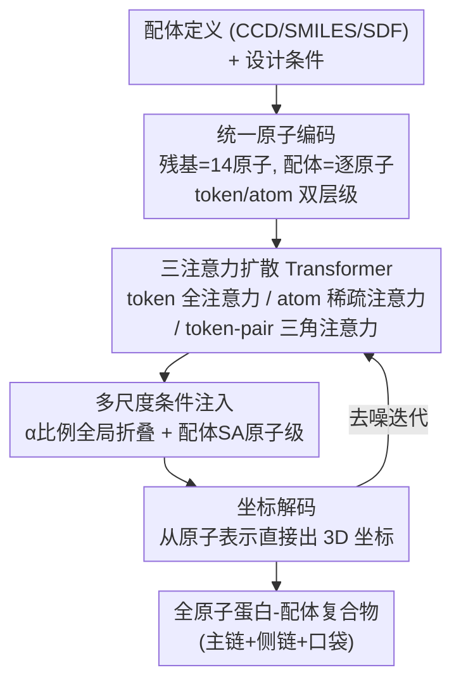

# Pallatom-Ligand: an All-Atom Diffusion Model for Designing Ligand-Binding Proteins

**会议**: ICLR 2026  
**OpenReview**: [https://openreview.net/forum?id=uMD75SDTTA](https://openreview.net/forum?id=uMD75SDTTA)  
**代码**: https://github.com/levinthal/Pallatom-Ligand  
**领域**: 计算生物 / 蛋白质设计 / 扩散模型  
**关键词**: 配体结合蛋白、全原子扩散、蛋白质从头设计、条件生成、AlphaFold3 评测

## 一句话总结
Pallatom-Ligand 用一个全原子扩散 transformer 直接学习「蛋白质 + 小分子配体」复合物里所有原子的联合分布，端到端地同时生成蛋白主链、侧链和配体口袋，并支持对蛋白整体折叠（α/β 比例）和配体溶剂可及性的可编程控制，在八个配体的综合 benchmark 上取得了最高的 in silico 成功率。

## 研究背景与动机

**领域现状**：让蛋白质对某个指定的小分子配体具有高亲和力和高选择性，是做生物传感器、诊断试剂和蛋白质药物的关键能力。传统做法靠实验室定向进化（随机突变 + 多轮筛选），或者靠 Rosetta 这类基于物理能量的计算设计，都需要专家级的生化直觉且效率低。近年深度学习（RFdiffusionAA、CA RFdiffusion、RFdiffusion2）把蛋白主链和配体当成 SE(3) 刚体框架来生成，已经设计出了能工作的酶。

**现有痛点**：这三个 SOTA 模型都是「只生成主链」的生成器——扩散过程根本不涉及蛋白侧链，配体也只被当成一个刚性框架，没有显式建模蛋白-配体界面上原子级别的精细相互作用（氢键、静电、空间互补）。结果是它们必须依赖用户提供的约束（motif、配体朝向、相对溶剂可及性）来摆好空间构型，序列还得再交给一个独立的逆折叠模型（如 LigandMPNN）去补。这种对「专家手工先验」的依赖既带来 case-by-case 的偏置，也限制了通用性，实验成功率明显低于无配体的纯蛋白设计。

**核心矛盾**：主链生成与界面原子细节之间缺少信息交换。配体侧链和蛋白侧链的原子细节本来应该反过来去精修主链的生成，但「只建主链」的范式从架构上就切断了这条多层级信息流。

**本文目标**：做一个真正端到端的全原子模型，直接学习复合物中全部原子的联合分布，让原子级界面交互和 token 级主链生成能互相反馈。

**切入角度**：作者的假设有两个观察支撑——其一，原子是所有分子的统一基本单元，AlphaFold3 已经证明了「直接建模单个原子」在生物大分子结构预测上的威力；其二，统一架构 + 端到端训练能在数据稀缺（高质量蛋白-配体复合物结构本就很少）的条件下提升建模精度和数据效率。

**核心 idea**：把小分子直接用其原子表示，把每个氨基酸残基当成一个 14 原子的「通用分子」，用一个配体感知的全原子扩散 transformer 在 token 级和 atom 级双层级上做全局信息交换，一步到位地联合生成结构与序列。

## 方法详解

### 整体框架

Pallatom-Ligand 接收两类输入：一是小分子配体的化学定义（CCD code / SMILES / SDF 三选一），二是设计条件（蛋白 α/β 比例 + 配体溶剂可及性）。它把整个复合物编码成一个「token-原子」双层级表示，喂进一个由三个注意力模块组成的扩散 transformer，反复去噪，最终直接从原子表示解码出每个原子的 3D 坐标，得到一个全原子的蛋白-配体复合物。

关键在于它用了**两套互补的表示**：原子级表示学习每个原子独有的精细异质性（配体原子和蛋白原子地位平等），token 级表示则把蛋白每 14 个原子聚合成 1 个 token、而每个配体原子单独保留为一个 token（刻意放大蛋白-配体界面的原子交互），用来学习对配体构象变化敏感的粗粒度结构特征。三个注意力模块就在这两个层级之间来回搬运信息：token 级全注意力管整体折叠，atom 级稀疏注意力管局部界面，二者通过 token↔atom 的转换互相精修。

### 关键设计

**1. 统一原子表示：把残基也当成 14 原子的通用分子**

针对「主链-only 模型无法表达配体和侧链原子细节」这个根本痛点，本文放弃了「蛋白用残基框架、配体用刚体」的混合表示，改成纯原子的统一编码。小分子配体的 $l$ 个原子直接在原子层级编码其化学复杂度和连接性；每个氨基酸残基则按 Pallatom 的 atom14 方案建模成一个含 14 个原子的通用化学实体。于是一个含 $L$ 残基蛋白 + $l$ 原子配体的复合物就被统一编码成一个含 $14L + l$ 个原子的化学系统，原子特征用元素序号、部分电荷等初始化。在这套表示里，配体和蛋白被当成完全平等的实体，模型因此能直接学习界面上的原子级互补，而不必像旧方法那样靠用户喂约束来「摆位置」。token 层级上，蛋白每 14 原子聚成 1 token、配体每原子独占 1 token，刻意把注意力压在蛋白-配体界面上。

**2. 三注意力扩散 Transformer：token 与 atom 双层级的信息互换**

要让原子级界面交互去反哺 token 级主链生成，光有统一表示还不够，还得有让两个层级对话的架构。本文在 Pallatom 基础上按 DiT 设计哲学重构，用三个核心注意力模块串成一个 transformer block：**token-level 全注意力**更新 token 单体表示 $a$ 与二级结构条件，用 token pair 特征 $z$ 作注意力 bias、时间嵌入 $t$ 控制的 AdaLN 做归一化，随后通过 token→atom 索引把信息灌进原子表示 $q$（$q = q + \text{Layernorm}(a_{tok\to atom})$）；**atom-level 块稀疏注意力**直接在原子表示 $q$ 上操作，用 atom pair 特征 $p$ 作 bias、配体 SA 嵌入和时间嵌入作条件，再通过 SegmentMean 把原子特征聚回 token 级（$a = a + \text{Layernorm}(\text{SegmentMean}(q))$）；**token-pair 三角注意力**则把 token 中心原子之间的距离信息（经 RBF 编码 $z_{rbf} = \text{Linear}(\text{dist}(r_{center}))$）注入 pair 表示。最后网络直接从更新后的原子表示 $q$ 解码出每个原子的 3D 坐标 $r$。正是这条「token→atom→token」的双向回路，让全局折叠和局部界面能互相精修——消融显示三路缺一不可。

**3. 多尺度条件控制：α 比例管全局折叠，配体 SA 管原子级可及性**

旧的生成模型常常偏好生成全 α 螺旋结构，折叠多样性不足；而真实蛋白的功能恰恰依赖丰富的 α/β 组成。借助模块化架构，本文在两个尺度上注入条件。全局上引入 **α ratio**——定义为 α 螺旋残基数除以（α 螺旋 + β 折叠）残基总数，取值 0–1，离散成「主要 β（0–0.2）/ α/β 混合（0.2–0.8）/ 主要 α（0.8–1）」三类，通过 token 级的拼接自注意力注入扩散过程，从而可控地探索折叠空间。原子级上引入**配体溶剂可及性（SA）**——用相对溶剂可及性 RSA 把每个配体原子离散成「完全埋藏（0–0.1）/ 部分埋藏（0.1–1.0）/ 完全暴露（1.0）」三档，作为可学习嵌入直接拼到配体原子表示上，从而在原子分辨率上控制哪些配体原子该埋进口袋、哪些该暴露在外——这对生物传感器、药物这类下游应用至关重要。

**4. 双目标采样训练：用 1:1 配比同时学折叠和学界面**

高质量蛋白-配体结构数据不仅少，分布还极度不均衡：有些配体只跟特定折叠共现，有些折叠却能结合各种配体。常规采样会放大这个问题——只按蛋白结构聚类会让配体频率失衡、罕见配体性能差；只按配体-蛋白界面聚类又会导致模型坍缩、生成的蛋白结构趋同。本文用**双目标训练**化解这个两难：模式（i）学折叠，从结构聚类里采样并做序列/空间裁剪以保留整体结构上下文；模式（ii）学相互作用，从配体聚类里采样并只裁剪配体周围局部区域，让模型专注原子交互而不受整体折叠干扰。两种模式按 **1:1** 配比混合，保证每种配体被等量采样、又不过采样特定折叠。条件采样上还做了分层 dropout：α 条件以 $p=0.5$ 提供；配体 SA 则两级——$p=0.5$ 全丢、$p=0.25$ 全部配体原子给标签、$p=0.25$ 给随机子集（每个原子独立以 $p=0.5$ 纳入），以保证多尺度条件能自由组合。

### 损失函数 / 训练策略

模型是扩散框架，训练即在加噪的全原子坐标上做去噪。核心训练设计已在上面第 4 点讲清：双目标数据采样（折叠 vs 界面，1:1 配比）+ 分层条件 dropout。前者解决数据稀疏与分布失衡，让模型能泛化到罕见配体；后者让 α 比例与配体 SA 两类条件可以任意组合或缺省，实现可控但不强制的条件生成。

## 实验关键数据

### 主实验

在八个化学性质各异（涵盖更小尺寸、相反电荷、疏水基团）的小分子上 benchmark，每个靶标每方法生成 100 个结构，用 LigandMPNN 设计序列后再用 AlphaFold3 系列指标评测。作者定义了三档递进的成功标准：Protein-Fold Success（Cα-RMSD < 2 Å 且 protein-pLDDT > 80）、Ligand-Pocket Success（再加 ligand-Dcenter < 4 Å 且 ligand-pLDDT > 80）、Ligand-Pose Success（再加 ligand-RMSD < 2 Å）。

| 方法 | Cα-RMSD (↓) | protein-pLDDT (↑) | ligand-RMSD (↓) | ligand-pLDDT (↑) | ipAE (↓) |
|------|------|------|------|------|------|
| RFdiffusionAA (mpnn1) | 4.72 | 81.52 | 10.44 | 63.06 | 7.67 |
| RFdiffusion2 (mpnn1) | 3.94 | 87.02 | 7.12 | 70.35 | 7.98 |
| Ours w/out SA (mpnn1) | 1.39 | 91.55 | 10.78 | 73.40 | **4.07** |
| Ours w/ SA (mpnn1) | **1.36** | 90.41 | **7.04** | 72.78 | 4.35 |

Pallatom-Ligand 在主链质量（Cα-RMSD、protein-pLDDT）和界面质量（ligand-pLDDT 最高、ipAE 最低）上几乎全面领先，验证了联合全原子建模的优势。

### 条件生成与折叠控制

| 配置 | Fold 成功率 | Pocket 成功率 | Pose 成功率 | α% / β% |
|------|------|------|------|------|
| w/out cond. | 71.5% | 4.4% | 1.0% | 79.4 / 3.5 |
| α ∈ [0~0.2] | 56.2% | 2.8% | 0.8% | 9.4 / 57.2 |
| α ∈ [0.2~0.8] | 60.8% | 6.3% | 0.9% | 61.7 / 19.4 |
| α ∈ [0.8~1.0] | 66.8% | 11.0% | 1.5% | 82.4 / 0.5 |
| RFdiffusion2 (mpnn1) | 58.5% | 17.5% | 3.5% | 64.5 / 14.6 |

无条件时模型偏向全 α（α% 高达 79.4）；给定 α 条件后能精确跟随（β 设定下 β% 升到 57.2），证明全局折叠可控。α ∈ [0.2~0.8] 覆盖最广，多样性（0.26）和新颖性（0.85）最高。

### 关键发现

- **三注意力缺一不可**：消融（Appendix A.16.1）逐个移除注意力模块，证明三路设计对生成能力都有贡献——这正是全原子双层级信息交换的来源。
- **稳定性-功能 trade-off 被复现**：显式条件把所有配体原子埋藏时，折叠成功率下降但 pocket/pose 成功率略升。这种「蛋白稳定性 ↔ 功能」的反向关系是蛋白科学公认原理，模型从数据中自发学到了它。
- **泛化更均衡**：Pallatom-Ligand + LigandMPNN 对全部八个靶标都成功生成 in silico binder，而 RFdiffusion2 在 FAD、SAM 上失败，RFdiffusionAA 八个里只成功三个。
- **配体 SA 控制有效**：对 FMN/DOG/LDP 按预定义 per-atom SA 标签生成的 40 个蛋白，其 SASA 分布与设计目标高度吻合，说明原子级可及性控制确实落地。

## 亮点与洞察

- **「残基 = 14 原子通用分子」的统一表示**：把蛋白和配体放进同一个原子坐标系，既统一了化学空间表达，又让端到端联合生成结构与序列成为可能——这是绕开「主链 + 独立逆折叠」两段式范式的关键一步。
- **双层级双向回路**：token↔atom 的来回转换让全局折叠和局部界面互相精修，是对「主链-only 切断信息流」痛点最直接的架构级回应，思路可迁移到任何「整体几何 + 局部细节」需要协同的生成任务。
- **数据驱动复现物理规律**：模型自发学到「稳定性-功能 trade-off」，说明全原子联合建模确实抓到了真实蛋白的物理本质，而非拟合表面统计。
- **组件级评测指标**：把笼统的 AlphaFold3 置信度拆成 scaffold / pose / interface 三块，能精准定位方法的强弱项，为后续改进指方向——这套评测协议本身就是可复用的贡献。

## 局限与展望

- **仅限蛋白-小分子体系**：作者承认目前不支持核酸复合物、共价配体结合、非天然氨基酸蛋白，未来要拓宽到这些生物大分子组装。
- **数据规模仍是瓶颈**：高质量蛋白-配体结构稀缺，计划用更大的蒸馏数据集进一步提升性能上限。
- **只验证了 in silico**：所有成功率都是「与 AlphaFold3 预测的结构一致性」，作者明确强调这只是有效设计的必要条件，并不保证生物活性——还缺湿实验验证。
- **pose 成功率绝对值偏低**：即便领先，最严格的 ligand-pose 成功率也多在 1% 量级，说明精确摆好配体位姿仍是开放难题，作者指出后续重点是精修原子级配体-蛋白交互的学习。

## 相关工作与启发

- **vs RFdiffusionAA / CA RFdiffusion / RFdiffusion2**：它们把主链和配体建成 SE(3) 框架、只生成主链、靠独立逆折叠补序列、靠用户约束摆位置；本文是全原子端到端联合生成结构与序列，显式建模界面原子交互，减少对专家先验的依赖，benchmark 上界面质量（ipAE、ligand-pLDDT）和泛化性都更优。
- **vs Pallatom**：本文以 Pallatom 的 atom14 表示和网络为底座，但按 DiT 哲学把原 traversing 机制换成现代 transformer，并扩展出三注意力 + 多尺度条件，专门适配配体结合蛋白设计。
- **vs LaProteina / ProteinGenerator / PLAID / Protpardelle**：这些全原子方法分别走「序列中心」「结构中心」「VAE 统一隐空间」路线做无配体蛋白共生成；本文聚焦带配体的复合物联合分布，并把配体当成与蛋白平权的原子实体。

## 评分
- 新颖性: ⭐⭐⭐⭐⭐ 首个真正端到端、配体感知的全原子扩散模型，统一原子表示 + 双层级信息交换是范式级改进。
- 实验充分度: ⭐⭐⭐⭐ 八靶标综合 benchmark + 折叠/SA 双条件验证 + 组件级指标，但缺湿实验、pose 绝对成功率偏低。
- 写作质量: ⭐⭐⭐⭐⭐ 动机推导清晰，架构和条件策略讲得具体，评测协议设计严谨。
- 价值: ⭐⭐⭐⭐⭐ 直接服务于生物传感器/药物等设计，且统一全原子框架可外推到更广的生物大分子体系。

<!-- RELATED:START -->

## 相关论文

- [\[ICLR 2026\] Towards All-atom Foundation Models for Biomolecular Binding Affinity Prediction](towards_all-atom_foundation_models_for_biomolecular_binding_affinity_prediction.md)
- [\[ICLR 2026\] h-MINT: Modeling Pocket-Ligand Binding with Hierarchical Molecular Interaction Network](h-mint_modeling_pocket-ligand_binding_with_hierarchical_molecular_interaction_ne.md)
- [\[ICLR 2026\] BioMD: All-atom Generative Model for Biomolecular Dynamics Simulation](biomd_all-atom_generative_model_for_biomolecular_dynamics_simulation.md)
- [\[ICLR 2026\] A Diffusion Model to Shrink Proteins While Maintaining Their Function](a_diffusion_model_to_shrink_proteins_while_maintaining_their_function.md)
- [\[ICLR 2026\] Interpolation-Based Conditioning of Flow Matching Models for Bioisosteric Ligand Design](interpolation-based_conditioning_of_flow_matching_models_for_bioisosteric_ligand.md)

<!-- RELATED:END -->
