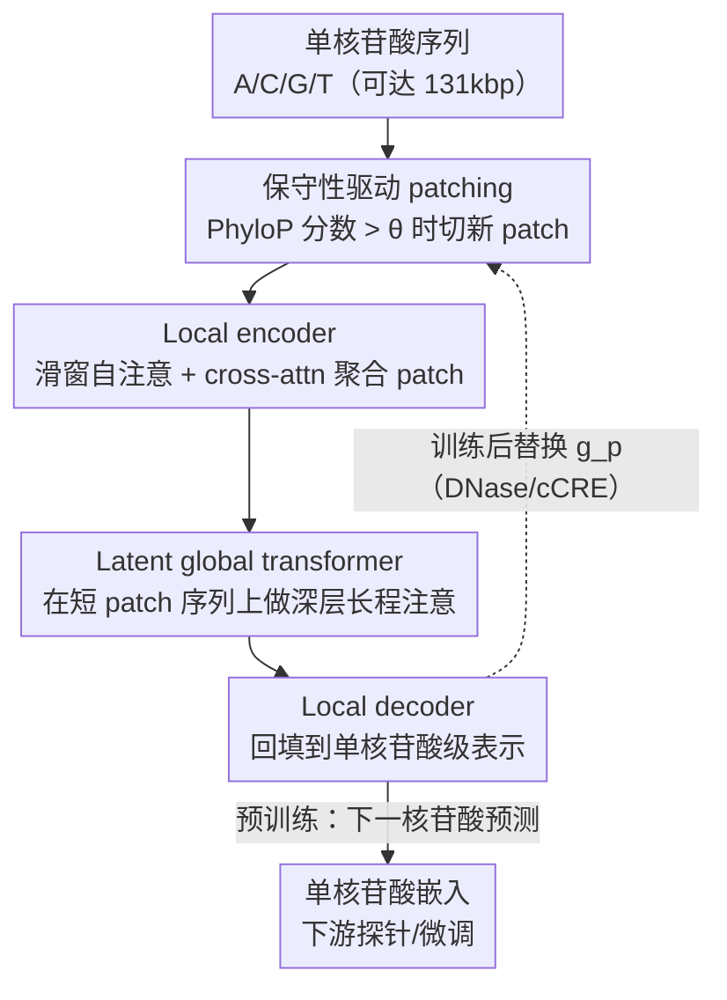

# PatchDNA: A Flexible and Biologically-Informed Alternative to Tokenization for DNA

**会议**: ICLR 2026  
**OpenReview**: [https://openreview.net/forum?id=AFZeojzjoG](https://openreview.net/forum?id=AFZeojzjoG)  
**代码**: 待确认  
**领域**: 计算生物学 / DNA 语言模型  
**关键词**: DNA 语言模型, 动态 patching, 进化保守性, 重新 patching, 长序列建模

## 一句话总结
PatchDNA 把自然语言里的 Byte Latent Transformer「分块（patching）」机制搬到 DNA 上，用进化保守性分数（PhyloP）而非固定词表来决定可变长度的 patch 边界，并支持训练后「重新 patching」，让参数量小一个数量级的模型在多个基因组 benchmark 上超过现有 SOTA，还能在不重训的情况下按下游任务/细胞类型调整切块策略。

## 研究背景与动机

**领域现状**：DNA 语言模型把基因组当作「四字母语言」（A/C/G/T），用自监督在原始核苷酸序列上预训练，再迁移到调控元件识别、剪接位点预测、变异效应预测等下游任务。和 NLP 一样，第一步要先把序列「切分（tokenize）」成模型的输入单元。

**现有痛点**：DNA 的 tokenization 存在一个绕不开的分辨率-效率权衡，而且现有方法把切分策略**固定**在训练之前，之后无法更改：
- **单核苷酸级**（HyenaDNA、Caduceus、Evo2）保留最高分辨率，对变异效应这类「一个碱基都要看清」的任务很关键，但序列极长（调控元件可能距离目标基因 100kbp 以上），对 Transformer 的算力是灾难。
- **固定多核苷酸方案**：k-mer（Nucleotide Transformer）切等长子串，但输入微小改动会让整条 token 序列剧变，模型难以对齐近似序列；BPE（DNABERT2）按频率合并高频核苷酸，效率高但在「字符级」任务上表现差——而单核苷酸变异（SNV）恰恰是 DNA 里最关键的字符级信号。
- **可学习 tokenization**（VQDNA、MxDNA）虽自适应，却引入额外训练/推理开销，且不缩短输入长度，学到的词表也不可解释。

**核心矛盾**：DNA 在**同一个区域内**同时编码细粒度信息（单碱基变异）和粗粒度信息（调控元件），任何一个固定词表都没法同时照顾两端；而且词表一旦定死，就丧失了「针对不同任务/组织调整切分粒度」的灵活性。

**切入角度**：作者注意到 NLP 里的 Byte Latent Transformer（BLT）放弃了固定词表，改用「预测熵」动态地把字节合并成可变长度的 patch。作者的核心洞察是：**patch 不依赖固定词表这一点，对 DNA 尤其有价值**——既能像单核苷酸一样保留分辨率，又能像粗 token 一样压缩低信息区，还能自由地把领域知识塞进切分准则里。

**核心 idea**：用「patching」代替「tokenization」，并把切分边界的依据从语言学的「熵」换成生物学的「进化保守性」，同时让切分策略在预训练后仍可替换（re-patching）。

## 方法详解

### 整体框架

PatchDNA 沿用 BLT 的三段式自回归骨架——**小型 local encoder + 深层 latent global transformer + 小型 local decoder**——但把「怎么切 patch」这一步换成了生物学驱动的可插拔模块。输入是单核苷酸序列 $x=(x_1,\dots,x_n)$；一个 patching 函数 $f_p$ 根据打分函数 $g_p$ 是否超过阈值 $\theta_p$ 来决定每个位置是不是新 patch 的起点（$b_i=1$ 表示位置 $i$ 开启新 patch），从而把序列切成 $m$ 个可变长度的 patch。Local encoder 把每个 patch 内的核苷酸聚合成 patch 表示；global transformer 在大幅变短的 patch 序列上做长程注意力（patch 序列短，所以这里可以做得很深）；local decoder 再把 patch 级信息回填到单核苷酸级，输出每个碱基的表示与下一核苷酸预测 logits。下游任务统一取 decoder 倒数第二层作为单核苷酸级嵌入。

整个框架的三个创新点是：用**保守性分数当切分准则**、训练后可**重新 patching**、以及把 BLT 从「短序列生成」拓展到「>100k 碱基的长序列表示」。

### 关键设计

**1. 保守性驱动的 patching：把算力分配给进化上最重要的区域**

BLT 用「预测熵」切块，背后假设是「语言里越难预测的地方越该多分配算力」。作者认为在基因组里更合理的信号是**进化保守性**——被自然选择保留下来的区域往往功能更关键。于是把通用 patching 框架里的打分函数 $g_p$ 直接取为 **PhyloP 保守性分数**（来自多物种比对，量化每个核苷酸受到的进化约束），切分准则为：

$$f_p(x_{i+1}) = \begin{cases} 1 & g_p(x_i) > \theta_p \\ 0 & \text{otherwise} \end{cases}$$

预训练时把阈值 $\theta_p$ 设为打分函数的第 95 百分位，得到平均约 20 个核苷酸的 patch。直觉上，保守（高分）区域被频繁切开、保留细粒度；非保守的低信息区被合并进大 patch、得到压缩。这样既不丢单碱基分辨率，又把 Transformer 的注意力集中在功能相关片段上。实验中保守性切分稳定优于熵切分和固定大小切分。

**2. Re-patching：训练后还能换切分策略，破除 tokenization 的根本限制**

固定词表模型一旦训练完，切分方式就锁死了。PatchDNA 的 patching 函数只依赖 $g_p$ 和 $\theta_p$，与模型权重解耦，因此可以在推理/微调阶段**直接替换 $g_p$**而不动任何架构、不从头重训。这带来两个用法：当有任务/组织特异的表观信号（如 DNase-seq 染色质可及性、cCRE 调控注释）时，把它当作新的 $g_p$，让模型把注意力重新聚焦到该细胞类型真正活跃的调控区；当没有生物信号时，又能退回固定切分等通用策略。也就是说，生物先验是「能用则用、没有也不依赖」的可选增强。这是论文标题里「flexible」的核心来源，也是相对一切固定词表方法的本质区别。

**3. BLT 骨架的基因组化改造：单核苷酸分辨率 + 超长序列**

BLT 原本面向 NLP 生成、序列长度上限约 16k 字节。作者做了三处适配让它适配 DNA：其一，BLT 关注生成，而基因组分析更需要**表示**，于是证明 decoder 的单核苷酸级嵌入对细粒度任务（如逐碱基的基因查找、变异效应）特别有用；其二，把序列长度拉到 >100k 核苷酸（最长 131kbp 上下文），靠更大的平均 patch 尺寸把 FLOPs 压到比同长度 DNA 模型低很多——作者指出若想用 tokenization 达到同等效率需要 20-mer，词表会膨胀到 $4^{20}$ 这种不可行的规模；其三，用 Perceiver 式的 cross-attention 让 patch 表示只 attend 到自己 patch 内的核苷酸，并设最大 patch 尺寸防止非保守区被过度压缩。最终放出两个模型：PatchDNA（19.2M 参数、16kbp 上下文）和 PatchDNA-7M（7.7M 参数、131kbp 上下文，用于和 Caduceus/HyenaDNA 公平对比）。

### 损失函数 / 训练策略
在人类参考基因组上用**下一核苷酸预测**目标做自回归预训练，训练/验证划分沿用 Caduceus 与 HyenaDNA。预训练阈值 $\theta_p$ 取打分函数第 95 百分位（平均 patch ≈ 20 nt），并设最大 patch 尺寸。下游统一取 decoder 倒数第二层嵌入，做冻结探针（linear probe）或微调。

## 实验关键数据

### 主实验

在 DART-Eval（五项调控基因组任务）上，PatchDNA 取得最佳综合表现（平均排名 2.0），且 PatchDNA-Entropy 排第二，说明 patching/BLT 架构本身就有增益、保守性切分再叠加增益：

| 模型 | Task1 准确率 | Task2 准确率 | Task3 准确率 | Task4 Spearman | Task5 AUROC | 平均排名 |
|------|------|------|------|------|------|------|
| **PatchDNA** | 0.966 | **0.725** | 0.457 | 0.440 | 0.555 | **2.0** |
| PatchDNA-Entropy | 0.965 | 0.650 | 0.465 | 0.400 | 0.523 | 3.0 |
| HyenaDNA | 0.891 | 0.645 | **0.587** | 0.384 | 0.515 | 3.8 |
| GENA-LM-Large | 0.947 | 0.620 | 0.383 | **0.472** | 0.505 | 4.2 |
| NT-MS-500M | 0.745 | 0.565 | 0.420 | 0.422 | **0.566** | 4.8 |

在长序列 CAGE 基因表达预测（114kbp 上下文）上，7.7M 的 PatchDNA-7M 全面超过同量级长序列模型，且微调比 HyenaDNA 快 3 倍以上：

| 模型 | Gene Pearson | Cell Pearson | Full Pearson |
|------|------|------|------|
| **PatchDNA-7M** | **0.369** | 0.771 | **0.471** |
| PatchDNA-7M + cCRE 重新 patching | **0.373** | **0.792** | 0.408 |
| HyenaDNA | 0.362 | 0.745 | 0.290 |
| Caduceus-ps | 0.365 | 0.766 | 0.420 |

此外，NT benchmark（18 项分类任务）上 PatchDNA 在调控元件和剪接两类取得最高平均 MCC，匹敌 NT-MS-500M 这类大 25 倍的模型；BEND 上 4 项任务赢了 3 项，基因查找仅次于参数量 25 倍、且多物种预训练的 NT-MS-500M；Genomics Long Range Benchmark 上 7 项任务赢 6 项。

### 消融实验

| 配置 | 关键现象 | 说明 |
|------|---------|------|
| 保守性切分（完整） | 系统性最佳 | 进化信号作通用切分准则最稳 |
| Entropy 切分 | 次优 | 验证 patching 架构本身有效 |
| Fixed-PS20 固定切分 | 更弱 | 固定粒度丢掉自适应优势 |
| 直接把 PhyloP 当输入特征 | 弱于「用 PhyloP 当切分准则」 | 保守性应指导切分，而非当原始特征喂入 |

细胞类型特异的 re-patching 进一步验证灵活性：在 K562 / 肝细胞 / 神经元三种细胞的 CAGE 预测上，加入 **DNase-aware 重新 patching** 让 K562 从 0.754 涨到 0.828、神经元从 0.799 涨到 0.831；而且只有当 DNase 信号**来自目标组织**（对角线）时增益最大，错配信号反而掉点。

### 关键发现
- 贡献最大的设计是「保守性当切分准则」：它稳定优于熵切分、固定切分，也优于把 PhyloP 直接当特征——说明价值在于「用生物信号决定算力分配」，而非简单地把信号拼进输入。
- Re-patching 是几乎零成本的增益来源：不重训、不改架构，只换打分函数就能在细胞特异任务上大幅涨点，且增益对「信号-组织是否匹配」高度敏感，证明 patch 确实把算力导向了正确的调控区。
- 小模型打大模型：7.7M / 19.2M 的 PatchDNA 在多个 benchmark 上追平或超过 500M 的 NT，效率上微调比 HyenaDNA 快 3 倍以上。

## 亮点与洞察
- **把「切分准则」做成可插拔接口**是最巧妙的地方：传统模型的词表是「训练前定死、训练后封印」的，而 PatchDNA 让切分只依赖一个外部打分函数，于是「换任务/换组织 = 换一个标量信号」，把架构级的不灵活变成了一行配置。
- **领域知识的注入点选得好**：不是改 loss、不是加额外网络，而是用进化保守性/染色质可及性去决定「在哪里花算力」，这个切入点几乎零额外参数，却直接对齐了基因组的功能结构。
- 这种「用外部分数引导 token/patch 边界」的思路可迁移到其他长序列、信息密度不均的模态（如蛋白质、时序信号），只要存在一个能标注「哪里重要」的标量信号即可。

## 局限与展望
- 保守性驱动切分依赖 **PhyloP 这类多物种比对分数**，对缺乏比对资源的物种或新发现序列可能不适用（作者给的退路是退回熵/固定切分，但那就放弃了生物先验的增益）。
- Re-patching 的增益高度依赖「信号与目标组织匹配」，意味着部署到新细胞类型仍需要对应的 DNase-seq 等表观数据，并非纯序列即可。
- 论文主打人类参考基因组预训练，跨物种/多物种泛化（NT 那种多物种大数据优势）未在同等数据规模下对比，效率优势之外的「数据规模天花板」尚不清楚。
- 阈值 $\theta_p$（第 95 百分位）和最大 patch 尺寸是关键超参，过度压缩非保守区的风险需要人为设上限来兜底。

## 相关工作与启发
- **vs BLT（Byte Latent Transformer）**：BLT 用预测熵在 NLP 字节上切 patch、面向生成、序列 ≤16k；PatchDNA 把切分准则换成进化保守性、面向基因组表示、序列 >100k，并新增训练后 re-patching——是把 BLT 思想「领域化 + 灵活化」。
- **vs k-mer / BPE（Nucleotide Transformer、DNABERT2）**：它们用固定词表，牺牲单碱基分辨率或字符级能力且不可改；PatchDNA 无固定词表，保留单核苷酸分辨率且可后期调整切分。
- **vs HyenaDNA / Caduceus（单核苷酸长序列模型）**：同样能处理长序列，但 PatchDNA 通过 patch 压缩把算力集中到功能区，效率（微调快 3×）和多任务表现都更好。
- **vs EPInformer / Seq2Exp（融合表观信号的定制架构）**：它们靠专门架构把序列和表观输入融合；PatchDNA 不改架构，只用 DNase 信号去 re-patch，就达到同类「上下文特异」的效果，工程上轻得多。

## 评分
- 新颖性: ⭐⭐⭐⭐⭐ 把「无固定词表 patching」引入 DNA 并用进化保守性当切分准则、再加 re-patching，是 tokenization 范式之外的一条新路。
- 实验充分度: ⭐⭐⭐⭐⭐ 覆盖 NT / DART-Eval / BEND / CAGE / 长程 benchmark 多套评测，外加切分策略、细胞匹配等系统消融。
- 写作质量: ⭐⭐⭐⭐ 动机推导清晰、图表完整；patching 框架的部分公式与实现细节需回查附录。
- 价值: ⭐⭐⭐⭐⭐ 小一个数量级却超 SOTA，且训练后零成本适配下游，对基因组建模的实用价值高。

<!-- RELATED:START -->

## 相关论文

- [\[ICML 2026\] DNAChunker: Learnable Tokenization for DNA Language Models](../../ICML2026/computational_biology/dnachunker_learnable_tokenization_for_dna_language_models.md)
- [\[ICLR 2026\] Learning Flexible Forward Trajectories for Masked Molecular Diffusion](learning_flexible_forward_trajectories_for_masked_molecular_diffusion.md)
- [\[ICLR 2026\] Protein Structure Tokenization via Geometric Byte Pair Encoding](protein_structure_tokenization_via_geometric_byte_pair_encoding.md)
- [\[ICLR 2026\] AntigenLM: Structure-Aware DNA Language Modeling for Influenza](antigenlm_structure-aware_dna_language_modeling_for_influenza.md)
- [\[ICLR 2026\] BioBO: Biology-informed Bayesian Optimization for Perturbation Design](biobo_biology-informed_bayesian_optimization_for_perturbation_design.md)

<!-- RELATED:END -->
