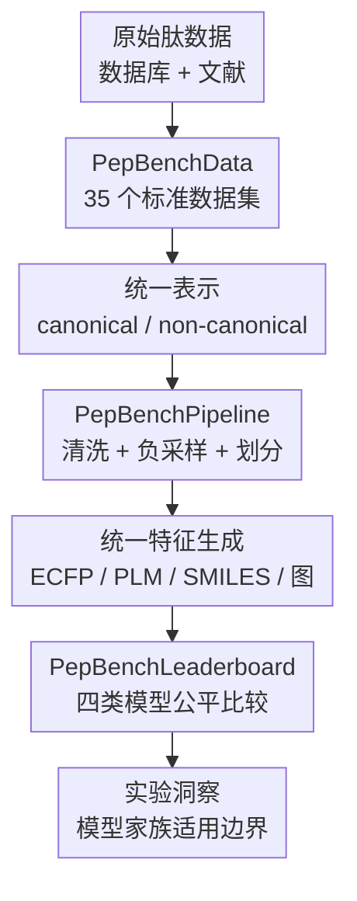

# PepBenchmark: A Standardized Benchmark for Peptide Machine Learning

**会议**: ICLR2026  
**OpenReview**: [https://openreview.net/forum?id=NskQgtSdll](https://openreview.net/forum?id=NskQgtSdll)  
**代码**: https://github.com/ZGCI-AI4S-Pep/PepBenchmark/  
**领域**: 计算生物学 / 肽机器学习 / 数据集与基准  
**关键词**: 肽机器学习, 肽药物发现, 标准化基准, 负采样, 数据划分  

## 一句话总结
PepBenchmark 把肽药物发现中的 35 个 canonical / non-canonical peptide 数据集、统一清洗采样划分流程和四类模型 leaderboard 放到同一套可复现实验框架里，并揭示了 PLM、fingerprint、GNN 与 SMILES 模型在不同肽任务上的真实优势边界。

## 研究背景与动机
**领域现状**：肽类药物通常被视为小分子和单克隆抗体之后的“第三代”治疗分子，它们兼具合成可行性、生物特异性和较好的安全性。随着抗菌肽、抗癌肽、细胞穿透肽、肽-蛋白相互作用等数据不断积累，机器学习已经开始参与肽活性预测、ADME 性质评估和安全性筛查。

**现有痛点**：这个方向的问题不在于没有模型，而在于很难判断模型到底有没有进步。不同论文从不同数据库和文献里各自整理数据，canonical peptide 和 non-canonical peptide 的表示方式也不统一；同一个任务可能有人随机采样负样本，有人拿其他 bioactive peptide 当负样本；划分数据时有人随机切分，有人按序列相似性切分，甚至评价指标也不一致。最后得到的分数往往不能横向比较。

**核心矛盾**：肽数据里的“捷径”特别多。近重复序列会让模型记住局部突变家族；正负样本长度、电荷、疏水性差异会让模型学到数据集伪影；代表性 k-mer 在正样本里高频出现时，即使整体序列相似度不高，也会泄漏到训练和测试两边。基准如果不处理这些问题，越强的模型越可能只是更会利用捷径。

**本文目标**：作者想建立一个从数据到评测都标准化的 peptide ML benchmark。它需要覆盖肽药物发现的关键任务，能处理天然与非天然肽，能给出清洗、负采样、划分、特征转换的统一流程，也要在同一协议下比较 fingerprint、GNN、protein language model 和 SMILES-based model 等常见方法。

**切入角度**：论文没有只发布一个数据包，而是把 benchmark 拆成三层：PepBenchData 负责数据资源，PepBenchPipeline 负责把原始数据变成可比较的数据集，PepBenchLeaderboard 负责统一模型训练与评价。这样做的好处是，后续新模型可以直接插入同一 pipeline，而不是重新发明一套数据处理流程。

**核心 idea**：用“统一数据源 + 生物知识约束的数据处理 + 泄漏感知的数据划分 + 多模型统一 leaderboard”来替代 ad hoc 的肽 ML 实验设置，让 peptide property prediction 的结果更可复现、更难被捷径污染。

## 方法详解
### 整体框架
PepBenchmark 的整体框架可以理解为一条 benchmark 生产线：先从已有数据库和文献中整理 canonical / non-canonical peptide 数据，再用统一 pipeline 做清洗、负采样、划分和特征转换，最后在相同评价协议下比较多类模型。它的贡献不在某一个预测器，而在于把肽机器学习中最容易“各做各的”的数据工程和实验协议固定下来。

这条生产线包含三个互相对齐的组件。PepBenchData 给出 35 个数据集，覆盖活性建模、药代动力学和安全性评估；PepBenchPipeline 解决冗余、假负样本、k-mer 泄漏和表示不统一；PepBenchLeaderboard 则把四类方法放到同一评价坐标系里。

从任务覆盖看，PepBenchData 把 35 个数据集组织成 7 个 group，对应肽药物开发的三个阶段。Activity Modeling 包含 AMP、oncology、metabolic、other bioactivities 和 PepPI；Pharmacokinetics Profiling 对应 ADME；Safety Assessment 对应 toxicity 相关任务。输入形态上有 32 个 single-input peptide 数据集和 3 个 peptide-protein interaction 数据集；肽类型上有 29 个 canonical 数据集和 6 个 non-canonical 数据集；任务类型上有 27 个分类任务和 8 个回归任务。

### 关键设计
**1. PepBenchData：把分散肽任务整理成 AI-ready 的标准资源**

肽 ML 的第一类混乱来自数据源本身。作者把 canonical peptide 数据主要从已有 benchmark、任务论文和 Peptipedia 等资源中整合出来，把 non-canonical peptide 数据主要从 CycPeptMPDB 与 Hemolytik 2.0 中整理出来，并统一到可建模的表示形式。最终数据规模包括 29 个 canonical 数据集的 68,588 条序列，以及 6 个 non-canonical 数据集的 9,512 条序列。

这个数据层的关键不是“收得多”而是“能直接用于公平实验”。论文把数据按药物发现流程组织：活性预测回答这个肽是否具备抗菌、抗癌、代谢调控、肽-蛋白结合等性质；ADME 关注穿膜、血脑屏障、nonfouling 等药代相关属性；Tox 关注溶血、神经毒性、过敏原和广义毒性。这样的分组让 benchmark 不只是一个文件夹集合，而是对 peptide therapeutics 研发链条的抽象。

non-canonical peptide 是这篇 benchmark 的一个重要扩展点。不同来源会使用 HELM、BILN、MAP 或 SMILES 等表示，单体命名也不一致。作者合并出 613 个 unique monomer，并提供 BILN、HELM、SMILES 之间的转换工具，使带环化、修饰或非天然氨基酸的肽也能进入同一建模框架。这里的价值在于把过去很难复用的非天然肽数据转成了模型可消费的格式。

**2. PepBenchPipeline：用生物约束和分布约束减少伪影**

PepBenchPipeline 的核心是承认肽数据处理本身会决定 benchmark 难度。对回归数据，作者用 IQR 去除重复实验测量中的离群值：如果同一序列有多个实验值，就先丢掉落在 $[Q1 - 1.5 \times IQR, Q3 + 1.5 \times IQR]$ 之外的观测，再对剩余值取平均，避免极端实验条件污染标签。对分类数据，作者用 MMseqs2 去除 90% 以上相似的近重复正样本，防止模型背下一个突变家族。

更关键的是负采样。很多肽分类数据只有阳性样本，负样本必须人工构造。随机序列太容易被模型识别为“非生物活性肽”，而从其他活性任务里直接抽负样本又可能引入假负例，例如抗菌肽和抗癌肽都可能依赖膜相互作用，互相当负样本会误导模型。作者提出 BDNegSamp，也就是 Biologically-informed and Distribution-controlled Negative Sampling：先从所有 bioactive peptide 建候选池，再根据专家知识和序列重叠统计排除与目标任务高度相关的任务，之后过滤与正样本过近的序列，最后按长度、净电荷、疏水性、1-mer 和 2-mer 组成匹配分布。

BDNegSamp 的分布控制不是口头约束，而是显式用 Jensen-Shannon divergence 检查。长度、电荷和疏水性被离散成 30 个 bin，目标是让对应分布的 JS divergence 低于约束阈值；氨基酸组成和二肽组成使用更严格的阈值。这样采到的负样本既不是随机噪声，也尽量不像潜在阳性，还不会因为长度或电荷差异让模型轻松作弊。

**3. Hybrid-split：把 k-mer 泄漏和整体同源性同时挡住**

数据划分是本文最有技术含量的部分之一。传统 random split 会把相似肽放进训练和测试两边，导致结果偏高；MMseqs2 split 能按整体序列相似性隔离一部分同源序列，但它挡不住局部 motif 泄漏。论文指出很多肽任务存在 representative k-mer：某些 k-mer 在正样本中显著富集，可能是实验设计者反复引入的活性 motif。即使两条序列整体相似度不高，只要共享这些局部片段，模型就可能学到 shortcut。

作者先用 Fisher's exact test 找出正样本中显著富集的 k-mer，并用 Benjamini-Hochberg 控制 FDR；平均长度大于 15 的数据集用 $k=5$，更短的数据集用 $k=3$。然后把共享 enriched k-mer 的序列聚成同一个 motif cluster，并按 cluster 而不是按单条序列分配 train / validation / test。这样做强制同一个代表性 motif 不会跨 split 出现。

最终的默认策略是 hybrid-split：先执行 k-mer-aware split，把包含代表性 motif 的样本聚类分配；再对不含代表性 motif 的样本使用 MMseqs2 按 30% identity 聚类并分配。这个设计同时处理局部 motif 泄漏和全局序列同源性。对 PepPI，作者采用 protein-based cold-start split，保证测试蛋白不出现在训练集中；对 non-canonical peptide，因为普通 FASTA 工具无法忠实表示修饰和环化结构，作者用 ECFP fingerprint 的 Tanimoto similarity 构图，并按相似图连通分量划分。

**4. PepBenchLeaderboard：在统一协议下比较模型家族而不是单点刷分**

Leaderboard 覆盖四类模型。Fingerprint-based 方法使用 ECFP6 或 ECFP4 等分子指纹配合 RF、XGBoost、LightGBM；GNN-based 方法把肽表示成原子级分子图，比较 GCN、GAT、GIN 和 Pepland；SMILES-based 方法把肽当化学语言序列，比较 ChemBERTa、PeptideCLM、PepDoRA；PLM-based 方法使用 ESM2、DPLM、ProtBERT 等蛋白语言模型嵌入。

作者还设计了 ESM2-150M-F 来检验 peptide-aware continued pretraining 的作用。原始 ESM2 在 UniRef 上预训练，而长度小于 50 的短肽在 UniRef50 中只占 2.8%，因此短肽建模并不是它的主场。作者从 UniRef50 中截取长度不超过 50 的 1,932,360 条短序列继续预训练 ESM2-150M，并用 pseudo-perplexity 评估 masked language model 对短肽的建模能力。结果显示 ESM2-150M-F 在短肽上 perplexity 更低，也在多个分类任务中带来性能提升。

### 一个完整示例
以“抗癌肽分类”这类 canonical peptide 分类任务为例，如果沿用旧做法，研究者可能直接把抗菌肽或随机 UniProt 片段当负样本，再随机划分数据。这样模型可能只学到抗癌肽和随机序列在长度、电荷或膜活性 motif 上的差异，测试集分数很好看，但遇到新的活性骨架时泛化不足。

在 PepBenchmark 里，这个任务会先进入 PepBenchData 的 activity modeling group。PepBenchPipeline 会去除高度相似的正样本，避免同一突变系列横跨训练和测试；BDNegSamp 会排除与抗癌机制高度相关的 membrane-interaction 任务，减少把潜在抗癌肽当负样本的风险；采样时还要匹配正负样本的长度、净电荷、疏水性、1-mer 和 2-mer 组成。划分时，代表性 k-mer 会先被 Fisher 检验识别，并保证共享 enriched k-mer 的肽落在同一个 split，剩余样本再按 MMseqs2 同源性分组。

最终模型看到的是更难、更接近真实发现场景的数据。若一个模型还能在这种设置下胜出，说明它更可能学到了可迁移的肽性质，而不是记住了实验数据中的局部模板。

### 损失函数 / 训练策略
这篇论文不是提出新的损失函数，而是统一训练和评价协议。分类任务使用 ROC-AUC，回归任务使用 MAE，并在五次独立划分上报告均值和标准差。SCPP 使用 hybrid-split，SNCPP 使用 ECFP-split，PepPI 使用 protein cold-start split，默认训练 / 验证 / 测试比例为 8:1:1。

PLM-based 与 SMILES-based 模型使用统一超参：最多 50 个 epoch，batch size 为 64，学习率 $5 \times 10^{-5}$，early stopping patience 为 5，weight decay 为 0。GNN-based 模型同样训练最多 50 个 epoch，batch size 为 64，3 层 GNN，隐藏维度 300，学习率 0.001。PepPI 任务由于显存压力使用 batch size 16、学习率 $10^{-4}$。传统机器学习模型主要使用默认配置。

ESM2-150M-F 的继续预训练更重：作者用长度不超过 50 的 UniRef50 短肽子集，9:1 划分训练和验证，在 8 张 A800 上用 DeepSpeed 和 BF16 训练，per-device batch size 为 512，有效 batch size 为 4096，学习率 $4 \times 10^{-4}$，训练 500 个 epoch。这个设置主要为了验证短肽专门预训练是否能弥补通用蛋白 PLM 对短序列覆盖不足的问题。

## 实验关键数据

### 主实验
| 任务设置 | 最强模型 / 家族 | 关键结果 | 主要结论 |
|--------|----------------|----------|----------|
| SCPP 分类，22 个 canonical peptide 数据集 | ESM2-150M-F / PLM | 平均 ROC-AUC 81.5%，高于 DPLM-150M 80.9%、RF 79.2% | PLM 是单肽性质分类的最强整体路线，短肽继续预训练有帮助 |
| SCPP 回归，4 个 canonical regression 数据集 | ESM2-650M / PLM | 平均 MAE 0.469，优于 ESM2-150M 0.486、DPLM-150M 0.504、RF 0.555 | 回归更吃模型容量，larger PLM 的收益更明显 |
| SNCPP 分类，4 个 non-canonical 数据集 | FP-based | RF / XGBoost / LightGBM 平均 ROC-AUC 约 95.7-96.0% | 非天然肽缺少 FASTA 表示时，fingerprint 方法目前最可靠 |
| SNCPP 回归，nc-cpp pampa | RF / FP-based | MAE 0.649，优于 GNN 和多数 SMILES 模型 | 对非天然肽膜通透性，原子级深度模型并未自然胜过指纹 |
| PepPI 分类 / 回归 | GNN / SMILES / FP 各有优势 | PPI 分类 GIN 61.3% ROC-AUC；nc-PPI binding affinity 上 PepDoRA MAE 1.465 | 肽-蛋白相互作用更需要细粒度分子表示，PLM 不再稳定占优 |

| 模型家族 | SCPP 分类平均 ROC-AUC | SCPP 回归平均 MAE | SNCPP 分类平均 ROC-AUC | 论文解读 |
|---------|-----------------------|-------------------|-------------------------|----------|
| FP-based | RF 79.2%，LightGBM 78.5% | RF 0.555，LightGBM 0.557 | 约 95.7-96.0% | 小数据和非天然肽场景非常强，是必须比较的 baseline |
| GNN-based | GIN 69.5%，Pepland 63.9% | GIN 0.583，Pepland 0.595 | 约 81.2-89.3% | 单肽性质预测中原子图可能引入冗余，但 PepPI 中更有价值 |
| SMILES-based | ChemBERTa 73.2%，PepDoRA 62.1% | ChemBERTa 0.562，PepDoRA 0.597 | 约 70.3-89.1% | 现有化学语言模型迁移到肽任务仍不稳定 |
| PLM-based | DPLM-150M 80.9%，ESM2-150M-F 81.5% | ESM2-650M 0.469 | 不适用于多数 non-canonical FASTA 缺失任务 | canonical single-peptide 任务整体最强，但不是所有肽任务的万能解 |

### 消融实验
| 分析对象 | 对比设置 | 关键指标 / 现象 | 说明 |
|---------|----------|----------------|------|
| 去冗余影响 | 原始数据 vs 90% 相似度去冗余 | hemolytic raw 去冗余比例 47%，RF ROC-AUC 相对下降 17.391% | 近重复序列会显著抬高模型分数，尤其在溶血任务中很严重 |
| 划分协议 | random split vs MMseqs2 split vs k-mer / hybrid split | random split 上很多任务 ROC-AUC 超过 0.9，模型差距被压平；k-mer split 明显更难 | 高分不一定代表泛化，可能只是同源性或 motif 泄漏 |
| 负采样质量 | 旧负采样 vs BDNegSamp | BDNegSamp 控制长度、电荷、疏水性、1-mer、2-mer 的 JS divergence | 正负样本分布更接近，模型更难靠浅层统计差异取胜 |
| 预训练来源 | ESM2-8M vs ESM2-8M-S | 分类平均 ROC-AUC 80.3% vs 77.2% | 大规模蛋白预训练能迁移到 canonical peptide 任务 |
| 短肽继续预训练 | ESM2-150M vs ESM2-150M-F | 分类任务 ESM2-150M-F 平均 ROC-AUC 81.5%，但回归提升较小 | peptide-aware finetuning 主要帮助分类，回归更受模型容量约束 |
| PepBenchData-150 | ESM2-150M vs ESM2-150M-F | 长序列版本中 ESM2-150M-F 反而弱于原始 ESM2-150M | 只在短肽上继续预训练会遗忘一部分蛋白长序列知识 |

### 关键发现
- PLM 是 canonical single-peptide property prediction 的主力路线，但它的优势依赖输入能被 20 个天然氨基酸序列合理表示；一旦进入 non-canonical peptide，PLM 的可用性和优势都会下降。
- Fingerprint-based 方法被很多深度学习论文低估了。RF + ECFP6 在小数据任务上经常排第一或第二，而 ECFP6 还不是 peptide-specific descriptor，这说明设计专门面向肽的 fingerprint 可能很有价值。
- GNN 和 SMILES 模型在单肽性质预测上整体偏弱，但在 PepPI 任务中变得有竞争力。直觉上，肽-蛋白相互作用需要更细的原子级和界面信息，而不是只看序列级语义。
- k-mer leakage 是 peptide benchmark 里容易被忽视的硬问题。只用 MMseqs2 控制整体同源性不够，因为短 motif 可以跨过低整体相似度的边界泄漏。
- peptide-aware continued pretraining 不是越多越好。ESM2-150M-F 在短肽分类上更强，但在包含更长序列的 PepBenchData-150 上可能因为灾难性遗忘而退步。

## 亮点与洞察
- PepBenchmark 的最大亮点是把“数据处理是否公平”放到模型比较之前。很多 benchmark 只给数据和分数，本文则明确指出负采样、冗余、k-mer、split 都会改变问题难度。
- BDNegSamp 很实用。它没有幻想能找到完美阴性肽，而是用生物相关性排除明显危险的任务，再用分布匹配降低浅层伪影，这比随机采样或简单跨任务采样可靠得多。
- hybrid-split 的洞察很漂亮：肽序列短，功能 motif 密度高，局部 k-mer 往往比整体相似度更能制造泄漏。这个思想可以迁移到抗体 CDR、蛋白短 motif、RNA motif 等其他生物序列 benchmark。
- 论文对模型家族的结论比较克制。它没有简单说 PLM 全面胜利，而是指出 canonical 单肽、non-canonical 单肽和 PepPI 是三种不同建模问题，最合适的表示也不同。
- 继续预训练 ESM2-150M-F 的实验提醒我们，领域适配要看目标长度和任务分布。短肽适配对短肽分类有收益，但如果 benchmark 需要覆盖更长序列，保留通用蛋白知识也很重要。

## 局限与展望
- 当前 benchmark 主要是序列级和分子表示级任务，缺少结构数据与结构预测 / 结构生成评测。作者也承认 PDB 中 peptide structure 数据非常稀缺，尤其 non-natural peptide 不到 100 条，后续需要依赖 QM/MM、增强分子动力学等模拟手段扩展结构任务。
- 负采样仍然不可能彻底消除假负例。BDNegSamp 通过任务相关性和相似性过滤降低风险，但肽的多功能性很强，一个看似无关的 bioactive peptide 仍可能有目标活性。
- leaderboard 的模型调参策略偏统一而非逐任务最优。考虑到 35 个数据集、20 个模型和 5 次重复，这很合理，但也意味着某些模型家族可能没有被调到最佳状态。
- PepPI 任务的结论还有不确定性。论文附录指出是否冻结 protein encoder 仍不确定，说明当前 PepPI 评测协议还可以继续打磨。
- non-canonical peptide 的数据规模仍然小。作者用生成模型把 canonical negative pool 转成 non-canonical negative samples 是务实做法，但未来仍需要更多真实实验数据来验证这些合成负样本是否足够可靠。

## 相关工作与启发
- **vs UniDL4BioPep**: UniDL4BioPep 覆盖多个 peptide bioactivity 二分类任务，但数据规模和处理流程有限；PepBenchmark 不只扩展数据集数量，还把清洗、负采样、划分和 leaderboard 全部标准化。
- **vs Peptipedia**: Peptipedia 更像大规模 peptide activity 数据库，覆盖来源广，但很多条目不能直接用于 ML benchmark；PepBenchmark 则把这些资源加工成可训练、可划分、可评价的数据集。
- **vs AutoPeptideML**: AutoPeptideML 提供自动化 peptide bioactivity 建模工具，也关注可信预测；PepBenchmark 的差异在于任务覆盖更广，尤其纳入 non-canonical peptide、PepPI 和更严格的 k-mer / hybrid split。
- **vs TDC / MoleculeNet / ProteinGym**: 这些 benchmark 分别推动了治疗科学、小分子和蛋白 fitness 预测的发展；PepBenchmark 的定位是填补 peptide therapeutics 这一中间区域，既不同于小分子，也不同于长蛋白。
- **启发**: 如果后续做新的肽生成模型，不能只在随机 split 上报告活性预测分数。更有说服力的做法是把生成候选放到 PepBenchmark 的 hybrid-split 预测器、non-canonical 表示转换和 ADME / Tox 多任务评测里，同时报告是否跨过了已知 motif shortcut。

## 评分
- 新颖性: ⭐⭐⭐⭐☆ 不是新预测模型，但把肽 ML benchmark 的关键漏洞系统化处理，尤其 BDNegSamp 和 k-mer leakage 设计很有价值。
- 实验充分度: ⭐⭐⭐⭐⭐ 35 个数据集、四类模型、五次重复、多种 split 和附录分析，覆盖面非常扎实。
- 写作质量: ⭐⭐⭐⭐☆ 主线清楚，实验信息量很大；附录数据集说明很细，但读者需要花时间把 benchmark 设计和模型结论串起来。
- 价值: ⭐⭐⭐⭐⭐ 对 peptide ML 社区很实用，适合作为后续模型、数据处理方法和肽药物发现 pipeline 的统一评测底座。

<!-- RELATED:START -->

## 相关论文

- [\[NeurIPS 2025\] A Standardized Benchmark for Multilabel Antimicrobial Peptide Classification](../../NeurIPS2025/computational_biology/a_standardized_benchmark_for_multilabel_antimicrobial_peptide_classification.md)
- [\[ICLR 2026\] CAPSUL: A Comprehensive Human Protein Benchmark for Subcellular Localization](capsul_a_comprehensive_human_protein_benchmark_for_subcellular_localization.md)
- [\[ICLR 2026\] Representing Local Protein Environments with Machine Learning Force Fields](representing_local_protein_environments_with_machine_learning_force_fields.md)
- [\[ICLR 2026\] DistMLIP: A Distributed Inference Platform for Machine Learning Interatomic Potentials](distmlip_a_distributed_inference_platform_for_machine_learning_interatomic_poten.md)
- [\[ICLR 2026\] 3DCS: Datasets and Benchmark for Evaluating Conformational Sensitivity in Molecular Representations](3dcs_datasets_and_benchmark_for_evaluating_conformational_sensitivity_in_molecul.md)

<!-- RELATED:END -->
