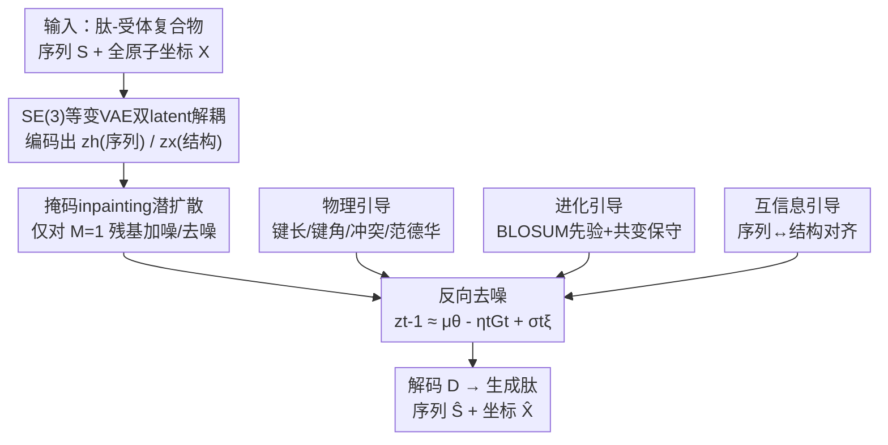

# PepTri: 物理、进化与互信息三重引导的全原子扩散肽设计

**会议**: ICLR 2026  
**OpenReview**: [https://openreview.net/forum?id=yQlTgHo1um](https://openreview.net/forum?id=yQlTgHo1um)  
**代码**: https://github.com/aigensciences/PepTri  
**领域**: 计算生物 / 扩散模型 / 蛋白肽设计  
**关键词**: 肽设计, 全原子扩散, SE(3)等变, 物理引导, 互信息

## 一句话总结
PepTri 在一个 SE(3) 等变的潜空间里把肽的序列和三维结构一起做扩散生成，并在去噪过程中同时注入物理、进化和互信息三路引导，让生成的肽既物理稳定、又进化上合理、还序列-结构自洽，在多个肽-蛋白设计基准上取得 SOTA。

## 研究背景与动机
**领域现状**：肽（短氨基酸链）因为高特异性、低毒性、能靶向"不可成药"蛋白，正成为一类重要的治疗手段。深度生成模型（扩散、流匹配）已经能学习蛋白/肽的骨架分布并生成多样结构，是当前肽设计的主流路线。

**现有痛点**：现有方法大多是"结构中心"的——它们把序列和结构解耦生成，结构生成器能产出看起来合理的几何但忽略进化约束；进化序列模型（Potts/MSA）能抓保守性却不管三维稳定性；物理检验（键长、键角、空间冲突）通常是生成完之后再做后处理（post hoc）。结果是：生成的几何看着稳，对应的序列却可能不真实、不可行。

**核心矛盾**：物理合理性、进化合理性、序列-结构一致性这三件事是相互依赖的约束，但已有框架把它们当成彼此独立或事后补丁的模块，没有一个方法能保证生成的设计**同时**满足三者。把任意一路当作辅助项而不是去噪动力学的一部分，就会顾此失彼。

**本文目标**：在一个统一的生成回路里，让序列和结构联合生成，并让物理、进化、序列-结构对齐这三种信号**直接塑造去噪轨迹**，而不是事后修补。

**切入角度**：作者观察到，既然 nature 已经在蛋白空间做过海量组合搜索、留下了保守与共进化的模式，而物理定律又对几何施加硬约束，那么把这两类先验连同信息论对齐一起注入扩散的每一步，就能把搜索压缩到"既稳又真"的子空间。

**核心 idea**：在 SE(3) 等变潜空间内联合扩散序列与结构，并用"物理 + 进化 + 互信息"三重引导（tri-guidance）在训练和采样阶段同时引导去噪。

## 方法详解

### 整体框架
PepTri 采用两阶段框架。第一阶段是一个 SE(3) 等变的 VAE，把"序列 + 结构"输入压缩进一个保留完整几何对称性的潜空间，并把潜变量**解耦**成序列部分 $z_h$ 和结构部分 $z_x$；第二阶段是一个在这个潜空间里做掩码 inpainting 的潜扩散模型，前向用受控加噪破坏 $M=1$ 的待设计残基，反向从纯噪声 $z_T$ 一步步去噪回 $z_0$，每一步都叠加一个三重引导项 $G_t$ 来纠偏。去噪完成后由解码器 $D$ 重建出肽的序列 $\hat{S}$ 与全原子坐标 $\hat{X}$。整个过程在受体口袋的几何/能量上下文里进行（受体当刚性骨架），保证生成的肽是在真实结合环境下被评估的。

三重引导各管一摊：物理引导作用在结构分量 $z_x$ 上（管键长、键角、冲突、范德华），进化引导作用在序列分量 $z_h$ 上（偏向保守 motif），互信息引导则负责把 $z_x$ 和 $z_h$ 对齐。反向更新写成 $z_{t-1} \approx \mu_\theta(z_t,t) - \eta_t G_t + \sigma_t \xi$，其中 $-\eta_t G_t$ 就是引导带来的偏移。

### 关键设计

**1. SE(3) 等变 VAE 与序列/结构双 latent 解耦：把几何对称性焊进潜空间**

直接在原子坐标上做扩散训练不稳，且很难同时兼顾序列和结构。PepTri 先用一个 VAE 把输入压成紧凑潜空间，关键是这个编码器用 SE(3) 等变图神经网络（在 adaptive multi-channel EGNN 基础上增强），只用相对向量和不变的边特征（成对距离 $d_{ij}$、平均三元组角 $\psi_{ij}$）做消息传递：$x'_i = x_i + \sum_{j\in N(i)} \phi(d_{ij},\psi_{ij},h_i,h_j)(x_i-x_j)$，$h'_i = \psi_h(h_i, \sum_j \psi_m(\cdot))$。由于更新只依赖相对几何，整个编解码严格等变于旋转平移。编码器吐出两路解耦的潜变量——序列 $z_h \in \mathbb{R}^{L\times d_h}$ 和结构 $z_x \in \mathbb{R}^{L\times n_{lat}\times 3}$（每个残基带 $n_{lat}$ 个 3D 锚点），这样后续三重引导才能分别作用在对应模态上。VAE 的训练目标同时重建序列与结构并约束几何一致：

$$L_{VAE} = CE(S,\hat{S}) + \|X-\hat{X}\|_2^2 + \beta L_{KL} + \lambda_{geom}\|D(\hat{X})-D(X)\|_F^2$$

最后一项用成对距离矩阵 $D(X)$ 约束 SE(3) 不变的结构一致性。用 VAE 而非直接在坐标上扩散，是为了训练更稳、潜空间更紧凑可控。

**2. 物理引导：把可微分子力学的梯度直接灌进去噪器**

只靠数据学出来的坐标常常键长断裂、键角离谱、原子互相穿模，违反物理。PepTri 把物理当成训练期正则项：在设计区域（$Cα$ trace，为数值稳定只在 $Cα$ 上算）定义一个复合能量 $E_{phys}(\hat{X},S;M) = \sum_j w_j E_j$，涵盖键长、键角、范德华、静电、防冲突、二级结构 proxy 和扩散平滑等项。每步预测出坐标 $\hat{X}$ 后评估 $E_{phys}$，再反传得到掩码梯度 $\nabla_{\hat{X}} E_{phys}$ 来更新参数。因为能量只依赖内部坐标（距离/角度），梯度天然保 SE(3) 不变。此外还耦合了一个可微力场项 $L_{OpenMM}$（用 OpenMM + Amber14 全原子力场，在最后一步算 $Cα$ 上的力）。物理总损失为 $L_{phys}=\lambda_{phys}E_{phys}+\lambda_{OpenMM}L_{OpenMM}$。采样阶段还提供一个可选的能量引导采样器，直接修正预测噪声 $\varepsilon_t \leftarrow \varepsilon_t - \gamma(\nabla_{x_t} E_{OpenMM})\odot M$，把扩散轨迹温柔地推向低能构象；在反向扩散里这一项写作 $\tilde\varepsilon_{X,t}=\varepsilon_{X,\theta^\star}-\sqrt{1-\bar\alpha_t}\,G^{phys}_t$，并对 $\lambda_{phys}$ 做退火，让物理约束在轨迹后期更强。

**3. 进化引导：用 BLOSUM 先验 + 共变注意力把序列拉向保守、可行的 motif**

nature 留下的保守与共进化模式编码了"哪些残基行得通"。PepTri 在编码器给出的干净残基嵌入 $H_0$ 上注入这一信号。首先学一个 BLOSUM 风格矩阵 $B\in\mathbb{R}^{20\times20}$ 生成残基特征 $\tilde H = H_0 + \omega\,\phi(YBF_1+b_1)F_2+b_2$（$Y$ 是氨基酸 one-hot）；再用残差多头自注意力捕捉位点间依赖 $H_{coevo}=\tilde H + \alpha\,\text{MHA}(\tilde H)$。在此之上接两个小头：逐位保守偏好 $P_{cons,i}=\text{Softmax}(V_c\phi(F_c H_{coevo,i}))\in\Delta^{19}$（落在 20 类氨基酸的概率单纯形上），以及自监督的适应度分数 $F(H_{coevo})\in(0,1)$。训练目标组合了适应度回归 $L_{fit}=\text{SmoothL1}(F,\tau_{fit})$（$\tau_{fit}=0.8$）、对保守分布做熵正则的 $L_{ent}$（最小化它等于**最大化**保守分布的熵，鼓励多样性），以及一个对齐解码 logits 的局部 KL 项 $L_{KL\text{-}local}$（防止后验漂移/塌缩）：$L_{evo}=\lambda_{fit}L_{fit}+\lambda_{ent}L_{ent}+\lambda_{KL}L_{KL\text{-}local}$。注意这一版**不依赖**外部 MSA/PLM 先验，进化信号靠自监督学出来，在采样时通过学好的去噪器 $\theta^\star$ 隐式起作用。

**4. 互信息正则：用 MINE 把序列语义和结构意图显式对齐**

一个有功能的肽不只是"序列合理"或"结构合理"，二者必须互相对得上。PepTri 借鉴 MINE，分别对序列嵌入 $H_{coevo}$ 和结构嵌入 $z_{struct}$ 做池化得到摘要 $s,z$，训练一个 critic $T_\theta$ 来下界估计并最大化两者的互信息：$\hat I_\theta = \mathbb{E}[T_\theta(s,z)] - \log\mathbb{E}[e^{T_\theta(s,z')}]$，$L_{MI}=-\hat I_\theta$。同时挂一个辅助头 $p_{phys}$ 从潜嵌入预测结构是否物理有效，给"物理合理"再加一把劲：$L_{MI\text{-}total}=\lambda_{MI}L_{MI}+\lambda_{MI\text{-}phys}\text{MSE}(p_{phys},1)$。这样序列语义被显式拉向结构意图，减少"序列结构各说各话"的不连贯设计。

> 三路引导和掩码 inpainting 扩散一起训练。潜变量 $z_t=(z_{H,t},z_{X,t})$ 只在 $M=1$ 处加噪并监督：$z_t = M\odot(\sqrt{\bar\alpha_t}z_0+\sqrt{1-\bar\alpha_t}\varepsilon_t)+(1-M)\odot z_0$，去噪损失 $L_{diff}$ 只对待设计残基计算。总目标把扩散、物理、进化、互信息四项相加：$\theta^\star=\arg\min_\theta \mathbb{E}[L_{diff}+L_{phys}+L_{evo}+L_{MI\text{-}total}]$。采样时对未掩码残基做 clamp 以固定上下文，仅在设计区域注入随机性。

### 损失函数 / 训练策略
总训练目标见上式：扩散噪声预测损失 $L_{diff}(t)$（依赖采样的扩散步 $t$）+ 三个时间无关的正则项（物理 / 进化 / 互信息，作用在解码或池化表示上）。训练采用混合精度 + EMA 稳定，并用动态引导调度在稳定性与多样性之间平衡；反向扩散时物理项做退火、后期加强。

## 实验关键数据

### 主实验
数据集：跨域设置在 PepBench（6,105 个非冗余蛋白-肽复合物）训练、在 LNR（93 个，专家校验）评估；域内设置用 PepBDB（7,014 个，MMseqs2 聚类去重防泄漏）。评估指标涵盖成功率（$\Delta G<-5$ REU 视为稳定结合）、结合自由能 $\Delta G$、DockQ、GDT TS、Contact F1、局部 RMSD、内/界面冲突率、键离群率、序列/结构多样性、序列有效性、一致性等。所有指标报告 relaxation 前/后两组。

结合质量与界面（无 relaxation / 有 relaxation）：

| 数据集 | 方法 | 成功率↑ | $\Delta G$ (REU)↓ | DockQ↑ |
|--------|------|---------|---------|--------|
| PepBench | PepGLAD | 0.29 / 0.79 | -15.63 / -34.48 | 0.60 / 0.59 |
| PepBench | PepFlow | 0.31 / 0.74 | -17.05 / -35.98 | 0.53 / 0.42 |
| PepBench | UniMoMo | 0.34 / 0.79 | -19.04 / -30.19 | 0.57 / 0.54 |
| PepBench | **PepTri** | **0.40 / 0.83** | **-19.39 / -36.36** | **0.63 / 0.62** |
| PepBDB | UniMoMo | 0.30 / 0.74 | -18.89 / -34.05 | 0.44 / 0.43 |
| PepBDB | **PepTri** | **0.31 / 0.74** | -18.15 / -34.82 | **0.49 / 0.49** |

结构精度上，PepTri 在两个数据集的 Contact F1（PepBench 0.83/0.84、PepBDB 0.75/0.77）和 GDT TS 上都最高；局部 RMSD 上 PepFlow 在 relaxation 前略好，但 PepTri 在 relaxation 后两个数据集都最优，说明它的构象特别"经得起精修"。冲突与几何质量上，relaxation 后 PepTri 在内冲突、界面冲突、键离群率上多数取得最佳/接近最佳。

### 消融实验
逐个移除四个组件（物理 / 进化 / 互信息 / 全原子建模）：

| 配置 | 成功率 | $\Delta G$↓ | DockQ | Contact F1 | 一致性 |
|------|--------|------|-------|-----------|--------|
| No phys | 0.401 | -15.485 | 0.621 | 0.750 | 0.783 |
| No evo | 0.443 | -16.501 | 0.618 | 0.769 | 0.771 |
| No mi | 0.545 | -18.949 | 0.633 | 0.804 | 0.779 |
| PepTri-backbone（仅骨架，非全原子） | 0.397 | -16.961 | 0.578 | 0.760 | 0.744 |
| **PepTri（完整）** | **0.583** | **-19.387** | **0.633** | **0.829** | **0.799** |

### 关键发现
- **物理引导贡献最大**：去掉它（No phys）成功率从 0.583 暴跌到 0.401、$\Delta G$ 从 -19.4 退到 -15.5，是掉点最狠的一项，说明把物理灌进去噪是结合稳定性的关键。
- **全原子建模不可省**：仅用骨架的 PepTri-backbone 成功率只有 0.397、DockQ/一致性都最低，证明全原子（含侧链）信息对界面质量很重要。
- **进化与互信息更偏向序列质量与连贯性**：去掉 evo/mi 主要伤的是 Contact F1、序列有效性和一致性，三路引导各司其职、互补协同——移除任一组件都会让至少一个核心维度退化。
- relaxation 提升力场能量但不必然提升 nativeness（常把姿态推向低能盆地、DockQ 略降）；PepTri 的引导去噪在精修后仍保持 native-like，说明它是"生成时就塑造物理连贯结构"，而非靠事后 relaxation 补救。

## 亮点与洞察
- **"三重引导直接进去噪动力学"**是核心洞察：物理/进化/对齐不再是事后过滤器，而是塑造每一步去噪方向的力，这从根上解决了"结构稳但序列假"的解耦病。
- **序列/结构双 latent 解耦 + SE(3) 等变**让三路引导能精准落到对应模态（物理作用在 $z_x$、进化作用在 $z_h$、互信息桥接两者），是工程上很干净的拆法。
- **进化信号靠自监督学、不依赖 MSA**：BLOSUM 风格矩阵 + 共变注意力 + 熵正则，避开了对同源序列的依赖，对缺乏同源的肽更友好。
- 物理梯度只依赖内部坐标这一点很巧——天然保 SE(3) 不变，避免了引导破坏等变性的常见陷阱；这个"只用内部几何算能量"的思路可迁移到任何等变扩散框架。

## 局限与展望
- 数据以短肽为主（相当比例 <30 个氨基酸），模型优势集中在短序列，对长肽/复杂体系的泛化未充分验证。
- 受体被当作刚性骨架、肽在固定口袋内 in situ 设计，没有建模受体柔性/诱导契合，真实结合场景可能更复杂。
- 三路引导带来多个权重超参（$\lambda_{phys},\lambda_{evo},\lambda_{MI}$ 等）和动态调度，调参成本和敏感性较高（$\lambda$ 消融在附录）。
- 作者指出可扩展到更广的条件控制和更复杂的蛋白-肽系统，是自然的下一步。

## 相关工作与启发
- **vs PepGLAD**：同样用潜扩散 + 辅助几何损失，但它把能量学当事后（post hoc）检验；PepTri 把物理梯度直接灌进去噪，结合稳定性显著更好。
- **vs PepFlow**：用流匹配分解模态，但稳定性只在生成后检查；PepTri 在生成回路内联合约束物理+进化+一致性，relaxation 后 RMSD/冲突更优。
- **vs UniMoMo**：统一 binder 与 pocket 但依赖距离阈值等启发式，削弱细粒度耦合；PepTri 用互信息显式对齐序列-结构 latent，连贯性更强。
- **vs 进化序列模型（Potts/MSA）**：它们偏向生物合理却不管几何/能量；PepTri 把进化先验与物理、结构放进同一去噪过程协同。

## 评分
- 新颖性: ⭐⭐⭐⭐⭐ 把物理/进化/互信息三路引导**直接融入**等变潜扩散的去噪动力学，思路统一且少见。
- 实验充分度: ⭐⭐⭐⭐ 跨域+域内双基准、十余项指标、relaxation 前后对照、四组件消融，较完整；但缺长肽与受体柔性验证。
- 写作质量: ⭐⭐⭐⭐ 公式与图清晰、模块边界分明，但部分符号（如 $G_t$ 与各 $\lambda$）需对照附录才完整。
- 价值: ⭐⭐⭐⭐⭐ 肽药设计是高价值场景，"生成时即保物理/进化合理"的范式对实用落地很有意义。

<!-- RELATED:START -->

## 相关论文

- [\[ICLR 2026\] Pallatom-Ligand: an All-Atom Diffusion Model for Designing Ligand-Binding Proteins](pallatom-ligand_an_all-atom_diffusion_model_for_designing_ligand-binding_protein.md)
- [\[ICLR 2026\] Fusing Pixels and Genes: Spatially-Aware Learning in Computational Pathology](fusing_pixels_and_genes_spatially-aware_learning_in_computational_pathology.md)
- [\[ICLR 2026\] SigmaDock: Untwisting Molecular Docking with Fragment-Based SE(3) Diffusion](sigmadock_untwisting_molecular_docking_with_fragment-based_se3_diffusion.md)
- [\[ICLR 2026\] Enhancing Molecular Property Predictions by Learning from Bond Modelling and Interactions](enhancing_molecular_property_predictions_by_learning_from_bond_modelling_and_int.md)
- [\[ICLR 2026\] Towards All-atom Foundation Models for Biomolecular Binding Affinity Prediction](towards_all-atom_foundation_models_for_biomolecular_binding_affinity_prediction.md)

<!-- RELATED:END -->
