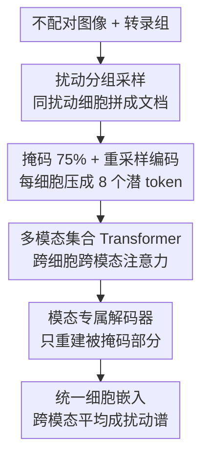

# PETRI: Learning Unified Cell Embeddings from Unpaired Modalities via Early-Fusion Joint Reconstruction

**会议**: ICLR 2026  
**OpenReview**: [https://openreview.net/forum?id=Vu8YXDooG5](https://openreview.net/forum?id=Vu8YXDooG5)  
**代码**: 待确认（作者承诺公开代码与脱敏 HepG2 数据集）  
**领域**: 计算生物学 / 单细胞多模态表示学习  
**关键词**: 单细胞、多模态、早融合、掩码联合重建、扰动筛选

## 一句话总结
PETRI 把扰动相同的一批细胞当成一篇"多模态文档"，用早融合 Transformer 对掩码后的图像与转录组做联合重建，无需细胞级配对就能学到统一的细胞嵌入，在恢复已知基因关系上显著超过单模态与晚融合基线。

## 研究背景与动机
**领域现状**：高通量扰动筛选有两条互补的技术路线——Perturb-seq 用 CRISPR 扰动加单细胞 RNA 测序读出全转录组效应，光学池化筛选（OPS）用便宜的荧光显微镜读出形态学表型。二者从不同角度刻画"扰动如何重塑细胞状态"，把它们整合起来有望把真正的生物信号从各自的技术噪声里分离出来。

**现有痛点**：现有多模态嵌入方法要么要求模态在细胞级别配对，要么无法在端到端框架里同时保留"共享信息"和"模态特有信息"。但单细胞测定大多是破坏性的，同一个细胞无法既测形态又测表达，**细胞级配对在物理上不可得**；而且形态和表达只部分重叠，模型必须在两个模态信号不一致甚至矛盾时仍然稳健。

**核心矛盾**：CLIP 这类对比方法看似自然，却恰恰不适合这个场景——它依赖大量负样本里能区分出强正样本对，但本数据集独特处理只有约 2200 种，且两个模态没有显式重叠的特征，对比学习无从下手。

**本文目标**：在没有配对、且跨模态互信息可能很弱的前提下，学到一个统一的细胞潜空间，既能整合共享信号、又能保留各自特有的表型线索。

**切入角度**：作者借鉴处理"混合模态文档"的视觉语言模型——网页这类文档里的图文只靠共同主题对齐，主题这个上下文增加了发现跨模态关联的机会。PETRI 把"扰动"当作主题，把一批受同一扰动的细胞拼成一篇文档。

**核心 idea**：核心假设是"在某个扰动下被富集、且两个模态都能看到的细胞表型，会提供互信息来改善被破坏数据的重建"。于是用按上下文分组的掩码联合重建，让跨模态注意力在重建有利时自发出现，从而不需要任何显式跨模态损失就完成对齐。

## 方法详解

### 整体框架
PETRI 是一个早融合的自监督 Transformer，输入是**不配对**的细胞图像和转录组，输出是统一潜空间里的细胞嵌入。整条流水线分四步：先按扰动把细胞分组、采样成集合（文档）；再用模态专属编码器把每个细胞的图像 patch 或基因 token 掩码 75% 后，重采样压缩成固定数量的少量潜 token；接着把同一文档里所有细胞、两个模态的潜 token 拼成统一序列，送进多模态集合 Transformer（MST）做跨细胞、跨模态注意力；最后按模态拆回，用各自的解码器只重建被掩码的部分。

这里有一个绕不开的技术障碍：一个细胞就有几百个图像 patch token 或几千个基因 token，一篇文档拼起来序列会爆炸。PETRI 的解法是**激进的 token 重采样**——把每个细胞蒸馏成固定的少量潜 token（实验里每细胞 8 个），从而能灵活扩展文档里的细胞数。

### 关键设计

**1. 扰动文档：用共享实验上下文替代细胞级配对**

针对"细胞级配对物理上不可得"这个痛点，PETRI 不再把每个模态实例当成配对里的一项，而是按实验上下文（主要是扰动，如某条 sgRNA，或扰动与化学背景的组合）把细胞分层成组，每组对每个模态有放回地采样 $S$ 个细胞，拼成一篇"多模态文档"。这样对齐不再发生在细胞之间，而是发生在**主题（扰动）之间**——同一扰动富集的表型会在两个模态里同时出现，给模型提供可利用的互信息。这是整套方法成立的前提：当模态间没有互信息甚至矛盾时，模型只会学到不去注意另一个模态，退化成单模态，不会被拖累。

**2. Per-cell 重采样编码器：把长序列压成固定的少量潜 token**

文档思路虽好，却带来序列长度爆炸。PETRI 给每个模态配专属的重采样编码器：训练时每个细胞随机掩码 75% 的 token（图像 patch 或基因）并移除。图像侧沿用 ViT，把 $L$ 个可学习潜 token（$L \ll N$）拼到 $N$ 个 patch token 后，过 Transformer 块后只保留 $L$ 个潜 token 作为该细胞的图像表示。转录组侧因为输入是几千个基因、标准 Transformer 算不动，改用 **Perceiver** —— 它交替用 cross-attention 做重采样、用 self-attention 只在潜 token 上算，天然契合"激进重采样"的需求；基因表达先把可学习基因嵌入和它的 log count 经两层 MLP 融合成 token，同样保留 $L$ 个潜 token。两个模态都被压成 $(L, D)$ 的固定表示，文档长度因此可控。

**3. 多模态集合 Transformer（MST）：早融合发生在这里**

编码器输出形如 $(G \times S, L, D)$ 的张量（$G$ 组、每组 $S$ 个细胞、$L$ 个潜 token、维度 $D$）。MST 把它 reshape 成 $(G, S \times L, D)$，再把两个模态沿 token 维拼接成 $(G, 2 \times S \times L, D)$ 的统一序列，过若干标准 Transformer 块，让**跨模态、跨细胞**的注意力自由发生，之后按模态拆回 $(G \times S, L, D)$ 去解码。这是早融合的核心：信息共享集中在 MST 里完成。一个反直觉但关键的发现是，下游用的细胞嵌入**取自 MST 之前的编码器输出**——MST 的跨模态注意力倒逼上游编码器产出彼此对齐、兼容的 token，但越靠近解码器 token 越专门化于当步重建任务，所以最佳的下游嵌入反而在 MST 之前。这也意味着训练好的图像与表达编码器可以**各自独立**在推理时用，去嵌入没有配对的筛选数据。

**4. 模态专属解码器与掩码重建损失：只对被掩码部分算损失**

最后一步从处理过的潜 token 重建原始输入，逼迫潜 token 编码细胞的完整信息。图像解码器改自 MAE：由于潜 token 不绑定具体 patch 位置，把它们与一整排 $N$ 个可学习 mask token 拼接，解码器据此重建被掩码 patch，损失是**只对被掩码 patch 像素**算的 MSE。转录组解码器把每个细胞的潜 token 做 mean-pool 后过三层 MLP 输出每个基因的值：有原始 counts 时对基因维做 softmax、用负二项分布的负对数似然作损失；若重建 log-normalized counts 则用 MSE；同样只对**被掩码基因**算损失。"只重建被掩码部分"是这套联合重建提供学习信号的关键——当跨模态信息能降低被破坏数据的重建误差时，模型才会去用它。

### 评估指标
PETRI 用两个基于遗传处理元数据的指标评估聚合嵌入：

- **Guide Consistency（GC）**：CRISPR 筛选里多条 sgRNA 靶向同一基因、应诱导相似表型。对每个靶基因内的 guide 平均嵌入算 cosine 相似度，和同基数的无关 sgRNA 经验零分布比较，报告"经多重检验校正后 guide 相似度显著（$p<0.05$）的靶基因比例"。
- **StringDB 边分类**：用 StringDB 里物理互作的基因对当真值做零样本分类，对聚合靶基因嵌入算 pairwise cosine 相似度当作伪分类概率，取 ROC 上 5% FPR 处的 TPR。作者预期这个指标偏难，因为 StringDB 既非细胞也非表型特异，很多单基因扰动效应很弱。

聚合前先相对每个 replicate 对照做 robust center scale，并做不降维的 PCA 与白化；多模态扰动谱由"先在模态内平均细胞嵌入、再跨模态平均"得到。

## 实验关键数据

### 主实验
在两个数据集上评估：**HepG2**（匹配扰动，OPS + Perturb-seq，569 个 CRISPR knockout、4 种化学背景、约 200 万细胞）和 **Perturb-Multi**（匹配细胞，小鼠肝脏 MERFISH + 蛋白染色图像，203 个 knockout）。对比单模态强预训练模型（scGPT、DINOv2）、模态专属 MAE、各种晚融合、以及 CLIP 早融合基线。

| 数据集 | 指标 | PETRI | 最强单/晚融合基线 | 说明 |
|--------|------|-------|------------------|------|
| Perturb-Multi | GC | **0.208** | 0.059（TrP MAE / scGPT） | 大幅领先 |
| Perturb-Multi | StringDB | **0.260** | 0.109（TrP MAE） | 大幅领先 |
| HepG2 | GC | **0.278** | 0.304（PCA on 表达） | 唯一例外：PCA 的 GC 略高但 StringDB 远低 |
| HepG2 | StringDB | 0.242 | 0.219（Max Cos. 晚融合） | 接近，PETRI 综合最优 |

StringDB 的 ROC 曲线显示 PETRI 在所有 FPR 处都比单模态 MAE 更能检出 StringDB 边（HepG2: PETRI AUC=0.628 vs ViT MAE 0.549 / TrP MAE 0.556）。CLIP 早融合表现甚至差于晚融合——作者训练 ViT 直接从蛋白图像回归 mRNA，发现 80% 的 mRNA 预测 $r^2<0.20$（均值 0.117），说明两个模态关系不够紧密，对比学习站不住脚。

### 消融与分析

| 配置 | 关键发现 | 说明 |
|------|---------|------|
| PETRI vs 置换数据 | 结果大体相当 | 置换打乱扰动分组、抑制跨模态学习，PETRI 仍稳健是正面结果 |
| 嵌入位置（MST 前 vs 后） | MST 前的编码器输出更适合下游 | MST 负责对齐，但 token 越近解码器越任务专门化 |
| BODIPY 重建消融 | 给同扰动的表达 token 后图像重建 MSE 下降 | 直接证明 PETRI 内部做跨模态预测 |
| SAE 多模态维度 | PETRI 298 个 vs 置换 0 个、CLIP 1 个 | 早融合真正在潜空间对齐了模态 |

### 关键发现
- **联合重建确实在内部用跨模态信息**：选 BODIPY 通道（脂滴染色），用强度阈值专门掩掉含脂滴的 patch；给同一对照扰动的表达 token 后，被掩码区域的预测 BODIPY 强度上升、重建 MSE 下降；换成已知会减少脂滴的对照扰动表达，强度则下降——效果符合生物学预期，且置换数据模型上不出现。
- **早融合带来真正的多模态概念**：用 BatchTopK 稀疏自编码器（15360 维、$K=500$）分解嵌入，定义在图像和转录组里都被 10–90% 细胞激活的维度为"多模态维度"，PETRI 得到 298 个，置换模型 0 个、CLIP 1 个；用这 298 维预测 OPS 孔位身份显著更差（$p<0.001$），说明它们更少编码孔位特异的技术伪影。
- **概念可解释且贴合生物学**：298 维里 127 维在至少一个图像特征和一个 GO term 上显著；按关键词检索出与细胞周期、脂代谢、线粒体活性相关的维度，对应图像确实呈现 DNA 复制、胆固醇稳态、有氧呼吸等可解释表型。

## 亮点与洞察
- **"扰动当主题、细胞当文档"是把配对问题转成上下文对齐的巧妙换框**：它绕开了破坏性测定无法细胞级配对的硬约束，把跨模态关联的发现交给共享上下文，可迁移到任何"两个模态只靠共同实验条件松散对齐"的场景。
- **不需要任何显式跨模态损失就能诱导对齐**：核心洞察是"按上下文分组的联合重建"本身就能逼出有意义的多模态对齐，比堆 contrastive / 对齐正则更省心，也更稳健于弱/可变对齐。
- **训练时融合、推理时拆开**：MST 让编码器学到对齐的 token，但下游用 MST 前的嵌入、且编码器能独立部署去嵌不配对数据——这种"融合只为训练服务"的设计很值得借鉴。
- **置换数据稳健性当作正面结果**：当模态无互信息时模型自动学会不互相注意、退化成单模态，这条性质让方法对"模态可能不相关"的真实情况免疫。

## 局限与展望
- 作者指出现有代理指标（guide consistency、蛋白互作预测）虽能当 benchmark，却不足以刻画下游分析揭示的生物学结构，呼吁面向多模态表型筛选与治疗发现的、直接评估生物学效用的任务化评估框架。
- 跨模态学习对"实验上下文要匹配到多近"仍是开放问题；能否引入更多生物学先验（如按蛋白复合物或通路而非单一扰动组织文档）也未解。
- 方法虽为图像+表达设计，作者认为联合重建+上下文文档的内核可推广到其他组学模态，但本文未做验证；StringDB 在 HepG2 上的结果因数据原因不可完全复现。
- 自己的观察：跨模态降低重建损失的效果"零散（sporadic across cells）"，只在部分细胞出现，方法到底在多大比例细胞上真正发生融合、以及这对最终嵌入质量的贡献边界，文中量化有限。

## 相关工作与启发
- **vs CLIP / CellCLIP（对比早融合）**：他们靠强正负对做对比，本文按上下文分组做联合重建；当模态关系不够紧密（如蛋白图像难以回归 mRNA）时对比学习失效，PETRI 不依赖强正对因而更稳。
- **vs 晚融合（拼接 / cosine 聚合 / Cross-modal AE）**：晚融合在分别训练的嵌入上做后处理，本文在共享空间内早融合；PETRI 仅靠简单平均就比复杂晚融合更好地把单模态谱聚成多模态谱。
- **vs scVI / scGPT / DINOv2 等单模态表示**：它们各自在一个模态里学，本文统一两个模态的潜空间；PETRI 在 GC 与 StringDB 上普遍超过这些强预训练单模态基线。
- **vs MoCa / LLaVA 等 VLM**：借鉴了"混合模态文档 + 统一序列自注意力 + 去噪重建"的思路，但把"文档"重新定义为按扰动分组的细胞集合，迁移到了单细胞生物学场景。

## 评分
- 新颖性: ⭐⭐⭐⭐⭐ 把"扰动文档 + 掩码联合重建"用于不配对单细胞多模态，免显式跨模态损失，换框很彻底
- 实验充分度: ⭐⭐⭐⭐ 两数据集、多基线、置换对照、BODIPY 消融与 SAE 解释链条完整，但仅两个数据集、部分结果不可全复现
- 写作质量: ⭐⭐⭐⭐ 假设—方法—验证逻辑清晰，图表支撑充分
- 价值: ⭐⭐⭐⭐⭐ 解决了"不可配对"这一真实硬约束，并配套发布脱敏数据集，对多模态筛选社区价值高

<!-- RELATED:START -->

## 相关论文

- [\[ICLR 2026\] Learning Brain Representation with Hierarchical Visual Embeddings](learning_brain_representation_with_hierarchical_visual_embeddings.md)
- [\[ICLR 2026\] Clustering by Denoising: Latent Plug-and-Play Diffusion for Single-Cell Embeddings](clustering_by_denoising_latent_plug-and-play_diffusion_for_single-cell_embedding.md)
- [\[ICLR 2026\] Learning Explicit Single-Cell Dynamics Using ODE Representations](learning_explicit_single-cell_dynamics_using_ode_representations.md)
- [\[ICLR 2026\] Doloris: Dual Conditional Diffusion Implicit Bridges with Sparsity Masking Strategy for Unpaired Single-Cell Perturbation Estimation](doloris_dual_conditional_diffusion_implicit_bridges_with_sparsity_masking_strate.md)
- [\[ICLR 2026\] FlexRibbon: Joint Sequence and Structure Pretraining for Protein Modeling](flexribbon_joint_sequence_and_structure_pretraining_for_protein_modeling.md)

<!-- RELATED:END -->
