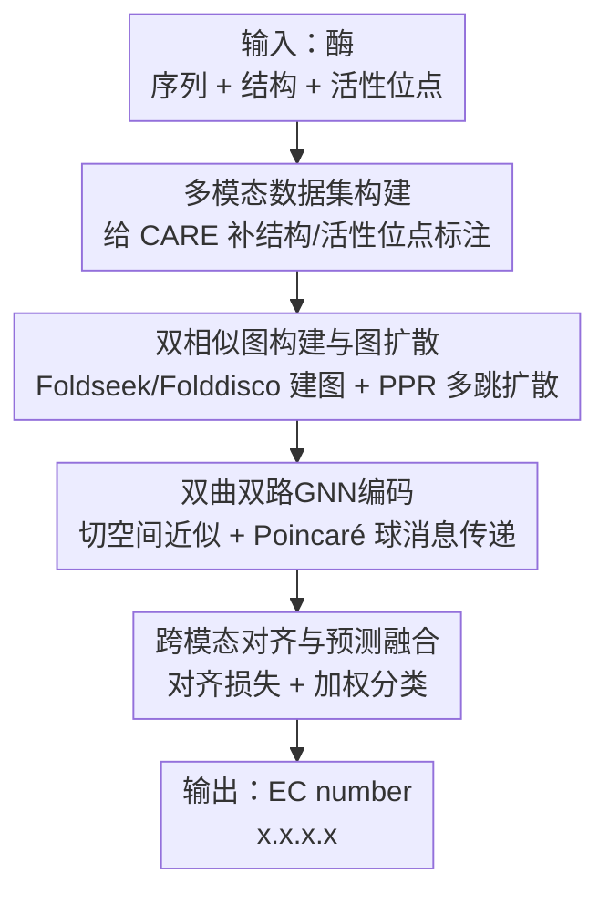

# PoinnCARE: Hyperbolic Multi-Modal Learning for Enzyme Classification

**会议**: ICLR2026  
**OpenReview**: [https://openreview.net/forum?id=dGxAYNK6JU](https://openreview.net/forum?id=dGxAYNK6JU)  
**代码**: https://github.com/kkkkk001/PoinnCARE  
**领域**: 计算生物学 / 酶功能预测  
**关键词**: 酶分类、EC number、双曲空间、多模态学习、图扩散

## 一句话总结
PoinnCARE 把酶的序列、结构、活性位点三种模态投影到双曲（Poincaré 球）空间里联合编码与对齐，用图扩散补全稀疏的活性位点标注、用双曲几何忠实保留 EC 编号系统的树状层级，在 CARE 基准四个测试集上的 EC number 预测全面超过 12 个 SOTA，level-4 最高领先 CLEAN 10.4%。

## 研究背景与动机
**领域现状**：酶的功能用 EC number（Enzyme Commission，四位编号 `x.x.x.x`）刻画——从第 1 位的 7 个大类逐级细化到第 4 位的 4900+ 个具体反应，本质是一棵树。主流的 EC number 预测方法要么靠序列比对（BLASTp），要么用对比学习把酶嵌到欧氏空间里做最近邻检索（CLEAN 用 triplet margin loss 是这一路的代表）。

**现有痛点**：两个硬伤。其一，EC 系统是层级树，而几乎所有方法都把酶塞进**欧氏空间**——树的节点数随深度指数增长，欧氏球体积只随半径的 n 次方增长，这个增长率错配意味着想低失真地嵌树必须用很高维度，低维下会严重畸变，直接拖累细粒度（level-4）准确率。其二，现有方法几乎只用序列信息，**忽略了结构和活性位点**，而恰恰是活性位点残基的三维排布决定了底物结合与催化特异性；活性位点残基在序列上常常是离散散落的，光看序列根本对不上。

**核心矛盾**：层级几何与表示空间不匹配（树 vs 欧氏），叠加决定功能的关键模态（活性位点）既重要又稀缺——UniProt 里实验验证过的活性位点标注只覆盖一小撮酶，结构和活性位点之间存在严重的模态不平衡。

**本文目标**：(1) 给只有序列的 CARE 基准补上结构与活性位点标注；(2) 缓解活性位点标注稀疏；(3) 找一个能忠实承载 EC 树层级的表示空间。

**切入角度**：作者用 Gromov 的 $\delta$-hyperbolicity 量化了 EC 系统的"树性"——训练集 $\delta=0.01$、测试集 $\delta=0.00$（随机拓扑分别是 0.92 / 0.73），$\delta$ 越接近 0 越像树。这说明 EC 系统天然适合负曲率的双曲空间，而双曲球体积随半径指数增长，正好匹配树的指数膨胀。

**核心 idea**：把序列/结构/活性位点三模态用图扩散补稀疏后，投到双曲空间用双路 GNN 编码并跨模态对齐——用"对的几何"装"对的层级"，再补齐"对的模态"。

## 方法详解

### 整体框架
PoinnCARE 输入是一个酶的多模态元组 $(q_x, s_x, a_x)$（序列、结构、活性位点），输出是它的 EC number（多类多标签——一个酶可能催化多个反应，对应多个 EC 号）。整条管线分三段：**先补数据**（给 CARE 基准加结构和活性位点标注）→ **再补拓扑**（对结构、活性位点两个模态各建一张相似图，用图扩散把稀疏连接补成多跳加权图，缓解标注稀疏）→ **最后补几何**（把两张增强图喂进两个独立的双曲 GNN，在 Poincaré 球里编码以保留 EC 树层级，并用对齐损失拉近同一个酶在两模态下的表示，最后加权融合两模态的分类预测）。三段层层递进，分别治"数据缺、连接疏、几何错"三个病。

### 关键设计

**1. 多模态数据集构建：把只有序列的 CARE 补成三模态**

针对"现有方法只用序列、忽略决定催化特异性的结构与活性位点"这个痛点，作者首先做的是数据层面的扩容。原始 CARE 基准（来自 Swiss-Prot，含实验验证的四位 EC 标注）只有序列。PoinnCARE 给每个酶补两类信息：**结构**取自 PDB 实验结构或 AlphaFold2/ESMFold 预测结构（覆盖面广）；**活性位点**取自 UniProt 中标注"直接参与催化的残基"。关键洞察是图 3 展示的现象——两个酶可以共享相同 EC 号和相同活性位点，却有完全不同的序列与全局结构（活性位点残基在序列上散落、其局部结构也偏离全局结构分布），所以活性位点提供了序列和结构都给不出的互补信号。但活性位点标注稀缺造成结构、活性位点两模态严重不平衡，这正是后两个设计要解决的。

**2. 双相似图构建与图扩散：用多跳传播补回稀疏的活性位点连接**

针对活性位点标注稀疏、直接连接太少的问题，本设计在结构和活性位点两个模态上各建一张酶-酶相似图，再用图扩散把稀疏图补稠。结构图用 **Foldseek**：它通过 VQ-VAE 把三维结构离散成"结构字母"，把 3D 结构比对降成 1D 序列比对，得到相似度 $\text{sim}^s(x_i,x_j)$，超过阈值 $\delta_s$ 就连边，得图 $G^{(s)}$。活性位点图用 **Folddisco**：基于倒排索引快速检索活性位点局部 motif，若 $x_j$ 中存在与 $x_i$ 活性位点几何与氨基酸类型相似的局部 motif，则算相似度 $\text{sim}^a(x_i,x_j)$，超阈值 $\delta_a$ 连边，得图 $G^{(a)}$。建完图后用**图扩散**聚合多跳邻居把拓扑补全：

$$A'_s = \sum_{k=0}^{\infty} w^s_k P_s^k, \qquad A'_a = \sum_{k=0}^{\infty} w^a_k P_a^k$$

其中转移矩阵取 $P_a = D_a^{-1}A_a$、权重取 $w^a_k = \alpha_a(1-\alpha_a)^k$ 并截断到有限跳 $L_a$，这正是个性化 PageRank（PPR）分布。扩散后的 $A'_s, A'_a$ 是带权有向图，边权同时反映直接连接和多跳间接连接的强度——稀疏标注下原本孤立的酶，借由多跳路径也能拿到功能相近邻居的信息，缓解了数据稀疏。这里全程遵守 inductive 设定：训练时只能看到训练酶之间的关系，测试酶到推理才接入。

**3. 双曲双路GNN编码：在 Poincaré 球里做消息传递以保层级**

针对"欧氏空间嵌 EC 树会高维畸变"的痛点，本设计把两张增强图分别送进两个独立的双曲 GNN。难点在于线性变换、邻居聚合、非线性激活这套标准 GNN 操作在双曲空间里不能直接用，作者采用**切空间近似**：在某点 $x$ 的切空间 $T_x\mathcal{B}^n_\kappa$（与欧氏空间同构）里做标准操作，再用指数映射 $\exp_x$ 映回双曲空间、对数映射 $\log_x$ 做逆操作。具体地，双曲下的矩阵乘与偏置平移写成 $W\otimes x = \exp_o(W\log_o(x))$、$x\oplus b = \exp_x(PT_{o\to x}(b))$；第 $l$ 层先变换 $h^{(l)'}_i = (W\otimes h^{(l)}_i)\oplus b$，再聚合：

$$h^{(l+1)}_i = \delta\!\left(\exp_o\Big(\sum_{j\in N(i)} a_{ij}\,\log_o\big(h^{(l)'}_j\big)\Big)\right)$$

聚合权重 $a_{ij}$ 取归一化拉普拉斯，初始特征 $h^{(0)}_i$ 用蛋白质语言模型（如 ESM）的嵌入。两个模态各跑一个双曲 GNN：$H^{(s)} = f^{(s)}_{hyp}(A'_s, H^{(0)})$、$H^{(a)} = f^{(a)}_{hyp}(A'_a, H^{(0)})$。双曲 GNN 相比欧氏只多 $O(nd)$ 的额外开销（总复杂度从 $O(mnd)$ 到 $O(mnd+nd)$），但换来的是低维下对树状层级的忠实保留——理论上双曲空间在 $\geq 2$ 维就能做到 $1+\epsilon$ 失真嵌树（定理 1），欧氏需要 $O(\log n)$ 维且 $O(\log n)$ 失真。

**4. 跨模态对齐与预测融合：拉近同一酶的两模态表示并加权出 EC 号**

结构图和活性位点图各自编码后，还需让同一个酶在两模态下"说同一种语言"。本设计用对齐损失最小化两模态表示的分歧：

$$\mathcal{L}_{align} = \|H^{(s)} - H^{(a)}\|_F^2 + w_d\big(\|I - H_{(s)}^\top H_{(s)}\|_F^2 + \|I - H_{(a)}^\top H_{(a)}\|_F^2\big)$$

第一项最大化两模态表示的相关性、捕捉跨模态不变性；后两项是去相关正则，防止学到退化（坍缩）的嵌入，$w_d$ 控制去相关权重。最终预测是两模态各自分类器的加权和（trade-off 参数 $\beta_s, \beta_a$）：$\hat{Y} = \beta_s f^{(s)}_{clf}(H^{(s)}) + \beta_a f^{(a)}_{clf}(H^{(a)})$。整体目标把对齐损失和交叉熵联合优化：$\mathcal{L} = \mathcal{L}_{align} + \gamma \mathcal{L}_{ce}$。这一步把"结构看全局形状、活性位点看催化关键残基"两路互补信息真正融起来，消融显示模态对齐相比只用结构图在 level-4 还能再涨 2.6%。

### 损失函数 / 训练策略
总损失 $\mathcal{L} = \mathcal{L}_{align} + \gamma\mathcal{L}_{ce}$：对齐损失 $\mathcal{L}_{align}$（相关项 + 去相关正则）负责跨模态一致性，交叉熵 $\mathcal{L}_{ce}$ 负责 EC 分类，$\gamma$ 平衡两者。训练遵循 inductive 范式（只见训练酶及其内部关系），并按 CARE 推荐做 50% 序列聚类增加训练多样性；初始特征来自 ESM 等 PLM。

## 实验关键数据

### 主实验
在 CARE 基准的四个测试集（低同源 <30%、中同源 30-50%、历史误标 Price、多功能 Promiscuous）上与 12 个 SOTA（相似性检索、对比学习、通用蛋白 PLM、蛋白问答 LLM 四类）比 EC 准确率。PoinnCARE 平均排名几乎全为第 1。

| 测试集 / level-4 准确率 | 本文 PoinnCARE | 次优基线 | 提升 |
|--------|------|------|------|
| <30% Identity (level-4) | **0.648** | CLEAN 0.535 | +10.4% |
| 30-50% Identity (level-4) | **0.822** | CLEAN 0.798 | +2.4% |
| Promiscuous (level-4) | **0.785** | CLEAN 0.691 | +9.4% |
| Price (level-1/2/3) | 0.955/0.909/0.827 | — | +1.7/3.1/3.0% |

低同源场景（<30%）领先最显著，正说明序列信息失效时结构 + 活性位点 + 双曲层级的价值。值得注意的旁证：Folddisco 只用活性位点几个残基就达到了 BLASTp 用上百残基的水平，印证了活性位点对判定功能的关键作用。

### 消融实验
自底向上从朴素 MLP 逐步加组件（图 7，<30% 测试集 level-4 准确率）：

| 配置 | 关键变化（level-4） | 说明 |
|------|---------|------|
| MLP | 基线 | 朴素分类器 |
| +Hyperbolic | +9.3% | 转入双曲空间，单这一步贡献最大 |
| +Active site | 进一步提升 | 加活性位点相似图 |
| +Structure | 进一步提升 | 加结构相似图 |
| PoinnCARE (full) | 比仅结构再 +2.6% | 加模态对齐融合两模态 |

### 关键发现
- **双曲几何是第一贡献**：MLP→双曲单步就涨 9.3%（level-4），证明"换对几何"比堆模态更关键；作为通用框架接 ESM2/ProtT5/ESMc 时，仅转双曲就分别涨 10.6%/11.8%/19.0%，接入完整框架再多涨最多 8.2%。
- **低维鲁棒性**：维度从 512 降到 32，CLEAN 的 level-4 准确率从 0.535 暴跌到 0.354（掉 18.1%），PoinnCARE 在 32 维仍有 0.597——印证定理 1 说的双曲低维低失真。
- **模态互补**：活性位点和结构各有增益，模态对齐把两者融起来再涨 2.6%，说明两模态确实捕捉了互补信号而非冗余。

## 亮点与洞察
- **用 $\delta$-hyperbolicity 先验证"该不该用双曲"再用**：先测得 EC 树 $\delta\approx 0$ 才上双曲空间，把"几何选择"从拍脑袋变成可量化的归纳偏置判断——这套"先测树性再选几何"的方法论可迁移到任何带层级 taxonomy 的分类任务（基因本体、物种分类、知识图谱层级）。
- **活性位点作为独立模态的引入很巧**：图 3 那个"同 EC 同活性位点、不同序列不同结构"的反例直接点明了为什么序列和结构都不够、为什么活性位点是正交信号，动机非常具体。
- **图扩散治标注稀疏**：用 PPR 多跳传播补回活性位点的稀疏连接，是把"数据稀缺"问题转成"图拓扑补全"问题的漂亮转换，可复用到任何标注不平衡的多模态生物数据。
- **即插即用框架**：PoinnCARE 可包在不同序列编码器（ESM2/ESMc/ProtT5）外面普涨，说明双曲 + 多模态的收益与底座 PLM 解耦。

## 局限与展望
- **活性位点标注仍是瓶颈**：方法靠图扩散缓解稀疏，但活性位点真值覆盖率低这个根本数据问题没被解决，扩散是"补"不是"造"，对完全无标注的酶仍受限。
- **Price 测试集 level-4 偏弱**：在历史误标 Price 集上 level-4 (0.349) 仅与次优持平、未拉开，说明对极难/被误标样本细粒度判定仍吃力。
- **超参较多**：阈值 $\delta_s,\delta_a$、扩散系数 $\alpha,L$、模态权重 $\beta_s,\beta_a$、曲率 $\kappa$、对齐/去相关/CE 三项权重都需调，部署到新数据集的调参成本不低。
- **可改进方向**：把活性位点预测（而非仅检索现有标注）纳入端到端、或引入更多模态（如表面 surface，ProteinF3S 路线）做三模态以上对齐。

## 相关工作与启发
- **vs CLEAN / CLEAN-Concat**: CLEAN 用 triplet 对比在欧氏空间做酶检索，CLEAN-Concat 加了 ResNet 编码接触图的结构信息；PoinnCARE 区别在于换到双曲空间保层级、且显式引入活性位点模态并做跨模态对齐，低同源和低维场景优势明显。
- **vs Foldseek / Folddisco**: 二者是结构/活性位点相似性检索工具，PoinnCARE 不是替代而是**复用**它们建相似图，再叠加图扩散 + 双曲 GNN 学表示，把"检索分数"升级成"可学习的层级感知嵌入"。
- **vs Top-EC / ProteinF3S**: 同样走多模态融合（结构、序列、表面），但都在欧氏空间；PoinnCARE 的核心差异是把多模态融合搬进双曲几何，用定理 1 论证低维低失真的优势。

## 评分
- 新颖性: ⭐⭐⭐⭐ 双曲几何 + 三模态（首次把活性位点作为独立模态）+ 图扩散补稀疏的组合在 EC 预测上是新的，单项技术多为已有
- 实验充分度: ⭐⭐⭐⭐⭐ 四测试集、12 基线、维度/通用框架/消融多角度，结论自洽
- 写作质量: ⭐⭐⭐⭐ 动机清晰、$\delta$-hyperbolicity 论证有说服力，方法部分公式密集略需对照原文
- 价值: ⭐⭐⭐⭐ 酶功能预测是实用任务，框架可即插即用、低维高效，对生物计算社区有直接价值

<!-- RELATED:START -->

## 相关论文

- [\[ICLR 2026\] OmniMouse: Scaling properties of multi-modal, multi-task Brain Models on 150B Neural Tokens](omnimouse_scaling_properties_of_multi-modal_multi-task_brain_models_on_150b_neur.md)
- [\[ACL 2025\] Align-Pro: Align Protein Representations Through Multi-Modal Learning](../../ACL2025/computational_biology/align-pro_align_protein_representations_through_multi-modal_learning.md)
- [\[CVPR 2026\] Deciphering Genotype-Phenotype Mechanisms from High-Content Profiling via Knowledge-Guided Multi-modal Graph Learning](../../CVPR2026/computational_biology/deciphering_genotype-phenotype_mechanisms_from_high-content_profiling_via_knowle.md)
- [\[CVPR 2026\] HyperST: Hierarchical Hyperbolic Learning for Spatial Transcriptomics Prediction](../../CVPR2026/computational_biology/hyperst_hierarchical_hyperbolic_learning_for_spatial_transcriptomics_prediction.md)
- [\[CVPR 2026\] Cross-Slice Knowledge Transfer via Masked Multi-Modal Heterogeneous Graph Contrastive Learning for Spatial Gene Expression Inference](../../CVPR2026/computational_biology/cross-slice_knowledge_transfer_via_masked_multi-modal_heterogeneous_graph_contra.md)

<!-- RELATED:END -->
