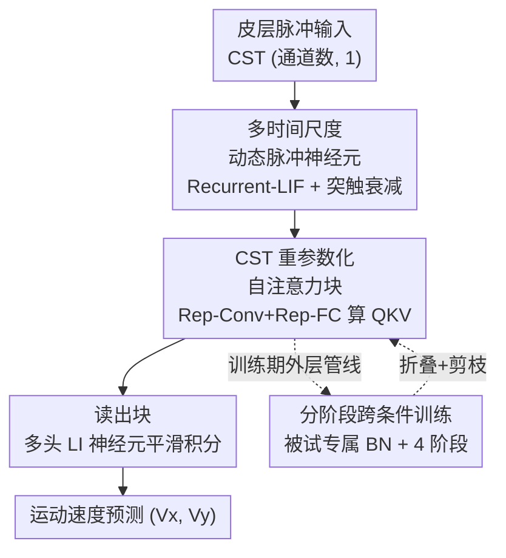

# Pretraining with Re-parametrized Self-Attention: Unlocking Generalization in SNN-Based Neural Decoding Across Time, Brains, and Tasks

**会议**: ICLR 2026  
**OpenReview**: [https://openreview.net/forum?id=ZsvGCzpaVD](https://openreview.net/forum?id=ZsvGCzpaVD)  
**代码**: https://github.com (论文称 "RAT SNN GitHub"，具体地址待确认 ⚠️ 以原文为准)  
**领域**: 计算神经科学 / 脉冲神经网络 / 脑机接口神经解码  
**关键词**: 脉冲神经网络, 重参数化自注意力, 脑机接口, 跨条件预训练, 低功耗解码

## 一句话总结
本文提出 RAT SNN——一个把"重参数化脉冲自注意力 + 多时间尺度脉冲神经元 + 分阶段跨条件预训练"捏在一起的轻量脉冲神经网络，用来从皮层脉冲序列解码运动意图，在仅 60 万参数、推理只用加法（AC）操作的前提下，做到媲美主流 ANN 解码器的精度，并能跨时间、跨被试、跨任务快速泛化，瞄准全植入式脑机接口（fully iBMI）的严苛功耗约束。

## 研究背景与动机
**领域现状**：植入式脑机接口（iBMI）通过皮层微电极阵列采集高保真神经信号，已能驱动机械臂控制、文本生成等应用。近期大规模神经活动数据集的出现，让人想训练能跨被试 / 任务 / 时间泛化的"神经解码基础模型"，代表工作如 POYO、NDT3 都走"堆数据 + 堆 Transformer"的路线。

**现有痛点**：这些 ANN 基础模型依赖大模型和大量算力，与"全植入式 iBMI"的现实冲突——全植入式接口去掉了体外接驳柱以降低感染风险、保护隐私并支持长期适配，但代价是对解码器的能耗、模型大小、延迟施加极其严苛的约束。同时，脉冲神经网络（SNN）虽然天生低功耗（用 accumulate-only 的 AC 操作替代 multiply-accumulate 的 MAC）、与离散脉冲序列（CST）天然契合，但现有 SNN 解码器架构太简单，要么精度不够，要么为了上注意力又掺进 MAC 操作（如 SNN3d、Spikachu 用 ANN harmonizer），背离了 SNN 的低功耗本质。

**核心矛盾**：高精度、强泛化、低算力三者难以同时满足——ANN 能精度和泛化但算力爆炸；纯 SNN 能省电但精度和泛化欠缺。根因在于神经活动存在内在变异性（inter-subject 差异、inter-task 差异、同一被试内的时间漂移 temporal drift），单一模型很难跨这些分布迁移；而要补偿变异往往又要加重模型。

**本文目标**：造一个同时满足"准、能泛化、省电"的 CST 解码器，并把它做成能跨时间/被试/任务的 SNN 基础模型原型。

**切入角度**：作者发现结构重参数化（structural re-parameterization，源自 RepVGG）对 SNN 特别有用——训练时可以用 BatchNorm 和多分支结构提升性能与收敛，推理时把这些结构折叠成单一线性连接，从而在神经元之间保持纯 AC 操作。这就让"训练期富表达 + 推理期纯加法"成为可能，恰好化解精度与能耗的矛盾。

**核心 idea**：用"重参数化的脉冲自注意力"替代笨重的 tokenizer 和深层 Transformer，配上多时间尺度脉冲神经元和按数据粒度逐级收窄的跨条件预训练流程，在纯 SNN（推理只用 AC）框架内拿到 ANN 级精度和跨条件泛化。

## 方法详解

### 整体框架
RAT SNN 是一个只有 4 层 LIF 神经元的紧凑解码器，每个时间步接收维度为 (CST 通道数, 1) 的皮层脉冲输入，输出二维前肢运动速度 $(V_x, V_y)$。它由两大模块串联：**CST 重参数化注意力块**负责提取时空特征，**读出块（readout block）** 把离散脉冲转成连续运动速度。围绕这条主干，论文塞进三个关键贡献：① 带递归连接的动态突触脉冲神经元（捕捉多时间尺度动态）；② CST 重参数化自注意力（训练高效、推理纯 AC）；③ 被试专属 BN + 分阶段跨条件训练框架（提升泛化）。

整体数据流是：脉冲输入 → 重参数化注意力块（内部用 Recurrent-LIF 神经元 + Rep-Conv/Rep-FC 算出 Q/K/V 并做线性注意力）→ 读出块（多头 LI 神经元平滑积分）→ 运动速度预测。而模型的"成长"靠外层的四阶段训练管线：从最宽的跨条件预训练，逐级收窄到跨会话重训、单会话微调，最后做可选的轻量化微调（重参数折叠 + 剪枝）。

### 关键设计

**1. 多时间尺度动态脉冲神经元：用递归 LIF + 突触衰减抓住神经活动的快慢节律**

神经活动横跨多个时间尺度，普通前馈 LIF 神经元只有膜电位的单一漏积分，记不住长程节律。本文把基本单元升级为 **Recurrent-LIF**：在标准 LIF 离散动力学（膜电位 $H[t]=\alpha V_{mem}[t-1]+V_{syn}[t-1]$，超过阈值 $V_{th}$ 经 Heaviside 函数发放脉冲 $S[t]$ 后复位）的基础上，给突触电位引入递归连接和独立衰减：

$$V^l_{syn}[t]=\sum_{i} f^l_{op_i}(S^u_i[t]) + f^l_{Rec}(S^l[t-1]) + \beta^l V^l_{syn}[t-1]$$

其中 $f^l_{op}$ 是来自上游脉冲 $S^u$ 的前馈连接（$i$ 标记不同分支），$f^l_{Rec}$ 是层内递归连接（用重参数化风格的全连接实现），$\beta<1$ 是突触衰减因子。递归 FC 在层内形成自循环动态，配合层间连接，模拟了生物神经系统里"长程投射通路 + 局部微环路"共存的结构；同时层内神经元保持异质性（heterogeneity），让不同神经元天然覆盖不同时间常数。读出块则用 5 个头、每头 2 个 LI（Leaky Integrator，无发放机制的 LIF）神经元，把离散脉冲 $S[t]$ 平滑积分成连续速度，对应肌群平滑运动的特性。

**2. CST 重参数化自注意力：线性注意力 + Conv/FC 双路 + 代理捷径，浅而准的纯脉冲注意力块**

直接照搬脉冲 Transformer 会带来两个麻烦：注意力复杂度高、网络太深反而损害 CST 解码精度和实时性。本文做了三处改造。其一，利用 SNN 的二值特性把注意力从 $O(n^2 d)$ 降到 $O(nd^2)$ 的线性注意力（$n\gg d$），即 $\text{Attention}_{si}=\text{RLIF}((Q_{si}K_{si}^T)V_{si})=\text{RLIF}(Q_{si}(K_{si}^T V_{si}))$，并把注意力输出接进 Recurrent-LIF 的时序动态里。其二，考虑到电极通道索引不连续、被试间差异大，Q/K/V 由并行的 Conv 和 FC 两路相加得到——FC 抓全局特征、Conv 抓 CST 通道间的局部特征：$Q_s/K_s/V_s=\text{RLIF}(\text{Rep-Conv}(X_{CST})+\text{Rep-FC}(X_{CST}))$。其三，把脉冲 Transformer 经典的 5 层 MLP+输出层合并、压到 3 层，并用"代理捷径（surrogate shortcut）"替换膜电位捷径：$U_s=\text{RLIF}(\text{Attention}_s+\text{Rep-FC}(X_{CST}))$。代理捷径还顺带让注意力输出维度可以大于 $n\times d$（即 MLP Size 可调），不增加深度就提升了表达力。

**3. 结构重参数化（Rep-Conv / Rep-FC）：训练期富结构、推理期纯 AC 的关键开关**

这是让"训练性能"和"推理省电"两不误的核心机关。训练时，**Rep-Conv** 用多条并行分支（$1\times1$、$3\times1$、可选更大核、以及恒等映射看作 $0$ 核卷积），每条分支后接 BN：$\text{Rep-Conv}(X_c)=\sum_{i\in K}\text{BN}_i(W_i * X_c + b_i)$；**Rep-FC** 则是 $\text{Rep-FC}(X_f)=\text{BN}(WX_f)$。这些 BN 和多分支让训练更稳、收敛更快。推理时，BN 的统计量 $\mu_i,\sigma_i,\gamma_i,\beta_i$ 被吸收进卷积核与偏置（$W_i^{Rep}=\frac{W_i}{\sqrt{\sigma_i^2+\epsilon}}\gamma_i$，$b_i^{Rep}=\frac{b_i-\mu_i}{\sqrt{\sigma_i^2+\epsilon}}\gamma_i+\beta_i$，并把各分支核 padding 到最大核），多分支折叠成单一线性连接。折叠后神经元之间只剩纯线性运算，配合脉冲二值输入，推理就只需要 AC（加法）而无 MAC（乘加），严格守住 SNN 的低功耗本质。消融显示去掉重参数化后 $R^2$ 掉 17.16%、收敛 epoch 约多 3 倍——它既提性能又加速训练。

**4. 被试专属 BN + 四阶段跨条件训练框架：用一层轻量 BN 吸收跨被试漂移，逐级收窄到目标会话**

神经变异性使得"跨条件训好的模型直接迁到某个具体会话"往往泛化不佳。作者借重参数化之便，给每个条件分配一套独立的 BN（用它替代 POYO 那种重型 tokenizer），这层 BN 能无缝融进脉冲神经元间的线性运算、不增加推理开销。训练按数据粒度分四阶段逐级收窄：(a) **跨条件预训练**——在多被试/多任务上训，每个 epoch 按当前 batch 的被试身份动态切换对应 BN，从而吸收跨条件分布漂移；(b) **跨会话重训**——在目标条件的多会话数据上训，BN 固定到对应集合；(c) **单会话微调**——在目标会话上微调（只有单会话或做泛化实验时可跳过 (b) 直接微调）；(d) **可选轻量化微调**——先给每个 LIF 神经元加活动上界（AUB, activity upper bound）降低整体发放率，再做可选的迭代剪枝（掩掉最小的 $p$ 比例权重）+ 重训，进一步压低连接规模和算力。这套从宽到窄的安排，让模型先吃下广分布、再贴合具体会话。

### 损失函数 / 训练策略
解码目标是回归二维运动速度，以 $R^2$ 为主要评价指标。训练核心策略即上面的四阶段管线；轻量化阶段引入活动上界（AUB）正则发放率，并用迭代剪枝把 RAT SNN-CC 压成 RAT SNN-CC-P（参数从约 600K 进一步降到约 150K）。

## 实验关键数据

数据集整合了 6 只猴、103 个会话的 M1/PMd/S1 电生理记录，涵盖随机目标（RTT）、迷宫到达（MAZE）、中心向外（CO）三类任务。

### 主实验

NHP 数据集（$R^2\times100$）上，RAT SNN 在 SNN 阵营全面领先，并追平甚至超过主流 ANN：

| 模型 | Monkey I | Monkey L | 平均 |
|------|----------|----------|------|
| AEGRU (ANN) | 72.00 | 67.00 | 69.50 |
| POYO-CS (ANN) | 70.99 | 69.63 | 70.31 |
| bigRSNN-CS (SNN, 之前最好) | 70.89 | 68.70 | 69.79 |
| RAT SNN-SS（单会话） | 72.22 | 66.30 | 69.26 |
| RAT SNN-CS（跨会话） | 74.26 | 68.63 | 71.45 |
| **RAT SNN-CC（跨条件）** | 74.06 | **70.40** | **72.23** |

在 NLB RTT（Monkey I）上，RAT SNN-SS 拿到 76.34，已大幅超过在 11.8M 参数跨条件预训练的 POYO-1（73.78）；RAT SNN-CC 进一步到 78.70。这些精度只用约 600K 参数实现，远少于 bigRSNN（1.2M）和 POYO-SS（1.9M）。

### 消融实验

注意力块结构消融（Monkey C05，$R^2\times100$）：

| 配置 | C05 2022 | C05 2025 | 说明 |
|------|----------|----------|------|
| SDT SNN（经典脉冲 Transformer 块） | 80.09 | 65.21 | 基线 |
| RAT SNN-192（输出维=输入维） | 80.49 | 66.61 | 不放大输出维 |
| RepFC SNN-H1 / H3 | 81.09 / 79.47 | 66.26 / 65.74 | 纯递归 FC 基线 |
| **RAT SNN-SS（MLP size=512）** | **81.58** | **66.71** | 代理捷径放大输出维 |

重参数化消融（Monkey C05）：

| 配置 | $R^2\times100$ | 收敛 Epoch |
|------|----------------|------------|
| w/o re-param | 67.58 | 545 |
| **RAT SNN-SS** | **81.58** | **179** |

突触操作量对比（能耗代理）：

| 模型 | 有效 MAC | 有效 AC |
|------|----------|---------|
| POYO | 1,730,507 | 810,339 |
| bigRSNN | 0 | 42,003 |
| RAT SNN-CC | 0 | 65,307 |
| **RAT SNN-CC-P（剪枝后）** | **0** | **21,020** |

### 关键发现
- **重参数化是性能与收敛的双引擎**：去掉它 $R^2$ 直接掉 17.16%、收敛 epoch 约翻三倍，说明训练期的多分支 + BN 富结构对 SNN 训练稳定性至关重要。
- **代理捷径放大输出维确有收益**：RAT SNN-192（不放大）→ RAT SNN-512（放大）单调提升，验证"不加深度只调宽度"的设计有效。
- **纯 AC 推理且仍省电**：RAT SNN 推理零 MAC，剪枝版 RAT SNN-CC-P 只用约 21K AC、150K 参数，剪枝前后性能无显著差异（Wilcoxon test, p=0.3828）；考虑到 1 次 MAC 约耗 31 倍于 1 次 AC，其性能-能耗比远胜 POYO/AEGRU 等 ANN。
- **跨条件预训练能跨被试跨任务泛化**：即便迁到完全未见过的被试做未见过的任务（RTT-joystick），RAT SNN-CC 也比从头训收敛更快、性能更好。

## 亮点与洞察
- **"训练富、推理瘦"的解耦很优雅**：用结构重参数化把训练期的 BN/多分支折叠进推理期的单一线性层，让 SNN 既能享受现代训练技巧、又守住纯 AC 的低功耗承诺——这是把 RepVGG 思想迁到脉冲域并落到神经解码场景的漂亮一招。
- **用被试专属 BN 替代重型 tokenizer**：POYO 靠 UnitEmbed/tokenizer 处理跨被试差异，本文发现一层可被折叠的条件专属 BN 就能吸收分布漂移，几乎零额外推理开销，这个"轻量替换"思路可迁移到其他需要域适配的轻量模型。
- **按数据粒度从宽到窄的分阶段训练**：把"基础模型怎么落到具体个体"拆成跨条件→跨会话→单会话→剪枝四级，给资源受限场景的个体化适配提供了清晰范式。

## 局限与展望
- 实验全部在猴子运动皮层（M1/PMd/S1）解码二维运动速度，是否能推广到人类、其他脑区或更复杂的解码目标（如语言、高维操控）尚未验证。
- 论文反复强调"基础模型原型"，但数据规模（6 只猴、103 会话）相比 NLP/CV 基础模型仍很小，"scaling"特性是否成立未充分检验。
- 评估指标主要是 $R^2$ 与离线突触操作计数（NeuroBench），真实植入硬件上的功耗、延迟、长期稳定性尚未实测；AUB 与剪枝带来的精度-能耗权衡边界也可进一步刻画。
- 代码链接在缓存中仅以 "RAT SNN GitHub" 指代，具体可复现性待确认（⚠️ 以原文为准）。

## 相关工作与启发
- **vs POYO / NDT3**：它们走"堆 Transformer + 大数据 scaling"的 ANN 基础模型路线，靠 tokenizer/UnitEmbed 处理跨被试差异，但参数大、算力高（POYO 推理含百万级 MAC），难以全植入部署。本文用纯 SNN + 重参数化注意力 + 条件专属 BN，在零 MAC、约 1/3 参数下追平甚至超过它们的精度。
- **vs bigRSNN**：之前最好的 SNN CST 解码器，靠跨会话预训练但架构简单、未做成跨条件基础模型。RAT SNN 引入脉冲自注意力 + 多时间尺度递归神经元 + 四阶段跨条件训练，精度更高、参数更少（150K vs 1.2M）。
- **vs SNN3d / Spikachu**：SNN3d 为上性能掺进 MAC、Spikachu 用 ANN harmonizer 处理变异性，都引入大量 MAC 偏离了 SNN 本质。本文坚持推理纯 AC，是更"正统"的低功耗脉冲方案。

## 评分
- 新颖性: ⭐⭐⭐⭐ 把重参数化、脉冲注意力、多时间尺度神经元、分阶段跨条件预训练系统整合到 iBMI 神经解码，组合创新扎实
- 实验充分度: ⭐⭐⭐⭐ 多数据集、多被试、跨时间/被试/任务泛化 + 结构/重参数/能耗多角度消融，较全面；但规模偏小、缺真实硬件实测
- 写作质量: ⭐⭐⭐⭐ 动机与方法逻辑清晰，公式与架构图配套；部分符号（如 Rep-FC 折叠记号）略密
- 价值: ⭐⭐⭐⭐ 面向全植入式 iBMI 的"准 + 泛化 + 省电"原型，对低功耗神经解码落地有实际意义

<!-- RELATED:START -->

## 相关论文

- [\[ICLR 2026\] Animal behavioral analysis and neural encoding with transformer-based self-supervised pretraining](animal_behavioral_analysis_and_neural_encoding_with_transformer-based_self-super.md)
- [\[ICLR 2026\] Continuous Multinomial Logistic Regression for Neural Decoding](continuous_multinomial_logistic_regression_for_neural_decoding.md)
- [\[ICLR 2026\] CellDuality: Unlocking Biological Reasoning in LLMs with Self-Supervised RLVR](cellduality_unlocking_biological_reasoning_in_llms_with_self-supervised_rlvr.md)
- [\[ICLR 2026\] Only Brains Align with Brains: Cross-Region Alignment Patterns Expose Limits of Normative Models](only_brains_align_with_brains_cross-region_alignment_patterns_expose_limits_of_n.md)
- [\[ICLR 2026\] Decoding Dynamic Visual Experience from Calcium Imaging via Cell-Pattern-Aware Pretraining](decoding_dynamic_visual_experience_from_calcium_imaging_via_cell-pattern-aware_p.md)

<!-- RELATED:END -->
