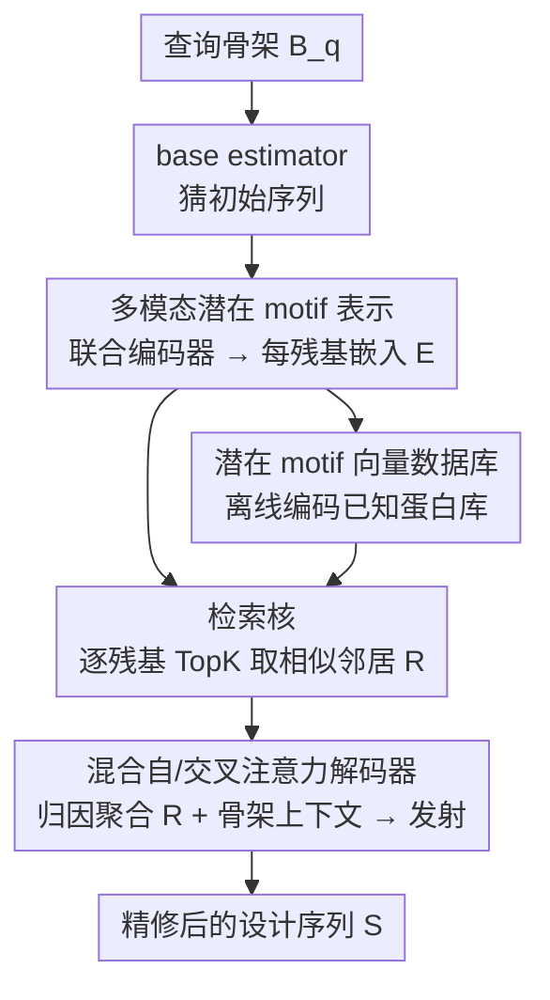

# PRISM: Enhancing Protein Inverse Folding through Fine-Grained Retrieval on Structure-Sequence Multimodal Representations

**会议**: ICLR 2026  
**OpenReview**: [https://openreview.net/forum?id=qsthLLlCtl](https://openreview.net/forum?id=qsthLLlCtl)  
**代码**: 无  
**领域**: 计算生物学 / 蛋白质设计 / 检索增强生成  
**关键词**: 逆折叠, 检索增强, 潜变量模型, 多模态表示, 蛋白质 motif

## 一句话总结
PRISM 把"检索增强生成（RAG）"搬进蛋白质逆折叠：先在已知蛋白库里为每个残基检索细粒度的结构-序列 motif 表示，再用一个混合自/交叉注意力解码器把这些检索到的局部片段融进骨架上下文，从而在几乎不增加推理开销（+14%）的前提下把 SoTA 的困惑度和氨基酸恢复率再往上推一截。

## 研究背景与动机
**领域现状**：逆折叠（inverse folding）要解决的是 AlphaFold 的反问题——给定一个三维骨架 $B$，设计能折叠成它的氨基酸序列 $S$。主流做法是把骨架建成残基级图 $G$，用图神经网络/Transformer 编码后逐残基预测概率 $P(S\mid B)=\prod_j P(S_j\mid B)$。代表工作有 ProteinMPNN、PiFold（高效编解码器），以及借助预训练蛋白语言模型的 LM-Design、DPLM、AIDO.Protein（参数量已到十亿级）。

**现有痛点**：这些模型都是"单体（monolithic）"编码器——所有知识被压进网络权重里。它们缺少一个**显式机制去复用那些在自然蛋白质里反复出现、且进化上保守的细粒度结构-序列模式（motif）**。同一段局部三维构象在不同蛋白里往往对应相似的局部序列，这种可迁移的"局部折叠规则"对稳定性和功能至关重要，但端到端生成模型只能隐式地、不可控地利用它。

**核心矛盾**：逆折叠本质是欠定问题——很多不同序列能折成同一个 fold，决定成败的常是局部细节。把全部"局部经验"塞进固定权重既难学全，也无法在推理时显式调用已知蛋白的多样性。

**本文目标**：给逆折叠加上一块"外部记忆"，让每个残基的预测能显式地被检索到的局部片段引导，同时保持理论自洽和计算高效。

**切入角度**：作者把"每个残基 + 其局部三维邻域"定义为一个 **potential motif（潜在 motif）**，当作可检索、可复用的基本单元。这样逆折叠就能从"纯生成"变成"生成 + 基于记忆的检索"。

**核心 idea**：在残基级（fine-grained）做多模态 RAG——检索潜在 motif 的嵌入，用混合解码器把它们与全局骨架上下文聚合，再发射精修后的序列。

## 方法详解

### 整体框架
PRISM 是一个**残基级的多模态检索增强生成框架**。它先用一个联合编码器把"结构+序列"编成每残基嵌入（这个嵌入本身就概括了该残基周围的局部 motif）；用这个编码器把整库已知蛋白离线编码成一个**潜在 motif 向量数据库**；推理时对查询蛋白先用现成逆折叠模型（base estimator）猜一版初始序列得到查询嵌入，再逐残基去库里检索 Top-K 个相似邻居；最后一个混合自/交叉注意力解码器把检索到的片段聚合进骨架编码，发射出精修的序列。

整篇方法被组织成一个**潜变量概率模型**：联合分布按"表示 → 检索 → 归因 → 发射"四步因子化
$$p(S,E,R,Z\mid B,D)=p(E\mid B)\,p(R\mid E,D)\,p(Z\mid R,E,B)\,p(S\mid Z,R,E,B)$$
其中 $E$ 是潜在 motif 表示，$R$ 是检索假设，$Z$ 是"检索到的邻居如何归因到各位点"的注意力变量。对潜变量做确定性近似（检索取 TopK、归因取注意力权重），整个目标就坍缩成标准的逐残基交叉熵——既有理论支撑又能落地。

### 关键设计

**1. 多模态潜在 motif 表示：让每个残基嵌入自带局部 motif 语义**

针对"单体编码器无法显式复用保守局部模式"这一痛点，PRISM 先要给检索准备一种**自包含的细粒度单元**。它把每个残基连同其局部三维邻域定义为一个 potential motif，用一个联合编码器 $G$ 同时吃结构和序列：$E=G(P)=G(B,S)\in\mathbb{R}^{L\times d}$，得到每残基嵌入 $E_i\in\mathbb{R}^d$。关键在于，$E_i$ 不只是"第 $i$ 个氨基酸"的表示，它已经把残基 $i$ 的局部三维邻域和它在全局蛋白中的位置都"上下文化"进去了，因此**同一个嵌入既能当检索的 query/key，又能直接参与序列发射**。论文用 AIDO.Protein-IF 作为联合编码器（多模态版本）；它还提供了一个只用结构编码器（ProteinMPNN-CMLM）的单模态变体 PRISM (str. enc.) 用来隔离"检索"与"多模态"各自的贡献。

**2. 潜在 motif 向量数据库：把已知蛋白的局部经验做成可检索的先验记忆**

逆折叠模型把局部折叠规则隐式塞进权重，既学不全也不可控。PRISM 的做法是把这块知识外置成一个**固定的先验记忆**：取 $M$ 个已知结构-序列对 $\{(B_p,S_p)\}$，每个都用式 $E=G(P)$ 编码，得到数据库 $D=\{(E^p_r,r,p)\}$，每条 $E^p_r$ 概括蛋白 $p$ 中残基 $r$ 周围的局部 motif。检索时按嵌入相似度找"度量空间里邻近的 motif"。实现上数据库用 CATH-4.2 训练集构建（与训练同源、按构造避免数据泄漏），且整个检索跑在 GPU 上，搜索时间被压到可忽略。一个有意思的设计取舍是：作者从理论（ε-coverage）和实验都证明，一旦库对 motif 空间近乎完整覆盖，**再往里加 PDB 新条目几乎不再涨点**（CAMEO 2022 上 AAR 始终约 64.6%），所以把它当"固定先验库"而非"不断膨胀的索引"是合理的。

**3. 检索核：用确定性 TopK 做高效近似、留出可训练随机核的接口**

潜变量公式里检索核是 $p(R\mid E,D)=\prod_i p(R_i\mid E_i,D)$。PRISM 给了两种实例化：最忠于图模型的是**可训练随机核**，对残基级邻居定义一个真正的分布、能学到检索先验（训练目标里多一项对摊还后验 $q(R\mid\cdot)$ 的 KL 正则）；而默认用的是**确定性 TopK 算子** $p(R_i\mid E_i,D)=\delta\!\big(R_i-\mathrm{TopK}(E_i;D)\big)$，用 Dirac 分布把检索固定为取 Top-K 邻居。两者出自同一模型类，只差"$R$ 怎么实例化"。确定性版本几乎不花算力（平均检索仅约 $1.2\times10^{-3}$ 秒/蛋白）却已能拿下 SoTA，可训练版本则是更表达力的升级路径。消融显示 $K$ 越大 PPL 越低但很快饱和，$K\!\ge\!35$ 后稳定在约 2.681，所以取 $K=35$。

**4. 混合自/交叉注意力解码器（MHSCA）：让检索片段既被"吸收"又被"互相精修"**

检索只给出候选，不告诉模型"怎么用"。PRISM 用 $T$ 个混合 Transformer 块构成的聚合-生成模块 $F_{\theta_Z}$ 实现**归因**：每个头算注意力权重 $\alpha^{(t,h)}_{ik}=\mathrm{softmax}_k\big(\langle q^{(t,h)}_i,k^{(t,h)}_{ik}\rangle/\sqrt{d_h}\big)$，把它视作确定性归因 $Z=A(R,E,B)$。最终对每残基输出 logits $Y(E,B,R)=F_{\theta_Z}\!\big(F_{\theta_B}(B),E,R\big)\in\mathbb{R}^{L\times20}$，发射分布按 $p(S\mid\cdot)=\prod_i \mathrm{Cat}\big(S_i;\mathrm{softmax}(Y)_i\big)$ 因子化。这里"混合"的关键是：**交叉注意力**负责让每个位点去吸收自己检索到的片段，而**自注意力**负责让这些被吸收的片段在残基之间相互传播、联合精修——消融证明只用交叉注意力（去掉自注意力）会在所有 benchmark 上掉点（如 CATH-4.2 test AAR 60.43→59.26），说明把检索片段"放进上下文里彼此对齐"是必要的。块数取 2 即接近饱和。

### 损失函数 / 训练策略
在确定性近似下（检索取 TopK、归因取注意力），目标坍缩成标准最大似然——逐残基交叉熵：$\hat\theta=\arg\max_\theta \mathbb{E}_p[\log p_\theta(S\mid\cdot)]$，可学参数 $\theta=\{\theta_Z,\theta_B\}$（解码器与结构编码器）。若启用可训练随机检索核，目标再加一项 KL 正则：$\hat\theta=\arg\max_\theta \mathbb{E}_q[\log p_\theta(S\mid\cdot)]-\mathbb{E}_q\big[\mathrm{KL}(q(R\mid\cdot)\,\|\,p_\theta(R\mid\cdot))\big]$，此时联合编码器 $G$ 的参数 $\theta_G$ 也一并训练。推理用确定性解码（检索取确定性近似 + 末端 logits 取 argmax）。

## 实验关键数据

### 主实验
在 CATH-4.2、TS50、TS500、CAMEO 2022、PDB date split 五个基准上，PRISM（以 AIDO.Protein-IF 为 base estimator 和联合编码器，记作 PRISM$_{aido}$）在序列指标（PPL↓ / AAR↑）和可折叠性指标（RMSD↓ / sc-TM↑ / pLDDT↑）上都刷新 SoTA。

| 数据集 | 指标 | PRISM$_{aido}$ | AIDO.Protein-IF | 提升 |
|--------|------|------|----------|------|
| CATH-4.2 (All) | PPL ↓ | 2.71 | 2.94 | -0.23 |
| CATH-4.2 (All) | AAR % ↑ | 60.43 | 58.60 | +1.83 |
| TS50 | AAR % ↑ | 67.92 | 66.19 | +1.73 |
| TS500 | AAR % ↑ | 70.53 | 69.66 | +0.87 |
| CAMEO 2022 | AAR % ↑ | 64.63 | 63.52 | +1.11 |
| PDB date split | AAR % ↑ | 67.47 | 66.27 | +1.20 |

平均看，PRISM 把 PPL 从 2.68 降到 2.43（约 9.3%），AAR 从 63.0% 提到 66.9%（+3.9 绝对点），而推理仅增加约 14.3% 开销（检索约 $1.2\times10^{-3}$s + 解码约 0.13s，总计 1.05s/蛋白 vs base 0.92s）。值得注意的是，只用结构编码器的 PRISM (str. enc.) 也全面超过其对应 baseline ProteinMPNN-CMLM——把"检索"单独证成了一个独立增益来源。

### 消融实验

| 配置 | CATH-4.2 test AAR % | 说明 |
|------|---------|------|
| PRISM (full, MHSCA) | 60.43 | 完整混合自/交叉注意力 |
| w/o MHSA（仅交叉注意力） | 59.26 | 去掉自注意力，全基准掉点 |
| base est.（无检索/解码） | 58.60 | 仅 AIDO.Protein-IF |
| MHSCA blocks = 1 / 2 / 3 | 60.23 / 60.43 / 60.35 | 2 块即近饱和 |

### 关键发现
- **检索是核心贡献而非辅助**：在结构-only 的受限设置（PRISM str. enc.）下，仅靠检索就能稳超 ProteinMPNN-CMLM，证明细粒度检索提供了单一编码器拿不到的互补局部上下文。
- **自注意力不可省**：去掉 MHSA 在所有基准掉点，说明检索片段不仅要被各位点"吸收"，还要在残基间相互传播精修。
- **检索库饱和效应**：库对 motif 空间近乎完整覆盖后再加条目几乎不涨点，印证"固定先验库"的设计而非无限膨胀索引。
- **对短蛋白增益最大**：在 <200 残基的蛋白上 AAR 提升最显著，正好是逆折叠最难的区间。
- **泛化到 orphan 蛋白**：在 11 个无同源序列的 orphan 蛋白上仍能改善可折叠性，说明 PRISM 不是在背自然序列，而是利用检索到的结构上下文。

## 亮点与洞察
- **把 RAG 干净地搬进逆折叠**：第一个残基级（细粒度）的逆折叠 RAG 框架，"每残基 + 局部邻域 = 潜在 motif"的定义让检索单元天然自包含——这个抽象很可能迁移到其它结构生物学生成任务（如 RNA 设计、配体口袋设计）。
- **理论与工程的桥接**：把整套流程写成"表示-检索-归因-发射"潜变量模型，再用 Dirac/注意力做确定性近似坍缩成交叉熵，既给了可训练随机核的升级接口，又保证了落地时几乎零额外开销。
- **几乎免费的提升**：14% 推理开销换 +3.9 AAR，对实际蛋白工程很有吸引力；GPU 上检索把搜索时间压到 $10^{-3}$ 量级是工程上的关键一招。
- **"检索库无需膨胀"的反直觉结论**：用 ε-coverage 论证 + 实验验证库饱和，省去了"越大越好"的工程焦虑。

## 局限与展望
- 作者把"联合学习 $E$ 和 $Z$ 的摊还后验（通过各自 KL 项）"留作未来工作，当前默认确定性近似没有充分发挥可训练随机检索核的表达力。
- 检索库用 CATH-4.2 训练集构建，对该分布外的全新折叠（orphan 蛋白）虽有改善，但 RMSD 等指标提升有限，说明记忆型方法仍受库覆盖范围约束。
- 性能强依赖 base estimator（AIDO.Protein-IF 是十亿级模型），框架本质是"在强 base 上做精修"，对资源受限场景的可用性需进一步评估。
- 自定义概念（potential motif、ε-coverage 饱和）的部分推导在附录，正文给出的因子化与条件独立假设（如 $E\perp\!\!\!\perp D\mid B$）需结合附录核验。⚠️ 部分公式细节以原文为准。

## 相关工作与启发
- **vs ProteinMPNN / PiFold**：它们是纯单体编解码器，把局部规则隐式压进权重；PRISM 把局部 motif 外置成可检索的显式记忆，并在它们之上做精修（structure-only 变体即超过 ProteinMPNN-CMLM）。
- **vs LM-Design / DPLM / AIDO.Protein**：这些靠大规模预训练蛋白语言模型隐式记忆；PRISM 复用其中的 AIDO.Protein-IF 当 base/编码器，再叠加显式检索，把 PPL 和 AAR 同时往上推（如 TS500 上 LM-Design PPL 更低但 AAR 仅 64.50，远低于 PRISM 的 70.53）。
- **vs 文本 RAG**：思想同源（外部记忆 + 注意力聚合），但 PRISM 的检索单元是结构-序列多模态的残基级 motif，且整套被形式化成潜变量模型，归因由混合自/交叉注意力承担，而非简单拼接检索文档。

## 评分
- 新颖性: ⭐⭐⭐⭐⭐ 首个残基级逆折叠 RAG，"潜在 motif + 潜变量因子化"的抽象干净且可迁移
- 实验充分度: ⭐⭐⭐⭐⭐ 五大基准 + orphan 蛋白 + 多组消融（K、块数、自注意力、库扩展），覆盖全面
- 写作质量: ⭐⭐⭐⭐ 理论框架清晰，但核心定义与推导较多放在附录，正文略密
- 价值: ⭐⭐⭐⭐⭐ 14% 开销换稳定 SoTA 提升，对蛋白工程实用，且检索范式有外溢潜力

<!-- RELATED:START -->

## 相关论文

- [\[ICLR 2026\] Property-Driven Protein Inverse Folding with Multi-Objective Preference Alignment](property-driven_protein_inverse_folding_with_multi-objective_preference_alignmen.md)
- [\[ICLR 2026\] VenusX: Unlocking Fine-Grained Functional Understanding of Proteins](venusx_unlocking_fine-grained_functional_understanding_of_proteins.md)
- [\[AAAI 2026\] BeeRNA: Tertiary Structure-Based RNA Inverse Folding Using Artificial Bee Colony](../../AAAI2026/computational_biology/beerna_tertiary_structure-based_rna_inverse_folding_using_artificial_bee_colony.md)
- [\[ICLR 2026\] FlexRibbon: Joint Sequence and Structure Pretraining for Protein Modeling](flexribbon_joint_sequence_and_structure_pretraining_for_protein_modeling.md)
- [\[ICLR 2026\] Multi-state Protein Sequence Design with DynamicMPNN](multi-state_protein_sequence_design_with_dynamicmpnn.md)

<!-- RELATED:END -->
