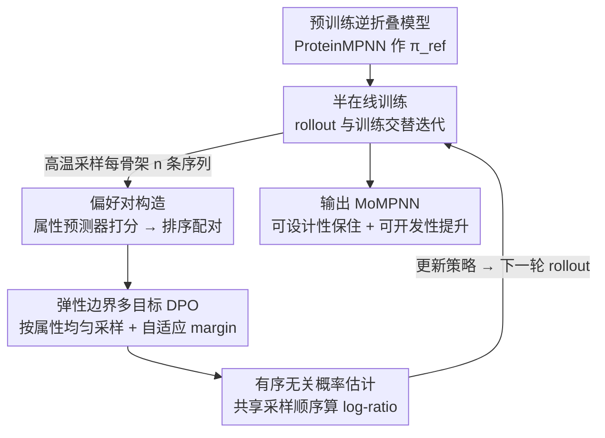

# Property-Driven Protein Inverse Folding with Multi-Objective Preference Alignment

**会议**: ICLR 2026  
**OpenReview**: [https://openreview.net/forum?id=m826DekCpp](https://openreview.net/forum?id=m826DekCpp)  
**代码**: https://github.com/Qivon7/MoMPNN  
**领域**: 计算生物学 / 蛋白质设计 / 偏好对齐  
**关键词**: 逆折叠, 蛋白质序列设计, 多目标偏好对齐, 半在线 DPO, 可开发性

## 一句话总结
本文提出 ProtAlign，用一个带「弹性偏好边界」的半在线 DPO 框架去微调预训练逆折叠模型，让它在保住「可设计性」（序列能复原目标骨架）的同时同时优化溶解度、热稳定性等多个相互冲突的「可开发性」属性；应用到 ProteinMPNN 上得到的 MoMPNN 在晶体结构、de novo 骨架和真实 binder 设计三类任务上都优于专门为单属性训练的基线。

## 研究背景与动机

**领域现状**：逆折叠（inverse folding）是蛋白质设计的核心任务——给定一个骨架结构 $x$，生成与之兼容的氨基酸序列 $y$。ProteinMPNN、ESM-IF、PiFold 等模型已经能很好地「复原」序列（高 recovery），近年也有不少用 DPO/GRPO 等偏好优化做后训练来进一步提升序列质量的工作（ProteinDPO、ResiDPO、ProteinZero）。

**现有痛点**：真实设计流水线要的远不止「序列能复原」。它要求蛋白同时是 **designable**（可设计：能折回目标骨架）和 **developable**（可开发：溶解度、热稳定性、表达量等下游可用性指标）。现有把可开发性塞进生成的做法有三类，各有硬伤：① **事后突变**——生成后再引入有益突变，但有益突变稀疏、难找；② **推理时偏置**——调整氨基酸采样概率或用奖励信号引导，不稳定且要小心调超参；③ **子集重训**——筛出满足某属性的数据重训（如 SolubleMPNN、HyperMPNN），但依赖精心策划的数据集，难以泛化到多样的设计目标，而且往往是「目标依赖」的。

**核心矛盾**：可开发性指标（溶解度、热稳定性）**并不直接衡量序列与结构的一致性**，所以单纯朝它们优化很容易把可设计性给优化没了——HyperMPNN 提了热稳定性但 designability 明显下降就是典型。多个可开发性目标之间也常常互相冲突（提溶解度可能掉热稳定）。如何在「保结构保真」的前提下**同时**优化多个互相打架的属性，是关键难点。

**本文目标**：把逆折叠模型对齐到「可设计性 + 任意多个可开发性属性」上，且不需要为每个属性单独策划数据集或精调超参。

**切入角度**：作者把它当成一个**多目标偏好对齐**问题——用现成的 in silico 属性预测器当「廉价标注器」给候选序列打分、自动构造偏好对，再用 DPO 风格的损失从这些偏好里学隐式奖励，这样就绕开了显式奖励建模和数据集策划。

**核心 idea**：用一个**带弹性偏好边界的半在线 DPO**——边界会在「某属性上获胜样本恰好在别的属性上更差」时自动收窄，从而调和多目标冲突；半在线则把 rollout/标注 与 训练 解耦，避免训练时反复跑预测器，大幅省算力。

## 方法详解

### 整体框架

ProtAlign 把一个预训练逆折叠模型（这里是 ProteinMPNN）当作初始策略 $\pi_\text{ref}$，在「rollout（采样+标注）」与「训练（更新）」两个阶段之间交替迭代，做半在线偏好优化。一轮迭代里：当前策略 $\pi_\theta^t$ 在较高温度 $\tau$ 下为采样到的骨架生成多条候选序列 → 用 $K$ 个属性预测器 $\{M_k\}$ 给每条序列打分 → 对每个属性 $k$ 单独构造偏好对数据集 $D_k$ → 在这批离线偏好数据上用「弹性边界 DPO 损失」更新若干步，得到 $\pi_\theta^{t+1}$。如此循环。整个过程把在线探索（每轮重新生成数据）和离线稳定（每轮内部按 DPO 离线优化）的好处结合起来，且训练时**不跑预测器**，只在 rollout 阶段批量标注，省算力又好部署。

### 关键设计

**1. 弹性偏好边界的多目标 DPO：让冲突属性互相「让步」而非互相抵消**

这是全文的核心。多目标对齐的最大麻烦是：朝属性 $k$ 优化的偏好对 $(y_w, y_l)$（即 $y_w$ 在属性 $k$ 上更好）可能恰好在另一个属性 $k'$ 上 $y_w$ 反而更差，硬推这种对会以牺牲其他属性为代价过度强调单一属性。作者从多目标策略目标 $\arg\max_\theta \mathbb{E}[\sum_k w_k r_k(x,y)] - \beta D_{KL}(\pi_\theta\|\pi_\text{ref})$ 出发，结合 Bradley-Terry 偏好模型，推出一个带自适应 margin 的 DPO 损失：

$$\mathcal{L}_{MO}(\theta; D_k) = -\mathbb{E}_{(x,y_w,y_l)\sim D_k}\Big[\log\sigma\big(w_k(\beta\log\tfrac{\pi_\theta(y_w|x)}{\pi_\text{ref}(y_w|x)} - \beta\log\tfrac{\pi_\theta(y_l|x)}{\pi_\text{ref}(y_l|x)}) - m_k(y_w,y_l)\big)\Big]$$

其中关键是 margin $m_k(y_w,y_l) = \lambda\sum_{k'\neq k} w_r\big(r_{k'}(x,y_w) - r_{k'}(x,y_l)\big)$。直觉是：如果 $y_w$ 在其它属性 $k'$ 上比 $y_l$ 更差，这一项就变负、所需的偏好 margin 被**调小**，模型就不会为了属性 $k$ 而强行拉开这一对，从而避免冲突优化。margin 在训练前用预测器预先算好，不增加训练开销。

**2. 有序无关的对数似然比估计：让 DPO 能用在非自回归的 ProteinMPNN 上**

DPO 损失需要算 $\pi_\theta(y|x)$ 和 $\pi_\text{ref}(y|x)$，对 LLM 这种从左到右模型很容易，但 ProteinMPNN 是**有序无关的自回归模型**——它在随机残基排列 $\sigma$ 下分解概率 $\pi_\theta(y|x,\sigma)=\prod_i\pi_\theta(y_{\sigma(i)}|x,y_{\sigma(<i)})$，精确算边际概率需要在大量解码顺序上采样，方差很大。作者借鉴离散扩散 LLM 的做法，用一组**共享的**采样排列 $\{\sigma_k\}_{k=1}^K$ 同时估计两个模型：$\hat p_\theta(y|x)=\frac1K\sum_k\pi_\theta(y|x,\sigma_k)$，$\hat p_\text{ref}(y|x)=\frac1K\sum_k\pi_\text{ref}(y|x,\sigma_k)$。关键在于 $\pi_\theta$ 和 $\pi_\text{ref}$ **在同一批排列下评估**，使得 log-ratio 的方差大幅降低，优化更稳定。

**3. 半在线训练：解耦 rollout 与训练，把预测器调用挪出训练循环**

纯在线 RL（PPO/GRPO）对齐效果好但要在训练时实时 rollout+评估，工程和算力开销大、还可能不稳。作者构造半在线 DPO（Algorithm 1）：每轮 $t$ 先用当前策略在较高的 rollout 温度 $\tau$（故意高于评估温度以促多样性）批量生成序列，跑 $K$ 个预测器打分、构造各属性的偏好对，然后在这批离线数据上更新模型若干步。跨迭代是在线（每轮重新生成数据自我进化），迭代内是离线（按 DPO 稳定优化）。好处是：训练时**完全不调用属性预测器**，预测器可批量推理打满算力、无需任何改动就能接入，部署简单且显著降本。

**4. 偏好数据集构造：用 in silico 预测器当代理标注器、按属性建分库**

可开发性指标湿实验测量太贵，作者用现成预测器当 proxy 标注器，为每个属性 $k$ 建独立数据集。给一个骨架的 $N$ 条候选序列，用 $M_k$ 打分排序，第 $i$ 名与第 $(N/2+i)$ 名配成 $(y_w,y_l)$（$i\le N/2$），且只有当分差 $M_k(y_w)-M_k(y_l)>\delta_k$（属性特定阈值）才纳入 $D_k$，以过滤模糊比较、保证标注一致。属性分两类：**可设计性属性**（如 ESMFold 预测结构与目标骨架的 TM-score、AlphaFold2 的 pTM）衡量结构一致性；**可开发性属性**又分通用质量（如 ESM 伪似然 Evolutionary Perplexity，关联进化合理性）和靶向质量（溶解度 Protein-Sol、热稳定性 TemBERTure）。因为可开发性不考虑序列-结构一致性，必须把它和可设计性属性**联合优化**才能在提升可开发性的同时守住结构保真。

### 损失函数 / 训练策略
总训练目标是按属性均匀采样、对各 $D_k$ 求弹性边界 DPO 损失的加权和：$\theta^t \leftarrow \theta^{t-1} - \alpha\nabla_\theta\big(\sum_{k=1}^K w_k\mathcal{L}_{MO}(\theta; D_k)\big)$。在 CATH 4.3 训练集上训练，每个采样结构生成 8 条序列、温度 1.0 促多样性；评估时 ProteinMPNN 系模型用温度 0.1。实例化得到 MoMPNN，主要优化两个可开发性属性：溶解度与热稳定性。

## 实验关键数据

### 主实验：CATH 4.3 晶体结构序列重设计（Table 1）

| 方法 | TM score ↑ | EP ↓ | Sol ↑ | Thermo ↑ | 说明 |
|------|-----------|------|-------|----------|------|
| ProteinMPNN | 0.740 | 6.70 | 0.769 | 0.389 | 基座模型，可设计性高、可开发性中等 |
| SolubleMPNN | 0.733 | 5.80→0.794* | 0.815 | 0.382 | 溶解度子集重训，溶解度强 |
| HyperMPNN | 0.706 | — | 0.929 | 0.359 | 热稳定子集重训，但 designability 下降 |
| Guidance [Sol] | 0.740 | — | 0.805 | 0.393 | 引导式，折中 |
| **MoMPNN [Sol+IG+EP]** | **0.793** | 5.99 | **0.789** | 0.384 | 保住 designability，溶解度大幅提升 |
| **MoMPNN [Thermo+IG]** | 0.734 | 5.85 | — | **0.963** | 热稳定逼近/超过 HyperMPNN，结构不掉 |

*注：EP 数值以原文表格为准，此处仅示意趋势。MoMPNN 在保持 ProteinMPNN 可设计性水平的同时显著增强可开发性，溶解度/热稳定性取得最佳，而 HyperMPNN 虽热稳定高却牺牲了 designability。作者还发现更高的氨基酸 recovery（AAR）并不与更高的可设计性/可开发性正相关，实践中更该关注后两者。

### de novo 骨架序列设计（Table 2）

| 方法 | TM score ↑ | RMSD ↓ | Sol ↑ | Thermo ↑ |
|------|-----------|--------|-------|----------|
| ProteinMPNN | 0.718 | 6.86 | 0.731 | 0.978 |
| SolubleMPNN | 0.733 | 6.61 | 0.799 | 0.992 |
| **MoMPNN [Sol+IG+EP]** | **0.751** | **6.17** | 0.843 | 0.993 |
| **MoMPNN [Thermo+IG]** | 0.748 | 6.14 | 0.684 | **0.998** |

在 RFDiffusion 生成的 de novo 骨架上，MoMPNN 整体最强，结构一致性甚至超过 ProteinMPNN；ESM-IF、InstructPLM 在 de novo 条件下大幅掉点，而 ProteinMPNN 系保持稳定。

### 关键发现
- **不同目标塑造不同行为**：TM 目标带来更高 TM-score（结构更一致）；IG（AlphaFold2 Initial Guess 的 pTM）一致地给出更低进化困惑度（EP），因为它不仅看序列能否折回、还看 AlphaFold 对预测的自信度；EP 直接加入虽不大幅提升进化合理性，但能稳定改善非靶向指标，是个有用的正则项。
- **de novo 下 IG 优于 TM**：在 de novo 设置中基于 IG 的优化比 TM 给出更高的结构一致性。
- **真实 binder 设计（Figure 2）**：在 PD-1、BHRF1、PDL1 等 5 个挑战性靶点上，仅在单体输入上后训练的 MoMPNN [Sol+IG+EP] 序列/骨架成功率略高于 ProteinMPNN，且在进化合理性和溶解度上大幅领先；与 SolubleMPNN 在 designability 上持平但可开发性更好——说明可开发性提升能迁移到复合物场景而不牺牲可设计性。

## 亮点与洞察
- **弹性 margin 把「多目标冲突」变成可解析项**：margin $m_k=\lambda\sum_{k'\neq k}w_r(r_{k'}(y_w)-r_{k'}(y_l))$ 用「其它属性上的得分差」自动调节本属性该拉多开，是个很可复用的多目标对齐 trick——任何 DPO 多目标场景都能借鉴。
- **共享采样顺序降方差**：把 $\pi_\theta$ 和 $\pi_\text{ref}$ 放在同一批排列下评估，是让 DPO 能稳定用在有序无关/非自回归生成模型上的关键工程点。
- **半在线把预测器移出训练循环**：「rollout 标注 + 离线更新」的解耦既保留在线自进化的好处，又让昂贵的属性预测器只在批量 rollout 时跑、可满载，非常贴合「奖励来自外部黑盒预测器」的科学场景。
- **重新定义评估**：引入 de novo benchmark 并把可开发性指标纳入逆折叠评估，指出 AAR 高 ≠ 设计好，为该领域提供了超越 recovery 的系统评估框架。

## 局限与展望
- **缺湿实验验证**：所有结论都基于 in silico 指标（Protein-Sol、TemBERTure、ESMFold/AlphaFold），作者承认尚无湿实验确认。
- **只针对单体属性**：研究主要聚焦蛋白单体属性，虽在 binder 上测过，但未探索复合物专属属性（如结合亲和力），作者将在后续工作中研究。
- **依赖代理预测器质量**：偏好信号完全来自预测器，若预测器本身有偏（如对某类序列系统性高估），对齐会把这种偏差放大；阈值 $\delta_k$、权重 $w_k$、$\lambda$ 等仍需按属性设定。

## 相关工作与启发
- **vs SolubleMPNN / HyperMPNN（子集重训）**：它们为单个属性筛数据重训，目标依赖、难泛化，且 HyperMPNN 提热稳定时掉了 designability；本文用一个框架联合优化多属性、不策划数据集，且守住可设计性。
- **vs ProteinDPO / ResiDPO / ProteinZero（逆折叠偏好优化）**：这些工作主要提升 designability，无法扩展到可能与 designability 冲突的可开发性属性；本文的弹性 margin 专门处理这种冲突。
- **vs MODPO / MORLHF（多目标对齐）**：本文借鉴其多目标 DPO 推导，但针对蛋白逆折叠的有序无关生成做了共享顺序估计，并用半在线 rollout 适配外部属性预测器。

## 评分
- 新颖性: ⭐⭐⭐⭐ 把多目标偏好对齐 + 弹性 margin + 共享顺序估计组合到逆折叠上，思路清晰且解决了真实痛点
- 实验充分度: ⭐⭐⭐⭐ 覆盖晶体/de novo/binder 三类任务、多属性组合消融，但缺湿实验
- 写作质量: ⭐⭐⭐⭐ 方法推导完整，框架图与算法清楚
- 价值: ⭐⭐⭐⭐ 给实用蛋白序列设计提供了通用、可扩展的对齐框架，且重新定义了评估维度

<!-- RELATED:START -->

## 相关论文

- [\[ICLR 2026\] PRISM: Enhancing Protein Inverse Folding through Fine-Grained Retrieval on Structure-Sequence Multimodal Representations](prism_enhancing_protein_inverse_folding_through_fine-_grained_retrieval_on_struc.md)
- [\[ICLR 2026\] RankFlow: Property-aware Transport for Protein Optimization](rankflow_property-aware_transport_for_protein_optimization.md)
- [\[AAAI 2026\] BeeRNA: Tertiary Structure-Based RNA Inverse Folding Using Artificial Bee Colony](../../AAAI2026/computational_biology/beerna_tertiary_structure-based_rna_inverse_folding_using_artificial_bee_colony.md)
- [\[ICLR 2026\] Multi-state Protein Sequence Design with DynamicMPNN](multi-state_protein_sequence_design_with_dynamicmpnn.md)
- [\[ICLR 2026\] Fast and Interpretable Protein Substructure Alignment via Optimal Transport](fast_and_interpretable_protein_substructure_alignment_via_optimal_transport.md)

<!-- RELATED:END -->
