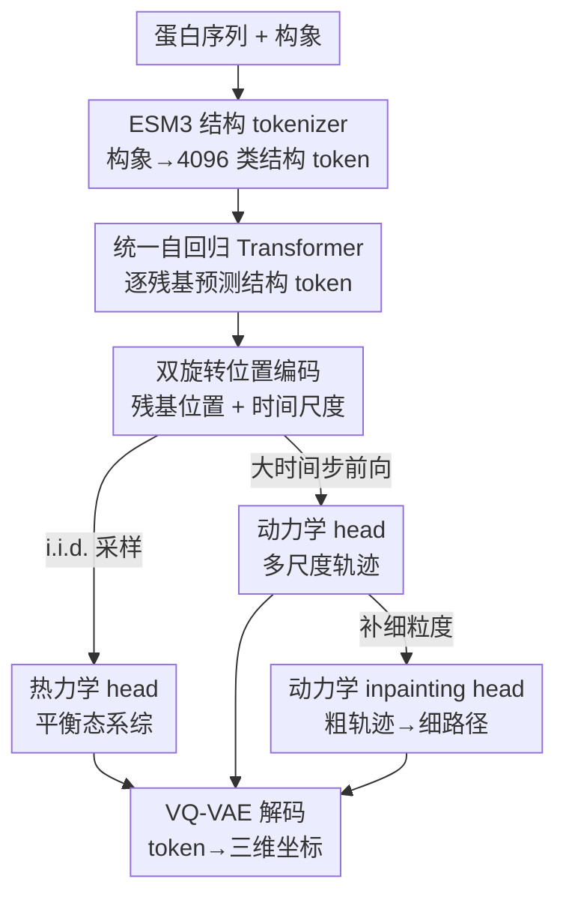

# ProTDyn: A Foundation Protein Language Model for Thermodynamics and Dynamics Generation

**会议**: ICLR 2026  
**OpenReview**: [https://openreview.net/forum?id=fvCHkWbdgX](https://openreview.net/forum?id=fvCHkWbdgX)  
**代码**: https://github.com/Harrydirk41/ProTDyn  
**领域**: 计算生物学 / 蛋白质语言模型 / 生成式分子动力学  
**关键词**: 蛋白质语言模型, 构象系综, 分子动力学, 自回归生成, 多时间尺度

## 一句话总结
ProTDyn 把蛋白质构象离散成结构 token，用一个 14 亿参数的自回归 Transformer 在同一框架里同时学会"热力学"（采样平衡态构象系综）和"动力学"（生成多时间尺度轨迹），并通过 inpainting 把粗粒度轨迹补成细粒度，从而用一个模型替代昂贵的分子动力学（MD）模拟，且在训练集外的蛋白上仍能泛化。

## 研究背景与动机

**领域现状**：研究蛋白质功能离不开理解它的构象柔性和动态行为。几十年来的主力工具是分子动力学（MD）模拟——通过积分牛顿运动方程 $M_i\ddot{x}_i = -\nabla_{x_i} U(x)$ 让系统随时间演化，固定温度下系统会收敛到玻尔兹曼分布 $P(x) \propto e^{-U(x)/k_B T}$。近几年深度生成模型成了 MD 的快速替代品：一类专门学平衡态系综（热力学），直接拟合稳态分布 $P(x\mid s)$；另一类专门学转移密度 $P(x_{t+\Delta t}\mid x_t, s)$ 来加速动力学。

**现有痛点**：MD 本身太慢——为了数值稳定，时间步必须比生物相关过程的时间尺度小好几个数量级，模拟长时间尺度动力学常常根本跑不动。而现有生成模型把热力学和动力学**拆成两件事各做各的**：学热力学的只给出平衡态系综，没有任何动力学信息；学动力学的又往往只在很有限的短时 MD 数据上训练，仍然依赖很小的时间步去推进，碰到稀有事件或长时间尺度转变就泛化不动，跨蛋白迁移能力差。

**核心矛盾**：热力学和动力学在统计力学里本就是同一枚硬币的两面（平衡态分布和转移动力学由同一套物理决定），但现有模型人为地把它们割裂开，既丢掉了二者的互补信息，也无法构造一个既懂平衡系综、又懂跨尺度转变的统一基础模型。这正是准确建模蛋白生物物理（蛋白互作、别构调控、相分离、构象异质性）所缺的关键拼图。

**本文目标**：造一个统一、可扩展、可迁移的蛋白模拟器，用单一模型同时给出（i）平衡态构象系综、（ii）多时间尺度的动力学轨迹、（iii）从粗轨迹恢复细粒度转变路径。

**切入角度**：作者借鉴"蛋白构象可以表示成离散 token 序列"这一最新进展——用预训练的 ESM3 结构 tokenizer 把每个残基的局部结构邻域映射成 4096 个结构 token 之一，这样建模蛋白构象就变成了建模一个**离散序列**，可以直接套用强大的自回归语言模型机制。

**核心 idea**：把热力学采样、动力学传播、动力学补全统一成"自回归预测结构 token"这一件事，在一个多任务 Transformer 里用三个 head 共同训练；再通过一个额外的"时间位置编码"把不同时间尺度的转移信息注入进去，让一个模型横跨纳秒到微秒。

## 方法详解

### 整体框架
ProTDyn 是一个运行在"序列 token + 结构 token"离散表示上的蛋白语言模型。它先用冻结的 ESM3 结构 tokenizer（VQ-VAE 编码器）把蛋白构象离散成结构 token 序列 $c \in \mathbb{Z}^N$，再用一个 24 层、14 亿参数的自回归 Transformer 骨干，**逐残基**地预测下一个结构 token。骨干上挂了三个互补的 head，对应三个任务：热力学 head 学平衡态构象分布，动力学 head 学多时间尺度的轨迹演化，动力学 inpainting head 把粗粒度（大时间步）轨迹补回细粒度路径。三个 head 共享同一套参数、联合训练，互相强化——准确的热力学系综给动力学传播提供稳定基线，真实的动力学又提升生成平衡系综的多样性和保真度。推理时，生成的 token 序列再由配套的 VQ-VAE 解码器还原成三维坐标。

### 关键设计

**1. 三 head 统一建模：把热力学、动力学、inpainting 写成同一个自回归目标**

这一设计直接针对"热力学和动力学被割裂"的核心矛盾。三个任务都被表述成对离散结构 token 的自回归条件生成，共享同一个骨干。热力学 head 把平衡态分布因式分解为 $P_\theta(c\mid s)=\prod_{i=0}^{N-1}P_\theta(c_i\mid c_{<i},s)$，用交叉熵 $L_{\text{thermo}}=-\mathbb{E}_{(s,c)\sim D}\sum_i \log P_\theta(c_i\mid c_{<i},s)$ 拟合观测到的平衡构象系综。动力学 head 把一段长度为 $M$、时间步为 $\delta t$ 的轨迹 $C=(c^0,\dots,c^{M\delta t})$ 沿时间和残基两层因式分解：$P_\theta(C\mid s)=\prod_j P_\theta(c^{j\delta t}\mid C_{<t},s)$，每一帧再逐残基展开 $P_\theta(c^{j\delta t}\mid C_{<t},s)=\prod_i P_\theta(c^{j\delta t}_i\mid c^{j\delta t}_{<i},C_{<t},s)$。三个 head 的损失按超参加权合并：

$$L_{\text{ProTDyn}} = \omega_1 L_{\text{thermo}} + \omega_2 L_{\text{dyn}} + \omega_3 L_{\text{dynI}}.$$

之所以有效，是因为三个任务底层都是"预测结构 token"，统一后热力学信号能给动力学传播兜底——实验里去掉热力学监督的纯动力学模型会迅速偏离真值、连折叠结构都维持不住，正反向印证了统一建模带来的互补增益。

**2. 多时间尺度动力学 + 时间位置编码：让一个模型横跨纳秒到微秒**

现有动力学模型只能用很小时间步推进，长时程要么跑不动要么误差爆炸。ProTDyn 让动力学 head 同时学 $\delta t = 1$ ns、10 ns、100 ns 三种时间分辨率，配合记忆核 $M=10$，对应 10 ns、100 ns、1000 ns 的有效时间尺度，从而一个模型就把短时和长时动力学桥接起来。实现的关键是在 ESM3 骨干（Pre-LN、RoPE、SwiGLU）上引入**双旋转位置编码**：残基嵌入按残基在序列中的整数位置（1、2、3…）编码，同时作用于序列 token 和结构 token；时间嵌入则把最小时间单位定为 1 ns，第一段结构 token 时间值记为 0、第二段记 $\delta t$、第三段记 $2\delta t$……且时间嵌入只加在结构 token 上、不加在序列 token 上，并在残基嵌入之前施加。训练用 1/10/100 ns，推理时 1～100 ns 之间任意整数步长都能用，灵活的时间调度正是它跨尺度泛化的来源。

**3. 动力学 inpainting：用"大步生成 + 回填细节"换取又稳又细的长时轨迹**

动力学 head 用大时间步能稳健探索长时程转变，但代价是丢失细粒度的时间分辨率。inpainting head 专门补这个缺口：给定首尾两个状态 $c^0$ 和 $c^{M\delta t}$，把它们之间物理上合理的细粒度转变序列恢复出来，建模成条件自回归 $P_\theta(C\mid c^0,c^{M\delta t},s)=\prod_{j=1}^{M-1}P_\theta(c^{j\delta t}\mid C_{<t},c^0,c^{M\delta t},s)$，训练目标是对应的负对数似然 $L_{\text{dynI}}$，时间步取 1 ns 和 10 ns、记忆核与动力学 head 一致。这就解释了实验里一个反直觉现象——"Dynamics (100 ns)"比"Dynamics (10 ns)"质量更高：10 ns head 要走很多步才到长时程，误差逐步累积；100 ns head 用大步稳健探索、再用 inpainting 把每个 100 ns 区间细化成十个 10 ns 子区间，兼顾了稳定性和细节。

### 损失函数 / 训练策略
骨干 24 层 Transformer、14 亿参数，复用并冻结 ESM3 的序列/结构嵌入 head。热力学训练沿用 BioEmu 的配方，混合单结构数据集（AlphaFold 数据库 Swiss-Prot 子集，542,378 对序列–结构）和平衡态 MD 数据（mdCath 的 5,398 个蛋白，以及 BioEmu 语料中的 Octapeptides、CATH1、CATH2、MEGAsim 等子集）；动力学与 inpainting 训练用 mdCath（1 ns）以及 Octapeptides/CATH2/MEGAsim（10、100 ns）。优化用 AdamW，学习率 $4\times10^{-4}$、权重衰减 $1\times10^{-5}$，训练损失连续 5 个 epoch 不降则学习率乘 0.5。

## 实验关键数据

### 主实验
在 CATH1 测试集上，用 Jensen–Shannon 散度（JSD）衡量生成系综与参考 100 µs MD 模拟在回转半径 Rg、相对天然结构的 RMSD、以及 TICA 前两个慢模式上的分布相似度（越低越好）：

| 模型 | Rg ↓ | RMSD ↓ | TICA ↓ |
|------|------|--------|--------|
| ProTDyn-Thermodynamics | **0.023** | **0.012** | **0.155** |
| ProTDyn-Dynamics (100 ns) | 0.030 | 0.018 | 0.206 |
| ProTDyn-Dynamics (10 ns) | 0.052 | 0.032 | 0.278 |
| ProTDyn-dynamics-only (100 ns) | 0.077 | 0.142 | 0.315 |
| BioEmu（baseline） | 0.082 | 0.137 | 0.293 |

三个 head 都能复现主要亚稳态和能垒，热力学 head 质量最高（i.i.d. 直接从平衡分布采样），且全面优于最新 baseline BioEmu。在训练集外的 10 个八肽上，热力学 head 的 JSD（Rg 0.034 / RMSD 0.020 / TICA 0.207）逼近 BioEmu（0.031 / 0.020 / 0.134）——而这些蛋白恰恰在 BioEmu 训练集里、不在 ProTDyn 训练集里，凸显其泛化能力。

### 动力学保真度（MSM 评估）
用 Markov 状态模型评估稳态分布 JSD、转移概率 JSD 和 200 ns 转移路径的平均负对数似然（NLL）：

| 模型 | 稳态 JSD ↓ | 转移 JSD ↓ | NLL ↓ |
|------|-----------|-----------|-------|
| ProTDyn-Dynamics (10 ns) | 0.042 | 0.105 | 0.806 |
| ProTDyn-Dynamics (100 ns) | **0.021** | **0.055** | **0.656** |
| ProTDyn-dynamics-only (100 ns) | 0.088 | 0.167 | 1.013 |
| 25 µs MD | 0.040 | 0.117 | 0.815 |
| 50 µs MD | 0.018 | 0.049 | 0.682 |
| 75 µs MD | 0.007 | 0.019 | 0.639 |

50 µs 的"Dynamics (10 ns)"轨迹质量约等于 25 µs MD，"Dynamics (100 ns)"约等于 50 µs MD——即生成式模拟能用更少的有效采样达到可比的 MD 质量。

### 关键发现
- **统一比专精强**：去掉热力学监督的 dynamics-only 模型在所有动力学任务上都大幅变差（稳态 JSD 0.088、NLL 1.013），轨迹不真实、维持不住折叠结构，证明热力学信号给动力学推断提供了不可替代的互补信息。
- **大步+inpainting 优于小步直推**：100 ns head 各项都优于 10 ns head，因为小时间步需要很多步累积、误差增长快；TICA 自相关曲线上 10 ns head 衰减明显快于参考、100 ns head 几乎贴合参考，与误差累积假设一致。
- **跨数据集泛化**：在未见的八肽上仍接近 baseline，且 CATH1 动力学评测里这些蛋白虽在热力学训练集中、却被排除在动力学/inpainting 训练之外，直接验证了动力学生成的泛化性。

## 亮点与洞察
- **把"统计力学的两面"塞进一个自回归语言模型**：用离散结构 token + 多 head 让热力学和动力学共享表示，既省了两套模型，又拿到了二者的互补增益——这是最让人"啊哈"的统一视角。
- **双旋转位置编码区分"空间"和"时间"两个轴**：残基位置和时间尺度各用一套旋转编码、时间编码只加结构 token，干净地把"哪个残基"和"哪个时刻"解耦，且推理可外推到训练没见过的整数步长。
- **精确似然是离散自回归的隐藏福利**：相比扩散/流模型只能近似且昂贵地估似然，ProTDyn 对系综和轨迹都能给出精确似然，为接入物理能量函数、甚至发展自上而下的蛋白力场打开了口子——这个思路可迁移到任何想要"可评估似然 + 物理约束"的生成式科学建模。

## 局限与展望
- **受限于 MD 训练数据规模**：作者承认平衡态 MD 数据的可得性和规模是瓶颈，更大更多样的数据能进一步提升性能。
- **记忆核是手工指定的**：每个时间尺度的记忆核当前靠人为设定，缺乏对其最优形式的严格研究，可借鉴学习/设计记忆核的工作来强化。
- **转移路径采样只当 inpainting 用**：目前 inpainting 只是恢复长时轨迹里的短时细节，尚未做严格的转移路径采样（如 transition interface sampling、milestoning、string method），通用 MD 数据也不是这类任务最合适的训练数据。
- **物理定律尚未显式约束**：当前生成模型没有显式建立在细致平衡等统计力学原理上；作者指出可借助精确似然把这些物理定律强制进来，从而在数据稀缺下获得更物理自洽的生成建模。

## 相关工作与启发
- **vs BioEmu**：BioEmu 是最新的高质量平衡态系综生成器，但只做热力学、不给动力学；ProTDyn 沿用其数据配方做对照，在 CATH1 上全面更优，并额外具备多尺度动力学能力，劣势是八肽泛化略逊于把这些蛋白纳入训练的 BioEmu。
- **vs 专门的动力学模型**（学转移密度 $P(x_{t+\Delta t}\mid x_t,s)$ 一类）：它们多在有限短时 MD 上训练、依赖很小时间步、难泛化到稀有/长时程转变；ProTDyn 用多尺度训练 + inpainting 把长短时桥接起来，并通过与热力学联合训练拿到稳定性。
- **vs 扩散/流式蛋白生成器**：那类方法的似然只能近似且评估代价高；ProTDyn 的离散自回归给出精确似然，便于与物理能量函数结合。

## 评分
- 新颖性: ⭐⭐⭐⭐⭐ 首次把蛋白热力学、动力学、动力学补全统一进单个自回归语言模型，统计力学视角清晰
- 实验充分度: ⭐⭐⭐⭐ 三 head + 多数据集 + MSM/TICA 多角度评估，且有统一 vs 纯动力学的关键消融，但 baseline 主要对 BioEmu 一个
- 写作质量: ⭐⭐⭐⭐ 目标和三任务表述清楚，公式完整；个别现象（100 ns 优于 10 ns）的解释停留在假设层面
- 价值: ⭐⭐⭐⭐⭐ 用一个模型替代昂贵 MD、可泛化且给精确似然，对蛋白生物物理建模有实打实的实用价值

<!-- RELATED:START -->

## 相关论文

- [\[ICLR 2026\] Reverse Distillation: Consistently Scaling Protein Language Model Representations](reverse_distillation_consistently_scaling_protein_language_model_representations.md)
- [\[ICLR 2026\] Towards Understanding the Shape of Representations in Protein Language Models](towards_understanding_the_shape_of_representations_in_protein_language_models.md)
- [\[ICLR 2026\] BioMD: All-atom Generative Model for Biomolecular Dynamics Simulation](biomd_all-atom_generative_model_for_biomolecular_dynamics_simulation.md)
- [\[CVPR 2026\] MMCP-GEN: A Modality-Extensible Diffusion Language Model for Conditional Protein Sequence Generation](../../CVPR2026/computational_biology/mmcp-gen_a_modality-extensible_diffusion_language_model_for_conditional_protein_.md)
- [\[ICLR 2026\] HEIST: A Graph Foundation Model for Spatial Transcriptomics and Proteomics Data](heist_a_graph_foundation_model_for_spatial_transcriptomics_and_proteomics_data.md)

<!-- RELATED:END -->
