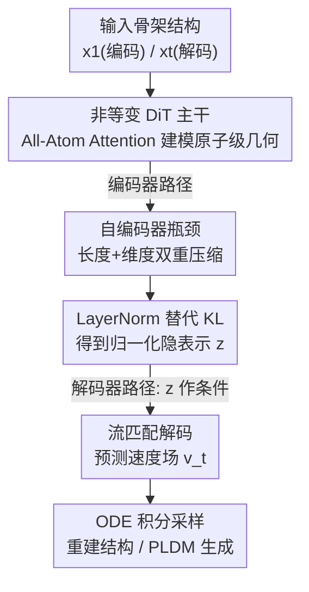

# ProteinAE: Protein Diffusion Autoencoders for Structure Encoding

**会议**: ICLR 2026  
**OpenReview**: [https://openreview.net/forum?id=tYLCkzHAM2](https://openreview.net/forum?id=tYLCkzHAM2)  
**代码**: [https://github.com/OnlyLoveKFC/ProteinAE_v1](https://github.com/OnlyLoveKFC/ProteinAE_v1)  
**领域**: 蛋白质结构编码 / 扩散模型 / 表示学习 / AI for Science  
**关键词**: 蛋白质自编码器、流匹配、连续隐空间、非等变 Transformer、隐空间扩散生成

## 一句话总结
ProteinAE 用一个非等变的 Diffusion Transformer，把蛋白质骨架坐标直接在 E(3) 空间压成连续紧凑的隐表示，只靠单一流匹配损失端到端训练，重建精度（Cα RMSD）大幅超越现有离散 tokenizer，并在此隐空间上搭建出可与结构域扩散模型抗衡、却快近 10 倍的蛋白质生成模型。

## 研究背景与动机
**领域现状**：视觉生成的主流范式是「先用自编码器（tokenizer）把像素压成紧凑隐空间，再在隐空间里做生成」，这套两段式做法显著提升了建模复杂分布的效率与质量。把这个范式搬到蛋白质上，自然要先有一个好的「蛋白质结构自编码器」。前人已有 ESM3 的 VQ-VAE tokenizer、DPLM-2 的查表无量化（LFQ）tokenizer、以及在码本上继续改进的 AminoAseed，它们把连续的 3D 坐标离散成 token，方便和序列联合做掩码语言建模。

**现有痛点**：这些自编码器有四个结构性毛病。其一，它们工作在 SE(3) 流形上（既要平移又要处理坐标系旋转），必须引入等变性和各种物理约束，让隐空间和模型结构都变得复杂。其二，把连续原子坐标离散成 token，本身就会损失重建精度。其三，训练要堆叠一大堆目标——FAPE 损失、距离损失、违例（violation）损失、KL 损失等等，每一项的权重都要单独调。其四，它们往往被固定输入长度卡死，也缺少一个紧凑的瓶颈隐空间来支撑高效生成。

**核心矛盾**：根子在于「为了忠实表达蛋白质几何，就去硬扛 SE(3) 等变 + 离散化 + 多损失」这条技术路线，把简单的事做复杂了——等变和离散化既增加优化难度，又反而牺牲了精度和泛化。

**本文目标**：能不能设计一个更简单、更准、又更有效的蛋白质自编码器，让它工作在连续、紧凑的隐空间里？

**切入角度**：作者注意到去噪自编码器（denoising autoencoder）的最新进展——用扩散/去噪目标训练出的表示能最大化输入似然的 ELBO，AlphaFold3 也间接验证了这一点。于是干脆抛弃等变设计，用一个非等变的 DiT 直接在 E(3) 上对骨架原子（Cα、N、C、O）做自编码。

**核心 idea**：用「非等变 DiT + 单一流匹配损失 + 长度/维度双瓶颈」替代「SE(3) 等变 + 离散 token + 多损失」，把蛋白质结构压进一个连续、归一化好、可直接拿去做隐空间扩散的低维空间。

## 方法详解

### 整体框架
ProteinAE 是一个编码器–解码器架构。**编码器**吃进一条干净的蛋白质骨架结构 $x_1 \in \mathbb{R}^{N\times 4\times 3}$（$N$ 个残基、每残基 4 个骨架原子、各 3 维坐标），输出一个紧凑的隐表示 $z$；**解码器**则在流匹配框架下工作，吃进时刻 $t$ 的带噪结构 $x_t$，并以 $z$ 为条件预测速度场 $v^\theta_t$，再通过 ODE 积分把结构从噪声里采样重建出来。整套模型只用一个流匹配损失端到端训练，没有任何辅助损失。训练好之后，这个连续隐空间还能直接拿去搭下游的蛋白质隐空间扩散模型（PLDM）和理化属性预测。

整条管线可以拆成「特征准备 → DiT 主干处理 → 瓶颈压缩 + LayerNorm 归一化 → 流匹配解码重建」四步，编码器与解码器共享同一套组件、只是输入和条件不同：

### 关键设计

**1. 非等变 DiT + All-Atom Attention：丢掉等变性，用注意力直接建模 E(3) 几何**

针对「SE(3) 等变让结构和隐空间都变复杂」这个痛点，ProteinAE 干脆不要等变性，整套特征处理、编码、解码都用非等变架构——这个选择和 AlphaFold3、Proteina 的趋势一致，它们都用「带条件、带偏置的多头自注意力 + transition 块 + 残差连接」的堆叠来取代显式几何等变。具体地，模型在序列表示 $s$ 和条件表示 $c$ 上跑 DiT 块，可选地注入由输入结构几何关系得到的注意力偏置（pair bias）$\beta_{ij}$；为了应对变长蛋白输入，位置编码用 RoPE 而非绝对位置编码。一个 DiT 块可写成 $s_l = \text{DiT}_{\text{pairbias}}(s_{l-1}, p, c, \beta_{ij})$，再叠一个 transition 块 $s_l = s_l + \text{TransitionBlock}(s_l, c)$。

为了把原子级细节建进来，作者额外加了受 AlphaFold3 启发、但参数更少的 All-Atom Attention 编码器/解码器：它做的是「序列局部的原子注意力」，允许某个序列邻域内的所有骨架原子互相交互。比起 ESM3 VQ-VAE 只靠 KNN 图建局部结构，这种局部原子注意力能更丰富地刻画局部相互作用。编码端 All-Atom Attention 把原子级特征聚合成 token 级序列表示 $s$（并吐出跳连特征供解码用），解码端则把 token 级特征广播回原子级、最终投影出坐标空间里的速度向量 $v^\theta_t \in \mathbb{R}^{N\times 4\times 3}$。

**2. 长度 + 维度双瓶颈：把结构压成低维紧凑隐空间，撑起高效生成**

针对「缺少紧凑瓶颈、生成低效」的痛点，作者在编码器尾部加了两道压缩。先是**长度瓶颈**：在 DiT 堆叠输出的 $s_L$ 上跑一个或多个 kernel=3、stride=2 的 1D 卷积，把蛋白长度从 $N$ 降到 $N_{\text{down}}=N/r$（$r$ 为总下采样比）。再是**维度瓶颈**：用一个线性层把 token 维度 $D$ 投到更小的瓶颈维度 $d$。整个压缩可写成 $z = \text{LinearNoBias}(\text{Conv1d}(\text{transpose}(s_L)))$，得到形状 $(B, N_{\text{down}}, d)$ 的隐表示。解码时再反着来：先把 $z$ 维度升回去，再插值把长度还原到目标 $N_{\text{target}}$，加进序列条件 $c$ 里。

这套瓶颈最关键的价值是让下游 PLDM 能整个运行在低维隐空间里，绕开直接做结构生成时的几何/物理约束，从而把采样开销压得极低。消融发现一个反直觉的结论：维度压得狠（$d$ 变小）只让 RMSD 温和上升，但长度压得狠（$r$ 增大）会让重建质量急剧恶化——说明对蛋白骨架重建而言，**保住序列长度维度比保住特征维度更重要**，默认配置因此取 $r=1$（不压长度）、$d=8$。

**3. 单一流匹配损失 + LayerNorm 替代 KL：把多损失多正则的优化管线砍到只剩一项**

针对「要堆 FAPE/距离/违例/KL 一堆损失、逐个调权重」的痛点，ProteinAE 只用一个流匹配损失训练。流匹配的目标速度场定义为 $v(t)=x_1-x_0$，模型学着在带噪结构 $x_t$、时刻 $t$、条件 $z$ 下预测这个速度，训练目标为

$$\min_\theta \; \mathbb{E}_{x_1\sim p_{ds},\,x_0\sim\mathcal{N}(0,I),\,t\sim p(t)}\left[\frac{1}{4N}\left\|v^\theta_t(x_t,t,z)-(x_1-x_0)\right\|_2^2\right]$$

其中时刻采样分布取 $p(t)=0.02\,\mathcal{U}(0,1)+0.98\,\mathcal{B}(1.9,1.0)$，沿用结构流匹配模型的常用做法、把更多权重压在接近干净结构的时刻上。

配套的一个小而关键的改动是：传统 VAE 在隐变量上加 KL 正则，ProteinAE 改用**不带可学习缩放的 LayerNorm**（跟随 DiTo）对瓶颈输出做归一化。这样既省掉了 KL 权重调参，实测重建还更好；更妙的是，隐空间被这样归一化后，可以直接拿去训 PLDM 而不需要扩散过程里额外再归一化。一项流匹配损失加一层 LayerNorm，就把 ProteinAE 和 PLDM 两阶段的训练流程都大幅简化了。

### 损失函数 / 训练策略
训练数据用 AFDB-FS（从 AlphaFold 蛋白结构数据库经 MMseqs2 序列聚类和 Foldseek 结构聚类筛出），含 588,318 条单链结构、长度 32–256 残基；训练时对结构做随机全局旋转作数据增强。默认 ProteinAE 配置：编码器/解码器 DiT 各 $L=5$ 层、token 维 $D=256$，瓶颈取 $r=1$、$d=8$。下游 PLDM 也是 DiT 架构，约 200M 参数、$L=15$、$D=768$，并刻意去掉了昂贵的三角注意力（triangle attention）以提速。

## 实验关键数据

### 主实验：结构重建（CASP14/15，Cα RMSD ↓）

| 方法 | CASP14-T | CASP14 oligo | CASP15 TS-dom | CASP15 oligo |
|------|---------|--------------|----------------|--------------|
| CHEAP | 11.15 | 9.93 | 10.22 | 9.22 |
| ESM3 VQ-VAE | 1.02 | 3.08 | 1.23 | 1.94 |
| ProToken | 0.99 | 1.15 | 1.15 | 1.18 |
| DPLM-2 | 1.99 | 2.70 | 3.31 | 3.50 |
| **ProteinAE** | **0.23** | **0.31** | **0.28** | **0.37** |

ProteinAE 在所有靶标上系统性碾压离散 tokenizer，且在最难的寡聚体（oligo）装配上优势尤其明显——很多 baseline 在这类复杂结构上质量明显退化，而它仍保持高保真。作者把这归因于扩散自编码器比离散量化更能建模蛋白结构流形，绕开了 tokenization 固有的信息瓶颈。

### 下游生成与属性预测

无条件骨架生成（Table 2）：ProteinAE-PLDM 在隐空间方法里达到 SOTA，并逼近经典结构扩散模型（SDM）。$\gamma=0.35$ 时可设计性 Des 达 93%、多样性 Div 204；$\gamma=0.5$ 时 Des 86%、Div 升到 228，体现采样温度对「可设计性↔多样性」的可控权衡。相比之下同为 LDM 的 LatentDiff 仅 17% Des、34 Div，semi-LDM 的 LSD 也只有 69% Des。

| 类型 | 方法 | Des↑ | Div↑ | DPT↓ | Nov↓ |
|------|------|------|------|------|------|
| SDM | RFdiffusion | 96% | 247 | 0.43 | 0.71 |
| MLLM | DPLM-2 650M | 63% | 130 | 0.37 | 0.72 |
| LDM | LatentDiff | 17% | 34 | 0.51 | 0.73 |
| semi-LDM | LSD | 69% | 203 | 0.46 | 0.74 |
| **LDM** | **ProteinAE-PLDM γ=0.35** | **93%** | 204 | 0.36 | 0.70 |

理化属性预测（ATLAS，Spearman ρ%）：ProteinAE 在 FlexRMSF 与 FlexBFactor 的 fold/superfamily 划分上全面领先，FlexRMSF 比 ESM3 高 10%+，FlexBFactor 的 Fold 划分从 ESM3 的 23.60 提到 30.87，说明连续隐表示更好地抓住了蛋白几何与动力学的可泛化规律。

生成效率：在单张 80G A100 上生成 200 残基骨架（batch=5），ProteinAE-PLDM 仅需约 1.6 秒、约 0.3 GB 显存；RFDiffusion 约 15 秒、5 GB，DPLM-2 约 3 秒、1 GB。效率提升主要来自维度瓶颈把生成放进低维隐空间、并去掉三角注意力。

### 消融实验

| 配置 | 现象 | 结论 |
|------|------|------|
| 长度瓶颈 $r=1\to4$ | RMSD 急剧上升 | 序列长度维度对重建最关键，默认 $r=1$ |
| 维度瓶颈 $d=256\to8$ | RMSD 温和上升 | 维度可大幅压缩，损失有限，默认 $d=8$ |
| Base(20M)→Large(100M) | RMSD 略降（尤其 $r=2$ 难配置下） | 模型呈正向可扩展性 |
| Register 压缩替代瓶颈 | ≤256 残基重建好，>256（约 231 处）骤崩 | 定长 register 不适配变长蛋白 |

### 关键发现
- 长度比维度更不能压：长度下采样 $r$ 从 1 升到 4 会让 RMSD 大幅恶化，而维度从 256 压到 8 只温和上升——蛋白骨架重建对「保住每个残基的位置」比对「保住高维特征」更敏感。
- Register 压缩的失败很有启发：把视觉里成功的「learnable register 当定长隐表示」搬到蛋白上，会在超过训练最大长度（256）后约第 231 残基处突然崩溃；原因是图像 patch 化后 token 数固定，而蛋白序列天然变长，所以长度/维度瓶颈这种对变长更鲁棒的机制才是正解。
- 隐空间归一化（LayerNorm 替代 KL）不仅免调权重，还让 PLDM 能直接在 $z$ 上训练而无需额外归一化。

## 亮点与洞察
- **「越简单越好」的反潮流实证**：在大家都往等变 + 离散 + 多损失上加码时，ProteinAE 反向把这些全砍掉，用最朴素的非等变 DiT + 单流匹配损失，反而把重建 RMSD 压到 0.2–0.3 量级，说明等变约束在自编码这个环节也许是「想当然的必要」。
- **重建用扩散、生成也用扩散，但放在两个空间**：自编码器内部用流匹配做去噪重建，外部 PLDM 又在它压出的隐空间里做扩散生成——同一把扩散锤子敲两次，第二次因为隐空间低维而极快。
- **LayerNorm 替代 KL 的小 trick 可迁移**：这个「无可学习缩放的 LayerNorm 当隐空间归一化」的做法，对任何想训「自编码器 + 隐扩散」两阶段管线的任务都值得借鉴，省掉 KL 调权重还顺带免掉扩散侧归一化。

## 局限与展望
- 作者承认目前只能建模蛋白单体（monomer），无法处理配体、DNA、RNA 等其他生物分子。
- PLDM 的生成性能尚未显著超过最强的结构域扩散模型，只是「打平 + 更快」。
- PLDM 在序列长度处理上仍有问题，对某些残基会出现结构坍塌或不真实几何。
- 自己补充的观察：所有重建评测都在长度 ≤256 的范围内（训练上限即 256），对更长蛋白、跨域分布的泛化未充分验证；Register 变体的崩溃也提示长度外推是这条路线的硬伤。

## 相关工作与启发
- **vs ESM3 VQ-VAE / DPLM-2（离散 tokenizer）**：它们在 SE(3) 上做几何编码、把坐标离散成 token、靠 KNN 图建局部结构、堆多损失；ProteinAE 在 E(3) 上非等变建模、连续编码、用 All-Atom Attention 建局部、单损失。区别在「离散 vs 连续 + 等变 vs 非等变」，ProteinAE 在重建精度上数量级领先。
- **vs LSD（Yim et al. 2025，分层隐扩散）**：LSD 的隐扩散建在 contact map 上、第二阶段仍依赖 FrameFlow；ProteinAE-PLDM 用标准 DiT 直接在自家紧凑隐空间上生成，绕开显式等变和三角注意力，效率更高、可设计性也更好。
- **vs RFdiffusion / FrameFlow（结构域扩散 SDM）**：SDM 直接在结构空间生成、受键长键角等物理约束拖累且慢；ProteinAE-PLDM 在低维隐空间生成，质量逼近 SDM 却快近 10 倍、显存省一个数量级，代价是生成质量尚未反超 SDM。

## 评分
- 新颖性: ⭐⭐⭐⭐ 把「非等变 + 连续 + 单损失」组合用于蛋白结构自编码，方向反直觉且打通了重建到生成的隐空间管线
- 实验充分度: ⭐⭐⭐⭐ 重建/生成/属性预测/效率/可扩展性多维度覆盖，消融揭示长度 vs 维度的关键差异
- 写作质量: ⭐⭐⭐⭐ 结构清晰、图文对应到位，公式与设计动机讲得明白
- 价值: ⭐⭐⭐⭐ 为蛋白生成提供了高保真、低成本的隐空间基座，LayerNorm 替代 KL 等 trick 可复用

<!-- RELATED:START -->

## 相关论文

- [\[ICLR 2026\] Protein Structure Tokenization via Geometric Byte Pair Encoding](protein_structure_tokenization_via_geometric_byte_pair_encoding.md)
- [\[ICLR 2026\] Flow Autoencoders are Effective Protein Tokenizers](flow_autoencoders_are_effective_protein_tokenizers.md)
- [\[ICLR 2026\] Animal behavioral analysis and neural encoding with transformer-based self-supervised pretraining](animal_behavioral_analysis_and_neural_encoding_with_transformer-based_self-super.md)
- [\[ICLR 2026\] Greater than the Sum of Its Parts: Building Substructure into Protein Encoding Models](greater_than_the_sum_of_its_parts_building_substructure_into_protein_encoding_mo.md)
- [\[ICLR 2026\] FlexRibbon: Joint Sequence and Structure Pretraining for Protein Modeling](flexribbon_joint_sequence_and_structure_pretraining_for_protein_modeling.md)

<!-- RELATED:END -->
