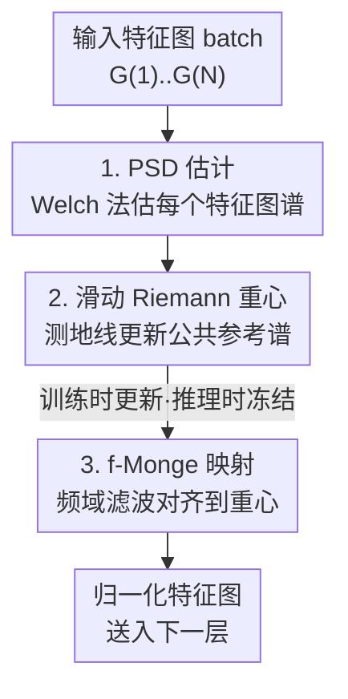

# PSDNorm: Temporal Normalization for Deep Learning in Sleep Staging

**会议**: ICLR 2026  
**OpenReview**: [https://openreview.net/forum?id=BZMQotjBwW](https://openreview.net/forum?id=BZMQotjBwW)  
**代码**: https://github.com/tgnassou/PSDNorm  
**领域**: 计算神经科学 / 生理信号 / 领域泛化  
**关键词**: 归一化层, 睡眠分期, EEG, 最优传输, 功率谱密度

## 一句话总结
本文提出 PSDNorm——一种可直接替换 BatchNorm/InstanceNorm 的归一化层，它在网络内部用 Monge 映射把每个特征图的功率谱密度（PSD）对齐到一个滑动 Riemann 重心 PSD，从而在 10 个数据集、上万被试的睡眠分期任务上取得 SOTA，并且只需 1/4 的标注数据就能达到最强基线的精度。

## 研究背景与动机

**领域现状**：睡眠分期是把整夜 EEG 信号按 30 秒一段分类成 Wake/N1/N2/N3/REM 五个阶段的临床任务，主流做法是用 CNN（如 U-Sleep）或 Transformer 端到端学习，网络内部普遍插入 BatchNorm、LayerNorm 或 InstanceNorm 来稳定训练、缓解数据差异。

**现有痛点**：生理信号存在严重的分布漂移——不同被试、不同年龄/性别、不同电极位置、不同采集设备会让 EEG 的统计特性差异巨大。但 BatchNorm/LayerNorm/InstanceNorm 把时间维度上的每个采样点当作独立坐标来归一化，**忽略了信号本身的时间自相关与谱结构**。换句话说，它们只能纠正一阶/二阶的均值方差漂移，纠正不了「频谱形状」这一类漂移，而后者恰恰是 EEG 跨域差异的主要来源。

**核心矛盾**：已有工作 TMA（Temporal Monge Alignment）确实意识到了这点，用最优传输把信号的 PSD 对齐到一个公共参考，效果更好；但 TMA 只能作为**预处理步骤**作用在原始信号上，无法像归一化层那样插进网络内部，因此既管不到中间层特征图的谱漂移，也享受不到端到端训练的好处。

**本文目标**：把「按谱结构对齐」这件事从预处理升级成一个**可微、可插入任意层、训练/推理都能用**的归一化层，专门处理特征图层面的时间自相关漂移。

**切入角度**：作者注意到，在「高斯周期信号」假设下，信号协方差矩阵是分块循环矩阵，可在傅里叶基下对角化，其特征值恰好就是各通道的 PSD；于是两个高斯分布之间的 Monge 映射有闭式解，本质就是在频域做一次滤波（whitening + re-coloring）。这意味着「对齐谱」可以做成一个轻量、可微的卷积滤波操作放进网络里。

**核心 idea**：用 f-Monge 映射把每个特征图的 PSD 对齐到一个滑动维护的 Wasserstein/Riemann 重心 PSD，以此替代传统归一化里的「减均值除方差」。

## 方法详解

### 整体框架
PSDNorm 是一个 drop-in 归一化层：输入是一个 batch 的预归一化特征图 $B=\{G^{(1)},\dots,G^{(N)}\}$（形状 $c\times\ell$，$c$ 通道、$\ell$ 时长），输出是 PSD 被对齐后的特征图 $\tilde B=\{\tilde G^{(1)},\dots\}$。前向分三步串行：先对每个特征图**估计 PSD**（Welch 方法），再把这些 PSD 汇成 batch 重心、并以测地线方式更新一个**滑动 Riemann 重心 PSD**，最后用 **f-Monge 映射**（一次频域滤波）把每个特征图对齐到这个重心。训练时三步全跑、并更新重心；推理时重心冻结、只做估计与映射。整层完全可微、可嵌入任意网络，唯一的额外超参是滤波器长度 $f$（控制考虑多长的时间相关，实验取 5~11）。

### 关键设计

**1. PSD 估计：用 Welch 法把「时间自相关」量化成可对齐的谱**

传统归一化只统计均值方差，丢掉了信号坐标之间的相关结构。PSDNorm 改为对每个特征图估计功率谱密度，作为对齐的目标量。具体先按通道减去时间均值 $\hat\mu^{(j)}=\frac1\ell\sum_l G^{(j)}_{:,l}$（特征图因激活和卷积偏置通常非零均值，但假设均值平稳，故先中心化），再用 Welch 估计器把中心化后的信号切成 $L$ 段重叠窗、对每段做傅里叶变换取平方再平均：$\hat P\triangleq\frac1L\sum_{l=1}^{L}\big|(\mathbf 1_c w^\top\odot X^{(l)})F_f^*\big|^{\odot 2}$。只用 $f\ll\ell$ 个频率来估 PSD，等于只刻画局部相关、忽略长程相关，$f$ 越大考虑的时间相关越长、归一化越强。这一步把抽象的「时间结构」落成一个 $c\times f$ 的可对齐对象。

**2. 滑动 Riemann 重心：给整个训练集找一个稳定的「公共谱参考」**

要把所有特征图对齐到哪里？答案是对齐到一个全局重心 PSD。对满足分块循环结构的高斯分布，其 Wasserstein 重心有闭式解 $\bar P=\big(\frac1K\sum_k P^{(k)\odot\frac12}\big)^{\odot2}$。训练时先用当前 batch 的各 PSD 算出 batch 重心 $\hat P_B$，再以 Bures 度量对应的指数测地线、用动量 $\alpha$ 把它融进滑动重心：

$$\hat P\leftarrow\Big((1-\alpha)\hat P^{\odot\frac12}+\alpha\hat P_B^{\odot\frac12}\Big)^{\odot2}.$$

这样重心是在「谱的几何空间」（Bures/Riemann 流形）上做平均，而不是在欧氏空间里直接平均 PSD，更符合协方差结构的几何，从而得到一个随训练平稳演进的公共参考。与 BatchNorm 的 running mean 类似，重心上施加 stop-gradient 防止梯度回传穿过它。

**3. f-Monge 映射：把对齐做成一次频域滤波，等价于 whitening + re-coloring**

有了目标重心 $\hat P$，最后对每个特征图施加 f-Monge 映射完成对齐：$\tilde G^{(j)}=(G^{(j)}-\hat\mu^{(j)}\mathbf 1_\ell^\top)*\hat H^{(j)}$，其中滤波器 $\hat H^{(j)}\triangleq\frac1{\sqrt f}(\hat P\oslash\hat P^{(j)})^{\odot\frac12}F_f^*$。直观上，$\hat P^{(j)}$ 是该特征图自己的谱、$\hat P$ 是目标谱，滤波器先按自身谱「白化」、再按目标谱「重新着色」，于是不同来源的特征图在二阶谱统计上被拉齐。整个操作就是沿时间轴的循环卷积，借 FFT 高效实现，全层复杂度 $O(Nc\ell f\log f)$。一个漂亮的性质是：当 $f=1$ 且把重心固定成均匀谱（$\hat P=1$）时，PSDNorm **退化成 InstanceNorm**——也就是说 InstanceNorm 只是它「不看时间相关、目标谱为白噪声」的特例，PSDNorm 是其在频域上的自然推广。

### 损失函数 / 训练策略
方法本身不改训练目标，仍用加权交叉熵（类权重由训练集分布算得）、Adam（学习率 $10^{-3}$）、batch size 64、按验证 loss 早停（patience 3）。实现上把网络前三个卷积层的 BatchNorm 替换成 PSDNorm，且为保持感受野，$f$ 在第一层用设定值、后续层逐层减半，动量 $\alpha$ 固定为 $10^{-2}$，默认 $f=5$。

## 实验关键数据

### 主实验
10 个睡眠数据集、约 1.1 万被试、1000 万样本，采用留一数据集（LODO）协议 + 3 个随机种子，指标为平衡准确率 BACC（U-Sleep 骨干）。

| 设置 | 指标 | BatchNorm | LayerNorm | InstanceNorm | TMA | PSDNorm |
|------|------|-----------|-----------|--------------|-----|---------|
| 全量被试 | Mean(Subject) | 78.14 | 76.78 | 79.26 | 78.77 | **79.51** |
| 全量被试 | Mean(Dataset) | 78.38 | 77.41 | 78.97 | 78.98 | **79.15** |
| balanced@400 | Mean(Subject) | 77.22 | 75.04 | 78.17 | 77.74 | **78.85** |
| balanced@400 | Mean(Dataset) | 77.55 | 75.05 | 77.78 | 78.03 | **78.34** |

在强漂移的 CHAT 数据集（儿童被试、与训练分布差异大）上，PSDNorm 比所有其他归一化高出 1 个百分点以上（全量设置 70.57 vs InstanceNorm 68.86）。

### 消融实验

| 配置 | 关键指标 | 说明 |
|------|---------|------|
| PSDNorm（完整） | 79.51 | 频域对齐 + 滑动重心 |
| InstanceNorm（≈ $f{=}1$ + 固定均匀谱） | 79.26 | 去掉时间相关与学习重心后退化版 |
| TMA（预处理而非层） | 78.77 | 同样用 Monge 对齐但只在输入端 |
| BatchNorm | 78.14 | 仅一阶/二阶统计 |

### 关键发现
- **数据稀缺时优势更明显**：把训练数据砍到 1/4（balanced@400）后，PSDNorm 相对最强基线的增益从 +0.25% 扩大到 +0.67%，且超过一个标准差；论文据此称只需约 4 倍更少的标注就能匹配最强基线精度。
- **「进网络」比「做预处理」更值**：PSDNorm 比同样用 Monge 对齐的 TMA 高约 1%，说明把对齐放进网络内部、随训练自适应，比只在原始信号上对齐一次更有效。
- **谱结构是关键**：InstanceNorm 作为不考虑时间相关的特例已是强基线（稳压 BatchNorm/LayerNorm），但仍被考虑了时间自相关的 PSDNorm 持续超越；LayerNorm 全程垫底，从未排第一。
- **跨架构稳健**：在 U-Sleep 与自研 CNNTransformer 两种骨干、临界差异（CD）检验下，PSDNorm 的平均排名均显著优于基线。
- **超参不敏感**：$f$ 在 5~11 范围内性能稳定。

## 亮点与洞察
- **把「最优传输对齐」做成一个 FFT 滤波层**：核心洞察是高斯周期信号假设下 Monge 映射 = 频域 whitening+re-coloring，于是一个理论上很重的 OT 概念被压缩成一次循环卷积，复杂度只有 $O(Nc\ell f\log f)$，可微、可插拔，工程上极轻。
- **InstanceNorm 是 PSDNorm 的特例**这个统一视角很漂亮：它把「常用归一化层」与「频域谱对齐」放在同一框架下，让人一眼看清现有层丢失了哪部分信息（时间自相关）。
- **几何平均而非欧氏平均**：在 Bures/Riemann 流形上用测地线维护滑动重心，比直接对 PSD 取算术平均更符合协方差几何，这个思路可迁移到任何需要「在线维护一组协方差/谱的参考」的场景。
- 不假设信号真的是高斯的——只借高斯近似去对齐二阶统计，保留高阶判别信息，与 Deep CORAL 的策略一脉相承。

## 局限与展望
- 方法建立在「高斯 + 周期 + 传感器不相关 → 分块循环协方差」的假设上，对强非平稳或多通道强耦合的信号，谱对齐能纠正的漂移有限（只动二阶统计）。
- 实验集中在睡眠分期 EEG（两路双极通道），是否能推广到其他生理信号（如 ECG、fMRI）或更一般的时序任务尚待验证。
- 需要在训练阶段就把层嵌入网络，无法像纯 test-time 适配那样对已有的预训练模型做事后即插即用。
- $f$ 逐层减半的设定与「保持感受野」的工程考量耦合，换骨干时可能需要重新调。

## 相关工作与启发
- **vs TMA（Temporal Monge Alignment）**：两者都用 f-Monge 映射对齐 PSD，但 TMA 是作用在原始信号上的预处理，只能纠输入端的谱漂移；PSDNorm 把它做成可微层放进网络、对中间特征图逐层对齐并随训练自适应，因此多了约 1% 的提升空间。
- **vs InstanceNorm / BatchNorm / LayerNorm**：传统层在时间维把每个采样点当独立坐标，只纠均值方差；PSDNorm 显式建模时间自相关、在频域对齐，InstanceNorm 正是其「$f{=}1$ + 均匀谱」的退化特例。
- **vs Test-time Domain Adaptation**：PSDNorm 受 TMA 启发、在推理时带来类似 test-time 适配的鲁棒性收益，但它需在训练时集成、并非事后无源适配方法。

## 评分
- 新颖性: ⭐⭐⭐⭐⭐ 把最优传输谱对齐统一进归一化层、并证明 InstanceNorm 是其特例，视角新且漂亮
- 实验充分度: ⭐⭐⭐⭐⭐ 10 数据集、上万被试、LODO×3 种子、双骨干、CD 检验，规模罕见
- 写作质量: ⭐⭐⭐⭐ 理论推导清晰，但频域记号较密、对非信号背景读者门槛偏高
- 价值: ⭐⭐⭐⭐⭐ 即插即用、数据高效、临床可部署，对生理信号跨域泛化有直接实用价值

<!-- RELATED:START -->

## 相关论文

- [\[ICLR 2026\] SAIR: Enabling Deep Learning for Protein-Ligand Interactions with a Synthetic Structural Dataset](sair_enabling_deep_learning_for_protein-ligand_interactions_with_a_synthetic_str.md)
- [\[ICLR 2026\] Meta-Learning Theory-Informed Inductive Biases using Deep Kernel Gaussian Processes](meta-learning_theory-informed_inductive_biases_using_deep_kernel_gaussian_proces.md)
- [\[CVPR 2026\] Stronger Normalization-Free Transformers](../../CVPR2026/computational_biology/stronger_normalization-free_transformers.md)
- [\[ICLR 2026\] Scalable Spatio-Temporal SE(3) Diffusion for Long-Horizon Protein Dynamics](scalable_spatio-temporal_se3_diffusion_for_long-horizon_protein_dynamics.md)
- [\[ICLR 2026\] Optimal Transport Unlocks End-to-End Learning for Single-Molecule Localization](optimal_transport_unlocks_end-to-end_learning_for_single-molecule_localization.md)

<!-- RELATED:END -->
