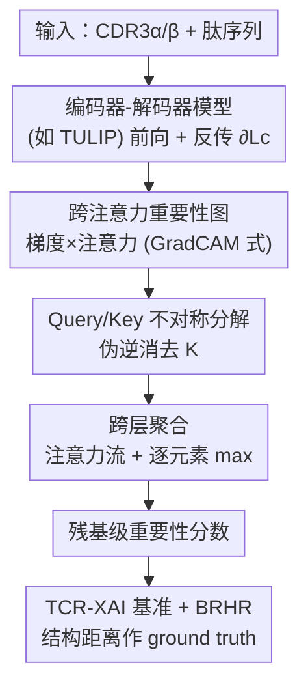

# Quantifying Cross-Attention Interaction in Transformers for Interpreting TCR-pMHC Binding

**会议**: ICLR 2026  
**OpenReview**: [https://openreview.net/forum?id=S3kSOFhs5m](https://openreview.net/forum?id=S3kSOFhs5m)  
**项目页**: [https://qcai.jiarui.li/](https://qcai.jiarui.li/)  
**代码**: 待确认  
**领域**: 计算生物学 / 可解释AI / Transformer  
**关键词**: TCR-pMHC 结合, 跨注意力, 后验可解释性, 编码器-解码器, 免疫学

## 一句话总结
针对 TCR-pMHC 结合预测模型普遍采用「编码器-解码器」架构、而现有可解释方法只会处理自注意力的盲区，本文提出 QCAI：把解码器里非对称的跨注意力矩阵拆解成 query 和 key 两侧残基的重要性分数，并配套构建了带结构真值的 TCR-XAI 基准，在可解释性和预测一致性上都取得 SOTA。

## 研究背景与动机
**领域现状**：T 细胞通过表面受体 TCR 识别由 MHC 分子递呈的抗原肽（合称 pMHC），这一结合的特异性是适应性免疫的核心，对疫苗设计和个性化癌症疗法都至关重要。近年来 TULIP、Cross-TCR-Interpreter、TCR-BERT 等 Transformer 模型把 TCR-pMHC 结合预测推到了很高的精度，其中 SOTA 模型（如 TULIP）采用编码器-解码器结构，用**解码器里的跨注意力**来建模 CDR3α、CDR3β、肽三条序列之间的相互作用。

**现有痛点**：这些模型是黑箱，只给结合/不结合的预测，却说不清「到底是哪些残基在起作用」。而免疫学研究真正想知道的恰恰是机制——哪个残基插进了哪个口袋、为什么这个 TCR 亲和力更高。现有的后验可解释方法（AttnLRP、TokenTM、AttCAT 等）几乎都是为**纯编码器、自注意力**模型设计的，无法解释解码器的跨注意力。

**核心矛盾**：自注意力的注意力矩阵是方阵 $A \in \mathbb{R}^{N\times N}$，Q、K、V 同源，可以直接把行/列当作 token 重要性来读；但跨注意力里 Q 来自一个模态、K/V 来自另一个模态，注意力矩阵变成非方阵 $A \in \mathbb{R}^{N\times N'}$，融合了两个模态的信息，**无法直接归因到某一侧的 query token**。这种不对称性正是现有方法绕不过去的坎。

**本文目标**：① 设计一个能解释任意编码器-解码器 Transformer 跨注意力的后验方法；② 解决 XAI 在免疫学场景「没有定量真值、只能凭直觉评判」的难题。

**切入角度**：作者借鉴 GradCAM 的「梯度×激活」思路定位重要的注意力项，再用矩阵伪逆把非方阵注意力的贡献「反解」回 query/key 两侧；同时利用实验测定的晶体结构，把「残基间物理距离」当作结合重要性的客观真值。

**核心 idea**：用梯度加权的跨注意力图，加上伪逆驱动的 query/key 解耦，把不对称的跨注意力定量拆回到每条输入序列的残基级重要性。

## 方法详解

### 整体框架
QCAI 是一个**后验（post-hoc）解释方法**，不改动也不重训目标模型，只在一次前向+反向传播后，从解码器的跨注意力里抽取残基重要性。整条流水线是：把 CDR3α/β 与肽序列喂进编码器-解码器模型（实验用 TULIP），针对目标类别 $c$ 的损失 $L_c$ 做反传拿到梯度；先用「梯度×注意力」算出跨注意力重要性图，再把这张非方阵的图沿 query 和 key 两个方向分别拆解成 token 级分数，最后沿模型层逐层聚合，得到每个输入残基的重要性向量；这套分数最终在自建的 TCR-XAI 基准上用结构距离做真值来评测。

### 关键设计

**1. 跨注意力重要性图：用梯度×注意力锁定关键注意力项**

直接读跨注意力矩阵不靠谱，因为高注意力权重未必对预测有贡献。受 GradCAM 启发，QCAI 用「类别损失对注意力矩阵的梯度」来加权注意力本身，定义重要性图

$$S(A_l) = \mathbb{E}_H\!\left[\mathrm{ReLU}\!\left(\frac{\partial L_c}{\partial A_l} \odot A_l\right)\right] + I \in \mathbb{R}^{N\times N'},$$

其中 $\mathbb{E}_H$ 是对所有注意力头取平均，$\odot$ 是逐元素乘，$I$ 是为残差连接补的单位阵。这样只有「权重高**且**对类别损失贡献大」的注意力项才会被高亮，避免了「权重大但对预测无关」的误判。ReLU 保证只保留正向贡献。这一步给出的是注意力矩阵层面的重要性，下一步要把它拆回到输入 token。

**2. Query/Key 不对称分解：用伪逆把非方阵注意力反解回两侧残基**

这是 QCAI 的技术核心，专门对付跨注意力非方阵、无法直接归因的难题。作者把每一侧的重要性都拆成两部分：**内在重要性**和**注意力调制后的重要性**。

对 query 侧，内在重要性同样用 GradCAM 式 $S(Q_l)=\mathrm{ReLU}(\frac{\partial L_c}{\partial Q_l}\odot Q_l)$，再沿特征维取列最大得到 token 级分数 $\omega_l^Q$。但内在分数没体现 Q 在注意力里如何被调制，于是定义注意力调制重要性 $S(Q_l;A_l)\propto \frac{\partial L_c}{\partial A_l}\cdot Q_l$。由于 $A_l = Q_l K_l^\top$，要从 $S(A_l)$ 里隔离出 $Q_l$ 的影响就得「消掉 $K_l^\top$」，而 $K_l$ 通常既非方阵也不可逆，作者用 **Moore-Penrose 伪逆**：

$$\frac{\partial L_c}{\partial A_l}\cdot Q_l = S(A_l)\cdot K_l\,(K_l^\top K_l)^{-1}\in\mathbb{R}^{N\times d}.$$

取列最大得 $\omega_l^A$，最后**逐元素取两者最大** $S(Q_l;A_l)=\max(\omega_l^A,\omega_l^Q)$，以兼顾「Q 还受其他层影响」的保守估计。key 侧同理拆成 $S(K_l)$ 与注意力派生的 $\omega_l^{A\prime}$，但因为注意力本就把 query 显式映射进 key 空间，key 侧不需要伪逆，可直接在注意力矩阵上跨所有 query 与注意力头取最大，再 $S(K_l;A_l)=\max(\omega_l^{A\prime},\omega_l^K)$。这种「内在 + 注意力调制取 max」的保守组合，比单看其中一项更鲁棒。

**3. 跨层聚合：沿注意力流把重要性回传到输入残基**

单层的重要性还不够，要把它从输出端逐层回传到原始输入。借鉴 attention flow，QCAI 从输出层往回遍历：设 $k$ 是回溯时遇到的第一个带跨注意力的解码器层，比它更靠前的层都按自注意力处理。聚合按递推式进行：$\tilde S_k = S(Q_k;A_k)\cdot \tilde S_{k+1}$（query 路）与 $S(K_k;A_k)\cdot \tilde S_{k+1}$（key 路）。当模型有多个含跨注意力的解码器块、重要性会在不同点发散又汇合时，作者改用**逐元素取最大** $\tilde S_k=\max(S(\cdot;A_k),\tilde S_{k+1})$ 的保守策略，保留最强的归因信号。这样只要解释路径里出现过任意一个跨注意力解码器块，QCAI 最终就能输出一个 token 级重要性向量，标明每个输入残基对预测的贡献。

**4. TCR-XAI 基准与 BRHR 指标：用晶体结构距离给可解释性定量真值**

免疫学场景的 XAI 一直缺客观评测——「解释符不符合直觉」很难量化。作者收集了 274 个实验测定的 TCR-pMHC 晶体结构（来自 STCRDab 与 TCR3d 2.0，其中 MHC-I 占 77.7%、MHC-II 占 22.3%），只保留 TCR α/β 链完整、肽序列与 CDR3 区完整的样本，构成 **TCR-XAI** 基准。对每个样本计算残基级最近原子距离，**距离越小代表相互作用越强**，以此作为结合重要性的真值（依据是稳定的蛋白-蛋白界面有明确的距离阈值，越过则界面不稳定）。在此之上提出 **BRHR（Binding Region Hit Rate，结合区命中率）**：选一个百分位阈值 $t\in(0,1]$，取重要性最高的前 $t$ 比例残基，若其相互作用距离也落在前 $t$ 比例则记为命中，对每条序列求命中率再在全基准取均值。BRHR 直接衡量「解释挑出来的残基有多少真的是物理结合残基」，让跨注意力解释第一次能被定量评判。

## 实验关键数据

实验在 SOTA 的 TULIP 模型上展开（编码器-解码器、并行处理 CDR3α/CDR3β/肽三模态），对比 AttnLRP、TokenTM、AttCAT、Rollout、GradCAM、LRP、RawAttn 等后验方法；这些对比方法不支持跨注意力，只能作用在自注意力层。

### 主实验：扰动实验（Table 1）
扰动实验把重要性最高的前 $k$ 个 token 替换成 `<PAD>`（CDR3α/β 取 $k=4$、肽取 $k=7$，对齐平均结合残基数），用 LOdds（越负越好，表示扰动重要残基后置信度掉得越多）和 AOPC（越大越好）衡量。

| 方法 | CDR3a LOdds | CDR3b LOdds | Peptide LOdds | Peptide AOPC |
|------|------|------|------|------|
| **QCAI (本文)** | **-3.328** | **-3.498** | **-1.470** | **0.013** |
| AttnLRP | -2.481 | -2.662 | -0.017 | 0.000 |
| GradCAM | -2.700 | -3.112 | -1.004 | 0.009 |
| LRP | -2.938 | -3.127 | -1.167 | 0.011 |
| RawAttn | -2.734 | -3.250 | -0.691 | 0.010 |

QCAI 在 CDR3b 和肽链上取得最负的 LOdds 与最高的 AOPC；尤其在肽链上，其他方法的 LOdds 几乎接近 0（如 AttnLRP 仅 -0.017），说明它们根本没抓到肽侧的关键残基，而 QCAI 达到 -1.470，差距明显。

### ROC 与命中率分析

| 链 | QCAI ROC-AUC |
|------|------|
| CDR3a | 0.5492 |
| CDR3b | 0.5489 |
| Peptide | 0.6024 |

在 3–6 Å 的结合距离阈值区间内，QCAI 的 ROC-AUC 在所有链、所有阈值上都超过对比方法，肽链上更突破 0.6，说明其重要性分数与底层结构结合关系高度一致。BRHR 曲线（Figure 3）上 QCAI 在实用区间全面领先；肽链在 50 百分位前持续最优，50 百分位后其他方法看似反超但伴随高假阳率（与 ROC 结论吻合），作者归因于它们只能用编码器自注意力、拿不到跨注意力的调控信息。

### 关键发现
- **跨注意力信息是涨点关键**：对比方法被剥掉跨注意力后，在肽链等跨模态相互作用最强的位置表现最差，证明解码器跨注意力承载了 TCR↔肽的核心交互。
- **case study 验证机制**：在流感免疫显性肽（1OGA/5TEZ）案例中，QCAI 找到了插进 HLA-A2 凹槽的 CDR3b 关键残基（R98/W99）及其侧翼位点，并通过 5TEZ 更长、约束更弱的 CDR3a 解释了它比 1OGA 低 25 倍的亲和力；类风湿关节炎自抗原（8TRR/8TRQ）案例中也定位到 CDR3a 发夹区，且 AttnLRP/TokenTM 在这些位置给出的分数明显偏弱甚至失效。
- **对微小序列变化敏感**：在仅差两个氨基酸的 2PXY/2Z31 复合物上，QCAI 对肽给出相似分数、对 CDR3b 给出不同模式，能检出细微变化带来的接触位点差异。

## 亮点与洞察
- **伪逆解非方阵注意力**是最巧妙的一招：用 Moore-Penrose 伪逆 $K_l(K_l^\top K_l)^{-1}$ 消掉非方阵、不可逆的 $K_l^\top$，把「无法归因」的跨注意力硬生生反解回 query 空间——这个数学技巧可直接迁移到任意带跨注意力的视觉/NLP 解码器解释。
- **「内在 + 注意力调制」逐元素取 max** 的保守组合，承认单一来源可能漏掉信号，是个简单但鲁棒的工程取舍。
- **把物理距离当 XAI 真值**：TCR-XAI 用晶体结构距离把「解释好不好」从主观直觉变成可量化指标（ROC-AUC、BRHR），为免疫学 XAI 立了一个可复用的评测范式。
- 方法是纯后验的，不碰原模型权重，可即插即用到 TULIP、MixTCRpred 等任意编码器-解码器结合预测器。

## 局限性 / 可改进方向
- ROC-AUC 绝对值偏低（CDR3a/b 仅约 0.55），说明即便 SOTA，跨注意力解释与真实结合位点的吻合度仍有限，距离「可直接指导实验」尚远。
- 真值仅用「最近原子距离」作代理，忽略了疏水接触、离子键、构象熵等非距离因素；作者也承认未来想引入 REF15 等能量函数做更精细的真值。
- BRHR 在高百分位区间会被假阳率高的方法「反超」，指标本身对阈值选择敏感。
- 解释质量对序列微小变化敏感（2PXY/2Z31 案例），鲁棒性有待加强；目前主要在 TULIP 上验证，跨模型/跨任务泛化性还需更多实验。

## 相关工作与启发
- **vs AttnLRP / TokenTM / AttCAT**：它们为纯编码器自注意力设计，遇到解码器跨注意力只能退化到自注意力层、丢掉跨模态交互信息；QCAI 专门解开非方阵跨注意力，因此在肽链等跨模态位置大幅领先。
- **vs GradCAM**：QCAI 借用其「梯度×激活」内核定位重要项，但额外解决了跨注意力的 query/key 解耦与跨层聚合，GradCAM 本身给不出 token 级的双侧归因。
- **vs Rollout / attention flow**：QCAI 沿用 attention flow 的逐层回传思想做聚合，但把它从自注意力推广到含跨注意力的解码器路径，并用逐元素 max 处理多解码器块的发散-汇合。
- **vs TCRdist / PISTE**：前人也用残基距离衡量 TCR-pMHC 相互作用，但多停留在定性解释；本文把距离正式做成定量基准（TCR-XAI）和指标（BRHR）。

## 评分
- 新颖性: ⭐⭐⭐⭐⭐ 首个面向编码器-解码器跨注意力的后验解释方法，伪逆解非方阵注意力是真正的新点。
- 实验充分度: ⭐⭐⭐⭐ 多指标（LOdds/AOPC/ROC/BRHR）+ 多 case study 验证，但主要绑定 TULIP 单一模型。
- 写作质量: ⭐⭐⭐⭐ 公式推导清晰、动机扎实；部分推导步骤（伪逆、聚合）略密集。
- 价值: ⭐⭐⭐⭐⭐ 既补上跨注意力可解释的方法空白，又留下 TCR-XAI 这一可复用的免疫学 XAI 基准。

<!-- RELATED:START -->

## 相关论文

- [\[ICLR 2026\] h-MINT: Modeling Pocket-Ligand Binding with Hierarchical Molecular Interaction Network](h-mint_modeling_pocket-ligand_binding_with_hierarchical_molecular_interaction_ne.md)
- [\[ICLR 2026\] Graph Diffusion Transformers are In-Context Molecular Designers](graph_diffusion_transformers_are_in-context_molecular_designers.md)
- [\[ICLR 2026\] I2Mole: Interaction-aware Invariant Molecular Learning for Generalizable Drug-Drug Interaction Prediction](i2mole_interaction-aware_invariant_molecular_learning_for_generalizable_property.md)
- [\[ICML 2026\] Cross-Chirality Generalization by Axial Vectors for Hetero-Chiral Protein-Peptide Interaction Design](../../ICML2026/computational_biology/cross-chirality_generalization_by_axial_vectors_for_hetero-chiral_protein-peptid.md)
- [\[ICLR 2026\] Towards All-atom Foundation Models for Biomolecular Binding Affinity Prediction](towards_all-atom_foundation_models_for_biomolecular_binding_affinity_prediction.md)

<!-- RELATED:END -->
