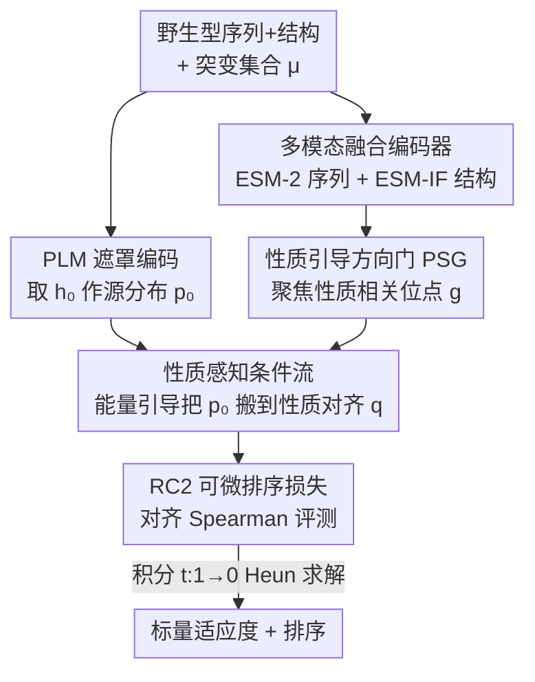

# RankFlow: Property-aware Transport for Protein Optimization

**会议**: ICLR 2026  
**OpenReview**: [https://openreview.net/forum?id=uS5rA4fDJp](https://openreview.net/forum?id=uS5rA4fDJp)  
**代码**: 待确认  
**领域**: 计算生物学 / 蛋白质优化 / 条件流匹配  
**关键词**: 蛋白质适应度预测、条件流、能量引导、可微排序、表征转换

## 一句话总结
RankFlow 不再把蛋白质语言模型（PLM）的嵌入直接接一个回归头去拟合适应度数值，而是学一个能量引导的条件流，把"与性质无关"的 PLM 表征**搬运**成"与目标性质对齐"的分布，再配上一个可微排序损失（RC2）和一个性质引导的方向门（PSG），在 ProteinGym、PEER、FLIP 三大基准上拿到 SOTA 的排序精度和更强的跨实验泛化。

## 研究背景与动机

**领域现状**：蛋白质优化的核心是建模适应度地形（fitness landscape）——把序列/结构的突变映射到实验测得的功能读数（稳定性、结合亲和力、酶活等）。由于带标签数据稀缺，主流做法是用预训练 PLM（ESM 系列）的似然或嵌入，要么做零样本突变效应打分，要么在某个 DMS（深度突变扫描）实验上接回归头做有监督微调。

**现有痛点**：作者指出两个被忽视的关键问题。其一，PLM 表征是**性质无关**（property-agnostic）的——它同时编码了可折叠性、稳定性、表达量等多种甚至互相竞争的进化约束，直接拿来用会稀释甚至压制你真正关心的那个性质的信号，让预测偏向"像野生型"而非"性质更优"。其二，很多适应度预测方法**假设突变效应可加**，忽略了多突变之间的高阶相互作用（上位效应，epistasis），在高阶突变体上预测会系统性出错，而恰恰是这些非加性交互主导了功能变化。

**核心矛盾**：在 DMS 标签只有几百到几千条的小数据下，"点对点回归"既容易过拟合到单个实验的数据集偏置，又抓不住组合突变的交互；而下游评测用的是**排序**指标（Spearman 相关），训练目标却在拟合**绝对数值**，训练与评测协议不一致。

**本文目标**：(1) 把性质无关的 PLM 表征重塑成性质对齐的分布；(2) 显式建模多突变集合的交互；(3) 让训练目标与排序评测对齐，从而提升对未见实验的泛化。

**切入角度**：与其直接预测一个标量，不如把"表征本身"当作可以被搬运的分布。借鉴能量引导流与引导流匹配（guided flow），用观测到的适应度构造能量函数，让流的动力学把高适应度突变体的表征推向"高适应度区域"，使它们在表征空间里天然地排在低适应度突变体前面。

**核心 idea**：用一个**能量引导的条件流**把 PLM 嵌入"运输"成性质对齐分布（替代回归头），再用**可微排序损失**对齐评测、用**性质方向门**聚焦相关位点。

## 方法详解

### 整体框架

RankFlow 把蛋白质适应度预测重新表述成一个条件流匹配（conditional flow-matching）问题。给定野生型蛋白 $x^{wt}$ 和一个突变集合 $\mu$（一次可改多个位点，得到突变体 $x^{mt}$），传统做法是学一个确定性预测器 $F_\theta(x^{wt},\mu)=y$；RankFlow 则改为：把突变体喂进冻结的 PLM、并用 mask token 遮住被突变的氨基酸（去掉关于野生型残基的自我信息），取输出头之前的隐表征 $h_0\in\mathbb{R}^{N\times d}$ 作为**源分布** $p_0$，然后学一个由参数 $\theta$ 决定的条件流，把 $p_0$ 搬运到一个由能量函数倾斜、与目标性质对齐的**目标分布** $q$。

整条管线是：野生型序列+结构 → 多模态融合编码器得到上下文条件 $F$ → 计算性质方向门 $g$ 聚焦相关位点 → 以 $(F,g,\mu)$ 为条件、用能量加权的流匹配把 $h_0$ 运输到性质对齐表征 $\tilde h_1$ → 经 PLM 头读出预测分数 → 用"能量加权流匹配 + 可微排序"双目标训练。推理时固定条件，用固定步长 Heun 求解器从 $t{=}1$ 积分到 $t{=}0$，把终态表征映射成标量适应度。

### 关键设计

**1. 性质感知条件流：用能量把 PLM 表征"搬"向高适应度区域**

这一设计直接针对"PLM 嵌入性质无关、直接回归易过拟合"的痛点。作者不从基分布 $p_0$ 直接采样，而是构造一个能量倾斜分布 $q(h)\propto p_0(h)\exp\{-E(h)\}$，其中 $E(h)$ 编码目标性质。沿高斯条件路径 $p_t(h\mid h_0)=\mathcal{N}(\mu_t h_0,\sigma_t^2 I)$，对应时刻的性质感知分布为 $q_t(h)\propto p_t(h)\exp\{-E_t(h)\}$。要实现这个分布，就学一个时变速度场 $v_t(\theta)$ 去匹配条件向量场 $u_t(h\mid h_0)$，后者对高斯路径有闭式解 $u_t(h\mid h_0)=\dot\mu_t\mu_t^{-1}h+(\dot\mu_t\sigma_t-\mu_t\dot\sigma_t)\sigma_t\mu_t^{-1}\nabla_h\log p_t(h\mid h_0)$。

能量函数是这一设计的灵魂，作者把它设计成**跨实验不变**的，结合两个原则：高适应度突变体应被偏好，且偏离局部替换模式的突变体应被突出。具体地，用一个替换感知编辑距离 $d_{sub}(i,j)$ 度量两个突变体的相似度（$d_{sub}{=}1$ 表示只差一步突变动作），据此为每个突变体定义半径 $r$ 内的邻域 $N(i)$，算出核权重 $\hat K_{ij}=\exp(-d_{sub})$ 归一化后的局部基线 $\bar{\tilde y}_i$ 与方差 $s_i$。最终能量为

$$E_i(h)=-\Big(\lambda\,\tilde y_i+(1-\lambda)\,\frac{\tilde y_i-\bar{\tilde y}_i}{\sqrt{s_i}}\Big),\qquad w_i(t)\propto\exp\{-\beta E_i(h)\}.$$

其中 $\tilde y_i$ 是标准化后的全局适应度（把嵌入推向全局高适应度区），$(\tilde y_i-\bar{\tilde y}_i)/\sqrt{s_i}$ 衡量该突变体相对局部替换趋势有多"反常"，$\lambda$ 调和两者，$\beta$ 控制权重锐度。这样既奖励全局高适应度、又突出局部异常的突变体，使流的搬运方向天然倾向"高适应度且有信息量"的方向。

**2. RC2 可微排序损失：让训练目标对齐排序评测而非绝对数值**

纯能量加权流匹配损失 $L_{PFM}(\theta)=\mathbb{E}[\tilde w_i(t)\,\|v_t(h;\theta)-u_t(h\mid h_0)\|_2^2]$ 在无限数据下能到全局最优，但现实中很多实验只有几百条标签，不足以学到精确匹配性质数值的复杂运输映射。作者因此提出 Rank-Consistent Conditional Flow Loss（RC2）。

做法是：把 $h_0$ 过流模型 $G(\theta)$ 得到预测终态 $\tilde h_1$，用 PLM 头算 logits $\tilde Q^{tgt}$，再把预测分数定义为各突变位点上的 logit 差之和 $\tilde y_i\simeq\sum_{m\in\mu_i}\big(\log\tilde Q^{tgt}_{m=x^{mt}_m}-\log\tilde Q^{tgt}_{m=x^{wt}_m}\big)$——这个读数对 logit 尺度不变，只聚焦真正驱动性质变化的突变。然后最小化预测分数 $\tilde y$ 与真实标签 $y$ 之间的**可微 Spearman 相关**的代理：

$$L_{RFlow}(\theta)=\lambda_{rank}\big(1-\rho_{soft}(R_\tau(\tilde y),R(y))\big),$$

其中 $R_\tau(\cdot)$ 是带温度 $\tau$ 的可微排序算子（沿用 Cuturi 等的可微排序），$R(\cdot)$ 对真值用硬排序。总损失 $L(\theta)=L_{PFM}(\theta)+L_{RFlow}(\theta)$。这一设计的价值在于：评测用 Spearman，训练就直接优化排序一致性，让模型只要把突变体的相对顺序排对、不必拟合绝对值，从而对噪声更鲁棒、对未见实验泛化更好。

**3. 性质引导方向门（PSG）：把学习聚焦到性质相关位点、压制无关进化偏置**

即便有了上面的目标，PLM 的进化信息仍是性质无关的，会把更新引向对当前实验中性甚至有害的方向。PSG 的思路是先离线找出"区分高/低性质"的方向，再用它给每个位点打门控分数。具体地，取训练集按测量性质排序的上、下 $\xi$ 分位（默认 $\xi{=}0.3$）集合 $S_+,S_-$，定义野生型条件的 token 增量 $\Delta h_i^{(\ell)}=h^{(\ell)}(x^{mt}_i)-h^{(\ell)}(x^{wt})$（用最后一层），对每个集合求逐位置平均后构造方向矩阵 $V^{(\ell)}=\mu_+^{(\ell)}-\mu_-^{(\ell)}$，它指向"高性质 vs 低性质"在表征空间的分离方向，训练前算一次并缓存。

训练时对每个突变体的每个位置 $n$，用余弦相似度打分 $w_{i,n}=\langle\Delta h_{i,n}^{(\ell)},V_n^{(\ell)}\rangle/(\|\Delta h_{i,n}^{(\ell)}\|\,\|V_n^{(\ell)}\|+\varepsilon)$：分数大且正说明该位点对齐高性质方向，负则相反。再经 sigmoid 转成门向量 $g_i=\gamma\,\sigma(w_i)$，作为条件喂给流模型，让它把学习集中在携带目标性质信号的位点、削弱反映无关进化信号的位点的影响，从而减少"偏向野生型"的倾向、锐化编辑信号。

**4. 多模态融合编码器 + 条件流头：把序列、结构与突变信息组装成流的条件**

为了给流提供足够的上下文，RankFlow 用结构编码器 ESM-IF 抓野生型的几何上下文、用序列 PLM ESM-2 抓进化信息，两路各过一个 MLP 投影后用自注意力块融合成统一表征 $F\in\mathbb{R}^{N\times d}$。条件流头负责预测每个时刻的速度场 $v_t$：它在突变位点上加可学习嵌入（每个位点一个），对突变集合 $\mu$ 构造 $c_m(\mu)=\phi_{pos}(m)+\phi_{aa}(\mu_m)$（位置与氨基酸嵌入相加）并拼到 $h_0$ 上，让流能学到**突变特异**的调整——这正是它建模多突变集合交互、超越加性假设的关键载体。流头以当前状态 $h_t$、突变集合 $\mu$ 和条件 $C=\{F,g\}$ 为输入，主体是带时间嵌入与层归一化的轻量 U-Net 块堆叠，参数化为 $v_t(h\mid C;\theta)$。

### 损失函数 / 训练策略

训练即标准条件流匹配：对每个突变体取冻结 PLM 的 $h_0$、融合表征 $F$、方向门 $g_i$ 组成条件 $C_i$；采样 $t\sim U(0,1)$，构造噪声态 $h_t=\mu_t h_0+\sigma_t\varepsilon$（$\varepsilon\sim\mathcal{N}(0,I)$，调度器固定），按闭式算目标速度 $u_t$；流头预测 $v_t$，用能量加权 $L_{PFM}$ 与排序一致 $L_{RFlow}$ 联合优化。超参上，$\lambda$ 在 $\{0,0.25,0.5,1\}$ 粗扫，通常取 $0.5$；时间调度选 cosine 优于 linear；在少数代表性实验上选定后，对全部 ProteinGym 实验复用同一配置、不逐实验调参。

## 实验关键数据

### 主实验

在 ProteinGym（201 个 DMS 数据集，排除野生型 >1024 残基）、PEER 的 β-lactamase 与 Fluorescence、FLIP 的 GB1 上，RankFlow（序列+结构）在 Random 方案下全面 SOTA：

| 基准 / 类别 | 指标 | RankFlow | 次优 (DePLM-ESM2) | 说明 |
|--------|------|------|----------|------|
| ProteinGym Stability | Spearman | **0.911** | 0.897 | 稳定性 |
| ProteinGym Fitness | Spearman | **0.742** | 0.707 | 适应度 |
| ProteinGym Activity | Spearman | **0.722** | 0.693 | 酶活 |
| β-lact. | Spearman | **0.912** | 0.904 | PEER |
| GB1 | Spearman | **0.689** | 0.665 (DePLM-ESM1v 0.676) | FLIP 2-vs-rest |
| Fluo. | Spearman | **0.687** | 0.662 | PEER |

在 ProteinGym 三种划分（Random/Modulo/Contiguous）下，RankFlow 在 Random 与 Modulo 上最高，聚合平均最高（0.669 vs Kermut 0.655）；只有 Contiguous（整段连续位点被完全留出）略逊于核方法 Kermut（0.589 vs 0.591），说明它更擅长利用分散的上下文信息，整体对分布漂移更稳定。

### 跨实验泛化与效率

按 DePLM 设置，对每个测试集从同类别另选 40 个实验训练（序列相似度 <50% 防泄漏），RankFlow 在五个类别全面领先，且**参数量远小**：

| 模型 | 可训练参数 | Stability | Fitness | Binding | Activity |
|------|-----------|-----------|---------|---------|----------|
| SaProt (FT) | 650M | 0.703 | 0.442 | 0.391 | 0.495 |
| DePLM (ESM2) | 42.2M | 0.773 | 0.480 | 0.441 | 0.518 |
| RankFlow | **37.1M** | **0.797** | **0.515** | **0.457** | **0.554** |

参数仅 SaProt 的约 1/18（37.1M vs 650M），单张 A100 约 1 小时即可训完，而部分大模型基线需数天。

### 消融实验

| 配置 | 关键效果 | 说明 |
|------|---------|------|
| Full model | 最优 | 完整 RankFlow |
| 仅 $L_{PFM}$（能量流） | 各实验/突变深度增益最大 | 性质感知流匹配是主力 |
| 仅 $L_{RFlow}$（RC2） | 在高突变深度时尤为有用 | 组合爆炸下监督稀缺时排序对齐救场 |
| w/o 方向门 $g_i$ | 优于仅 RC2 变体 | 聚焦性质相关位点有正贡献 |
| w/o 结构信息 | 中等下降（Fitness/Activity 明显） | 但仍超过 ESM2(FT)/SaProt(FT) 等纯序列强基线 |

### 关键发现
- 贡献最大的是**能量引导流匹配** $L_{PFM}$——跨各类实验与突变深度增益最大，说明"把表征搬向性质对齐分布"这一核心机制是性能根基。
- **RC2 排序损失在高阶突变上最关键**：突变越深，可加假设越失效、可靠监督越稀缺，排序一致目标此时最能稳住泛化。
- RankFlow 优先预测的高适应度突变体富集在**溶剂暴露位点**、远离活性位点（AICDA_HUMAN 案例），与已知生物学观察一致，说明排序不是数值上的拟合假象。
- 重组 PLM 内部信息可**超过 MSA 类方法**（ESM-MSA/Tranception），即不靠多序列比对也能拿到更优排序。

## 亮点与洞察
- **把"预测适应度数值"换成"运输表征分布"**：用条件流 + 能量倾斜，让高适应度突变体在表征空间天然排前，绕开了小数据下回归头过拟合的老问题——这是最"啊哈"的视角转换。
- **训练目标直接对齐评测协议**：RC2 把不可微的 Spearman 换成可微代理，再加上"只用突变位点 logit 差求和"的尺度不变读数，把排序信号干净地引入流匹配，值得迁移到任何"评测看排序、训练却拟合数值"的任务。
- **离线方向缓存 + 门控**：PSG 先用高/低性质均值差缓存一个方向 $V$，再用余弦相似度逐位点打门，几乎零额外训练成本就把性质无关的预训练表征"调焦"到目标性质，是个轻量可复用的 trick。
- **轻量高效**：37.1M 参数、单卡 1 小时，相比动辄 650M、需数天的全量微调，工程友好度很高。

## 局限与展望
- **Contiguous 划分上不及核方法 Kermut**：当一整段连续位点被完全留出时，流的优势消失，说明对"完全未见的连续区域"外推仍有短板。
- 能量函数与 PSG 都依赖训练集统计（局部邻域、上下分位均值），在**极小样本或标签噪声极大**的实验上，邻域基线 $\bar{\tilde y}_i$、方向 $V$ 的估计可靠性存疑，论文未充分讨论其敏感性。
- 排除了野生型 >1024（泛化实验 >1024，主表 >1024 也做了排除）的长蛋白，对超长蛋白的适用性未验证。
- 不确定性估计沿用 ProteinNPT 的 MC-Dropout+重采样，仅与 Stable 系列"可比或略高"，并非该方向的强项；未来可把不确定性纳入流的训练目标本身。
- 改进思路：把能量函数做成可学习的（而非手工组合全局+局部项），或将 PSG 的方向向量随训练在线更新而非一次性缓存，可能进一步提升对分布漂移的鲁棒性。

## 相关工作与启发
- **vs DePLM**：同样用生成式模型，但 DePLM 近似可加效应、按独立位点处理；RankFlow 直接学条件流把性质无关嵌入运输到性质对齐分布，并用突变集合的可学习嵌入显式建模高阶上位交互，在各基准上稳定超过 DePLM。
- **vs Kermut（高斯过程核方法）**：Kermut 用序列+结构复合核达到强性能，但继承精确 GP 的立方复杂度、在大/密集变体库上需截断或子采样；RankFlow 是 PLM 之上的轻量流，可扩展到大而多样的变体库，仅在 Contiguous 划分上略逊。
- **vs ProteinNPT / 元学习回归器（Beck et al.）**：后者训练/推理计算与内存开销大、并对长蛋白或大量相关任务有依赖；RankFlow 参数更少、单卡一小时可训，数据与计算效率都更友好。
- **vs 纯回归微调（ESM2/SaProt FT）**：回归头在单实验上 in-assay 强、但易引入数据集偏置、跨蛋白泛化差；RankFlow 用排序一致 + 分布运输换来更强的 OOD 泛化。

## 评分
- 新颖性: ⭐⭐⭐⭐⭐ 把适应度预测重构成能量引导的表征运输 + 可微排序，视角新颖且自洽
- 实验充分度: ⭐⭐⭐⭐⭐ 覆盖 ProteinGym/PEER/FLIP、三种划分、泛化、不确定性、消融，证据链完整
- 写作质量: ⭐⭐⭐⭐ 方法公式密集但推导清晰，部分符号（能量、门控）需结合图反复对照
- 价值: ⭐⭐⭐⭐⭐ 轻量高效、泛化强，对真实蛋白工程的小数据场景实用价值高

<!-- RELATED:START -->

## 相关论文

- [\[ICLR 2026\] Fast and Interpretable Protein Substructure Alignment via Optimal Transport](fast_and_interpretable_protein_substructure_alignment_via_optimal_transport.md)
- [\[ICLR 2026\] Property-Driven Protein Inverse Folding with Multi-Objective Preference Alignment](property-driven_protein_inverse_folding_with_multi-objective_preference_alignmen.md)
- [\[ICML 2026\] Flexible Kernels for Protein Property Prediction](../../ICML2026/computational_biology/flexible_kernels_for_protein_property_prediction.md)
- [\[ICLR 2026\] KGOT: Unified Knowledge Graph and Optimal Transport Pseudo-Labeling for Molecule-Protein Interaction Prediction](kgot_unified_knowledge_graph_and_optimal_transport_pseudo-labeling_for_molecule-.md)
- [\[ICLR 2026\] Enhancing Molecular Property Predictions by Learning from Bond Modelling and Interactions](enhancing_molecular_property_predictions_by_learning_from_bond_modelling_and_int.md)

<!-- RELATED:END -->
