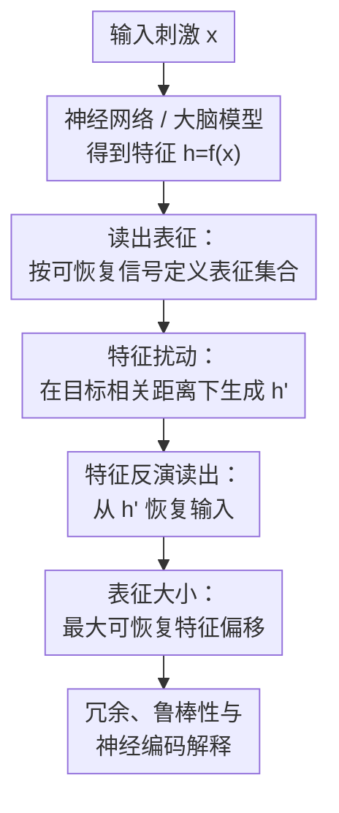

# Readout Representation: Redefining Neural Codes by Input Recovery

**会议**: ICLR2026  
**OpenReview**: [https://openreview.net/forum?id=pODHH9DLeA](https://openreview.net/forum?id=pODHH9DLeA)  
**代码**: 有（supplementary material）  
**领域**: 计算神经科学 / 神经表征  
**关键词**: 神经编码、读出表征、特征反演、表征冗余、计算神经科学  

## 一句话总结
这篇论文提出用“能从神经特征中读出什么”而不是“这个特征由什么输入因果地产生”来定义神经表征，并用视觉与语言模型的扰动特征反演实验表明：同一个输入往往对应特征空间中一大片可恢复区域，表征大小可作为刻画冗余、鲁棒性和单样本可表征性的指标。

## 研究背景与动机
**领域现状**：神经科学和深度学习里讨论 sensory representation 时，最常见的图景是层级因果处理：刺激进入系统，低层提取边缘、纹理、局部结构，高层逐步抽象出物体、语义或任务相关变量。这个图景支撑了大量分析工具，例如神经流形、表征相似性分析、信息瓶颈、特征可视化和深网特征反演。

**现有痛点**：因果视角很自然，但它把“表征内容”紧紧绑在“造成这个神经状态的输入”上。这样一来，错觉、梦境、心理意象、注意调制等现象就很难被描述：一个人把绳子看成蛇时，神经活动确实由绳子触发，但主观内容和后续行为更像“蛇”。如果只说这个状态表征绳子，就解释不了 misrepresentation；如果硬说它表征蛇，又和因果来源冲突。

**核心矛盾**：层级抽象通常被理解为丢弃细节、保留任务相关信息；但神经解码和深网反演研究又反复显示，细粒度输入信息即使在较高层也能被恢复。也就是说，系统似乎一边做抽象，一边又保留了大量可读出的细节。问题不只是“信息有没有残留”，而是我们该用什么定义去描述这种残留信息的表征地位。

**本文目标**：作者想把哲学中的 informational view 和 teleological view 变成可操作的计算框架：给定一个读出过程，如果某个信号能从一类神经特征中被恢复，就说这些特征表征该信号。进一步，作者希望量化同一信号在特征空间中占据多大的可读出区域，并检验这个大小是否和冗余、鲁棒性、模型表现以及输入样本性质有关。

**切入角度**：论文选择深度神经网络作为完全可观测的测试平台，因为人工模型里可以直接拿到中间特征、主动扰动特征、再做输入恢复。这个设置避开了真实大脑中测量噪声和不可控扰动的困难，但问题意识来自计算神经科学：如果梦境、错觉、脑解码都可以通过读出内容来理解，那么人工网络里“从扰动特征仍能恢复输入”的现象也许能提供一个更清晰的表征定义。

**核心 idea**：用 readout representation 把一个输入的表征从“单个由输入产生的特征点”改写成“所有能够读出该输入信息的特征集合”，再用 representation size 度量这个集合在特征空间中有多大。

## 方法详解

### 整体框架
这篇论文的方法不是提出一个新的识别模型，而是提出一套表征定义和一组验证实验。整体流程是：先形式化“读出表征”，再用特征反演作为读出器，把原始特征沿特征空间扰动，检查输入是否仍能从扰动后的特征中恢复；最后用可恢复的最大扰动距离定义 representation size，并用视觉、语言和简化神经模型分析它的含义。

在定义层面，作者把神经系统或神经网络写成 $f:X\times\Xi\to H$，其中 $x\in X$ 是输入刺激，$\xi\in\Xi$ 是脑状态或上下文，$h\in H$ 是神经特征。目标信号空间记作 $S$，参考映射 $\bar{\pi}:X\to S$ 给出输入对应的真实信号，读出过程 $\pi:H\to S$ 负责从特征中恢复信号。传统因果视角问的是“$h$ 是由哪个 $x$ 产生的”，本文问的是“通过 $\pi$，$h$ 能读出哪个 $s$”。

在实验层面，论文把 $\pi$ 实例化为 feature inversion。给定目标特征 $h$，读出器寻找一个输入 $x$，使网络对这个输入的特征 $f(x)$ 尽可能接近 $h$。如果扰动后的特征 $h'$ 距原始特征已经很远，但反演出来的输入仍接近原图或原文本，就说明这个输入不是只由原始特征点表示，而是由特征空间中一片可恢复区域表示。

### 关键设计
**1. 读出表征：把神经代码从因果来源改成可恢复内容**

论文最关键的概念转换，是把“表征”定义为读出关系：$h\in H$ 表征 $s\in S$ 当且仅当 $s=\pi(h)$。于是同一个信号 $s$ 的 readout representation 就是集合 $H_s^\pi=\{h\in H\mid \pi(h)=s\}$。这和通常把 $h=f(x)$ 当作输入 $x$ 的表示不同，因为它允许多个不同的神经状态都表征同一个信号，只要它们被同一个读出过程恢复为同一内容。

这个定义的好处在于，它能自然处理错觉和梦境。比如绳子被误认为蛇时，口头报告读出器 $\pi_o$ 从神经状态中读出“蛇”，而参考映射 $\bar{\pi}(x)$ 指向“绳子”，于是可以说该状态 misrepresents：$\pi_o(h)\neq\bar{\pi}(x)$。同一个框架还可以换成脑解码器 $\pi_d$，比较早期视觉区和高级视觉区分别读出什么内容，从而定位误表征在层级处理中哪里出现。

**2. 表征大小：用最大可恢复特征偏移量量化冗余区域**

只有集合定义还不够，作者还希望知道这个集合有多“宽”。因为反演优化存在数值误差，论文使用阈值放宽版本：$H_{x,t}^\pi=\{h\in H\mid \forall x'\in\pi(h), d_X(x,x')<t\}$。直观地说，只要从 $h$ 读出的输入和原始输入足够接近，就把 $h$ 算进该输入的可读出表征集合。

在具体实验里，representation size 被定义为这个放宽集合里离原始特征最远的特征距离：$r_x=\max\{d_H(h,f(x))\mid h\in H_{x,t}^\pi\}$。视觉任务中 $d_X$ 主要用图像相关距离，阈值设为 $0.1$；语言任务中 $d_X$ 用 token error rate，阈值设为 $0.3$。因此 $r_x$ 可以理解为“在特征空间里把这个样本推多远，输入信息仍然可被读回”。它不是数据集级别的互信息，也不是两组样本的 RSA 相似性，而是一个单样本、单层、读出器相关的鲁棒表征指标。

**3. 扰动特征反演：直接测试一片特征区域是否仍含有输入信息**

为了探测 $H_{x,t}^\pi$ 的边界，作者没有只反演原始特征，而是对原始特征加高斯噪声，生成预设相关距离的扰动特征 $h'=h+\epsilon$。噪声方差按目标 feature correlation distance $c$ 标定，近似满足 $c\approx1-1/\sqrt{1+\sigma^2/\mathrm{Var}(h)}$，从而可以系统扫描 $d_H\in\{0.1,0.2,\ldots,0.9,0.99\}$。

读出过程采用 feature inversion。视觉模型里，用 Deep Image Prior 作为弱结构先验，通过优化 DIP latent 使 $f(g(z))$ 匹配目标特征，视觉 loss 是 MSE；语言模型里，直接优化 token logits，softmax 成连续 token 分布送入模型，loss 是 MSE 与 cosine loss 的组合。这样做的重点不是追求最漂亮的重建图，而是问一个判别性问题：当 $h'$ 与 $h$ 的相关距离已经很大时，反演结果是否仍和原始输入相近。

**4. 冗余机制解释：高维特征空间让一个低维输入落在宽阔可读出区域中**

论文没有把“可从扰动特征恢复输入”简单解释成优化技巧，而是把它和表征冗余联系起来。视觉模型的层级分析显示，feature dimension 越高的层通常 representation size 越大，尤其在低到中层更明显；高层则可能因为任务抽象和压缩而削弱这种关系。这说明高维 ambient space 给低维自然输入流形提供了冗余编码空间。

简化 toy model 进一步说明这个机制：一维刺激 $X=[0,1)$ 经过 100 个 bell-shaped tuning neurons 编码成高维神经特征，形成低维神经流形。由于特征空间维度远高于输入维度，许多偏离流形附近的扰动点仍可通过最近特征读回原输入。这个例子和真实大脑里的 population code 很接近：神经群体活动不是一个单点标签，而是一个有宽度、有冗余、能容忍噪声的可读出区域。

### 损失函数 / 训练策略
论文主要是分析框架，实验没有训练新的主模型，而是使用预训练视觉和语言模型作为被分析对象。视觉模型包括 VGG19、CLIP、DINOv2 和 SDXL-VAE；语言模型包括 BERT、GPT2 系列和 OPT 系列。视觉实验从 ImageNet 抽取 64 张自然图像，语言实验从 C4 validation split 抽取 64 段文本并截断到最多 256 tokens。

特征反演的优化设置相对统一：视觉侧优化 DIP latent，学习率 $0.0001$，迭代 $10{,}000$ 步，并使用线性学习率衰减；语言侧优化 token logits，学习率 $0.1$，同样迭代 $10{,}000$ 步。优化器为 PyTorch AdamW。视觉主实验使用 DIP 来减少高频伪影，但附录也报告了不使用 DIP 的消融，趋势仍然存在，因此作者认为大表征区域并非纯粹由图像先验制造。

实验层选择覆盖不同架构和深度。VGG19 分析全部 16 个卷积层，Transformer 模型分析约每四分之一深度的代表层。作者还用 hit/miss 图像、自然图像/噪声图像、随机初始化 VGG19，以及 100 个调谐神经元 toy model 做补充分析，目的是把 representation size 从“重建现象”推进到“可解释的冗余指标”。

## 实验关键数据

### 主实验
视觉主实验的核心发现是：在多个视觉模型的低到中层，即使特征被严重扰动，原图仍能高保真恢复。VGG19 的低层尤其明显，feature correlation distance 到 $0.7$ 时，恢复图像与原图的像素相关距离仍可保持在 $0.1$ 以内。DINOv2 和 CLIP 也呈现类似趋势，只是不同模型和层的范围不同。

| 模态 / 模型 | 读出对象 | 关键设置 | 主要结果 | 解释 |
|-------------|----------|----------|----------|------|
| VGG19 | ImageNet 图像 | 16 个卷积层，64 张图像，DIP 反演 | 低到中层在 $d_H\le 0.7$ 时仍常能保持 $d_X<0.1$ | 原图信息覆盖一大片特征区域 |
| DINOv2-giant | ImageNet 图像 | quarter-depth 层，64 张图像 | 低到中层也能从明显扰动特征恢复图像 | ViT 自监督表征同样有宽读出区域 |
| CLIP-large | ImageNet 图像 | quarter-depth 层，64 张图像 | 低层恢复稳定，中高层随层深衰减 | 视觉-语言目标没有消除底层细节冗余 |
| BERT | C4 文本 | 256 tokens，优化 token logits | 低到中层在高扰动下仍接近完美恢复 | 文本 token 信息在部分层高度冗余 |
| OPT-350m | C4 文本 | quarter-depth 层 | 低到中层可在 $d_H\approx0.7$ 附近保持高恢复质量 | 部分自回归 LM 也有扩展读出表征 |
| GPT2 系列 | C4 文本 | GPT2 small 到 XL | 恢复弱于 BERT / OPT-350m，但显著高于随机猜测 | 表征大小受架构和训练目标影响 |

作者还检查了输入空间距离指标的稳健性。视觉侧除了像素相关距离，也用 SSIM、PSNR、LPIPS 和 DISTS 重复评估，定性结论一致。附录中的图像网格显示，在 VGG19 的 conv1 到 conv3 层，即便特征距离逐步增加到 $0.8$ 或 $0.9$，重建图仍保留物体轮廓和主要结构；高层则更快丢失精细内容。

### 消融实验
representation size 的应用实验从两个角度说明它不是单纯的反演可视化分数，而能反映单样本表征状态。第一，VGG19 正确分类的 hit 图像比 miss 图像有更大的 representation size，尤其在较高层更明显。第二，自然图像比均匀随机噪声图像有非零且更大的 representation size，而噪声图像在各层几乎为零。

| 配置 / 对比 | 观察指标 | 结果 | 说明 |
|-------------|----------|------|------|
| VGG19 hit vs miss | representation size | hit 图像整体更大，深层差异更明显 | 成功分类样本有更冗余、更鲁棒的表征区域 |
| 自然图像 vs 噪声图像 | representation size | 噪声图像各层为 0，自然图像明显非零 | 模型对自然输入有更强的可读出结构 |
| 随机初始化 VGG19 | representation size | hit/miss 与自然/噪声差异仍部分存在 | 架构本身就偏向某些图像结构 |
| 训练 VGG19 vs 随机 VGG19 | representation size | 训练模型在中高层对自然图像 size 更大 | 训练会扩展与数据分布相关的表征区域 |
| 不使用 DIP 的视觉反演 | 重建质量与趋势 | 画质下降，但大扰动可恢复趋势仍存在 | 结论不是强生成先验的假象 |
| toy tuning model | 可读出扰动点分布 | 单个输入对应 PC 空间中一片 magenta 区域 | 高维冗余可产生扩展读出表征 |

### 关键发现
- 最核心的经验事实是：同一个输入并不只对应一个“标准特征点”。在多个模型和层中，离标准特征很远的扰动点仍可以通过反演读出相同或近似相同的输入。
- 这种现象主要出现在低到中层；越靠近任务输出层，细粒度输入恢复越弱，说明抽象和压缩仍然存在，但它们并不等于细节信息被简单清空。
- representation size 和模型表现有关。正确分类图像的 size 更大，说明模型对某个样本“会不会处理好”可能部分反映在这个样本的可读出区域宽度上。
- representation size 同时受到架构偏置和训练影响。随机 VGG19 也偏向自然图像结构，但训练会进一步扩大自然图像在中高层的可恢复区域。
- 语言模型之间差异较大，BERT 与 OPT-350m 的低中层恢复强，GPT2 系列表现较弱，提示 readout representation 可能可以作为比较不同训练目标、上下文建模方式和层内冗余的分析工具。

## 亮点与洞察
- 这篇论文最有意思的地方，是把一个哲学和神经科学中的老问题变成了可测量对象。过去说“表征应该按信息内容而非因果来源理解”容易停留在概念层面，本文通过 $H_s^\pi$ 和 $r_x$ 把它落到特征空间几何上。
- 它对“抽象会丢失细节”的直觉给出了一种修正：抽象层可以在任务方向上变得更语义化，同时在高维冗余方向上保留大量可恢复信息。这个视角能解释为什么高层特征既能用于分类，又能支持图像重建或脑活动解码。
- representation size 是单样本指标，这一点很有价值。很多表征分析方法需要一批样本才能定义相似性、流形或信息量，而本文的指标可以问“这个具体样本在某层是否被宽阔而鲁棒地表示”。这对故障诊断、置信度估计、异常样本分析都有迁移潜力。
- 从计算神经科学角度看，readout representation 给错觉、梦境、注意和 mental imagery 提供了统一语言：表征内容取决于什么可以被下游读出，而不是外部世界刚刚给了什么刺激。这与脑解码研究中“用清醒感知训练的 decoder 解码梦境或想象内容”的经验事实高度契合。
- 论文把 metamers 的方向反过来了。metamers 关注多个输入坍缩到同一表示，暴露模型不可区分的输入不变性；本文关注多个特征都能读出同一输入，刻画一个输入在表征空间中的冗余和鲁棒性。两者合在一起，能更完整地描述神经代码的多对一和一对多关系。

## 局限与展望
- readout representation 强依赖读出器 $\pi$。如果 $\pi$ 使用很强的扩散模型或 GAN 先验，读出的内容可能来自先验补全，而不完全来自特征本身。本文选择 DIP 是为了降低这个风险，但实际应用到脑数据或生成模型时，读出器选择仍会决定解释边界。
- representation size 当前只是初步展示。论文说明它和 hit/miss、自然/噪声、维度和训练有关，但还没有系统证明它能稳定预测鲁棒性、泛化、置信度或神经行为表现。作为模型诊断指标，还需要更大规模的验证。
- 用特征扰动探测人工网络很直接，但真实大脑不能随意把某个脑区活动移动到指定相关距离。因此框架适用于生物神经系统的概念解释，真正落地到实验神经科学时可能需要用自然 trial-to-trial variability、刺激扰动、闭环刺激或解码不确定性来替代人工特征扰动。
- 语言模型结果差异尚未完全解释。GPT2 和某些 OPT 变体恢复较弱，可能与自回归训练、层归一化、token embedding 几何、上下文依赖或优化难度有关。后续可以把读出器换成离散搜索、编辑距离约束或模型内部 decoder，分离“真实不可恢复”和“优化没找到”的影响。
- 这个框架默认“可读出”就足以构成某种表征，但在认知科学里，下游功能是否真实存在也很重要。未来可以把 $\pi$ 限制为生物可实现的线性读出、行为相关读出或特定脑区间连接，而不是任意强大的优化式反演。

## 相关工作与启发
- **vs hierarchical-causal view**: 传统层级因果视角强调输入如何逐层造成神经特征，本文强调特征可被读出为何种信号。前者适合解释 feedforward 处理链，后者更适合处理错觉、梦境和同一内容的多特征实现。
- **vs feature inversion**: Mahendran & Vedaldi 等工作用反演理解深网中间表示，本文把反演升级为读出器，并进一步主动扰动目标特征，研究“多远仍能恢复”这一表征集合大小问题。
- **vs neural decoding**: 脑解码研究通常证明某类内容能从脑活动读出，本文提供了一个更一般的形式化语言：不同 decoder 对应不同 $\pi$，同一神经状态可以相对于不同读出器表征不同层面的信号。
- **vs RSA / CKA / manifold analysis**: RSA 和 CKA 比较一批样本的表征几何，manifold analysis 关注类别或样本集合的几何结构；representation size 则关注单个输入在单层特征空间里的可恢复区域。
- **vs information bottleneck / mutual information**: 信息瓶颈和互信息常从数据集分布层面讨论压缩和保留，本文的指标更局部，问某个样本的细节是否以冗余方式保存在当前特征里。
- **vs model metamers**: metamers 说明不同输入可以产生相同或近似相同表示，揭示模型不变性；readout representation 说明不同特征也可以读出同一输入，揭示模型表征对特征扰动的容忍度。

## 评分
- 新颖性: ⭐⭐⭐⭐⭐ 读出表征把哲学、神经解码和深网反演接到一个可量化定义上，概念贡献很鲜明。
- 实验充分度: ⭐⭐⭐⭐☆ 覆盖视觉、语言、不同架构、消融和 toy model，但 representation size 的下游预测价值仍是初步案例。
- 写作质量: ⭐⭐⭐⭐☆ 主线清楚，概念定义严谨；不足是实验图和附录很多，读者需要自己把哲学动机和工程设置拼起来。
- 价值: ⭐⭐⭐⭐⭐ 对计算神经科学、表征分析、脑解码和模型诊断都有启发，尤其适合重新思考“神经代码到底是什么”。

<!-- RELATED:START -->

## 相关论文

- [\[ICLR 2026\] A New Paradigm for Genome-wide DNA Methylation Prediction Without Methylation Input](a_new_paradigm_for_genome-wide_dna_methylation_prediction_without_methylation_in.md)
- [\[ICLR 2026\] DeepSADR: Deep Transfer Learning with Subsequence Interaction and Adaptive Readout for Cancer Drug Response Prediction](deepsadr_deep_transfer_learning_with_subsequence_interaction_and_adaptive_readou.md)
- [\[ICLR 2026\] Learning Brain Representation with Hierarchical Visual Embeddings](learning_brain_representation_with_hierarchical_visual_embeddings.md)
- [\[ICLR 2026\] Continuous Multinomial Logistic Regression for Neural Decoding](continuous_multinomial_logistic_regression_for_neural_decoding.md)
- [\[ICLR 2026\] GRAM-DTI: Adaptive Multimodal Representation Learning for Drug-Target Interaction Prediction](gram-dti_adaptive_multimodal_representation_learning_for_drugtarget_interaction_.md)

<!-- RELATED:END -->
