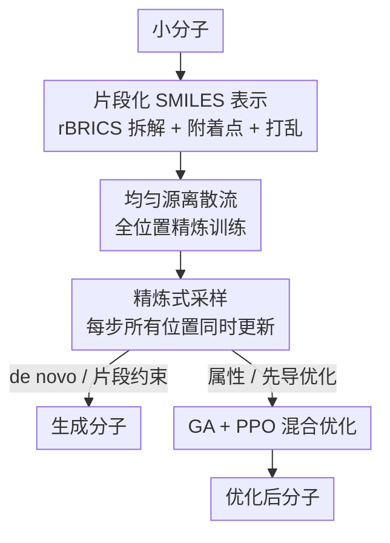

# Refine Drugs, Don't Complete Them: Uniform-Source Discrete Flows for Fragment-Based Drug Discovery

**会议**: ICLR 2026  
**OpenReview**: [https://openreview.net/forum?id=Qdu92a5DiM](https://openreview.net/forum?id=Qdu92a5DiM)  
**代码**: https://github.com/invirtuolabs/InVirtuoGen_results  
**领域**: 计算生物 / 药物设计 / 分子生成 / 离散流  
**关键词**: 离散流、片段化SMILES、均匀源、分子优化、PPO+遗传算法

## 一句话总结
InVirtuoGen 用「均匀源连续时间离散流」在片段化 SMILES 上生成小分子，把生成范式从「逐步补全」改成「全位置同时精炼」，既在 de novo 生成上刷出更优的质量-多样性帕累托前沿，又靠遗传算法 + PPO 的混合优化在 PMO 基准和先导优化上拿到新 SOTA。

## 研究背景与动机

**领域现状**：基于片段的药物发现（FBDD）是工业界和学术界主流的分子探索范式——保留活性骨架/药效团这类关键子结构，只改造周边来调性质。把它自动化的主流做法是序列生成模型：要么用自回归模型（如 SAFE-GPT）按从左到右的固定顺序逐 token 生成，要么用掩码扩散模型（如 GenMol）从全掩码序列出发逐步揭开 token。

**现有痛点**：这两条路都有结构性缺陷。自回归强加了一个从左到右的顺序，但分子本身是无序的图，这个顺序对结构而言是任意的。掩码扩散虽然每一步对整条序列都出预测，但训练损失只在「被掩码的位置」上算误差，导致采样时一旦某个 token 被揭开就被钉死、后续不再更新；更糟的是，采样步数被初始掩码 token 数死死卡住——序列多长就最多走多少步，除非加上人为的 remask 启发式。

**核心矛盾**：「补全式」生成（自回归、掩码扩散）把已生成的部分当成不可改的既成事实，无法对整条分子做协调一致的全局调整，且采样步数与序列长度强耦合，限制了采样精度。

**本文目标**：找一种既能保留片段级控制、又能让所有位置在每一步都被重新审视和更新的生成范式，并把它无缝接到真正有用的下游任务（属性优化、对接分数优化、先导精炼）上。

**切入角度**：作者借用连续时间离散流（discrete flow）框架——它把「均匀分布的随机 token」逐步搬运到「真实数据分布」，天然地在每一步对所有位置出预测、也允许所有位置同时变。

**核心 idea**：refine drugs, don't complete them——用均匀源离散流替代掩码补全，让每个去噪步都同时精炼全部位置，从而把采样步数与序列长度解耦，并让模型能接受整条（甚至不合法的）序列作为输入，方便与遗传算法/PPO 拼接。

## 方法详解

### 整体框架

InVirtuoGen 的输入是一个小分子，输出是新生成或被优化过的分子；中间经过四个阶段：先把分子拆成**片段化 SMILES** 表示，再用**均匀源离散流**在这个表示上训练一个去噪模型（关键是训练损失覆盖所有位置），生成时走**精炼式采样**（每一步所有 token 都可能变），而面向属性/先导优化时，再叠加一层 **GA + PPO 混合优化** 来定向搜索化学空间。

### 关键设计

**1. 片段化 SMILES 表示：让生成的最小单位是「化学有意义的片段」**

普通 SMILES 通过深度优先遍历把分子图压成序列，这种线性化会把有化学意义的子结构切碎，对「保留骨架、拼装片段」几乎没有控制力，不适合 FBDD。本文在 SAFE 表示基础上做了小幅扩展：用修订版 BRICS（rBRICS）算法把分子拆成化学合理的片段块，断键处用形如 $[i*]$ 的附着点显式标号，片段之间用空格分隔。一个关键细节是片段被**随机打乱**而非按原分子里附着点的顺序排列，从而抹掉隐含的顺序偏置——这正配合后面双向、无序的生成范式。序列在原子级别 tokenize（`Cl`、附着点 token 都算单个 token），最终词表只有 204 个 token。这套表示让「片段完整性」和「附着点显式编号」同时成立，是片段级控制的载体。

**2. 均匀源离散流 + 全位置精炼训练：把范式从补全改成精炼**

这是全文的灵魂，直接针对掩码扩散「损失只算被掩码位置、token 一旦揭开就钉死」的痛点。作者采用 Gat 等人的离散流框架，目标是把源分布 $X_0\sim p$ 搬运到目标分布 $X_1\sim q$，其中**源是所有 token 上的均匀分布**。用线性调度，概率路径为

$$p_t(x^i \mid x_0, x_1) = (1-t)\,\delta_{x_0}(x^i) + t\,\delta_{x_1}(x^i),\quad t\in[0,1].$$

训练目标对**序列里每一个位置**都计入预测误差，而不是只算掩码位：

$$\mathcal{L}(\theta) = -\,\mathbb{E}_{t,(X_0,X_1),X_t}\;\frac{1}{1-t^2}\sum_i \log p_{1|T}(X_1^i \mid X_t).$$

其中时间相关的权重 $\tfrac{1}{1-t^2}$（受 Sahoo 等人启发）给轨迹后期更大的权重，逼模型在接近终点时更准。骨架用扩散 Transformer，靠双向自注意力建模片段间的长程依赖。正因为损失覆盖全位置，模型学会的是「在每一步把整条分子往数据分布上拉」，而不是「填空」——这就是 refine 而非 complete 的本质，也让采样步数不再被序列长度绑死。

**3. 精炼式采样：每步所有位置同时变，并把步数与长度解耦**

训练好后，采样不再是「逐个揭开掩码」，而是从均匀随机序列出发，每一步对所有位置重新采样。理论上的离散时间马尔可夫更新为 $X_{t+h}^i \sim \delta_{X_t^i}(\cdot) + h\,u_t^i(\cdot, X_t)$，但作者在实验中发现，直接从模型预测的逐位置分布采样

$$X_{t+h}^i \sim \hat{p}_t^i(X_t)$$

显著优于上式（作者也坦言这一改动缺乏理论依据、但经验上很稳）。采样时把 Gumbel 噪声尺度 $r$ 按 $(1-t)$ 衰减、softmax 温度 $T$ 退火，实现「早期探索、晚期精炼」。由于序列长度被单独因子化为 $p_\theta(x) = p(n)\,p_\theta(x\mid n)$，步长 $h$ 可以任意细化（实验里 $h$ 越小、质量与多样性同时越好），这正是补全式模型做不到的。

**4. GA + PPO 混合优化：把均匀源的「能吃整条序列」变成优化利器**

de novo 生成对真实药物发现用处有限，作者的另一大贡献是面向 PMO 属性优化和先导优化的混合框架。**遗传算法**部分：维护一个高分分子「词库」（两两 Morgan 指纹 Tanimoto 距离 $\geq 0.7$ 保多样性），用基于排名的概率 $p(m)=1/(\text{rank}(m)+\kappa M)$ 选两个父代，按片段化规则拆解后，把一个父代的某片段替换成另一父代的片段（片段空间里直接字符串拼接），产生的后代大多不是合法分子——但没关系，它们只作为离散流采样的初始态 $x_{t=0}$，让模型在其邻域精炼出合法变体；这比 GenMol 在固定 dummy 附着点拼接更灵活。**PPO（Proximal Property Optimization）部分**：离散流没有可解析的整序列 $\log p(x)$，作者用蒙特卡洛在扰动态上估计，优化时间加权的 $\mathcal{L}=\frac{1}{1-t^2}\sum_{\text{noised}}\log\pi_\theta(x_1^i\mid x_t,t)$，优势用 batch 内标准化 $A=\frac{r-\bar r}{\sigma_r+\epsilon}$，再走标准的裁剪 PPO 代理目标。额外用一个**自适应序列长度 bandit** 偏好高回报的长度、同时保留探索。整套流程见 Alg.1（GA 探索与 PPO 微调交替），且**所有任务共用一套超参**，说明增益来自算法设计而非调参。

### 损失函数 / 训练策略

预训练损失即上面带时间权重 $\tfrac{1}{1-t^2}$ 的全位置离散流目标（公式 4），骨架为扩散 Transformer。预训练数据与 GenMol/SAFE-GPT 一致，用 ZINC 与 UniChem（约 10 亿分子）。下游优化阶段用 GA + PPO 交替（公式 7 的时间加权 PPO 损失 + 公式 8 的对接分数惩罚奖励），单一超参配置跨所有任务。

## 实验关键数据

评估覆盖四个任务：de novo 生成、片段约束生成、PMO 目标属性优化、先导优化。

### 主实验

**PMO 基准（带 ZINC250k 预筛，与 GenMol/f-RAG 可比，AUC-top10 之和，3 次平均）**

| 模型 | AUC-top10 之和 (23 任务) |
|------|--------------------------|
| **InVirtuoGen** | **18.993 (±0.219)** |
| GenMol | 18.362 |
| f-RAG | 16.928 |

InVirtuoGen 在 valsartan smarts（0.935 vs 0.822）、sitagliptin mpo（0.743 vs 0.584）、scaffold hop（0.711 vs 0.628）等任务上领先明显。

**PMO 基准（不预筛，与无先验信息的 baseline 可比）**

| 模型 | AUC-top10 之和 |
|------|----------------|
| **InVirtuoGen (no prescreen)** | **16.676 (±0.256)** |
| Genetic GFN | 16.213 |
| Mol GA | 14.708 |
| REINVENT | 14.184 |

值得注意的是 GenMol/f-RAG 名义上用 10k oracle 调用，但预筛 ZINC250k 实际多花了约 25 万次调用（有效预算近 26 万），而 InVirtuoGen 在两种设定下都拿到最高的任务总分。

**先导优化（对接分数 DS，越低越好，5 个靶蛋白）**：在 parp1、jak2 等靶点上 InVirtuoGen 的对接分数显著优于 GenMol/RetMol/GraphGA，例如 parp1 第一个种子达 -14.1（δ=0.4）/ -12.3（δ=0.6），而 GenMol 为 -10.6 / -10.4。在更严的 δ=0.6 相似度约束下，baseline 常常无法产出改进的先导，本文仍然有效。

### 消融实验

| 配置 | 结论 |
|------|------|
| 时间粒度 h=0.001 → 0.1 | h 越小（步数越多）质量与多样性同时越好，high-granularity 增益最大 |
| 直接逐位置采样 (Eq.6) vs 理论更新 (Eq.2) | Eq.6 显著更优（但缺理论证明） |
| PPO 去掉预筛与任何 GA | 仍优于工业常用的 REINFORCE，说明 PPO 适配本身有效 |
| 优化栈各组件 (附录 B.3.1) | GA、PPO、自适应长度 bandit 都有正贡献 |

### 关键发现
- **采样粒度是免费的午餐**：因为步数与序列长度解耦，单纯把 $h$ 调小就能同时提升质量和多样性，这是补全式模型给不了的自由度。
- **「不合法中间态」反而是优势**：GA 产生的非法后代只当初始态，让离散流在其邻域精炼出合法且更优的分子，比固定附着点拼接探索得更广。
- **单一超参跨全任务**：增益来自范式与算法设计，而非逐任务调参，迁移性更强。

## 亮点与洞察
- **范式转换很干净**：把「补全」换成「精炼」只需让训练损失覆盖全位置 + 均匀源，却一举解决了掩码扩散「token 钉死」和「步数受限于长度」两个老问题，思路简洁。
- **表示与范式互相成就**：片段随机打乱去掉顺序偏置，恰好喂给双向、无序的离散流；而离散流能吃整条（含非法）序列，又让 GA 的字符串拼接式交叉变得自然——表示、生成、优化三层咬合得很紧。
- **可迁移 trick**：把 PPO 适配到没有可解析 $\log p(x)$ 的生成模型上（蒙特卡洛估计扰动态对数似然 + 时间加权），这套做法可迁移到其他离散/扩散式生成器的强化微调。

## 局限性 / 可改进方向
- **丢失立体化学**：片段化 SMILES 表示不含立体化学，无法建模立体专一性相互作用；rBRICS 拆解也可能漏掉化学相关的断键模式。
- **指标是粗代理**：SA/QED 与真实成药性相关性弱，缺 ADMET 评估，所有结果都是 proxy-based，需要实验验证（不过这些问题所有 baseline 共享）。
- **采样改动缺理论**：Eq.6 的直接逐位置采样虽经验强，但无理论依据。
- **片段约束与精炼哲学冲突**：片段约束生成靠每步「朴素覆写」固定位置，破坏了学到的流动力学，与本文的精炼范式自相矛盾，作者也承认这是软肋。

## 相关工作与启发
- **vs GenMol（掩码扩散）**：GenMol 损失只算掩码位、token 揭开即钉死、步数受限于掩码数；本文损失覆盖全位置、每步全部可变、步数与长度解耦，因此能用更细粒度采样换更优的质量-多样性前沿。
- **vs SAFE-GPT（自回归）**：SAFE-GPT 强加左到右顺序，与分子的无序本质冲突；本文用双向离散流 + 片段打乱，彻底去掉顺序偏置。
- **vs f-RAG / GenMol 的优化**：它们靠预筛 ZINC250k（多花 25 万 oracle 调用）初始化种群；本文 GA+PPO 在更少有效预算下取得更高 PMO 总分，且全任务共用一套超参。
- **vs Uniform Discrete Language Models（并行工作）**：同样允许 token 同时更新，但仍在扩散框架内；本文是第一个用于片段化 SMILES 的离散流 + 精炼范式模型。

## 评分
- 新颖性: ⭐⭐⭐⭐⭐ 首个片段化 SMILES 上的离散流精炼范式，"refine not complete" 切中掩码扩散两大痛点
- 实验充分度: ⭐⭐⭐⭐ 四类任务 + PMO 双设定 + 先导优化，覆盖全面；但全是 proxy 指标、缺湿实验验证
- 写作质量: ⭐⭐⭐⭐ 范式动机清晰、公式完整，且诚实标注了采样改动与片段约束的理论短板
- 价值: ⭐⭐⭐⭐⭐ 从 de novo 到多目标先导优化的通用生成基座，开源 checkpoint 与代码，实用性强

<!-- RELATED:START -->

## 相关论文

- [\[ICML 2025\] GenMol: A Drug Discovery Generalist with Discrete Diffusion](../../ICML2025/computational_biology/genmol_a_drug_discovery_generalist_with_discrete_diffusion.md)
- [\[ICLR 2026\] FragFM: Hierarchical Framework for Efficient Molecule Generation via Fragment-Level Discrete Flow Matching](fragfm_hierarchical_framework_for_efficient_molecule_generation_via_fragment-lev.md)
- [\[ICLR 2026\] FACET: A Fragment-Aware Conformer Ensemble Transformer](facet_a_fragment-aware_conformer_ensemble_transformer.md)
- [\[ICLR 2026\] Test-Time Adaptation without Source Data for Out-of-Domain Bioactivity Prediction](test-time_adaptation_without_source_data_for_out-of-domain_bioactivity_predictio.md)
- [\[ICLR 2026\] SigmaDock: Untwisting Molecular Docking with Fragment-Based SE(3) Diffusion](sigmadock_untwisting_molecular_docking_with_fragment-based_se3_diffusion.md)

<!-- RELATED:END -->
