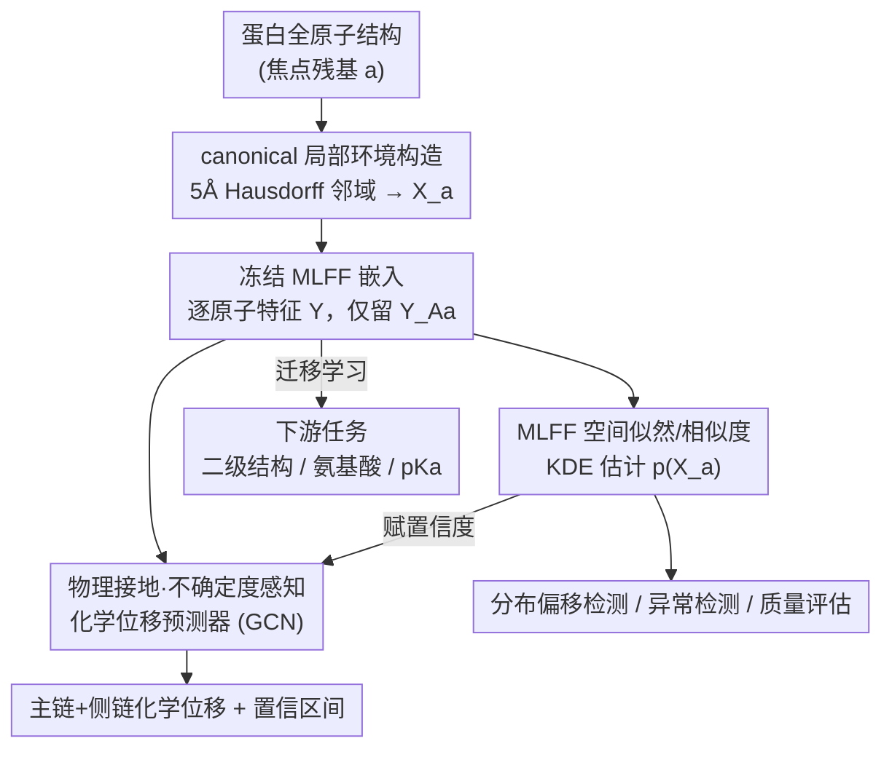

# Representing Local Protein Environments with Machine Learning Force Fields

**会议**: ICLR 2026  
**OpenReview**: [https://openreview.net/forum?id=9ZogcRkhoG](https://openreview.net/forum?id=9ZogcRkhoG)  
**代码**: https://github.com/mb012/MLFF_representation  
**领域**: 计算生物学 / 表示学习 / 蛋白质建模  
**关键词**: 机器学习力场, 局部蛋白质环境, 表示学习, NMR 化学位移, 不确定度估计

## 一句话总结
这篇论文把原本只用来预测能量和受力的机器学习力场（MLFF）的中间层嵌入，重新当作蛋白质局部环境的通用表示来用——只要从冻结的预训练 MLFF 里抽出以某个残基为中心、5Å 邻域内原子的特征，就能零样本地组织出二级结构、氨基酸身份、质子化状态等生化信息，并在 pKa、NMR 化学位移等下游任务上做到 SOTA，还顺带能算似然来给预测打不确定度。

## 研究背景与动机
**领域现状**：在蛋白质上跑机器学习，核心难题之一是怎么表示「局部环境」——即某个残基周围那一小块由原子身份、键、二面角、氢键、静电等共同决定的化学微环境。经典做法是手工设计描述符（二面角、氢键、Parrinello-Behler 对称函数等），近年的序列基础模型（如 ESM）则从海量序列里学表示。

**现有痛点**：手工描述符表达能力有限、跨蛋白和跨任务泛化差；而 ESM 这类序列模型学的是序列共现统计，并不直接编码量子层面的物理（键几何、扭转、电子相互作用），面对罕见化学环境或分布外构象时容易失灵。计算化学里早有人用 ANI 之类抽「原子环境向量（AEV）」做 pKa，但 AEV 是固定的、手工的对称函数描述符，不带消息传递，无法自适应捕捉上下文相关的相互作用。

**核心矛盾**：好的局部表示需要同时满足——对局部变化敏感、对全局变化不敏感、计算快、可跨环境直接比较（canonical）、且能泛化到没见过的环境。序列/手工描述符在「物理接地」和「跨化学泛化」上天然薄弱。

**切入角度**：作者注意到现代 MLFF（MACE、OrbNet、AIMNet、Egret 等）是在数百万条 DFT 量子计算数据上训练的，为了能精确还原势能面，它们的隐层必须编码键几何、扭转、电子相互作用这些物理量；而且这些特征是**逐原子**定义的，原子这套「积木」在不同序列、不同折叠之间是不变的，天生就利于迁移到没见过的蛋白。

**核心 idea**：把 MLFF 从「能量/受力回归器」改用作「局部化学环境的表示学习器」——冻结预训练 MLFF，抽中间层嵌入当作蛋白质环境的通用特征，让它扮演结构生物学里的「基础模型」。

## 方法详解

### 整体框架
整条流水线要解决的是：怎么从一个蛋白结构里，为每个残基造出一份**可比、物理接地、可复用**的局部表示，然后把它喂给各种下游任务。整体是「先框定局部环境 → 用冻结 MLFF 编码 → 规整成 canonical 描述符 → 下游迁移学习 / 似然分析」四步。

输入是蛋白的全原子结构 $X=\{(x_j, z_j)\}$（坐标 + 原子序数）。对每个「焦点残基」$a$，先把它周围 5Å 内的所有残基并起来构成局部环境 $X_a$；把 $X_a$ 整个塞进一个预训练好的 MLFF $f_\theta$，靠网络内部的消息传递得到逐原子嵌入 $Y$；再只保留焦点残基自身那几个原子的嵌入 $Y_{A_a}$，作为这个残基的 canonical 描述符。所有残基都这么走一遍，就得到逐残基特征。这套特征有两条出口：一条接轻量下游网络（分类器 / GCN）做迁移学习，预测二级结构、氨基酸身份、pKa、化学位移；另一条在嵌入空间里做核密度估计，得到似然/条件似然，用于相似度度量、分布偏移检测和不确定度估计。

### 关键设计

**1. canonical 局部环境：让不同残基、不同蛋白的表示可以直接对比**

直接拿整个蛋白（几千个原子）去编码既慢又冗余，而且不同环境大小不一、没法横向比较。作者的做法是：对焦点残基 $a$，把「原子坐标到 $a$ 的原子距离 ≤ 5Å（Hausdorff 距离）」的所有残基并起来作为环境 $X_a$，编码后**只保留焦点残基自身原子集合 $A_a$ 对应的嵌入** $Y_{A_a}$。前半步保证捕捉到足够的局部上下文（周围残基通过消息传递影响中心残基的特征），后半步的「只留中心残基原子」则把表示规整成一个固定、可比的对象——不管周围环境多大、原子多少，最终描述符的「锚点」永远是焦点残基那几个原子。半径 5Å 是在计算效率和局部上下文之间折中的结果，附录对半径做了消融。这一步是整套方法能跨残基、跨蛋白比较的前提。

**2. 重用冻结 MLFF 嵌入作为物理接地的表示：把能量回归器变成特征提取器**

这是全文的核心。MLFF 为了拟合 DFT 势能面，隐层里必须编码键几何、扭转、电子相互作用等物理量；而且它逐层产生逐原子特征，因为有消息传递，每个原子的特征不只取决于自身，还取决于环境里其它原子（上下文相关）。作者**完全冻结** MLFF，只取最后一层逐原子嵌入（形状 $N\times d$），不做任何针对蛋白的再训练。这样得到的表示有三个好处：物理接地（来自量子数据而非序列共现）、天然可迁移（原子积木在不同序列/折叠间不变，能外推到罕见化学和分布外构象）、零样本就有意义（无监督聚类即可分出 α-螺旋/β-折叠和氨基酸身份）。作者还系统横评了 MACE、OrbNet、AIMNet、Egret 四个家族：MACE 在除 pKa 外几乎所有任务上最好，pKa 上 AIMNet 最好（因为它被训练去同时预测能量、电荷、自旋等多种性质，对带电/质子化更敏感）。

**3. MLFF 空间里的似然与相似度：用 KDE 把嵌入空间变成一个概率模型**

光有表示还不够，作者想知道「一个环境有多典型」。他们在 MLFF 嵌入空间里用径向基核做核密度估计，定义环境 $X_a$ 的似然为

$$p(X_a)=\frac{1}{|E_{\mathrm{ref}}|}\sum_{X_{a'}\in E_{\mathrm{ref}}}\exp\!\left(-\frac{\lVert f_\theta(X_a)|_{Y_A}-f_\theta(X_{a'})|_{Y_A}\rVert^2}{2\sigma^2}\right),$$

其中 $\sigma$ 是带宽，控制每个参考环境的影响范围。直观上，似然衡量 $X_a$ 在参考集 $E_{\mathrm{ref}}$ 里有多「常见」。通过精选满足某条件的参考集，还能定义条件似然 $p(X|H)$、$p(X|E)$、$p(X|T)$（按二级结构条件）。实验显示这个似然对细微构象变化敏感（Amber99 弛豫后的结构似然系统性更高），不同二级结构的条件似然三元组在投影里清晰分开。于是这个似然能用于结构质量评估、异常/分布外检测、数据集筛查，也是下面不确定度的来源。

**4. 物理接地、不确定度感知的化学位移预测器：把表示落到一个 SOTA 应用上**

作为旗舰案例，作者在冻结 MLFF 嵌入上训练 GCN 来预测蛋白 NMR 化学位移，主链（N、CA、C、H、HA）和侧链（CB、CG、CD…）各原子分别训模型。结果在主链和侧链重原子上都超过当前 SOTA UCBShift2-X（仅 HA 略逊）。更关键的是「物理接地」：作者人为旋转苯丙氨酸侧链芳香环（绕 $\chi_2$ 从 $-180°$ 到 $180°$），他们的预测器能正确给出环电流效应应有的 $180°$ 周期性，且影响随距离平滑衰减、约 7Å 后可忽略；而 UCBShift 却把影响错误地延伸到 20Å 以外、丢失了周期性和平滑性。最后把设计 3 的似然接上来做**不确定度**：似然越低的环境，化学位移预测误差越大，于是似然可直接当作每条预测的置信度——据作者所知，这是化学位移预测第一个这样的置信度分数。

### 损失函数 / 训练策略
下游模型都建立在**冻结**的 MLFF 嵌入之上（迁移学习，不微调 MLFF）。二级结构/氨基酸用轻量分类器，以 precision/recall/F1 评估；pKa 和化学位移用 GCN 回归。数据取自 RefDB（BMRB 的去冗余子集），1048 条链按序列去冗余后分为 823 训练 / 225 测试，用 AlphaFold2 预测结构、加氢并经 Amber99 力场弛豫，5Å 阈值抽出约 16.5 万个局部环境。pKa 的 ground truth 由 Poisson-Boltzmann 求解器（PypKa）算得。

## 实验关键数据

### 主实验
pKa 预测（相对 PypKa 参考值的 MAE，越低越好），对比经典预测器、学习嵌入、ESM 系列与各 MLFF 嵌入：

| 残基 | PropKa | pKa-ANI | ESM3(Seq) | ESMFold | MACE | OrbNet | AIMNet | Egret |
|------|--------|---------|-----------|---------|------|--------|--------|-------|
| 谷氨酸 | 0.551 | 0.445 | 0.459 | 0.351 | 0.306 | 0.306 | **0.265** | 0.304 |
| 天冬氨酸 | 0.469 | 0.473 | 0.528 | 0.419 | 0.280 | 0.284 | **0.267** | 0.272 |
| 赖氨酸 | 0.393 | 0.401 | 0.359 | 0.278 | 0.320 | 0.282 | **0.270** | 0.298 |
| 组氨酸 | 0.561 | 0.426 | 0.488 | 0.383 | 0.424 | 0.441 | **0.380** | 0.440 |

MLFF 嵌入（尤其 AIMNet）在四类可解离残基上全面优于经典方法、学习嵌入和 ESM 系列。化学位移预测上（测试集 132,228 个环境，203 条有实验位移的 BMRB 记录），MACE-based 预测器在主链和侧链重原子上中位误差均低于 UCBShift2-X，仅 HA 略逊。

### 消融实验

| 配置 / 对比 | 关键发现 | 说明 |
|------|---------|------|
| 不同 MLFF 家族 | MACE 在二级结构/氨基酸/化学位移最好；AIMNet 在 pKa 最好 | AIMNet 多任务训练（能量/电荷/自旋）对质子化更敏感 |
| 环境半径 | 附录对 5Å 半径做消融 | 5Å 是效率与局部上下文的折中 |
| 嵌入层选择 | 附录 F.2 对比不同 MLFF 层抽特征 | 最终用最后一层逐原子特征 |
| 似然分层 | 低似然环境化学位移误差更大 | 似然可直接作为预测置信度 |

### 关键发现
- 完全零样本（无任何蛋白上的再训练）时，MLFF 嵌入的无监督聚类就能分出 α-螺旋/β-折叠与氨基酸身份——说明物理信息天然组织成了有结构的流形。
- 没有哪个 MLFF 在所有任务上通吃：MACE 是多数任务的最佳，但 pKa 这种强依赖电荷/质子化的任务上 AIMNet 反而最好，提示「选哪个力场」要看下游任务的物理性质。
- 环电流案例里 MACE 预测器表现出符合物理的 $180°$ 周期 + 7Å 衰减，而 SOTA 的 UCBShift 出现非物理的超长程影响，说明物理接地的表示在外推时更可靠。

## 亮点与洞察
- **跨域重用基础模型**：把在小分子量子数据上训练的力场，零样本迁移去表示大而异质的蛋白局部环境，是「基础模型」思想从视觉/语言到结构生物学的一次漂亮迁移——而且用的是中间层特征，不是输出。
- **canonical 化的小技巧很关键**：「编码大环境、只留中心残基原子」这一步看似简单，却是让不同残基/蛋白的表示可比的核心，把一个变长、不可比的对象规整成了固定锚点。
- **似然即不确定度**：在嵌入空间做 KDE 得到似然，既能做相似度/异常检测，又能直接给化学位移预测打置信度，一套表示派生出多种工具，复用性极高；这种「用密度估计给冻结表示加可信度」的思路可迁移到很多冻结基础模型的下游任务。

## 局限与展望
- 下游全程用**冻结** MLFF 嵌入，作者也承认针对任务微调 MLFF 可能进一步涨点，但本文没做。
- HA 原子的化学位移预测仍略逊于 UCBShift，说明氢原子这类对长程/溶剂效应敏感的位移还有改进空间。
- MLFF 本身在大型生物分子上捕捉**长程相互作用**仍是公认难题，5Å 局部窗口天然只看近邻，对长程静电/别构耦合可能不足。
- 数据用的是 AlphaFold2 预测结构 + Amber99 弛豫，并非实验结构，预测结构的偏差可能传导到表示与下游评估。

## 相关工作与启发
- **vs 手工描述符 / 对称函数（AEV, Parrinello-Behler）**：他们用固定的、不带消息传递的对称函数编码原子环境，无法自适应捕捉上下文相关相互作用；本文用带消息传递的 MLFF 嵌入 + GCN，表示更丰富、pKa 误差更低，且能推广到 pKa 之外的多种生化任务。
- **vs 序列模型嵌入（ESM / ESMFold）**：ESM 学的是序列统计；MLFF 嵌入来自量子数据，物理接地、逐原子定义、天然可迁移到罕见化学和分布外构象，实验上在 pKa、化学位移上都更强。
- **vs UCBShift2-X（化学位移 SOTA）**：它依赖序列/结构对齐 + 随机森林的参考相似度，泛化受限且会产生非物理的长程环电流；本文的可微预测器精度更高、物理一致、还能给不确定度。

## 评分
- 新颖性: ⭐⭐⭐⭐⭐ 首次把 MLFF 隐层重用作蛋白局部环境的通用表示，视角新颖且自洽
- 实验充分度: ⭐⭐⭐⭐⭐ 四个 MLFF 家族横评 + 多任务 + 似然/不确定度 + 可解释性案例，16.5 万环境
- 写作质量: ⭐⭐⭐⭐ 主线清晰，但大量细节压进附录，正文需对照才好读
- 价值: ⭐⭐⭐⭐⭐ 为结构生物学提供了可复用的物理接地表示与 SOTA NMR 预测器，方向开阔

<!-- RELATED:START -->

## 相关论文

- [\[ICLR 2026\] DistMLIP: A Distributed Inference Platform for Machine Learning Interatomic Potentials](distmlip_a_distributed_inference_platform_for_machine_learning_interatomic_poten.md)
- [\[ICML 2026\] Towards A Generative Protein Evolution Machine with DPLM-Evo](../../ICML2026/computational_biology/towards_a_generative_protein_evolution_machine_with_dplm-evo.md)
- [\[ICLR 2026\] Learning Residue Level Protein Dynamics with Multiscale Gaussians](learning_residue_level_protein_dynamics_with_multiscale_gaussians.md)
- [\[ICML 2025\] Reliable Algorithm Selection for Machine Learning-Guided Design](../../ICML2025/computational_biology/reliable_algorithm_selection_for_machine_learning-guided_design.md)
- [\[ICLR 2026\] SAIR: Enabling Deep Learning for Protein-Ligand Interactions with a Synthetic Structural Dataset](sair_enabling_deep_learning_for_protein-ligand_interactions_with_a_synthetic_str.md)

<!-- RELATED:END -->
