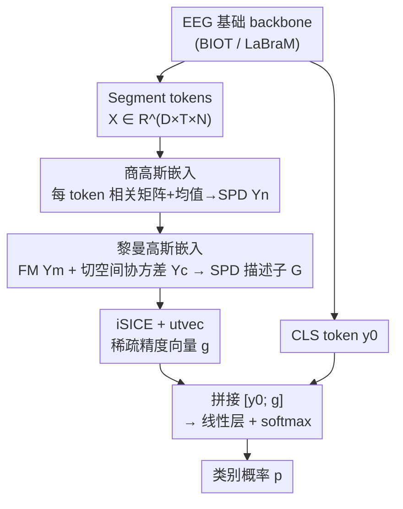

# Riemannian High-Order Pooling for Brain Foundation Models

**会议**: ICLR 2026  
**OpenReview**: [https://openreview.net/forum?id=66h1sCMm7F](https://openreview.net/forum?id=66h1sCMm7F)  
**代码**: https://github.com/ChenHu-ML/RHOP  
**领域**: 脑信号基础模型 / EEG 解码 / 黎曼几何 / 二阶池化  
**关键词**: EEG 基础模型, SPD 流形, 商高斯嵌入, 黎曼高斯, 全局协方差池化

## 一句话总结
针对 EEG 基础模型普遍只用单个 CLS token、丢掉时空二阶统计的问题，本文提出即插即用的黎曼高阶池化头 RHOP：把每个 token 编码成尺度不变的商高斯并嵌入 SPD 流形，再用黎曼高斯（Fréchet 均值 + 切空间协方差）跨 token 聚合，最后稀疏逆协方差化后与 CLS token 拼接分类，在 4 个 EEG 基准、3 种训练范式下都以千级参数量稳定提点。

## 研究背景与动机
**领域现状**：受 LLM 启发，EEG 解码也开始走"大规模无标注预训练 + 下游微调"的基础模型路线，BIOT、LaBraM 等 backbone 在癫痫检测、睡眠分期、运动想象、情绪识别等任务上取得突破。与此并行，黎曼几何路线长期是 EEG 解码的强基线——多通道 EEG 段的功率与空间分布天然可编码成对称正定（SPD）协方差矩阵，在 SPD 流形上操作对噪声和离群点更鲁棒。

**现有痛点**：基础模型的研究几乎全在卷 backbone，分类头却被忽视。绝大多数模型要么用全局平均池化（GAP），要么把 token 直接拼接，要么只取一个 CLS token 送进分类器——这些做法只保留一阶信息，把对 EEG 解码至关重要的二阶统计和全局时空依赖白白丢掉了。全局协方差池化（GCP）用一个协方差描述子替代 GAP，部分补上了二阶信息，但典型 GCP 把所有 token 压成**单一**协方差矩阵，又把 EEG 特征固有的时空层次结构抹平了。

**核心矛盾**：EEG 特征有两个被忽视的经验性质——一是跨时间段、跨通道维度存在显著的时空依赖结构；二是不同时间段之间存在普遍的幅度（scale）漂移，两个时间动态相似的 token，只要幅度不同，原始协方差就会差很多。前者要求"几何感知"，后者要求"尺度不变"，而现有池化头两头都没顾上。

**本文目标**：设计一个既**统计感知**（保留二阶信息）、又**几何感知**（尊重 SPD 流形结构）、还**尊重时空结构**（不把 token 拍平）的全局池化头。

**切入角度**：把单个 token 的时间统计建模成一个高斯（均值 + 协方差），但先把协方差归一化成相关矩阵以消除幅度漂移；再把"一组 token 的分布"建模成 SPD 流形上的黎曼高斯，用 Fréchet 均值和切空间协方差来表达高阶交互。

**核心 idea**：用"商高斯嵌入 + 黎曼高斯聚合 + 稀疏逆协方差"三段式几何池化头，把 token 级时空结构和高阶依赖打包进 SPD 描述子，再融进 CLS 分支——是首个为 EEG 基础模型量身定做的几何池化头。

## 方法详解

### 整体框架
RHOP 是一个挂在任意 EEG 基础 backbone（BIOT / LaBraM）后面的池化头。backbone 先抽出时空特征 $X \in \mathbb{R}^{D\times T\times N}$（$D$ 通道、$T$ 时间段、$N$ token 长度），同时输出一个全局语义 CLS token $y_0$。RHOP 把这堆 token 特征转成一个判别性更强的统计描述子，再和 $y_0$ 拼起来分类。整条流水线分三步：先对**每个 token** 算时间维一阶/二阶统计、归一化成相关矩阵、嵌进 SPD 流形得到商高斯 $Y_n$；再把 $\{Y_n\}$ 这一组 SPD 点用黎曼高斯（Fréchet 均值 $Y^m$ + 黎曼协方差 $Y^c$）聚合并嵌成单个 SPD 描述子 $G$；最后对 $G$ 做稀疏逆协方差估计（iSICE）取上三角向量化，与 CLS token 融合送分类器。

### 关键设计

**1. 商高斯嵌入：把每个 token 的协方差归一成尺度不变的相关矩阵再嵌进 SPD**

直接拿原始协方差当 EEG 描述子有个老毛病——它对幅度漂移极敏感，幅度不同会让两个动态相似的 token 看起来天差地别。RHOP 用"商高斯"消掉这个尺度自由度。给定一个高斯 $(\Sigma,\mu)\in N(n)$，商高斯定义为对正对角缩放求商：$QN(n)\cong N(n)/\mathrm{Diag}^+(n)$，每个等价类里的典范代表正是相关矩阵 $C=\mathrm{diag}(\Sigma)^{-1/2}\,\Sigma\,\mathrm{diag}(\Sigma)^{-1/2}$，它对缩放天然不变。具体到 token：把特征转置成 $\tilde X\in\mathbb{R}^{N\times T\times D}$，对第 $n$ 个 token 沿 $D$ 个通道算时间维统计 $\mu_n\in\mathbb{R}^T$ 和 $\Sigma_n\in\mathbb{R}^{T\times T}$，加一个小的 $\sigma I$（$\sigma=0.001$）保证 SPD，再归一化得 $C_n$。然后用定理 4.2 把商高斯 $(C_n,\mu_n)$ 同时编码进一个行列式为 1 的 SPD 矩阵：

$$Y_n = (\det C_n)^{-\frac{1}{T+k}}\begin{bmatrix} C_n + k\,\mu_n\mu_n^\top & \mu_n^{(k)} \\ \mu_n^{(k)\top} & I_k \end{bmatrix}\in S^{+,1}_{T+k}$$

其中 $\mu_n^{(k)}$ 是把 $\mu_n$ 复制 $k$ 列。这一步的妙处在于：均值（一阶）和归一化协方差（二阶）被塞进同一个统一的 SPD 形式里，既保住依赖结构又抹平了时间段间的幅度差异，而且整个嵌入可端到端优化（配仿射不变度量 AIM）。

**2. 黎曼高斯嵌入：把一组 token 的分布建成 SPD 流形上的高斯来捕获高阶交互**

有了每个 token 的 SPD 点 $\{Y_n\}_{n=1}^N$，怎么聚合成一个全局描述子？经典 GCP 直接压成单个协方差，会把 token 间的层次结构抹掉。RHOP 借鉴欧氏协方差池化，把"在 SPD 流形上算一阶+二阶统计"做出来——也就是估一个黎曼高斯。一阶量是 Fréchet 均值 $Y^m=\mathrm{FM}(\{Y_n\})$，它最小化到所有点的 AIM 平方距离之和；在 $(S^+_n,d_{AIM})$ 上 FM 全局唯一，用 Karcher flow 迭代求解（出于算力考虑，跟随既有工作只迭代一次）。二阶量是把每个点 $\mathrm{Log}_{Y^m}(Y_n)$ 映到 $Y^m$ 的切空间、向量化（下三角，非对角项乘 $\sqrt2$）后算出的黎曼协方差 $Y^c$。这对 $(Y^m,Y^c)$ 落在一个构成李群的乘积 SPD 流形上，再用一个保持代数与几何结构的块矩阵嵌入压成单个 SPD 描述子 $G$：对 $Y^c=LL^\top$ 做 Cholesky 分解，按

$$(Y^m, Y^c)\mapsto \begin{bmatrix} L & 0 \\ \phi_{k'}(Y^m) & I_{k'} \end{bmatrix}\in S^{+,1}_{n'+k}$$

其中 $\phi=f_v\circ\log$ 取矩阵对数后向量化。这一步让"token 集合的高阶交互"以几何忠实的方式被一个 SPD 矩阵承载，而不是被拍平成单协方差。

**3. 稀疏逆协方差 + CLS 融合：用偏相关凸显直接依赖，再补全局语义**

最后一步要把 SPD 描述子 $G$ 变成判别性的向量并接回主干。RHOP 对 $G$ 做稀疏逆协方差估计 iSICE（带 $\lambda_{SICE}$ 正则），逆协方差强调的是**偏相关**，能凸显变量间的直接关系、抑制由中介变量带来的虚假相关，比直接用协方差更紧凑也更具区分度；取上三角向量化得稀疏精度向量 $g=\mathrm{utvec}(\mathrm{iSICE}(G))$。同时 backbone 的 CLS token $y_0$ 携带全局语义。两者拼接 $[y_0; g]$ 过线性层 + softmax 出类别概率。这种融合让 CLS token 被商高斯/黎曼高阶统计"加料"，既不丢全局语义又补上了被传统头忽略的时空二阶结构——而代价只有千级额外参数。

### 损失函数 / 训练策略
RHOP 是 backbone 无关的即插即用头，训练用标准分类损失（softmax + 交叉熵），可在三种范式下使用：从零训练、全量微调、线性探针（冻结 backbone 只调头）。关键超参是嵌入维度 $(k,k')$ 和 SICE 正则 $\lambda_{SICE}$；FM 迭代次数设为 1 以控算力。

## 实验关键数据

### 主实验
四个 EEG 基准：TUAB（异常检测，二分类）、TUEV（事件分类，六类）、BCIC2B（运动想象）、PhysioP300（P300 拼写）；backbone 用 BIOT 与 LaBraM-Base；对比 iSQRT-COV、iSICE、SVD-Padé 三种 GCP 头。

| 设置 / 数据集 | backbone | 指标 | baseline | +RHOP | 额外参数 |
|--------|------|------|------|------|------|
| 从零训练 / TUEV | BIOT | Balanced Acc | 46.82% | **53.55%** | +1.3K（vs GCP +33.1K） |
| 从零训练 / TUEV | BIOT | Cohen's Kappa | 44.82% | **51.77%** | — |
| 从零训练 / TUEV | BIOT | Weighted F1 | 70.85% | **74.66%** | — |
| 全量微调 / TUAB | LaBraM-Base | Balanced Acc | 81.40% | **82.44%** | +4.6K |
| 全量微调 / TUAB | LaBraM-Base | AUROC | 90.22% | **91.05%** | — |
| 线性探针 / BCIC2B | LaBraM-Base | AUROC | 74.72% | **75.87%** | +0.5K |
| 线性探针 / PhysioP300 | LaBraM-Base | AUROC | 68.93% | **70.44%** | +0.4K |

效率上 RHOP 反而比 GCP 头快很多：TUEV 从零训练每 epoch 仅 0.53 分钟（iSICE 4.71、SVD-Padé 10.61）；TUAB 全量微调 21.48 分钟（iSICE 67.77、SVD-Padé 31.23）——精度更高、参数和耗时却低一个量级。

### 消融实验
组件消融（LaBraM-Base，逐步叠加）：

| 配置 | TUAB Balanced Acc | TUAB AUROC | TUEV Cohen's Kappa | TUEV Weighted F1 |
|------|------|------|------|------|
| baseline（无 RHOP） | 0.8140 | 0.9022 | 0.6637 | 0.8312 |
| +QGE | 0.8175 | 0.9048 | 0.6669 | 0.8331 |
| +QGE +RGE | 0.8209 | 0.9069 | 0.6712 | 0.8365 |
| +QGE +RGE +SICE | 0.8227 | 0.9088 | 0.6749 | 0.8391 |
| +QGE +RGE +SICE +CLS（Full） | **0.8244** | **0.9105** | **0.6785** | **0.8420** |

QGE、RGE、SICE、CLS 融合四个组件逐个叠加都带来单调提升，说明四步缺一不可、各有贡献。另外 $(k,k')$ 维度消融（表 6）显示性能对该超参敏感，论文最终在 $(3,3)$ 取得 TUAB/TUEV 的最佳综合表现。

### 关键发现
- **从零训练增益最大**：在 TUEV 从零训练下 BIOT+RHOP 把 Balanced Acc 拉高近 7 个点，远超有预训练时的提升幅度——说明当 backbone 没有预训练先验时，RHOP 保留的时空结构和高阶统计尤其救命。
- **比 GCP 强在哪**：经典 GCP（iSQRT-COV / iSICE / SVD-Padé）把所有 token 塌成单个协方差，丢掉时间-通道层次；RHOP 先归一成相关矩阵保尺度不变，再用黎曼高斯（FM + 切空间协方差）在流形上聚合，并用稀疏逆协方差强调直接依赖，得到更忠实的全局表示。
- **几乎零成本**：BCIC2B / PhysioP300 上 RHOP 只加不到 1K 参数、每 epoch 多 0.01 分钟，却仍提升所有指标，是真正"即插即用"的廉价头。

## 亮点与洞察
- **"商"掉尺度自由度这一招很干净**：用商高斯把协方差归一成相关矩阵，等价于在分布层面消掉幅度漂移，比起手工做幅度归一化更有几何依据，且能端到端优化。这个思路可迁移到任何"幅度漂移大但相关结构才是信号"的多通道时序任务。
- **把"一组 SPD 点的分布"也建成 SPD**：黎曼高斯嵌入把 Fréchet 均值和切空间协方差打包进单个 SPD 描述子，相当于在流形上做了一次二阶池化——这是对欧氏 GCP 的几何化推广，避免了塌成单协方差的信息损失。
- **重头不在 backbone 而在分类头**：在所有人卷 backbone 时，本文证明只换一个几何感知的池化头就能稳定提点且省算力，提醒"分类头"这个长期被忽视的环节其实有很大空间。

## 局限与展望
- **FM 只迭代一次是近似**：为省算力把 Karcher flow 截到一步，Fréchet 均值并未收敛到精确解，强依赖几何精度的任务上可能损失表达力。
- **超参敏感**：$(k,k')$ 维度对结果影响不小（表 6 波动可达数个点），实际部署需要按数据集调参，削弱了"即插即用"的省心程度。
- **仅在 EEG 上验证**：方法本身只假设"多通道时序 + SPD 协方差"，理论上可推广到 fMRI、ECoG、其他生物时序信号，但论文未做跨模态验证。
- **LaBraM 只用 Base 变体**：因公开权重只有 LaBraM-Base，更大 backbone 上的增益是否保持仍是开放问题。

## 相关工作与启发
- **vs 全局协方差池化（iSICE / iSQRT-COV / SVD-Padé）**：它们都把所有 token 压成单个协方差矩阵，丢掉时空层次且数值稳定化开销大；RHOP 保留 token 级结构、在 SPD 流形上聚合，精度更高且参数/耗时低一个量级。
- **vs SPD 流形 EEG 方法（流形注意力 / SPDDSMBN / DGCCA / SPDIM）**：这些工作直接在 SPD 协方差上做判别学习，但多是独立模型；RHOP 把 SPD 几何与大规模预训练 backbone 配对，作为可插拔的池化头复用基础模型的语义先验。
- **vs 高斯嵌入 / 信息几何**：本文沿用"把高斯等同于 SPD 矩阵、用仿射不变工具学习"的路线（Pennec、Nguyen 等），创新点是把它做成商高斯（去尺度）+ 黎曼高斯（集合级二阶）的双层结构并嵌进基础模型的分类头。

## 评分
- 新颖性: ⭐⭐⭐⭐ 首个为 EEG 基础模型设计的几何池化头，商高斯+黎曼高斯双层 SPD 嵌入组合扎实。
- 实验充分度: ⭐⭐⭐⭐ 4 基准 × 2 backbone × 3 范式 + 组件/超参消融，覆盖面足；但仅 EEG、LaBraM 限于 Base。
- 写作质量: ⭐⭐⭐⭐ 几何推导清晰、动机有经验支撑、图表完整。
- 价值: ⭐⭐⭐⭐ 千级参数即插即用、还更省算力，对 EEG 基础模型落地很实用。

<!-- RELATED:START -->

## 相关论文

- [\[ICLR 2026\] The Human Brain as a Dynamic Mixture of Expert Models in Video Understanding](the_human_brain_as_a_dynamic_mixture_of_expert_models_in_video_understanding.md)
- [\[ICLR 2026\] TRIBE: Trimodal Brain Encoder for Whole-Brain fMRI Response Prediction](tribe_trimodal_brain_encoder_for_whole-brain_fmri_response_prediction.md)
- [\[ICLR 2026\] Riemannian Variational Flow Matching for Material and Protein Design](riemannian_variational_flow_matching_for_material_and_protein_design.md)
- [\[CVPR 2026\] Predicting Spatial Transcriptomics from Histology Images via High-Order Multi-Cell Interaction Modeling](../../CVPR2026/computational_biology/predicting_spatial_transcriptomics_from_histology_images_via_high-order_multi-ce.md)
- [\[ICLR 2026\] Towards All-atom Foundation Models for Biomolecular Binding Affinity Prediction](towards_all-atom_foundation_models_for_biomolecular_binding_affinity_prediction.md)

<!-- RELATED:END -->
