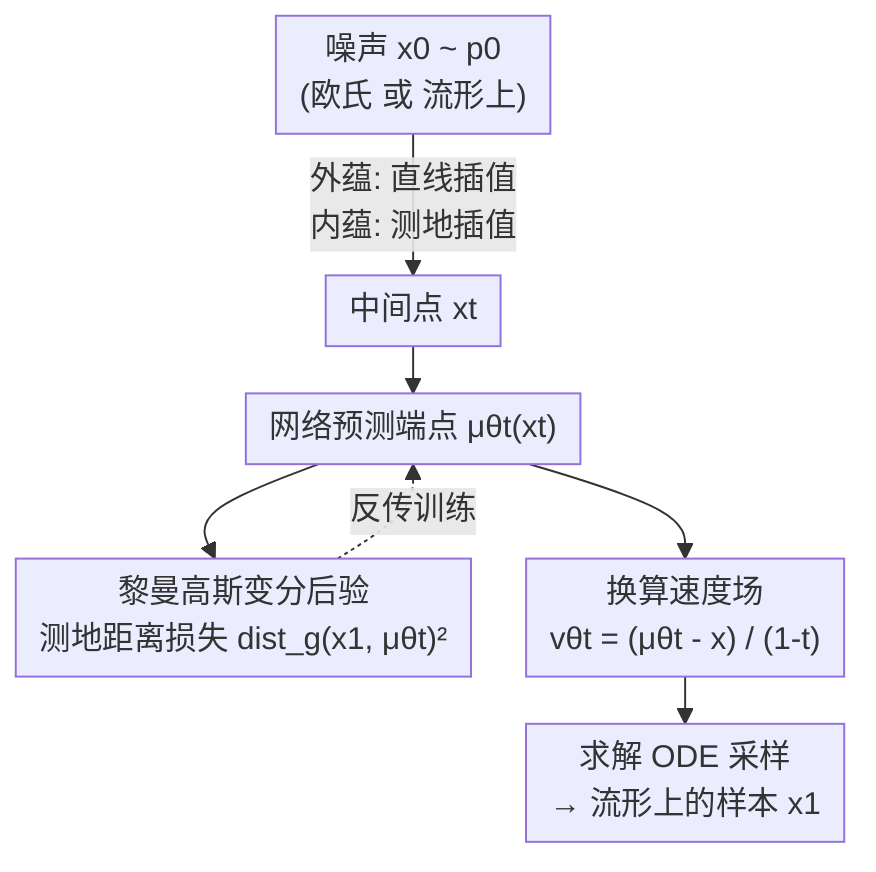

# Riemannian Variational Flow Matching for Material and Protein Design

**会议**: ICLR 2026  
**OpenReview**: [https://openreview.net/forum?id=NlnDselrtl](https://openreview.net/forum?id=NlnDselrtl)  
**代码**: 无  
**领域**: 生成模型 / AI4Science / 流形上的流匹配  
**关键词**: 变分流匹配, 黎曼流形, 端点预测, Jacobi 场, 材料与蛋白质生成  

## 一句话总结
本文提出 Riemannian Gaussian Variational Flow Matching（RG-VFM），用黎曼高斯分布把"预测端点"的变分流匹配（VFM）搬到曲面流形上，并用 Jacobi 场证明：相比预测速度的黎曼流匹配（RFM），RG-VFM 的损失天然多了一项曲率相关惩罚，从而提供更强的监督信号；在合成球面/双曲数据以及 MOF 材料、蛋白质骨架生成任务上都稳定优于欧氏和速度型基线。

## 研究背景与动机

**领域现状**：流匹配（Flow Matching, FM）已经成为扩散模型之外的主流生成范式——它在源分布和目标分布之间定义逐样本插值，然后直接回归插值对应的速度场，免去了求解 ODE 的训练开销。近年它沿两个方向被扩展：变分流匹配（VFM）把训练重新表述为"对轨迹做后验推断"，让模型去**预测端点** $x_1$ 而非速度，从而获得概率视角与灵活的建模选择；黎曼流匹配（RFM）则把 FM 推广到带曲率的流形上，让分布尊重数据真实支撑（如旋转群 $SO(3)$、球面、双曲空间）的几何结构。

**现有痛点**：材料与生物大分子的数据天然活在**异构流形**上——原子坐标在欧氏空间，朝向在旋转群 $SO(3)$ 上。当前 MOF、蛋白质骨架的主流生成器（MOFFlow、ReQFlow 等）采用"混合"策略：欧氏参数用标准 FM（其实等价于预测端点的 VFM），非欧参数用 RFM。这种拼接**没有对两类参数做统一的变分处理**：欧氏侧最小化端点的 MSE，旋转侧却退回去最小化速度（log 映射得到的初速）的平方误差，损失形式不一致。

**核心矛盾**：在欧氏空间里，预测端点（VFM）、预测速度（FM）、预测噪声（diffusion）由于插值是仿射的，三者**几乎等价**，可互相换算。但一旦上了曲面流形，切空间随点变化、曲率引入高阶偏差，这个等价关系**彻底失效**——端点视角和速度视角不再能闭式互换。于是问题变成：在曲面上这两种监督到底差在哪？哪一种更好？

**本文目标**：(1) 给一般几何定义一个变分流匹配目标，把"端点预测"训练搬上流形；(2) 形式化分析它与 RFM 的关系，弄清差异的几何来源；(3) 在真实的材料与蛋白质生成上验证"变分化"现有几何模型能否带来稳定增益。

**切入角度**：作者观察到后验 $p_t(x_1\mid x)$ **隐式编码了分布支撑的几何**——例如 CatFlow 用类别分布让速度指向概率单纯形。那么能不能用一个定义在流形上的分布来编码曲率信息？黎曼高斯分布正是欧氏高斯到流形的自然推广。

**核心 idea**：用"在流形上最小化预测端点与真实端点之间的**测地距离**"代替"在切空间里匹配速度"，由此既保留 VFM 的端点监督优势、又把流形几何注入损失。

## 方法详解

### 整体框架

RG-VFM 的核心是一次**损失视角的替换**：不再像 RFM 那样在切空间里比对速度，而是把变分后验取为定义在流形 $M$ 上的黎曼高斯分布，让模型直接预测端点 $\mu^\theta_t(x)$，并最小化它与真实端点 $x_1$ 的测地距离平方。整个生成器的"管线"很简洁：从噪声 $x_0\sim p_0$ 出发，在源点和目标点之间做插值得到中间点 $x_t$，网络从 $x_t$ 预测干净端点 $\mu^\theta_t$，用测地距离算损失；采样时把预测的端点换算成速度场，求解 ODE 把噪声推到数据分布。

根据先验 $p_0$ 放在哪里，框架有两个变体：**外蕴（extrinsic）RG-VFM-$\mathbb{R}^n$**——先验在环境欧氏空间，插值走直线，只在损失里用测地距离，省去流形的 exp/log 映射；**内蕴（intrinsic）RG-VFM-$M$**——先验和插值都在流形上（测地插值），形式上贴近 RFM 但损失定义不同。理论分析（与 RFM 的公平对比）只在内蕴变体上做。

### 关键设计

**1. 黎曼高斯变分后验：把"端点预测"搬上流形**

痛点是：VFM 的端点监督只在欧氏空间成立，一上曲面就不知道"端点离得近不近"该怎么度量。本文用黎曼高斯（Riemannian Gaussian）分布作为变分后验——它是流形上由均值和协方差决定的最大熵分布：

$$\mathcal{N}_{Riem}(z\mid\sigma,\mu)=\frac{1}{C}\exp\!\left(-\frac{\mathrm{dist}_g(z,\mu)^2}{2\sigma^2}\right)$$

其中 $z,\mu\in M$，$\mathrm{dist}_g$ 是度量 $g$ 决定的测地距离。把它代入 VFM 的负对数似然目标，得到 RG-VFM 损失 $L_{\text{RG-VFM}}=\mathbb{E}_{t,x_1,x}[-\log\mathcal{N}_{Riem}(x_1\mid\mu^\theta_t(x),\sigma_t(x))]$。关键结论（命题 3.1）是：只要流形是**齐性的**（任一点能被保距对称变换映到任意点，$S^n,H^n,T^n,SO(n)$ 都满足）且测地线有闭式表达，这个目标就坍缩成一个干净的测地 MSE：

$$L_{\text{RG-VFM}}(\theta)=\mathbb{E}_{t,x_1,x}\big[\|\log_{x_1}(\mu^\theta_t(x))\|_g^2\big]=\mathbb{E}_{t,x_1,x}\big[\mathrm{dist}_g(x_1,\mu^\theta_t(x))^2\big]$$

最小化它等价于求目标分布的 **Fréchet 均值**（最小化到目标的期望测地距离平方），正是欧氏 MSE 在黎曼框架下的推广。$\sigma_t(x)$ 取常数即可，材料/蛋白实验里设成 $\sigma_t(x)=1-t$ 做时间归一化。之所以有效：损失只需要刻画 $p_1$ 附近的**局部几何**，不必显式建模整条速度场，因此先验支撑可以灵活选择。

**2. 内蕴 / 外蕴两种变体：用直线流换几何感知，几乎零额外开销**

把流形 $M$ 嵌入 $\mathbb{R}^n$ 后，先验放哪里决定了两种实现。**外蕴 RG-VFM-$\mathbb{R}^n$**：先验是 $\mathbb{R}^n$ 标准高斯，条件速度用环境空间的**线性插值** $x_t=t\cdot x_1+(1-t)\cdot x_0$，训练时只在损失端用测地距离，**无需流形的 exp/log 映射**——这让它在训练和采样的复杂度上与普通 VFM 完全相同，唯一区别是把欧氏距离换成（假设闭式可得的）测地距离，因此不引入额外开销，却比纯欧氏方法多编码了几何信息。**内蕴 RG-VFM-$M$**：先验和插值都在流形上（$x_t=\exp_{x_0}(t\cdot\log_{x_0}(x_1))$），不需要把 $M$ 嵌入到足够大的环境空间，但每步要算 exp/log。两者是一个权衡：外蕴实现简单、成本低，但要求环境维度足够大以无退化地嵌入流形；内蕴更通用。由于 RFM 本身只支持内蕴视角，**公平对比只能在 RG-VFM-$M$ 与 RFM 之间做**。

**3. Jacobi 场分析：揭示 RFM 缺了一项曲率惩罚**

这是全文的理论核心，回答"端点监督 vs 速度监督到底差在哪"。作者构造一族从同一起点 $x_0$ 出发、初速被扰动 $\dot\gamma_s(0)=v_0+sw$ 的测地线，用 **Jacobi 场** $J(\tau)=\partial_s\alpha(s,\tau)|_{s=0}$ 刻画"扰动初速如何让测地线终点分开"。在这个框架下两种损失被统一表达：RFM 损失对应 Jacobi 场在起点的导数 $L_{\text{RFM}}=\mathbb{E}[\|D_\tau J(0)\|_g^2]$（速度差），RG-VFM 损失对应 Jacobi 场在终点的取值 $L_{\text{RG-VFM}}=\mathbb{E}[\|J(1)\|_g^2]$（端点测地差）。把 $J(\tau)$ 在 $\tau=0$ 做泰勒展开、在 $\tau=1$ 求值，可证 $D_\tau J(0)$ 只是 $J(1)$ 的**一阶线性近似**（命题 4.2）——截断到一阶就把曲率信息丢了。因此两者的差正是一项曲率泛函（命题 4.3）：

$$L_{\text{RG-VFM}}(\theta)=L_{\text{RFM}}(\theta)+\mathbb{E}_{t,x_1,x}\big[\mathcal{C}(R,D_\tau J(0),v)+E_{\text{higher}}\big]$$

其中领头阶 $\mathcal{C}(R,D_\tau J(0),v)=-\tfrac13\langle R(D_\tau J(0),v)v,D_\tau J(0)\rangle_g-\tfrac16\langle(\nabla_v R)(D_\tau J(0),v)v,D_\tau J(0)\rangle_g$，$R$ 是黎曼曲率张量。欧氏空间 $R=0$，该项消失，于是 RG-VFM、VFM、CFM、RFM 四者在归一化后等价；曲面上该项非零且依赖曲率，意味着 RG-VFM 通过精确的 $J(1)$ 捕捉了完整几何结构，而 RFM 只用了线性近似 $D_\tau J(0)$，监督更弱、更不精确——这就是 RG-VFM 在实践中学得更好的理论根源。

**4. 变分化已有几何生成模型：一处小改即插即用**

理论落到工程上只需"对现有模型旋转分量的损失做变分化"。作者选了两个来自不同应用的代表模型：MOF 生成的 **MOFFlow** 和蛋白质骨架生成的 **QFlow / ReQFlow**。它们都用"预测端点再重构速度场"的重参数化目标，欧氏参数（位置、晶格）已经等价于 VFM，但**旋转分量**仍用 RFM 式速度损失。本文把旋转分量的损失从"匹配速度"改成"在 $SO(3)$ 上最小化预测旋转与真实旋转的测地距离平方"，其余实现保持完全一致，得到 V-MOFFlow、V-QFlow、V-ReQFlow。这种最小侵入式改动让"变分目标带来的增益"被干净地隔离出来，也印证了前人"端点学习经验上更好"的观察其实有 Jacobi 场层面的理论解释。

## 实验关键数据

### 合成数据：曲率效应

作者在球面 $S^2$ 和上叶双曲面 $H^2_{-1}$ 上构造"曲面棋盘格"分布，比较欧氏/黎曼、速度型/变分型模型。评价用 Coverage（落在棋盘格区域的比例，越高越好）、C2ST（分类器二样本检验，0.5 表示真假样本不可分，越低越好）、Distance（生成点到流形的距离，仅外蕴模型，越低越好）。

| 模型（球面 $S^2$） | Coverage ↑ | C2ST ↓ | Distance ↓ |
|--------|------|------|------|
| 欧氏/外蕴/速度（CFM） | 64.97 | 58.36 | 0.012 |
| 欧氏/外蕴/变分（VFM） | 79.08 | 56.33 | 0.044 |
| 黎曼/外蕴/变分（RG-VFM-$\mathbb{R}^3$，本文） | 83.10 | 56.58 | **0.010** |
| 黎曼/内蕴/速度（RFM） | 66.83 | 57.99 | – |
| 黎曼/内蕴/变分（RG-VFM-$M$，本文） | **84.21** | 59.72 | – |

结论：(1) 黎曼模型生成点离流形更近（几何更准）；(2) 变分模型分布更锐利、不模糊，RG-VFM 的 Coverage 最高。C2ST 上球面/双曲没有一致规律，标准 VFM 反而最强。$\sigma_t=1$ 与 $\sigma_t=1-t$ 差异可忽略；初步发现 L1 损失（等价于用黎曼拉普拉斯而非黎曼高斯）在双曲空间可能更好。

### MOF 材料生成（V-MOFFlow）

在 Boyd 等的大规模 MOF 数据集上做结构预测，指标为匹配率 MR 和 RMSE。

| 模型 | MR(%) ↑ (stol=0.5, 1样本) | RMSE ↓ | MR(%) ↑ (stol=0.5, 5样本) |
|------|------|------|------|
| DiffCSP | 0.09 | 0.3961 | 0.34 |
| MOFFlow（复现） | 30.40 | 0.2832 | 46.97 |
| **V-MOFFlow（本文）** | **33.52** | **0.2789** | **50.14** |

除了 stol=1.0（作者认为太宽松、无实用意义）这一项，V-MOFFlow 在所有指标上超过 MOFFlow 与 DiffCSP，直接验证 RG-VFM 损失比 RFM 式损失引导训练更有效。

### 蛋白质骨架生成（V-QFlow / V-ReQFlow）

在过滤后的 PDB 数据集（23366 个结构，长度 60–512）上，用 designability（可设计性，scRMSD/Fraction）、diversity、novelty 评价。

| 模型 | Fraction ↑ | scRMSD ↓ | Diversity(TM) ↓ |
|------|------|------|------|
| QFlow（复现） | 0.924 | 1.252 | 0.357 |
| **V-QFlow（本文）** | **0.968** | **0.923** | 0.387 |
| ReQFlow（复现） | 0.964 | 0.939 | 0.400 |
| **V-ReQFlow（本文）** | **0.980** | 0.961 | 0.408 |

V-QFlow、V-ReQFlow 在 designability 和折叠 RMSD 上都超过各自的原版，说明在流形上学概率路径时采用变分目标确实有效。

### 关键发现
- **曲率惩罚项是增益来源**：理论上 RG-VFM = RFM + 曲率项，实验里黎曼变分模型（RG-VFM-$M$）在合成 Coverage 上最高（84.21），印证"多出来的曲率监督"转化为更锐利的分布。
- **变分化只改旋转分量就够**：对 MOFFlow/QFlow/ReQFlow 仅替换 $SO(3)$ 旋转损失、其余不动，就能稳定涨点，说明增益确实来自损失形式而非别的工程因素。
- **外蕴变体几乎零成本**：RG-VFM-$\mathbb{R}^3$ 训练/采样复杂度与 VFM 相同，却拿到了几何感知（Distance 最低 0.010），是性价比最高的落地选择。
- C2ST 上 VFM 偶尔最强，说明"几何感知"并非在所有度量上单调最优，存在指标间的取舍。

## 亮点与洞察
- **用 Jacobi 场把两种损失统一成"同一条 Jacobi 场的不同评估点"**：RFM 看起点导数 $D_\tau J(0)$、RG-VFM 看终点 $J(1)$，一阶泰勒把它们连起来——这个视角极其干净地解释了"为什么欧氏下两者等价、曲面下分道扬镳"，是可迁移到其他"速度 vs 端点"对比的分析利器。
- **把"端点预测经验上更好"从玄学变成定理**：前人只观察到端点学习效果好，本文给出曲率项这一显式来源，属于"事后理论化"的优雅范例。
- **零额外开销的几何注入**：只要测地距离闭式可得，把欧氏距离换成测地距离就完成了几何感知，复杂度不变——这个 trick 可直接搬到任何用 MSE 端点损失的流形生成器。

## 局限与展望
- 方法目前只对**有闭式测地线的简单几何**（$S^n,H^n,T^n,SO(n)$）成立，依赖齐性流形假设；复杂、无闭式 exp/log 的流形需要近似处理。
- 公平的理论对比仅在内蕴 RG-VFM-$M$ 与 RFM 之间成立，外蕴变体与 RFM 不可直接比，限制了结论的普适性。
- C2ST 上没有一致优势，且 L1（黎曼拉普拉斯）在双曲空间可能更好但只是初步探索，说明"黎曼高斯"未必是各场景最优的后验选择。
- 实验只变分化了旋转分量，端点 $SO(3)$ 损失对真实大分子的长程几何约束是否充分，仍待更大规模验证。

## 相关工作与启发
- **vs RFM（Chen & Lipman 2024）**：RFM 在切空间匹配速度，是 RG-VFM 端点损失的一阶近似；本文证明二者差一项曲率惩罚，RG-VFM 监督更强。两者在欧氏下等价。
- **vs VFM / CatFlow（Eijkelboom 2024）**：VFM 在欧氏空间预测端点；本文把它推广到流形，用黎曼高斯后验把"几何"编码进变分目标，欧氏退化即回到 VFM。
- **vs MOFFlow / QFlow / ReQFlow**：这些方法对旋转分量用 RFM 式速度损失，是"部分变分化"；本文把旋转损失也改成测地距离端点损失，实现完全变分化并稳定涨点。

## 评分
- 新颖性: ⭐⭐⭐⭐⭐ 用 Jacobi 场统一端点/速度两种损失并定位曲率惩罚项，理论视角新颖且解释力强。
- 实验充分度: ⭐⭐⭐⭐ 合成 + MOF + 蛋白质三类任务齐全，但部分指标（C2ST）无一致优势、缺少更大规模消融。
- 写作质量: ⭐⭐⭐⭐⭐ 从动机到 Jacobi 场推导层层递进，图 1/图 2 的四象限关系清晰。
- 价值: ⭐⭐⭐⭐ 给"端点学习更好"提供理论依据，且改动极小可即插即用，对流形生成器有实用价值。

<!-- RELATED:START -->

## 相关论文

- [\[ICLR 2026\] Interpolation-Based Conditioning of Flow Matching Models for Bioisosteric Ligand Design](interpolation-based_conditioning_of_flow_matching_models_for_bioisosteric_ligand.md)
- [\[ICLR 2026\] La-Proteina: Atomistic Protein Generation via Partially Latent Flow Matching](la-proteina_atomistic_protein_generation_via_partially_latent_flow_matching.md)
- [\[ICML 2025\] Flexibility-conditioned Protein Structure Design with Flow Matching](../../ICML2025/computational_biology/flexibility-conditioned_protein_structure_design_with_flow_matching.md)
- [\[ICLR 2026\] Multi-Marginal Flow Matching with Adversarially Learnt Interpolants](multi-marginal_flow_matching_with_adversarially_learnt_interpolants.md)
- [\[ICLR 2026\] scDFM: Distributional Flow Matching for Robust Single-Cell Perturbation Prediction](scdfm_distributional_flow_matching_model_for_robust_single-cell_perturbation_pre.md)

<!-- RELATED:END -->
