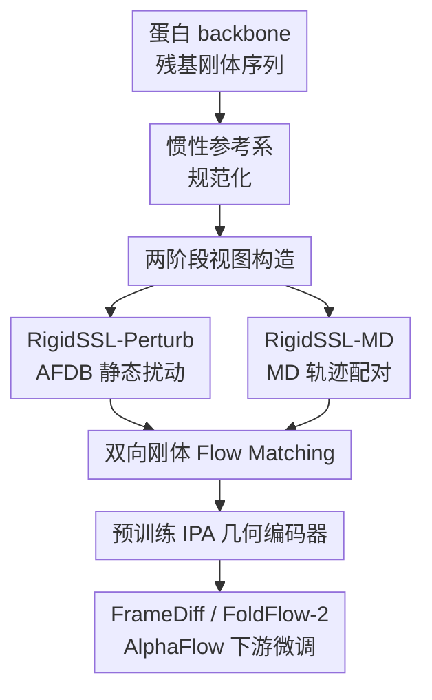

# Rigidity-Aware Geometric Pretraining for Protein Design and Conformational Ensembles

**会议**: ICLR2026  
**OpenReview**: [https://openreview.net/forum?id=YAWpZcXHnP](https://openreview.net/forum?id=YAWpZcXHnP)  
**代码**: 论文称代码已在公开仓库提供，缓存中未给出具体链接  
**领域**: 计算生物 / 蛋白质结构生成  
**关键词**: 蛋白质设计, 几何预训练, SE(3)刚体表示, Flow Matching, 构象 ensemble  

## 一句话总结
RigidSSL 把蛋白质骨架表示为残基级刚体序列，先在 AFDB 静态结构上学习 SE(3) 扰动下稳定的几何先验，再用 MD 轨迹学习真实构象转移，从而提升蛋白质骨架生成、motif scaffolding 和 GPCR 构象 ensemble 生成的设计性、多样性与生物物理合理性。

## 研究背景与动机

**领域现状**：蛋白质三维结构决定其功能，因而 de novo protein design 的核心目标是生成可折叠、结构合理、具有潜在功能的蛋白骨架。近几年，FrameDiff、FoldFlow-2、AlphaFlow 这类几何生成模型已经开始直接在蛋白质 backbone 的 SE(3) 空间中建模：每个残基不再只是一个点，而是带有平移和旋转的局部刚体 frame，模型通过扩散或 flow matching 学习从噪声到真实蛋白构象的生成过程。

**现有痛点**：作者指出当前方法有三个具体短板。第一，许多端到端生成模型要在同一个训练目标里同时学“蛋白几何常识”和“下游生成机制”，优化压力很大，遇到新长度、新构象或新任务时泛化有限。第二，已有蛋白几何预训练多偏向原子级或局部 fragment 表示，对性质预测足够，但不一定能学到全局 folding geometry；而蛋白生成恰恰需要理解长程折叠、二级结构组合和全链刚体运动。第三，AFDB/PDB 这类大规模结构库虽然大，但大多是静态快照，无法告诉模型蛋白在近天然状态附近如何振动、如何在多个 metastable conformation 之间过渡。

**核心矛盾**：蛋白生成既需要稳定的全局结构先验，又不能把蛋白看成一张静态照片。只学静态结构，模型容易生成“看起来折叠好”的骨架，但构象多样性和动力学 fidelity 不够；只学 MD 动态，模型又可能偏向 metastable 状态，在反折叠和结构预测管线里设计性下降。如何把静态几何规律和动态构象变化都注入同一个可迁移表示，是本文要解决的核心问题。

**本文目标**：RigidSSL 的目标不是重新发明一个下游生成器，而是给现有 IPA-based 蛋白生成模型提供一套可迁移的几何预训练权重。它要回答三个子问题：如何用高效而全局的表示承载蛋白 backbone 几何；如何从静态结构和 MD 轨迹构造有意义的 self-supervised views；如何让预训练目标同时尊重残基刚体的平移和旋转动力学。

**切入角度**：作者沿用 AlphaFold2 风格的 residue rigid frame，把每个残基视为由 $C_\alpha$ 平移向量和局部旋转矩阵定义的刚体。这个表示比 all-atom 建模更省自由度，又比单纯 $C_\alpha$ 点云保留更多局部取向信息。随后，作者把两个 view 之间的关系写成 SE(3) 上的双向 flow matching：模型不只是判断两个 view 是否相似，而是学习从一个构象流向另一个构象时，每个残基的平移速度和旋转速度。

**核心 idea**：用“刚体级多视图 flow matching 预训练”提前学习蛋白质的静态几何规律与动态构象转移，再把这些表示迁移到蛋白生成模型中，减少下游模型从零学习几何常识的负担。

## 方法详解

### 整体框架

RigidSSL 的整体流程可以理解为“先统一坐标，再构造双视图，最后学双向刚体流”。输入是一条蛋白 backbone，每个残基由平移 $\vec{t}_i \in \mathbb{R}^3$ 和旋转 $r_i \in SO(3)$ 表示；输出不是直接生成最终蛋白，而是一个经过预训练的 IPA 几何编码器，之后可以 warm-start FrameDiff、FoldFlow-2 或 AlphaFlow 等下游模型。

预训练分两期进行。Phase I 的 RigidSSL-Perturb 从 432K 条 AFDB 静态结构出发，对每个残基 frame 加平移噪声和旋转噪声，迫使模型学到对小扰动稳定的全局几何先验。Phase II 的 RigidSSL-MD 再用 1.3K 条 ATLAS 分子动力学轨迹，以相隔 $\delta=2$ ns 的两个 snapshot 作为双视图，让同一套目标看到更真实的构象波动。两期共享关键目标：在 canonical reference frame 下，对两个 view 做 translation LERP 和 rotation SLERP 插值，并用双向 flow matching 同时预测平移与旋转速度。

### 关键设计

**1. 残基刚体表示与惯性参考系规范化：把蛋白几何放到可比较的 SE(3) 坐标里**

蛋白质数据库中的结构坐标本身带有任意全局旋转和平移，如果直接在这些坐标上做插值或扰动，模型可能学到“摆放姿态”而不是蛋白本身的几何规律。RigidSSL 先把每条蛋白链表示为 $g=\{T_i\}_{i=1}^L=\{(\vec{t}_i,r_i)\}_{i=1}^L$，其中 $\vec{t}_i$ 是第 $i$ 个残基 $C_\alpha$ 的位置，$r_i$ 是由 backbone 原子 $N,C_\alpha,C$ 构成的局部 frame 方向。这样每个残基既有位置，也有朝向，能承载 backbone 扭转和局部几何信息。

规范化分两步完成：先把所有 $C_\alpha$ 坐标减去质心 $\bar{x}=\frac{1}{L}\sum_i x_i$，把蛋白移到惯性参考系原点；再由惯性张量 $\hat{I}=\sum_i (\|x_i\|^2 I_3 - x_i x_i^\top)$ 的特征向量确定主轴，并通过排序和右手系约束得到确定性的 $V\in SO(3)$。经过这一步，不同蛋白或同一蛋白的不同 view 都在统一 reference frame 中表达。它解决的不是“让模型不变性更强”这么泛的事，而是保证后续 LERP/SLERP 插值路径有明确物理含义：两个 view 的差异主要来自结构变化，而不是数据库坐标系的任意选择。

**2. 两阶段视图构造：先学静态折叠先验，再学真实构象波动**

RigidSSL-Perturb 面向静态结构库。对 AFDB 中的一条 canonicalized 结构 $g_0$，它对每个残基的平移和旋转分别加噪声，得到第二个 view $g_1$。平移部分用高斯噪声 $\vec{t}_i^1=\vec{t}_i^0+\sigma z, z\sim\mathcal{N}(0,I_3)$；旋转部分不是把矩阵元素随便扰动，而是在 $SO(3)$ 上从 IGSO(3) 分布采样旋转 $r$，再右乘到原始 frame：$r_i^1=r_i^0\cdot r$。论文最终使用的扰动尺度是 $\sigma=0.03$ 和 $\epsilon=0.5$，消融显示噪声过大时会带来更多 steric clashes 和更差的 bond validity。

RigidSSL-MD 则把 view 构造换成真实动力学轨迹。作者使用 ATLAS 中 1,390 条 MD trajectory，从同一条轨迹中取相隔 $\delta=2$ ns 的两个 snapshot，分别 canonicalize 后作为 $g_0$ 和 $g_1$。这个间隔的意义在于避开纯瞬时热噪声，又不把两个状态拉得过远：较小 $\delta$ 只反映局部振动，过大 $\delta$ 可能混入剧烈重排，而 $2$ ns 被作者作为近天然构象 fluctuation 的尺度。两阶段设计因此形成互补：AFDB 扰动提供大规模、广覆盖、偏稳定的 folding geometry；MD trajectory 提供小规模但物理更真实的 conformational transition。

**3. 双向刚体 Flow Matching：把互信息学习落实为平移和旋转速度预测**

作者希望最大化两个 view 之间的互信息 $MI(g_0,g_1)$，但没有直接用传统 contrastive loss，而是用条件似然的 surrogate：$\log p(g_0|g_1)+\log p(g_1|g_0)$。直观上，若模型能从 $g_0$ 推回 $g_1$，也能从 $g_1$ 推回 $g_0$，它就必须捕捉两个构象之间共享的结构规律，而不是只记住某个单向扰动模式。

具体优化时，RigidSSL 把旋转矩阵转为 quaternion，对中间时间 $\tau\in[0,1]$ 构造插值状态。平移用线性插值 $\vec{t}^{\tau}=\tau\vec{t}^1+(1-\tau)\vec{t}^0$；旋转用球面线性插值 $q^{\tau}=SLERP(q^0,q^1,\tau)$，避免在非欧几里得旋转空间里走错误路径。IPA 模型 $v_\theta$ 接收 $\vec{t}^{\tau},q^{\tau},\tau$，输出平移速度 $u_{\theta,\mathbb{R}^3}$ 和旋转速度 $u_{\theta,SO(3)}$，训练目标要求它同时匹配 $\vec{t}^1-\vec{t}^0$ 与 $\frac{d}{d\tau}SLERP(q^0,q^1,\tau)$。最终损失把 $g_0\rightarrow g_1$ 和 $g_1\rightarrow g_0$ 两个方向相加：$L=L_{g_0\rightarrow g_1}+L_{g_1\rightarrow g_0}$。这也是“rigidity-aware”的核心所在：模型学习的是残基刚体在 SE(3) 中的连续流，而不是原子坐标的逐点回归。

### 一个完整示例

假设输入是一条 180 个残基的酶 backbone。RigidSSL 首先为每个残基构造局部 frame：$C_\alpha$ 是平移中心，$N,C_\alpha,C$ 决定旋转方向。随后全链坐标被移到质心原点，并沿惯性主轴对齐，得到 canonicalized 的 $g_0$。

在 RigidSSL-Perturb 阶段，同一条链会生成一个扰动 view $g_1$：每个残基的 $C_\alpha$ 位置只移动很小距离，同时局部 frame 在 $SO(3)$ 上做小角度旋转。训练时随机取一个 $\tau=0.4$，模型看到的不是原始或扰动终点，而是两者之间 40% 的中间刚体状态。它需要判断“从这个中间状态继续走向扰动终点，每个残基应该怎么平移、怎么旋转”，同时也要学习反方向。

在 RigidSSL-MD 阶段，假设同一类蛋白在轨迹第 $s$ 帧和 $s+2$ ns 帧之间发生一个小幅 helix breathing motion。模型同样在两帧之间采样中间状态，但这次目标速度来自 MD 中真实出现过的构象变化。预训练完成后，这个 IPA 编码器再接到 FoldFlow-2 中做 backbone generation：下游模型不必从零理解 helix、loop、sheet 如何在全局空间中组合，而是在一个已经见过大量静态折叠和动态波动的表示上继续学习生成。

### 损失函数 / 训练策略

RigidSSL 的训练分为预训练和下游 finetuning 两层。预训练阶段使用 IPA 作为 base encoder，节点表示来自残基，边表示由 $C_\alpha$ pairwise distance 的 distogram 初始化；在每个 IPA block 后加入时间步 $\tau$ 的 sinusoidal embedding，使模型知道当前处于 flow 路径的哪个位置。模型最后把节点表示映射为平移和 quaternion 相关的速度输出。

预训练数据方面，RigidSSL-Perturb 使用 AFDB v4 中 UniProtKB/Swiss-Prot 部分，筛掉长度不在 60 到 512 之间的序列后剩 432,194 条蛋白；RigidSSL-MD 使用 ATLAS/MDRepo 的 1,390 条 trajectory，同样保留 60 到 512 长度，并从每条轨迹抽取相隔 2 ns 的构象对。优化器为 Adam，学习率 $0.0001$；Perturb 阶段在 1 张 H100 上训练 2.75 天，MD 阶段在 1 张 H100 上训练 1.88 天，batch size 都为 1。下游阶段则把预训练 IPA 权重 warm-start 到 FrameDiff、FoldFlow-2 和 AlphaFlow，再按原模型各自的扩散或 flow matching 目标微调。

## 实验关键数据

### 主实验

论文评估了两类 protein design 任务和一类 conformational ensemble 任务：无条件蛋白结构生成、zero-shot motif scaffolding、GPCR ensemble generation。主结果里最直观的是无条件生成：RigidSSL-Perturb 通常更偏向设计性和几何质量，RigidSSL-MD 更偏向多样性和生物物理统计。

| 下游模型 | 预训练方法 | Designability ↑ | Novelty avg. max TM ↓ | Diversity pairwise TM ↓ | MaxCluster ↑ |
|----------|------------|-----------------|-------------------------|--------------------------|--------------|
| FrameDiff | None | 0.775 | 0.555 | 0.565 | 0.033 |
| FrameDiff | RigidSSL-Perturb | 0.875 | 0.494 | 0.534 | 0.033 |
| FrameDiff | RigidSSL-MD | 0.700 | 0.657 | 0.471 | 0.156 |
| FoldFlow-2 | None | 0.329 | 0.810 | 0.620 | 0.183 |
| FoldFlow-2 | RigidSSL-Perturb | 0.758 | 0.770 | 0.650 | 0.252 |
| FoldFlow-2 | RigidSSL-MD | 0.584 | 0.782 | 0.613 | 0.318 |

在 FrameDiff 上，RigidSSL-Perturb 把 designability 从 0.775 提到 0.875，同时 novelty 指标的最大 TM-score 从 0.555 降到 0.494，说明生成结构更少贴近 PDB 已知结构。在 FoldFlow-2 上提升更明显，designability 从 0.329 到 0.758，接近论文摘要中“最高 43% 提升”的说法。RigidSSL-MD 不一定提高设计性，但 MaxCluster diversity 在两个模型上都更高，说明它确实让生成分布覆盖更多结构簇。

论文还报告了 motif scaffolding 和 GPCR ensemble 的代表性结果。Motif scaffolding 是 zero-shot inpainting：固定功能 motif 坐标，只生成外部 scaffold；GPCR ensemble 则考察生成模型是否能还原分子动力学中的构象分布、弱接触和暴露残基等复杂 observables。

| 任务 | 模型 / 变体 | 关键指标 | 结果 | 对照 |
|------|-------------|----------|------|------|
| Zero-shot motif scaffolding | FoldFlow-2 + RigidSSL-Perturb | 平均成功率 | 15.19% | None 为 9.35% |
| 5TRV_long scaffolding | FoldFlow-2 + RigidSSL-Perturb | 成功设计数 / 100 | 51 | 次优 GeoSSL-InfoNCE 为 30 |
| GPCR ensemble | AlphaFlow + RigidSSL-Perturb | Pairwise RMSD | 2.20 | 目标 MD 为 1.55，None 为 2.37 |
| GPCR ensemble | AlphaFlow + RigidSSL-MD | Weak contacts Jaccard | 0.43 | 所有 baseline 中最高 |
| GPCR ensemble | AlphaFlow + RigidSSL-MD | Exposed residue Jaccard | 0.71 | 并列最高 |

### 消融实验

论文的消融主要回答两个问题：收益是否只是因为用了更多 AFDB 数据，以及扰动噪声尺度是否关键。第一组结果比较了 FoldFlow-2 在 PDB+AFDB 上从头训练 500k steps，与先在 AFDB 上 RigidSSL-Perturb 预训练、再在 PDB 上 finetune 400k steps。两者数据规模相近，但 RigidSSL 方案更少 steps 下达到更好 designability 和相近 novelty。

| 训练方式 | Steps | Designability ↑ | Novelty avg. max TM ↓ | Diversity pairwise TM ↓ | MaxCluster ↑ |
|----------|-------|-----------------|-------------------------|--------------------------|--------------|
| FoldFlow-2 从头训练 PDB+AFDB | 500k | 0.738 | 0.764 | 0.657 | 0.250 |
| FoldFlow-2 先 RigidSSL-Perturb 再 PDB finetune | 400k | 0.758 | 0.770 | 0.650 | 0.252 |

第二组消融显示扰动尺度不是越大越好。固定旋转噪声 $\epsilon=0.5$ 时，平移噪声 $\sigma=0.03$ 的 designability 最高；过小噪声学不到足够变化，过大噪声会破坏蛋白局部物理合理性。旋转噪声同理，过大时 steric clashes 和 bond invalidity 增加。

| Translation Noise | Rotation Noise | Designability ↑ | Novelty avg. max TM ↓ | Diversity pairwise TM ↓ |
|-------------------|----------------|-----------------|-------------------------|--------------------------|
| 0.01 | 0.5 | 0.336 | 0.768 | 0.635 |
| 0.03 | 0.5 | 0.758 | 0.770 | 0.650 |
| 0.05 | 0.5 | 0.589 | 0.769 | 0.654 |
| 0.5 | 0.75 | 0.660 | 0.763 | 0.644 |
| 1.0 | 0.75 | 0.460 | 0.773 | 0.663 |
| 2.0 | 0.75 | 0.347 | 0.797 | 0.624 |

### 关键发现

- RigidSSL-Perturb 是更稳的 protein design 预训练：它在 FrameDiff 和 FoldFlow-2 上都提高 designability，尤其对 FoldFlow-2 的提升很大，并且还能在 700 到 800 residue 的长链生成中取得最低 Clashscore 和 MolProbity score。
- RigidSSL-MD 的收益不主要体现在“更容易被 refold 回来”，而体现在更丰富的结构分布和更真实的 ensemble observables。它在 FrameDiff/FoldFlow-2 的 MaxCluster diversity 上更强，在 GPCR 任务中也拿到最高 weak contacts Jaccard、exposed residue Jaccard 和 exposed MI Spearman correlation。
- 两阶段预训练存在清晰 trade-off：静态扰动让模型更重视稳定 fold-defining features，动态轨迹让模型更愿意探索 metastable conformations。前者适合追求可设计骨架，后者适合研究构象分布和动力学性质。
- 预训练收益不是简单的数据量效应。与 PDB+AFDB 从头训练相比，RigidSSL 通过更贴合 SE(3) 刚体动力学的目标，在更少 steps 下得到更好的结构生成质量。

## 亮点与洞察

- RigidSSL 的一个巧妙点是没有把蛋白几何预训练做成普通 contrastive learning，而是让模型学习 view 之间的刚体流。这样得到的监督信号更接近下游生成模型需要的能力：不是“两个构象相似吗”，而是“一个构象如何连续变成另一个构象”。
- 论文把静态扰动和 MD 轨迹拆成两个 phase，而不是混在一个数据池里训练，这让结果解释很清楚。Perturb 负责稳定几何质量，MD 负责动力学 fidelity；两者的取舍也在实验中体现出来。
- 残基刚体表示是这篇文章的关键工程选择。它比 all-atom 轻得多，适合 432K 级别 AFDB 预训练；又比只看 $C_\alpha$ 点更完整，因为每个残基的局部取向会影响 backbone 的可折叠性和连续性。
- 对蛋白生成方向来说，这篇论文的启发是：预训练目标应该尽量模拟下游生成模型真正要学的状态转换。如果下游模型在 SE(3) frame 空间里生成，预训练也应当在同一空间里定义 view、插值和速度，而不是只学习静态结构 embedding。
- RigidSSL-MD 的“负迁移”讨论也很有价值。MD 轨迹更物理，但不一定更适合 designability，因为常用 refolding oracle 更偏好稳定静态构象。这提醒我们，蛋白生成评价指标本身会塑造我们对模型优劣的判断。

## 局限与展望

- RigidSSL-MD 使用的 MD 数据规模远小于 AFDB，且来自 force-field simulation，本身会继承模拟偏差。它提高了 ensemble observables，但在 de novo design 的 designability 上可能负迁移，说明动态预训练需要更精细的任务适配或数据筛选。
- 当前实验主要 warm-start IPA-based 模型，说明对 FrameDiff、FoldFlow-2、AlphaFlow 有效，但还没有充分证明它能无缝迁移到完全不同架构，例如全原子扩散模型、序列-结构联合大模型或显式侧链生成模型。
- 预训练仍把每个残基近似为刚体，忽略了侧链构象、局部键角偏差和溶剂/配体环境。对于功能蛋白设计，motif 几何之外的 active site sidechain、binding pocket electrostatics 和稳定性仍需要额外建模。
- GPCR ensemble 实验很有代表性，但 ensemble generation 的验证仍主要是计算指标。未来如果能结合 wet-lab 或高质量实验 ensemble，对“生物物理真实”会有更强说服力。
- 两阶段预训练目前像是两个可选变体，而不是一个会根据下游目标自适应调权的统一模型。后续可以探索 multi-objective pretraining、adapter 化的 MD 分支，或在 designability 与 conformational diversity 之间做可控采样。

## 相关工作与启发

- **vs FrameDiff / FoldFlow-2**: FrameDiff 和 FoldFlow-2 是下游蛋白 backbone 生成器，直接学习 SE(3) diffusion 或 flow matching；RigidSSL 不替代它们，而是预训练其中的 IPA 几何模块。区别在于 RigidSSL 把几何学习前置，让下游模型少从零学蛋白结构先验。
- **vs GeoSSL-InfoNCE / GeoSSL-EBM-NCE**: GeoSSL 系列用 contrastive objective 最大化多视图互信息，主要关心 representation alignment。RigidSSL 把互信息 surrogate 改造成双向条件生成/flow matching，监督信号包含具体的平移和旋转方向，因此更贴近生成任务。
- **vs GearNet / ProteinContrast**: 这类蛋白结构预训练更偏向图表示和局部/子结构对比，对性质预测或结构表示学习很自然。RigidSSL 的重点则是 residue rigid frame 和 SE(3) 连续动力学，目标明确指向 protein generation。
- **vs AlphaFlow**: AlphaFlow 用 flow matching 生成 protein ensembles，尤其关注从单一结构到构象分布。RigidSSL-MD 可以看作给 AlphaFlow 的 IPA 模块补上 MD-aware 几何初始化，使其更好捕捉 GPCR 这类多 metastable state 系统的 ensemble observables。
- **对后续工作的启发**: 如果要设计面向功能蛋白的 foundation pretraining，可以把 RigidSSL 的刚体流目标与序列语言模型、侧链 packing、ligand pocket dynamics 结合起来，让模型同时知道 backbone 怎么动、序列怎么约束结构、功能位点如何保持几何。

## 评分

- 新颖性: ⭐⭐⭐⭐☆ 把 residue rigid frame、两阶段静态/动态 view construction 和双向 flow matching 结合得很自然，创新主要在预训练目标与蛋白生成任务的对齐。
- 实验充分度: ⭐⭐⭐⭐☆ 覆盖无条件生成、motif scaffolding、GPCR ensemble 和噪声消融，证据链比较完整；不足是缺少真实实验验证和更广泛架构迁移。
- 写作质量: ⭐⭐⭐⭐☆ 动机拆解清楚，方法公式完整，讨论部分也诚实解释了 Perturb 与 MD 的 trade-off；部分表格指标较多，需要读者熟悉蛋白生成评价体系。
- 价值: ⭐⭐⭐⭐⭐ 对蛋白生成很有实用价值，因为它提供了一个可插拔的几何预训练范式，并明确展示了“设计性”和“构象真实性”可以通过不同预训练数据获得不同偏置。

<!-- RELATED:START -->

## 相关论文

- [\[ICLR 2026\] Constrained Diffusion for Protein Design with Hard Structural Constraints](constrained_diffusion_for_protein_design_with_hard_structural_constraints.md)
- [\[ICLR 2026\] Decoding Dynamic Visual Experience from Calcium Imaging via Cell-Pattern-Aware Pretraining](decoding_dynamic_visual_experience_from_calcium_imaging_via_cell-pattern-aware_p.md)
- [\[NeurIPS 2025\] Learning Conformational Ensembles of Proteins Based on Backbone Geometry](../../NeurIPS2025/computational_biology/learning_conformational_ensembles_of_proteins_based_on_backbone_geometry.md)
- [\[ICLR 2026\] Beyond Ensembles: Simulating All-Atom Protein Dynamics in a Learned Latent Space](beyond_ensembles_simulating_all-atom_protein_dynamics_in_a_learned_latent_space.md)
- [\[ICLR 2026\] Protein Structure Tokenization via Geometric Byte Pair Encoding](protein_structure_tokenization_via_geometric_byte_pair_encoding.md)

<!-- RELATED:END -->
