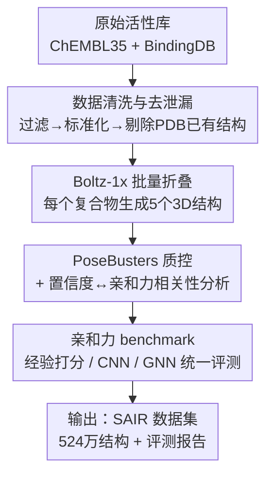

# SAIR: Enabling Deep Learning for Protein-Ligand Interactions with a Synthetic Structural Dataset

**会议**: ICLR 2026  
**OpenReview**: [https://openreview.net/forum?id=qgk2F6jxH4](https://openreview.net/forum?id=qgk2F6jxH4)  
**代码**: 数据将于论文录用后公开（为匿名评审暂未给出链接）  
**领域**: 计算生物学 / 药物发现 / 蛋白-配体相互作用 / 结构数据集  
**关键词**: 结合亲和力预测, 蛋白-配体复合物, 合成结构数据, cofolding, IC50

## 一句话总结
SAIR 用 Boltz-1x cofolding 模型对从 ChEMBL/BindingDB 整理出的 104.9 万个蛋白-配体复合物批量折叠，构建出迄今最大的、带实测活性标注的 3D 蛋白-配体结构数据集（524 万个结构），并基于它系统评测了多类结合亲和力预测方法，揭示出现有模型在合成结构上泛化能力不足、亟需针对性微调的现实。

## 研究背景与动机
**领域现状**：药物发现中，配体与靶蛋白的结合亲和力（binding affinity）是核心指标，而亲和力本质上由蛋白-配体复合物的三维结构决定。因此操作在 3D 结构上的深度学习方法（3D CNN、GNN）通常比只用蛋白序列 + 配体 SMILES 的序列级代理模型更准、更稳健。

**现有痛点**：3D 结构方法的规模化受限于「带实测亲和力标注的高质量晶体结构」严重稀缺。已知的、且配有实测亲和力的蛋白-配体结构数量相对自然界可能的组合数微不足道；现有数据集要么没有亲和力标注（CrossDocked、DockGen），要么只有一小部分有标注（PLINDER 仅 BindingDB 可查的部分），蛋白和配体空间的覆盖都不够。

**核心矛盾**：实验测结构成本高、通量低、难以塞进药物设计迭代周期；而传统计算亲和力方法（MM/GBSA、自由能微扰 FEP）依赖力场或量子化学，要么精度受限、要么贵到无法用于百万级数据。监督学习要扩规模就缺数据，缺数据又训不出能泛化的结构级模型，形成死循环。

**本文目标**：用「蒸馏」（distillation）思路——即用 cofolding 模型把缺结构的活性数据补成结构——大规模生成带实测 IC50 标注的合成 3D 复合物，把数据规模从几十万级推到百万级，并验证这些合成结构能不能真的训练/评测结构级亲和力模型。

**切入角度**：AlphaFold、Chai-1、NeuralPlexer 等工作已经证明「高置信度计算折叠结构 + 真实标注」的蒸馏路线可行；作者把这条路线专门用在「蛋白-配体亲和力」这个数据最荒的子领域，并刻意选用 MIT 许可的 Boltz-1x 以保证整套百万级数据集能完全开源复现。

**核心 idea**：用「公开 cofolding 模型批量折叠 + 实验活性标注 + 严格质控与防泄漏」造一个百万级合成结构数据集 SAIR，把结构级亲和力深度学习从「无米下锅」变成「有数据可训」。

## 方法详解
本文的「方法」其实是一条数据集构建与评测流水线，而非一个新模型。整体目标是：从原始生物活性数据库出发，经清洗、折叠、质控，产出一个百万级、带 pIC50 标注的 3D 蛋白-配体结构库，再用它作为统一基准去 benchmark 现有亲和力方法。下面按流水线的四个环节展开。

### 整体框架
输入是 ChEMBL35 与 BindingDB（1Q2025）两个公开生物活性数据库的原始条目，输出是 SAIR 数据集（5,244,285 个结构，覆盖 1,048,857 个唯一蛋白-配体系统，每个系统配实测活性）以及一份在该数据集上的亲和力方法评测报告。中间经过四个阶段：① **数据清洗与去泄漏**，把活性数据过滤、标准化并去掉已在 PDB 中有实验结构的系统；② **结构折叠**，用 Boltz-1x 对每个复合物生成 5 个候选 3D 结构；③ **结构质控**，用 PoseBusters 检验物理合理性、并考察折叠模型置信度与亲和力的相关性；④ **亲和力 benchmark**，在生成的结构上跑经验打分函数 / CNN / GNN，统一比较。

### 关键设计

**1. 严格清洗 + 防泄漏的数据策展：让百万级标注既大又干净**

数据规模再大，如果标注噪声高或与下游评测集泄漏，就毫无价值。作者用「最小但关键」的一组过滤器处理两个来源：ChEMBL 侧剔除缺 SMILES/pchembl 的条目、剔除无 UniProt ID 或指向多靶点/突变体的条目、剔除带数据有效性警告的条目、剔除 standard relation 为 `<` 或 `>`（即落在检测限之外）的条目，只保留 ChEMBL 标记为「measuring binding」的实验（Ki、IC50、Kd），并把活性值限制在合理的生化检测动态范围 $1\,\text{pM} < x < 100\,\mu\text{M}$；BindingDB 侧做类似过滤。所有活性统一换算成 $\text{pIC50} = -\log_{10}(\text{IC50})$，配体 SMILES 经去盐、中性 pH 质子化、RDKit 规范化后做去重（按 UniProt accession + canonical SMILES）。

最关键的一步是**防止数据泄漏**：作者把「已经在 PDB 中有实验解出结构」的蛋白-配体系统全部移除——做法是先用 RDKit 算出配体的 InChIKey 找到其化学组分字典（CCD）标识，再到 PDB 里查 (UniProt ID, CCD ID) 配对是否存在，命中就剔除。这样下游凡是用 PDB 结构训练的模型在 SAIR 上评测时，就不会「考到训练过的题」。最终得到 1,048,857 个复合物（ChEMBL 来源 936,702，BindingDB 来源 613,597，两者有重叠故相加大于总数）。

**2. Boltz-1x 批量 cofolding：用可开源的折叠模型把活性数据补成结构**

清洗后的数据只有序列和 SMILES、没有 3D 结构，这正是结构级深度学习缺的东西。作者选用 Boltz-1x（一个受 AlphaFold 3 启发、MIT 许可的开源 cofolding 实现）对全部复合物折叠。选它而非 AlphaFold 3 的核心理由是**许可证**：生成并再分发超过 5M 结构的数据集，需要允许这种规模再分发的开源许可，AlphaFold 3 当时不满足；Boltz-1x 还在扩散过程里引入了一个「引导势」（guiding potential）来抑制原子碰撞，使生成的结合姿态更符合物理。

工程上每个复合物生成 5 个结构样本（这是单 GPU 对数据集中最长蛋白序列能算的上限），用 3 步 recycling、200 步采样；由于缺四级结构信息，所有复合物都按单体处理。MSA 用 MMseqs2（经 ColabFold）在 UniRef30 与 ColabFoldDB 上生成。作者特别说明：Boltz-1x 的 MSA 子采样对随机种子是确定性的，所以没有像 AlphaFold3/Chai-1 那样靠换种子增加多样性——不是偷懒，而是换种子在 Boltz-1x 上预期收益不大。

**3. PoseBusters 物理质控 + 置信度信号挖掘：给每个结构标上「能不能信」**

合成结构必然带折叠模型的偏置，必须量化其可靠性。作者用 PoseBusters 对全部生成结构做物理合理性检查，发现整体仅约 3% 的结构未通过任意一项检查（与 Boltz-1x 原文报告一致），且只有 0.53% 的复合物五个结构全部失败。对失败结构的细粒度分析显示：最高频的失败源是**内能检查**（占全部失败的一半以上），通常对应轻微空间位阻或键长异常，往往用标准能量最小化（如 OpenMM）即可修复，并非根本性的结构崩坏；按蛋白家族看，激酶、磷酸酶失败率低，GPCR 较高，核受体则出现「整体失败率低但某些复合物五个结构全败」的难折叠案例。

更进一步，作者利用「手头有实测活性」这一独特优势，考察 Boltz-1x 的置信度指标是否与亲和力相关，发现界面相关指标（iPTM、complex iPDE、complex iPLDDT）与实测活性显著相关，且相关性在生化检测上最强、细胞检测上最弱（推测细胞检测有脱靶、通透性等混杂因素）。作者还新定义了一个 **interaction PTM** 指标——取 pair chains ptm 置信度头的非对角值的平均，刻画蛋白对配体（及反向）的相互置信度——它与亲和力呈中等正相关 $r_s = 0.25$，预测力仅次于 iPTM 的 $r_s = 0.27$。这些置信度指标既可作为结构筛选阈值，也为后续模型提供了现成的生物合理性代理。

**4. 统一亲和力 benchmark：用同一批合成结构横评三类范式**

光有数据集还不够，作者用 SAIR 做了一次统一基准，证明「cofolding 结构 + 结构级亲和力预测」这条新兴路线值不值得做。评测覆盖三类方法学迥异的代表：经验打分函数（AutoDock Vina、Vinardo，经 GNINA 计算，外加先用 Vina 最小化配体姿态再打分的「Vina minimized」）、3D CNN（Onionnet-2）、GNN（AEV-PLIG）。为公平起见，评测**只用 ChEMBL 来源**的结构——因为 BindingDB 含被 AEV-PLIG 训练用过的实验复合物，去掉它降低泄漏风险；所有方法都直接在预测出的 3D 结构上「按现状」评测（除 Vina minimized 外不做姿态优化），并把输出（pIC50、能量分、置信度概率）线性重标定到实验 pIC50 区间后再算 RMSE/MAE。统一对比用 Spearman/Pearson/Kendall 相关、AUC 排序能力与 RMSE/MAE 误差四类指标，并额外做了「按蛋白家族频率倒数加权」的家族均衡评测以排除头部靶点（如激酶）主导结论的可能。

### 损失函数 / 训练策略
本文不训练新模型，主体是数据集构建与零样本 benchmark，因此没有自定义训练目标。值得记的训练相关经验来自数据集的下游验证：独立工作 GatorAffinity 用 SAIR 的百万级复合物做大规模预训练、再在实验结构上微调，观察到合成预训练数据量与下游性能间存在幂律（power-law）缩放关系，印证了 SAIR 「越多越好」的可学习信号。

## 实验关键数据

### 主实验
SAIR 在规模与标注完整性上明显超越同类数据库（合成 + 带活性标注，且体量百万级）：

| 数据库 | 蛋白-配体对 | 结构类型 | 活性标注 |
|--------|-------------|----------|----------|
| CrossDocked | 22.5m | 合成 + 实验 | 无 |
| PDBbind+ | 27,385 | 实验 | 有 |
| Binding MOAD | 41,409 | 合成/实验 | 部分（15,223 条） |
| PLINDER | 449,383 | 实验 | 部分（来自 BindingDB） |
| DockGen | 41,791 | 合成 | 无 |
| **SAIR（本文）** | **1,048,857** | **合成** | **有** |

亲和力方法横评（Fig. 5）的关键结论：GNN（AEV-PLIG）> CNN（Onionnet-2）> 经验打分函数（Vina/Vinardo），但**没有任何方法取得很高相关**——机器学习方法的 Spearman 相关甚至与未经亲和力调优的界面置信度指标（如 iPTM）相当。

### 消融实验

| 配置 / 切片 | 关键发现 | 说明 |
|------------|----------|------|
| 全数据集结构质控 | 约 3% 结构未过 PoseBusters | 仅 0.53% 复合物五结构全败，质量整体可靠 |
| 失败结构成因分解 | 内能检查占失败的 50%+ | 多为轻微位阻/键长异常，能量最小化可修 |
| 仅保留高置信结构（>0.8） | 几乎所有模型性能提升 | 高置信结构更可能正确，验证置信度可作筛选阈值 |
| 家族均衡评测（频率倒数加权） | 排名与相关性量级不变 | 预测信号在多样靶点上稳定泛化，非头部靶点驱动 |
| 置信度↔活性相关性 | iPTM $r_s{=}0.27$、interaction PTM $r_s{=}0.25$ | 界面置信度对亲和力有预测信号，生化检测最强 |

### 关键发现
- **现有模型对合成结构泛化不足**：GNN/CNN 都是在实验结构上训练的，直接评测合成结构时相关性都不高，强烈暗示需要在合成结构分布上做微调——这正是 SAIR 想解决的核心痛点。
- **置信度即弱预测器**：界面置信度（iPTM 等）在未经亲和力调优的情况下，预测力居然能与专门的 ML 模型相当，说明 cofolding 模型本身已隐含一部分结合信息。
- **检测类型影响相关性**：置信度与活性的相关性在生化检测上最高、细胞检测上最低，反映细胞实验引入脱靶、通透性等混杂因素。
- **下游预训练有效**：独立工作 GatorAffinity 用 SAIR 预训练后，在 PDBbind 基准上 RMSE 从 1.343 降到 1.293，并超越 GIGN、PSICHIC 等 SOTA，证明合成结构含真实可学信号。

## 亮点与洞察
- **用许可证驱动技术选型**：刻意放弃更强的 AlphaFold 3、选 MIT 许可的 Boltz-1x，只为让 5M 级数据集能完全开源再分发——把「可复现可共享」当成一等约束，是数据集论文少见但极务实的取舍。
- **防泄漏做在数据源头**：通过 (UniProt ID, CCD ID) 配对查 PDB、剔除已有实验结构的系统，从构建阶段就为「用 PDB 训练的模型」留出干净评测集，比事后划分更彻底。
- **把折叠模型的副产物变成预测信号**：作者没把 iPTM/iPLDDT 当成单纯的质控阈值，而是挖掘出它们与亲和力的相关性，还顺手定义了 interaction PTM——这套「置信度即弱标签」的思路可迁移到任何带 cofolding 的下游任务。
- **诚实地报告负结果**：横评结论是「现有方法都不太行」，作者没有粉饰，反而把它转化为「需要针对合成结构微调」的研究号召，比强行刷出一个 SOTA 更有价值。

## 局限与展望
- **继承教师模型偏置**：作为蒸馏数据集，SAIR 带有 Boltz-1x 的归纳偏置（可能 mode collapse）；作者提供「pocket diversity」统计让用户过滤结合模式单一的蛋白，但偏置无法根除。
- **物理合理 ≠ 生物正确**：PoseBusters 只保证键长、内能等化学合理性，不保证生物学正确；又因为刻意剔除了 PDB 中的系统，没有 ground-truth 结构可做 RMSD 比对，只能把置信度当代理。
- **建模简化**：本版只折叠单体蛋白链 + 目标配体，未显式建模辅因子和离子；作者加了「drug like」过滤列让用户排除可能是伪影或依赖辅因子的微小配体。
- **改进思路**：在 SAIR 子集上微调现有亲和力模型、或专门为合成复合物设计新架构有望大幅提升精度；数据集还可支持 cofolding 模型的自蒸馏，以及以靶蛋白为条件的逆向配体生成。

## 相关工作与启发
- **vs PLINDER**：PLINDER 走「实验结构 + 链接 BindingDB 活性」路线，约 45 万对但只有一小部分有活性标注；SAIR 走「合成折叠 + 全量活性标注」路线，规模大一个量级且每条都有 pIC50，覆盖更广但结构是合成的。
- **vs CrossDocked / DockGen**：二者体量虽大但缺实测亲和力标注（CrossDocked 只有二分类对接标签），SAIR 的核心差异正是「合成结构 + 真实活性」的完整配对。
- **vs Boltz-2**：Boltz-2 可直接从中间嵌入回归出亲和力，但它训练数据与 SAIR 高度相似，故未纳入横评以避免不公平比较——也反衬出 SAIR 的数据正被同类前沿工作所采用。

## 评分
- 新颖性: ⭐⭐⭐⭐ 不在模型而在数据：首个百万级「合成结构 + 实测活性」配对库，并用许可证/防泄漏把可用性做到位。
- 实验充分度: ⭐⭐⭐⭐ 质控、置信度分析、三范式横评、家族均衡评测齐全，还有独立工作 GatorAffinity 的下游印证。
- 写作质量: ⭐⭐⭐⭐ 流水线交代清晰、负结果诚实，局限自陈到位。
- 价值: ⭐⭐⭐⭐⭐ 直击结构级亲和力深度学习「无数据可训」的瓶颈，是可被整个社区复用的基础设施。

<!-- RELATED:START -->

## 相关论文

- [\[ICLR 2026\] PSDNorm: Temporal Normalization for Deep Learning in Sleep Staging](psdnorm_temporal_normalization_for_deep_learning_in_sleep_staging.md)
- [\[ICLR 2026\] Enhancing Molecular Property Predictions by Learning from Bond Modelling and Interactions](enhancing_molecular_property_predictions_by_learning_from_bond_modelling_and_int.md)
- [\[ICLR 2026\] Meta-Learning Theory-Informed Inductive Biases using Deep Kernel Gaussian Processes](meta-learning_theory-informed_inductive_biases_using_deep_kernel_gaussian_proces.md)
- [\[ICLR 2026\] TetraGT: Tetrahedral Geometry-Driven Explicit Token Interactions with Graph Transformer for Molecular Representation Learning](tetragt_tetrahedral_geometry-driven_explicit_token_interactions_with_graph_trans.md)
- [\[ICLR 2026\] PoseX: AI Defeats Physics-based Methods on Protein Ligand Cross-Docking](posex_ai_defeats_physics-based_methods_on_protein_ligand_cross-docking.md)

<!-- RELATED:END -->
