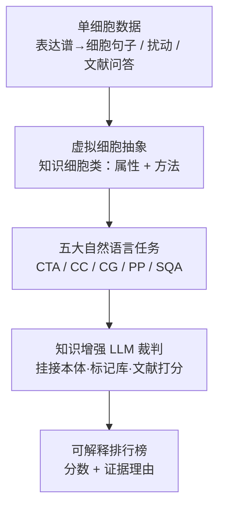

# SC-Arena：面向单细胞推理的自然语言基准与知识增强评测

**会议**: ICLR 2026  
**OpenReview**: [https://openreview.net/forum?id=5RcoUe1tA1](https://openreview.net/forum?id=5RcoUe1tA1)  
**代码**: https://github.com/SUAT-AIRI/SC-Arena  
**领域**: 计算生物学 / LLM 评测基准 / 单细胞推理  
**关键词**: 单细胞基准, 虚拟细胞, 知识增强评测, LLM-as-judge, 自然语言任务

## 一句话总结
SC-Arena 把"评测 LLM 能不能当一个虚拟细胞"重构成一个自然语言竞技场：用面向对象的"知识细胞类"抽象统一评测目标（属性 + 方法），设计 5 个开放式自然语言任务，并用挂接本体/标记基因数据库/文献的知识增强 LLM 裁判替代脆弱的字符串匹配指标，最终发现当前模型在描述类任务流畅、却在机制/因果类任务（扰动预测、细胞类型标注）系统性翻车。

## 研究背景与动机
**领域现状**：单细胞生物学正在把 LLM 引进来做细胞类型标注、扰动分析、机制问答，目标是构建"虚拟细胞"——一个能在计算机里模拟细胞行为、加速科学发现的模型。无论是从头训练的 scGPT、Geneformer、C2S-Scale 这类领域专用模型，还是 GPT-4o、DeepSeek-R1 这类通用大模型，都被拿来跑这些任务。

**现有痛点**：但配套的评测严重落后。现有基准有三个具体毛病：(1) **任务碎片化**——大多只盯一个窄任务（如只做细胞类型标注），无法判断模型是否真正掌握了"细胞身份 + 动态"的整体理解；(2) **格式失真**——像 CELLVERSE 这样把开放问题硬转成多选题（MCQ）来保证稳定性，与真实使用场景脱节，也压制了推理深度；(3) **指标空洞**——SOAR 等依赖 BLEU、exact match 这种表面字符串重叠，把复杂的生物推理降级成词面匹配，既缺生物学根据，也几乎没有可解释性。

**核心矛盾**：评测要同时满足"统一覆盖异构任务"、"开放式自然语言形式"、"生物学上可信且可解释"这三点，而现有指标在生物保真度上是缺失的——它们分不清模型是真的理解了细胞机制，还是只是记住了表面模式。常规 NLP 指标（BLEU/ROUGE/BERTScore）在作者的预实验里要么各模型分数挤在一起没区分度、要么趋近于零，根本无法捕捉生物推理质量。

**本文目标**：建一个评测框架，能用一套统一的对象（虚拟细胞）把异构任务收进来，用开放式自然语言问答（不给候选列表）来考，并注入领域知识保证生物保真度。

**切入角度**：作者借了"面向对象建模"的思路——把细胞看成一个类的实例，它既有静态**属性**（identity、state），又有动态**方法**（对环境的响应、与环境的交互）。一个真正的虚拟细胞模型应当能连贯地表征这两面。

**核心 idea**：用"虚拟细胞（知识细胞类）"抽象统一评测目标 + 用"知识增强的 LLM 裁判"替代字符串匹配，把单细胞评测变成一个开放式、可解释、生物学可信的自然语言竞技场。

## 方法详解

### 整体框架
SC-Arena 是一个**评测框架**而非一个新模型，它把整套评测组织成三段串行的流程：先把参赛模型框定为一个"虚拟细胞"（定义清楚要考什么），再用一场覆盖 5 个任务的"正式考试"去考它（定义清楚怎么考），最后用挂接外部知识库的 LLM 裁判去打分（定义清楚怎么评）。输入是各类单细胞数据（表达谱转成的"细胞句子"、扰动设定、机制问题），输出是一张细粒度、可解释、带证据理由的排行榜。

### 关键设计

**1. 虚拟细胞抽象：用面向对象的"知识细胞类"统一评测目标**

这一设计直击"任务碎片化"——以前每个任务各管各的，没有统一的评测单元。作者借面向对象建模，把每个待评的细胞定义成一个 **Knowledge Cell 类**的实例，它封装两类东西。**属性（Attributes）**代表细胞内在的身份与状态，是多模态的：(i) 表达层面，scRNA-seq 谱被编码成结构化的"细胞句子"（cell sentence，即把基因按表达量排成一串 token）；(ii) 文本层面，从文献和数据库整理出的形态、功能、定位、角色描述；(iii) 本体层面，来自 Cell Ontology（CL）的层级化注释。**方法（Methods）**代表细胞对外的动态行为：(i) Cell→Environment，如细胞因子分泌、信号传导、抗原呈递、免疫激活；(ii) Environment→Cell，如药物处理或基因敲除等扰动下的转录变化。一个模型只有同时能连贯地表征"属性 + 方法"，才算合格的虚拟细胞候选。这个抽象的价值在于：它把原本零散的标注、生成、扰动、问答任务全部映射到"知识细胞类的某个属性或方法上"，从而能用一个统一的框架去考。

**2. 五大自然语言任务：把异构能力拆成知识细胞类内部的模态映射**

有了知识细胞类，作者据此设计了 5 个代表性任务，每个任务对应类内部的一种模态映射或推理方向，且全部采用**开放式自然语言问答**而非多选题：

- **细胞类型标注 CTA（Expression→Ontology）**：给一句细胞句子，让模型预测对应的本体细胞类型标签；
- **细胞描述 CC（Expression→Language）**：给细胞句子，让模型生成对生物状态的自然语言描述，考"把转录组模式说成人话"的可解释性；
- **细胞生成 CG（Ontology/Language→Expression）**：给细胞类型名，让模型反向生成一句合理的细胞句子，考它能否产出与语义标签一致的分子谱；
- **扰动预测 PP（Environment→Cell）**：给基线谱 + 扰动信号，让模型 (i) 预测上/下调基因，(ii) 生成扰动后的细胞句子；
- **科学问答 SQA（Cell→Environment）**：基于文献提问，要求模型抽取相关知识、给出有证据支撑的机制性解释。

这五个任务的设计动机很明确：前三个构成"表达谱 ↔ 本体标签 ↔ 自然语言"的闭环双向翻译，后两个考细胞与环境之间的因果交互推理，合起来既覆盖静态身份、又覆盖动态行为和跨模态推理，从而能整体地测出模型是否真的理解了细胞系统。

**3. 知识增强评测：让 LLM 裁判挂接外部知识库，把字符串匹配换成生物学可信打分**

这一设计针对"指标空洞"。作者采用 LLM-as-a-judge，但借鉴 Eval-RAG 的思路，让裁判不再只看 prompt 和模型输出，而是显式接入一批人工整理的外部资源：Cell Ontology、UniProt、Gene Ontology、CellMarker、以及同行评议文献。形式化地，每个评测实例表示为 $I = (q, r, K, g)$，其中 $q$ 是任务 prompt、$r$ 是模型回答、$K$ 是检索到的外部知识、$g$ 是 ground truth；裁判 LLM $E$ 把这个四元组映射成一个分数 $s = E(I) \in [0, 100]$（实现上先打 $[0,5]$ 的离散分再线性缩放到 $[0,100]$）。同时条件于 $K$ 和 $g$ 的好处是：裁判既能容忍语言表述上的差异、对语义相关但不完全对的预测给部分分，又能拿可信参考去惩罚生物学上不成立的事实错误。每个任务的知识锚点是任务定制的：CTA 用 CL 层级路径算语义距离（层级上接近也给分，不卡 exact match）；CC 用 CL 的官方定义当参考描述查有没有漏关键属性；CG 用 CellMarker 的标记基因校验生成谱是否保留了细胞身份的区分度；PP 用 NCBI/UniProt/GO 的基因功能注释核对扰动响应是否符合已知机制；SQA 直接抽原始 PubMed 文章的摘要和关键片段当事实依据。框架刻意"重生物保真、轻臆测新颖"——只有与已被实验验证的事实一致的预测才能拿高分，且因为锚定的是共识级证据而非动态检索，即便底层数据库被替换（如换掉 UniProt、CellMarker）评分仍保持稳定。

### 一个例子：扰动预测怎么被打分
以一个 K562 细胞、扰动条件为 `DNAJC19+ctrl` 的样本为例，裁判按结构化步骤评分：**Step 1** 发现预测与 ground truth 部分吻合，但混入了未经验证的下调基因（如 FTH1、ARPC1B），可靠性存疑；**Step 2** 确认预测的上/下调基因（如 CD63、RPS28）在 CRISPRi 扰动语境下生物学上合理，且直接靶点 DNAJC19 被正确预测为下调；**Step 3** 指出模型抓住了核心受调控基因集合，但对功能角色的注释（尤其显著下调基因）不够精确；**Step 4** 用外部知识佐证——已知 DNAJC19 敲低会触发线粒体应激及相关通路，间接验证了预测的表达变化；**结论**：整体生物学上合理但有不准（尤其过度预测下调基因），给中等分 3 分。这个走查具象地展示了"分数 + 证据理由"是怎么一步步生成的——评测从黑箱数字变成了可审计、能当作迭代改进教学信号的过程。

## 实验关键数据

### 主实验
在 5 个任务上评测通用模型（Qwen2.5/Qwen3 系列、GPT-4o、DeepSeek-R1、Kimi-K2）与领域专用模型（C2S-Scale、scGenePT、scGPT、Cell-O1），各列满分均为标准化后的水平（Total 满分约 5×100）。

| 模型 | CTA | CG | CC | PP | SQA | Total |
|------|-----|-----|-----|-----|-----|-------|
| Qwen2.5-7B | 12.61 | 45.98 | 51.05 | 28.84 | 64.09 | 202.57 |
| Qwen3-235B | 37.47 | 52.76 | 62.03 | 35.94 | 74.48 | 262.68 |
| GPT-4o | 36.29 | 59.70 | 63.02 | 37.24 | 67.56 | 263.81 |
| DeepSeek-R1 | 40.81 | 62.24 | 66.51 | 36.23 | 70.87 | **276.66** |
| Kimi-K2 | 40.00 | 63.04 | 67.89 | 37.10 | 69.13 | **277.16** |
| C2S-Pythia-410m (CTA) | **47.34** | — | — | — | — | — |
| Cell-o1 | 34.11 | 43.91 | 67.89 | 24.20 | 64.09 | 234.20 |

关键读数：(1) **没有任何系统达到可靠"虚拟细胞"水平**——最强的 Kimi-K2（277.2）和 DeepSeek-R1（276.7）都没跨过归一化及格线（5×60=300），说明单细胞推理本身极难、提升空间巨大；(2) **任务间分化剧烈**——描述（最高 67.9）和科学问答（最高 74.5）能到 60–70 区间，但细胞类型标注普遍卡在 40 附近、扰动预测全员低于 38，暴露"流畅但不忠实"（fluent but not faithful）的鸿沟；(3) **专用模型在对口任务上能小博大**——仅 410M 的 C2S-Pythia 在 CTA 上拿到 47.3，反超 GPT-4o（36.3）和 Qwen3-235B（37.5），但 scGenePT 在 PP 上只有 21–26，说明专用化高度任务依赖、并非处处有利。

### 规模与评测器有效性分析

| 维度 | 关键结果 | 说明 |
|------|---------|------|
| 模型规模/迭代 | Qwen2.5-7B 202.6 → Qwen3-235B 262.7 | 扩规模 + 迭代约涨 60 分，但不解决机制推理 |
| 评测器·生物正确性 | Spearman $\rho=0.6212$, $p<0.001$ | CTA 中评分与本体距离强正相关，越接近真值类型分越高 |
| 评测器·区分度 | NLP 指标各模型分数挤在一起或近 0 | 知识增强评测能拉开模型差距，大模型生成更深更具体的类型预测 |
| 评测器·鲁棒性 | 换裁判模型 / 换知识库仍稳定 | 评分对回答长度不敏感，对底层数据库替换不敏感 |

### 关键发现
- **"流畅但不忠实"是系统性现象**：通用模型在开放式生成（描述）上凭表面流畅性反超专用模型，但一到需要本体精度或因果准确性的任务（标注、扰动预测）优势消失甚至被反超——模型会"说生物学"，但不会按层级与因果"推理生物学"。
- **知识增强评测确实有生物学根据**：CTA 中评分与 Cell Ontology 最短路径距离强正相关（$\rho=0.6212$），证明打分忠实对齐了生物层级结构，而非随意打分。
- **常规 NLP 指标没有区分度**：BLEU/ROUGE/BERTScore/METEOR 要么各模型分数挤在一起、要么趋近零，无法反映生物推理质量差异，这正是引入知识增强评测的实证依据。
- **数据泄漏风险低**：用 C2S-scale 系列在 CTA 上验证，这些模型与样本的字符级相似度显著低于通用模型、但任务准确率更高，说明学到的是任务相关知识而非记住了数据。

## 亮点与洞察
- **把面向对象建模搬进生物评测**：用"知识细胞类（属性 + 方法）"当统一评测单元，是个很漂亮的抽象——它让标注/描述/生成/扰动/问答这些看似无关的任务，统一成"类内部的模态映射或动态响应"，可扩展性强（后续加空间转录组、发育轨迹只是往类里加属性/方法）。
- **知识增强裁判把评测变成可审计过程**：$I=(q,r,K,g)$ 这套设计的巧妙之处是同时条件于"外部知识 $K$"和"真值 $g$"，既能给语义相近的预测部分分（解决字符串匹配过脆），又能拿可信证据惩罚事实错误（解决纯 LLM 裁判易被流畅文本骗）——而且锚定共识级证据让评分对换库稳定。
- **"流畅但不忠实"是个可迁移的诊断视角**：把语言流畅度和领域忠实度拆开看，这个二分法可以迁移到任何"用 LLM 做专业领域推理"的评测中（法律、医学、化学），提醒大家高 BLEU/高描述分不等于真懂。
- **小模型对口反超大模型**：410M 的 C2S-Pythia 在 CTA 反超千亿级通用模型，强化了"领域结构化知识 > 单纯堆参数"的结论。

## 局限与展望
- **裁判继承了 LLM 的概率本性**：作者承认知识增强裁判仍有 LLM 固有的不稳定性，未来可用多裁判集成降方差、用专家标注的理由集校准、接入实时知识库（GO/CL/CellMarker）让评分标准随科学进展演化。
- **覆盖模态仍有限**：当前只覆盖 scRNA-seq 表达 + 文献问答；空间转录组、发育轨迹（时序推理）、多组学（ATAC-seq、蛋白组）尚未纳入，作者把它们列为把 SC-Arena 做成"活基准"的扩展方向。
- **样本规模偏小**：PP 仅 138 个干预、SQA 仅 254 题、CTA/CC/CG 共享 608 个谱，统计上对模型排名的置信度有限（笔者观察）。
- **及格线设定较主观**：把"5×60"当虚拟细胞及格线缺乏外部依据，更多是说明"还差得远"，不宜过度解读绝对分值（笔者观察）。

## 相关工作与启发
- **vs CELLVERSE**：它把跨模态数据统一成多组学细胞句子，但依赖多选题（常把开放问题转成 MCQ 求稳定），压制了推理深度；SC-Arena 坚持开放式自然语言问答、不给候选列表，更贴近真实使用。
- **vs SOAR**：它把模型当单任务 agent、只做细胞类型标注，用 BLEU/exact match 这种字符串匹配，几乎没有可解释性；SC-Arena 用知识增强裁判给出带证据理由的分数。
- **vs Cell-o1**：它作为推理 agent 强调 batch 级逻辑一致，但被约束在 selection-based 格式（需要候选列表）；SC-Arena 是开放生成、虚拟细胞统一范式。
- **vs C2S-Scale**：它聚焦静态编码与 scaling law，用 BERTScore/Gene Overlap 这类词面/统计指标评 prompted completion；SC-Arena 把评测目标统一进动态虚拟细胞，并强调机制推理。

## 评分
- 新颖性: ⭐⭐⭐⭐⭐ 虚拟细胞（知识细胞类）抽象 + 知识增强 LLM 裁判，是单细胞评测里少见的统一且可解释的范式。
- 实验充分度: ⭐⭐⭐⭐ 覆盖通用 + 专用模型、5 任务、裁判的正确性/可解释性/区分度/鲁棒性都有验证，但单任务样本量偏小。
- 写作质量: ⭐⭐⭐⭐ 框架三段式清晰，"流畅但不忠实"的洞察提炼到位。
- 价值: ⭐⭐⭐⭐⭐ 给单细胞基础模型提供了统一、可解释、生物可信的诊断工具，对推动 biology-aligned 模型有实打实的导向意义。

<!-- RELATED:START -->

## 相关论文

- [\[ICLR 2026\] GAGA: Gaussianity-Aware Gaussian Approximation for Efficient 3D Molecular Generation](gaga_gaussianity-aware_gaussian_approximation_for_efficient_3d_molecular_generat.md)
- [\[ICLR 2026\] Representing Local Protein Environments with Machine Learning Force Fields](representing_local_protein_environments_with_machine_learning_force_fields.md)
- [\[ICLR 2026\] Take Note: Your Molecular Dataset Is Probably Aligned](take_note_your_molecular_dataset_is_probably_aligned.md)
- [\[ICLR 2026\] VenusX: Unlocking Fine-Grained Functional Understanding of Proteins](venusx_unlocking_fine-grained_functional_understanding_of_proteins.md)
- [\[ICLR 2026\] DriftLite: Lightweight Drift Control for Inference-Time Scaling of Diffusion Models](driftlite_lightweight_drift_control_for_inference-time_scaling_of_diffusion_mode.md)

<!-- RELATED:END -->
