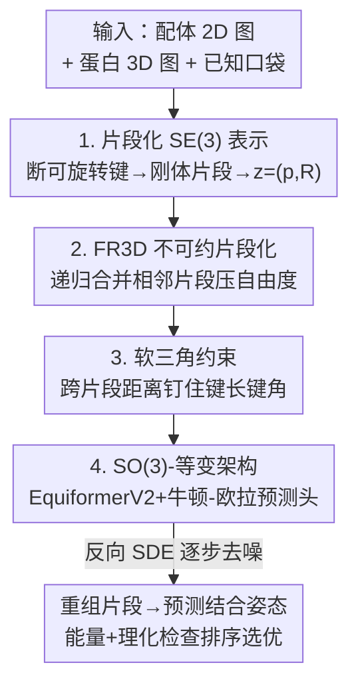

# SigmaDock: Untwisting Molecular Docking with Fragment-Based SE(3) Diffusion

**会议**: ICLR 2026  
**OpenReview**: [https://openreview.net/forum?id=Vgm77U4ojX](https://openreview.net/forum?id=Vgm77U4ojX)  
**领域**: 计算生物 / 扩散模型 / 分子对接  
**关键词**: 分子对接, SE(3) 扩散, 刚体片段, 黎曼扩散, 药物发现

## 一句话总结
把配体拆成"刚体片段"、让生成任务从预测扭转角变成为每个片段预测一个 SE(3) 刚体变换，再用 SE(3) 黎曼扩散把片段重新拼回结合口袋——SigmaDock 在 PoseBusters 上 Top-1（RMSD < 2 Å 且 PB-valid）成功率达 79.9%，是首个在公平 train-test split 下超越经典物理对接方法的深度学习对接模型。

## 研究背景与动机
**领域现状**：分子对接（molecular docking）要预测一个小分子配体（ligand）在蛋白口袋里的结合姿态（binding pose），是药物发现的核心一步。物理方法（Vina、Gold）是工业标准；近年扩散类深度学习方法（DiffDock 等）被寄望于更快、更准、更多样的姿态采样。其中主流路线是**扭转模型（torsional model）**：在配体的全局平移旋转 + 各可旋转键的扭转角（torsion angle）上定义扩散过程，因为这个低维流形恰好刻画了化学可行姿态的主要自由度。

**现有痛点**：理论上扭转模型应该数据高效、易泛化、推理快，但**实证结果一直令人失望**。同时另一类痛点更尖锐——很多深度学习对接模型生成的姿态"化学上不合理"（键长键角畸变、原子穿插），一旦像 Buttenschoen et al. (2024) 那样把化学合理性（PB-validity）也纳入考核，深度学习方法的表现远逊于传统物理方法。共折叠模型（AlphaFold3 等）虽强，但训练要海量数据与算力，且联合建模蛋白+配体导致推理极慢，难以用于需要查询百万级配对的高通量虚拟筛选（HTVS）。

**核心矛盾**：扭转模型为什么"该好却不好"？作者的判断是——**score 模型被迫隐式地承担"从 3D 坐标反推扭转角更新"这件苦差事**，而这个反问题是非局部、高度非线性、有时甚至有歧义的。更要命的是，扭转角的微小局部改动会在笛卡尔坐标里造成远端原子的大幅位移（杠杆效应），于是"本应独立的扭转扰动"一旦映射回模型实际观测的笛卡尔空间就强烈耦合，破坏了乘积结构，导致学习问题病态、采样动力学僵硬。

**本文目标**：保住"利用结构化学先验、低维表示"的好处，同时绕开扭转模型那套纠缠不清的隐式动力学。

**切入角度**：既然"扭转角→坐标"这一步是病根，那就干脆别建模扭转角。把配体在所有可旋转键处打断，得到一组**内部几何近似刚性的片段（fragment）**；生成任务就退化为"给每个片段预测一个 SE(3) 刚体变换"，再把这些变换复合起来即可恢复任意化学可行姿态。

**核心 idea**：用"为每个刚体片段预测 SE(3) 变换"代替"预测扭转角"，把扩散过程搬到 $\mathrm{SE}(3)^m$ 这个几何上互相独立的乘积空间，让 score 模型去学一个更简单、更良态的函数。

## 方法详解

### 整体框架
SigmaDock 要解决的问题是：给定配体的 2D 图 $G^{2D}_{\text{ligand}}$ 和蛋白的 3D 图 $G_{\text{protein}}$（采用受体固定、口袋已知的标准 re-docking 协议），预测配体的结合姿态 $x \in \mathbb{R}^{|G_{\text{ligand}}|\times 3}$。整体转法是：先把配体拆成 $m$ 个刚体片段，把姿态参数化成 $z=(p,R)\in\mathrm{SE}(3)^m$（每个片段一个平移 $p$ + 一个旋转 $R$）；然后在 $\mathrm{SE}(3)^m$ 上跑一个黎曼扩散——前向过程把真实姿态加噪到平稳分布（高斯平移 ⊗ SO(3) 均匀旋转），反向过程用学到的 score 网络把噪声片段逐步"重新组装"回结合口袋里的姿态。

整条管线有四个关键环节：先论证"从真空构象流形采样的片段能无损对齐到结合流形"（这是把片段从 $\mathcal{M}_c$ 采样的合法性基础），再用 FR3D 把打断得到的片段递归合并以压低自由度，再加软三角约束把跨片段的键长键角钉住，最后用一个 SO(3)-等变架构来参数化 score 函数。

### 关键设计

**1. 基于刚体片段的 SE(3) 扩散表示：把"预测扭转角"换成"预测每个片段的刚体变换"**

这是全文的根基，直接针对"扭转模型病态"的痛点。作者先在理论上给出依据（Theorem 1）：对常见分子拓扑，扭转角到笛卡尔坐标的映射是非线性的，诱导出的测度高度纠缠、**不是乘积分布**；而互不相交的刚体片段则给出 $\mathrm{SE}(3)^m$ 上若干 Haar 测度的**乘积**。直觉上，扭转角的局部改动会引起远端原子的非局部位移，于是独立的扭转扰动一旦映射到笛卡尔空间就相关化，破坏乘积结构、导致采样僵硬；而片段表示让前向核天然在互不相交的 $\mathrm{SE}(3)^m$ 上分解，片段间的相关性**只通过学到的 score 进入，而不是被噪声强行诱导**，从而得到更良态、更易学的映射和更稳的反向积分。

具体做法：把配体的 2D 图按可旋转键打断成片段 $\{G_{F_i}\}_{i=1}^m$，每个片段的局部坐标 $\tilde{x}_F$ 居中且因化学约束视为固定；配体全局坐标通过群作用 $x_{F_i}=(p_{F_i},R_{F_i})\cdot\tilde{x}_{F_i}$ 恢复，于是姿态被参数化成 $z=(p,R)\in\mathrm{SE}(3)^m$，存在映射 $\phi:\mathrm{SE}(3)^m\to\mathbb{R}^{|G_{\text{ligand}}|\times 3}$。前向 SDE 把平移往 0 收缩、旋转往 SO(3) 均匀分布扩散，反向 SDE 用 score 网络 $s_\theta(z,t,G_{\text{dock}})$ 逐步去噪，训练用标准 score matching 目标。这里有个被作者特别论证的前提（§2.2.1）：他们用 RDKit ETKDGv3 当作真空构象 Boltzmann 分布 $\pi_{\mathcal{M}_c}$ 的代理，通过 Kabsch + 扭转联合配准，实测从 $\mathcal{M}_c$ 采的构象能以 $\mathrm{RMSD}\ll 2$ Å 对齐到真实结合姿态——这保证"用真空片段拼装"不会跑出分布。

**2. FR3D 不可约片段化：把朴素打断的 $k{+}1$ 个片段递归合并压低自由度**

朴素地在所有 $k$ 个可旋转键处打断会得到 $\hat{m}=k+1$ 个片段、共 $6\hat{m}$ 个自由度，反而比扭转模型的 $k+6$ 个自由度还多——这是片段化引入的额外代价。FR3D（fragmentation reduction in 3D）就是来还这笔账的：它从无扭转的 $\hat{m}$ 个片段出发，做**随机搜索**，不断提出"合并相邻片段"的动作，直到达到一个不可约（irreducible）的片段集，规模降到 $m$。当两个或多个连续可旋转键相连时就可以合并，因此存在合并不掉的拓扑，片段数被上界约束为 $1\le m\le k+1$；实测 FR3D 能把片段数压到约 $m\approx\tfrac{2}{3}\hat{m}$。随机搜索而非固定顺序还顺带提供了一条数据增强的路子。

合并时一个关键细节是处理"哑原子（dummy atom）"：打断时在键两侧放哑原子以保留键长键角信息，但**一旦某条扭转键被合并进相邻片段，它对应的哑原子就"过约束"了**（会把本应自由的二面角固定死）。如果不删掉这些过约束哑原子，从 $\pi_{\mathcal{M}_c}$ 采到的不可变二面角会违反 §2.2.1 要求的"扭转自由"，导致生成器对齐后无法落在结合流形上（$\Psi\cdot\pi_{\mathcal{M}_c}(\cdot)\neq\pi_{\mathcal{M}_b}(\cdot)$）。所以 FR3D 会主动剪掉过约束哑原子，只保留自由哑原子。

**3. 软三角约束：用跨片段距离把键长键角"隐式钉死"，又不锁死二面角**

FR3D 给出不可约片段后，片段之间的连接处仍有自由度需要约束，否则拼接出的结构容易在键角上跑偏。作者的做法是一个**三角化距离条件机制（triangulation conditioning）**：对任一连接相邻片段 A、D 的扭转键 $BC$，取两侧邻接原子构成三角形 $(A,B,C)$ 和 $(B,C,D)$；Lemma 1 证明，只要在刚体模板之上额外约束跨片段距离 $\|A-C\|$ 与 $\|B-D\|$，对应的键角 $\angle(A,B,C)$、$\angle(B,C,D)$ 就被**唯一确定**，而二面角 $\phi_{ABCD}$ 的变化不受限制。

实现上，把相对距离失配 $\Delta d_{A,C}(x_t,t)=\|A(t)-C(t)\|-d^{\text{ref}}_{A,C}$ 作为一条边特征喂给网络（参考距离 $d^{\text{ref}}$ 来自初始 RDKit 构象），并让 $\lim_{t\to 0}\Delta d_{A,C}=0$。这相当于给 SigmaDock 一个强信号：随着去噪 $t\to 0$，把跨片段距离压回参考值，从而在不显式建模扭转角的前提下，把键长键角这些应当守恒的几何先验隐式恢复，只让二面角和刚体平移旋转保持自由。哑原子在采样后丢弃，扭转键由锚点重建，保证条件输入和最终构象不冲突。

**4. SO(3)-等变架构：用牛顿-欧拉预测头消除局部坐标系不唯一带来的歧义**

score 网络需要 SO(3)-等变才能保证生成分布的几何一致性。作者以 EquiformerV2 为骨干，并做三处改造：(i) 在原始化学图上叠加虚拟节点和边形成层次拓扑，降低平均节点度数以缓解 over-squashing、促进全局信息流动；(ii) 按结构角色定制节点/边特征；(iii) 让代表局部相互作用的边消息随距离平滑衰减到 0，避免扰动 $z$ 时图拓扑突变引入不稳定。

更关键的是一个被忽视的歧义：片段全局坐标 $x_F$ 关于 $(p,R)$ 的参数化**不唯一**——因为局部坐标 $\tilde{x}_F$ 没有标准朝向，$\tilde{x}'_F=R_0\cdot\tilde{x}_F$ 是同样合法的选择，于是 $x_F=(p,R)\cdot\tilde{x}_F=(p,RR_0^{-1})\cdot\tilde{x}'_F$ 给出两套不同表示。如果不处理，模型会被这种"坐标系任意性"搞糊涂。作者借用 Jin et al. (2023) 基于牛顿-欧拉刚体力学方程的 SO(3)-等变预测头：把骨干输出转成对 $m$ 个片段所有原子的**伪力（pseudo-force）**，再以此为基在 SE(3) 切空间里定义 score。Theorem 2 证明这样做让训练目标和采样过程对局部坐标轴的选择不变，且 score 模型 SO(3)-等变，从而 $p_\theta(z|G_{\text{dock}})$ 是一个 SO(3)-等变的随机核。

### 损失函数 / 训练策略
训练用 SE(3) 上的 score matching 目标（Eq. 3）：$L(\theta)=\mathbb{E}\big[\|s_\theta(Z(t),t,G_{\text{dock}})-\nabla_z\log p_{t|0}(Z(t)|Z(0))\|^2_{\mathrm{SE}(3)^m}\big]$，即让网络逼近前向核的 score。训练集仅用 PDBBind v2020（19,443 个晶体学复合物），刻意不扩充数据以保证公平对比。口袋定义为"任一原子落在配体原子 $d_r=d_0+\mathcal{N}(0,\sigma_r)$ 内的残基"（默认 $d_0=5$ Å、$\sigma_r=1$ Å，训练时加抖动）。采样时 SigmaDock **不需要单独训练的 confidence model** 来过滤坏样本，而是用一个便宜的启发式：对 $N_{\text{seeds}}$ 个候选同时算（伪）结合能和一组理化检查（键角、键长、内能），据此排序选优。

## 实验关键数据

### 主实验
评测集为 PoseBusters v2（PB，308 个 2021 年后的复合物，蛋白序列未见过）和 Astex（AX，85 个高质量复合物）。指标为对称性校正 RMSD 下的 Top-k 成功率，并叠加 PB-validity（理化合理性）。

| 方法 | PB Top-1 (RMSD<2 & PB-Val) | AX Top-1 (RMSD<2 & PB-Val) | 说明 |
|------|------|------|------|
| DiffDock | 12.7% | 5.2% | 同 split 最强开源扩散基线 |
| TankBind | 3.2% | 1.9% | 扭转/点云类 |
| UniMol | 5.9% | 12.0% | 点云对接 |
| Gold（经典） | 38.0% | 56.0% | 物理方法 |
| Vina（经典） | 47.0% | 58.0% | 物理方法 |
| **SigmaDock（本文）** | **79.9%** | **90.6%** | 首个在公平 split 下超越经典物理对接 |

SigmaDock 的 PB-validity 是 DiffDock 的 6.3 倍；在序列相似度 $(0,30]$ 的"未见蛋白"子集上 Top-1 仍达 42%（RMSD<2），有力反驳了"深度学习只是记忆而非学物理"的批评。更值得注意的是，它用仅 19k 训练样本、低得多的 train-test 泄漏、50× 更快的采样，就摸到了 AF3 级别的水平（AF3 Top-1 约 84%，SigmaDock 79.9%），且无需"能量最小化"这种常被用来人为刷高 PB-validity 的昂贵后处理。

### 消融实验

| 配置 | RMSD<2 (%) | PB-Val (%) | 说明 |
|------|------|------|------|
| SigmaDock（$N_{\text{seeds}}=40$，默认） | 80.5 | 79.9 | 完整模型 |
| (−) 三角约束 | 71.9 | 67.1 | 去软三角约束，掉点最猛 |
| (−) 蛋白-配体相互作用 | 79.2 | 76.3 | 计算图里去掉 PL 交互 |
| (−) FR3D 片段合并 | 74.4 | 73.7 | 不做片段合并 |
| (−) 能量打分 | 67.2 | 66.1 | 排序启发式去能量项 |
| (−) PB 打分 | 82.1 | 70.8 | 排序去 PB 检查，PB-Val 掉 |
| 从 $\mathcal{M}_b$ 采片段 | 86.4 | 85.4 | 用真实结合构象（上界参考） |
| $N_{\text{seeds}}=10$ | 74.7 | 72.2 | 减种子，性能-算力权衡 |

### 关键发现
- **软三角约束贡献最大**：去掉后 RMSD<2 从 80.5% 掉到 71.9%、PB-Val 从 79.9% 掉到 67.1%，说明"用跨片段距离隐式钉住键长键角"是化学合理性的主要来源。
- **能量打分在排序里很重要**：去掉能量项 Top-1 直接掉到 67.2%，说明那个便宜的能量+理化启发式确实在挑好样本。
- **从 $\mathcal{M}_b$ 采样是上界**：用真实结合构象采片段能到 86.4%，而从真空 $\mathcal{M}_c$ 采只小幅下降，验证了"真空片段可无损对齐到结合流形"的核心假设。
- **失败有迹可循**：按共结合因子（co-factor）分层，存在天然配体/离子等共结合事件时失败率显著升高（天然配体子集失败率 41.2%，无共结合子集仅 16.2%），因为 SigmaDock 刻意不建模 co-factor、此时是部分可观测——这恰恰说明它不是盲目记忆幻觉，而是在对它真正"看得见"的体系做物理推断。
- **对口袋大小稳健**：把口袋直径从 22.4 Å 扩到 26.2 Å（训练均值的 2σ 外）才出现明显下降（RMSD<2 从 81.5% 到 69.8%）；缩小 Vina 的口袋并不能提升其 Top-1，排除了"靠更小口袋取巧"的质疑。

## 亮点与洞察
- **诊断对了病根再开方**：作者没有盲目堆模型，而是先用 Theorem 1 指出扭转模型的"非乘积、强纠缠"本质，再用片段乘积空间对症下药——这种"先把失败机制讲清楚"的思路本身就很有说服力。
- **片段化引入额外自由度，又用 FR3D + 三角约束把它收回来**：一加一减的设计闭环很漂亮——朴素片段化把自由度从 $k+6$ 涨到 $6(k+1)$，FR3D 合并压回，三角约束再隐式钉住键长键角，最后只留二面角和刚体运动这些真正该自由的自由度。
- **把"姿态多样性"转成对接优势**：扩散对接最被诟病的就是化学不合理，而 SigmaDock 用 6.3× 于 DiffDock 的 PB-validity 证明，只要表示空间选对（刚体片段而非扭转角），生成式方法可以同时又准又合理。
- **可迁移性**：fragment SE(3) 这套表示天然能扩展到柔性对接（把选定侧链当额外片段）和共折叠，是一个可复用的"把分子拆成 SE(3) 刚体再扩散"的范式。

## 局限与展望
- **只做固定受体的 re-docking**：受体固定、口袋已知是作者刻意选的公平基准，但现实里蛋白会构象变化、口袋未必已知；柔性对接和共折叠都被留作未来工作。
- **不建模共结合因子**：刻意排除 co-factor（离子、天然配体等）简化了问题，但在这些共结合体系上失败率明显升高，是已知盲区。
- **依赖 RDKit 构象作为真空分布代理**：整套方法的合法性建立在"$\pi_{\mathcal{M}_c}$ 用 ETKDGv3 近似、且能无损对齐到结合流形"之上，对构象生成器质量有隐性依赖。
- **改进思路**：把侧链作为额外片段纳入做柔性对接，或在采样排序里引入更强的物理能量项以进一步压低共结合体系的失败率。

## 相关工作与启发
- **vs 扭转模型（DiffDock / Corso et al. 2022）**：他们在扭转角 + 全局 SE(3) 上扩散，本文在片段的 $\mathrm{SE}(3)^m$ 上扩散；区别在于片段空间是几何独立的乘积空间、score 学起来更良态，本文在同 split 下 Top-1 从 12.7% 跃到 79.9%，PB-validity 高 6.3 倍。
- **vs 共折叠模型（AlphaFold3）**：AF3 联合建模蛋白+配体、需海量数据与算力、推理慢；本文仅 19k 数据、50× 更快采样就达到 AF3 级别（79.9% vs 84%），且 train-test 泄漏低得多，更适合高通量虚拟筛选。
- **vs 经典物理方法（Vina / Gold）**：物理方法此前在公平 split 下一直压制深度学习，本文是首个在 PB 和 AX 上、用规范 train-test split 反超经典物理对接的深度学习方法（PB Top-1 79.9% vs Vina 47%）。

## 评分
- 新颖性: ⭐⭐⭐⭐⭐ 把扭转角扩散重构为片段 SE(3) 刚体扩散，并配 FR3D + 三角约束 + 等变架构，是一套自洽且有理论支撑的新范式。
- 实验充分度: ⭐⭐⭐⭐⭐ PB/AX 主结果 + 序列相似度分层 + 多维消融 + 共结合因子分析 + 口袋敏感性，论证扎实。
- 写作质量: ⭐⭐⭐⭐⭐ 先讲清扭转模型为何失败再给方案，理论（两条定理一条引理）与工程动机衔接清晰。
- 价值: ⭐⭐⭐⭐⭐ 首个在公平 split 下超越经典物理对接的深度学习模型，对高通量虚拟筛选有直接实用价值。

<!-- RELATED:START -->

## 相关论文

- [\[ICLR 2026\] Scalable Spatio-Temporal SE(3) Diffusion for Long-Horizon Protein Dynamics](scalable_spatio-temporal_se3_diffusion_for_long-horizon_protein_dynamics.md)
- [\[ICLR 2026\] Graph Diffusion Transformers are In-Context Molecular Designers](graph_diffusion_transformers_are_in-context_molecular_designers.md)
- [\[ICLR 2026\] PoseX: AI Defeats Physics-based Methods on Protein Ligand Cross-Docking](posex_ai_defeats_physics-based_methods_on_protein_ligand_cross-docking.md)
- [\[ICLR 2026\] FACET: A Fragment-Aware Conformer Ensemble Transformer](facet_a_fragment-aware_conformer_ensemble_transformer.md)
- [\[ICLR 2026\] Enhancing Diffusion-Based Sampling with Molecular Collective Variables](enhancing_diffusion-based_sampling_with_molecular_collective_variables.md)

<!-- RELATED:END -->
