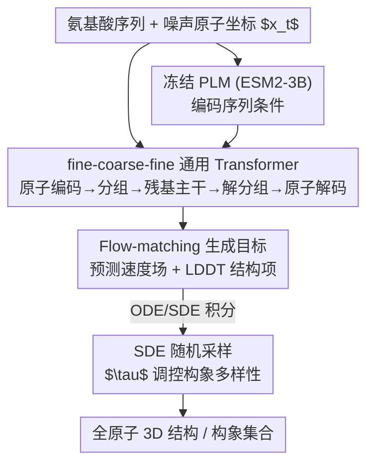

# SimpleFold: Folding Proteins is Simpler Than You Think

**会议**: ICLR 2026  
**OpenReview**: [https://openreview.net/forum?id=0j0MmK7EMA](https://openreview.net/forum?id=0j0MmK7EMA)  
**代码**: 无  
**领域**: 计算生物学 / 蛋白质折叠 / 生成式建模  
**关键词**: 蛋白质折叠, Flow Matching, 通用 Transformer, 生成式模型, 构象集合

## 一句话总结
SimpleFold 把蛋白质折叠当成「氨基酸序列→全原子 3D 结构」的条件生成任务，仅用标准 Transformer 块 + flow-matching 目标训练，彻底丢掉 AlphaFold2 那套 MSA、配对表示、三角更新和等变模块，在 9M 蒸馏结构上把模型规模拉到 3B，在标准折叠基准上逼近 SOTA，并在构象集合生成上表现尤其突出。

## 研究背景与动机
**领域现状**：蛋白质折叠是从氨基酸序列预测三维原子结构的经典难题。AlphaFold2、RoseTTAFold 之所以能取得突破，靠的是一整套针对折叠任务精心设计的「领域专用」架构——多序列比对（MSA）提取进化信息、显式的配对表示（pair representation）、以及计算极贵的三角更新（triangle update / triangle attention）。这些模块把人类对蛋白质生成过程的先验"硬编码"进了网络。

**现有痛点**：这套领域专用架构有两个代价。其一是计算与工程复杂度极高，三角更新对序列长度是高阶复杂度，MSA 检索又慢又依赖同源序列——对缺少近源同源物的"孤儿蛋白"（orphan protein）反而吃亏。其二是早期折叠模型用确定性重建目标训练，只能吐出单一结构，难以刻画天然蛋白以"自由能极小值分布"形式存在的多构象本质，做不了 ensemble 预测。后续虽有把 AlphaFold 改成扩散/flow 的生成式工作，但它们依旧背着 pair representation、triangle update 这些昂贵组件。

**核心矛盾**：折叠领域默认"这些领域专用归纳偏置是高性能的必要条件"。但视觉、语言领域的生成模型已经证明，一个足够通用、足够大的架构能直接从数据里学到结构与对称性，不必把先验硬塞进网络。那么——折叠任务里这些复杂设计真的是必需的吗？

**本文目标**：构建一个**不依赖** MSA、配对表示、三角更新、等变模块的折叠模型，验证纯通用架构 + 规模化能否打到有竞争力的性能。

**切入角度**：把折叠类比成"文生图"——氨基酸序列扮演 text prompt 的角色，模型输出全原子 3D 坐标。既然 DiT 式 flow-matching 在视觉生成上很成功，就直接搬一套标准 Transformer + flow matching 来做折叠。

**核心 idea**：用"通用 Transformer + flow-matching 生成目标 + 大规模蒸馏数据"取代领域专用架构来求解蛋白质折叠，让模型自己从数据里学结构生成的规律。

## 方法详解

### 整体框架
SimpleFold 把折叠定义为一个条件 flow-matching 生成过程：从高斯噪声出发，以氨基酸序列为条件，沿学到的速度场积分 ODE/SDE，直接生成包含主链和侧链的全原子 3D 坐标。整个网络只由"带自适应层的标准 Transformer 块"堆成，没有任何配对表示或三角更新。

架构上是三段式的"fine-coarse-fine"流水线：轻量**原子编码器**先在原子粒度处理带噪坐标（用局部注意力只看邻近残基的原子），**分组**操作把同一残基内的原子 token 平均池化成残基 token，送入承载绝大部分参数的**残基主干**（在这里拼接冻结 PLM 给出的序列条件），再由**解分组**把残基 token 广播回原子并接残差，最后轻量**原子解码器**输出预测速度场。三个模块共用同一种通用构建块。

### 关键设计

**1. 把折叠重铸为 flow-matching 条件生成：用速度场回归替代确定性重建**

针对"确定性重建只能输出单一结构、难以建模构象分布"的痛点，SimpleFold 走 rectified flow（线性插值）路线。给定数据样本 $x \sim p_D$ 和噪声 $\epsilon \sim \mathcal{N}(0, I)$，构造插值 $x_t = tx + (1-t)\epsilon$，目标速度为 $v_t = x - \epsilon$，网络 $v_\theta(x_t, s, t)$ 以氨基酸序列 $s$ 为条件学习这个速度场，核心损失是

$$\ell_{\text{FM}} = \mathbb{E}_{x,s,\epsilon,t}\left[\tfrac{1}{N_a}\lVert v_\theta(x_t, s, t) - (x-\epsilon)\rVert^2\right]$$

其中 $N_a$ 是重原子数，坐标 $x, \epsilon \in \mathbb{R}^{N_a \times 3}$ 覆盖全原子（主链+侧链），而非以往只建模 $C_\alpha$ 主链。光有 flow 损失结构细节不够锐，于是额外加一个 LDDT 损失：把当前 $x_t$ 用一步 Euler 估出干净结构 $\hat{x}(x_t) = x_t + (1-t)v_\theta(x_t, s, t)$，再约束预测与真值之间的原子对距离误差 $\sigma(\lVert\delta_{ij} - \hat{\delta}_{ij}^t\rVert)$（只统计 cutoff $C$ 内的邻近原子）。总损失 $\ell = \ell_{\text{FM}} + \alpha(t)\ell_{\text{LDDT}}$。

此外它做了**反常的 timestep 重采样**：$p(t) = 0.98\,\text{LN}(0.8, 1.7) + 0.02\,\mathcal{U}(0, 1)$，与图像生成把权重压在中段（$t\approx0.5$）不同，这里把采样权重推向**接近干净数据**的一端（$t\to1$）。动机很具体：蛋白结构有"二级结构→$C_\alpha$ 主链→侧链"的由粗到精强层级，在靠近数据流形处过采样能逼模型学好侧链这类精细原子位置。

**2. fine-coarse-fine 的纯通用 Transformer 架构：用局部注意力 + 分组/解分组吃掉蛋白层级，省掉所有等变与配对模块**

针对"领域专用架构（MSA/配对表示/三角更新/等变层）又贵又复杂"的痛点，SimpleFold 把整个网络换成带自适应层（adaptive layer，按时间步 $t$ 调制 scale/shift，类似 DiT）的标准 Transformer，三个模块共享同一种构建块。原子编码器和解码器对称且轻量，并施加**局部注意力掩码**——原子 token 只关注邻近残基的原子，控制原子级注意力的开销；中间的残基主干承载绝大多数参数与算力。分组（同残基原子平均池化成残基 token）和解分组（残基 token 按氨基酸类型广播回各原子、并从编码器接 skip 连接区分同残基内不同原子）天然把蛋白的"原子-残基"层级编进了流程，实现"细-粗-细"的精度-效率平衡。

关键在于：它**只保留单序列表示**，不维护任何 pair representation，因此根本不需要三角更新，效率远高于 ESMFold/AlphaFold2；而且全程是**非等变**的标准 Transformer，靠数据规模让模型自己学到结构对称性，而不是用等变模块硬保证。这直接挑战了"折叠必须等变、必须配对表示"的成见。

**3. 大规模蒸馏数据 + 模型规模化：把折叠做成一个真正受益于 scaling 的问题**

通用架构的好处只有在规模上才兑现，所以数据和参数两头都往大里做。数据混合三类来源：约 160K 条 PDB 实验结构（沿用 ESMFold 的 2020-05 cutoff）、从 AFDB SwissProt 蒸馏并按 pLDDT 过滤（均值>85、标准差<15）得到的约 270K 条、以及 AFESM 聚类代表结构过滤后的 1.9M+ 条，合计约 2M。为训练最大的 3B 模型，进一步把 AFESM 扩展成 AFESM-E——对每个聚类最多随机取 10 条 pLDDT>80 的结构，得到 8.6M 蒸馏结构，连同 PDB、SwissProt 一起训练。模型从 100M 一路 scale 到 3B（100M/360M/700M/1.1B/1.6B/3B 一整个家族），训练分预训练（尽量多数据）+ 微调（高质量数据提保真度）两阶段。实验显示无论加训练算力、训练步数还是数据量，性能都稳步上升——这是折叠领域第一次被严格验证的良性 scaling 行为。

**4. Langevin 式 SDE 随机采样：用一个温度旋钮在"折叠精度"和"构象多样性"之间切换**

推理时从噪声 $x_0 \sim \mathcal{N}(0, I)$ 积分到 $t=1$。SimpleFold 不止用确定性 ODE，而是借助速度场 $v_\theta$ 与 score $s_\theta = (tv_\theta - x_t)/(1-t)$ 的等价关系，用 Euler–Maruyama 积分一个 Langevin 式 SDE：

$$dx_t = v_\theta\, dt + \tfrac{1}{2}w(t)s_\theta\, dt + \sqrt{\tau \cdot w(t)}\, d\bar{W}_t$$

其中扩散系数取 $w(t) = \tfrac{2(1-t)}{t+\eta}$（跟随 flow 过程的信噪比，$\eta$ 防数值不稳），$\tau$ 控制随机性强度。这个 $\tau$ 是个直观的旋钮：折叠任务要单一精确结构就调小（实验取 $\tau=0.01$），要生成多样构象集合就调大（MD ensemble 取 $\tau=0.6$）。同一个生成模型因此既能做精确折叠、又能做 ensemble 预测，而这正是确定性重建模型做不到的。

### 损失函数 / 训练策略
总损失为 flow-matching 项加权 LDDT 项 $\ell = \ell_{\text{FM}} + \alpha(t)\ell_{\text{LDDT}}$，$\alpha(t)$ 随时间步与训练阶段变化。训练分两阶段：预训练用尽量大的混合数据，微调用高质量数据提升生成保真度。timestep 按 $p(t)=0.98\,\text{LN}(0.8,1.7)+0.02\,\mathcal{U}(0,1)$ 重采样，偏向干净数据端以学好侧链细节。

## 实验关键数据

### 主实验（折叠基准）
在 CAMEO22 与 CASP14 上对比，按序列编码方式（MSA / PLM）和训练目标（回归 / 生成式）分组。SimpleFold 是 PLM-based 生成式且无 MSA。

| 基准 | 模型 | TM-score ↑ | GDT-TS ↑ | RMSD ↓ |
|------|------|-----------|----------|--------|
| CAMEO22 | AlphaFold2 (MSA, 回归) | 0.863 / 0.942 | 0.844 / 0.903 | 3.578 / 1.857 |
| CAMEO22 | ESMFold (PLM, 回归) | 0.853 / 0.933 | 0.826 / 0.875 | 3.973 / 2.019 |
| CAMEO22 | ESMFlow (PLM, 生成) | 0.818 / 0.893 | 0.774 / 0.832 | 4.528 / 2.693 |
| CAMEO22 | **SimpleFold-3B** | 0.837 / 0.916 | 0.802 / 0.867 | 4.225 / 2.175 |
| CASP14 | ESMFold (PLM, 回归) | 0.701 / 0.792 | 0.622 / 0.711 | 8.679 / 4.016 |
| CASP14 | ESMFlow (PLM, 生成) | 0.627 / 0.679 | 0.539 / 0.544 | 10.503 / 6.974 |
| CASP14 | **SimpleFold-3B** | 0.720 / 0.792 | 0.639 / 0.703 | 7.732 / 3.923 |

SimpleFold-3B 在 CAMEO22 上拿到 RoseTTAFold2/AlphaFold2 95%+ 的性能，却完全不用三角注意力和 MSA；在更难的 CASP14 上甚至超过同为 PLM 的 ESMFold，并稳定优于同为 flow-matching + ESM 的 ESMFlow。

### 构象集合生成（MD ensemble，ATLAS）
推理调大 $\tau=0.6$ 增加随机性。在不额外微调 MD 数据的设定下，SimpleFold 大幅领先：

| 指标 | AF2 | MSA-sub. | SimpleFold | ESMFlow-MD(调过) | AlphaFlow-MD(调过) |
|------|-----|----------|-----------|------------------|--------------------|
| Pairwise RMSD r ↑ | 0.10 | 0.22 | **0.44** | 0.19 | 0.48 |
| Global RMSF r ↑ | 0.21 | 0.29 | **0.45** | 0.31 | 0.60 |
| MD PCA W2 ↓ | 1.99 | 2.23 | **1.62** | 1.51 | 1.52 |
| Exposed MI matrix ρ ↑ | 0.02 | 0.10 | **0.14** | 0.20 | 0.25 |

未调优的 SimpleFold 在多项 ensemble 指标上已超过 AF2 和 MSA-subsampling，逼近甚至接近经过 MD 微调的 ESMFlow-MD。

### 关键发现
- **规模化在难任务上收益更大**：模型从 100M 放大到 3B，性能全面提升，且在更难的 CASP14 上的提升幅度明显大于 CAMEO22——大容量模型更擅长复杂折叠。SimpleFold-100M 已能恢复最佳模型约 90% 的性能，且在 M2 Max Macbook 这类消费级硬件上推理高效。
- **数据 scaling 同样有效**：用 700M 模型在不同数据源上训练，数据混合中独特结构越多、充分训练后最终性能越好，支撑了"简化+可扩展折叠模型受益于数据增长"的核心主张。
- **生成式目标是 ensemble 能力的根**：确定性重建模型（如 AF2）在 Pairwise RMSD r 仅 0.10，而生成式的 SimpleFold 达 0.44，差距正来自训练目标本身。
- **两态构象预测达 SOTA**：在 Apo/holo 上 SimpleFold 显著超过 MSA-based 的 AlphaFlow，Fold-switch 上与 ESMFlow 相当或更好，且性能随模型增大持续上升。

## 亮点与洞察
- **"减法"做出的贡献**：论文最"啊哈"的地方是它通过**移除**领域专用模块（MSA/pair rep/triangle/等变层）反而证明了一件正面的事——这些复杂设计不是高性能的必要条件，通用架构 + 规模化就能顶上。这是对折叠领域既有信条的直接反驳。
- **"文生图"类比落地**：把氨基酸序列当 text prompt、把折叠当条件生成，让视觉/语言领域成熟的 DiT + flow-matching 工具链几乎原样迁移过来，这个映射本身就极具迁移价值。
- **一个 $\tau$ 旋钮统一两类任务**：同一个生成模型靠调随机性强度 $\tau$，小则做精确折叠、大则做构象集合，优雅地把"单结构预测"和"ensemble 预测"统一在一个框架里。
- **timestep 重采样的反直觉调参**：偏向干净数据端采样以学好侧链，是结合蛋白"由粗到精层级"做出的具体洞察，可迁移到其他有强层级结构的生成任务。

## 局限与展望
- **无 MSA 在 CAMEO22 上仍略逊顶级 MSA 模型**：SimpleFold-3B 的 TM/GDT 仍低于 AlphaFold2/RoseTTAFold2，说明在有充足同源信息时，进化先验依然有价值；本文的优势更多体现在效率、孤儿蛋白和 ensemble 上。
- **3B 仍未触顶**：scaling 曲线尚未饱和，更大模型/更多数据可能继续涨点，但训练成本（9M 结构 + 3B 参数）已相当可观，复现门槛高。
- **依赖大规模蒸馏数据**：约 2M~8.6M 训练样本里绝大多数是 AFDB 蒸馏结构（本身由 AlphaFold 预测），其质量上限与偏差会传导到 SimpleFold，存在"向蒸馏来源看齐"的隐忧。
- **非等变靠数据补**：放弃等变模块意味着对称性完全靠数据学，在数据稀疏区域是否仍稳健、对长蛋白/复合物的外推能力如何，文中验证有限。

## 相关工作与启发
- **vs AlphaFold2 / ESMFold**：它们靠 MSA 或 PLM 初始化 pair representation 并做三角更新/等变运算；SimpleFold 只保留单序列表示、无三角更新、非等变，用 flow-matching 生成式目标取代确定性回归，换来 ensemble 能力与更低的架构复杂度。
- **vs AlphaFlow / ESMFlow**：二者是在 AlphaFold2/ESMFold 上微调 flow-matching，仍背着 AF2 的昂贵组件；SimpleFold 从零用纯 Transformer 端到端训练，且全面优于同为 ESM-based flow 的 ESMFlow。
- **vs Proteina**：Proteina 也想简化架构，但仍显式用 pair representation 且只建模 $C_\alpha$；SimpleFold 彻底不用配对表示、直接生成全原子结构。
- **vs AlphaFold3 / Boltz-1 等扩散复现**：它们用扩散建生成式模型但保留 AF 系的领域专用模块；SimpleFold 的差异是把"领域先验硬编码"换成"通用架构 + 规模化从数据学"。

## 评分
- 新颖性: ⭐⭐⭐⭐⭐ 首个纯通用 Transformer + flow-matching 的折叠模型，正面反驳"领域专用架构必要"的信条
- 实验充分度: ⭐⭐⭐⭐⭐ 100M–3B 完整 scaling 家族 + 折叠/MD ensemble/两态构象多基准，数据扎实
- 写作质量: ⭐⭐⭐⭐ 类比清晰、动机鲜明，方法表述完整但部分实现细节压在附录
- 价值: ⭐⭐⭐⭐⭐ 为折叠开辟"简化+规模化"的新设计空间，工程与思想价值兼具

<!-- RELATED:START -->

## 相关论文

- [\[ICLR 2026\] One Protein Is All You Need](one_protein_is_all_you_need.md)
- [\[ICLR 2026\] Greater than the Sum of Its Parts: Building Substructure into Protein Encoding Models](greater_than_the_sum_of_its_parts_building_substructure_into_protein_encoding_mo.md)
- [\[ICLR 2026\] Property-Driven Protein Inverse Folding with Multi-Objective Preference Alignment](property-driven_protein_inverse_folding_with_multi-objective_preference_alignmen.md)
- [\[ICLR 2026\] VenusX: Unlocking Fine-Grained Functional Understanding of Proteins](venusx_unlocking_fine-grained_functional_understanding_of_proteins.md)
- [\[ICLR 2026\] A Diffusion Model to Shrink Proteins While Maintaining Their Function](a_diffusion_model_to_shrink_proteins_while_maintaining_their_function.md)

<!-- RELATED:END -->
