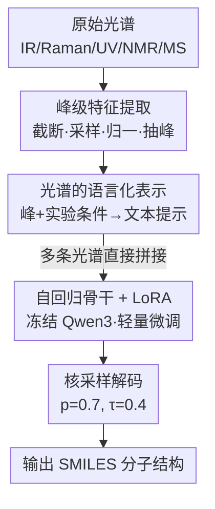

# SpectraLLM: Uncovering the Ability of LLMs for Molecular Structure Elucidation from Multi-Spectral Data

**会议**: ICLR 2026  
**OpenReview**: [https://openreview.net/forum?id=J5XUzUW8o3](https://openreview.net/forum?id=J5XUzUW8o3)  
**代码**: https://github.com/OPilgrim/SpectraLLM  
**领域**: 计算生物 / AI for Science / LLM 推理  
**关键词**: 分子结构解析, 多光谱, 大语言模型, LoRA, SMILES 生成

## 一句话总结
SpectraLLM 把 IR / Raman / UV-Vis / NMR / MS 等异构光谱统一翻译成自然语言提示，喂给一个 LoRA 微调的 Qwen3，让它端到端地自回归生成分子的 SMILES 结构；在四个公开基准上全面超越各单模态专用 baseline，并且越多光谱联合输入、预测越准。

## 研究背景与动机
**领域现状**：分子结构解析（structure elucidation）是化学、生物、材料科学的基础工作——给定一堆光谱信号，反推出分子到底长什么样。专家手里有 IR（红外振动）、Raman（拉曼散射）、UV-Vis（电子跃迁）、NMR（核磁，含 1H/13C/HSQC）、MS（质谱）这一套互补工具，人类专家做结构鉴定时本来就是把多种光谱**联合**起来读，互相印证消除歧义。

**现有痛点**：机器学习自动化这件事已经做了不少（Spec2Mol 用 CNN 编码 MS/MS、RNN 解 SMILES；后续 Transformer decoder；DiffMS 把逆质谱当条件分子生成），但绝大多数模型有两个硬伤：一是**绑死单一模态**，只吃 MS 或只吃 IR；二是**架构僵化**——光谱被当成固定数值特征喂进专用编码器，想再加一种模态、或加入实验条件/标注这类上下文信息，几乎得重新设计网络。

**核心矛盾**：单一光谱本身信息不全，不同结构可能在某一种光谱下长得很像（spectral ambiguity）；而要融合多模态，传统"数值特征 + 专用编码器"的范式天然不灵活，每种模态各编各的，难以在一个共享空间里做联合推理。

**本文目标**：构建一个统一架构，既能吃单条光谱、也能吃任意多条光谱组合，端到端直接吐出分子结构，且加新模态/加实验条件不用改架构。

**切入角度**：作者发现 LLM 天生就是处理异构符号信息的好底座——只要把光谱峰转写成描述其物理属性的**文本**，IR 的振动频率、NMR 的化学位移、MS 的碎片模式就都落进了同一个语义空间，可以靠语言模型的符号推理、上下文化、组合泛化能力做联合推理。作者也试过 VLM（视觉语言模型）直接读光谱图，但效果反而不如纯语言路线（疑似跨模态编码引入了伪影）。

**核心 idea**：把"光谱→结构"重铸成"光谱文本→SMILES 文本"的语言生成任务，用一个 LoRA 微调的冻结 LLM，在共享语言空间里统一所有光谱模态并自回归生成结构。

## 方法详解

### 整体框架
SpectraLLM 要解决的是：输入一组对应同一分子的光谱 $s=\{s_1,\dots,s_k\}$（每条来自 IR/Raman/UV/NMR/MS 中的某一模态），输出该分子的 SMILES 序列 $y=(y_1,\dots,y_T)$。整条流水线是"原始光谱 → 抽峰预处理 → 翻成自然语言提示 → 冻结 LLM + LoRA 自回归生成 SMILES"，全程没有任何模态专用编码器、手工规则或检索数据库，是纯端到端生成。

形式化地，任务被建模为自回归条件概率分解 $p_\theta(y|s)=\prod_{t=1}^{T} p_\theta(y_t|s,y_{<t})$，训练目标是参考 SMILES 的负对数似然（交叉熵）$L_{CE}=-\sum_i\sum_t \log p_\theta(y_t^{(i)}|s^{(i)},y_{<t}^{(i)})$。多条光谱通过映射函数 $\phi$ 各自转成文本后直接拼接：$x=\phi(s_1)\oplus\phi(s_2)\oplus\cdots\oplus\phi(s_k)$，所以"加一条光谱"对模型来说只是"提示里多接一段文字"，这正是它能灵活支持任意模态组合的关键。

### 关键设计

**1. 海量多模态语料构建与峰级预处理：把脏乱的原始光谱压成可读的特征**

要做联合光谱推理，前提是有一份足够大、且同一分子带多种光谱标注的语料。作者拼了四个互补来源：QM9s（约 13.4 万有机小分子的模拟 IR/Raman/UV-Vis，由 B3LYP/def2-TZVP 级别的频率分析和含时 DFT 算出）、Multimodal Spectroscopic 数据集（79 万+ 来自 USPTO 反应的分子，含模拟 IR/MS 和 1H/13C/HSQC NMR）、实验级的 MassSpecGym（2.9 万化合物的 23 万高分辨谱）和 MassBank（多种仪器条件下的 MS/MS）。合起来超过 550 万条光谱配 94 万+ 唯一分子，是目前端到端结构解析最大的语料之一。

光谱不能原样喂：IR/Raman 截到 $500\text{–}4000\,\mathrm{cm}^{-1}$ 均匀采样，UV-Vis 截到 $1.0\text{–}15.0\,\mathrm{eV}$、$0.02\,\mathrm{eV}$ 间隔，强度按最大值归一后用局部极大值 + prominence 阈值抽特征峰；NMR 裁到含显著峰的最小区间、丢掉低于最大强度 1% 的信号，HSQC 还保留 2D 的质子–碳关联和估计质子数；MS 把 m/z 四舍五入到两位小数、强度缩放到 $[0,100]$，并保留电离模式、碰撞能、仪器类型等元数据。所有光谱最终序列化成 JSON 风格的"峰+强度"结构数组，为下一步语言化打底。

**2. 光谱的语言化统一表示：用文本把连续谱和离散谱塞进同一个语义空间**

这是全文最核心的一步。映射函数 $\phi$ 把每条光谱的峰数组转成一段自然语言提示 $\phi(s_i)\in V^n$（$V$ 是词表），提示里**显式写明模态类型**并以文字报告显著峰，于是振动频率、化学位移、碎片模式被嵌进同一个语言空间。除了峰值，还把电离模式、碰撞能、溶剂、仪器类型这些实验条件一并写进提示，让模型能在不同采集条件下"语境化"地理解光谱——这正是传统数值编码器很难做到的。训练样本组织成指令-响应格式："Human"侧给出光谱描述和"推断结构"的指令，"GPT"侧给参考 SMILES。

这样设计的好处是把连续模态（IR/Raman/UV/NMR）和离散模态（MS）这两类天差地别的信号桥接到了一起：它们不再各有各的张量形状，而都是文本，多条光谱直接 $\oplus$ 拼接就能联合推理。这也解释了为什么"加模态/加条件"对 SpectraLLM 几乎零成本——只是改提示文字，不动架构。

**3. 冻结 LLM + LoRA 的参数高效微调：保住语言先验，只学光谱到结构的对齐**

骨干选 Qwen3（看中其可扩展性和强推理），但不全参微调，而是**冻结骨干权重**、在每层 Transformer 插入轻量可训练的低秩矩阵（LoRA）。优化目标就是 §2.1 的自回归交叉熵，只更新 LoRA 参数 $\theta$。这样做一方面保留了 LLM 的通用语言能力（光谱提示本质是文本，需要语言先验来"读"），另一方面在数百万对样本上把光谱模式高效对齐到化学有效、结构忠实的 SMILES 序列上，避免全量微调的高成本和灾难性遗忘。

**4. 端到端核采样解码：无编码器、无规则、无检索的纯生成推理**

推理时把一条或多条光谱预处理→转文本提示→喂进微调后的模型，自回归生成候选 SMILES $\hat y=\arg\max_y p_\theta(y|x)$。具体用核采样（nucleus sampling，阈值 $p=0.7$）配温度缩放 $\tau$ 来平衡确定性与多样性，作者实验发现中等温度 $\tau=0.4$ 在结构准确率和输出多样性之间最优。整个过程不引入任何模态专用编码器、手工规则或检索组件，保证完全端到端——这与依赖光谱数据库匹配候选结构的传统范式形成鲜明对比。

### 损失函数 / 训练策略
统一用自回归交叉熵（公式 2）做监督：最大化每个 token $y_t$ 在给定光谱提示 $x$ 和前缀 $y_{<t}$ 下的条件似然。训练语料混合了单光谱和多光谱输入，但在测试时刻意限制提示为"纯单谱"或"纯多谱"，以隔离评估每种光谱融合策略的贡献。

## 实验关键数据

### 主实验
四个公开基准（QM9s、Multimodal Spectroscopic、MassSpecGym、MassBank），指标含 validity、Tanimoto（ECFP4/MACCS 指纹）、cosine、MCES（最大公共边子结构，越低越好）、官能团回收率、Fraggle 相似度。单模态下对比各专用 baseline：

| 数据集/模态 | 方法 | Validity↑ | Tanimoto↑ | Cosine↑ | MCES↓ | 官能团↑ |
|------|------|------|------|------|------|------|
| QM9s / IR | Spectra2Structure | 100% | 0.0965 | 0.1695 | 10.11 | 0.4383 |
| QM9s / IR | **SpectraLLM** | 99.82% | **0.1921** | **0.3120** | **7.57** | **0.6599** |
| QM9s / Raman | Spectra2Structure | 100% | 0.1089 | 0.1901 | 9.42 | 0.4419 |
| QM9s / Raman | **SpectraLLM** | 99.08% | **0.2500** | **0.3786** | **6.41** | **0.7317** |
| Multimodal / NMR | NMR2Struct | 47.62% | 0.0433 | 0.1029 | 30.69 | 0.1718 |
| Multimodal / NMR | **SpectraLLM** | **98.92%** | **0.4151** | **0.5322** | **8.31** | **0.7209** |

质谱单模态对比（Table 3）：MassSpecGym 上 SpectraLLM validity 99.74%、cosine 0.2558、官能团 0.5003 均最优，Tanimoto 0.1533 与 Diffms（0.1597）相当；MassBank 上 Diffms validity 仅 23.63%、SpectraLLM 高达 98.44% 且各相似度全面领先。NMR 域提升最夸张——MCES 从 30.69 直降到 8.31，validity 从 47.62% 拉到 ~99%，彻底消除了传统架构的解码不稳定。

### 消融实验
多光谱融合（Table 4），同一模型测试时给不同输入组合：

| 输入组合 | Tanimoto↑ | Cosine↑ | MCES↓ | 官能团↑ | Fraggle↑ |
|------|------|------|------|------|------|
| QM9s / Raman 单谱 | 0.2500 | 0.3786 | 6.41 | 0.7317 | 0.2500 |
| QM9s / IR+Raman+UV-Vis 联合 | **0.3355** | **0.4560** | **4.96** | **0.7934** | **0.4117** |
| Multimodal / NMR 联合(1H+13C+HSQC) | 0.4151 | 0.5322 | 8.31 | 0.7209 | 0.5862 |
| Multimodal / NMR+IR | 0.4121 | 0.5341 | 8.39 | 0.7764 | 0.5809 |
| Multimodal / NMR+MS | 0.4518 | 0.5601 | 8.17 | 0.7618 | 0.6063 |
| Multimodal / NMR+IR+MS | **0.4875** | **0.5973** | **8.12** | **0.8103** | **0.6222** |

### 关键发现
- **光谱越多越准，且单调提升**：QM9s 上 IR+Raman+UV-Vis 联合把 Tanimoto 从 0.2500（Raman 单谱）提到 0.3355、MCES 从 10+ 降到 4.96；Multimodal 上 NMR+IR+MS 三谱联合官能团回收率达 0.8103。融合收益不只是"信号叠加"，更在于模型学到了一个捕捉光谱不变结构线索的共享潜空间。
- **跨域泛化更强**：附录 A.9 显示，多光谱训练的模型在没见过的单光谱条件下泛化得比反过来更好，说明融合表示是更具表达力的结构先验。
- **互补性有明确分工**（Fig. 2 案例）：Raman 对极化率敏感，能纠正 IR/UV-Vis 在杂芳环（如咪唑环 COCc1cc[nH]c1）上的误判；IR 则在羰基定位和支链构型上不可或缺（如 CC(C)(C)C(=O)C 只有加 IR 才确定）。单谱都不够，唯有联合才能压缩歧义。
- **温度敏感**：解码温度 $\tau=0.4$ 在准确率和多样性间最优。

## 亮点与洞察
- **把异构光谱"翻译"成语言**是真正巧妙的一招：连续谱与离散谱本来张量形状都不一样，转成文本后天然落进同一语义空间，多模态融合退化成"提示拼接"，加模态零架构成本——这是可迁移到任何"异构信号→符号输出"任务的范式。
- **VLM 反而不如纯语言**这个负结果很有价值：直接读光谱图像引入跨模态编码伪影，说明在这类问题上"先抽峰再语言化"比端到端视觉编码更干净。
- **LoRA + 冻结骨干**让 LLM 的语言先验得以复用——因为光谱提示本质是要"读懂的文本"，保留通用语言能力反而是性能来源而非负担。

## 局限与展望
- 作者承认（附录 A.13 bad cases）性能上限受**光谱内禀歧义**约束：结构不同但光谱相似的分子，即使多谱融合也难区分，这是根本性挑战。
- 案例分析（Fig. 2）只展示了成功例子，对失败模式的系统刻画放在附录，正文呈现略有"报喜"倾向。
- 相似度指标（Tanimoto 等）整体绝对值仍不高（多数 < 0.5），离"精确重构"还有距离；大量训练数据是模拟光谱（QM9s/Multimodal），与真实实验谱的分布差异对落地泛化的影响值得进一步验证。
- 可改进方向：引入显式的化学约束/价键合法性解码、用检索增强补充数据库知识（虽然本文刻意不用检索以保持端到端，但混合范式或能进一步压低歧义）。

## 相关工作与启发
- **vs Spec2Mol / IR-to-Structure / NMR2Struct（单模态专用管线）**：它们各自用 CNN/Transformer 编码单一模态、把光谱当固定数值特征，本文把所有模态统一语言化、用一个 LLM 联合推理；优势是灵活支持任意模态组合且 validity 近 99%，劣势是依赖大语料和 LLM 算力。
- **vs DiffMS（扩散式逆质谱生成）**：DiffMS 把逆质谱当条件分子生成，提升多样性与可合成性，但仍局限于 MS 单模态；SpectraLLM 跨五种模态统一，且在 MS 域多数相似度指标上反超。
- **vs VLM 直读光谱图**：作者实测 VLM 不如纯语言路线，归因于跨模态编码伪影——印证"峰级语言化"在该任务上的优越性。

## 评分
- 新颖性: ⭐⭐⭐⭐⭐ 用"光谱→语言"统一异构模态、把多模态融合化为提示拼接，范式新颖
- 实验充分度: ⭐⭐⭐⭐ 四基准、五模态、多组合消融充分，但绝对相似度偏低、真实谱验证可再强化
- 写作质量: ⭐⭐⭐⭐ 动机清晰、案例直观，正文略偏报喜
- 价值: ⭐⭐⭐⭐⭐ 为 AI for Science 的结构解析提供了可扩展的语言化新范式

<!-- RELATED:START -->

## 相关论文

- [\[ICLR 2026\] Hierarchical Multi-Scale Molecular Conformer Generation](hierarchical_multi-scale_molecular_conformer_generation.md)
- [\[ICLR 2026\] Towards Knowledge-and-Data-Driven Organic Reaction Prediction: RAG-Enhanced and Reasoning-Powered Hybrid System with LLMs](towards_knowledgeanddatadriven_organic_reaction_prediction_ragenhanced_and_reaso.md)
- [\[NeurIPS 2025\] Atomic Diffusion Models for Small Molecule Structure Elucidation from NMR Spectra](../../NeurIPS2025/computational_biology/atomic_diffusion_models_for_small_molecule_structure_elucidation_from_nmr_spectr.md)
- [\[ICLR 2026\] Controllable Diffusion-based Generation for Multi-channel Biological Data](controllable_diffusion-based_generation_for_multi-channel_biological_data.md)
- [\[ICLR 2026\] MolEditRL: Structure-Preserving Molecular Editing via Discrete Diffusion and Reinforcement Learning](moleditrl_structure-preserving_molecular_editing_via_discrete_diffusion_and_rein.md)

<!-- RELATED:END -->
