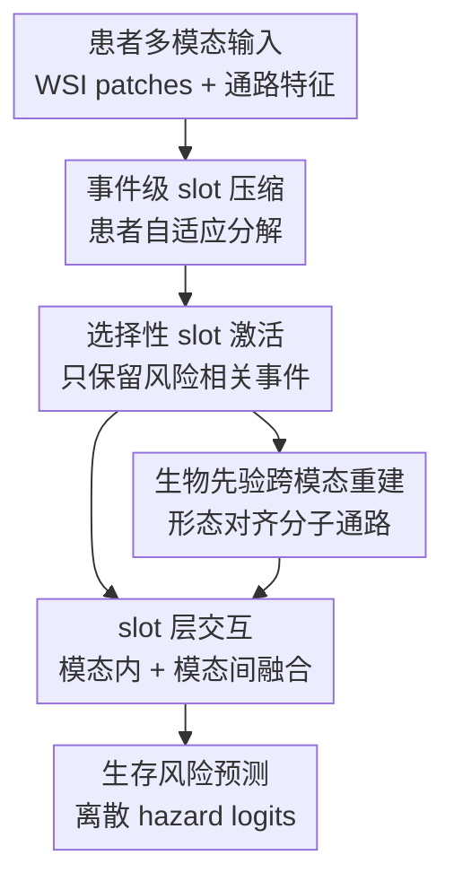

# Structural Prognostic Event Modeling for Multimodal Cancer Survival Analysis

**会议**: ICLR 2026  
**OpenReview**: [https://openreview.net/forum?id=WqCRSn2WAY](https://openreview.net/forum?id=WqCRSn2WAY)  
**论文**: [OpenReview](https://openreview.net/forum?id=WqCRSn2WAY)  
**代码**: https://github.com/zylvemvet/SlotSPE  
**领域**: 计算生物学 / 多模态癌症预后  
**关键词**: 癌症生存分析, 多模态学习, 病理组学融合, Slot Attention, 结构化预后事件  

## 一句话总结
SlotSPE 将病理 WSI 与转录组通路特征压缩成患者自适应的少量 prognostic event slots，再用选择性激活、跨模态重建和迭代 slot 交互完成生存风险预测，在 10 个 TCGA 癌种上取得平均 C-index 0.721，并在基因组缺失时仍保持 0.704 的整体表现。

## 研究背景与动机
**领域现状**：癌症生存分析希望从患者数据中预测死亡风险或生存时间，是精准肿瘤学里很实用的一类任务。病理全切片图像（WSI）能看到组织形态、肿瘤区域、免疫细胞浸润等空间结构，转录组或通路级基因表达能反映分子驱动因素；近几年很多方法因此把 WSI 与组学数据做多模态融合，用 MIL、Transformer、co-attention 或原型表示来建模患者风险。

**现有痛点**：这类数据的规模和语义层级很不匹配。一个 WSI 可以包含大量 patch，基因表达又涉及成千上万个基因或数百个通路，如果直接在 patch-token 与 pathway-token 之间做全量自注意力和跨模态注意力，复杂度接近 $O((M_h+M_g)^2)$，其中 $M_h$ 是 WSI patch 数、$M_g$ 是通路数。更棘手的是，真正影响预后的往往不是所有 patch 和所有基因，而是少量稀疏的、高层结构化事件，比如肿瘤巢与淋巴细胞的空间邻近、某些癌症通路的共激活、分子异常在组织形态上的表现。

**核心矛盾**：输入是极高维、冗余、患者差异很大的观测信号，但标签只有患者级生存结局；模型既要从海量 patch 和通路中抽出少数关键事件，又不能把事件固定成全体患者共享的一组静态原型。PIBD、MMP 这类原型方法试图压缩表示，但原型在训练后相对固定，难以对每个患者动态实例化稀疏事件，也容易丢掉病理形态与分子通路之间的个体化对应关系。

**本文目标**：作者希望构建一个更像“预后事件分解器”的多模态生存预测框架：第一，把 WSI 和组学输入各自压缩成少量可解释的事件表示；第二，让每个患者只激活真正与风险相关的 slots，避免所有 slots 都混在一起；第三，用病理形态可反映分子事件这一生物学先验，把组学 slot 与 WSI patch 对齐；第四，在多模态都存在和组学缺失两种临床场景下都能稳定预测。

**切入角度**：论文把这个问题类比为 factorial coding：复杂观测可以由少量潜在因素组合生成。Slot attention 原本常用于 object-centric representation learning，适合从一组输入 token 中竞争性地抽取有限个 latent slots。作者将每个 slot 解释成一个潜在 structural prognostic event，让 slots 不再只是压缩 token 的中间变量，而是直接承担“事件级”表示、选择和跨模态对齐的角色。

**核心 idea**：用患者自适应的 slot attention 代替固定原型，把 WSI 与基因通路压缩成少量结构化预后事件，再通过选择性 slot 激活和生物学先验驱动的跨模态重建，让这些事件既能预测生存风险，也能解释形态与分子之间的对应关系。

## 方法详解

### 整体框架
SlotSPE 的输入是一名患者的两类 bag 表示：病理 WSI patch 特征 $X_h \in \mathbb{R}^{M_h \times d}$ 和通路级组学特征 $X_g \in \mathbb{R}^{M_g \times d}$。模型先分别用 slot attention 将两个大 bag 压缩为少量 histology slots 与 genomic slots，再用 MoE 风格的选择性激活让每个患者只保留最有预后价值的一部分 slots；训练时还加入 slot 重建和跨模态重建，使 slots 既不塌缩为空，也能学习“病理形态可预测分子通路”的结构先验。最后，模型在 slot 层面做模态内自注意力与模态间迭代 cross-attention，拼接得到患者表示并输出离散时间区间上的风险 logits。

整体计算上的关键变化是：模型不再直接在 $M_h+M_g$ 个原始 token 上做重交互，而是先压缩成 $S_h$ 个病理 slots 和 $S_g$ 个组学 slots。slot attention 与跨模态重建的主复杂度约为 $O(S_gM_g + S_hM_h + S_gM_h)$，slot 交互复杂度为 $O((S_g+S_h)^2)$；由于 $S_h,S_g \ll M_h,M_g$，实际比原始 token 级 Transformer 更适合大规模 WSI 场景。

### 关键设计
**1. 事件级 slot 压缩：把高维病理组学观测拆成患者自适应的预后事件**

SlotSPE 首先分别处理 WSI patch bag 和通路 bag。对任一模态输入 $X \in \mathbb{R}^{M \times d}$，模型初始化 $S$ 个可学习 slots $S^{(0)} \in \mathbb{R}^{S \times d_{slot}}$，然后迭代执行基于 cross-attention 的路由：输入 token 通过 key/value 投影，slots 通过 query 投影，每个输入 token 在 slots 维度上做 softmax，因此同一个 token 会被不同 slots 竞争性解释。第 $\tau$ 次迭代中，slot $k$ 接收所有输入 token 的加权汇聚 $u_k^{(\tau)}$，再经过 RNN 更新和 MLP refinement 得到 $s_k^{(\tau+1)}$。

这个设计解决的是“预后事件稀疏但未标注”的问题。直接让 Transformer 在所有 patch 与通路间交互，很容易把大量背景、冗余组织区域和非关键通路都混入患者表示；固定原型又假设所有患者共享同一套抽象模板。slot attention 的竞争路由让 slots 在单个患者内部动态分工：某些 slots 可能聚焦肿瘤区域，某些 slots 对应免疫或间质相关形态，组学 slots 则可对应通路共激活模式。这样得到的是患者级实例化的事件集合，而不是全局静态原型。

**2. 选择性 slot 激活：用可微 Top-K 门控让风险预测只依赖少数关键事件**

仅有 slots 还不够，因为每个患者并不是所有潜在事件都与预后有关。如果所有 slots 都直接平均或拼接，模型仍可能被弱相关甚至噪声 slots 稀释。SlotSPE 把每个 slot 看作一个 expert：先用 MLP 为每个 slot 产生一组风险 logits $\ell_k \in \mathbb{R}^{N_t}$，再用轻量 gating function $\phi$ 为 slot $s_k$ 预测保留分数 $r_k=\phi(s_k)$。随后，模型通过 Gumbel-Top-K 加 Straight-Through estimator 得到可微的 $K$-hot mask $\hat{G}$，只保留当前患者最重要的 $K$ 个 slots。

被选中的 slots 会按 softmax 权重重新归一化：$w_k = \tilde{w}_k\hat{G}_k / \sum_s \tilde{w}_s\hat{G}_s$，其中 $\tilde{w}=softmax(r)$。最终患者级单模态预测为 $y=\sum_{k=1}^{S} w_k\ell_k$。这一步的好处是把生存监督直接压到“选择哪些事件”上：门控不是为了稀疏而稀疏，而是在 NLL survival loss 下学习哪些 slots 真正能区分风险。论文还发现 top-K 过小会让部分 slots 很少被训练，过大会激活不够判别的 slots；主设置选总 slots 的 25%，也与四个离散风险区间的设计相呼应。

**3. 生物先验跨模态重建：让病理形态学会预测通路级分子事件**

SlotSPE 的跨模态对齐不是简单把 WSI token 与 pathway token 做 co-attention，而是引入一个更具体的生物学约束：分子事件会在组织形态上留下表型痕迹，因此可以要求“组学来源的 slots”从 WSI patch 中恢复通路特征。具体做法是使用从训练组学数据学到的 omics-derived initialization slots $S_g$，让它们对病理 patch 特征 $X_h$ 执行 slot attention，得到 $\tilde{S}_{g\to h}$，即在 WSI 形态中寻找与组学事件对应的 slots。随后，Transformer decoder 接收通路位置嵌入 $Q_g$ 和 $\tilde{S}_{g\to h}$，重建原始通路特征 $\tilde{X}_g$，并用 MSE 约束 $\lVert \tilde{X}_g-X_g\rVert_2^2$。

这个重建任务有两层意义。第一，它强迫模型在 event level 学到 molecular-morphology mapping，而不是只在最后分类头里把两种模态拼起来；如果某个通路模式真的能从组织形态中被推断出来，它对应的 slot 就更可能具有生物解释性。第二，它自然支持缺失组学推理：临床上获取转录组比获取 H&E 病理切片成本更高，测试时可能只有 WSI。此时跨模态重建头可以从病理图像补全通路级表示，再参与风险预测。实验中 SlotSPE 在缺失基因组时整体 C-index 仍有 0.704，高于 full-modality LD-CVAE 的 0.692。

**4. slot 层交互与重建正则：在小集合上建模模态内外依赖，同时避免空 slots**

模型在 slot 层面处理两类交互。模态内部分使用 masked self-attention，只对每个模态中 top-K 自预测 slots 建模，使同一模态内部的多个预后事件可以互相补充；模态间部分则使用所有 slots 做迭代双向 cross-attention，病理 slots 查询组学 slots，组学 slots 也查询病理 slots，并通过 RNN 式更新多轮吸收互补信息。最后将跨模态交互后的 slots、病理自注意力输出、组学自注意力输出分别池化并拼接为 $z=[Pool(\hat{S}_h\Vert\hat{S}_g)\Vert Pool(\bar{S}_h)\Vert Pool(\bar{S}_g)]$，再由预测头输出离散时间风险。

选择性激活会带来一个副作用：某些 slots 可能逐渐变成不关注任何输入的 null slots。为避免这种塌缩，SlotSPE 加入 slot regularization reconstruction。组学 slots 通过 decoder 和通路位置嵌入 $Q_g$ 重建 $X_g$，损失为 $L^g_{recon}=\lVert \hat{X}_g-X_g\rVert_2^2$；病理 slots 因为完整 WSI 太大，使用固定 MLP 将 patch 特征映射为 query embeddings，再用 cosine similarity 约束重建 patch-level embeddings。这样，未被当前风险预测选中的 slots 仍需解释残余输入信息，竞争机制才不容易退化为少数 slots 包办一切。

### 一个完整示例
可以把一名乳腺癌患者看成一个具体流程。输入端，患者有一张或多张诊断 WSI，切成许多 $256\times256$ patches 后由 UNI 提取 patch 特征；同时，转录组表达被整理成 330 个 Hallmarks/Reactome 通路级 token。传统 co-attention 可能要在数千甚至更多 patch 与 330 个通路之间直接对齐，而 SlotSPE 先把病理 bag 压成例如 16 个 histology slots，把组学 bag 压成若干 genomic slots。

在这个患者上，histology slots 可能分别分配到肿瘤区域、间质区域、导管结构、脂肪组织附近等形态结构；genomic slots 则关注不同通路簇。选择性激活模块不会把 16 个 slots 全部拿去预测，而是根据每个 slot 的 retention score 只选出 top-K，例如 25% slots。若某个 slot 同时在 WSI 上高关注肿瘤富集区域，并在组学侧关联到癌症代谢或免疫相关通路，它就更可能获得较高门控权重，参与高风险 logits 的形成。

训练时，模型还会要求 omics-derived slots 回到 WSI patch 中寻找对应形态证据，再重建通路表达。这样一来，如果某些高风险通路在该患者的组织形态中有可见表型，跨模态重建会把这种关联固定到 slot 表示中。推理时若组学缺失，模型仍可从 WSI 中估计通路级表示，风险预测不会完全退化成普通 WSI-only MIL。

### 损失函数 / 训练策略
SlotSPE 采用离散时间生存建模。对第 $i$ 个患者，模型预测每个离散时间区间 $t$ 的 hazard $h_t^{(i)}=P(T=t\mid T\ge t,z^{(i)})$，生存函数为 $S_t^{(i)}=\prod_{k=1}^{t}(1-h_k^{(i)})$。训练使用处理右删失的 negative log-likelihood survival loss：

$$
L_{surv}=-\sum_i \left[c^{(i)}\log S_{t^{(i)}}^{(i)}+(1-c^{(i)})\log S_{t^{(i)}-1}^{(i)}+(1-c^{(i)})\log h_{t^{(i)}}^{(i)}\right].
$$

总体目标为 $L=L_{surv}+\lambda L_{recon}$。其中 $L_{surv}$ 不只包含最终多模态表示 $z$ 的 survival loss，也包含病理单模态 MoE decoder 输出 $y_h$ 和组学单模态 MoE decoder 输出 $y_g$ 的 survival losses；$L_{recon}=L^g_{recon}+L^h_{recon}+L^{g\to h}_{recon}$，分别对应组学 slot 重建、病理 slot 重建和跨模态组学重建。论文主实验中 $\lambda=0.1$。

实现上，WSI 先做组织区域分割，在 20× 倍率提取非重叠 $256\times256$ patches，patch encoder 使用 UNI，通路 encoder 使用 SNN。DSS 生存时间离散为 4 个区间，特征经 MLP 投影到 256 维，slot attention 迭代 $T=10$ 次，迭代 cross-attention 进行 $L=3$ 次。训练时每张 WSI 随机采样 4096 个 patches，推理时使用全部 patches；优化器为 Adam，学习率 $5\times10^{-4}$，训练 30 epochs，batch size 为 32。

## 实验关键数据

### 主实验
论文在 10 个 TCGA 癌种上评估 disease-specific survival，包括 BRCA、COADREAD、KIRC、UCEC、LUAD、LUSC、HNSC、SKCM、BLCA、STAD。评价指标主要是 5-fold cross-validation 的 C-index，并辅以 KM 曲线、log-rank test、RMST、缺失模态鲁棒性、效率和解释性分析。主对比覆盖三类 baseline：组学单模态 MLP/SNN/SNNTrans，病理单模态 ABMIL/TransMIL/CLAM，以及多模态 Porpoise、MCAT、MOTCat、CMTA、SurvPath、PIBD、MMP、LD-CVAE。

| 设置 | 最强对比方法 | Overall C-index | SlotSPE Overall C-index | 结论 |
|------|--------------|-----------------|--------------------------|------|
| 基因组单模态 | SNNTrans | 0.662 | 0.681 | slot 事件建模在通路特征上也有效，整体提升 0.019 |
| 病理单模态 | CLAM-MB | 0.682 | 0.690 | 对 WSI bag 做 slot 压缩仍优于主流 MIL 表示 |
| 多模态主设置 | LD-CVAE / MOTCat | 0.692 | 0.721 | 平均提升 0.029，10 个癌种中 8 个达到第一或第二 |
| 六类基因功能组 | LD-CVAE | 0.693 | 0.712 | 在更粗粒度基因分组下仍保持优势 |
| ResNet50 病理编码器 | MCAT | 0.713 | 0.730 | 换成非病理专用 encoder 后仍最优 |

更细看各癌种，多模态 SlotSPE 在 BRCA、COADREAD、KIRC、UCEC、LUAD、LUSC、HNSC、SKCM、BLCA、STAD 上的 C-index 分别为 0.779、0.773、0.815、0.813、0.683、0.634、0.642、0.688、0.708、0.671。它在 BRCA、COADREAD、KIRC、UCEC、LUAD、LUSC、BLCA、STAD 等多个队列上超过所有列出的多模态 baseline；在 HNSC、SKCM 上差距较小，但整体均值仍明显领先。

缺失组学实验也很关键，因为这直接对应临床可部署性。作者比较了 full modality 与 missing genomic setting，在后者中 SlotSPE 通过跨模态重建从 WSI 推断通路特征。

| 方法 | 组学是否缺失 | BRCA | COADREAD | KIRC | UCEC | LUAD | Overall |
|------|--------------|------|----------|------|------|------|---------|
| LD-CVAE | 否 | 0.705 | 0.753 | 0.792 | 0.788 | 0.651 | 0.692 |
| LD-CVAE | 是 | 0.715 | 0.736 | 0.798 | 0.775 | 0.638 | 0.688 |
| SlotSPE | 否 | 0.779 | 0.773 | 0.815 | 0.813 | 0.683 | 0.721 |
| SlotSPE | 是 | 0.734 | 0.741 | 0.789 | 0.802 | 0.663 | 0.704 |

| 方法 | 组学是否缺失 | LUSC | HNSC | SKCM | BLCA | STAD | Overall |
|------|--------------|------|------|------|------|------|---------|
| MOTCat | 是 | 0.540 | 0.578 | 0.642 | 0.565 | 0.585 | 0.619 |
| CMTA | 是 | 0.541 | 0.564 | 0.541 | 0.558 | 0.608 | 0.603 |
| LD-CVAE | 是 | 0.596 | 0.649 | 0.676 | 0.644 | 0.647 | 0.688 |
| SlotSPE | 是 | 0.634 | 0.649 | 0.678 | 0.678 | 0.677 | 0.704 |

KM 与 RMST 分析说明模型不只是提高排序指标，也能把患者分成临床上可解释的高低风险组。例如 UCEC 中，LD-CVAE 的 log-rank p-value 为 $1.76\times10^{-1}$，未达到显著，而 SlotSPE 为 $1.33\times10^{-7}$；LUAD 中 SlotSPE 的 RMST 差异为 -11.9 个月，明显大于 LD-CVAE 的 -4.4 个月。多变量 Cox 分析还显示，在 age、sex、stage、neoadjuvant treatment 等临床变量之外加入 SlotSPE 风险分数，可在五个队列上稳定提高 C-index，$\Delta$C-index 约为 0.023 到 0.054。

### 消融实验
作者从组件、编码器、slot 数量、迭代次数、top-K 比例和 softmax temperature 多个角度做了消融。最核心的组件消融如下：

| 配置 | Overall C-index | 说明 |
|------|-----------------|------|
| Baseline (Vanilla Slots) | 0.687 | 保留基础 slot 与融合，但去掉选择性激活、重建和迭代 cross-attention |
| w/o Selective Slot Attention | 0.699 | 不做稀疏事件选择，预测更容易被非判别 slots 稀释 |
| w/o Slots Regularization | 0.704 | 缺少重建约束后，null slots 与信息丢失问题更明显 |
| w/o Cross-modal Reconstruction | 0.696 | 去掉生物先验对齐，病理-组学 correspondence 变弱 |
| w/o Iterative Cross-attention | 0.699 | 一次性交互不足以逐步整合复杂跨模态依赖 |
| SlotSPE | 0.721 | 四个模块协同取得最佳整体表现 |

从表中能看到，单个组件去掉都会掉点，其中跨模态重建、选择性激活和迭代 cross-attention 的贡献尤其明显。注意 baseline 不是弱模型，它仍有 vanilla slot 与多模态融合，因此从 0.687 到 0.721 的提升主要来自本文围绕“事件选择 + 生物对齐 + 交互 refinement”增加的结构约束。

超参数实验给出的经验也比较清楚。slot 数量从极小值增加到中等规模时通常提升性能，但超过 16–32 个 slots 后收益趋于饱和，甚至可能因冗余或非预后相关模式下降。slot attention 迭代次数 $T=1$ 时更新不足，BRCA C-index 约 0.720；增加到 $T=10$ 后 BRCA 可达 0.779，但 KIRC 等数据集在 $T=3$ 到 $T=5$ 附近已接近饱和。选择性激活中，top-1 太稀疏、top-6 又会激活不判别 slots，25% 与 50% 接近，作者最终采用 25%。temperature 方面，较低温度让 gating 更尖锐，temp=0.01 在三个分析队列上最好。

### 关键发现
- SlotSPE 的提升不是单纯来自更强 encoder。即使用 ImageNet 预训练 ResNet50 代替 UNI，SlotSPE 在五个数据集上仍以 Overall C-index 0.730 超过 MCAT 0.713、MOTCat 0.711、SurvPath 0.694 和 LD-CVAE 0.680；换用 CONCH、TITAN、UNI 等 pathology foundation models 时性能继续随 encoder 质量变化而提升。
- 跨模态重建同时服务性能和鲁棒性。缺失基因组时，普通 co-attention 类方法只能用中性替代输入，MOTCat 和 CMTA 整体降到 0.619 和 0.603；SlotSPE 因为训练时学过从 WSI 恢复通路表示，缺失组学时仍达到 0.704。
- 效率与性能的折中比较理想。COADREAD 上的推理分析显示，SlotSPE 在 C-index 最高的同时保持低内存与较快运行时间；训练阶段开销主要来自重建分支，约占训练显存 45.0%、运行时间 55.4%，但这些重建分支推理时通常关闭，只有组学缺失时才启用跨模态重建头。
- 解释性结果比普通 attention heatmap 更结构化。患者级可视化中，histology-derived slots 与 genomics-derived slots 会在 WSI 上对应到相似组织区域，同时保留模态差异；cohort-level pathway analysis 中，高风险 BRCA 患者富集 fatty acid 与 xenobiotic metabolism，低风险组更突出 DNA repair 与 immune-related pathways，和肿瘤代谢重编程、免疫状态的生物学认知较一致。

## 亮点与洞察
- SlotSPE 最有价值的地方是把“压缩表示”改写成“事件建模”。很多多模态生存预测方法把 token 压缩当作效率技巧，但这篇把 slots 明确解释成 sparse, patient-specific prognostic events，并用门控、重建、可视化三件事让这个解释尽量闭环。
- 生物先验跨模态重建很巧妙。作者没有泛泛说“多模态对齐”，而是利用病理形态反映分子事件这一具体假设，让 omics-derived slots 去 WSI 中寻找能重建通路表达的形态证据；这既比纯 contrastive alignment 更贴近任务，也直接导向缺失组学推理。
- 选择性 slot 激活给 survival prediction 带来了事件级稀疏性。它不是把所有 slots 做平均，而是在患者级别选出少数最能解释风险的事件，形式上像 MoE，语义上像“这个患者的主要风险因素由哪些结构事件组成”。
- 这套思路可以迁移到其他医学多模态任务。例如影像 + 空间转录组、放射影像 + 临床检验、生理信号 + EHR 都有“高维观测由少量潜在病理事件驱动”的结构，slot-based event decomposition 可以作为比粗暴 token fusion 更可解释的中间层。
- 论文的解释性分析没有停在单张 heatmap，而是同时看患者级 WSI 区域、通路 attention、风险分组下的 cohort-level pathway enrichment。这让模型输出更接近“可被病理学家和生物学家追问”的假设，而不只是一个风险分数。

## 局限与展望
- slots 是否真的等价于生物学上的 prognostic events 仍需要更多外部验证。当前解释性主要来自 attention/assignment 可视化和通路富集，能提供 plausible hypotheses，但不能证明 slot 与某个真实机制一一对应。
- 数据来源主要是 TCGA 回顾性队列，虽然覆盖 10 个癌种，但真实临床部署还需要外部中心、不同扫描仪、不同制片流程和前瞻性验证。WSI 和转录组数据的 batch effect 也可能影响 learned slots 的稳定性。
- 缺失组学场景中，SlotSPE 的整体表现仍从 0.721 降到 0.704，说明从形态重建通路并不能完全替代真实组学。未来可以把不确定性估计加入重建头，在风险预测时区分“可由形态可靠推断的通路”和“形态证据不足的通路”。
- 模型训练阶段的重建分支开销不小，重建模块占训练时间与显存的大头。若要扩展到更大 WSI、更多组学层或更多 cancer cohorts，需要进一步做 slot 数量自适应、patch 采样策略优化或轻量重建头设计。
- 方法对 pathway grouping 和 gene encoder 的选择仍有依赖。虽然论文测试了 330 pathways 与六类功能组，但不同癌种的关键分子机制粒度不同，未来可以让通路层级本身可学习，或把已知通路图结构显式纳入 genomic slots。

## 相关工作与启发
- **vs MCAT / MOTCat / SurvPath**: 这些方法主要通过 co-attention 或 optimal transport 在病理 patch 与组学 token 之间做跨模态融合，优势是直接、端到端，但在高维输入上交互成本较高，也缺少显式事件分解。SlotSPE 先把两种模态压成少量 slots，再在 slot 层交互，因此更关注 sparse structural events。
- **vs PIBD**: PIBD 用 information bottleneck 学习风险组相关的 prototypical distribution，能得到更紧凑的多模态表示，但原型更像训练后固定的全局模板。SlotSPE 的 slots 是每个患者动态实例化的，选择性门控也让不同患者激活不同事件组合。
- **vs MMP**: MMP 通过 GMM 得到 WSI 级 prototypes，强调多模态原型表示；但这些 image-wise prototypes 在训练中不可学习，端到端优化受限。SlotSPE 的 slots 可学习、可被 survival loss 和 reconstruction loss 共同塑形。
- **vs LD-CVAE**: LD-CVAE 专门考虑缺失模态，用条件 latent differentiation VAE 做鲁棒多模态预测。SlotSPE 在缺失组学时的相对下降略大，但 absolute performance 更高，并且通过“从 WSI 重建通路”的机制提供了更直观的生物学解释。
- **对后续工作的启发**: 多模态医学模型不一定要追求更密集的 token-level fusion；如果任务本身由少数病理事件驱动，先学习可选择、可重建、可解释的事件层，再在事件层建模交互，可能是兼顾性能、效率和临床可解释性的更稳路线。

## 评分
- 新颖性: ⭐⭐⭐⭐☆ 将 slot attention、MoE 式选择性激活和生物先验跨模态重建组合到癌症生存分析中，问题建模很清晰，但基础组件并非全新。
- 实验充分度: ⭐⭐⭐⭐⭐ 覆盖 10 个 TCGA 队列、单模态/多模态/缺失模态/消融/效率/临床 utility/解释性，实验面很完整。
- 写作质量: ⭐⭐⭐⭐☆ 主线清楚，图和公式能支撑方法理解；少量文字和表格排版有小瑕疵，例如个别拼写和表格续页阅读成本较高。
- 价值: ⭐⭐⭐⭐⭐ 对多模态癌症预后建模很有参考价值，尤其是把结构化事件分解与缺失组学鲁棒性放在同一个框架里，适合后续医学多模态方法借鉴。

<!-- RELATED:START -->

## 相关论文

- [\[AAAI 2026\] ConSurv: Multimodal Continual Learning for Survival Analysis](../../AAAI2026/computational_biology/consurv_multimodal_continual_learning_for_survival_analysis.md)
- [\[ICLR 2026\] SAIR: Enabling Deep Learning for Protein-Ligand Interactions with a Synthetic Structural Dataset](sair_enabling_deep_learning_for_protein-ligand_interactions_with_a_synthetic_str.md)
- [\[ICLR 2026\] Animal behavioral analysis and neural encoding with transformer-based self-supervised pretraining](animal_behavioral_analysis_and_neural_encoding_with_transformer-based_self-super.md)
- [\[ICLR 2026\] AntigenLM: Structure-Aware DNA Language Modeling for Influenza](antigenlm_structure-aware_dna_language_modeling_for_influenza.md)
- [\[ICLR 2026\] CryoNet.Refine: A One-step Diffusion Model for Rapid Refinement of Structural Models with Cryo-EM Density Map Restraints](cryonetrefine_a_one-step_diffusion_model_for_rapid_refinement_of_structural_mode.md)

<!-- RELATED:END -->
