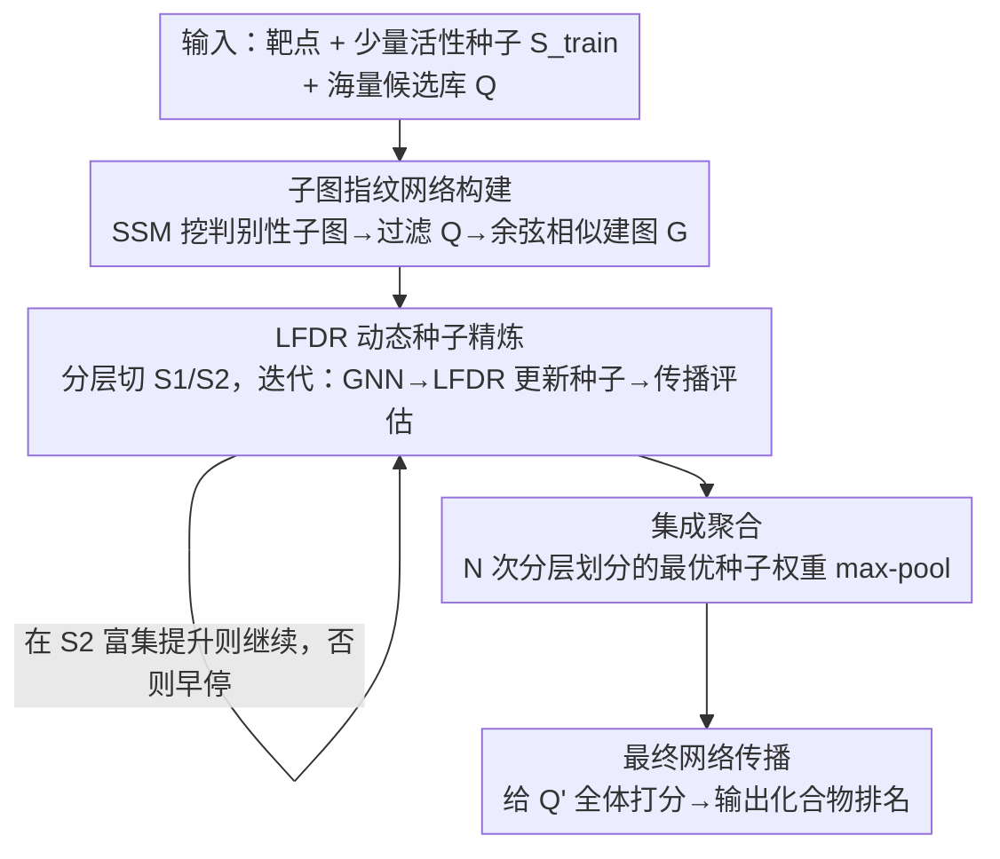

# SubDyve: Subgraph-Driven Dynamic Propagation for Virtual Screening Enhancement

**会议**: ICLR 2026  
**OpenReview**: [https://openreview.net/forum?id=9vo3J4LwoT](https://openreview.net/forum?id=9vo3J4LwoT)  
**领域**: 计算生物学 / 药物虚拟筛选 / 图网络传播  
**关键词**: 虚拟筛选, 网络传播, 判别性子图, 局部假发现率, 种子精炼

## 一句话总结
SubDyve 用「类别判别性子图」代替通用分子指纹来建相似度网络，再用局部假发现率（LFDR）引导的迭代种子精炼把少量已知活性分子安全地扩展成更多种子，在只有几十个活性标签的低标签虚拟筛选场景下，于 DUD-E 和千万级 ZINC 库上把早期富集指标（BEDROC / EF1%）大幅拉高。

## 研究背景与动机

**领域现状**：虚拟筛选（Virtual Screening, VS）要从 $10^{60}$ 量级的可合成类药分子空间里挑出对某个靶点有活性的化合物。早期药物发现里大多数靶点只有寥寥几个已知活性分子，所以「低标签」是常态。主流做法分两类：一类是用大规模均衡数据训练的监督式 GNN / 3D 表示模型；另一类是用 ChemBERTa、MoLFormer、AMOLE 这种在海量无标注分子上预训练的基础模型（FM）做零样本筛选。

**现有痛点**：监督式模型在低标签下严重过拟合；FM 类方法把每个化合物**独立**打分，捕捉不到分子之间的依赖关系。一条正交的路线是网络传播（Network Propagation, NP）——把已知活性分子当作分子相似图上的种子节点，让活性信号沿网络扩散，按候选与种子集合的全局连通性排序。NP 天然支持从少数标签泛化，但它有两个老毛病：① 相似图通常建在 ECFP 这类**通用指纹**上，编码不出区分活性/非活性的细粒度子结构，把关键的活性差异给抹平了；② NP 继承底层图的**拓扑偏置**，稠密簇里的节点光靠连通度就被排得很高，种子集合一小就疯狂膨胀假阳性。

**核心矛盾**：虚拟筛选的成败往往取决于近缘分子之间**细微的子结构差异**，而通用指纹 + 朴素传播既看不清这些子结构，又会被图的稠密区带偏，二者叠加导致低标签下精度崩盘。

**本文目标**：在严格低标签 / 零样本条件下，既要让相似网络编码**判别性子结构**，又要在种子扩展时**可控地压住假阳性**。

**切入角度**：作者把两件事拼起来——用监督式子图挖掘（SSM）选出类别判别性子图来建图，再借统计学里的局部假发现率（LFDR）给种子扩展一个**可证明的 FDR 上界**，让「越扩越歪」的传播变成「带刹车的扩展」。

**核心 idea**：用判别性子图指纹图代替通用指纹图，用 LFDR 引导的迭代种子精炼代替一次性传播，在扩展高置信候选的同时把假阳性关进可控范围。

## 方法详解

### 整体框架
SubDyve 解决的是「只有少量已知活性分子、要从海量候选里排出真活性」的排序问题。形式化地：候选分子集合为 $Q$，已知活性子集 $C\subset Q$，其中只有很小的种子子集 $S_{\text{train}}$ 可用；目标是给每个 $q\in Q$ 打相关性分数 $r(q)$，让活性分子排在前面。

整条管线分三段串行：**先建图**（用判别性子图把候选过滤一遍并建子图指纹相似网络），**再精炼种子**（在网络上做 LFDR 引导的迭代种子精炼，反复更新种子权重），**最后聚合排序**（把 $N$ 次分层划分各自的最优种子权重集成起来，做一轮最终传播给所有候选打分）。其中种子精炼这一段内部还有一个 $M$ 步的迭代回环：每步「GNN 训练 → LFDR 更新种子 → 传播评估」，靠在留出集 $S_2$ 上的富集分数早停。

### 关键设计

**1. 子图指纹网络构建：让相似度看见「定义活性的子结构」**

这一步针对的是 NP 的第一个老毛病——通用指纹（ECFP/MACCS）把区分活性的细微子结构抹平。SubDyve 不再用现成指纹，而是先用监督式子图挖掘算法 SSM，从带标签的种子集 $S_{\text{train}}$ 配上精挑的负样本里，挖出**类别判别性子图模式** $SP$（论文称为 DiSC，discriminative subgraph combination）。然后把每个分子编码成一个 $d$ 维的子图模式指纹，每一维记录某个判别性子图组合在该分子里的出现频率。

有了这套指纹，作者先做一次**候选过滤**：只保留至少命中一个 $SP$ 中子图的分子，得到收缩后的候选集 $Q'$——在千万级 ZINC 库上这一步直接把 1000 万压到约 3 万，让后续传播在算得动的规模上跑。再在 $Q'$ 上按子图指纹的两两余弦相似度建图 $G$，作为后面所有传播的骨架。和通用指纹图相比，这张图的边权重直接反映「共享了哪些判别性子结构」，所以近缘但活性不同的分子不会再被错误地拉近。

**2. LFDR 动态种子精炼：给种子扩展装上「假发现率刹车」**

这一步针对 NP 的第二个老毛病——种子集合小，信号要么扩散太广、要么涌向拓扑稠密区，特异性差、假阳性高。SubDyve 的做法是把种子集合**迭代地、可控地**扩大。它先把 $S_{\text{train}}$ 分层切成不相交的 $S_1$、$S_2$：$S_1$ 启动初始传播，$S_2$ 当作留出的「监督真值」用来指导精炼。

每一步迭代里做三件事。其一，**GNN 训练**：把子图指纹图 $G$ 喂进 GNN，得到每个分子的 logit $\hat l_i$ 和嵌入 $z_i$，训练目标是一个复合损失 $L_{\text{total}}=(1-\lambda_{\text{rank}})\cdot L_{\text{BCE}}+\lambda_{\text{rank}}\cdot L_{\text{RankNet}}+\lambda_{\text{contrast}}\cdot L_{\text{Contrast}}$——BCE 按活性分子的低占比加权来对抗类别不均衡，RankNet 让 $S_2$ 里的已知活性排在未标注候选之上，对比损失把每个分子和它最像的同伴拉近、其余推远。GNN 的输入特征 $x_i$ 本身就是一个拼起来的向量：种子权重 $w_i$、传播分数 $n_i^{\text{NP}}$、子图指纹 $f_i^{\text{FP}}$、PCA 隐空间里到 $S_1$ 的 RBF 相似度 $s_i^{\text{PCA}}$、把 PCA 排名与 NP 排名取平均的混合排名 $h_i^{\text{hyb}}$，以及 ChemBERTa 语义嵌入 $e_i^{\text{PT-CB}}$。

其二，**LFDR 引导的种子更新**，这是整套方法的统计核心。把 logit 标准化成 $z_i=(\hat l_i-\mu)/\sigma$，估计其局部假发现率 $q_i=\text{LFDR}(z_i)$，然后只保留 $q_i$ 低于阈值 $\tau_{\text{FDR}}$ 的分子当种子，并按下式更新权重：

$$S_{t+1}=\{i\in Q' : q_i<\tau_{\text{FDR}}\},\quad w_i^{(t+1)}=w_i^{(t)}+\beta\big(\sigma(z_i)-\pi_0\big)$$

其中 $\sigma(\cdot)$ 是 sigmoid，$\pi_0$ 是先验零假设概率，$\beta$ 控制更新速率。在双组混合模型 $f(z)=\pi_0 f_0(z)+\pi_1 f_1(z)$ 假设下，作者证明这条选择规则给出**可证明的 FDR 上界**（Proposition 1：$\text{mFDR}(R_\alpha)\le\alpha$ 且 $\text{FDR}(R_\alpha)\le\alpha$）——这就是「扩展种子但不放假阳性进来」的理论保证，也是它区别于朴素 NP 的关键。

其三，**传播与评估**：用更新后的种子权重再做一轮传播，在 $S_2$ 上用早期富集因子评估；注意早停只看富集分数、不直接用训练目标，避免泄漏偏置。富集提升就继续迭代，否则早停，并保留 $S_2$ 上表现最好的那组种子权重。

**3. 集成聚合与最终排序：用多次分层划分压住单次划分的随机性**

低标签下单次 $S_1/S_2$ 划分很不稳，一次划分得到的最优种子可能只是运气。SubDyve 因此做 $N$ 次分层划分，每次都把 $S_{\text{train}}$ 切成不相交的 $S_1$、$S_2$ 并跑一遍上面的迭代精炼，各自留下在 $S_2$ 上最优的种子权重。最后把 $N$ 组权重按**逐元素 max-pooling** 聚合成最终的集成种子向量——max 池化意味着「只要某次划分里某分子被高置信地认成种子，它就进最终种子集」，这样既汇集了多次划分的发现，又不会被某次划分的漏判拖累。用这个集成向量做最后一轮全库传播，给 $Q'$ 里所有分子打分，得到用于评测的最终排名。

### 损失函数 / 训练策略
核心训练目标是种子精炼阶段 GNN 的复合损失 $L_{\text{total}}$：类别加权的 BCE（抗不均衡）+ RankNet 成对排序（拔高已知活性）+ 对比损失（拉近相似分子）。$\lambda_{\text{rank}}$、$\lambda_{\text{contrast}}$ 为权重超参；LFDR 阈值 $\tau_{\text{FDR}}$、更新率 $\beta$、迭代步数 $M$、分层划分次数 $N$ 为主要超参。早停只依赖 $S_2$ 上的富集指标，避免直接用训练目标造成偏置。

## 实验关键数据

### 主实验

DUD-E 十靶点零样本筛选（threshold=0.9），报告 BEDROC（$\alpha=20$）与 EF1%，按平均排名比较：

| 方法 | BEDROC 平均排名 | EF1% 平均排名 |
|------|------|------|
| **SubDyve（本文）** | **1.6** | **1.6** |
| DrugCLIP | 2.4 | 2.0 |
| MoLFormer | 3.0 | 3.3 |
| CDPKit | 3.6 | 3.7 |
| AutoDock Vina | 4.0 | 4.0 |
| PharmacoMatch | 4.5 | 4.4 |

单靶点上优势明显：EGFR / PLK1 这两个构象灵活、结合模式多变的靶点，SubDyve 的 BEDROC 达 86 / 85，明显高于 MoLFormer 的 75 / 69；结合口袋又深又窄的 ACES 上 EF1% 达 57.0，远高于 DrugCLIP（32.4）和 AutoDock Vina（13.87）。摘要给出的最大优势为 BEDROC +34.0、EF1% +24.6。把 MMseqs2 同源相似度阈值从 0.9 收紧到 0.5（强迫种子来自更远的同源蛋白）后，SubDyve 仍在 EGFR/PLK1/SRC 上保持领先或持平，说明它不依赖高度相似的近缘同源蛋白。

CDK7 的 PU 式筛选（1,468 个活性 + 1000 万 ZINC，子图过滤后约 3 万候选）：

| 方法 | BEDROC(%) | EF0.5% | EF1% |
|------|------|------|------|
| **SubDyve（本文）** | **83.44** | **155.31** | **97.59** |
| rdkit + NP | 79.04 | 148.69 | 89.24 |
| GRAB（PU 学习） | 40.68 | 44.22 | 45.21 |
| PSICHIC | 9.37 | 4.07 | 6.92 |
| BIND（FM，2.4M 交互） | – | – | – |

相比 PU 学习基线 GRAB，EF1% 翻倍多（98.0 vs 45.2）、BEDROC 高 80% 以上；相比 PSICHIC，EF0.5% 高 38 倍、BEDROC 近 9 倍。在千万级交互上预训练的 FM 模型 BIND 几乎失效（EF10%=0.04），疑因分布失配。运行时间上 SubDyve（1,088s）比 AutoDock Vina（13,343s）快约 12.3×，比 DrugCLIP 省 15.06× 内存。

### 消融实验

子图网络 + LFDR 两大组件在 PU 数据上的消融（BEDROC / EF1%）：

| 子图指纹 | LFDR | BEDROC | EF1% |
|------|------|------|------|
| ✗ | ✗ | 79.04 | 89.24 |
| ✓ | ✗ | 78.68 | 89.68 |
| ✗ | ✓ | 63.78 | 67.22 |
| ✓ | ✓ | **83.44** | **97.59** |

### 关键发现
- **两组件是「互补」而非各自独立加分**：只加子图指纹只有微小提升（78.68）；只加 LFDR 反而**掉点**（BEDROC 79.04→63.78），因为 LFDR 精炼的质量取决于底层网络是否可靠，建在差网络上的精炼会放大错误。只有二者合用才达到最佳——绝大部分增益来自它们的交互。
- **低种子下依旧稳**：种子数 50/150/250 三档里 SubDyve 都领先，且无需像通用指纹那样按种子规模换最优指纹（50 用 MACCS、250 用 Avalon），免去了指纹专项调优。
- **LFDR 阈值不敏感**：$\tau\in\{0.05,0.10,0.30,0.50\}$ 下 BEDROC/EF 相对基线（$\tau=0.10$）的波动都在 ±0.5% 内，说明刹车强度在合理区间内鲁棒。
- **案例研究**：SubDyve 检索出的命中分子在子图指纹空间里和种子聚得更紧（PCA 可视化 + 种子–命中相似度热图），能找回共享功能性子结构的近缘活性分子，而 RDKit 指纹做不到。

## 亮点与洞察
- **把统计学的 LFDR 搬进网络传播**，给「种子越扩越歪」这个老问题一个**可证明的 FDR 上界**——这是从「凭经验设阈值」到「带理论保证地控制假阳性」的实质跨越，思路可迁移到任何「迭代扩展种子/伪标签」的半监督场景。
- **判别性子图指纹的「双重用途」很巧**：既用来过滤候选（千万→几万，让千万级库算得动），又用来建相似图（让相似度看见活性子结构），一套表示同时解决了「算力」和「精度」两件事。
- **max-pool 集成多次分层划分**：用「只要被某次高置信认可就保留」的聚合方式，把低标签下单次划分的高方差压下去，是个简单可复用的稳健化技巧。

## 局限与展望
- 强依赖 SSM 子图挖掘的质量：判别性子图选得好不好直接决定整张图和后续精炼的上限，而 SSM 需要精挑的负样本，负样本策略本身可能引入偏置。
- 子图过滤会把不含已挖子图的潜在活性分子直接排除在 $Q'$ 之外——若真活性恰好靠新颖骨架（不在 $S_{\text{train}}$ 覆盖的子图里），可能在过滤阶段就漏掉。
- LFDR 的 FDR 上界基于双组混合模型与零假设先验 $\pi_0$ 的估计，现实分布偏离该假设时理论保证会打折扣（⚠️ 证明细节以原文 Proposition 1 / Appendix A 为准）。
- 评测集中在 DUD-E 与 CDK7，靶点多样性仍有限；多个迭代回环 + $N$ 次划分 + 集成的流程相对复杂，超参（$M$、$N$、$\beta$、$\tau$）较多。

## 相关工作与启发
- **vs 基础模型（ChemBERTa / MoLFormer / AMOLE / BIND）**：FM 类零样本筛选独立给每个化合物打分，忽略分子间高阶依赖；SubDyve 用网络传播显式建模分子相互关系，且在 CDK7 上把在百万级交互上预训练的 BIND 远远甩开（BIND 几乎失效），说明低标签 + 分布失配下「关系建模 + 子结构感知」比「大规模预训练」更管用。
- **vs 通用指纹 + NP（Yi et al. 2023 系列）**：同样走网络传播，但它们用 ECFP/MACCS/RDKit 等通用指纹建图、做一轮传播；SubDyve 换成判别性子图指纹 + LFDR 迭代精炼，在 PU 数据上把最强的 rdkit+NP（BEDROC 79.04）提到 83.44。
- **vs PU 学习（GRAB）**：GRAB 用正–未标注学习推软标签；SubDyve 的种子精炼也在扩展监督信号，但多了 LFDR 的假发现率控制，EF1% 直接翻倍。
- **vs 子结构感知图（SSM / ACANet）**：这些方法把判别性子结构用于性质预测或活性悬崖检测，SubDyve 把同类思想首次系统地引入虚拟筛选的图构建 + 传播流程。

## 评分
- 新颖性: ⭐⭐⭐⭐⭐ 判别性子图建图 + LFDR 可证明 FDR 控制传播的组合在虚拟筛选里是新的，且解决了 NP 两个公认痛点。
- 实验充分度: ⭐⭐⭐⭐⭐ DUD-E 十靶点 + 千万级 ZINC 真实库 + 多种子规模 + 组件/阈值/多靶点消融，覆盖到位且带显著性检验。
- 写作质量: ⭐⭐⭐⭐ 结构清晰、图文对应，但大量关键细节（特征编码、LFDR 算法、损失定义）压进附录，正文略紧。
- 价值: ⭐⭐⭐⭐⭐ 低标签虚拟筛选是真实药物发现刚需，方法又快又省内存，落地价值高。

<!-- RELATED:START -->

## 相关论文

- [\[NeurIPS 2025\] AANet: Virtual Screening under Structural Uncertainty via Alignment and Aggregation](../../NeurIPS2025/computational_biology/aanet_virtual_screening_under_structural_uncertainty_via_alignment_and_aggregati.md)
- [\[AAAI 2026\] S2Drug: Bridging Protein Sequence and 3D Structure in Contrastive Representation Learning for Virtual Screening](../../AAAI2026/computational_biology/s2drug_bridging_protein_sequence_and_3d_structure_in_contrastive_representation_.md)
- [\[ICML 2026\] Advancing Ligand-based Virtual Screening and Molecular Generation with Pretrained Molecular Embedding Distance](../../ICML2026/computational_biology/advancing_ligand-based_virtual_screening_and_molecular_generation_with_pretraine.md)
- [\[ICLR 2026\] Drugging the Undruggable: Benchmarking and Modeling Fragment-Based Screening](drugging_the_undruggable_benchmarking_and_modeling_fragment-based_screening.md)
- [\[ICLR 2026\] WFR-FM: Simulation-Free Dynamic Unbalanced Optimal Transport](wfr-fm_simulation-free_dynamic_unbalanced_optimal_transport.md)

<!-- RELATED:END -->
